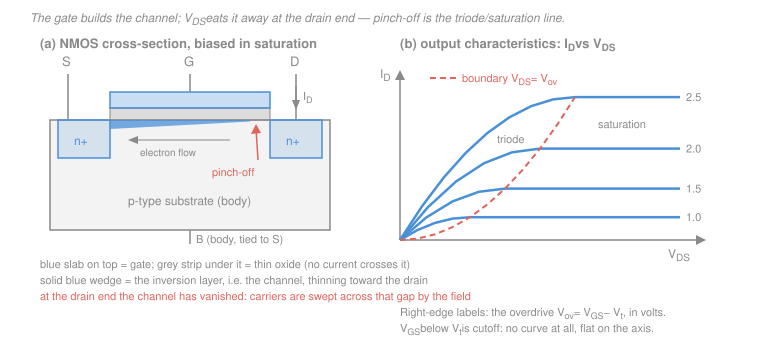

# Electronics & Semiconductors · Lesson 2.4: The MOSFET — how it works

> ⏱ ~15 min · Module 2: Transistors — BJT & MOSFET · Builds on: [2.1 The BJT: how it works](02-01-bjt-how-it-works.md), [1.1 Semiconductors, carriers & doping](01-01-semiconductors-carriers-doping.md), [`circuits` 1.4 Dividers](../../circuits/lessons/01-04-voltage-current-dividers.md) · Unlocks: [2.5 MOSFET biasing & common source](02-05-mosfet-biasing-common-source.md), [4.3 CMOS](04-03-cmos-inverter-gates.md)

## Why this matters

Count the transistors within three feet of you. Essentially all of them are MOSFETs, and essentially none are BJTs. That did not happen because the MOSFET amplifies better — it doesn't. It happened because of three things the BJT can't match.

**It costs nothing to hold on.** A BJT's base is a forward-biased diode: to keep $I_C = 1\ \text{mA}$ flowing with $\beta = 100$ you must *supply* $10\ \mu\text{A}$ of base current, forever, from whatever drives it. A MOSFET's gate sits on an insulating oxide layer. At DC, the gate current is zero — not "small", zero. One MOSFET output can drive a thousand MOSFET gates without sagging.

**It shrinks.** Halve every dimension of a MOSFET and it still works, only faster and smaller. Sixty years of that is why a chip holds billions of them.

**Complementary pairs burn no idle power.** Wire an n-channel and a p-channel device so that exactly one is off in each stable state, and the DC path from supply to ground is always broken. That's CMOS, and it's why a phone can hold a logic state for a day on a battery — the subject of [4.3](04-03-cmos-inverter-gates.md).

Everything in this lesson follows from one sentence, so read it twice: **the gate is a capacitor plate, not a current source.**

## The idea

Take a slab of p-type silicon — the **substrate** or **body**. Its mobile carriers are holes; electrons are scarce ([1.1](01-01-semiconductors-carriers-doping.md)). Now diffuse two heavily-doped n-type islands into the top surface a short distance apart. Call them **source** and **drain**. Between them, cover the surface with a very thin layer of insulating oxide, and put a conducting plate — the **gate** — on top of that.

With nothing connected, is there a path from source to drain? No. You'd have to go n-to-p-to-n: two pn junctions back to back, and whichever way you push, one of them is reverse biased. The device is off.

Now put a positive voltage on the gate. The gate and the substrate surface are the two plates of a capacitor with the oxide as its dielectric ([`em-refresher` 2.1](../../em-refresher/lessons/02-01-capacitance.md)). No charge crosses the oxide — but a field reaches through it, and that field does two things in sequence:

1. **First it evicts.** The positive gate pushes the p-type substrate's holes away from the surface, leaving behind a **depletion region** of fixed negative acceptor ions. Still no conduction: no mobile carriers there.
2. **Then it invites.** Push harder, and the field starts pulling the substrate's few *minority* electrons up to the surface — and pulling more in from the n+ source, which has electrons to spare. At some gate voltage the electron concentration at the surface exceeds the hole concentration, and that sliver of silicon has effectively *become n-type*. This is the **inversion layer**, and it is a continuous n-type bridge from source to drain.

That gate voltage is the **threshold voltage** $V_t$. Below it, no channel. Above it, a channel — and the more you exceed $V_t$, the more electrons you pull in and the more conductive the bridge becomes.

> **The gate creates the channel; it does not feed it.** The current that flows source-to-drain is drawn from the drain supply, not from the gate. The gate just sets how wide the pipe is, electrostatically, through an insulator.

That one fact explains the zero DC gate current, the fact that a MOSFET's input looks like a *capacitance* rather than a resistance (which is what limits switching speed and gives rise to the Miller effect in [4.2](04-02-frequency-response-gain-bandwidth.md)), and why nothing you do at the gate loads the circuit that drives it.

Now the second half of the story. Once the channel exists, raise the drain voltage $V_{DS}$ and current flows. But $V_{DS}$ also *fights* the gate: the channel is not at a single potential — it sits at $0$ near the source and at $V_{DS}$ near the drain. The voltage *across the oxide* is therefore $V_{GS}$ at the source end but only $V_{GS} - V_{DS}$ at the drain end. So the channel is thick at the source and thin at the drain, and it gets more lopsided as $V_{DS}$ rises. When $V_{DS}$ reaches $V_{GS} - V_t$, the drain-end oxide voltage has fallen exactly to $V_t$ — the inversion layer *vanishes* right there. That's **pinch-off**, and it splits the device's behavior into the two regions below.

## The formal version

Symbols, all for an **enhancement-mode n-channel (NMOS)** device with the body tied to the source:

- $V_{GS}$ — gate-to-source voltage (V), the control input.
- $V_{DS}$ — drain-to-source voltage (V).
- $V_t$ — threshold voltage (V); positive for enhancement NMOS, typically $0.3$–$1\ \text{V}$.
- $V_{ov} \equiv V_{GS} - V_t$ — the **overdrive voltage** (V). How far past threshold you are. This, not $V_{GS}$, is the number that appears in every formula.
- $k_n' = \mu_n C_{ox}$ — the **process transconductance parameter** ($\text{A/V}^2$), fixed by the fab: electron mobility times oxide capacitance per area. Think $100$–$200\ \mu\text{A/V}^2$.
- $W/L$ — the channel's width-to-length **aspect ratio**, dimensionless. *This is the designer's knob*, chosen per transistor.
- $k_n \equiv k_n'(W/L)$ — the device transconductance parameter ($\text{A/V}^2$). Shorthand used below.
- $I_D$ — drain current (A), flowing **into** the drain and out the source.

### Cutoff — $V_{GS} < V_t$

$$I_D \approx 0.$$

*In words: not enough gate voltage to invert the surface, so there is no channel and the device is an open switch.* (Real devices leak a subthreshold current that falls off exponentially; at this level, treat it as zero.)

### Triode (also "linear" or "ohmic") — $V_{GS} > V_t$ **and** $V_{DS} < V_{ov}$

The channel exists across the whole gap. Every extra volt of $V_{DS}$ pushes more current:

$$I_D = k_n'\frac{W}{L}\left[(V_{GS}-V_t)\,V_{DS} - \tfrac{1}{2}V_{DS}^2\right] = k_n\left[V_{ov}V_{DS} - \tfrac12 V_{DS}^2\right].$$

*In words: current rises with drain voltage, but with a droop, because raising $V_{DS}$ thins the channel at the drain end even as it pushes harder.*

For $V_{DS} \ll V_{ov}$ the squared term is negligible and $I_D \approx k_n V_{ov} V_{DS}$ — **current proportional to voltage**. That is Ohm's law, with a resistance you set from the gate:

$$\boxed{\;R_{on} \approx \frac{1}{k_n' (W/L)\,V_{ov}}\;}$$

*In words: near the origin a MOSFET is a resistor whose value you dial with $V_{GS}$.* Turn $V_{ov}$ up and $R_{on}$ falls toward a few ohms — a closed switch. This is the entire basis of CMOS logic ([4.3](04-03-cmos-inverter-gates.md)) and of analog switches.

### Saturation — $V_{GS} > V_t$ **and** $V_{DS} \ge V_{ov}$

The channel has pinched off at the drain end. Here is the part that feels wrong the first time: the current does **not** collapse. It goes flat.

Why? At pinch-off the channel ends a hair short of the drain, and the leftover gap is depleted, with a strong lateral field across it. Electrons arriving at the pinch-off point are swept across that gap like water over a waterfall — every one that reaches the edge makes it to the drain. Raise $V_{DS}$ further and you widen the waterfall, but you don't change how much water reaches the lip. The *channel* portion still sees the same end-to-end drop, $V_{ov}$, so it still delivers the same current. Set $V_{DS} = V_{ov}$ in the triode equation and you get the flat value:

$$\boxed{\;I_D = \tfrac12 k_n'\frac{W}{L}\left(V_{GS}-V_t\right)^2 = \tfrac12 k_n V_{ov}^2\;}$$

*In words: in saturation the drain current is set by the gate alone — quadratically — and is nearly independent of the drain voltage.* A voltage-controlled current source: exactly what you need to amplify, which is [2.5](02-05-mosfet-biasing-common-source.md)'s job.

### Channel-length modulation

"Nearly" independent. Raising $V_{DS}$ past pinch-off pushes the pinch-off point slightly back toward the source, shortening the effective channel and nudging $I_D$ up. Empirically:

$$I_D = \tfrac12 k_n' \frac{W}{L} V_{ov}^2\,(1 + \lambda V_{DS}), \qquad r_o = \frac{1}{\lambda I_D},$$

with $\lambda$ the channel-length modulation parameter ($\text{V}^{-1}$, typically $0.01$–$0.1$, smaller for long channels). *In words: the saturation curves tilt slightly upward, and that slope is a finite output resistance $r_o$.* This is the MOSFET's version of the BJT's Early effect, and it caps the gain of every stage in [2.5](02-05-mosfet-biasing-common-source.md). Example: $\lambda = 0.02\ \text{V}^{-1}$ at $I_D = 1\ \text{mA}$ gives $r_o = 1/(0.02 \times 0.001) = 50\ \text{k}\Omega$.

### Square law vs. exponential: MOSFET against BJT

The transconductance $g_m$ measures how hard the input controls the output, $g_m = \partial I_{\text{out}}/\partial v_{\text{in}}$. Differentiating the saturation law gives $g_m = k_n V_{ov} = 2I_D/V_{ov}$, versus the BJT's $g_m = I_C/V_T$ with $V_T \approx 25\ \text{mV}$ at room temperature ([2.3](02-03-bjt-small-signal-amplifiers.md)).

| | BJT (npn) | MOSFET (NMOS) |
|---|---|---|
| Control variable | $V_{BE}$ | $V_{GS}$ |
| DC input current | $I_B = I_C/\beta$, nonzero | zero (gate is insulated) |
| Transfer law | exponential, $I_C = I_S e^{V_{BE}/V_T}$ | square law, $I_D = \tfrac12 k_n V_{ov}^2$ |
| $g_m$ at $I = 1\ \text{mA}$ | $I_C/V_T = 40\ \text{mA/V}$ | $2I_D/V_{ov} = 5\ \text{mA/V}$ at $V_{ov} = 0.4\ \text{V}$ |
| Designer's size knob | none (device area barely matters) | $W/L$, chosen per transistor |
| Device matching | excellent (set by $I_S$, well controlled) | poorer (threshold varies device to device) |
| Integration density | low | very high |

Read the fourth row carefully: at the same bias current the BJT gives roughly eight times the transconductance here, and the gap grows as $V_{ov}$ grows — a MOSFET biased at $V_{ov} = 2\ \text{V}$ manages only $1\ \text{mA/V}$, forty times worse. The exponential is simply a steeper function than the square. That is why discrete high-gain, low-noise analog front ends still use BJTs. What you get back is the $W/L$ row: a MOSFET's strength is a *design variable* with no BJT equivalent, so you can make one device ten times stronger than its neighbour by drawing it ten times wider on the mask.

### The naming trap

Say this out loud once:

> **MOSFET saturation is the amplifying region. BJT saturation is the fully-on switch region.** The same word means opposite things.

The correspondence you actually want is:

| Job | BJT | MOSFET |
|---|---|---|
| Off | cutoff | cutoff |
| Amplifying (controlled current source) | **active** | **saturation** |
| Fully on (small voltage across it, low resistance) | **saturation** | **triode** |

The words came from different histories: a BJT "saturates" when its base is flooded with more current than $\beta$ can use, while a MOSFET's current "saturates" in the sense of *levelling off* with $V_{DS}$. Both are reasonable; together they are a trap. See [2.1](02-01-bjt-how-it-works.md) for the BJT side.

### PMOS in one paragraph

A **p-channel** device is the same physics with every sign flipped: n-type substrate, p+ source and drain, and a *negative* gate voltage that inverts the surface to p-type. So $V_t$ is negative, $V_{GS}$ must be *more negative* than $V_t$ to turn on, and conventional current flows **source to drain**, with the source tied to the positive rail $V_{DD}$. Conditions become $V_{SG} > |V_t|$ to conduct and $V_{SD} \ge V_{SG} - |V_t|$ for saturation — read every inequality with the terminals swapped and you cannot go wrong. One physical asymmetry survives the sign flip: the carriers are holes, and hole mobility in silicon is roughly one-half to one-third of electron mobility ([1.1](01-01-semiconductors-carriers-doping.md)), so $k_p' < k_n'$ and a PMOS is inherently the slower device. Designers compensate by drawing PMOS transistors two to three times wider — a fact [4.3](04-03-cmos-inverter-gates.md) uses to make a CMOS inverter switch symmetrically.

## Picture

Panel (b) is the plot to hold in your head. Each blue curve is one fixed $V_{GS}$: it climbs steeply (triode), bends, and flattens (saturation). The coral dashed parabola $I_D = \tfrac12 k_n V_{DS}^2$ is the locus of the bend points — it is exactly the condition $V_{DS} = V_{ov}$, and it separates the two regions. Left of it, triode; right of it, saturation.

## Worked examples

**Example 1 (assume and verify — including a failed guess).** An NMOS has $V_t = 1\ \text{V}$ and $k_n = k_n'(W/L) = 2\ \text{mA/V}^2$. Its source is grounded, its drain goes through $R_D = 1\ \text{k}\Omega$ to $V_{DD} = 10\ \text{V}$, and its gate is held at a fixed $V_G$. Find the operating point for $V_G = 3\ \text{V}$, then for $V_G = 4\ \text{V}$.

You cannot know the region before you solve, so the standard move is: **assume saturation, solve, then check $V_{DS} \ge V_{ov}$.** If the check fails, redo in triode.

*Case A, $V_G = 3\ \text{V}$.* Source grounded, so $V_{GS} = 3\ \text{V}$ and $V_{ov} = 3 - 1 = 2\ \text{V}$. Assume saturation:

$$I_D = \tfrac12 (2)(2)^2 = 4\ \text{mA}, \qquad V_{DS} = V_{DD} - I_D R_D = 10 - (4)(1) = 6\ \text{V}.$$

Check: is $V_{DS} \ge V_{ov}$? $6 \ge 2$ — yes. Saturation confirmed; $I_D = 4\ \text{mA}$, $V_{DS} = 6\ \text{V}$.

*Case B, $V_G = 4\ \text{V}$.* Now $V_{ov} = 3\ \text{V}$. Assume saturation again:

$$I_D = \tfrac12 (2)(3)^2 = 9\ \text{mA}, \qquad V_{DS} = 10 - (9)(1) = 1\ \text{V}.$$

Check: is $1 \ge 3$? **No.** The assumption is wrong — the resistor cannot support that much current without collapsing the drain voltage. Discard it and redo in triode, where $I_D$ (in mA, with volts) obeys both the device law and KVL:

$$I_D = 2\left[3V_{DS} - \tfrac12 V_{DS}^2\right], \qquad I_D = \frac{10 - V_{DS}}{1}.$$

Setting them equal: $6V_{DS} - V_{DS}^2 = 10 - V_{DS}$, i.e. $V_{DS}^2 - 7V_{DS} + 10 = 0$, so $V_{DS} = 2\ \text{V}$ or $5\ \text{V}$. Triode requires $V_{DS} < V_{ov} = 3\ \text{V}$, so take $V_{DS} = 2\ \text{V}$ and $I_D = (10-2)/1 = 8\ \text{mA}$.

*Check.* Plug back into the triode law: $2[3(2) - \tfrac12(4)] = 2(6-2) = 8\ \text{mA}$, matching KVL. And $V_{GS} = 4 > V_t$ with $V_{DS} = 2 < 3$ — both triode conditions hold. Note the moral: turning the gate *up* drove this stage out of saturation and into triode. Keeping a stage saturated is precisely the biasing problem of [2.5](02-05-mosfet-biasing-common-source.md).

**Example 2 (why you'd care — the transistor as a switch).** An NMOS with $V_t = 1\ \text{V}$ and $k_n = 2\ \text{mA/V}^2$ sits between an output node and ground; the node is pulled up to $V_{DD} = 5\ \text{V}$ through $R = 10\ \text{k}\Omega$. Drive the gate to $5\ \text{V}$. What is the output voltage?

With the output near ground, $V_{DS}$ will be tiny while $V_{ov} = 5 - 1 = 4\ \text{V}$, so we are deep in triode and the device is a resistor:

$$R_{on} = \frac{1}{k_n V_{ov}} = \frac{1}{(2\ \text{mA/V}^2)(4\ \text{V})} = \frac{1}{8\ \text{mA/V}} = 125\ \Omega.$$

Now it's just a voltage divider ([`circuits` 1.4](../../circuits/lessons/01-04-voltage-current-dividers.md)):

$$V_{out} = V_{DD}\frac{R_{on}}{R + R_{on}} = 5\,\frac{125}{10{,}125} = 0.0617\ \text{V} = 62\ \text{mV}.$$

*Check.* Was "deep triode" justified? $V_{DS} = 62\ \text{mV}$ against $V_{ov} = 4\ \text{V}$ — the discarded $\tfrac12 V_{DS}^2$ term is under one percent of the linear one, so yes. And $62\ \text{mV}$ is a solid logic low.

But look at the current: $I = (5 - 0.062)/10\ \text{k}\Omega = 0.494\ \text{mA}$, dissipating $5 \times 0.494 = 2.5\ \text{mW}$ **the entire time the output is low**. A million such gates would burn 2.5 kW doing nothing. Replace the pull-up resistor with a PMOS that switches *off* whenever the NMOS is on and that number goes to essentially zero. That is the CMOS inverter, and it is why [4.3](04-03-cmos-inverter-gates.md) exists.

## Watch out

- **You might think "saturation" means the same thing it did for the BJT.** It means the opposite. MOSFET saturation is the *amplifying* region (BJT analogue: **active**); the MOSFET's fully-on switch region is **triode** (BJT analogue: **saturation**). Every time you read "saturated transistor," check which device you're holding.
- **You might think you can plug any $V_{DS}$ into the triode equation.** You can't — it's only valid for $V_{DS} \le V_{ov}$. Past that point the parabola $k_n[V_{ov}V_{DS} - \tfrac12 V_{DS}^2]$ turns over and starts *decreasing*, predicting that more drain voltage gives less current. Physically absurd; mathematically it's just the equation being used outside its domain. Beyond $V_{DS} = V_{ov}$ the curve is flat, not falling.
- **You might think zero gate current means the gate is free to drive.** At DC, yes. At speed, no — the gate is a capacitor, and charging it to $V_{DD}$ in time $\Delta t$ takes $i = C_g\,dv/dt$. That transient current is what sets a logic gate's switching delay and its dynamic power ([4.3](04-03-cmos-inverter-gates.md)), and, fed back through the drain, it becomes the Miller effect that limits amplifier bandwidth ([4.2](04-02-frequency-response-gain-bandwidth.md)).

## One-liner

> The gate is a capacitor plate that conjures an n-type channel out of p-type silicon once $V_{GS}$ passes $V_t$; drain voltage then eats that channel from the drain end, giving an ohmic resistor while $V_{DS} < V_{ov}$ and a flat, square-law current source once it pinches off.

## Problems

**P1 (🟢)** An NMOS has $V_t = 0.8\ \text{V}$ and $k_n = k_n'(W/L) = 1\ \text{mA/V}^2$. For each bias below, name the region and compute $I_D$ (ignore channel-length modulation).
(a) $V_{GS} = 0.5\ \text{V}$, $V_{DS} = 3\ \text{V}$.
(b) $V_{GS} = 2.8\ \text{V}$, $V_{DS} = 1.0\ \text{V}$.
(c) $V_{GS} = 2.0\ \text{V}$, $V_{DS} = 4.0\ \text{V}$.

**P2 (🟡)** An NMOS with $V_t = 1\ \text{V}$ and $k_n = 1\ \text{mA/V}^2$ has its source grounded, its gate at a fixed $3\ \text{V}$, and its drain tied to $V_{DD} = 12\ \text{V}$ through $R_D$.
(a) With $R_D = 2\ \text{k}\Omega$, find $I_D$ and $V_{DS}$, and verify the region.
(b) What value of $R_D$ puts the device exactly at the edge between saturation and triode?

**P3 (🔴)** Same device and supply as P2, but now $R_D = 8\ \text{k}\Omega$. Find $I_D$ and $V_{DS}$. Then compute the device's DC resistance $V_{DS}/I_D$ and compare it to the small-$V_{DS}$ estimate $R_{on} = 1/(k_n V_{ov})$ — explain the discrepancy.

Solutions

**P1** In every case first form the overdrive $V_{ov} = V_{GS} - V_t$, then compare $V_{DS}$ to it.

(a) $V_{GS} = 0.5\ \text{V} < V_t = 0.8\ \text{V}$: below threshold, so no inversion layer forms. **Cutoff**, $I_D \approx 0$. ($V_{DS}$ is irrelevant — with no channel, the drain sees a reverse-biased junction.)

(b) $V_{ov} = 2.8 - 0.8 = 2.0\ \text{V}$, and $V_{DS} = 1.0\ \text{V} < 2.0\ \text{V}$, so **triode**:

$$I_D = k_n\left[V_{ov}V_{DS} - \tfrac12 V_{DS}^2\right] = 1\left[(2.0)(1.0) - \tfrac12 (1.0)^2\right] = 2.0 - 0.5 = 1.5\ \text{mA}.$$

(c) $V_{ov} = 2.0 - 0.8 = 1.2\ \text{V}$, and $V_{DS} = 4.0\ \text{V} \ge 1.2\ \text{V}$, so **saturation**:

$$I_D = \tfrac12 k_n V_{ov}^2 = \tfrac12 (1)(1.2)^2 = \tfrac12 (1.44) = 0.72\ \text{mA}.$$

*Check.* Sanity on (b) vs (c): (b) has the larger overdrive and so must carry more current, and it does ($1.5 > 0.72$). Also (b)'s saturation ceiling would be $\tfrac12(1)(2.0)^2 = 2.0\ \text{mA}$, and $1.5\ \text{mA}$ sits below it, as any triode point must.

**P2** (a) Source grounded, so $V_{GS} = 3\ \text{V}$ and $V_{ov} = 2\ \text{V}$. Assume saturation:

$$I_D = \tfrac12 (1)(2)^2 = 2\ \text{mA}, \qquad V_{DS} = 12 - (2\ \text{mA})(2\ \text{k}\Omega) = 12 - 4 = 8\ \text{V}.$$

Check $V_{DS} \ge V_{ov}$: $8 \ge 2$ — holds comfortably. **Saturation**, $I_D = 2\ \text{mA}$, $V_{DS} = 8\ \text{V}$.

(b) The edge is $V_{DS} = V_{ov} = 2\ \text{V}$. The square law still applies there, so $I_D$ is still $2\ \text{mA}$, and KVL fixes $R_D$:

$$R_D = \frac{V_{DD} - V_{DS}}{I_D} = \frac{12 - 2}{2\ \text{mA}} = \frac{10\ \text{V}}{2\ \text{mA}} = 5\ \text{k}\Omega.$$

*Check.* Both equations agree at the edge — the triode law at $V_{DS} = V_{ov} = 2$ gives $1[(2)(2) - \tfrac12(4)] = 2\ \text{mA}$, matching the saturation value. Any $R_D > 5\ \text{k}\Omega$ pushes the device into triode; anything smaller keeps it saturated.

**P3** Assume saturation first, as always: $I_D = 2\ \text{mA}$ would give $V_{DS} = 12 - (2)(8) = -4\ \text{V}$. Impossible, so the assumption fails and the device is in **triode**. Solve the device law and KVL simultaneously (currents in mA, voltages in V, resistance in $\text{k}\Omega$):

$$I_D = 1\left[2V_{DS} - \tfrac12 V_{DS}^2\right], \qquad I_D = \frac{12 - V_{DS}}{8}.$$

Multiply the first by 8 and set equal: $16V_{DS} - 4V_{DS}^2 = 12 - V_{DS}$, i.e.

$$4V_{DS}^2 - 17V_{DS} + 12 = 0 \;\Longrightarrow\; V_{DS} = \frac{17 \pm \sqrt{289-192}}{8} = \frac{17 \pm \sqrt{97}}{8}.$$

With $\sqrt{97} \approx 9.849$: $V_{DS} = 0.894\ \text{V}$ or $3.356\ \text{V}$. Triode demands $V_{DS} < V_{ov} = 2\ \text{V}$, so the root is $V_{DS} = 0.894\ \text{V}$, and

$$I_D = \frac{12 - 0.894}{8} = \frac{11.106}{8} = 1.388\ \text{mA}.$$

DC resistance: $V_{DS}/I_D = 0.894/1.388 = 0.644\ \text{k}\Omega = 644\ \Omega$. The small-signal estimate near the origin is $R_{on} = 1/(k_n V_{ov}) = 1/[(1\ \text{mA/V}^2)(2\ \text{V})] = 500\ \Omega$.

The estimate is 22 percent low because it drops the $-\tfrac12 V_{DS}^2$ term, which is only negligible for $V_{DS} \ll V_{ov}$. Here $V_{DS} = 0.894\ \text{V}$ is nearly half of $V_{ov} = 2\ \text{V}$ — the channel is already noticeably thinned at the drain end, so the device is *more* resistive than the origin-slope value.

*Check.* Substitute back into the device law: $2(0.894) - \tfrac12(0.894)^2 = 1.788 - 0.400 = 1.388\ \text{mA}$, matching the KVL value. And the rejected root $3.356\ \text{V}$ exceeds $V_{ov}$, confirming it lies on the unphysical falling side of the triode parabola.

## Flashback

**From Lesson 1.4 (Clippers, clampers & the Zener regulator):** A poorly regulated 12 V rail feeds a $5.1\ \text{V}$ Zener shunt regulator through a series resistor $R_s = 220\ \Omega$; treat the Zener as ideal in breakdown ($r_z \approx 0$). The load draws $15\ \text{mA}$. Find the Zener current. Then the load is unplugged — what Zener current and power dissipation must the diode survive?

Solution

The Zener holds the output at $5.1\ \text{V}$, so the drop across $R_s$ is fixed at $12 - 5.1 = 6.9\ \text{V}$ regardless of how the current splits:

$$I_{R_s} = \frac{6.9\ \text{V}}{220\ \Omega} = 31.4\ \text{mA}.$$

KCL at the output node: that current divides between the Zener and the load, so

$$I_Z = I_{R_s} - I_L = 31.4 - 15 = 16.4\ \text{mA}.$$

Unplug the load and the whole $31.4\ \text{mA}$ must go through the Zener — the shunt regulator's defining behavior is that the diode *absorbs* whatever the load doesn't take. Its dissipation is then

$$P_Z = V_Z I_Z = (5.1)(31.4\ \text{mA}) = 160\ \text{mW},$$

so a $250\ \text{mW}$ (quarter-watt) part is the minimum, and a $500\ \text{mW}$ part is the sane choice.

*Check.* Worst case for the diode is **no load**, not full load — the opposite of the intuition you'd bring from a series regulator. Also $16.4\ \text{mA}$ comfortably exceeds the few-mA knee current a Zener needs to stay in breakdown, so the rail really is regulated at full load.

## Connections

- **Backward:** the inversion layer is [1.1](01-01-semiconductors-carriers-doping.md)'s minority carriers pulled to the surface until they outnumber the majority ones; the off-state is [1.2](01-02-pn-junction-diode-models.md)'s back-to-back reverse-biased junctions; the gate-oxide-substrate sandwich is a plain parallel-plate capacitor from [`em-refresher` 2.1](../../em-refresher/lessons/02-01-capacitance.md). And the whole assume-then-verify procedure is the same discipline you used to pick a BJT region in [2.1](02-01-bjt-how-it-works.md).
- **Forward:** [2.5](02-05-mosfet-biasing-common-source.md) puts the device in saturation on purpose and reads off $g_m = 2I_D/V_{ov}$ and the gain $-g_m(R_D \parallel r_o)$ — both of which come straight from the square law and $\lambda$ above. [4.3](04-03-cmos-inverter-gates.md) uses the other two regions (cutoff and triode) as an open and closed switch, and needs the PMOS mobility asymmetry to size its devices.
- **Sideways:** the mobility $\mu_n$ hiding inside $k_n'$ is measured and explained in [`condensed-matter` 4.4](../../condensed-matter/lessons/04-04-transport-mobility-hall.md), and the surface physics, threshold engineering, and short-channel effects we're skipping belong to [semiconductor-devices](../../semiconductor-devices/syllabus.md). Note also how the two-terminal picture generalizes: the diode's exponential and the MOSFET's square law are both just $I(V)$ curves, and the load-line construction from [1.2](01-02-pn-junction-diode-models.md) is exactly what Example 1 solved algebraically.
