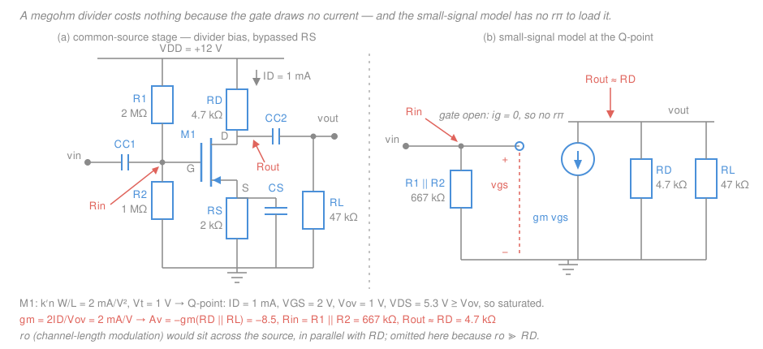

# Electronics & Semiconductors · Lesson 2.5: MOSFET biasing & the common-source amplifier

> ⏱ ~15 min · Module 2: Transistors — BJT & MOSFET · Builds on: [2.4 The MOSFET: how it works](02-04-mosfet-how-it-works.md), [2.2 BJT DC biasing](02-02-bjt-dc-biasing.md), [2.3 BJT small-signal amplifiers](02-03-bjt-small-signal-amplifiers.md) · Unlocks: Module 3 (op-amps), [4.3 CMOS](04-03-cmos-inverter-gates.md)

## Why this matters

Module 2 opened with the BJT. It closes with the device that actually won: essentially every transistor ever fabricated is a MOSFET. You already know how it conducts ([2.4](02-04-mosfet-how-it-works.md)) — now you bias one and read off its gain. The *procedure* is the one you ran in [2.2](02-02-bjt-dc-biasing.md) and [2.3](02-03-bjt-small-signal-amplifiers.md), so lean on that. The interesting content is the three places it diverges: the gate is free to drive, the bias equation is a **quadratic with a booby-trapped second root**, and the transconductance is far weaker. Those three facts explain the whole modern division of labor — MOSFETs everywhere in logic, switching, and integrated circuits; BJTs still on the bench when you want raw gain from a discrete part.

## The idea

**Biasing.** Same goal as the BJT: park the device in its amplifying region with room to swing, and make that parking spot immune to part-to-part variation. Two things change.

1. **The gate is the plate of a capacitor**, so it draws *no* DC current. In the BJT you had to make the divider "stiff" — bleed roughly ten times $I_B$ through it — so that $\beta$ spread couldn't drag the base voltage around. Here there is no $I_B$ to worry about, so $R_1$ and $R_2$ can be **megohms** and $V_G$ is still exactly the unloaded divider value. That also means the amplifier's input resistance is $R_1\parallel R_2$ with nothing else in parallel — hundreds of kilohms, easily.
2. **But you pay for it.** There is no MOSFET equivalent of "$V_{BE}\approx 0.7$ V". Because the transfer law is a *square law* rather than an exponential, $V_{GS}$ sits wherever the algebra puts it, anywhere from $V_t$ up to several volts — and both $V_t$ and the process/geometry factor $k_n'\frac{W}{L}$ scatter badly from part to part (worse than BJT $\beta$ does). So the source resistor $R_S$, the exact analogue of the BJT's $R_E$, does *more* work here, not less.

**Small signal.** The model is *simpler* than the BJT's, for the same reason: no gate current means the gate is an open circuit, so there is **no $r_\pi$**. One dependent current source and you're done.

**But the gain is weaker, and that is the whole story of the device.** A BJT's collector current is *exponential* in $V_{BE}$, and the derivative of an exponential is proportional to itself — so its transconductance grows *linearly* with bias current. A MOSFET's drain current is only *quadratic* in $V_{GS}$, and the derivative of a parabola grows only as the square root of its height. Same current, ten times less lever.

## The formal version

### Voltage-divider bias with source degeneration

Symbols, all first use: $V_{DD}$ the supply rail (V); $R_1,R_2$ the gate divider ($\Omega$); $R_D$ the drain resistor and $R_S$ the source resistor ($\text{k}\Omega$ throughout, so that currents come out in $\text{mA}$); $I_D$ the drain current ($\text{mA}$); $V_t$ the threshold voltage (V); $k_n' = \mu_n C_{ox}$ the process transconductance parameter and $W/L$ the channel aspect ratio, which always appear together as $k_n'\frac{W}{L}$ ($\text{mA/V}^2$, written $k_n$ for short in [2.4](02-04-mosfet-how-it-works.md) — spelled out here so the $W/L$ design knob stays visible); $V_{ov} = V_{GS}-V_t$ the overdrive (V).

Because $I_G = 0$, the divider is unloaded and

$$V_G = V_{DD}\,\frac{R_2}{R_1+R_2},$$

*In words: the gate voltage is the plain divider ratio — exact, whatever the resistor magnitudes.* KVL from gate to ground through the source resistor gives the second equation,

$$V_{GS} = V_G - I_D R_S,$$

and the saturation square law from [2.4](02-04-mosfet-how-it-works.md) gives the third:

$$I_D = \tfrac12 k_n'\frac{W}{L}\,(V_{GS}-V_t)^2 \equiv K\,(V_{GS}-V_t)^2, \qquad K \equiv \tfrac12 k_n'\frac{W}{L}.$$

Substituting the second into the third leaves one equation in $I_D$ — and it is **quadratic**:

$$I_D = K\,(V_G - V_t - I_D R_S)^2 \quad\Longrightarrow\quad \boxed{\;K R_S^2\, I_D^2 \;-\; \bigl[2K R_S (V_G - V_t) + 1\bigr] I_D \;+\; K (V_G-V_t)^2 = 0.\;}$$

Two roots come out, and **only one is physical**. Squaring threw away a sign: the spurious root solves the algebra with $V_{GS}-V_t$ *negative*, which the real device never does — a negative overdrive means the channel is gone and $I_D = 0$. So always back-substitute both roots into $V_{GS} = V_G - I_D R_S$ and **discard the one with $V_{GS} < V_t$**. (It is always the larger root.)

There is a shortcut that never produces the bad root. Solve for the overdrive instead of the current: $I_D = K V_{ov}^2$ and $I_D R_S = V_G - V_t - V_{ov}$, so

$$K R_S V_{ov}^2 + V_{ov} - (V_G - V_t) = 0 \quad\Longrightarrow\quad V_{ov} = \frac{-1+\sqrt{\,1 + 4K R_S (V_G - V_t)\,}}{2K R_S},$$

taking the $+$ sign because $V_{ov}>0$ by definition. *In words: solve for how far above threshold the gate sits, and the physics picks the root for you.* Then $I_D = K V_{ov}^2$ and $V_{GS} = V_t + V_{ov}$.

Finally, check saturation. With $V_S = I_D R_S$ and $V_D = V_{DD} - I_D R_D$,

$$V_{DS} = V_{DD} - I_D (R_D + R_S) \;\ge\; V_{ov} \qquad \text{(saturation condition, from 2.4).}$$

### Why $R_S$ stabilizes the Q-point

Same negative-feedback argument as the BJT's $R_E$, one sentence: **if $I_D$ drifts up, the source terminal rises, so $V_{GS} = V_G - I_D R_S$ falls, which pulls $I_D$ back down.** The gate is held at a fixed $V_G$ by the divider, so the source resistor turns any current error into a corrective gate-source error.

How much does it buy? Rearranged, $I_D R_S = (V_G - V_t) - V_{ov}$. If $R_S$ is chosen large enough that the drop $I_D R_S$ dominates the overdrive, then $I_D \approx (V_G - V_t)/R_S$ — set by *resistors*, not by the transistor. Concretely, in the design below ($K = 1\ \text{mA/V}^2$, $R_S = 2\ \text{k}\Omega$, $V_G - V_t = 3\ \text{V}$, giving $I_D = 1\ \text{mA}$):

| $k_n'\frac{W}{L}$ | with $R_S = 2\ \text{k}\Omega$ | with $R_S = 0$ |
|---|---|---|
| $2\ \text{mA/V}^2$ (nominal) | $I_D = 1.000\ \text{mA}$ | $I_D = 9\ \text{mA}$ |
| $4\ \text{mA/V}^2$ (double) | $I_D = 1.125\ \text{mA}$ | $I_D = 18\ \text{mA}$ |

A **100 percent** swing in the device parameter becomes a **12.5 percent** swing in the Q-point. Without $R_S$ it stays 100 percent. (A threshold shift from $V_t = 1.0$ to $1.2$ V likewise moves $I_D$ only from 1.000 to 0.920 mA, about 8 percent.) MOSFET parameter spread is *worse* than BJT $\beta$ spread — datasheets routinely quote a 2:1 range on $V_t$ within one part number, and $k_n'\frac{W}{L}$ drifts with temperature too — so degeneration is not optional here, it is load-bearing.

**Drain-feedback bias**, in one line: tie a large $R_G$ (megohms) from drain straight to gate — no gate current means no drop across it, so $V_{GS} = V_{DS}$, which *automatically* satisfies $V_{DS} \ge V_{ov}$ and guarantees saturation; it is the compact one-resistor choice for single-supply small-signal stages.

### The small-signal model

Same three-step recipe as [2.3](02-03-bjt-small-signal-amplifiers.md): (1) DC supplies become AC ground, (2) coupling and bypass capacitors become shorts at midband, (3) replace the device by its linearization at the Q-point. The linearization is one number, obtained by differentiating the square law:

$$g_m \equiv \frac{\partial I_D}{\partial V_{GS}}\bigg|_Q = \frac{\partial}{\partial V_{GS}}\left[\tfrac12 k_n'\frac{W}{L}(V_{GS}-V_t)^2\right] = k_n'\frac{W}{L}\,(V_{GS}-V_t) = k_n'\frac{W}{L}\,V_{ov}.$$

*In words: the transconductance is the slope of the transfer parabola at the bias point, and for a parabola the slope is proportional to how far up the curve you are.* Two equivalent forms follow. From $I_D = \tfrac12 k_n'\frac{W}{L}V_{ov}^2$ we get $k_n'\frac{W}{L} = 2I_D/V_{ov}^2$, hence $g_m = 2I_D/V_{ov}$; and multiplying the two forms together, $g_m^2 = \bigl[k_n'\frac{W}{L}V_{ov}\bigr]\bigl[2I_D/V_{ov}\bigr] = 2k_n'\frac{W}{L}I_D$. So

$$\boxed{\;g_m = k_n'\frac{W}{L}V_{ov} \;=\; \frac{2I_D}{V_{ov}} \;=\; \sqrt{2k_n'\frac{W}{L}\,I_D}\;}$$

— three faces of one number: use whichever pair of quantities you happen to know. The model is then just a gate terminal that goes **nowhere** (open circuit — no $r_\pi$, because $i_g = 0$) controlling a current source $g_m v_{gs}$ from drain to source, optionally shunted by the output resistance $r_o = V_A/I_D$ from channel-length modulation, which is usually large enough to ignore against $R_D$.

### The comparison that decides everything

$$\text{BJT:}\quad g_m = \frac{I_C}{V_T} \propto I_C, \qquad\qquad \text{MOSFET:}\quad g_m = \sqrt{2k_n'\tfrac{W}{L}I_D} \propto \sqrt{I_D}.$$

With $V_T \approx 25\ \text{mV}$ (the thermal voltage at room temperature), a BJT at $I_C = 1\ \text{mA}$ has

$$g_m = \frac{1\ \text{mA}}{25\ \text{mV}} = 40\ \text{mA/V},$$

a number that involves **no device parameters at all** — every silicon BJT on Earth gives 40 mA/V at 1 mA. A MOSFET at $I_D = 1\ \text{mA}$ biased at a typical $V_{ov} = 0.5\ \text{V}$ gives

$$g_m = \frac{2(1\ \text{mA})}{0.5\ \text{V}} = 4\ \text{mA/V} \quad \text{(a factor of ten less).}$$

And the scaling makes it worse as you push: to double a BJT's $g_m$ you double its current; to double a MOSFET's you must **quadruple** it. This is *the* reason discrete analog design still reaches for BJTs. The MOSFET's escape hatch is $W/L$: on an integrated circuit you buy transconductance with *width* (silicon area) instead of current, which is exactly what analog IC designers do.

### BJT vs MOSFET — the module's closing table

| | **BJT (npn)** | **MOSFET (enhancement NMOS)** |
|---|---|---|
| Controlled by | base **current** $I_B$ (equivalently $V_{BE}$) | gate **voltage** $V_{GS}$ — a field, not a current |
| DC input current | $I_B = I_C/\beta$, microamps | zero (insulated gate) |
| Device input resistance | $r_\pi = \beta/g_m$, a few $\text{k}\Omega$ | infinite — **no $r_\pi$** in the model |
| Stage $R_\text{in}$ | $R_1\parallel R_2\parallel r_\pi$ — the $r_\pi$ dominates | $R_1\parallel R_2$ — can be megohms |
| Transfer law | exponential, $I_C = I_S e^{V_{BE}/V_T}$ | square law, $I_D = \tfrac12 k_n'\frac{W}{L}(V_{GS}-V_t)^2$ |
| Turn-on voltage | pinned near $0.7\ \text{V}$, very reproducible | $V_t$, anywhere from $\sim\!0.4$ to $4\ \text{V}$; no "0.7 V" rule |
| Transconductance | $g_m = I_C/V_T \propto I_C$; **40 mA/V at 1 mA** | $g_m = 2I_D/V_{ov} \propto \sqrt{I_D}$; **~2–4 mA/V at 1 mA** |
| Amplifying region | *active*: $V_{CE} \ge V_{CE,\text{sat}} \approx 0.2\ \text{V}$ | *saturation*: $V_{DS} \ge V_{ov}$ |
| Output resistance | $r_o = V_A/I_C$ (Early effect) | $r_o = V_A/I_D = 1/(\lambda I_D)$ (channel-length modulation) |
| Parameter spread | $\beta$ varies 2–3$\times$ | $V_t$ **and** $k_n'\frac{W}{L}$ vary — worse; degeneration matters more |
| Matching on-chip | good | excellent (current mirrors, differential pairs) |
| Integration density | larger, needs isolation | tiny; the gate *is* a capacitor — the basis of CMOS/VLSI |
| Typical use | discrete analog gain, RF, precision current sources | logic, switching, power, high-impedance input stages |

### The common-source amplifier

Structurally identical to the common-emitter. With $R_S$ fully bypassed by $C_S$ (so the source is an AC ground) and a load $R_L$ AC-coupled at the drain, the midband voltage gain is

$$\boxed{\;A_v = -\,g_m\,(R_D \parallel R_L)\;}$$

*In words: the input voltage becomes a drain current through $g_m$, that current flows through whatever resistance it sees at the drain, and the minus sign is because more drain current pulls the drain node* down. Input and output resistances:

$$R_\text{in} = R_1 \parallel R_2, \qquad R_\text{out} \approx R_D \;\;(\text{exactly } R_D\parallel r_o).$$

If you leave part of $R_S$ **unbypassed**, the same series feedback that stabilized the Q-point now degenerates the gain:

$$A_v = -\,\frac{g_m (R_D\parallel R_L)}{1 + g_m R_S}, \qquad R_\text{in} = R_1\parallel R_2 \;\;\text{(unchanged — the gate still draws nothing).}$$

That last parenthesis is a real difference from the BJT, where unbypassing $R_E$ *raises* $R_\text{in}$ to $R_1\parallel R_2\parallel[r_\pi+(\beta+1)R_E]$. Here $R_\text{in}$ was already set by the divider alone and stays put. You trade gain for linearity, bandwidth, and gain accuracy — the trade you will meet formally in [4.1](04-01-negative-feedback.md).

One line on the third configuration: taking the output from the **source** instead of the drain, with no $R_D$, gives the **source follower** (common drain) — voltage gain just under 1, low output resistance $\approx 1/g_m$, the MOS analogue of the emitter follower, used as a buffer.

## Picture

## Worked examples

**Example 1 (the full design — bias it, then find its gain).** Take $V_{DD} = 12\ \text{V}$, $R_1 = 2\ \text{M}\Omega$, $R_2 = 1\ \text{M}\Omega$, $R_D = 4.7\ \text{k}\Omega$, $R_S = 2\ \text{k}\Omega$ bypassed by $C_S$, load $R_L = 47\ \text{k}\Omega$ AC-coupled. The NMOS has $k_n'\frac{W}{L} = 2\ \text{mA/V}^2$ (so $K = 1\ \text{mA/V}^2$) and $V_t = 1\ \text{V}$.

*Step 1 — gate voltage.* No gate current, so the divider is unloaded:

$$V_G = 12\cdot\frac{1}{2+1} = 4\ \text{V}.$$

*Step 2 — the bias quadratic.* With $I_D$ in mA and $R_S$ in $\text{k}\Omega$, $V_{GS} = 4 - 2I_D$, so

$$I_D = 1\cdot(4 - 2I_D - 1)^2 = (3-2I_D)^2 = 9 - 12 I_D + 4I_D^2 \;\Longrightarrow\; 4I_D^2 - 13 I_D + 9 = 0.$$

Discriminant $169 - 144 = 25$, so $I_D = (13\pm 5)/8 = \{2.25,\;1.00\}\ \text{mA}$.

*Step 3 — throw out the fake root.* Back-substitute both:

- $I_D = 2.25\ \text{mA} \Rightarrow V_{GS} = 4 - 2(2.25) = -0.5\ \text{V} < V_t$. **Discard** — that gate voltage turns the device *off*.
- $I_D = 1.00\ \text{mA} \Rightarrow V_{GS} = 4 - 2(1.00) = 2\ \text{V} > V_t$. **Keep.** Overdrive $V_{ov} = 1\ \text{V}$.

*Verify the retained root:* $I_D = 1\cdot(2-1)^2 = 1\ \text{mA}$ — matches. The overdrive shortcut agrees: $\sqrt{1+4(1)(2)(3)} = \sqrt{25} = 5$, so $V_{ov} = (-1+5)/(2\cdot1\cdot2) = 1\ \text{V}$.

*Step 4 — confirm saturation.* $V_S = I_D R_S = 2\ \text{V}$, $V_D = 12 - (1)(4.7) = 7.3\ \text{V}$, so

$$V_{DS} = 7.3 - 2 = 5.3\ \text{V} \;\ge\; V_{ov} = 1\ \text{V}. \;\text{Saturated, with 4.3 V of margin.}$$

(Cross-check the other way: $V_{GD} = V_G - V_D = 4 - 7.3 = -3.3\ \text{V} < V_t$, so the channel is pinched off at the drain end — the same statement.)

*Step 5 — transconductance, three ways.*

$$g_m = k_n'\tfrac{W}{L}V_{ov} = 2(1) = 2\ \text{mA/V}, \quad \frac{2I_D}{V_{ov}} = \frac{2(1)}{1} = 2, \quad \sqrt{2(2)(1)} = \sqrt{4} = 2. \;\text{All three agree.}$$

*Step 6 — gain and impedances.* $R_D\parallel R_L = (4.7)(47)/51.7 = 4.27\ \text{k}\Omega$, so

$$A_v = -g_m(R_D\parallel R_L) = -(2)(4.27) = -8.5, \qquad R_\text{in} = 2\parallel 1 = 0.667\ \text{M}\Omega, \qquad R_\text{out}\approx 4.7\ \text{k}\Omega.$$

If instead you leave $200\ \Omega$ of the $2\ \text{k}\Omega$ unbypassed: $1 + g_m R_S = 1 + (2)(0.2) = 1.4$, so $A_v = -8.5/1.4 = -6.1$ — and $R_\text{in}$ is still $667\ \text{k}\Omega$.

**Example 2 (why you'd care — drop a BJT into the same sockets).** Keep every resistor, and bias a BJT with $\beta = 100$ to the same $1\ \text{mA}$. Now $g_m = 1/0.025 = 40\ \text{mA/V}$ and $r_\pi = \beta/g_m = 100/40 = 2.5\ \text{k}\Omega$:

$$A_v = -(40)(4.27) = -171, \qquad R_\text{in} = 667\ \text{k}\Omega \parallel 2.5\ \text{k}\Omega = 2.49\ \text{k}\Omega.$$

**Twenty times the gain — and 1/268 of the input resistance.** Which one actually delivers more signal depends entirely on the *source*. Drive both from a signal generator with $50\ \Omega$ output and the BJT wins in a landslide. But drive them from a high-impedance sensor with $R_\text{sig} = 100\ \text{k}\Omega$, and the input divider $R_\text{in}/(R_\text{in}+R_\text{sig})$ decides it:

$$\text{MOSFET: } \frac{667}{767}(8.5) = 7.4, \qquad\qquad \text{BJT: } \frac{2.49}{102.5}(171) = 4.2.$$

The 10 mA/V device beats the 40 mA/V device by nearly $2\times$, purely because it doesn't load the source. That is the design instinct to carry forward: **BJT for transconductance, MOSFET for isolation.**

## Watch out

- **You might think both roots of the bias quadratic are worth checking against the load line.** They aren't — one is a pure artifact of squaring. Always back-substitute and kill the root that gives $V_{GS} < V_t$; a "solution" with negative overdrive describes a transistor that is off, not a second operating point. (It is always the larger current, which is what makes it tempting.) The overdrive form $K R_S V_{ov}^2 + V_{ov} - (V_G-V_t) = 0$ never generates it.
- **You might reach for a "$V_{GS}\approx 0.7\ \text{V}$" shortcut** the way you do with $V_{BE}$. There isn't one. $V_{GS}$ genuinely varies over volts with bias current and with the part, and $V_t$ itself can differ 2:1 between two devices from the same reel. You must solve the quadratic; you cannot assume the gate-source voltage.
- **You might carry the word "saturation" over from the BJT.** It means the *opposite* thing. BJT saturation is the bottomed-out, low-$V_{CE}$ state you avoid when amplifying; MOSFET saturation ($V_{DS} \ge V_{ov}$) is exactly the flat, current-source-like region you *want*. The MOS analogue of BJT saturation is the **triode** region.
- **You might reuse the BJT rule that unbypassing the emitter resistor raises $R_\text{in}$.** It does — for a BJT, because $R_E$ is reflected through $r_\pi$. For a MOSFET there is nothing to reflect: $R_\text{in} = R_1\parallel R_2$ whether $R_S$ is bypassed or not.

## One-liner

> The gate is free to drive but expensive to amplify with: megohm bias resistors cost nothing because $I_G = 0$, but $g_m$ grows only as $\sqrt{I_D}$ instead of $I_D$, so a common-source stage buys its gain at roughly ten times the current a common-emitter would need.

## Problems

**P1 (🟢)** An NMOS common-source stage runs from $V_{DD} = 15\ \text{V}$ with $R_1 = 2\ \text{M}\Omega$, $R_2 = 1\ \text{M}\Omega$, $R_D = 4.7\ \text{k}\Omega$, $R_S = 1\ \text{k}\Omega$. The device has $k_n'\frac{W}{L} = 1\ \text{mA/V}^2$ and $V_t = 1\ \text{V}$. Find $V_G$, set up and solve the bias quadratic, state which root you discarded and why, and confirm the transistor is in saturation.

**P2 (🟡)** For the circuit and Q-point of P1: compute $g_m$ two different ways as a check, then find $A_v$, $R_\text{in}$, and $R_\text{out}$ with $R_S$ fully bypassed and a $22\ \text{k}\Omega$ load AC-coupled at the drain. Then recompute $A_v$ if $330\ \Omega$ of the $1\ \text{k}\Omega$ is left unbypassed.

**P3 (🔴)** You need a transconductance of $10\ \text{mA/V}$. (a) What collector current does a BJT need? (b) What drain current does a MOSFET with $k_n'\frac{W}{L} = 2\ \text{mA/V}^2$ need, and what overdrive does that imply — is it usable on a 12 V rail? (c) An IC designer refuses to burn that current and instead widens the device to hit $10\ \text{mA/V}$ at $I_D = 1\ \text{mA}$. What $k_n'\frac{W}{L}$ does that take, and by what factor must $W$ grow?

Solutions

**P1** The gate divider is unloaded because $I_G = 0$:

$$V_G = 15\cdot\frac{1}{2+1} = 5\ \text{V}.$$

With $K = \tfrac12 k_n'\frac{W}{L} = 0.5\ \text{mA/V}^2$ and $V_{GS} = 5 - (1)I_D$ ($I_D$ in mA, $R_S$ in $\text{k}\Omega$):

$$I_D = 0.5\,(5 - I_D - 1)^2 = 0.5(4-I_D)^2 = 8 - 4I_D + 0.5 I_D^2 \;\Longrightarrow\; I_D^2 - 10 I_D + 16 = 0$$

(after multiplying through by 2). Discriminant $100 - 64 = 36$, so $I_D = (10\pm 6)/2 = \{8,\;2\}\ \text{mA}$.

- $I_D = 8\ \text{mA} \Rightarrow V_{GS} = 5 - 8 = -3\ \text{V} < V_t = 1\ \text{V}$. **Discarded**: negative overdrive means no channel, so this root is an artifact of squaring the square law, not an operating point.
- $I_D = 2\ \text{mA} \Rightarrow V_{GS} = 5 - 2 = 3\ \text{V} > V_t$. **Kept**, with $V_{ov} = 2\ \text{V}$.

*Verify:* $I_D = 0.5(3-1)^2 = 0.5(4) = 2\ \text{mA}$ — consistent. The overdrive shortcut agrees: $\sqrt{1+4(0.5)(1)(4)} = \sqrt{9} = 3$, $V_{ov} = (-1+3)/(2\cdot0.5\cdot1) = 2\ \text{V}$.

*Saturation check:* $V_{DS} = 15 - 2(4.7+1) = 15 - 11.4 = 3.6\ \text{V} \ge V_{ov} = 2\ \text{V}$. Saturated, with 1.6 V of margin — tight-ish, but valid. (Sanity: $V_S = 2\ \text{V}$, $V_D = 15-9.4 = 5.6\ \text{V}$, difference 3.6 V — matches.)

**P2** Transconductance, checked two ways at $I_D = 2\ \text{mA}$, $V_{ov} = 2\ \text{V}$:

$$g_m = \frac{2I_D}{V_{ov}} = \frac{4}{2} = 2\ \text{mA/V}, \qquad g_m = \sqrt{2k_n'\tfrac{W}{L}I_D} = \sqrt{2(1)(2)} = 2\ \text{mA/V}. \;\text{Agree.}$$

Drain load: $R_D\parallel R_L = (4.7)(22)/(4.7+22) = 103.4/26.7 = 3.87\ \text{k}\Omega$. With $R_S$ fully bypassed,

$$A_v = -g_m(R_D\parallel R_L) = -(2)(3.87) = -7.7,$$
$$R_\text{in} = R_1\parallel R_2 = \frac{(2)(1)}{3} = 0.667\ \text{M}\Omega = 667\ \text{k}\Omega, \qquad R_\text{out} \approx R_D = 4.7\ \text{k}\Omega.$$

With $330\ \Omega$ unbypassed, the degeneration factor is $1 + g_m R_S = 1 + (2\ \text{mA/V})(0.33\ \text{k}\Omega) = 1.66$:

$$A_v = -\frac{7.7}{1.66} = -4.7.$$

*Check:* $R_\text{in}$ is unchanged at $667\ \text{k}\Omega$ — no $r_\pi$ to reflect the source resistor through. And the gain fell by the same $1.66$ factor you'd get from the BJT formula with $r_\pi\to\infty$, as it must.

**P3** (a) BJT: $g_m = I_C/V_T$ with $V_T = 25\ \text{mV}$, so

$$I_C = g_m V_T = (10\ \text{mA/V})(0.025\ \text{V}) = 0.25\ \text{mA}.$$

A quarter of a milliamp.

(b) MOSFET: invert $g_m = \sqrt{2k_n'\frac{W}{L}I_D}$:

$$I_D = \frac{g_m^2}{2k_n'\frac{W}{L}} = \frac{100}{2(2)} = 25\ \text{mA} \quad \text{(100 times the BJT's current)}$$

The implied overdrive is $V_{ov} = 2I_D/g_m = 2(25)/10 = 5\ \text{V}$. On a 12 V rail that is not usable: you'd need $V_{GS} = V_t + 5 = 6\ \text{V}$ at the gate *plus* at least 5 V of $V_{DS}$ to stay saturated, leaving essentially no room for a drain load or output swing. *Check:* $I_D = \tfrac12(2)(5)^2 = 25\ \text{mA}$ — consistent.

(c) Solve $g_m = \sqrt{2k_n'\frac{W}{L}I_D}$ for the device factor at $I_D = 1\ \text{mA}$:

$$k_n'\frac{W}{L} = \frac{g_m^2}{2I_D} = \frac{100}{2(1)} = 50\ \text{mA/V}^2,$$

i.e. **25 times** the original $2\ \text{mA/V}^2$ — so $W$ grows $25\times$ at fixed $L$. *Check:* $g_m = \sqrt{2(50)(1)} = \sqrt{100} = 10\ \text{mA/V}$, and $V_{ov} = 2(1)/10 = 0.2\ \text{V}$ — a comfortable, low overdrive that leaves nearly the whole rail for signal. This is the trade every analog IC makes: buy $g_m$ with silicon area instead of current, and run at low overdrive.

## Flashback

**From Lesson 1.4 (Clippers, clampers & the Zener regulator):** An unregulated 12 V rail feeds a Zener shunt regulator built around a 6.2 V Zener (treat $r_z \approx 0$). The load draws anywhere from 0 to 15 mA, and the Zener must still carry at least 5 mA at full load. Choose the series resistor from the standard values 220, 270, 330, 390 $\Omega$, and state the worst-case Zener power dissipation. (Call the series resistor $R$ here — $R_S$ is taken by the source resistor in this lesson.)

Solution

The series resistor sees the full rail-to-Zener difference and must supply *both* the load and the Zener's minimum keep-alive current. Worst case for the resistor is maximum load:

$$R \le \frac{V_\text{in} - V_Z}{I_{L,\max} + I_{Z,\min}} = \frac{12 - 6.2}{(15 + 5)\ \text{mA}} = \frac{5.8\ \text{V}}{20\ \text{mA}} = 290\ \Omega.$$

Take the next standard value *below* 290 (a smaller resistor passes more current, which is the safe direction): $R = 270\ \Omega$.

*Verify.* Total current through $R$ is fixed by the rail, not the load: $I = 5.8/270 = 21.5\ \text{mA}$. At full load the Zener gets $21.5 - 15 = 6.5\ \text{mA} \ge 5\ \text{mA}$ — requirement met.

Worst case for the *Zener* is no load, when it absorbs everything:

$$P_{Z,\max} = V_Z I = (6.2\ \text{V})(21.5\ \text{mA}) = 133\ \text{mW},$$

so a 1/4 W part is fine and a 1/8 W part is not. That is the shunt regulator's signature inefficiency: it burns the most power when the load asks for the least.

## Connections

- **Backward:** the whole procedure is [2.2](02-02-bjt-dc-biasing.md) and [2.3](02-03-bjt-small-signal-amplifiers.md) with one device swapped — $R_S$ plays $R_E$'s stabilizing role, the common-source stage is the common-emitter stage, and the small-signal recipe is unchanged. The square law and the saturation condition $V_{DS}\ge V_{ov}$ come from [2.4](02-04-mosfet-how-it-works.md); the unloaded divider and the Thévenin reasoning behind it are [`circuits` 1.4](../../circuits/lessons/01-04-voltage-current-dividers.md) and [`circuits` 2.4](../../circuits/lessons/02-04-thevenin-norton-max-power.md).
- **Forward:** [4.3](04-03-cmos-inverter-gates.md) takes this same device and *refuses* to bias it in saturation — driving it rail to rail as a switch instead, which is where the MOSFET's zero gate current becomes zero static power and therefore CMOS. The huge $R_\text{in}$ here is also why op-amp input stages ([3.1](03-01-ideal-op-amp-inverting-noninverting.md)) are so often MOSFET differential pairs: the "no input current" golden rule is literally true for a MOS front end.
- **Sideways (control theory):** source degeneration is *series feedback* — sample the output current, subtract a proportional voltage from the input. Both effects you saw (Q-point stabilized 8:1, gain divided by $1+g_mR_S$) are the same gain-desensitivity trade quantified by loop gain in [4.1](04-01-negative-feedback.md) and, in its general form, in [`control-systems` 1.1](../../control-systems/lessons/01-01-feedback-and-the-control-problem.md).
