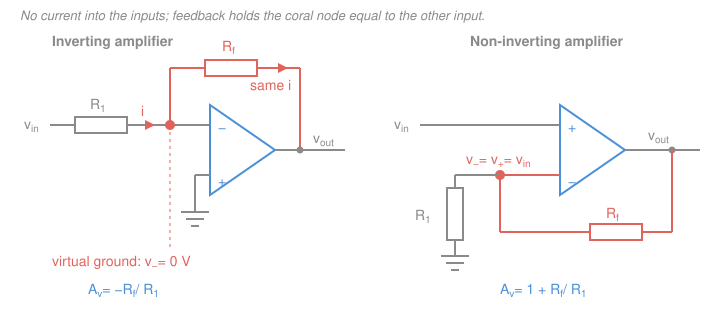

# Electronics & Semiconductors · Lesson 3.1: The ideal op-amp — inverting & non-inverting

> ⏱ ~15 min · Module 3: Op-amps & analog design · Builds on: [2.3 BJT small-signal amplifiers](02-03-bjt-small-signal-amplifiers.md), [`circuits` 1.3 Kirchhoff's laws](../../circuits/lessons/01-03-kirchhoffs-laws-kcl-kvl.md), [`circuits` 1.4 dividers](../../circuits/lessons/01-04-voltage-current-dividers.md) · Unlocks: [3.2 Summing, difference & instrumentation amps](03-02-summing-difference-instrumentation.md)

## Why this matters

Module 2 was honest work: pick a bias network, chase a Q-point, compute $g_m = I_C/V_T$, and finally read off a gain that depends on the transistor's current gain $\beta$, on temperature (through $V_T$), and on every resistor in the bias chain. Swap the transistor and your gain changes. Warm the board up and your gain changes.

This lesson is a gear change. The op-amp gives you a gain of $-10$ that is $-10$ because you *chose two resistors* — not because of any device parameter, not because of temperature, not because of which chip came out of the tube. Amplifier design stops being device physics and becomes algebra. Nearly every analog signal chain you will meet — sensor front ends, filters, ADC drivers — is built out of the two circuits in this lesson.

## The idea

An **op-amp** (operational amplifier) is a differential amplifier on a chip: it looks at the voltage difference between its two inputs, the non-inverting ($+$) and the inverting ($-$), and multiplies it by an enormous **open-loop gain** $A$ — typically $10^5$ to $10^6$ (that is 100,000 to 1,000,000).

$$v_{out} = A\,(v_+ - v_-)$$

Taken at face value that is a *useless* amplifier. With $A = 10^5$ and a $\pm 15\ \text{V}$ supply, an input difference of $150\ \mu\text{V}$ already pins the output at the rail. Nothing you would call a signal fits.

Here is the trick, and it is the whole module: **feed a fraction of the output back to the inverting input.** Now the op-amp has a job — drive the output to whatever value makes the two inputs agree. And *because* $A$ is absurdly large, the output barely has to try: an error of a few tens of microvolts is enough to produce volts of output. So the op-amp's own gain drops out of the answer, and the closed-loop behavior is set entirely by the feedback network you built out of ordinary resistors.

The paradox is worth savoring: the op-amp's gain matters so little **precisely because it is so large**. Huge, sloppy, temperature-dependent raw gain gets traded for modest, precise, stable closed-loop gain. That trade is quantified properly in [4.1 Negative feedback](04-01-negative-feedback.md); here we take the limit $A \to \infty$ and reap the algebra.

## The formal version

### The ideal op-amp model

Four idealizations, each one a real property pushed to its limit:

| Ideal | Reality | Repaired in |
|---|---|---|
| Open-loop gain $A = \infty$ | $10^5$–$10^6$, and it drifts | [4.1](04-01-negative-feedback.md) |
| Input impedance $= \infty$ (no input current) | $10^6\ \Omega$ (bipolar) to $10^{12}\ \Omega$ (FET); bias current $\sim$ nA | this lesson, last section |
| Output impedance $= 0$ | tens of ohms open-loop, milliohms after feedback | [4.1](04-01-negative-feedback.md) |
| Bandwidth $= \infty$ | one dominant pole; gain falls from a few Hz upward | [4.2 Frequency response & GBW](04-02-frequency-response-gain-bandwidth.md) |

### The two golden rules

**Rule 1 — no current flows into either input.** Infinite input impedance means the $+$ and $-$ terminals draw nothing. *In words: the op-amp watches its inputs, it does not load them.*

**Rule 2 — the two inputs sit at the same voltage** (the **virtual short**). This one you can *derive* rather than swallow. Start from the definition,

$$v_+ - v_- = \frac{v_{out}}{A}.$$

The output is a real voltage living between the supply rails, so $|v_{out}| \le 15\ \text{V}$ or so — **finite**. Divide a finite number by $A \to \infty$ and you get zero:

$$\boxed{\,v_+ - v_- = \lim_{A\to\infty}\frac{v_{out}}{A} = 0 \quad\Longrightarrow\quad v_+ = v_-\,}$$

*In words: the op-amp swings its output to whatever value drives the input difference to (almost) nothing — so you may simply assert the inputs are equal and solve for the rest.*

How "almost"? With $A = 10^5$ and a $10\ \text{V}$ output, the actual input difference is $10/10^5 = 100\ \mu\text{V}$. Not zero — but a hundred microvolts is invisible next to volt-scale signals, which is why treating it as zero costs you about 0.001 percent.

### The caveat that catches everyone

**Rule 2 holds only when (a) negative feedback is present and (b) the op-amp is not saturated.** The derivation assumed $v_{out}$ was finite and *settled*. That only happens if the feedback path steers the output back toward equalizing the inputs — which requires the feedback to land on the **inverting** input.

Break either condition and the rule evaporates. With no feedback (or feedback to the $+$ input), any input difference is amplified by $10^5$ and the output slams into a supply rail and stays there. That is not a broken amplifier — that is a **comparator**, and it is the entire subject of [3.5 Comparators & Schmitt triggers](03-05-comparators-schmitt-triggers.md). Whenever you see an op-amp with nothing connecting output to the $-$ input, put the virtual short away.

### The inverting amplifier

Ground the $+$ input. Drive the $-$ input through $R_1$ and connect $R_f$ from the $-$ input back to the output. Let $v_-$ be the voltage at that junction (the **summing node**).

1. Rule 2: $v_+ = 0$ (it is grounded), so $v_- = 0$ too. The summing node is a **virtual ground** — held at 0 V by feedback, but not connected to ground.
2. Current through $R_1$, from source to node: $\displaystyle i_1 = \frac{v_{in} - v_-}{R_1} = \frac{v_{in}}{R_1}$.
3. Current through $R_f$, from node to output: $\displaystyle i_f = \frac{v_- - v_{out}}{R_f} = \frac{-v_{out}}{R_f}$.
4. KCL at the summing node ([`circuits` 1.3](../../circuits/lessons/01-03-kirchhoffs-laws-kcl-kvl.md)): current in equals current out. Rule 1 says *none* of it goes into the op-amp, so all of $i_1$ must continue through $R_f$: $i_1 = i_f$.

$$\frac{v_{in}}{R_1} = \frac{-v_{out}}{R_f} \quad\Longrightarrow\quad \boxed{\,A_v = \frac{v_{out}}{v_{in}} = -\frac{R_f}{R_1}\,}$$

*In words: gain is minus the ratio of the two resistors — nothing else appears.*

Two consequences worth carrying:

- **Input impedance is exactly $R_1$.** The source sees $R_1$ tied to a virtual ground, not the op-amp's huge input impedance. This is the inverting amp's real drawback: it *loads* the source.
- **The virtual ground is a hard-wired zero** that never moves no matter what else you connect to it. That is why you can hang several input resistors on it and have them ignore each other — the summer of [3.2](03-02-summing-difference-instrumentation.md).

### The non-inverting amplifier

Drive the $+$ input directly. Ground $R_1$, connect $R_f$ from output back to the $-$ input, with the $-$ input at their junction.

1. Rule 1: no current enters the $-$ input, so $R_f$ and $R_1$ form an **unloaded voltage divider** from $v_{out}$ to ground ([`circuits` 1.4](../../circuits/lessons/01-04-voltage-current-dividers.md)):
   $$v_- = v_{out}\,\frac{R_1}{R_1 + R_f}.$$
2. Rule 2: $v_- = v_+ = v_{in}$. Substitute and solve:

$$v_{in} = v_{out}\frac{R_1}{R_1+R_f} \quad\Longrightarrow\quad \boxed{\,A_v = \frac{v_{out}}{v_{in}} = \frac{R_1+R_f}{R_1} = 1 + \frac{R_f}{R_1}\,}$$

*In words: gain is one plus the resistor ratio, and the sign is positive.*

The divider fraction $\beta_f = R_1/(R_1+R_f)$ is the **feedback factor** — the share of the output fed back. (Written $\beta_f$, never bare $\beta$, because in this course $\beta$ is the BJT current gain from [2.1](02-01-bjt-how-it-works.md).) Note $A_v = 1/\beta_f$; [4.1](04-01-negative-feedback.md) shows that is no coincidence.

Consequences:

- **Input impedance is essentially infinite** — the signal goes straight to a terminal that draws no current. Genuine advantage.
- **Gain cannot go below 1.** $R_f/R_1 \ge 0$ always, so $A_v \ge 1$. If you need attenuation, attenuate with a divider first, or use the inverting topology.

### The voltage follower

Take the non-inverting amp to its limit: $R_f = 0$ (a wire) and $R_1 = \infty$ (absent). Then $A_v = 1 + 0 = 1$, and $v_{out} = v_{in}$.

A whole chip for a gain of one? Yes — because voltage gain is not what you bought. You bought **impedance transformation**: infinite input impedance on one side, near-zero output impedance on the other. The follower listens without drawing current and drives without sagging.

## Picture

## Worked examples

### Example 1 — what the buffer prevents

A pH sensor behaves as a 2.0 V source behind $R_s = 100\ \text{k}\Omega$ of internal resistance (a Thévenin equivalent, [`circuits` 2.4](../../circuits/lessons/02-04-thevenin-norton-max-power.md)). You need that signal at a stage whose input resistance is $R_L = 10\ \text{k}\Omega$.

**Connect them directly.** The two resistances form a divider:

$$v_L = 2.0\ \text{V}\times\frac{10\ \text{k}\Omega}{100\ \text{k}\Omega + 10\ \text{k}\Omega} = 2.0 \times 0.0909 = 0.182\ \text{V}.$$

You lost 91 percent of the signal — and worse, the loss depends on $R_s$, which drifts with the sensor's age and temperature. Your "measurement" now measures the sensor's internal resistance.

**Insert a follower.** Its input draws no current, so no current flows through $R_s$, so there is no drop across it: $v_+ = 2.0\ \text{V}$ exactly. The output reproduces 2.0 V with an output impedance of milliohms, and supplies the $2.0/10\ \text{k}\Omega = 200\ \mu\text{A}$ the load wants — trivial for a chip that can source 20 mA.

$$\text{2.0 V in} \;\to\; \text{2.0 V out, error} < 0.1\ \text{percent}.$$

That is the whole reason a gain-of-one amplifier is worth a part number.

### Example 2 — a design pair, and how to pick resistor values

**Case A: gain of $-10$ from a function generator** ($R_s = 50\ \Omega$).
The source is stiff, so loading is a non-issue and the sign inversion is acceptable — use **inverting**. Need $R_f/R_1 = 10$: take $R_1 = 10\ \text{k}\Omega$, $R_f = 100\ \text{k}\Omega$.
*Check the loading you introduced:* the generator sees $R_1 = 10\ \text{k}\Omega$, so the fraction of the source voltage that actually reaches $R_1$ is $10{,}000/(10{,}000+50) = 0.995$ — the realized gain is $-9.95$, half a percent low. Fine.

**Case B: gain of $+10$ from that 100 kΩ sensor.**
Inverting is now disqualified: the source resistance adds to $R_1$, so the gain becomes $-R_f/(R_1+R_s) = -100/(10+100) = -0.91$ — you built an attenuator. Use **non-inverting**. Need $1 + R_f/R_1 = 10$, i.e. $R_f = 9R_1$: take $R_1 = 10\ \text{k}\Omega$, $R_f = 90\ \text{k}\Omega$. The nearest standard 1 percent value is 90.9 kΩ, giving $A_v = 10.09$ — 0.9 percent high, which is the resistors' fault and nobody else's. That is the point: your error budget is now a *component tolerance*, not a device parameter.

**Why the values live between about 1 kΩ and 100 kΩ.** Only the *ratio* sets the gain, so the absolute scale is free — until it isn't:

- **Too small** loads the output. With $R_1 = 10\ \Omega$, $R_f = 100\ \Omega$ and $v_{out} = 10\ \text{V}$, the feedback network alone draws $10/100 = 100\ \text{mA}$ — four times what a typical op-amp can source. It clips, and not because of the signal.
- **Too large** amplifies the op-amp's own imperfections. Input **bias current** ($\sim 100\ \text{nA}$ for a classic bipolar part) flows in the resistors whether you like it or not: through $R_f = 10\ \text{M}\Omega$ that is $100\ \text{nA}\times 10\ \text{M}\Omega = 1\ \text{V}$ of pure DC error at the output. Thermal noise scales as $\sqrt{4k_BTR}$ too — about $13\ \text{nV}/\sqrt{\text{Hz}}$ at 10 kΩ but $130\ \text{nV}/\sqrt{\text{Hz}}$ at 1 MΩ.

The middle of that window is where both effects are negligible, which is why so many op-amp schematics are built from 10 kΩ and 100 kΩ.

### Where the ideal model breaks — a preview of Module 4

Honest one-liners, each with an address:

- **Finite gain–bandwidth.** Gain and bandwidth trade one-for-one: a 1 MHz part wired for a gain of 100 is flat only to $1\ \text{MHz}/100 = 10\ \text{kHz}$. See [4.2](04-02-frequency-response-gain-bandwidth.md).
- **Slew rate.** The output can only move so fast. At $0.5\ \text{V}/\mu\text{s}$, a 10 V-peak sine is triangular above $f = 0.5\times10^6/(2\pi\cdot 10) \approx 8\ \text{kHz}$ — a *large-signal* limit, separate from bandwidth. Also [4.2](04-02-frequency-response-gain-bandwidth.md).
- **Input offset voltage.** The inputs are not perfectly matched; a few mV of built-in error gets amplified by your closed-loop gain (2 mV in a gain-of-100 stage $\to$ 0.2 V of DC output offset).
- **Input bias current.** Rule 1 is off by nanoamps — harmless in 10 kΩ, fatal in 10 MΩ, as computed above.
- **Output saturation.** A classic bipolar output stops a volt or so short of each rail; rail-to-rail CMOS parts get within millivolts. Ask for more and you get [3.5](03-05-comparators-schmitt-triggers.md)'s behavior whether you wanted it or not.
- **Finite open-loop gain.** The exact non-inverting result is $A_{cl} = \dfrac{1+R_f/R_1}{1 + (1+R_f/R_1)/A}$ — the ideal answer divided by a correction that is 1.0001 for sane gains. Quantified as loop gain in [4.1](04-01-negative-feedback.md).

## Watch out

- **You might think the virtual short means the inputs are *connected*.** They are not — no current flows between them. The op-amp *makes* them equal from the outside, by moving its output. Never draw a wire there, and never assume $v_- = v_+$ without first confirming a feedback path from the output to the $-$ input.
- **You might think the inverting amp has high input impedance because op-amps do.** It has exactly $R_1$. The virtual ground is a low-impedance node in the sense that matters here: your source drives $R_1$ into 0 V. If the source is weak, either buffer it first or use the non-inverting topology.
- **You might mix up $-R_f/R_1$ and $1 + R_f/R_1$.** The "+1" comes from the input signal appearing at the *bottom* of the feedback divider rather than at ground; there is no way to make a non-inverting stage attenuate. When in doubt, re-derive: set $v_- = v_+$ and write one KCL.
- **You might forget that the feedback resistors carry real current.** With $v_{out} = 10\ \text{V}$ into $R_f = 1\ \text{k}\Omega$, the network draws 10 mA before the load gets anything. Add it to the output current budget.

## One-liner

> Wrap absurd open-loop gain in negative feedback and the op-amp obediently drives its output until its inputs match — after which the gain is just $-R_f/R_1$ or $1+R_f/R_1$, set by two resistors you chose.

## Problems

**P1 (🟢)** An inverting amplifier uses $R_1 = 2.2\ \text{k}\Omega$ and $R_f = 47\ \text{k}\Omega$, running from $\pm15\ \text{V}$ rails, with $v_{in} = 0.15\ \text{V}$ DC. Find (a) $v_{out}$, (b) the current supplied by the source, (c) the input resistance seen by the source, and (d) the largest $|v_{in}|$ before clipping, assuming the output saturates at $\pm 13.5\ \text{V}$.

**P2 (🟡)** A load cell presents a source resistance of $220\ \text{k}\Omega$ and produces up to $50\ \text{mV}$ full scale. You must deliver $2.5\ \text{V}$ full scale to an ADC. (a) Choose a topology and give resistor values, using standard parts. (b) Show numerically what happens if you use an inverting stage with $R_1 = 2\ \text{k}\Omega$, $R_f = 98\ \text{k}\Omega$ instead.

**P3 (🔴)** A 2.5 V reference is made by dividing a 5 V rail with $R_a = R_b = 100\ \text{k}\Omega$. It must drive a circuit whose input resistance is $22\ \text{k}\Omega$. (a) What voltage does the load actually see? (b) What does a voltage follower between them change, and what current must the op-amp supply? (c) If instead you refused the buffer and just shrank $R_a = R_b = R$, how small must $R$ be to hold the output within 1 percent, and what standing current does the divider then burn?

Solutions

**P1**

(a) The virtual ground at the summing node gives $A_v = -R_f/R_1$:

$$A_v = -\frac{47\ \text{k}\Omega}{2.2\ \text{k}\Omega} = -21.36, \qquad v_{out} = -21.36 \times 0.15\ \text{V} = -3.20\ \text{V}.$$

(b) The source drives $R_1$ into 0 V, so

$$i = \frac{v_{in} - 0}{R_1} = \frac{0.15\ \text{V}}{2200\ \Omega} = 68.2\ \mu\text{A}.$$

*Check.* All of it continues through $R_f$ (Rule 1), so $v_{out} = 0 - iR_f = -68.2\ \mu\text{A}\times 47\ \text{k}\Omega = -3.21\ \text{V}$ — matches (a) to rounding. ✓

(c) $R_\text{in} = R_1 = 2.2\ \text{k}\Omega$. The op-amp's own input impedance never enters: the source terminates on $R_1$, whose far end is pinned at 0 V.

(d) $|v_{in}|_\text{max} = 13.5/21.36 = 0.632\ \text{V}$. Beyond that the output hits the saturation limit, the feedback loop can no longer hold $v_- = 0$, and the virtual ground collapses.

**P2**

(a) Required gain: $2.5\ \text{V}/50\ \text{mV} = 50$. The source resistance is $220\ \text{k}\Omega$ — huge — so the stage must not draw input current. Use the **non-inverting** amplifier (input impedance essentially infinite).

$$1 + \frac{R_f}{R_1} = 50 \;\Longrightarrow\; R_f = 49R_1.$$

Take $R_1 = 2.0\ \text{k}\Omega \Rightarrow R_f = 98\ \text{k}\Omega$. Both sit in the 1 kΩ–100 kΩ window. With standard 1 percent parts the nearest value is $97.6\ \text{k}\Omega$, giving

$$A_v = 1 + \frac{97.6}{2.0} = 49.8 \quad (0.4\ \text{percent low}).$$

*Check.* $50\ \text{mV}\times 49.8 = 2.49\ \text{V}$ ✓ — within an ADC LSB or two of the 2.5 V target. (Using a 5 percent 100 kΩ instead gives $A_v = 51$, 2 percent high — the tolerance, not the op-amp, is your error budget.)

(b) In the inverting topology the source resistance is in series with $R_1$, so it *adds* to it:

$$A_v = -\frac{R_f}{R_1 + R_s} = -\frac{98\ \text{k}\Omega}{2\ \text{k}\Omega + 220\ \text{k}\Omega} = -0.441.$$

Full scale becomes $50\ \text{mV}\times 0.441 = 22\ \text{mV}$ instead of 2.5 V — you attenuated a signal you meant to amplify by 50, and the error tracks the load cell's source resistance. This is the inverting amp's one structural weakness, in one number.

**P3**

(a) Thévenin the divider ([`circuits` 2.4](../../circuits/lessons/02-04-thevenin-norton-max-power.md)): open-circuit voltage $5\times\frac{100}{200} = 2.5\ \text{V}$, source resistance $100\ \text{k}\Omega \parallel 100\ \text{k}\Omega = 50\ \text{k}\Omega$. Now load it:

$$v_L = 2.5\ \text{V}\times \frac{22\ \text{k}\Omega}{22\ \text{k}\Omega + 50\ \text{k}\Omega} = 2.5 \times 0.3056 = 0.764\ \text{V}.$$

*Check, the long way:* $R_b \parallel R_L = (100\cdot 22)/122 = 18.03\ \text{k}\Omega$, so $v_L = 5\times 18.03/(100+18.03) = 0.764\ \text{V}$ ✓. Your 2.5 V reference is a 0.76 V reference.

(b) The follower's input draws no current, so the divider stays unloaded and $v_+ = 2.5\ \text{V}$ exactly; the output reproduces it at near-zero output impedance. The op-amp supplies the load current itself:

$$i = \frac{2.5\ \text{V}}{22\ \text{k}\Omega} = 114\ \mu\text{A},$$

three orders of magnitude below a typical 20 mA output rating.

(c) Without a buffer you need the divider's Thévenin resistance small compared with the load:

$$\frac{R_L}{R_L + R_{th}} \ge 0.99 \;\Longrightarrow\; R_{th} \le R_L\frac{0.01}{0.99} = 22\ \text{k}\Omega \times 0.0101 = 222\ \Omega,$$

and since $R_{th} = R/2$, that means $R \le 444\ \Omega$ — say the standard value $430\ \Omega$.

*Check.* $R_{th} = 215\ \Omega$, so $v_L = 2.5\times 22000/22215 = 2.476\ \text{V}$, 1.0 percent low ✓.

The cost: the divider now burns $5\ \text{V}/(2\times 430\ \Omega) = 5.8\ \text{mA}$ continuously, against $5\ \text{V}/200\ \text{k}\Omega = 25\ \mu\text{A}$ for the original — a factor of 230 more current, forever, in every device you ship. The buffer buys the same accuracy for a few hundred microamps. That trade is why followers are everywhere.

## Flashback

**From Lesson 2.2 (BJT DC biasing):** A voltage-divider-biased common-emitter stage has $V_{CC} = 12\ \text{V}$, $R_1 = 68\ \text{k}\Omega$ (upper), $R_2 = 12\ \text{k}\Omega$ (lower), $R_C = 2.2\ \text{k}\Omega$, $R_E = 680\ \Omega$, $\beta = 150$, $V_{BE} = 0.7\ \text{V}$. Find $I_C$ and $V_{CE}$ and confirm the active region. Then compare with the "ignore base current" shortcut.

Solution

Thévenin the base divider:

$$V_{TH} = 12\ \text{V}\times\frac{12}{68+12} = 1.8\ \text{V}, \qquad R_{TH} = \frac{68\times 12}{80} = 10.2\ \text{k}\Omega.$$

Base loop, using $I_E = (\beta+1)I_B = 151 I_B$:

$$V_{TH} = I_B R_{TH} + V_{BE} + I_E R_E \;\Longrightarrow\; 1.1\ \text{V} = I_B\big(10.2\ \text{k}\Omega + 151\times 0.68\ \text{k}\Omega\big) = I_B (112.9\ \text{k}\Omega),$$

$$I_B = 9.74\ \mu\text{A}, \qquad I_C = 150 I_B = 1.46\ \text{mA}, \qquad I_E = 151 I_B = 1.47\ \text{mA}.$$

Collector loop:

$$V_{CE} = V_{CC} - I_C R_C - I_E R_E = 12 - (1.46)(2.2) - (1.47)(0.68) = 12 - 3.22 - 1.00 = 7.78\ \text{V}.$$

Active region confirmed: $V_{CE} = 7.78\ \text{V}$ is far above $V_{CE,\text{sat}} \approx 0.2\ \text{V}$, and the base–emitter junction is forward biased. ✓

*Shortcut comparison.* Ignoring $I_B$: $V_B = 1.8\ \text{V}$, $V_E = 1.1\ \text{V}$, $I_C \approx I_E = 1.1/0.68 = 1.62\ \text{mA}$, $V_{CE} = 12 - 1.62(2.2+0.68) = 7.34\ \text{V}$ — about 11 percent high on $I_C$. The stiffness rule of thumb $R_{TH} \le 0.1(\beta+1)R_E$ reads $10.2\ \text{k}\Omega$ vs $10.3\ \text{k}\Omega$: this divider only just qualifies, which is exactly why the shortcut is off by 11 percent rather than 1.

*And the point of today's lesson:* $g_m = I_C/V_T = 1.46\ \text{mA}/25\ \text{mV} = 58\ \text{mA/V}$, so an 11 percent uncertainty in $I_C$ is an 11 percent uncertainty in the stage's gain — before you even consider $\beta$ spread or temperature. The op-amp circuits above have no such term.

## Connections

- **Backward:** the analysis is nothing but [`circuits` 1.3](../../circuits/lessons/01-03-kirchhoffs-laws-kcl-kvl.md)'s KCL plus [`circuits` 1.4](../../circuits/lessons/01-04-voltage-current-dividers.md)'s divider — the op-amp contributes only two constraints. The contrast is with [2.3](02-03-bjt-small-signal-amplifiers.md) and [2.5](02-05-mosfet-biasing-common-source.md), where gain rode on $g_m$, bias current, and temperature.
- **Forward:** the virtual ground makes multiple inputs independent, giving the summer and difference amp of [3.2](03-02-summing-difference-instrumentation.md); replace $R_f$ or $R_1$ with a capacitor and you get the integrator and differentiator of [3.3](03-03-integrators-differentiators.md) and the active filters of [3.4](03-04-active-filters.md). Remove the feedback and you get the comparator of [3.5](03-05-comparators-schmitt-triggers.md). Restore finite $A$ and finite bandwidth in [4.1](04-01-negative-feedback.md) and [4.2](04-02-frequency-response-gain-bandwidth.md).
- **Sideways (control theory):** "huge forward gain wrapped in feedback makes the closed loop depend only on the feedback path" is the same statement as $\frac{G}{1+GH} \to \frac{1}{H}$ for large $G$ — see [`control-systems` 1.1](../../control-systems/lessons/01-01-feedback-and-the-control-problem.md) and the block-diagram algebra of [`control-systems` 1.5](../../control-systems/lessons/01-05-block-diagram-algebra.md). The op-amp is that theorem soldered onto a board.
