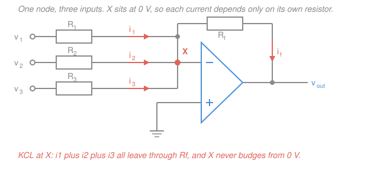
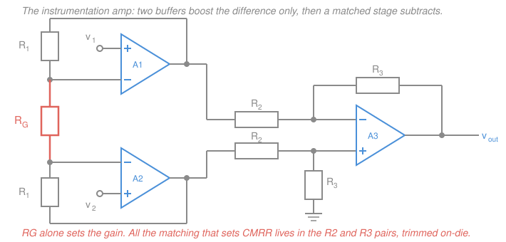

# Electronics & Semiconductors · Lesson 3.2: Summing, difference & instrumentation amps

> ⏱ ~15 min · Module 3: Op-amps & analog design · Builds on: [3.1 The ideal op-amp](03-01-ideal-op-amp-inverting-noninverting.md), [`circuits` 2.3 Superposition](../../circuits/lessons/02-03-superposition-source-transformation.md) · Unlocks: 3.3 (integrators & differentiators), 4.4 (ADC & DAC)

## Why this matters

One input in, one gain out is a warm-up. Real signal chains take *several* voltages and combine them: an audio mixer adds eight channels, a DAC adds the weighted contributions of eight bits, a control loop subtracts a measurement from a setpoint, an ECG amplifier pulls a 1 mV heartbeat out from under 100 mV of mains hum. All four of those are the same two circuits — the **inverting summer** and the **difference amplifier** — and both fall out of the golden rules from [3.1](03-01-ideal-op-amp-inverting-noninverting.md) in about three lines of algebra.

The difference amp then hands you the most useful practical fact in analog design: its ability to reject interference depends almost entirely on **how well four resistors match**, not on how good the op-amp is. Knowing that number is what separates a circuit that works from one that hums.

## The idea

**Summing.** In [3.1](03-01-ideal-op-amp-inverting-noninverting.md) the inverting amplifier's input node sat at a **virtual ground** — held at 0 V by feedback, without being wired to ground. That single fact is the whole lesson. Hang a second resistor on that node and its current is $v_2/R_2$; hang a third and its current is $v_3/R_3$. Because the node **never moves**, no input can change the voltage across any other input's resistor. The branches are blind to each other.

> **The key insight:** the summing node's independence, not the formula, is why this topology is everywhere. Add a channel and nothing you already tuned changes.

The op-amp then has to sink the *total* current through $R_f$, and current-in-equals-current-out is where the sum appears.

**Differencing.** Now the opposite problem: two wires come back from a sensor 10 metres away, and both have picked up the same buzz from the mains. The *information* is the difference between the wires; the *garbage* is what they share. A circuit that amplifies the difference and ignores the shared part throws the garbage away for free. That's a difference amplifier, and how well it ignores the shared part is called **common-mode rejection**.

## The formal version

### The inverting summer

Take $n$ inputs $v_1,\dots,v_n$ (volts), each entering through its own resistor $R_1,\dots,R_n$ (ohms) to the inverting node $X$, with feedback resistor $R_f$ from $X$ to the output and the non-inverting input grounded. The golden rules say the op-amp draws no input current and drives $v_X = v_+ = 0$. KCL at $X$:

$$\underbrace{\frac{v_1 - 0}{R_1} + \frac{v_2 - 0}{R_2} + \cdots + \frac{v_n - 0}{R_n}}_{\text{current in}} \;=\; \underbrace{\frac{0 - v_{out}}{R_f}}_{\text{current out through } R_f}$$

$$\boxed{\,v_{out} = -R_f\left(\frac{v_1}{R_1} + \frac{v_2}{R_2} + \cdots + \frac{v_n}{R_n}\right)}$$

*In words: the output is minus $R_f$ times the total current the inputs push into the node.*

- **Equal resistors** ($R_1 = \cdots = R_n = R$) give $v_{out} = -\frac{R_f}{R}(v_1 + \cdots + v_n)$ — a scaled, inverted sum. This is an audio mixer: one slider per channel, one master gain $R_f$.
- **Unequal resistors** give a **weighted** sum, with weight $R_f/R_k$ on channel $k$. Choose the weights as $1, \tfrac12, \tfrac14, \tfrac18,\dots$ and each input becomes a binary place value: drive them with digital 0 V / $V_{ref}$ levels and the output is the analog value of a binary word. That is a DAC — the R-2R ladder of [4.4](04-04-adc-dac.md) is this idea built from only two resistor values.

Input resistance seen by source $k$ is just $R_k$ (it drives a virtual ground), so the sources do load each other's *drivers* not at all, but each source must be stiff enough to drive $R_k$.

### The difference amplifier

One op-amp, four resistors. $v_1$ enters through $R_1$ to the **inverting** input; $R_2$ feeds back from the output to that node. $v_2$ enters through $R_3$ to the **non-inverting** input, which is tied to ground through $R_4$. Solve it by [superposition](../../circuits/lessons/02-03-superposition-source-transformation.md) — kill one source at a time and add.

**Contribution of $v_1$ (set $v_2 = 0$, i.e. short it).** Then $R_3$ and $R_4$ are both grounded, so $v_+ = 0$ and the circuit is a plain inverting amp:

$$v_{out}\big|_{v_1} = -\frac{R_2}{R_1}\,v_1.$$

**Contribution of $v_2$ (set $v_1 = 0$).** Now $R_1$ runs from the inverting node to ground, so the circuit is a **non-inverting** amp of gain $1 + R_2/R_1$ driven by whatever $v_+$ is. No current enters the op-amp, so $R_3$–$R_4$ is a clean voltage divider:

$$v_+ = \frac{R_4}{R_3+R_4}\,v_2 \quad\Longrightarrow\quad v_{out}\big|_{v_2} = \frac{R_4}{R_3+R_4}\left(1 + \frac{R_2}{R_1}\right)v_2 .$$

**Add them:**

$$v_{out} = \frac{R_4}{R_3+R_4}\left(1 + \frac{R_2}{R_1}\right)v_2 \;-\; \frac{R_2}{R_1}\,v_1 .$$

Call this the **general form** — it is true whether or not the resistors match.

Now impose the **matched ratio** $\dfrac{R_3}{R_4} = \dfrac{R_1}{R_2}$. Then $\dfrac{R_4}{R_3+R_4} = \dfrac{1}{1+R_1/R_2} = \dfrac{R_2}{R_1+R_2}$, and since $1+\dfrac{R_2}{R_1} = \dfrac{R_1+R_2}{R_1}$, the two factors multiply to exactly $R_2/R_1$:

$$\boxed{\,v_{out} = \frac{R_2}{R_1}\,(v_2 - v_1)\,}$$

*In words: with matched ratios the circuit amplifies only the difference of its inputs.* With all four resistors equal it is a pure subtractor, $v_{out} = v_2 - v_1$.

### Common-mode rejection

Split any input pair into the part that differs and the part that is shared:

$$v_d = v_2 - v_1 \quad(\text{differential input, V}), \qquad v_{cm} = \frac{v_1+v_2}{2} \quad(\text{common-mode input, V}),$$

so $v_1 = v_{cm} - v_d/2$ and $v_2 = v_{cm} + v_d/2$. Writing the general form as $v_{out} = A_2 v_2 - A_1 v_1$ and substituting:

$$v_{out} = \underbrace{\frac{A_1+A_2}{2}}_{A_d}\,v_d \;+\; \underbrace{(A_2 - A_1)}_{A_{cm}}\,v_{cm}.$$

$A_d$ is the **differential gain**, $A_{cm}$ the **common-mode gain**, and the figure of merit is

$$\text{CMRR} = 20\log_{10}\left|\frac{A_d}{A_{cm}}\right| \quad \text{(dB)}.$$

*In words: how many dB the wanted difference beats the unwanted shared signal by, once both have been through the amplifier.* A long sensor cable picks up the same 60 Hz field on both conductors, so that interference is almost pure common mode — and a high-CMRR amplifier deletes it while passing the signal untouched.

**The engineering point: CMRR is set by resistor matching, not by the op-amp.** Let $a = R_2/R_1$ and $b = R_4/R_3$, so $A_1 = a$ and $A_2 = \frac{b}{1+b}(1+a)$. Then

$$A_{cm} = A_2 - A_1 = \frac{b + ab - a - ab}{1+b} = \frac{b - a}{1+b}.$$

Perfect matching means $a = b$ and $A_{cm} = 0$ exactly — with *any* op-amp. Now give every resistor a fractional tolerance $t$ (so $t = 0.01$ for 1 percent parts) about a nominal ratio $K$. Worst case, $a$ and $b$ each drift a relative $2t$ (numerator high, denominator low) in **opposite** directions, so $|b - a| \le 4tK$ while $1+b \approx 1+K$ and $A_d \approx K$:

$$\boxed{\,\text{CMRR} \;\ge\; \frac{1+K}{4t}, \qquad K = \frac{R_2}{R_1}\,}$$

The assumption is worst-case, first-order (all four tolerances conspiring); random matching typically does a few dB better. A real op-amp's *own* CMRR is 90–120 dB, so unless you buy very good resistors the resistors lose by a mile. Numbers in Example 2.

### The instrumentation amplifier

The bare difference amp has two flaws: its inputs load the source (they are resistors, not high-impedance terminals), and changing the gain means retrimming two matched pairs. Bolt a buffer stage in front and both go away.

Two op-amps A1 and A2 take $v_1$ and $v_2$ on their **non-inverting** inputs — so each input terminal is an op-amp input, essentially infinite resistance. Each has feedback resistor $R_1$, and the two inverting nodes are joined through a single **gain resistor** $R_G$. The virtual short forces those nodes to $v_1$ and $v_2$, so the current through $R_G$ is $(v_1-v_2)/R_G$ and nothing else — that same current flows through both $R_1$'s. The buffered pair then feeds a difference stage with input resistors $R_2$ and feedback/ground resistors $R_3$ (these play the roles $R_1$ and $R_2$ played above). The result:

$$\boxed{\,A_d = \left(1 + \frac{2R_1}{R_G}\right)\frac{R_3}{R_2}\,}$$

*In words: the front end multiplies the difference by $1 + 2R_1/R_G$, then the back end subtracts and scales.* Three things it fixes:

1. **Input impedance** is that of two op-amp inputs — gigaohms — on *both* terminals. No source loading, no matter what the sensor's resistance is.
2. **Gain is one resistor.** $R_G$ appears in no matched pair, so you can sweep the gain over 1000:1 by changing a single part.
3. **CMRR no longer depends on the input stage.** Set $v_1 = v_2$: the current through $R_G$ is zero, so both outputs equal the common input regardless of how badly the two $R_1$'s match. Common mode passes at gain **1** while the difference is multiplied by $1+2R_1/R_G$ — so overall CMRR is the difference stage's CMRR *times the front-end gain*. A front-end gain of 100 buys you a free 40 dB.

That is why instrumentation amps come as single ICs (AD620, INA126 and friends): the $R_2$/$R_3$ pairs are laser-trimmed on the same die at the same temperature, giving 100+ dB CMRR that discrete 1 percent resistors cannot touch. You bring one external $R_G$. Real users: strain-gauge bridges, ECG electrodes, thermocouples — all tiny differential signals sitting on large common-mode offsets.

## Picture

## Worked examples

**Example 1 (boss problem 3(a) — design a weighted summer).** Build $V_x = -(2V_1 + 5V_2)$ using $R_f = 100\ \text{k}\Omega$.

Match term by term against $V_x = -R_f\left(\frac{V_1}{R_1} + \frac{V_2}{R_2}\right)$: the weight on channel $k$ is $R_f/R_k$, so

$$\frac{R_f}{R_1} = 2 \;\Rightarrow\; R_1 = \frac{100\ \text{k}\Omega}{2} = 50\ \text{k}\Omega, \qquad \frac{R_f}{R_2} = 5 \;\Rightarrow\; R_2 = \frac{100\ \text{k}\Omega}{5} = 20\ \text{k}\Omega.$$

*Verify by substituting back.* With $V_1 = V_2 = 1\ \text{V}$:

$$V_x = -100\ \text{k}\Omega\left(\frac{1\ \text{V}}{50\ \text{k}\Omega} + \frac{1\ \text{V}}{20\ \text{k}\Omega}\right) = -100(0.02 + 0.05)\ \text{V} = -7\ \text{V},$$

and directly $-(2\cdot 1 + 5\cdot 1) = -7\ \text{V}$. ✓ Note the bigger weight needs the *smaller* resistor, since weight $= R_f/R_k$. Both values are standard; 50 kΩ is available as a 1 percent part, and 20 kΩ is E24.

**Example 2 (why matching is the whole game).** A difference amp uses nominal $R_1 = R_3 = 10\ \text{k}\Omega$ and $R_2 = R_4 = 100\ \text{k}\Omega$, so $K = 10$ and $A_d = 10$. How good is the rejection?

With 1 percent resistors, $t = 0.01$:

$$\text{CMRR} \ge \frac{1+10}{4(0.01)} = 275 \quad\Longrightarrow\quad 20\log_{10}275 = 48.8\ \text{dB}.$$

With 0.1 percent resistors, $t = 0.001$: $\text{CMRR} \ge 2750$, i.e. $20\log_{10}2750 = 68.8\ \text{dB}$ — exactly 20 dB better, because CMRR scales as $1/t$ and a factor of 10 in amplitude *is* 20 dB.

*Verify the size of the effect.* At $K=10$ and 1 percent parts, $|A_{cm}| \le A_d/275 = 10/275 = 0.036$. So 1 V of common-mode hum arrives at the output as 36 mV — while a 1 mV differential signal arrives as 10 mV. The hum is still nearly four times the signal. Swapping in 0.1 percent parts drops the hum to 3.6 mV. Same op-amp, same schematic, four different resistors. (For a unity-gain subtractor, $K=1$, the bound is only $2/0.04 = 50$, i.e. 34 dB — low gain makes matching *harder* to live with.)

## Watch out

- **You might think a bigger op-amp fixes hum.** It doesn't. An op-amp with 120 dB of its own CMRR wired with 1 percent resistors still gives you 34–49 dB, because $A_{cm} = (b-a)/(1+b)$ contains no op-amp parameter at all. Buy resistors, or buy an in-amp.
- **You might think the difference amp's two inputs are symmetric.** They are not. Looking into the $v_1$ terminal you see $R_1$; looking into the $v_2$ terminal you see $R_3 + R_4$. With all four equal to $R$ that is $R$ versus $2R$ — a genuine asymmetry that also means the two sources are loaded differently.
- **Source impedance imbalance destroys CMRR.** Any resistance in series with an input adds to that input's resistor. If one lead has 100 Ω more source impedance than the other and $R_1 = 10\ \text{k}\Omega$, you have just introduced a 1 percent mismatch by hand — as bad as the worst resistor. This is precisely the failure the instrumentation amp's buffers prevent.
- **The summer's inputs are independent, but its op-amp is not infinite.** All the input currents pile into one output. Check that $|v_{out}|$ stays inside the supply rails and that $v_{out}/R_f$ plus any load current is within the op-amp's output current rating.

## One-liner

> A virtual ground lets currents add without their sources ever meeting, and a difference amp's rejection of hum is a statement about four resistors, not about the op-amp.

## Problems

**P1 (🟢)** Design an inverting summer producing $v_{out} = -(3v_1 + 0.5\,v_2)$ from a feedback resistor $R_f = 60\ \text{k}\Omega$. Give $R_1$ and $R_2$, and verify your design by computing $v_{out}$ for $v_1 = 1\ \text{V}$, $v_2 = 2\ \text{V}$ both ways.

**P2 (🟡)** A difference amplifier is built with nominal $R_1 = R_3 = 1\ \text{k}\Omega$ and $R_2 = R_4 = 20\ \text{k}\Omega$, using 1 percent resistors. A sensor delivers a 10 mV differential signal riding on 2 V of 60 Hz common-mode hum. (a) Find the worst-case CMRR in dB. (b) Find the signal and hum amplitudes at the output, and their ratio. (c) What does switching to 0.1 percent resistors do to the hum?

**P3 (🔴)** A strain-gauge bridge (each arm 350 Ω) puts out up to ±10 mV differential on a 2.5 V common-mode level; you need ±2 V at the output. Use a three-op-amp instrumentation amp whose difference stage has $R_3/R_2 = 1$ and whose input-stage resistors are $R_1 = 25\ \text{k}\Omega$. (a) Find the required $R_G$, then pick the nearest standard 1 percent value (249 Ω or 255 Ω) and state the gain and full-scale output you actually get. (b) In one sentence: what goes wrong if you skip the buffers and drive a bare difference amp with $R_1 = 1\ \text{k}\Omega$ input resistors straight from the bridge?

Solutions

**P1** The weight on channel $k$ is $R_f/R_k$, so $R_k = R_f/(\text{weight})$:

$$R_1 = \frac{60\ \text{k}\Omega}{3} = 20\ \text{k}\Omega, \qquad R_2 = \frac{60\ \text{k}\Omega}{0.5} = 120\ \text{k}\Omega.$$

*Verify.* Through the formula:

$$v_{out} = -60\ \text{k}\Omega\left(\frac{1\ \text{V}}{20\ \text{k}\Omega} + \frac{2\ \text{V}}{120\ \text{k}\Omega}\right) = -60\,(0.05 + 0.01667)\ \text{V} = -60\,(0.06667)\ \text{V} = -4\ \text{V}.$$

Directly from the spec: $-(3(1) + 0.5(2)) = -(3+1) = -4\ \text{V}$. ✓ Sanity: a weight below 1 must *attenuate*, so $R_2$ has to exceed $R_f$ — and 120 kΩ > 60 kΩ. ✓ Both 20 kΩ and 120 kΩ are standard E24 values.

**P2** Here $K = R_2/R_1 = 20$, so $A_d = 20$, and $t = 0.01$.

(a) $\displaystyle \text{CMRR} \ge \frac{1+K}{4t} = \frac{21}{0.04} = 525 \;\Longrightarrow\; 20\log_{10}525 = 54.4\ \text{dB}.$

(b) Signal at the output: $A_d\,v_d = 20 \times 10\ \text{mV} = 200\ \text{mV}$. Common-mode gain: $A_{cm} = A_d/\text{CMRR} = 20/525 = 0.0381$, so the hum arrives as

$$0.0381 \times 2\ \text{V} = 76\ \text{mV}.$$

Ratio $= 76/200 = 0.38$, i.e. the hum is 38 percent of the signal — a visibly corrupted trace, from a circuit that looks perfect on paper.

(c) $t = 0.001$ multiplies CMRR by 10 to 5250 (74.4 dB), so $A_{cm} = 20/5250 = 0.00381$ and the hum falls to $7.6\ \text{mV}$, or 3.8 percent of the signal. Nothing changed but four resistors.

*Check.* $A_{cm}$ must be far below $A_d$ for the circuit to be worth calling a difference amp: $0.038 \ll 20$ ✓, and the 20 dB improvement matches the factor-of-10 tolerance change ✓.

**P3** (a) Required gain: full-scale input 10 mV must give 2 V, so

$$A_d = \frac{2\ \text{V}}{10\ \text{mV}} = 200.$$

With $R_3/R_2 = 1$ the whole gain sits in the front end:

$$1 + \frac{2R_1}{R_G} = 200 \;\Longrightarrow\; \frac{2(25\ \text{k}\Omega)}{R_G} = 199 \;\Longrightarrow\; R_G = \frac{50{,}000}{199} = 251.3\ \Omega.$$

Nearest standard 1 percent value is **249 Ω** (255 Ω is 1.5 percent away on the other side; 249 Ω is 0.9 percent away). Actual gain:

$$A_d = 1 + \frac{50{,}000}{249} = 1 + 200.80 = 201.8,$$

so full scale is $201.8 \times 10\ \text{mV} = 2.02\ \text{V}$ — 1 percent high, comfortably inside a ±5 V rail, and trimmable in software. *Check:* $R_G$ came out small compared with $R_1$, as it must for a gain of 200 ✓, and the 2.5 V common-mode level is amplified by 1, not 200, so nothing saturates ✓.

(b) The bridge's Thévenin resistance (175 Ω per output, being two 350 Ω arms in parallel) adds in series with each 1 kΩ input resistor. Even if the two arms were perfectly balanced the gain would drop from $R_2/1000$ to $R_2/1175$, and any imbalance between the two arms — which is exactly what a strain gauge produces — shows up as a resistor mismatch that wrecks CMRR. The in-amp's op-amp inputs draw no current, so 175 Ω or 175 kΩ of source resistance makes no difference at all.

## Flashback

**From Lesson 2.5 (MOSFET biasing & the common-source amplifier):** An enhancement NMOS has $V_t = 1\ \text{V}$ and $k_n'(W/L) = 2\ \text{mA}/\text{V}^2$. It sits in a common-source stage with $V_{DD} = 12\ \text{V}$, $R_D = 3.3\ \text{k}\Omega$, source grounded, biased at $I_D = 1\ \text{mA}$. Find the overdrive $V_{ov}$, the required $V_{GS}$, the drain voltage $V_D$, and the midband gain $A_v$ — and confirm the device is in saturation.

Solution

Saturation square law: $I_D = \tfrac12 k_n'(W/L)\,V_{ov}^2$, so

$$1\ \text{mA} = \tfrac12\,(2\ \text{mA}/\text{V}^2)\,V_{ov}^2 = (1\ \text{mA}/\text{V}^2)V_{ov}^2 \;\Longrightarrow\; V_{ov} = 1\ \text{V}, \qquad V_{GS} = V_t + V_{ov} = 2\ \text{V}.$$

Drain voltage: $V_D = V_{DD} - I_D R_D = 12 - (1\ \text{mA})(3.3\ \text{k}\Omega) = 12 - 3.3 = 8.7\ \text{V}$.

Transconductance and gain:

$$g_m = \frac{2I_D}{V_{ov}} = \frac{2(1\ \text{mA})}{1\ \text{V}} = 2\ \text{mA}/\text{V}, \qquad A_v = -g_m R_D = -(2\ \text{mA}/\text{V})(3.3\ \text{k}\Omega) = -6.6.$$

*Saturation check:* with the source grounded, $V_{DS} = V_D = 8.7\ \text{V} \ge V_{ov} = 1\ \text{V}$ ✓ — deep in saturation, with 8.7 V of headroom. *Units check:* $(\text{mA}/\text{V})(\text{k}\Omega) = (10^{-3}/\text{V})(10^{3}\,\Omega)$ is dimensionless ✓.

## Connections

- **Backward:** everything here is [3.1](03-01-ideal-op-amp-inverting-noninverting.md)'s two golden rules plus KCL — the summer is the inverting amp with extra branches on the virtual ground, and the difference amp is the inverting and non-inverting amps superposed, using [`circuits` 2.3](../../circuits/lessons/02-03-superposition-source-transformation.md) verbatim. The $R_3$–$R_4$ divider is [`circuits` 1.4](../../circuits/lessons/01-04-voltage-current-dividers.md).
- **Forward:** [3.3](03-03-integrators-differentiators.md) replaces $R_f$ with a capacitor, turning the summing node into an integrator — and a summing integrator is the analog computer's adder. [4.4](04-04-adc-dac.md) builds the weighted summer into an R-2R DAC. A summer that adds a reference to a signal is also how you set a comparator's threshold in [3.5](03-05-comparators-schmitt-triggers.md).
- **Sideways:** subtracting a measurement from a setpoint *is* the summing junction at the front of every feedback loop — see [`control-systems` 1.1](../../control-systems/lessons/01-01-feedback-and-the-control-problem.md), where this exact circuit computes the error signal, and [`control-systems` 1.5](../../control-systems/lessons/01-05-block-diagram-algebra.md) for the block-diagram version. Common-mode rejection is also a signal-to-noise argument: you are exploiting the fact that interference is *correlated* across the two wires while the signal is not.
