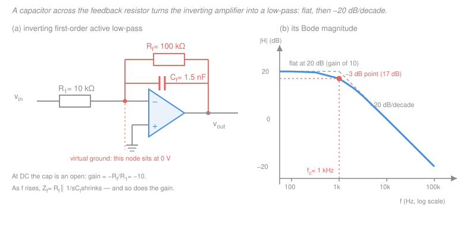

# Electronics & Semiconductors · Lesson 3.4: Active filters

> ⏱ ~15 min · Module 3: Op-amps & analog design · Builds on: [3.1 The ideal op-amp](03-01-ideal-op-amp-inverting-noninverting.md), [3.3 Integrators & differentiators](03-03-integrators-differentiators.md), [`circuits` 4.2 Impedance & phasor analysis](../../circuits/lessons/04-02-impedance-phasor-analysis.md) · Unlocks: 3.5 (comparators & Schmitt triggers), 4.2 (gain–bandwidth)

## Why this matters

Every real signal arrives dirty. A microphone picks up 60 Hz hum under the voice; a strain gauge sits on a rumbling machine; an ADC input needs everything above half the sampling rate removed before it samples ([`signals-systems` 3.1](../../signals-systems/lessons/03-01-sampling-nyquist-shannon.md)). A **filter** is the block that keeps the band you want and throws away the rest.

You already know how to build one passively: an R and a C, from [`circuits` 3.2](../../circuits/lessons/03-02-first-order-rc-rl-transients.md). So why does essentially every real analog front end put an op-amp in the filter? That question — not the transfer-function algebra — is the content of this lesson. The theory of filters (poles, Bode plots, why the ideal brick wall is unbuildable) lives in [`signals-systems` 2.5](../../signals-systems/lessons/02-05-transfer-functions-poles-zeros.md) and [`signals-systems` 4.4](../../signals-systems/lessons/04-04-filter-design-basics.md), with the plotting mechanics in [`control-systems` 3.3](../../control-systems/lessons/03-03-frequency-response-bode-plots.md). Here you learn to turn a spec — "gain of 10, corner at 1 kHz" — into three component values you can buy.

## The idea

**Three things a passive RC filter cannot do, and an op-amp fixes all three.**

**1. It cannot have gain.** A passive RC low-pass is a voltage divider between $R$ and $C$; its output is always some fraction of its input. Best case, at DC, it passes 1.0. If your sensor puts out 20 mV and your ADC wants 2 V, filtering alone leaves you 100× short, and you need an amplifier anyway.

**2. Its response moves when you connect a load.** This is the sneaky one. Design a passive $R = 10\ \text{k}\Omega$, $C = 10\ \text{nF}$ low-pass and its corner is at 1.59 kHz — on the bench, with a scope probe. Now feed the next stage, whose input resistance happens to be 10 kΩ. That load sits across the capacitor, so the source the capacitor now sees is $R \parallel R_L = 5\ \text{k}\Omega$: the corner **doubles** to 3.18 kHz and the passband gain **halves**. Your filter's specification depends on what you plug into it. That is not a design, it is a negotiation.

**3. Cascading doesn't stack cleanly.** Want a steeper rolloff, so you chain two RC sections? The second section loads the first, exactly as in reason 2 above, so the result is *not* the product of the two isolated responses. Two identical cascaded RC sections give $1/(1 + 3sRC + s^2R^2C^2)$ — note the **3**, not the 2 you'd get from $(1+sRC)^2$. The interaction has smeared the response into something soggier than you designed.

An op-amp cures all three at once, because of the properties from [3.1](03-01-ideal-op-amp-inverting-noninverting.md): it supplies gain, its output impedance is near zero (so the load cannot move your corner), and its inverting input is a virtual ground (so the *next* stage's input network cannot reach back and disturb the previous one). Stages become **independent blocks you can multiply together**.

There is a fourth, purely practical reason: to make a *passive* filter with gain-like sharpness at audio frequencies you need inductors, and inductors at low frequencies are physically large, lossy (real winding resistance), expensive, and they pick up magnetic hum. An op-amp plus a capacitor synthesizes the same behavior out of parts that cost pennies. **Below a few MHz, active beats passive almost every time.**

**And the design method is a single idea.** The inverting amplifier's gain is $A_v = -Z_f/Z_{in}$ — the ratio of two impedances. Make either one frequency-dependent and you get a filter. That's it. You have already seen the two extremes in [3.3](03-03-integrators-differentiators.md): the integrator is the case where $Z_f$ is a pure capacitor (gain $\to\infty$ at DC), the differentiator is the case where $Z_{in}$ is a pure capacitor (gain $\to\infty$ at high $f$). Putting a *resistor* alongside each capacitor tames those infinities into a flat passband — which is exactly what a first-order filter is.

## The formal version

Throughout, $s = j\omega$ is the complex frequency, $\omega = 2\pi f$ is angular frequency (rad/s) with $f$ in hertz, and $H(s) = V_{out}/V_{in}$ is the **transfer function** — output over input as a function of frequency. All the op-amp rules are the ideal ones from [3.1](03-01-ideal-op-amp-inverting-noninverting.md): no input current, and negative feedback holds the inverting input at the same potential as the non-inverting one (here, ground).

**The master rule.** For an inverting configuration with input impedance $Z_{in}$ and feedback impedance $Z_f$,

$$\boxed{\,H(s) = -\frac{Z_f(s)}{Z_{in}(s)}\,}$$

*In words: the inverting amplifier's gain is minus the feedback impedance over the input impedance, at every frequency separately.* Impedances of R and C are $Z_R = R$ and $Z_C = 1/(sC)$ ([`circuits` 4.2](../../circuits/lessons/04-02-impedance-phasor-analysis.md)).

**First-order low-pass: $R_1$ in, $R_f \parallel C_f$ in feedback.** The feedback impedance is a resistor in parallel with a capacitor:

$$Z_f = R_f \parallel \frac{1}{sC_f} = \frac{R_f \cdot \frac{1}{sC_f}}{R_f + \frac{1}{sC_f}} = \frac{R_f}{sR_fC_f + 1},$$

multiplying top and bottom by $sC_f$ in the last step. Divide by $Z_{in} = R_1$:

$$H(s) = -\frac{Z_f}{R_1} = -\frac{R_f}{R_1}\cdot\frac{1}{1 + sR_fC_f}.$$

*In words: it's an ordinary inverting amplifier of gain $-R_f/R_1$, multiplied by a one-pole rolloff.* Reading it off:

- **DC gain** $= -R_f/R_1$ (set $s = 0$: the cap is an open circuit and vanishes).
- **Corner (cutoff) frequency** $f_c = \dfrac{1}{2\pi R_f C_f}$ — note the corner is set by $R_f$ and $C_f$ only, *not* by $R_1$.
- **Rolloff** above $f_c$: $-20$ dB/decade (gain falls 10× for every 10× in frequency), because $|1 + sR_fC_f| \to \omega R_fC_f$ when $\omega R_fC_f \gg 1$.

The magnitude you actually compute with is

$$|H(f)| = \frac{R_f/R_1}{\sqrt{1 + (f/f_c)^2}}, \qquad \text{in dB: } 20\log_{10}|H|.$$

At $f = f_c$ the denominator is $\sqrt2$, so the gain is down by $20\log_{10}\sqrt2 = 3.01$ dB — the familiar **−3 dB point**.

**First-order high-pass: $R_1$ in series with $C_1$ at the input, $R_f$ in feedback.** Now the frequency dependence is in the input leg:

$$Z_{in} = R_1 + \frac{1}{sC_1} = \frac{sR_1C_1 + 1}{sC_1} \quad\Longrightarrow\quad H(s) = -\frac{R_f}{Z_{in}} = -R_f\cdot\frac{sC_1}{1 + sR_1C_1} = -\frac{R_f}{R_1}\cdot\frac{sR_1C_1}{1 + sR_1C_1}.$$

*In words: same amplifier, but the series capacitor blocks DC and only lets the signal through once its impedance drops below $R_1$.* Passband gain (high $f$) $= -R_f/R_1$; corner $f_c = 1/(2\pi R_1C_1)$; below $f_c$ the response rises at $+20$ dB/decade, and $H(0) = 0$ — the zero at $s=0$ is the DC block.

## Picture

## Worked examples

These are parts (b) and (c) of the module's **boss problem**. Part (a) was solved in [3.2](03-02-summing-difference-instrumentation.md): an inverting summer with a 100 kΩ feedback resistor realizing $V_x = -(2V_1 + 5V_2)$ needs $R_{in,1} = 100/2 = 50\ \text{k}\Omega$ and $R_{in,2} = 100/5 = 20\ \text{k}\Omega$, so the gain **from $V_2$ to $V_x$ is $-5$**. Now filter it.

**Example 1 — design to a spec (boss problem 3b).** *Build an inverting first-order active low-pass with DC gain $-10$ and $f_c = 1$ kHz.*

Two equations, three unknowns — so one value is yours to choose, and choosing it well is the whole craft. Start with the gain, since it fixes a ratio:

$$\frac{R_f}{R_1} = 10.$$

Pick $R_1 = 10\ \text{k}\Omega$ (comfortably inside the sane 1 kΩ–1 MΩ window: big enough not to load the previous stage, small enough that stray capacitance and op-amp bias currents don't matter). Then $R_f = 100\ \text{k}\Omega$. Now the corner:

$$C_f = \frac{1}{2\pi R_f f_c} = \frac{1}{2\pi (10^5)(10^3)} = \frac{1}{6.2832\times 10^{8}} = 1.592\times10^{-9}\ \text{F} = 1.59\ \text{nF}.$$

You cannot buy 1.59 nF. The nearest standard value is **1.5 nF**, so the honest design is $R_1 = 10\ \text{k}\Omega$, $R_f = 100\ \text{k}\Omega$, $C_f = 1.5\ \text{nF}$, and the corner you actually get is

$$f_c = \frac{1}{2\pi (10^5)(1.5\times10^{-9})} = \frac{1}{9.4248\times10^{-4}} = 1061\ \text{Hz} = 1.06\ \text{kHz}.$$

*Check.* DC gain is exactly $-100\text{k}/10\text{k} = -10$ ($20\log_{10}10 = 20$ dB) — unaffected by the capacitor swap, because $R_1$ and $R_f$ alone set it. The corner lands 6.1% high, which is the price of a 6.1%-off capacitor; and $1.5\ \text{nF} \times 1.061 = 1.592\ \text{nF}$ recovers the ideal value, confirming the arithmetic. ✓

**Example 2 — the whole chain (boss problem 3c).** *Find the gain from $V_2$ to the output at DC, and its magnitude at 10 kHz.*

Because the op-amp buffers each stage, the chain's transfer function is simply the **product** of the two stages':

$$A(f) = \underbrace{(-5)}_{\text{summer}} \times \underbrace{\left(-\frac{10}{1 + jf/f_c}\right)}_{\text{low-pass}}.$$

**At DC** ($f = 0$): the capacitor is an open circuit, so the filter is just a gain of $-10$, and

$$A(0) = (-5)(-10) = +50.$$

Two inversions make a non-inversion. In dB, $20\log_{10}50 = 33.98\ \text{dB}$.

**At 10 kHz**, using the nominal $f_c = 1$ kHz, the ratio $f/f_c = 10$ — a full decade past the corner:

$$|H_{LP}| = \frac{R_f/R_1}{\sqrt{1 + (f/f_c)^2}} = \frac{10}{\sqrt{1 + 10^2}} = \frac{10}{\sqrt{101}} = \frac{10}{10.050} = 0.9950.$$

$$|A| = 5 \times 0.9950 = 4.975 \approx 4.98.$$

*Check.* One decade past the corner a first-order filter is down 20 dB, i.e. a factor of 10 — and indeed the stage's gain fell from 10 to 0.995, almost exactly 10× down. Overall $20\log_{10}4.975 = 13.94$ dB, which is $33.98 - 20.04$ dB. ✓ The chain has gone from amplifying $V_2$ 50× at DC to barely 5× at 10 kHz: hum-free amplification, high-frequency noise thrown away.

*Worth noting:* with the **real** 1.5 nF part, $f_c = 1061$ Hz, so $f/f_c = 9.425$, $|H_{LP}| = 10/\sqrt{89.83} = 1.055$, and $|A| = 5.28$ — 6% higher than the nominal answer. Component tolerance shows up directly in the stopband, which is why a filter that must hit a stopband number gets 1% parts.

**Practicalities you will actually use.**

- **Choose the capacitor first, then compute the resistor.** Capacitors come in coarse steps (E6: 1, 1.5, 2.2, 3.3, 4.7, 6.8) and with sloppy tolerances; resistors come in E24 or E96 steps and 1% grades. Picking a standard cap and solving $R = 1/(2\pi f_c C)$ gets you far closer to the target corner than the reverse. (Example 1 went the other way to keep the gain arithmetic clean — legitimate when the *gain* is the tighter spec.)
- **Keep resistors between about 1 kΩ and 1 MΩ.** Below 1 kΩ you're asking the op-amp to drive current it may not have; above 1 MΩ, bias-current offsets and stray pF start writing your transfer function for you.
- **Check that the gain–bandwidth is there.** An op-amp's closed-loop gain and bandwidth trade off against each other ([4.2](04-02-frequency-response-gain-bandwidth.md)). A gain-of-10 stage that must stay flat to 1 kHz needs a gain–bandwidth product of only $\sim$10 kHz — every op-amp ever made. The same gain at 1 MHz needs GBW $\gtrsim$ 10 MHz, which narrows the catalog and costs money. If the op-amp runs out of gain near your corner, the filter's actual rolloff is *the op-amp's*, not the one you designed.

**Beyond first order: Sallen–Key (a taste).** One op-amp can give you a **second-order** response — $-40$ dB/decade — with the **Sallen–Key** topology: two RC sections feeding the non-inverting input, with the first section's capacitor returned to the op-amp *output* instead of to ground. That deliberate sliver of positive feedback fights the natural damping near the corner, and the component ratios set how hard it fights — i.e. they set the **quality factor $Q$**, hence how peaked or how flat the knee is. Choosing $Q = 0.707$ gives a Butterworth (maximally flat passband); higher $Q$ gives Chebyshev-style ripple in exchange for a sharper corner. What those names mean and how to place the poles is [`signals-systems` 4.4](../../signals-systems/lessons/04-04-filter-design-basics.md)'s job.

Note the contrast with brute-force cascading. Chaining $n$ buffered first-order stages does give you $-20n$ dB/decade far out — but every stage is already $-3$ dB at its own corner, so $n$ of them are $-3n$ dB there, and the knee sags badly before the slope arrives. A proper $n$-th order design instead places the poles deliberately (as a Sallen–Key section does) so the passband stays flat right up to the corner and *then* falls.

## Watch out

- **You might think $R_1$ affects the low-pass corner.** It doesn't. In $H(s) = -(R_f/R_1)/(1+sR_fC_f)$, $R_1$ appears only in the gain and $C_f$ only in the corner, while $R_f$ appears in **both**. That's the useful asymmetry: set the ratio $R_f/R_1$ for gain, then set $C_f$ for the corner without disturbing the gain. In the *high-pass*, the coupling runs the other way — $R_1$ sets both the gain and the corner — so there you fix $C_1$ and $R_1$ for the corner first, then scale $R_f$ for gain.
- **You might read "$-3$ dB" as "small".** At the corner the output is $1/\sqrt2 = 0.707$ of the passband — nearly 30% of your signal is already gone. A filter specified at $f_c$ is *not* passing that frequency cleanly; if you need flat response out to 10 kHz, put the corner well above it.
- **You might expect the filter's rolloff to continue forever.** It won't. Far above $f_c$ the op-amp's own falling open-loop gain and its output slew limit take over, and a real first-order low-pass often shows its stopband attenuation flattening out (feedthrough through the board and the feedback capacitor's parasitic inductance). Datasheet stopband numbers stop being trustworthy a couple of decades out.

## One-liner

> An active filter is just the inverting amplifier $A_v = -Z_f/Z_{in}$ with one impedance made frequency-dependent — you get gain, a load-proof corner, and stages that cascade by multiplication, none of which a passive RC can give you.

## Problems

**P1 (🟢)** Design an inverting first-order active **high-pass** to block DC and low-frequency rumble ahead of an audio stage: passband gain $-5$, corner at approximately 100 Hz, built around a standard 100 nF capacitor. Give $R_1$ and $R_f$ from the E24 series (…, 12, 13, 15, 16, 18, 20, 22, …, 68, 75, 82, 91, ×10ⁿ), then state the actual corner frequency and the passband gain in dB.

**P2 (🟡)** A passive RC low-pass uses $R = 10\ \text{k}\Omega$ and $C = 10\ \text{nF}$ (output taken across $C$). (a) Find its corner frequency unloaded. (b) Now connect a load $R_L = 10\ \text{k}\Omega$ across the capacitor. Find the new DC gain and the new corner frequency. (c) What happens to both if you insert a unity-gain op-amp buffer between the filter and the load?

**P3 (🔴)** You cascade two *buffered* (op-amp) first-order low-pass stages, each with $f_c = 1\ \text{kHz}$. (a) At what frequency is the **overall** response down 3 dB? (b) What is the overall attenuation, in dB relative to DC, at 10 kHz? (c) If the spec demands the overall $-3$ dB point sit at exactly 1 kHz, what corner must each stage have?

Solutions

**P1** For the inverting high-pass, $f_c = 1/(2\pi R_1 C_1)$ and passband gain $= -R_f/R_1$. With $C_1 = 100\ \text{nF} = 10^{-7}$ F, the ideal input resistor is

$$R_1 = \frac{1}{2\pi f_c C_1} = \frac{1}{2\pi (100)(10^{-7})} = \frac{1}{6.2832\times10^{-5}} = 15{,}915\ \Omega.$$

The E24 neighbors are 15 kΩ and 16 kΩ. Take **$R_1 = 15\ \text{k}\Omega$**, because then the gain resistor $R_f = 5R_1 = 75\ \text{k}\Omega$ is *itself* an E24 value and the gain comes out exact. (16 kΩ would need $R_f = 80\ \text{k}\Omega$, which is not E24; the nearest 82 kΩ would push the gain to $-5.125$.)

Actual corner:

$$f_c = \frac{1}{2\pi (15{,}000)(10^{-7})} = \frac{1}{9.4248\times10^{-3}} = 106.1\ \text{Hz}.$$

Passband gain $= -75\ \text{k}\Omega/15\ \text{k}\Omega = -5$ exactly, i.e. $20\log_{10}5 = 13.98 \approx 14.0$ dB.

**Design: $C_1 = 100$ nF, $R_1 = 15\ \text{k}\Omega$, $R_f = 75\ \text{k}\Omega$.**

*Check.* Both resistors sit inside the 1 kΩ–1 MΩ window ✓. The corner is 6.1% above target — acceptable here, since a rumble filter's job is "somewhere near 100 Hz", and a 6% error at 106 Hz costs you almost nothing in the audio band. Sanity on direction: a *smaller* $R_1$ means the capacitor's impedance matches it at a *higher* frequency, so the corner should rise — 15 kΩ < 15.9 kΩ gives 106 Hz > 100 Hz ✓.

**P2**

(a) Unloaded, $|H| = |1/(1+sRC)|$ with corner

$$f_c = \frac{1}{2\pi RC} = \frac{1}{2\pi (10^4)(10^{-8})} = \frac{1}{6.2832\times10^{-4}} = 1592\ \text{Hz} \approx 1.59\ \text{kHz}.$$

(b) Thévenize what the capacitor sees. Looking back from the capacitor's terminals with the source zeroed, the resistance is $R \parallel R_L = 10\text{k} \parallel 10\text{k} = 5\ \text{k}\Omega$, and the open-circuit source is the divider $V_{in}R_L/(R + R_L) = 0.5\,V_{in}$. So

$$H(s) = \frac{0.5}{1 + s(5\ \text{k}\Omega)C}: \qquad \text{DC gain } = 0.5\ (-6.02\ \text{dB}), \qquad f_c = \frac{1}{2\pi (5000)(10^{-8})} = 3183\ \text{Hz}.$$

The passband **halved** and the corner **doubled**, from one resistor you didn't design. That is reason 2 of the "why active" list, in numbers.

(c) With a unity-gain buffer in between, the load sees the buffer's near-zero output impedance and the filter sees the buffer's near-infinite input impedance. Nothing is drawn from the capacitor node, so DC gain returns to **1.0** and the corner returns to **1592 Hz** — the design is restored exactly, which is the entire reason op-amps live in filters.

*Check.* Consistency: at DC the loaded circuit is a plain resistive divider $R_L/(R+R_L) = 1/2$ ✓, and the corner scales as $1/R_{\text{eff}}$, so halving $R_{\text{eff}}$ from 10 kΩ to 5 kΩ must double 1592 Hz to 3183 Hz ✓.

**P3** Each buffered stage contributes $1/\sqrt{1+x^2}$ with $x = f/f_c$, so the cascade's magnitude relative to DC is

$$|H_{\text{tot}}(x)| = \left(\frac{1}{\sqrt{1+x^2}}\right)^{2} = \frac{1}{1+x^2}.$$

(a) Set $|H_{\text{tot}}| = 1/\sqrt2$:

$$\frac{1}{1+x^2} = \frac{1}{\sqrt2} \;\Longrightarrow\; 1 + x^2 = \sqrt2 = 1.4142 \;\Longrightarrow\; x = \sqrt{0.4142} = 0.6436.$$

So the overall $-3$ dB frequency is $0.6436 \times 1000 = \mathbf{644\ Hz}$, well *below* either stage's corner. At 1 kHz itself each stage is $-3$ dB, so the pair is $-6$ dB — the soggy knee.

(b) At 10 kHz, $x = 10$:

$$|H_{\text{tot}}| = \frac{1}{1 + 100} = \frac{1}{101} \;\Longrightarrow\; 20\log_{10}\frac{1}{101} = -40.09\ \text{dB}.$$

(c) The overall $-3$ dB point sits at $0.6436 f_c$, so to place it at 1 kHz each stage needs

$$f_c = \frac{1000}{0.6436} = 1554\ \text{Hz}.$$

*Check.* Verify (c) by substitution: $x = 1000/1554 = 0.6435$, $|H_{\text{tot}}| = 1/(1+0.4141) = 0.7072 \approx 1/\sqrt2$ ✓. And (b) matches the asymptote: two poles give $-40$ dB/decade, and 10 kHz is one decade past the (nominal) corner, so $\approx -40$ dB ✓. The moral: cascading identical sections shrinks the usable bandwidth and rounds the knee — a Sallen–Key section placing its poles deliberately holds the passband flat to 1 kHz *and* then falls at $-40$ dB/decade.

## Flashback

**From Lesson 2.5 (MOSFET biasing & the common-source amplifier):** An NMOS with threshold $V_t = 1$ V is biased in saturation at $I_D = 1$ mA with an overdrive $V_{ov} = V_{GS} - V_t = 0.5$ V. Its source is grounded, the drain resistor is $R_D = 4.7\ \text{k}\Omega$, and the supply is $V_{DD} = 10$ V. Find $g_m$ and the small-signal voltage gain, and confirm the device really is in saturation.

Solution

Transconductance from the overdrive form:

$$g_m = \frac{2I_D}{V_{ov}} = \frac{2(1\ \text{mA})}{0.5\ \text{V}} = 4\ \text{mA/V}.$$

Common-source gain (source grounded, drain loaded only by $R_D$, ignoring channel-length modulation):

$$A_v = -g_m R_D = -(4\times10^{-3})(4700) = -18.8.$$

Bias check: the DC drain voltage is $V_D = V_{DD} - I_D R_D = 10 - (10^{-3})(4700) = 5.3\ \text{V}$. With the source at 0 V, $V_{DS} = 5.3\ \text{V}$, and saturation requires $V_{DS} \ge V_{ov} = 0.5\ \text{V}$. Since $5.3 \gg 0.5$, the device is comfortably in saturation, with plenty of headroom for the output swing.

*Check.* Units: $g_m R_D = (\text{A/V})(\text{V/A})$ is dimensionless ✓. Sign: raising the gate raises $I_D$, which drops more voltage across $R_D$ and pulls the drain *down* — inverting, as the minus sign says ✓. Magnitude sanity: $g_mR_D$ of a couple dozen is typical for a discrete common-source stage.

## Connections

- **Backward:** this is [3.3](03-03-integrators-differentiators.md) with the infinities tamed — put a resistor across the integrator's capacitor and the DC gain stops running away, giving a low-pass; put a resistor in series with the differentiator's capacitor and the high-frequency gain stops running away, giving a high-pass. Both rest on the virtual-ground analysis of [3.1](03-01-ideal-op-amp-inverting-noninverting.md) and the impedance algebra of [`circuits` 4.2](../../circuits/lessons/04-02-impedance-phasor-analysis.md).
- **Forward:** [4.2](04-02-frequency-response-gain-bandwidth.md) explains the ceiling this lesson kept gesturing at — the op-amp's own gain–bandwidth product, which decides whether your designed corner or the amplifier's corner wins. [4.4](04-04-adc-dac.md) needs an anti-aliasing low-pass in front of every converter, and this is the circuit that builds it.
- **Sideways:** the same $H(s)$ is a *transfer function* with a single pole at $s = -1/(R_fC_f)$ — the object of [`signals-systems` 2.5](../../signals-systems/lessons/02-05-transfer-functions-poles-zeros.md), plotted by the rules of [`control-systems` 3.3](../../control-systems/lessons/03-03-frequency-response-bode-plots.md), and chosen (Butterworth, Chebyshev, how many poles you need) by [`signals-systems` 4.4](../../signals-systems/lessons/04-04-filter-design-basics.md). A filter designer hands you pole locations; this lesson is how you buy them.
