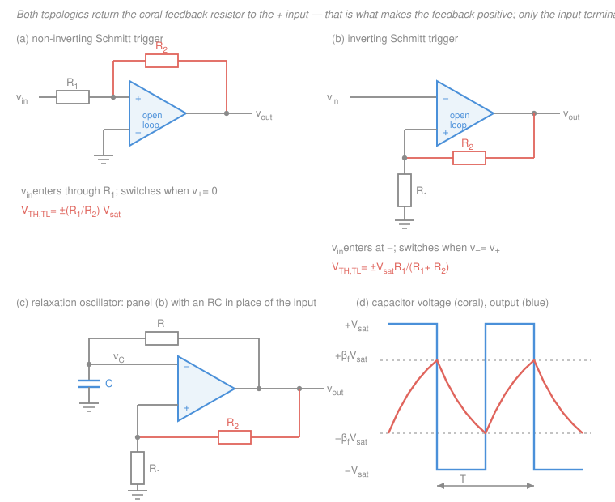

# Electronics & Semiconductors · Lesson 3.5: Comparators & Schmitt triggers

> ⏱ ~15 min · Module 3: Op-amps & analog design · Builds on: [3.1 The ideal op-amp](03-01-ideal-op-amp-inverting-noninverting.md), [`circuits` 3.2 First-order RC transients](../../circuits/lessons/03-02-first-order-rc-rl-transients.md) · Unlocks: [4.3 CMOS logic](04-03-cmos-inverter-gates.md), [4.4 ADC & DAC](04-04-adc-dac.md), [digital-logic](../../digital-logic/syllabus.md)

## Why this matters

Everything in Module 3 so far has been an *analog* machine: you put in a voltage, you get out a proportional voltage. This lesson is the hinge. A comparator throws away the magnitude and keeps only one bit — **is $v_{in}$ above the reference or below it?** — and that bit is the atom every digital system is built from. Your ADC ([4.4](04-04-adc-dac.md)) is a stack of them. Your CMOS gate ([4.3](04-03-cmos-inverter-gates.md)) is one in disguise.

But a naive comparator is a terrible decision-maker: give it a slow, slightly noisy input and it produces a burst of edges instead of one. The fix — **hysteresis**, added with a single resistor of *positive* feedback — is one of the highest-value tricks in all of electronics, and it produces something you have not seen yet in this course: a circuit whose output depends on its **history**. That is memory, and it is the doorway to [digital-logic](../../digital-logic/syllabus.md).

## The idea

Take the op-amp and do the one thing [3.1](03-01-ideal-op-amp-inverting-noninverting.md) told you never to do: **remove the feedback resistor entirely.**

Recall why the "golden rule" $v_+ = v_-$ worked. It was never a property of the op-amp; it was a property of the *loop*. Negative feedback drove the output wherever it had to go to force the two inputs together, and since the gain $A_{OL}$ was enormous, "wherever it had to go" corresponded to an almost-zero input difference. Kill the feedback and the argument evaporates. Now the op-amp just does what its data sheet says: multiply the input difference by $A_{OL} \approx 2\times10^5$. With a 12 V rail, an input difference of a mere $12/(2\times10^5) = 60\ \mu\text{V}$ is already enough to slam the output into the supply. Any realistic input difference is thousands of times bigger than that, so the output is **always** at one rail or the other. The op-amp has become a one-bit yes/no machine.

So far, so good — until the input is slow and noisy. Imagine a temperature sensor drifting upward past your threshold over a second, with a few millivolts of hash riding on it. Near the crossing, the noise repeatedly pushes the input back and forth across the line, and the output faithfully reports every single crossing: a machine-gun burst of edges where you wanted one. That is **chatter**, and it will trigger your counter five times, or make your relay buzz.

The cure is elegant. **Move the threshold out of the way the moment you cross it.** If crossing upward at 0.5 V immediately drops the threshold to $-0.5$ V, then the noise — only a few millivolts — cannot possibly reach back down to it. To flip back you now need a *genuine* 1 V reversal of the signal, not a wiggle. You get this for free by feeding a slice of the output back to the **non-inverting** input: the output moves the threshold, always in the direction that runs away from the input. Two thresholds instead of one; the gap between them is the **hysteresis**, and it is exactly the noise immunity you bought.

## The formal version

### The comparator (open loop)

With no feedback path, the op-amp output is

$$v_{out} = \begin{cases} +V_{sat} & \text{if } v_+ > v_- \\ -V_{sat} & \text{if } v_+ < v_- \end{cases}$$

where $V_{sat}$ (volts) is the **saturation voltage** — for a general-purpose op-amp, typically a volt or so inside each supply rail (a $\pm 15$ V op-amp might give $\pm 13.5$ V). *In words: the output reports only the **sign** of $v_+ - v_-$, at full amplitude.* The golden rule $v_+ = v_-$ from [3.1](03-01-ideal-op-amp-inverting-noninverting.md) **does not apply here** — it was a consequence of negative feedback, and there is none.

**Op-amp vs. real comparator IC.** An op-amp *works* like this but is bad at it: internal compensation makes it slow to climb out of saturation (tens of microseconds for a 741-class part). A dedicated comparator (LM339, LM393) is built for fast large-signal recovery, sub-microsecond, and usually has an **open-collector** (or open-drain) output — a bare transistor pulling down to ground, which does nothing until you add an external **pull-up resistor** to whatever rail you want. That is a feature: tie the pull-up to 3.3 V and the output is a clean logic level, no level shifting.

### The non-inverting Schmitt trigger

Topology: $v_{in}$ enters through $R_1$ to the **+** terminal, $R_2$ runs from the output back to the **+** terminal, and the **−** terminal is grounded. By superposition ([`circuits` 2.3](../../circuits/lessons/02-03-superposition-source-transformation.md)) at the + node, with $v_{in}$ and $v_{out}$ each driving through its own resistor:

$$v_+ = \frac{R_2}{R_1+R_2}\,v_{in} + \frac{R_1}{R_1+R_2}\,v_{out}.$$

*In words: the + terminal sees a weighted blend of the input and whatever rail the output is currently sitting at.* Since $v_- = 0$, the circuit switches at the instant $v_+ = 0$:

$$R_2\,v_{in} + R_1\,v_{out} = 0 \quad\Longrightarrow\quad v_{in} = -\frac{R_1}{R_2}\,v_{out}.$$

Now read off both cases. If the output is currently **low** ($v_{out} = -V_{sat}$), a *rising* input trips it at

$$V_{TH} = -\frac{R_1}{R_2}\left(-V_{sat}\right) = \frac{R_1}{R_2}V_{sat}.$$

If the output is currently **high** ($v_{out} = +V_{sat}$), a *falling* input trips it at

$$V_{TL} = -\frac{R_1}{R_2}\left(+V_{sat}\right) = -\frac{R_1}{R_2}V_{sat}.$$

$$\boxed{\;\Delta V = V_{TH} - V_{TL} = 2\,\frac{R_1}{R_2}\,V_{sat}\;}$$

*In words: the two thresholds sit symmetrically about zero, and the resistor ratio alone sets how far apart they are.* This circuit is **non-inverting**: input above $V_{TH}$ gives output high.

### The inverting Schmitt trigger

Topology: $v_{in}$ goes straight to the **−** terminal; the + terminal is driven by a divider — $R_1$ from + to ground, $R_2$ from the output to +. There is no input current path into +, so it is a plain voltage divider ([`circuits` 1.4](../../circuits/lessons/01-04-voltage-current-dividers.md)):

$$v_+ = \frac{R_1}{R_1+R_2}\,v_{out} \equiv \beta_f\, v_{out}, \qquad \beta_f \equiv \frac{R_1}{R_1+R_2}.$$

$\beta_f$ (dimensionless, between 0 and 1) is the **feedback fraction** — the slice of the output that returns to the input. (Careful: in this course a bare $\beta$ is the BJT current gain from [2.2](02-02-bjt-dc-biasing.md). Feedback fractions always carry the subscript $f$.) Switching happens when $v_- = v_+$, i.e. when $v_{in}$ reaches whichever value $v_+$ currently holds:

$$V_{TH} = +\beta_f V_{sat} = \frac{R_1}{R_1+R_2}V_{sat}, \qquad V_{TL} = -\beta_f V_{sat}, \qquad \Delta V = 2\beta_f V_{sat}.$$

*In words: the thresholds are just the divider's view of each rail.* This circuit **inverts**: input above $V_{TH}$ gives output low.

Note the two ratios are genuinely different — $R_1/R_2$ for the non-inverting version, $R_1/(R_1+R_2)$ for the inverting one. The non-inverting form has no upper bound (you can make $\Delta V$ exceed $2V_{sat}$, which just means the thing never switches); the inverting form is capped at $\Delta V < 2V_{sat}$.

### The transfer characteristic — a circuit with memory

Plot $v_{out}$ against $v_{in}$ and you do **not** get a curve. You get a **rectangular loop**: for any input strictly between $V_{TL}$ and $V_{TH}$, the output can be either rail, and which one it is depends on *which way the input was moving when it got there*. A single number $v_{in}$ no longer determines $v_{out}$; you also need one bit of history.

That is memory, in the most literal sense — and it is the same positive-feedback mechanism that makes a latch or a flip-flop hold a bit ([digital-logic](../../digital-logic/syllabus.md)). A Schmitt trigger is the simplest circuit in this course that remembers something.

## Picture

## Worked examples

**Example 1 (design a hysteresis band, then move it).** An op-amp on $\pm 12$ V rails saturates at $V_{sat} = \pm 12$ V (idealizing). The input is a slow sensor signal carrying about 0.3 V of peak-to-peak noise. Design a non-inverting Schmitt trigger with 1 V of hysteresis.

From the boxed result, $\Delta V = 2(R_1/R_2)V_{sat}$:

$$\frac{R_1}{R_2} = \frac{\Delta V}{2V_{sat}} = \frac{1}{2 \times 12} = \frac{1}{24}.$$

Take $R_1 = 1\ \text{k}\Omega$, $R_2 = 24\ \text{k}\Omega$ (both standard E24 values). **Verify both thresholds:**

$$V_{TH} = \frac{1}{24}(12) = +0.50\ \text{V}, \qquad V_{TL} = -\frac{1}{24}(12) = -0.50\ \text{V}, \qquad \Delta V = 1.00\ \text{V}\ \checkmark$$

The 1 V band comfortably swallows the 0.3 V of noise, so one crossing gives one edge.

**Centring the band somewhere else.** Those thresholds straddle zero, which is useless if your sensor rides on a 2.5 V pedestal. Fix: tie the **−** terminal to a reference $V_{ref}$ instead of ground. Switching now occurs when $v_+ = V_{ref}$:

$$\frac{R_2 v_{in} + R_1 v_{out}}{R_1+R_2} = V_{ref} \quad\Longrightarrow\quad v_{in} = \left(1+\frac{R_1}{R_2}\right)V_{ref} - \frac{R_1}{R_2}v_{out}.$$

*In words: the whole hysteresis band slides by $(1 + R_1/R_2)V_{ref}$; its width is untouched.* To centre it at 2.5 V, choose $V_{ref} = 2.5 \times \frac{24}{25} = 2.40\ \text{V}$. Check:

$$V_{TH} = 2.5 - \tfrac{1}{24}(-12) = 3.00\ \text{V}, \qquad V_{TL} = 2.5 - \tfrac{1}{24}(+12) = 2.00\ \text{V},$$

still exactly 1 V apart. ✓

**Example 2 (a circuit that makes its own clock).** Take the **inverting** Schmitt trigger, delete the input source, and instead run a resistor $R$ from the output back to the **−** terminal with a capacitor $C$ from that terminal to ground. Nothing drives it — and it oscillates.

Why: suppose the output has just gone to $+V_{sat}$. The + terminal now sits at $+\beta_f V_{sat}$, while the capacitor (which was last left at $-\beta_f V_{sat}$) starts charging toward $+V_{sat}$ through $R$ with time constant $\tau = RC$ ([`circuits` 3.2](../../circuits/lessons/03-02-first-order-rc-rl-transients.md)):

$$v_C(t) = V_{sat} - \left(1+\beta_f\right)V_{sat}\,e^{-t/RC}.$$

It flips when $v_C$ reaches $+\beta_f V_{sat}$:

$$\beta_f = 1 - (1+\beta_f)e^{-t/RC} \;\Longrightarrow\; e^{-t/RC} = \frac{1-\beta_f}{1+\beta_f} \;\Longrightarrow\; t = RC\ln\frac{1+\beta_f}{1-\beta_f}.$$

That is a half period, and by symmetry the other half is identical. Substituting $\beta_f = R_1/(R_1+R_2)$ gives $\frac{1+\beta_f}{1-\beta_f} = \frac{2R_1+R_2}{R_2}$, so

$$\boxed{\;T = 2RC\,\ln\!\left(1+\frac{2R_1}{R_2}\right)\;}$$

with $R_1$ the **ground-leg** resistor of the inverting Schmitt and $R_2$ the **feedback** resistor.

Numbers: $R_1 = R_2 = 10\ \text{k}\Omega$ makes $\beta_f = 0.5$ and $\ln 3 = 1.0986$. With $R = 47\ \text{k}\Omega$ and $C = 10\ \text{nF}$, $RC = 470\ \mu\text{s}$ and

$$T = 2(470\ \mu\text{s})(1.0986) = 1.033\ \text{ms} \quad\Longrightarrow\quad f = 968\ \text{Hz}.$$

The output is a square wave, the capacitor node is a nice exponential triangle, and *neither depends on any input signal*. This is essentially the 555 timer's astable mode, and it is where clocks come from.

**Real uses, one line each.** Squaring up a slow sensor or audio signal into clean logic edges · zero-crossing detection for a tachometer or frequency counter · level detection with a noisy input (a thermostat's on/off band *is* its hysteresis) · PWM generation, by comparing a control voltage against a triangle wave.

## Watch out

- **You might think the golden rule still holds.** It does not. $v_+ = v_-$ required negative feedback to enforce it; a comparator has none and a Schmitt trigger has feedback of the *wrong sign*. In a Schmitt trigger, $v_+ = v_-$ is not a steady state you can sit in — it is the knife-edge you leave instantly, in whichever direction the feedback pushes. Never "solve" one of these by setting the inputs equal and turning the crank; instead **assume a rail, find the input that breaks the assumption**.
- **You might mix up the two threshold formulas.** This is *the* classic error here. Non-inverting Schmitt: $R_1/R_2$, because the input and the output fight over the + node through separate resistors. Inverting Schmitt: $R_1/(R_1+R_2)$, because the output alone drives a simple divider. Before writing any formula, ask "which terminal does $v_{in}$ enter?" — and remember the feedback resistor lands on **+** either way.
- **You might trust $V_{sat}$ to be the rail.** It is not: it is a volt or so short of it, it varies with load and temperature, and so your thresholds drift with it. When you need repeatable thresholds, clamp the output with a Zener pair ([1.4](01-04-clippers-clampers-zener.md)) or use a comparator IC whose output is pulled to a regulated logic rail.
- **You might read the loop the wrong way round.** The non-inverting Schmitt traces its rectangle counter-clockwise (rise along the bottom, jump *up* at $V_{TH}$); the inverting one traces it clockwise. The arrows are part of the answer.

## One-liner

> Kill the feedback and an op-amp becomes a one-bit sign detector; feed a slice of the output back to the **plus** input and the threshold runs away from the signal, buying you noise immunity, two thresholds, and the course's first circuit with a memory.

## Problems

**P1 (🟢)** A non-inverting Schmitt trigger uses $R_1 = 2.2\ \text{k}\Omega$ (input resistor to the + terminal), $R_2 = 100\ \text{k}\Omega$ (output back to +), grounded − terminal, and $V_{sat} = \pm 15\ \text{V}$. Find $V_{TH}$, $V_{TL}$, and $\Delta V$. Would this reject 0.4 V peak-to-peak of input noise?

**P2 (🟡)** Design an **inverting** Schmitt trigger running on $V_{sat} = \pm 12\ \text{V}$ whose thresholds are $\pm 1.5\ \text{V}$. Give the required ratio, pick standard E24 resistors, and state the thresholds you actually get.

**P3 (🔴)** Wrap an RC around the inverting Schmitt trigger of the previous style with $R_1 = R_2 = 10\ \text{k}\Omega$, $V_{sat} = \pm 12\ \text{V}$, and $C = 22\ \text{nF}$, to build a 2 kHz relaxation oscillator. Find the required $R$, round to the nearest standard E24 value, and give the resulting frequency and the peak-to-peak voltage swing on the capacitor.

Solutions

**P1** Non-inverting topology, so the ratio is $R_1/R_2$:

$$\frac{R_1}{R_2} = \frac{2.2\ \text{k}\Omega}{100\ \text{k}\Omega} = 0.022.$$

$$V_{TH} = (0.022)(15) = +0.33\ \text{V}, \qquad V_{TL} = -(0.022)(15) = -0.33\ \text{V},$$

$$\Delta V = 2(0.022)(15) = 0.66\ \text{V}.$$

Yes — 0.66 V of hysteresis exceeds the 0.4 V peak-to-peak noise, so once the input crosses $V_{TH}$ the noise cannot carry it back down to $V_{TL}$, and you get a single clean edge.

*Check.* $\Delta V = V_{TH} - V_{TL} = 0.33 - (-0.33) = 0.66$ V ✓, and the thresholds are symmetric about zero as they must be with a grounded − terminal. Sanity: $R_1 \ll R_2$ means only a small slice of the rail reaches the + node, so a narrow band — which is what we want for a small signal.

**P2** Inverting topology, so the ratio is the feedback fraction $\beta_f = R_1/(R_1+R_2)$, and $V_{TH} = \beta_f V_{sat}$:

$$\beta_f = \frac{1.5}{12} = 0.125 = \frac18 \quad\Longrightarrow\quad \frac{R_1}{R_1+R_2} = \frac18 \quad\Longrightarrow\quad R_2 = 7R_1.$$

The exact ratio 7 is not an E24 pair. Take $R_1 = 10\ \text{k}\Omega$ and $R_2 = 68\ \text{k}\Omega$ (the closest E24 value to 70 kΩ). Then

$$\beta_f = \frac{10}{10+68} = \frac{10}{78} = 0.1282,$$

$$V_{TH} = (0.1282)(12) = +1.54\ \text{V}, \qquad V_{TL} = -1.54\ \text{V}, \qquad \Delta V = 3.08\ \text{V}.$$

That is 2.6 percent above the 1.5 V target — fine, since $V_{sat}$ itself is not known that well. (If you need it tighter, $R_1 = 10\ \text{k}\Omega$ with $R_2 = 68\ \text{k}\Omega + 2\ \text{k}\Omega$ in series lands on 70 kΩ exactly.)

*Check.* Feed $v_{in} = 0$: the output sits at some rail, say $+12$ V, putting $v_+ = +1.54$ V; since $v_- = 0 < v_+$, the output stays high — consistent, so 0 V is genuinely inside the band ✓.

**P3** Inverting Schmitt with $R_1 = R_2$ gives $\beta_f = 0.5$, so $T = 2RC\ln(1 + 2R_1/R_2) = 2RC\ln 3$. For $f = 2\ \text{kHz}$, $T = 500\ \mu\text{s}$:

$$RC = \frac{T}{2\ln 3} = \frac{500\ \mu\text{s}}{2(1.0986)} = \frac{500}{2.1972} = 227.6\ \mu\text{s}.$$

$$R = \frac{227.6\ \mu\text{s}}{22\ \text{nF}} = 10.35\ \text{k}\Omega.$$

Nearest E24 value: $R = 10\ \text{k}\Omega$. Then $RC = (10\ \text{k}\Omega)(22\ \text{nF}) = 220\ \mu\text{s}$ and

$$T = 2(220\ \mu\text{s})(1.0986) = 483\ \mu\text{s} \quad\Longrightarrow\quad f = \frac{1}{483\ \mu\text{s}} = 2.07\ \text{kHz},$$

about 3.5 percent high. The capacitor ramps between the two thresholds $\pm\beta_f V_{sat} = \pm 6\ \text{V}$, so its swing is

$$\Delta v_C = 2\beta_f V_{sat} = 2(0.5)(12) = 12\ \text{V peak-to-peak}.$$

*Check.* Units: $\mu\text{s}/\text{nF} = 10^{-6}/10^{-9}\ \Omega = 10^{3}\ \Omega = \text{k}\Omega$ ✓. Limiting sense: making $R_1 \to 0$ shrinks $\beta_f$, shrinks the band, and drives $T \to 0$ — a shorter climb, a faster oscillator, exactly as the $\ln(1+2R_1/R_2)$ factor predicts ✓.

## Flashback

**From Lesson 3.3 (Integrators & differentiators):** A *practical* op-amp integrator uses $R = 10\ \text{k}\Omega$, $C = 22\ \text{nF}$, and a DC-limiting resistor $R_f = 100\ \text{k}\Omega$ across the capacitor. (a) Find the integrator's unity-gain frequency. (b) Below what frequency does it stop integrating and act like an ordinary inverting amplifier? (c) What is its DC gain, and why is that finite value the whole point of $R_f$?

Solution

**(a)** The ideal integrator has $\lvert H \rvert = 1/(\omega RC)$, which reaches unity at

$$f_0 = \frac{1}{2\pi RC} = \frac{1}{2\pi (10^4)(22\times10^{-9})} = 723\ \text{Hz}.$$

**(b)** With $R_f$ across $C$, the feedback impedance is $R_f \parallel \frac{1}{sC}$, so

$$H(s) = -\frac{R_f}{R}\cdot\frac{1}{1+sR_fC},$$

whose corner sits at

$$f_c = \frac{1}{2\pi R_fC} = \frac{1}{2\pi (10^5)(22\times10^{-9})} = 72.3\ \text{Hz}.$$

**Above** $f_c$ the capacitor dominates and the circuit integrates; **below** it the capacitor is effectively out of the picture and you have a plain inverting amplifier.

**(c)** DC gain $= -R_f/R = -100/10 = -10$.

That finite number is exactly what $R_f$ is for. Without it the DC gain is infinite, so the op-amp's input offset voltage and bias current — small DC errors that are always present — get integrated without bound and walk the output into a rail. Capping the DC gain at 10 caps the offset-driven output error at 10 times the input offset, a few tens of millivolts instead of a saturated amplifier. The price is that the circuit is only an honest integrator above 72 Hz.

*Check.* Since $R_f = 10R$, we should have $f_c = f_0/10$: $723/10 = 72.3$ Hz. It does.

*(Tie-in to today: that $R_f$ is **negative** feedback, tamed and predictable. Today's Schmitt trigger takes the opposite turn — feedback to the $+$ terminal, which is **positive**, and instead of stabilizing an operating point it destroys one, which is precisely what gives us two thresholds instead of one.)*

## Connections

- **Backward:** this is [3.1](03-01-ideal-op-amp-inverting-noninverting.md) run in reverse. That lesson's golden rule was a *loop* property; strip the loop and only $A_{OL}$ and the rails remain. The RC ramp in the relaxation oscillator is the same first-order exponential as [3.3](03-03-integrators-differentiators.md)'s integrator and [`circuits` 3.2](../../circuits/lessons/03-02-first-order-rc-rl-transients.md).
- **Forward:** [4.1](04-01-negative-feedback.md) quantifies what *negative* feedback buys — this lesson is the control experiment showing what positive feedback does instead (it does not stabilize; it commits). The comparator is then the front end of every ADC in [4.4](04-04-adc-dac.md), and the CMOS inverter of [4.3](04-03-cmos-inverter-gates.md) gains hysteresis by exactly this trick when it needs to clean up a slow input.
- **Sideways:** positive feedback with two stable states is the bistable latch of [digital-logic](../../digital-logic/syllabus.md) — a flip-flop is a Schmitt trigger that has been given a second input. And the sign of the feedback is precisely the stability question of [`control-systems` 1.1](../../control-systems/lessons/01-01-feedback-and-the-control-problem.md): negative feedback pulls a system toward an equilibrium, positive feedback pushes it away, so the only places it can rest are the rails.
