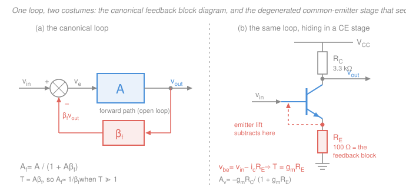

# Electronics & Semiconductors · Lesson 4.1: Negative feedback — what it buys you

> ⏱ ~15 min · Module 4: Feedback, frequency response & the digital interface · Builds on: [3.1 The ideal op-amp](03-01-ideal-op-amp-inverting-noninverting.md), [2.3 BJT small-signal amplifiers](02-03-bjt-small-signal-amplifiers.md), [`control-systems` 1.1](../../control-systems/lessons/01-01-feedback-and-the-control-problem.md) · Unlocks: [4.2 Frequency response & the gain–bandwidth product](04-02-frequency-response-gain-bandwidth.md)

## Why this matters

A silicon op-amp is a terrible amplifier. Its open-loop gain is enormous but essentially *unspecified*: a 741's is guaranteed only to exceed 20,000, a modern part's might be 200,000 today and 600,000 in a cold room, and it drifts with temperature, supply, and which wafer your chip came off. No sane engineer would design around a number like that.

And yet in [3.1](03-01-ideal-op-amp-inverting-noninverting.md) you computed inverting-amplifier gains to three significant figures without the op-amp appearing in the formula at all. That was not a simplification you got away with. It was **negative feedback** doing what it does: taking a huge, sloppy, nonlinear forward gain and trading almost all of it for a gain that is small, exact, and set by two resistors you can buy to 0.1 percent. This lesson prices that trade.

**Notation warning, once, up front.** The feedback factor is universally written $\beta$ — which in this course is already the BJT current gain $I_C/I_B$. To keep the two apart, **this course writes the feedback factor as $\beta_f$** (dimensionless when both its ports carry voltage). Most textbooks write plain $\beta$ for both and leave you to disambiguate by context; when you read Sedra & Smith, a $\beta$ in a feedback chapter is $\beta_f$, a $\beta$ in a transistor chapter is current gain.

## The idea

Here is the whole mechanism in one sentence: **measure the output, subtract a fraction of it from the input, and let a huge gain chew on what's left.**

Why that helps is worth feeling before you compute it. Suppose the forward amplifier has gain 200,000 and you feed back 1/50 of the output. The amplifier can only put out a *finite* voltage, so whatever it is doing, the voltage at its own input must be almost nothing — output divided by 200,000. Almost nothing means the fed-back fraction has almost exactly cancelled the input:

$$\beta_f v_{out} \approx v_{in} \quad\Longrightarrow\quad \frac{v_{out}}{v_{in}} \approx \frac{1}{\beta_f} = 50.$$

Notice what did the work. The forward gain being *large* mattered; its exact value did not. It could double and the argument would still run — the amplifier would simply settle at an even smaller input error to land at the same output. The forward gain is a servo motor: you don't care how strong it is, only that it is strong enough to drive the error to zero.

That is the deal on the table. You hand over raw gain — 200,000 becomes 50 — and in exchange the loop hands back **precision**: a gain that ignores the device, an output that fights back against loading, an input that stops drawing current, and a transfer curve that straightens out. It is the best trade in analog electronics, and modern op-amps are built with absurd surplus gain purely so you have something to spend.

## The formal version

### The master equation

Let $A$ be the **open-loop (forward) gain** — the gain of the amplifier alone, output per unit of *its own* input, with the loop broken. Let $\beta_f$ be the **feedback factor**: the fraction of the output that the feedback network returns to the summing node. The summing node subtracts, so the forward amplifier sees $v_{in} - \beta_f v_{out}$, and

$$v_{out} = A\,(v_{in} - \beta_f v_{out}).$$

Collect the $v_{out}$ terms: $v_{out}(1 + A\beta_f) = A v_{in}$, hence the **closed-loop gain**

$$\boxed{\;A_f \;=\; \frac{v_{out}}{v_{in}} \;=\; \frac{A}{1 + A\beta_f}\;}$$

*In words: the closed-loop gain is the forward gain divided by one-plus-the-gain-around-the-loop.*

Two names carry the rest of the lesson:

- **Loop gain** $T = A\beta_f$ — what a signal is multiplied by on one trip around the loop (through $A$, through $\beta_f$, back to the start). Dimensionless, always.
- **Desensitivity factor** $1 + T$ — the number that divides everything you want smaller and multiplies everything you want bigger.

When $T \gg 1$ the $1$ is negligible and $A_f \to A/(A\beta_f)$:

$$\boxed{\;A_f \approx \frac{1}{\beta_f}\quad\text{when } T \gg 1\;}$$

*In words: with enough loop gain, the closed-loop gain is set entirely by the feedback network — the amplifier has vanished from the answer.*

This is exactly why [3.1](03-01-ideal-op-amp-inverting-noninverting.md)'s non-inverting amplifier has gain $1 + R_f/R_1$ and its inverting cousin has gain $-R_f/R_1$ with no op-amp parameter anywhere. In the non-inverting case the feedback network is literally the divider $\beta_f = R_1/(R_1+R_f)$, and $1/\beta_f = 1 + R_f/R_1$. The "virtual short" rule of 3.1 is not an axiom — it is the statement $v_e = v_{out}/A \approx 0$, and it is *true only because* the loop is closed and $T$ is large.

An exact and useful rewrite: dividing top and bottom of the master equation by $A\beta_f$ gives

$$A_f = \frac{1}{\beta_f}\cdot\frac{T}{1+T}.$$

*In words: the real closed-loop gain falls short of the ideal $1/\beta_f$ by exactly one part in $1+T$.* Want 0.01 percent gain accuracy? You need $T \geq 10^4$.

### Gain desensitivity, quantified

Differentiate $A_f = A/(1+A\beta_f)$ with respect to $A$ using the quotient rule:

$$\frac{dA_f}{dA} = \frac{(1+A\beta_f) - A\beta_f}{(1+A\beta_f)^2} = \frac{1}{(1+T)^2}.$$

Convert to fractional (per-unit) changes by multiplying by $A/A_f = 1+T$:

$$\boxed{\;\frac{dA_f/A_f}{dA/A} \;=\; \frac{1}{1+T}\;}$$

*In words: a percentage wobble in the raw amplifier gain shows up at the output shrunk by the factor $1+T$.* (Control theory calls this quantity the **sensitivity** $S$, and derives it for a general plant in [`control-systems` 1.1](../../control-systems/lessons/01-01-feedback-and-the-control-problem.md) — same algebra, different uniform.)

### The four topologies

The loop has two connection choices: what it **samples** at the output (the output voltage, or the output current) and what it **mixes** at the input (a voltage in series with the source, or a current in shunt with it). Two by two:

| Topology | Samples at output | Mixes at input | Amplifier type | $1/\beta_f$ has units of | $R_\text{in}$ | $R_\text{out}$ |
|---|---|---|---|---|---|---|
| Series–shunt | voltage | voltage (series) | voltage amp ($v \to v$) | V/V | $\times(1+T)$ | $\div(1+T)$ |
| Shunt–shunt | voltage | current (shunt) | transresistance ($i \to v$) | $\Omega$ | $\div(1+T)$ | $\div(1+T)$ |
| Series–series | current | voltage (series) | transconductance ($v \to i$) | S | $\times(1+T)$ | $\times(1+T)$ |
| Shunt–series | current | current (shunt) | current amp ($i \to i$) | A/A | $\div(1+T)$ | $\times(1+T)$ |

(Naming convention: input connection first, output connection second.) Don't memorize four derivations — memorize the **pattern**, because the two impedance columns follow from it mechanically:

- **Series (voltage) mixing raises $R_\text{in}$ by $1+T$.**
- **Shunt (current) mixing lowers $R_\text{in}$ by $1+T$.**
- **Shunt (voltage) sampling lowers $R_\text{out}$ by $1+T$.**
- **Series (current) sampling raises $R_\text{out}$ by $1+T$.**

The mnemonic: *feedback makes a port more like the thing it is handling.* Sample voltage and the output becomes a better voltage source (low $R_\text{out}$); sample current and it becomes a better current source (high $R_\text{out}$).

### Impedance shaping, and why it works

Take **voltage sampling** properly, since it is the one you use daily. Model the forward amplifier as an ideal source $A v_e$ behind an open-loop output resistance $R_\text{out}$. Now the load pulls extra current $i_L$. That current drops $i_L R_\text{out}$ inside the amplifier and $v_{out}$ sags. But the loop is *watching* $v_{out}$: the sag shrinks $\beta_f v_{out}$, which grows the error $v_e = v_{in} - \beta_f v_{out}$, which makes the forward gain push harder — by $A$ times as much — until $v_{out}$ is very nearly back where it started. Output resistance is by definition how much the terminal voltage moves per unit of current drawn. A terminal voltage that refuses to move *is* a small output resistance:

$$R_{\text{out},f} = \frac{R_\text{out}}{1+T}.$$

Series mixing runs the same argument at the other end. For a given source voltage $v_{in}$, the voltage actually appearing across the amplifier's input terminals is only $v_e = v_{in}/(1+T)$ — the feedback has cancelled most of it. Less voltage across the same input resistance means $1+T$ times less current drawn from the source, and a source that is barely loaded sees

$$R_{\text{in},f} = R_\text{in}\,(1+T).$$

**Land this.** The "ideal op-amp" of [3.1](03-01-ideal-op-amp-inverting-noninverting.md) — infinite input resistance, zero output resistance — is not a description of the chip. A bare op-amp has maybe 2 M$\Omega$ in and 75 $\Omega$ out, which is unremarkable. Those ideal properties are **manufactured by the loop**, and they degrade exactly as fast as $T$ does with frequency. The one giveaway you already met: the *inverting* amplifier is shunt–shunt (current mixed at the virtual ground), so its input resistance is *lowered*, and indeed it is just $R_1$ — a few k$\Omega$, not infinity. The topology table predicted that.

### Linearity and distortion

Nonlinearity is a gain that depends on signal level: $A$ is 200,000 in the middle of the swing and 120,000 near the rails, or drops to zero in the dead-zone of a class-B output stage. Feed that back and the *same* desensitivity factor applies — the distortion referred to the output is divided by $1+T$.

The mechanism in one sentence: the loop does not care what input the nonlinear stage needs in order to produce the right output, it simply keeps increasing the error until the output is right. In a class-B stage sitting inside a loop, the op-amp slams its own output up by a full diode drop as the signal crosses zero, pre-distorting the drive by exactly the amount the crossover dead-zone will eat. That is why a power amplifier whose output stage looks awful on an open-loop curve tracer measures 0.005 percent THD closed-loop.

### Bandwidth

The same $1+T$ that divides gain multiplies bandwidth: a one-pole forward gain $A(s) = A_0/(1 + s/\omega_b)$ closes to $A_f(s) = [A_0/(1+T_0)] \big/ [1 + s/(\omega_b(1+T_0))]$, so gain $\times$ bandwidth is invariant. That constant is the **gain–bandwidth product**, and it gets its own lesson — [4.2](04-02-frequency-response-gain-bandwidth.md).

## Picture

## Worked examples

**Example 1 — pricing the trade (this is boss problem 4(a)'s desensitivity half).** An op-amp with $A = 2\times10^5$ is wired for a closed-loop gain of 50.

Set $\beta_f$ from the target: $1/\beta_f = 50 \Rightarrow \beta_f = 0.02$. Then

$$T = A\beta_f = 2\times10^5 \times 0.02 = 4000, \qquad 1+T = 4001.$$

The actual closed-loop gain is $A_f = 2\times10^5/4001 = 49.9875$ — short of the ideal 50 by $1/4001 = 0.025$ percent, as the exact rewrite promised.

Now shift the open-loop gain by $\pm 10$ percent. The rule of thumb says the closed-loop gain moves by $10/4001 = 0.0025$ percent. Check it exactly:

- $A = 2.2\times10^5$: $T = 4400$, $A_f = 220000/4401 = 49.98864$. That is $+0.0023$ percent.
- $A = 1.8\times10^5$: $T = 3600$, $A_f = 180000/3601 = 49.98611$. That is $-0.0028$ percent.

The estimate 0.0025 percent sits between them — the linearization is honest because $1+T$ itself moves with $A$.

Push it to the real spec sheet. Let $A$ range over a **factor of three**, $10^5$ to $3\times10^5$, which is a fair span across temperature, supply, and part-to-part:

$$A_f(10^5) = \frac{10^5}{2001} = 49.975, \qquad A_f(3\times10^5) = \frac{3\times10^5}{6001} = 49.992.$$

A 200 percent swing in the amplifier becomes a **0.033 percent** swing in the circuit. You could not buy resistors that good, and the op-amp did not have to be good at all. *Check:* both values are just under 50 and the higher-$A$ one is closer to it, which is the correct direction.

**Example 2 — you have been using feedback since Module 2.** The common-emitter stage of [2.3](02-03-bjt-small-signal-amplifiers.md) with an *unbypassed* emitter resistor $R_E$ has midband gain $A_v = -g_m R_C/(1 + g_m R_E)$. That denominator is not a coincidence. Identify the loop.

The forward amplifier is the transistor as a transconductor: it converts its own input $v_{be}$ into a collector current, $i_c = g_m v_{be}$, so the forward gain is $A = g_m$ (units A/V). The feedback network is $R_E$: it samples the *output current* $i_c$ (which flows through it) and returns a *voltage* $v_e = i_c R_E$ that appears in series with the source. So $\beta_f = R_E$ (units $\Omega$ — this is series–series, the transconductance row of the table, where $\beta_f$ is a resistance). Mixing:

$$v_{be} = v_{in} - i_c R_E, \qquad T = A\beta_f = g_m R_E .$$

Master equation, applied to the transconductance:

$$G_{m,f} = \frac{g_m}{1 + g_m R_E}, \qquad v_{out} = -G_{m,f}\,v_{in}\,R_C = -\frac{g_m R_C}{1+g_m R_E}\,v_{in}. \quad\checkmark$$

Exactly the formula from 2.3. And the $T \gg 1$ limit reads $G_{m,f} \to 1/\beta_f = 1/R_E$, i.e.

$$A_v \to -\frac{R_C}{R_E},$$

the gain set by two resistors with the transistor nowhere in sight — the op-amp story, one device down. That is what emitter degeneration *buys*: 2.3 said "gain stability and linearity at the cost of gain," and now you can price it, because the cost and the benefit are the same number, $1+g_m R_E$.

## The costs, honestly

- **You spend gain.** $2\times10^5$ became 50. Everything above is bought with that gain, and when you run out of $T$ — at high frequency, where $A$ has rolled off — the benefits vanish with it. Distortion and output impedance both rise with frequency for exactly this reason.
- **You can make a stable amplifier oscillate.** Each pole in the forward path adds phase lag. If the loop phase reaches $-180^\circ$ while $|T| > 1$, the subtraction at the summing node has become an addition and the loop sustains itself: your amplifier is now an oscillator. Preventing this is the entire subject of **gain and phase margins** — see [`control-systems` 3.4](../../control-systems/lessons/03-04-gain-and-phase-margins.md) — and it is why general-purpose op-amps ship with an internal compensation capacitor that deliberately cripples their bandwidth to keep one pole dominant.
- **It cannot clean up noise that arrives before the loop.** Feedback divides errors *generated inside the forward path* by $1+T$. Noise or hum riding on $v_{in}$, or picked up by the feedback network itself, is indistinguishable from signal and gets amplified faithfully by $1/\beta_f$. Shielding and a quiet input stage are separate problems.

## Recognize it retroactively

Almost everything you have built in this course is a feedback loop wearing a disguise. Once you see the summing node, you cannot unsee it.

- **[2.2 BJT DC biasing](02-02-bjt-dc-biasing.md)** — the emitter resistor in a divider bias network. $I_C$ tries to rise with temperature or with a high-$\beta$ part; the emitter voltage rises with it; $V_{BE}$ (held between a fixed base voltage and a rising emitter) shrinks; $I_C$ comes back down. That is a DC negative-feedback loop, and it is precisely why the Q-point is $\beta$-independent.
- **[2.3 BJT small-signal amplifiers](02-03-bjt-small-signal-amplifiers.md)** — emitter degeneration, worked above: $T = g_m R_E$, series–series. Note the table's prediction that series mixing raises input resistance, and compare with 2.3's $R_\text{in} = r_\pi(1 + g_m R_E)$. Same $1+T$.
- **[2.5 MOSFET biasing & the common-source amplifier](02-05-mosfet-biasing-common-source.md)** — source degeneration is the identical loop with $T = g_m R_S$, and self-bias is its DC version.
- **All of Module 3.** Every op-amp circuit in [3.1](03-01-ideal-op-amp-inverting-noninverting.md) through [3.4](03-04-active-filters.md) is a loop; the golden rules are the $T \gg 1$ limit. In [3.3](03-03-integrators-differentiators.md) and [3.4](03-04-active-filters.md) the feedback network is frequency-dependent, so $\beta_f = \beta_f(s)$ and $1/\beta_f(s)$ *is* the transfer function you designed. Even [3.5](03-05-comparators-schmitt-triggers.md) fits — with the sign flipped. Positive feedback gives $A_f = A/(1 - A\beta_f)$, and when $A\beta_f > 1$ the denominator goes through zero: the circuit no longer has a stable operating point and snaps to a rail. Hysteresis is instability, on purpose.

## Watch out

- **You might think $\beta_f$ is the BJT $\beta$.** It is not, and in a discrete feedback amplifier both appear in the same equation. Keep the subscript. Worse, $\beta_f$ is not always dimensionless: in series–series feedback it is a resistance (Example 2's $R_E$), and in shunt–shunt it is a conductance.
- **You might think the topology names have a fixed word order.** Sedra & Smith writes input-connection first ("series–shunt"); Boylestad and others write output-sampling first ("voltage-series") for the *same* circuit. Read the description, not the name.
- **You might think more loop gain is always better.** More $T$ is better for every static specification and worse for stability — each decade of extra gain is another decade over which the loop must not accumulate $180^\circ$ of lag. The design job is picking the largest $T$ that still leaves margin.
- **You might apply $A_f \approx 1/\beta_f$ everywhere.** It holds only where $T \gg 1$. At 100 kHz a 1 MHz-GBW op-amp has $A \approx 10$, so a gain-of-50 circuit has $T = 0.2$ and the loop is doing essentially nothing. The ideal-op-amp rules quietly stop being true long before the amplifier stops working.

## One-liner

> Negative feedback spends raw gain to buy $1+T$: gain error, output impedance, and distortion all get divided by it, input impedance and bandwidth get multiplied by it, and the closed-loop gain settles at $1/\beta_f$ — a number you chose.

## Problems

**P1 (🟢)** An op-amp with open-loop gain $A = 10^5$ is wired as a non-inverting amplifier with a target closed-loop gain of 100.
(a) Find $\beta_f$, $T$, and $1+T$.
(b) Find the actual $A_f$ and say by what percentage it falls short of 100.
(c) The op-amp's gain changes by $\pm10$ percent. Estimate the resulting percentage change in $A_f$ using the desensitivity relation, then check it exactly.

**P2 (🟡)** The same op-amp ($A = 10^5$) has an open-loop differential input resistance of 2 M$\Omega$ and an open-loop output resistance of 75 $\Omega$. It is wired as a non-inverting amplifier with closed-loop gain 10.
(a) Which topology is this, and what are $T$ and $1+T$?
(b) Estimate the closed-loop input and output resistances.
(c) In one sentence: why does the *inverting* amplifier built from the same op-amp **not** get a huge input resistance?

**P3 (🔴)** A common-emitter stage runs at $I_C = 1$ mA with $\beta = 100$, $R_C = 3.3\ \text{k}\Omega$, and a 100 $\Omega$ unbypassed emitter resistor. Take $V_T = 25$ mV.
(a) Find $g_m$, $r_\pi$, and the loop gain $T$ of the degeneration loop.
(b) Find the voltage gain with and without $R_E$, and compare both to the "infinite-$T$" asymptote $-R_C/R_E$.
(c) Find the input resistance looking into the base, with and without $R_E$, and check it against the $1+T$ rule.

Solutions

**P1**

(a) A target gain of 100 means $1/\beta_f = 100$, so $\beta_f = 0.01$. Then

$$T = A\beta_f = 10^5 \times 0.01 = 1000, \qquad 1+T = 1001.$$

(b) $A_f = \dfrac{A}{1+T} = \dfrac{10^5}{1001} = 99.9001$.

Shortfall: $(100 - 99.9001)/100 = 0.0999$ percent. *Check:* the exact rewrite says the shortfall is $1/(1+T) = 1/1001 = 0.0999$ percent. ✓

(c) Desensitivity relation: $\dfrac{dA_f/A_f}{dA/A} = \dfrac{1}{1+T} = \dfrac{1}{1001}$, so a 10 percent change in $A$ gives

$$\frac{dA_f}{A_f} = \frac{10\ \text{percent}}{1001} = 0.0100\ \text{percent}.$$

Exact check, $A = 1.1\times10^5$: $T = 1100$, $A_f = 110000/1101 = 99.90917$, a change of $+0.00908$ percent.
Exact check, $A = 0.9\times10^5$: $T = 900$, $A_f = 90000/901 = 99.88901$, a change of $-0.01110$ percent.

The estimate brackets correctly and is right to about 10 percent — good enough, and the asymmetry is real: raising $A$ also raises $1+T$, which suppresses the effect further, while lowering $A$ does the reverse.

**P2**

(a) Voltage in, voltage out, feedback taken as a voltage from the output and applied in series with the source at the inverting input: **series–shunt**. With closed-loop gain 10, $\beta_f = 0.1$, so

$$T = 10^5 \times 0.1 = 10^4, \qquad 1+T = 10001.$$

(b) Series mixing raises $R_\text{in}$; shunt (voltage) sampling lowers $R_\text{out}$:

$$R_{\text{in},f} = 2\times10^6 \times 10001 = 2.0\times10^{10}\ \Omega = 20\ \text{G}\Omega,$$
$$R_{\text{out},f} = \frac{75}{10001} = 7.5\times10^{-3}\ \Omega = 7.5\ \text{m}\Omega.$$

*Check the directions:* input up, output down — a better voltage amplifier at both ends. ✓ *Reality check:* the 20 G$\Omega$ is fiction in practice; long before you reach it, the op-amp's common-mode input resistance, input bias current, and board leakage (typically a few G$\Omega$ at best) take over. The 7.5 m$\Omega$ is real, but only at DC — it climbs in proportion to $1/T$ as $A$ rolls off, which is why a buffer's output impedance is inductive at high frequency.

(c) In the inverting amplifier the feedback current is injected **in shunt** at the virtual ground node (shunt–shunt), which *lowers* the impedance at that node to nearly zero — so the source sees only the series input resistor $R_1$.

**P3**

(a) $V_T = 25$ mV at room temperature, so

$$g_m = \frac{I_C}{V_T} = \frac{1\ \text{mA}}{25\ \text{mV}} = 40\ \text{mA/V} = 0.04\ \text{S}, \qquad r_\pi = \frac{\beta}{g_m} = \frac{100}{0.04} = 2.5\ \text{k}\Omega.$$

The degeneration loop is series–series with $\beta_f = R_E$:

$$T = g_m R_E = 0.04 \times 100 = 4, \qquad 1+T = 5.$$

(b) Without $R_E$ (fully bypassed): $A_v = -g_m R_C = -0.04 \times 3300 = -132$.

With $R_E$ unbypassed:

$$A_v = \frac{-g_m R_C}{1 + g_m R_E} = \frac{-132}{5} = -26.4.$$

Asymptote: $-R_C/R_E = -3300/100 = -33$.

So the loop has cost a factor of 5 in gain, and the answer $-26.4$ is 20 percent *below* the ideal $-33$. That 20 percent is not sloppiness — it is exactly $1/(1+T) = 1/5$, the same shortfall as P1(b), just with a feeble $T = 4$ instead of 1000. *Check:* $26.4/33 = 0.8 = T/(1+T) = 4/5$. ✓ Discrete degeneration gives you a little desensitivity; an op-amp gives you three orders of magnitude more.

(c) Without $R_E$, the base sees $r_\pi = 2.5\ \text{k}\Omega$. With it, the $1+T$ rule for series mixing gives

$$R_\text{in} = r_\pi(1 + g_m R_E) = 2500 \times 5 = 12.5\ \text{k}\Omega.$$

*Check* against the exact hybrid-$\pi$ result from [2.3](02-03-bjt-small-signal-amplifiers.md), $R_\text{in} = r_\pi + (\beta+1)R_E = 2500 + 101 \times 100 = 12.6\ \text{k}\Omega$. The 0.8 percent gap is the difference between $\beta$ and $\beta+1$ (equivalently, between $i_c$ and $i_e$ flowing in $R_E$) — the feedback rule is the small-signal idealization of the exact answer. ✓

## Flashback

**From Lesson 3.5 (Comparators & Schmitt triggers):** An op-amp whose output saturates at $\pm 12$ V has its **inverting** input grounded. A 10 k$\Omega$ resistor runs from the signal source $v_{in}$ to the non-inverting input, and a 100 k$\Omega$ resistor runs from the output back to that same node. Find the two switching thresholds and the hysteresis width. (Fresh variant — build it from superposition, not from a memorized threshold formula.)

Solution

The non-inverting input node is driven by two sources through a resistive pair, so use superposition (from [`circuits` 2.3](../../circuits/lessons/02-03-superposition-source-transformation.md)):

$$v_+ = v_{in}\frac{R_2}{R_1+R_2} + v_{out}\frac{R_1}{R_1+R_2} = \frac{100\,v_{in} + 10\,v_{out}}{110}.$$

The output flips when $v_+$ crosses the inverting input, which is at 0 V. Setting $v_+ = 0$:

$$100\,v_{in} = -10\,v_{out} \quad\Longrightarrow\quad v_{in} = -\frac{v_{out}}{10}.$$

- While $v_{out} = -12$ V, the trip point is $v_{in} = +1.2$ V. A rising input crossing $+1.2$ V flips the output to $+12$ V.
- While $v_{out} = +12$ V, the trip point is $v_{in} = -1.2$ V. A falling input crossing $-1.2$ V flips the output back to $-12$ V.

Thresholds $\pm 1.2$ V; **hysteresis width** $= 1.2 - (-1.2) = 2.4$ V.

*Check:* the output tracks the input's polarity, as a non-inverting Schmitt trigger should, and the thresholds are symmetric because the reference is 0 V. Widening hysteresis means feeding back more, i.e. shrinking $R_2/R_1$ — the same knob, opposite sign, as the $\beta_f$ of this lesson. ✓

## Connections

- **Backward:** this lesson retro-explains [2.2](02-02-bjt-dc-biasing.md) (bias stability), [2.3](02-03-bjt-small-signal-amplifiers.md) and [2.5](02-05-mosfet-biasing-common-source.md) (degeneration), and all of Module 3 — the golden rules of [3.1](03-01-ideal-op-amp-inverting-noninverting.md) are the $T \gg 1$ limit of the master equation, and [3.5](03-05-comparators-schmitt-triggers.md) is the same loop with the sign reversed.
- **Forward:** [4.2](04-02-frequency-response-gain-bandwidth.md) makes $A$ and therefore $T$ frequency-dependent, turning "gain divided by $1+T$" into the gain–bandwidth product and putting a hard ceiling on how much precision you can buy at a given frequency.
- **Sideways (control theory):** $A_f = A/(1+A\beta_f)$ *is* the closed-loop transfer function $T = G/(1+GH)$ of [`control-systems` 1.5](../../control-systems/lessons/01-05-block-diagram-algebra.md), $1/(1+T)$ is that course's sensitivity function from [1.1](../../control-systems/lessons/01-01-feedback-and-the-control-problem.md), and the oscillation hazard is its stability margin problem in [3.4](../../control-systems/lessons/03-04-gain-and-phase-margins.md). An op-amp with a compensation capacitor and a servo with a lag compensator are solving the identical problem. The same equation also runs biology's homeostasis and economics' automatic stabilizers: high loop gain makes an output insensitive to the mechanism that produces it.
