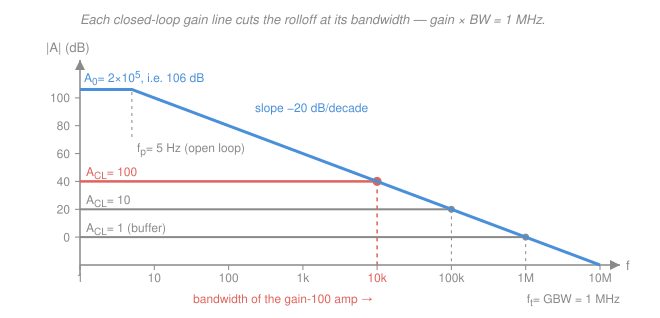

# Electronics & Semiconductors · Lesson 4.2: Frequency response & the gain–bandwidth product

> ⏱ ~15 min · Module 4: Feedback, frequency response & the digital interface · Builds on: [4.1 Negative feedback](04-01-negative-feedback.md), [3.1 The ideal op-amp](03-01-ideal-op-amp-inverting-noninverting.md), [`control-systems` 3.3](../../control-systems/lessons/03-03-frequency-response-bode-plots.md) · Unlocks: [4.3 CMOS](04-03-cmos-inverter-gates.md), and every signal chain you will ever budget

## Why this matters

Every op-amp circuit in Module 3 was drawn with an *ideal* op-amp: infinite gain, at every frequency. Build one and it works — up to a point. A gain-of-100 stage from a garden-variety part starts losing gain above about 10 kHz. And a full-swing 10 V sine out of that same part turns into a **triangle** above about 8 kHz, for a completely different reason that has nothing to do with the first.

Two numbers on the datasheet predict both: the **gain–bandwidth product** and the **slew rate**. They are the first two things an analog designer looks up, and the difference between them is a classic bench surprise. This lesson is how to budget with them.

## The idea

Here is the surprise that starts everything: a real op-amp's open-loop gain begins falling off at around **5 Hz**. Not 5 kHz. Five hertz. A part with a DC gain of 200,000 is down to a gain of 2 by the time you reach 100 kHz.

That is not a manufacturing failure — it is deliberate. The designers put a capacitor on the die specifically to *kill* the gain that early. Why sabotage your own amplifier? Because an amplifier with lots of gain and lots of phase lag will oscillate the moment you wrap feedback around it. By forcing one pole to dominate everything else, the manufacturer guarantees the phase lag never exceeds about $90^\circ$ where the gain still matters — so the part is stable at *any* closed-loop gain you choose, with no external components and no thought required from you. That is the phase-margin argument from [`control-systems` 3.4](../../control-systems/lessons/03-04-gain-and-phase-margins.md), sold as a feature.

The payoff for accepting that trade is a beautifully simple accounting rule. [4.1](04-01-negative-feedback.md) showed feedback *divides* your gain by $1+T$. It turns out feedback *multiplies* your bandwidth by exactly the same $1+T$. The two effects cancel: **gain times bandwidth is a constant of the part.** Want more gain? You pay for it in speed, at a fixed exchange rate, and the exchange rate is printed on the datasheet.

## The formal version

### The dominant-pole model

Model the open-loop gain as a single-pole (first-order) response:

$$\boxed{\,A(s) = \frac{A_0}{1 + s/\omega_p}\,}$$

where $A_0$ is the **open-loop DC gain** (dimensionless, typically $10^5$ to $10^6$), $\omega_p = 2\pi f_p$ is the **open-loop pole** in rad/s, and $f_p$ is the open-loop corner frequency in Hz. *In words: flat gain $A_0$ up to $f_p$, then falling at 20 dB per decade forever after.* The pole/transfer-function machinery behind that sentence is [`signals-systems` 2.5](../../signals-systems/lessons/02-05-transfer-functions-poles-zeros.md); the log-log plotting rules are [`control-systems` 3.3](../../control-systems/lessons/03-03-frequency-response-bode-plots.md). We only need the shape.

A 741-class part: $A_0 = 2\times10^5$ and $f_p = 5\ \text{Hz}$. At DC it is a monster; at 1 kHz its open-loop gain is already down to $2\times10^5 \times (5/1000) = 1000$.

### The gain–bandwidth product

Wrap the non-inverting feedback network of [3.1](03-01-ideal-op-amp-inverting-noninverting.md) around it. The **feedback factor** is $\beta_f = R_1/(R_1+R_f)$ — the fraction of the output fed back to the inverting input. (We write $\beta_f$, not $\beta$, because in this course $\beta$ is the BJT current gain from [2.1](02-01-bjt-how-it-works.md).) From [4.1](04-01-negative-feedback.md), the closed-loop gain is $A/(1+\beta_f A)$. Substitute the dominant-pole $A(s)$ and grind:

$$A_{CL}(s) = \frac{\dfrac{A_0}{1+s/\omega_p}}{1 + \dfrac{\beta_f A_0}{1+s/\omega_p}} = \frac{A_0}{1 + s/\omega_p + \beta_f A_0} = \frac{\dfrac{A_0}{1+\beta_f A_0}}{1 + \dfrac{s}{\omega_p(1+\beta_f A_0)}}.$$

That last form is another single pole. Read off the two pieces, with the DC **loop gain** $T = A_0\beta_f$:

$$A_{CL}(0) = \frac{A_0}{1+T}, \qquad \omega_{3\text{dB}} = \omega_p\,(1+T).$$

*In words: feedback shrank the gain by $1+T$ and stretched the bandwidth by $1+T$.* Multiply them and the factor cancels **exactly**:

$$\boxed{\;\text{GBW} = A_0 f_p = A_{CL}\times f_{3\text{dB}} = f_t\;}$$

where $f_t$ is the **unity-gain frequency** — the frequency where the open-loop gain has fallen to 1. ($f_t = A_0 f_p$ because above $f_p$ the magnitude is $|A| \approx A_0 f_p / f$, which equals 1 at $f = A_0f_p$.) All three quantities are the same number.

For our part: $\text{GBW} = 2\times10^5 \times 5\ \text{Hz} = 10^6\ \text{Hz} = 1\ \text{MHz}$. Consistent — the 741's advertised 1 MHz GBW *is* its 5 Hz corner times its DC gain.

The design rule engineers actually use is the middle equality, rearranged:

$$f_{3\text{dB}} = \frac{\text{GBW}}{A_{CL}}.$$

*In words: divide the datasheet's GBW by the gain you want, and that is the bandwidth you get.* One division. No transfer functions.

### The gain–bandwidth trade

For a 1 MHz part:

| closed-loop gain $A_{CL}$ | 1 | 10 | 100 | 1000 |
|---|---|---|---|---|
| bandwidth $f_{3\text{dB}}$ | 1 MHz | 100 kHz | 10 kHz | 1 kHz |

Each column is the same product. This is why "how much gain do I need?" and "how fast does it have to be?" are the *same* question, and why a high-gain audio preamp and a high-speed buffer are never the same chip.

The table also hides a genuinely useful design result — see Example 1.

### Slew rate: a different limit entirely

GBW is a **small-signal** parameter. It is derived from a *linear* model, which assumes the internal transistors stay in their active region. Ask for a big, fast output swing and they do not: the internal current source that charges the compensation capacitor $C_c$ hits its maximum $I_{\max}$, and the output ramps at a fixed, finite rate no matter what the input does. That ceiling is the **slew rate**:

$$SR = \left.\frac{dv_{out}}{dt}\right|_{\max} = \frac{I_{\max}}{C_c} \quad [\text{V}/\mu\text{s}].$$

*In words: past a certain steepness the output simply cannot climb any faster, and it stops following the input at all.*

How fast can a sine of amplitude $V_p$ (volts, peak) go before it hits that ceiling? Write $v = V_p\sin(2\pi f t)$, differentiate, and take the worst case (the zero crossing, where $\cos = 1$):

$$\frac{dv}{dt} = 2\pi f V_p\cos(2\pi f t) \quad\Longrightarrow\quad \left.\frac{dv}{dt}\right|_{\max} = 2\pi f V_p .$$

Demand that this stay under $SR$:

$$\boxed{\,f_{\max} = \frac{SR}{2\pi V_p}\,}$$

the **full-power bandwidth**. *In words: the biggest signal you can push at frequency $f$ shrinks as $1/f$.*

Numbers, for a 741 ($SR = 0.5\ \text{V}/\mu\text{s} = 0.5\times10^6\ \text{V/s}$) driving a 10 V-peak output:

$$f_{\max} = \frac{0.5\times10^6}{2\pi(10)} = \frac{0.5\times10^6}{62.83} = 7.96\ \text{kHz}.$$

That is **far** below the 1 MHz small-signal GBW, and below even the 10 kHz bandwidth of a gain-100 stage. The observable symptom on a scope is unmistakable: as you raise amplitude or frequency, the sine's steep flanks straighten out and it becomes a **triangle wave** — the amplifier is drawing the fastest ramp it owns. An amplifier can sit comfortably inside its GBW budget and still be badly slew-limited, because GBW never asked how *big* the signal was.

### The Miller effect (touch)

One capacitance deserves a name. Put a capacitor $C$ from the input to the output of an inverting stage of gain $-A_v$. Looking in from the input, it behaves like a capacitor to ground of value

$$C_{\text{in}} = C\,(1 + A_v).$$

*In words: a bridging capacitor looks $(1+A_v)$ times bigger than it is.* The reason is one line: when the input node moves by $v$, the far plate moves by $-A_v v$, so the voltage *across* $C$ changes by $v(1+A_v)$ — the source must supply $(1+A_v)$ times as much charge, which is exactly what a $(1+A_v)C$ capacitor would demand.

Two consequences you will meet:

- It is usually **the** thing that sets the high-frequency limit of the discrete stages in Module 2. A common-emitter stage ([2.3](02-03-bjt-small-signal-amplifiers.md)) with gain $-100$ and a base–collector capacitance of only 4 pF presents $4\ \text{pF}\times101 = 404\ \text{pF}$ at the base. Driven through an effective 1 k$\Omega$, that alone rolls the stage off at $1/(2\pi \times 10^3 \times 404\ \text{pF}) = 394\ \text{kHz}$. A 4 pF part killed the megahertz.
- It is also **exploited on purpose**. The op-amp's compensation capacitor sits across a high-gain inverting stage precisely so a physically tiny $C_c$ (tens of pF, small enough to fit on a die) acts like the enormous capacitance needed to put the pole down at 5 Hz.

### Why "midband"

One more effect, and it is at the *bottom* of the band. Discrete amplifiers use **coupling capacitors** (to pass signal while blocking the DC bias between stages) and **bypass capacitors** (to short an emitter resistor at signal frequencies). Each one forms a high-pass RC with the resistance it sees ([`circuits` 4.2](../../circuits/lessons/04-02-impedance-phasor-analysis.md)), so gain *falls off at low frequency* too. A real amplifier is therefore **band-pass**: a low corner set by the coupling and bypass caps, a high corner set by Miller and device capacitances, and a flat plateau between them. That plateau is the **midband** — the region where every coupling cap is effectively a short and every device cap is effectively an open, and where the clean gain formulas of Module 2 are valid.

## Picture

Read the figure as a *budget*. The blue curve is everything the part has. Draw your closed-loop gain as a horizontal line; you own the gain up to where it hits the ceiling, and nothing past it. Slide the line up and the intersection slides left by the same factor — that sliding is the gain–bandwidth product.

## Worked examples

**Example 1 (why you cascade — the useful result).** You need a voltage gain of 100 from 1 MHz op-amps. Two ways:

*One stage of gain 100.* Bandwidth $= 10^6/100 = 10\ \text{kHz}$.

*Two stages of gain 10.* Each stage has bandwidth $10^6/10 = 100\ \text{kHz}$, and the overall gain is $10\times10 = 100$ — identical. But the two poles compound: the cascade's magnitude is $\left[1+(f/f_1)^2\right]^{-n/2}$ for $n$ identical stages of corner $f_1$, and setting that to $1/\sqrt2$ gives

$$f_{3\text{dB}} = f_1\sqrt{2^{1/n}-1}.$$

For $n=2$: $\sqrt{2^{1/2}-1} = \sqrt{0.4142} = 0.6436$, so the cascade's true corner is $100\ \text{kHz}\times 0.6436 = 64.4\ \text{kHz}$.

**64.4 kHz versus 10 kHz — a 6.4× improvement for the same total gain**, at the cost of one extra op-amp. This is a real design rule: *spread gain across stages when you need speed.*

*Check.* Same total gain both ways ($10\times10 = 100$), so the comparison is fair. The shrink factor 0.6436 is less than 1, as it must be — two poles at 100 kHz must roll off sooner than one. And $n=1$ gives $\sqrt{2^1-1} = 1$, recovering the single-stage case exactly. ✓

**Example 2 (boss problem 4a).** An op-amp with $\text{GBW} = 1\ \text{MHz}$ and $A_0 = 2\times10^5$ is wired as a non-inverting amplifier with closed-loop gain 50.

*Bandwidth.*

$$f_{3\text{dB}} = \frac{\text{GBW}}{A_{CL}} = \frac{10^6}{50} = 20\ \text{kHz}.$$

*Loop gain.* Non-inverting gain 50 means $\beta_f = 1/50 = 0.02$, so

$$T = A_0\beta_f = 2\times10^5\times0.02 = \frac{2\times10^5}{50} = 4000.$$

*Gain sensitivity.* From [4.1](04-01-negative-feedback.md), fractional errors in $A_0$ are divided by $1+T$ when they reach $A_{CL}$:

$$\frac{\Delta A_{CL}}{A_{CL}} = \frac{1}{1+T}\,\frac{\Delta A_0}{A_0} = \frac{\pm10\%}{4001} = \pm0.0025\%.$$

A ten percent swing in the op-amp becomes a **twenty-five parts-per-million** swing in your amplifier.

*Check, three ways.* (i) The exact single-pole result: $\omega_{3\text{dB}} = \omega_p(1+T)$ gives $f_{3\text{dB}} = 5\ \text{Hz}\times4001 = 20{,}005\ \text{Hz}$, and the exact DC gain is $2\times10^5/4001 = 49.9875$. Their product is $49.9875\times20{,}005 = 1.000\times10^6$ — the GBW, to six figures. ✓ (ii) Recomputing the sensitivity brute-force: $A_0 = 2.2\times10^5$ gives $A_{CL} = 2.2\times10^5/4401 = 49.98864$, a change of $+0.0023\%$ from 49.98750; $A_0 = 1.8\times10^5$ gives $49.98611$, a change of $-0.0028\%$. Both bracket the linearized $0.0025\%$. ✓ (iii) $f_p = \text{GBW}/A_0 = 10^6/2\times10^5 = 5\ \text{Hz}$, consistent with the part we started from. ✓

**Note the tension, because it is the whole point of Module 4.** The very same loop gain $T = 4000$ that made the gain rock-solid — immune to a ten percent shift in the op-amp — is what caps you at 20 kHz. You bought stability with gain, and gain was your speed. There is no setting of $\beta_f$ that gets you both; the only escape is a faster part, or Example 1's cascade.

## Watch out

- **You might think the inverting amp's bandwidth is GBW divided by its gain magnitude.** It is not. Bandwidth is set by the **noise gain** $1 + R_f/R_1$ — the gain the feedback loop sees, which for an inverting amp is one more than $|A_{CL}|$. An inverting stage with $R_1 = 1\ \text{k}\Omega$, $R_f = 10\ \text{k}\Omega$ has $|A_{CL}| = 10$ but noise gain 11, so on a 1 MHz part its bandwidth is $10^6/11 = 90.9\ \text{kHz}$, not 100 kHz. (The unity-gain *inverter*, $A_{CL} = -1$, has noise gain 2 — it is only half as fast as a unity-gain *buffer*.)
- **You might think staying inside the GBW budget guarantees a clean output.** GBW is small-signal; slew rate is large-signal and depends on amplitude, which GBW never mentions. Always run both checks. In Example 2, a 20 kHz signal is exactly at the GBW limit, but a 741 asked for 10 V peak there is slewing badly — 20 kHz is more than double its 7.96 kHz full-power bandwidth.
- **You might think the 5 Hz open-loop corner is a defect.** It is the part working as designed. Uncompensated op-amps exist, are much faster, and will happily oscillate if you use them below their minimum stable gain. The 5 Hz pole is a stability guarantee you are paying for in bandwidth.

## One-liner

> Feedback trades gain for bandwidth at a fixed exchange rate — their product is $f_t$ — so budget bandwidth as GBW over gain, then check slew rate separately, because that limit does not care about GBW at all.

## Problems

**P1 (🟢)** An op-amp has $\text{GBW} = 4\ \text{MHz}$ and open-loop DC gain $A_0 = 10^5$. It is wired as a non-inverting amplifier with $R_1 = 1\ \text{k}\Omega$ from the inverting input to ground and $R_f = 9.1\ \text{k}\Omega$ in feedback. (a) Find the closed-loop gain and the closed-loop bandwidth. (b) Find the op-amp's open-loop corner frequency $f_p$.

**P2 (🟡)** A part has $\text{GBW} = 3\ \text{MHz}$ and $SR = 13\ \text{V}/\mu\text{s}$, used at a closed-loop gain of 10. (a) What is its small-signal bandwidth? (b) What is the highest frequency at which it can deliver a 10 V-peak sine undistorted? (c) At the small-signal bandwidth from (a), what is the largest peak amplitude it can actually produce? Comment on which limit binds.

**P3 (🔴)** You need an overall voltage gain of 1000 with an overall $-3\ \text{dB}$ bandwidth of at least 30 kHz, using only 1 MHz-GBW op-amps in identical non-inverting stages. How many stages do you need, and what is the resulting bandwidth? (Use $f_{3\text{dB}} = f_1\sqrt{2^{1/n}-1}$ for $n$ identical stages of corner $f_1$.)

Solutions

**P1** (a) Non-inverting gain:

$$A_{CL} = 1 + \frac{R_f}{R_1} = 1 + \frac{9.1\ \text{k}\Omega}{1\ \text{k}\Omega} = 10.1.$$

$$f_{3\text{dB}} = \frac{\text{GBW}}{A_{CL}} = \frac{4\times10^6}{10.1} = 3.96\times10^5\ \text{Hz} = 396\ \text{kHz}.$$

(b) The GBW is the DC gain times the open-loop corner, so

$$f_p = \frac{\text{GBW}}{A_0} = \frac{4\times10^6}{10^5} = 40\ \text{Hz}.$$

*Check.* Multiply back: $10.1 \times 396\ \text{kHz} = 4.00\ \text{MHz}$ ✓, and $10^5 \times 40\ \text{Hz} = 4\ \text{MHz}$ ✓ — both routes give the same product, as they must, since GBW is the invariant. Sanity: gain about 10 gives bandwidth about a tenth of 4 MHz. ✓

**P2** (a) Small-signal bandwidth:

$$f_{3\text{dB}} = \frac{3\times10^6}{10} = 300\ \text{kHz}.$$

(b) Full-power bandwidth with $SR = 13\ \text{V}/\mu\text{s} = 13\times10^6\ \text{V/s}$ and $V_p = 10\ \text{V}$:

$$f_{\max} = \frac{SR}{2\pi V_p} = \frac{13\times10^6}{2\pi(10)} = \frac{13\times10^6}{62.83} = 2.07\times10^5\ \text{Hz} = 207\ \text{kHz}.$$

(c) Rearrange the same formula for amplitude at $f = 300\ \text{kHz}$:

$$V_p = \frac{SR}{2\pi f} = \frac{13\times10^6}{2\pi(3\times10^5)} = \frac{13\times10^6}{1.885\times10^6} = 6.90\ \text{V}.$$

**Which binds depends on amplitude.** For small signals (say 1 V peak) the slew limit sits at $13\times10^6/(2\pi) = 2.07\ \text{MHz}$, far above 300 kHz, so GBW is the binding constraint. For a 10 V-peak output the slew limit drops to 207 kHz, *below* the 300 kHz GBW limit, so slewing binds first. The crossover amplitude is 6.90 V.

*Check.* Cross-check (b) and (c) against each other: the slew limit is a constant-$f V_p$ hyperbola, so $207\ \text{kHz}\times10\ \text{V} = 2.07\times10^6$ and $300\ \text{kHz}\times6.90\ \text{V} = 2.07\times10^6$ ✓ — the same product, equal to $SR/2\pi$. ✓

**P3** With $n$ identical stages of gain $g$ each, $g^n = 1000$, so $g = 1000^{1/n}$. Each stage's own corner is $f_1 = 10^6/g$. Try successive $n$:

*$n = 1$:* $g = 1000$, $f_1 = 1\ \text{kHz}$, overall $= 1\ \text{kHz}$. Fails.

*$n = 2$:* $g = \sqrt{1000} = 31.62$, so $f_1 = 10^6/31.62 = 31.6\ \text{kHz}$. Shrink factor $\sqrt{2^{1/2}-1} = 0.6436$:

$$f_{3\text{dB}} = 31.6\ \text{kHz}\times0.6436 = 20.4\ \text{kHz}.$$

Still fails — note it fails *even though each individual stage reaches 31.6 kHz*, because two poles compound.

*$n = 3$:* $g = 1000^{1/3} = 10$, so $f_1 = 10^6/10 = 100\ \text{kHz}$. Shrink factor $\sqrt{2^{1/3}-1} = \sqrt{0.2599} = 0.5098$:

$$f_{3\text{dB}} = 100\ \text{kHz}\times0.5098 = 51.0\ \text{kHz}.$$

**Three stages of gain 10 each**, giving about 51 kHz — comfortably past the 30 kHz requirement.

*Check.* $10^3 = 1000$ ✓ (gain met exactly, with convenient $R_f/R_1 = 9$). The shrink factor decreases with $n$ (1, 0.644, 0.510, 0.435…) while $f_1$ grows by $g$, and the second effect wins, so bandwidth improves monotonically with $n$ — consistent with $n=3$ beating $n=2$ beating $n=1$. ✓ Practical note: each added stage also adds phase lag, noise and offset, so three is the right answer here rather than "use ten stages."

## Flashback

**From [Lesson 3.5](03-05-comparators-schmitt-triggers.md) (Comparators & Schmitt triggers):** A **non-inverting** Schmitt trigger has its inverting input grounded. The input signal $v_{in}$ reaches the non-inverting input through $R_1 = 10\ \text{k}\Omega$, and the output feeds back to that same node through $R_2 = 100\ \text{k}\Omega$. The output saturates at $\pm12\ \text{V}$. Find the two switching thresholds and the hysteresis width.

Solution

The op-amp's inverting input is at 0 V, so the circuit flips whenever the non-inverting node $v_+$ crosses zero. By superposition at that node (no current flows into the op-amp input, so $R_1$ and $R_2$ form a simple two-source divider):

$$v_+ = v_{in}\frac{R_2}{R_1+R_2} + v_{out}\frac{R_1}{R_1+R_2}.$$

Set $v_+ = 0$ and multiply through by $R_1+R_2$:

$$v_{in}R_2 + v_{out}R_1 = 0 \quad\Longrightarrow\quad v_{in} = -v_{out}\frac{R_1}{R_2} = -v_{out}\frac{10}{100} = -0.1\,v_{out}.$$

- Output currently at $+12\ \text{V}$: it flips when $v_{in}$ falls to $-0.1(+12) = -1.2\ \text{V}$. **Lower threshold $= -1.2\ \text{V}$.**
- Output now at $-12\ \text{V}$: it flips back when $v_{in}$ rises to $-0.1(-12) = +1.2\ \text{V}$. **Upper threshold $= +1.2\ \text{V}$.**

Hysteresis width $= 1.2 - (-1.2) = 2.4\ \text{V}$.

*Check.* Positive feedback means the thresholds must straddle the trip point in the *stabilizing* direction — after switching high, the trip point moves *down*, so noise cannot immediately switch it back. ✓ Both thresholds are well inside the $\pm12\ \text{V}$ rails, so they are reachable. ✓ Scaling sanity: making $R_2$ larger (weaker feedback) narrows the window toward zero, recovering a plain comparator. ✓

Contrast with today's lesson: that circuit uses **positive** feedback deliberately, so there is no loop-gain-divides-your-error story and no gain–bandwidth trade — the amplifier is being driven to its rails on purpose, and there the relevant speed limit is exactly the slew rate.

## Connections

- **Backward:** this is [4.1](04-01-negative-feedback.md) with frequency put back in. The factor $1+T$ that divided your gain and divided your sensitivity is the *same* $1+T$ that multiplies your bandwidth — one number doing all three jobs. The Module 2 gain formulas ([2.3](02-03-bjt-small-signal-amplifiers.md), [2.5](02-05-mosfet-biasing-common-source.md)) are now revealed as *midband* results, valid between the coupling-capacitor corner and the Miller corner.
- **Forward:** [4.3](04-03-cmos-inverter-gates.md) is the same capacitance story wearing digital clothes — the load capacitance that Miller-multiplies here is what sets a logic gate's propagation delay and its $P = fCV^2$ dynamic power. And in [4.4](04-04-adc-dac.md), the settling time of the amplifier in front of a converter is a GBW budget: a converter sampling at $f_s$ needs its input buffer to settle in well under $1/f_s$.
- **Sideways:** the "one dominant pole guarantees stability at any gain" argument is the phase-margin criterion of [`control-systems` 3.4](../../control-systems/lessons/03-04-gain-and-phase-margins.md) — op-amp compensation is an entire control-design decision made at the factory so you never have to make it. Slew rate has no control-theory analogue at all, because it is a *nonlinear* saturation: no transfer function can describe it, which is precisely why it ambushes people who only budgeted GBW.
