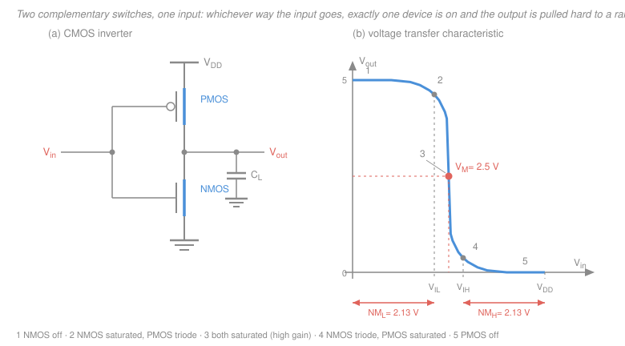
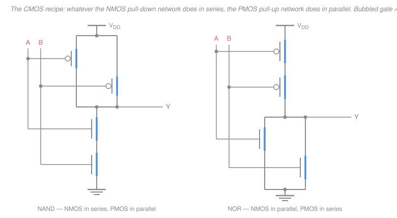

# Electronics & Semiconductors · Lesson 4.3: CMOS — the inverter, gates & logic families

> ⏱ ~15 min · Module 4: Feedback, frequency response & the digital interface · Builds on: [2.4 The MOSFET: how it works](02-04-mosfet-how-it-works.md), [2.5 MOSFET biasing & the common-source amplifier](02-05-mosfet-biasing-common-source.md) · Unlocks: [4.4 A taste of ADC & DAC](04-04-adc-dac.md), [`digital-logic`](../../digital-logic/syllabus.md)

## Why this matters

Every transistor on the phone in your pocket — tens of billions of them — is wired in the arrangement you are about to learn, and the arrangement was chosen for one reason: it burns almost no power when it isn't doing anything. That single property is why CMOS annihilated every competing logic family and why a chip with a hundred million gates doesn't melt. This lesson is also the hinge of the whole course: we take the same saturated MOSFET that gave us voltage gain in [2.5](02-05-mosfet-biasing-common-source.md) and use it as a *switch* instead, and analog becomes digital. Everything in [`digital-logic`](../../digital-logic/syllabus.md) sits on top of the six-transistor NAND gate at the end of this page.

## The idea

Take an NMOS and a PMOS. Tie their **gates together** — that's the input. Tie their **drains together** — that's the output. Put the NMOS source at ground and the PMOS source at $V_{DD}$.

Now recall the turn-on rules from [2.4](02-04-mosfet-how-it-works.md): the NMOS conducts when its gate is *above* its source by more than $V_{tn}$, so it wants a **high** gate. The PMOS conducts when its gate is *below* its source by more than $|V_{tp}|$, so it wants a **low** gate. Same gate voltage, opposite responses — they are **complementary**.

- **Input low** ($V_{in} \approx 0$): NMOS off, PMOS on. The output is tied through the PMOS to $V_{DD}$ and nothing pulls it down. $V_{out} = V_{DD}$.
- **Input high** ($V_{in} \approx V_{DD}$): PMOS off, NMOS on. The output is tied through the NMOS to ground. $V_{out} = 0$.

That's an inverter. But look at what *didn't* happen: in neither stable state is there a path from $V_{DD}$ to ground, because one switch in the chain is always open. A circuit that holds a logic level and draws no current to do it — that is the entire reason CMOS won.

Compare the predecessor. NMOS-only logic replaced the PMOS with a fixed pull-up resistor $R$. It works, but when the NMOS turns on you have $V_{DD}$ across $R$ in series with a conducting transistor, and current flows *continuously* for as long as the output sits low. One gate at 5 V through 10 kΩ wastes 2.5 mW forever; a million of them is 2.5 kW. There is no version of that story that ends in a smartphone.

## The formal version

**Static power.** In either stable state one device is in cutoff, so the only current from $V_{DD}$ to ground is **leakage** — subthreshold conduction through the "off" device plus gate tunnelling. Historically this was nanoamps: at $V_{DD} = 5\ \text{V}$ and $I_{leak} = 1\ \text{nA}$, $P_{static} = 5\ \text{nW}$ per gate. *In words: an idle CMOS gate costs essentially nothing.* Honesty check: at modern nanometre nodes, where $V_t$ has been scaled down and oxides are a few atoms thick, leakage is no longer a rounding error — it can be a large fraction of a chip's total power, and fighting it (high-$V_t$ devices, power gating) is a first-order design activity.

**The voltage transfer characteristic (VTC).** Sweep $V_{in}$ from 0 to $V_{DD}$ and plot $V_{out}$. Take $V_{tn} = |V_{tp}| = V_t$ and both devices equally strong. Five regions, using the triode/saturation conditions from [2.4](02-04-mosfet-how-it-works.md):

| # | Range of $V_{in}$ | NMOS | PMOS | $V_{out}$ |
|---|---|---|---|---|
| 1 | $V_{in} < V_t$ | cutoff | triode | $= V_{DD}$, flat |
| 2 | rising toward $V_M$ | saturation | triode | starts to fall |
| 3 | $V_{in} \approx V_M$ | **saturation** | **saturation** | plunges — very steep |
| 4 | past $V_M$ | triode | saturation | nearly at ground |
| 5 | $V_{in} > V_{DD} - V_t$ | triode | cutoff | $= 0$, flat |

*In words: a flat shelf at $V_{DD}$, a flat shelf at 0, and a near-cliff between them.* The cliff is region 3, where **both** devices are saturated. Two saturated devices means two current sources feeding one node, and the small-signal gain there is

$$A_v = -(g_{mn} + g_{mp})\,(r_{on} \,\|\, r_{op}),$$

with $g_m$ the transconductance (A/V) and $r_o$ the output resistance (Ω) of each device — exactly the common-source gain expression from [2.5](02-05-mosfet-biasing-common-source.md), with the PMOS acting as an *active load* instead of a resistor. Magnitudes of 20–100 are typical. So a CMOS inverter biased in its transition strip is a genuine high-gain analog amplifier; that is not a metaphor, it is how many op-amp input stages and ring oscillators are built. Digital designers just refuse to linger there.

**Switching threshold** $V_M$: the input at which $V_{out} = V_{in}$ — the midpoint of the cliff, where both devices carry the same current in saturation. Equating the two square-law currents and solving for the crossing gives, for a **symmetric** design (equal drive strengths, $|V_{tp}| = V_{tn}$),

$$\boxed{\,V_M = \frac{V_{DD}}{2}\,}$$

*In words: if the pull-up and pull-down are equally strong, the tipping point sits exactly halfway between the rails.* The symmetry argument is the honest proof: swapping "NMOS" for "PMOS" and $V_{in}$ for $V_{DD}-V_{in}$ maps the circuit onto itself, so the VTC must be antisymmetric about its own midpoint, and the only fixed point of an antisymmetric curve is $V_{DD}/2$.

Equal drive strength is **not** equal size. Drive strength scales as $\mu C_{ox}(W/L)$, and hole mobility $\mu_p$ is roughly one-third of electron mobility $\mu_n$ ([1.1](01-01-semiconductors-carriers-doping.md)). To match, you need

$$\left(\frac{W}{L}\right)_p \approx \frac{\mu_n}{\mu_p}\left(\frac{W}{L}\right)_n \approx 2\text{ to }3\times\left(\frac{W}{L}\right)_n .$$

Open any chip layout and the PMOS row is visibly fatter than the NMOS row. That's why.

**Noise margins.** Four voltages define how much abuse a logic level tolerates:

- $V_{OH}$, $V_{OL}$ — the output levels the gate actually produces. For CMOS these are **rail-to-rail**: $V_{OH} = V_{DD}$, $V_{OL} = 0$, because a fully-on MOSFET with no DC load has no current through it and therefore no drop across it.
- $V_{IL}$, $V_{IH}$ — the input levels the *next* gate still reads correctly, defined as the two points where the VTC slope is exactly $-1$ (the **unity-gain points**). Below $V_{IL}$ the gate amplifies the deviation away from the threshold, restoring the level; between them it amplifies toward disaster.

$$NM_L = V_{IL} - V_{OL}, \qquad NM_H = V_{OH} - V_{IH}.$$

*In words: how many volts of noise a wire can pick up between one gate's output and the next gate's input before the next gate misreads it.* For the square-law symmetric inverter the unity-gain points work out to $V_{IL} = (3V_{DD} + 2V_t)/8$ and $V_{IH} = (5V_{DD} - 2V_t)/8$. Because CMOS swings all the way to both rails, the margins are large — typically over 40 percent of $V_{DD}$ on both sides, far better than the ~0.4 V that bipolar TTL offers.

**Dynamic power.** The output node drives a capacitance $C_L$ (farads) — the gate capacitance of everything downstream plus wiring. Charging it from 0 to $V_{DD}$ moves charge $Q = C_L V_{DD}$ out of the supply at a constant $V_{DD}$, so the supply pays

$$E_{\text{supply}} = Q V_{DD} = C_L V_{DD}^2 .$$

Half of that ends up stored on the capacitor ($\tfrac12 C_L V_{DD}^2$); the other half is burned as heat in the PMOS, and *no choice of resistance changes that split*. On the way back down, the stored half is dumped through the NMOS to ground. So one complete up-and-down cycle costs $C_L V_{DD}^2$ from the supply, every joule of it eventually heat. At $f$ cycles per second, with $\alpha$ the **activity factor** (average full charge/discharge cycles per clock period; $\alpha = 1$ means the output toggles every cycle):

$$\boxed{\,P_{dyn} = \alpha\, C_L V_{DD}^2 f\,}$$

*In words: power is capacitance times voltage squared times how often you swing it.* The quadratic in $V_{DD}$ is the most consequential exponent in modern electronics — it is why supply rails marched from 5 V down to about 1 V while clock rates climbed, and why "just lower the voltage" is the first move in every low-power design.

There is a second, smaller term. During the transition, $V_{in}$ passes through the strip $V_t < V_{in} < V_{DD} - |V_t|$ where **both** devices conduct, and a **short-circuit current** spike flows straight from $V_{DD}$ to ground. Keep input edges fast and it stays under about 10 percent of $P_{dyn}$; let edges get sluggish and it balloons.

## Picture

## Worked examples

**Example 1 (the inverter of boss problem 4b).** $V_{DD} = 5\ \text{V}$, $|V_t| = 1\ \text{V}$ for both devices, symmetric design.

*Switching threshold.* Symmetric $\Rightarrow V_M = V_{DD}/2 = 2.5\ \text{V}$.

*Static current.* At $V_{in} = 0$: NMOS $V_{GS} = 0 < 1\ \text{V}$, cutoff. At $V_{in} = 5\ \text{V}$: PMOS $V_{SG} = 0 < 1\ \text{V}$, cutoff. Either way the series path is broken, so only leakage flows — nanoamps, i.e. nanowatts. **Essentially zero static power.**

*Noise margins.* $V_{IL} = (3 \times 5 + 2 \times 1)/8 = 17/8 = 2.125\ \text{V}$ and $V_{IH} = (5 \times 5 - 2 \times 1)/8 = 23/8 = 2.875\ \text{V}$. With $V_{OL} = 0$ and $V_{OH} = 5\ \text{V}$:

$$NM_L = 2.125 - 0 = 2.125\ \text{V}, \qquad NM_H = 5 - 2.875 = 2.125\ \text{V}.$$

*Check:* the two are equal, as antisymmetry about $V_M = 2.5\ \text{V}$ demands ($V_{IL}$ and $V_{IH}$ sit $0.375\ \text{V}$ either side of it). Each margin is $2.125/5 = 42.5$ percent of the supply — a 5 V CMOS input can absorb over two volts of garbage and still read the bit.

**Example 2 (its dynamic power).** Same inverter, $C_L = 10\ \text{pF}$, switching at $f = 50\ \text{MHz}$. Assume $\alpha = 1$ (the output completes a full high-low-high cycle every period — the worst case, and what "switching at 50 MHz" ordinarily means):

$$P_{dyn} = \alpha C_L V_{DD}^2 f = (1)(10\times10^{-12})(5)^2(50\times10^6).$$

Step by step: $10\times10^{-12} \times 25 = 2.5\times10^{-10}$; then $2.5\times10^{-10} \times 5\times10^{7} = 1.25\times10^{-2}\ \text{W}$.

$$P_{dyn} = 12.5\ \text{mW}.$$

*Check (units):* $\text{F}\cdot\text{V}^2\cdot\text{s}^{-1} = \text{C}\cdot\text{V}\cdot\text{s}^{-1} = \text{J/s} = \text{W}$ ✓. *Check (energy per cycle):* $C_LV_{DD}^2 = 250\ \text{pJ}$, times $5\times10^7$ cycles per second $= 12.5\ \text{mW}$ ✓.

Now the punchline. That 12.5 mW is **2.5 million times** the ~5 nW of static power — dynamic power is the whole game. And since it scales as $V_{DD}^2$, dropping the rail from 5 V to 1.8 V cuts it by $(1.8/5)^2 = 0.13$, an 87 percent saving at the same clock. That single quadratic is why every process generation lowered the supply.

## Building gates

The inverter generalizes into a two-line recipe:

1. **Pull-down network (PDN):** NMOS transistors between the output and ground, wired so they conduct exactly when the logic function should be **0**.
2. **Pull-up network (PUN):** PMOS transistors between $V_{DD}$ and the output, wired as the **dual** of the PDN — *series becomes parallel, parallel becomes series*.

The dual construction guarantees the property that makes CMOS work: for any input combination, exactly one network conducts. Never both (that would short the supply), never neither (that would leave the output floating).

**NAND** ($Y = 0$ only when $A$ **and** $B$ are 1) needs a pull-down that conducts only when both inputs are high: two NMOS in **series**. Dual: two PMOS in **parallel**.

**NOR** ($Y = 1$ only when $A$ **and** $B$ are 0) needs a pull-down that conducts when *either* input is high: two NMOS in **parallel**. Dual: two PMOS in **series**.

| $A$ | $B$ | NAND $Y$ | NOR $Y$ |
|---|---|---|---|
| 0 | 0 | 1 | 1 |
| 0 | 1 | 1 | 0 |
| 1 | 0 | 1 | 0 |
| 1 | 1 | 0 | 0 |

Two things fall out. First, **static CMOS gates are inherently inverting** — the pull-up is made of PMOS, which pass a strong signal only when their gates are *low*. You cannot build an AND directly; you build a NAND and hang an inverter on it, at the cost of two more transistors and a gate delay. That is why NAND and NOR, not AND and OR, are the primitives of digital design.

Second, **NAND is usually preferred over NOR**. NOR stacks its PMOS in series, and PMOS are already the slow devices (hole mobility again), so a series PMOS stack has to be made very wide to hit the same rise time. NAND stacks the faster NMOS instead. Walk through a standard cell library and you will find NAND-heavy logic.

**Logic families, briefly.** **TTL** (transistor–transistor logic) is built from bipolar transistors ([2.1](02-01-bjt-how-it-works.md)): fast for its era, but every gate draws milliamps of static current, capping density. **CMOS** trades a little speed per gate for near-zero static power and tiny devices, which is the trade that wins once you want millions of gates — it is now essentially universal. **BiCMOS** puts CMOS logic behind bipolar output drivers, buying the drive strength of a BJT for heavy loads; it survives in mixed-signal and RF parts where analog and digital share a die.

## Watch out

- **You might think a CMOS gate draws no current, full stop.** It draws no *static* current. Every transition it slams a $C_L V_{DD}$ charge packet out of the supply, plus a short-circuit spike while both devices are briefly on. Those spikes are why chips need decoupling capacitors sprinkled everywhere, and why $P_{dyn} \propto f$ makes cooling the limiting constraint on clock speed.
- **You might think $V_M = V_{DD}/2$ always.** It holds only for a symmetric design. Make the NMOS stronger and $V_M$ drops (the gate flips at a lower input); make the PMOS stronger and $V_M$ rises. Designers skew it on purpose — a gate driving a noisy line may want its threshold deliberately off-centre.
- **You might think you can build AND by swapping the two networks** (NMOS in parallel up top, PMOS in series below). You cannot: an NMOS passing a high level drops a threshold, so the "high" output would only reach $V_{DD} - V_{tn}$ — a degraded level that erodes the next gate's noise margin and never fully turns off its PMOS, restoring the static-current problem you just spent a lesson escaping. PMOS pull up, NMOS pull down, always.

## One-liner

> Tie an NMOS and a PMOS gate-to-gate and drain-to-drain and exactly one is ever on, so the output snaps rail-to-rail with no DC path to burn — leaving only $\alpha C_L V_{DD}^2 f$ to pay, which is why the supply voltage kept falling.

## Problems

**P1 (🟢)** A CMOS inverter runs from $V_{DD} = 3.3\ \text{V}$ with $V_{tn} = |V_{tp}| = 0.7\ \text{V}$ and a symmetric design. (a) State $V_M$. (b) For $V_{in} = 0.4\ \text{V}$, give each device's region and $V_{out}$. (c) Same for $V_{in} = 3.0\ \text{V}$.

**P2 (🟡)** Example 2's inverter dissipates 12.5 mW ($C_L = 10\ \text{pF}$, $V_{DD} = 5\ \text{V}$, $f = 50\ \text{MHz}$, $\alpha = 1$). A redesign moves to $V_{DD} = 1.8\ \text{V}$ and raises the clock to 200 MHz, with the same load and activity factor. (a) Find the new dynamic power. (b) By what factor did power change? (c) If leakage is 1 nA per inverter at the new rail, how does static power compare?

**P3 (🔴)** Design a single static CMOS gate realizing $Y = \overline{A + BC}$ (NOT of "$A$ or ($B$ and $C$)"). Describe both networks, give the transistor count, and verify the case $A=0,\ B=1,\ C=1$ by checking that exactly one network conducts.

Solutions

**P1**

(a) Symmetric design $\Rightarrow V_M = V_{DD}/2 = 3.3/2 = 1.65\ \text{V}$.

(b) $V_{in} = 0.4\ \text{V}$. NMOS: $V_{GS} = 0.4\ \text{V} < V_{tn} = 0.7\ \text{V}$, so **cutoff**. PMOS: $V_{SG} = V_{DD} - V_{in} = 3.3 - 0.4 = 2.9\ \text{V} > 0.7\ \text{V}$, so it is **on**. Since the NMOS is cut off, no current flows anywhere, so there is no drop across the PMOS: $V_{SD} = 0$, which is deep **triode** (it is behaving as a small resistor carrying nothing). The output is tied to the rail:

$$V_{out} = V_{DD} = 3.3\ \text{V}.$$

(c) $V_{in} = 3.0\ \text{V}$. PMOS: $V_{SG} = 3.3 - 3.0 = 0.3\ \text{V} < 0.7\ \text{V}$, so **cutoff**. NMOS: $V_{GS} = 3.0\ \text{V} > 0.7\ \text{V}$, on, and with no current it sits at $V_{DS} = 0$ — deep **triode**. So

$$V_{out} = 0\ \text{V}.$$

*Check.* Both cases are on the flat shelves (regions 1 and 5), where the current is zero and the output is rail-pinned — consistent with $3.0 > V_{DD} - V_t = 2.6\ \text{V}$ and $0.4 < V_t = 0.7\ \text{V}$. ✓

**P2**

(a) $P_{dyn} = \alpha C_L V_{DD}^2 f = (1)(10\times10^{-12})(1.8)^2(200\times10^6)$.

$1.8^2 = 3.24$; $10\times10^{-12} \times 3.24 = 3.24\times10^{-11}$; $3.24\times10^{-11} \times 2\times10^{8} = 6.48\times10^{-3}\ \text{W}$.

$$P_{dyn} = 6.48\ \text{mW}.$$

(b) Take the ratio directly, which is cleaner than dividing the two answers:

$$\frac{P_{new}}{P_{old}} = \left(\frac{1.8}{5}\right)^2 \times \frac{200}{50} = (0.36)^2 \times 4 = 0.1296 \times 4 = 0.5184.$$

Power fell to about **52 percent** — roughly half the power at **four times** the clock rate. *Check:* $0.5184 \times 12.5 = 6.48\ \text{mW}$ ✓, matching (a). This is the whole industry's playbook: the quadratic in $V_{DD}$ buys back more than the linear in $f$ costs.

(c) $P_{static} = V_{DD} I_{leak} = 1.8 \times 1\times10^{-9} = 1.8\ \text{nW}$. Ratio:

$$\frac{6.48\times10^{-3}}{1.8\times10^{-9}} = 3.6\times10^{6}.$$

Static power is about **3.6 million times smaller** — negligible for a single fast-switching gate. (The caveat from the lesson: on a chip with a billion gates of which only a few percent toggle in any given cycle, the *aggregate* leakage of the idle majority stops being negligible.)

**P3**

Read the pull-down network straight off the expression inside the bar, since the PDN must conduct exactly when $Y = 0$, i.e. when $A + BC = 1$:

- **PDN (NMOS, output to ground):** $M_A$ in **parallel** with the **series** pair $M_B$–$M_C$. The OR becomes parallel, the AND becomes series.
- **PUN (PMOS, $V_{DD}$ to output):** the dual — $M_A'$ in **series** with the **parallel** pair $M_B'$–$M_C'$.

**Transistor count: 6** (three NMOS, three PMOS). Note that a NOR-plus-AND-plus-inverter build would take far more; this "and-or-invert" gate does it in one stage.

*Verify $A=0,\ B=1,\ C=1$.* Logically $A + BC = 0 + (1)(1) = 1$, so $Y = 0$.

- PDN: $M_A$ has a low gate, off. $M_B$ and $M_C$ both have high gates, both on, and they are in series — so that branch conducts. Overall the PDN **conducts**, pulling $Y$ to ground. ✓
- PUN: $M_A'$ has a low gate, so this PMOS is **on**. But $M_B'$ and $M_C'$ both have high gates, so both PMOS are **off**, and they are in parallel — that pair is an open circuit. In series with $M_A'$, the whole PUN is **open**. ✓

Exactly one network conducts, $Y = 0$, no path from $V_{DD}$ to ground. ✓

## Flashback

**From Lesson 3.5 (Comparators & Schmitt triggers):** An inverting Schmitt trigger uses an op-amp whose output saturates at $\pm 12\ \text{V}$. A resistive divider feeds the output back to the **non-inverting** input: $R_1 = 10\ \text{k}\Omega$ from that node to ground, $R_2 = 50\ \text{k}\Omega$ from that node to the output. The signal drives the inverting input. Find the two switching thresholds and the hysteresis width.

Solution

The non-inverting node is a divider between the output and ground (no current flows into the ideal op-amp input, so the divider is unloaded):

$$V_+ = V_{out}\,\frac{R_1}{R_1 + R_2} = V_{out}\,\frac{10}{60} = \frac{V_{out}}{6}.$$

The comparator flips when the input crosses $V_+$, and $V_+$ takes only two values because $V_{out}$ only takes two values:

$$V_{TH} = \frac{+12}{6} = +2\ \text{V}, \qquad V_{TL} = \frac{-12}{6} = -2\ \text{V}.$$

So with the output high, the input must climb above $+2\ \text{V}$ to flip it low; once low, the input must fall below $-2\ \text{V}$ to flip it back. The hysteresis width is

$$\Delta V = V_{TH} - V_{TL} = 4\ \text{V}.$$

*Check.* The feedback here is **positive** (divider to the non-inverting input), which is what makes the thresholds move away from the input as it approaches — the opposite of the negative feedback of [4.1](04-01-negative-feedback.md). Sanity: shrinking $R_1$ relative to $R_2$ shrinks the fraction and narrows the window, as expected. ✓

*And the tie-in:* that 4 V window is the analog cousin of this lesson's noise margin. Both answer the same question — how much junk can ride on the input before the decision flips — and both are bought by refusing to make a decision near the threshold.

## Connections

- **Backward:** the whole lesson is [2.4](02-04-mosfet-how-it-works.md)'s cutoff/triode/saturation table applied twice, once per device. The steep transition region is literally [2.5](02-05-mosfet-biasing-common-source.md)'s common-source amplifier with a PMOS active load instead of $R_D$ — same $-g_m r_o$ gain, different job. And the PMOS-must-be-wider rule traces straight back to hole mobility from [1.1](01-01-semiconductors-carriers-doping.md).
- **Forward:** [4.4](04-04-adc-dac.md) needs both halves of this lesson — CMOS transistors as analog **switches** (sample-and-hold, R-2R ladders) and as the comparators that turn a voltage into a bit. Beyond this course, [`digital-logic`](../../digital-logic/syllabus.md) starts where the NAND gate ends: Boolean algebra, minimization, adders, flip-flops, state machines. Device-level depth — short-channel effects, why leakage exploded, fabrication — lives in [`semiconductor-devices`](../../semiconductor-devices/syllabus.md).
- **Sideways:** the noise margin is the digital descendant of the hysteresis window in [3.5](03-05-comparators-schmitt-triggers.md) — both are deliberate dead zones that make a decision robust to noise. And the $\tfrac12 C V^2$ that vanishes into heat every time you charge a capacitor through *any* resistance is the same result that shows up in the capacitor-charging paradox of [`em-refresher` 2.1](../../em-refresher/lessons/02-01-capacitance.md): half the supply's energy is lost no matter how good your switch is.
