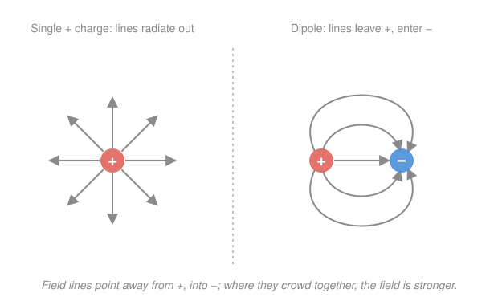

# Electromagnetism · Lesson 1.1: Charge, Coulomb's law, and the electric field

> ⏱ ~15 min · Module 1: Electrostatics · Builds on: [`calc-refresher`](../../calc-refresher/syllabus.md) · Unlocks: 1.2 (Gauss's law)

## Why this matters

Every force you meet in daily life that isn't gravity — friction, tension, the floor holding you up, chemistry, light itself — is electromagnetism wearing a costume. It all starts here, with a single number a particle carries (its **charge**) and one inverse-square law. The one genuinely new idea in this lesson is the **field**: instead of "charge A reaches across empty space and yanks charge B," we say charge A fills all of space with a condition, and B simply responds to the condition where it sits. That bookkeeping split — who *makes* the field vs. who *feels* it — is the spine of the entire course, and it's what eventually lets fields carry energy and travel as waves.

## The idea

Charge is a property, like mass, but with two flavors: **positive** and **negative**. Likes repel, opposites attract. Two facts make it lawful rather than magic:

- **It's quantized.** Every free charge is an integer multiple of the elementary charge $e = 1.6\times10^{-19}$ C (a proton is $+e$, an electron $-e$). You never find half.
- **It's conserved.** The total charge in an isolated system never changes; you can only move it around or create equal $+/-$ pairs.

The force between two charges looks *exactly* like Newtonian gravity — it dies off as $1/r^2$ — with one twist: charge comes signed, so the force can pull **or** push, whereas gravity only ever pulls.

Now the field. Rather than track the force between every pair, give each charge credit for the situation it creates around itself: at every point in space it sets up an **electric field**, a vector telling you which way, and how hard, a unit of positive charge dropped there would be shoved. Drop an actual charge in and the force is just "how much charge" times "the local field." The charge that *makes* the field and the charge that *feels* it are now two separate jobs — and that separation is the whole reason the field concept earns its keep.

## The formal version

**Coulomb's law.** The force on charge $q_2$ due to charge $q_1$, separated by distance $r$, is

$$\mathbf{F} = \frac{1}{4\pi\varepsilon_0}\,\frac{q_1 q_2}{r^2}\,\hat{\mathbf{r}}, \qquad k \equiv \frac{1}{4\pi\varepsilon_0} = 8.99\times10^{9}\ \mathrm{N\,m^2/C^2}.$$

Here $q_1, q_2$ are the charges in coulombs (C), $r$ is their separation in metres, $\hat{\mathbf{r}}$ is the unit vector pointing *from the source $q_1$ toward $q_2$*, $\varepsilon_0 = 8.85\times10^{-12}\ \mathrm{C^2/(N\,m^2)}$ is the permittivity of free space, and $\mathbf{F}$ comes out in newtons (N). *In words: the push/pull is proportional to each charge, falls off as the square of the distance, and points along the line joining them — outward (repulsive) when the sign of $q_1 q_2$ is positive, inward (attractive) when it's negative.*

**The electric field.** Drop a tiny positive **test charge** $q_0$ at a point; the field there is the force it feels per unit charge,

$$\mathbf{E} \equiv \frac{\mathbf{F}}{q_0} \qquad (\text{units: N/C, equivalently V/m}).$$

*In words: $\mathbf{E}$ is force-per-charge — strip out the feeler and you're left with a property of the point in space itself.* For a single point charge $q$, dividing Coulomb's law by $q_0$ gives the field it sources:

$$\mathbf{E} = \frac{1}{4\pi\varepsilon_0}\,\frac{q}{r^2}\,\hat{\mathbf{r}}.$$

*In words: a point charge's field points radially away from it (toward it, if $q<0$) and weakens as $1/r^2$.* Any charge then feels $\mathbf{F} = q\,\mathbf{E}$ from the field it sits in.

**Superposition.** The field of many charges is the vector sum of each one's field:

$$\mathbf{E} = \sum_i \mathbf{E}_i = \frac{1}{4\pi\varepsilon_0}\sum_i \frac{q_i}{r_i^2}\,\hat{\mathbf{r}}_i.$$

*In words: fields add like arrows, not like numbers — resolve each into components and sum those, direction by direction.* This is the one principle that turns two point charges into any charge distribution you like (swap the sum for an integral).

## Picture

Field lines make the vector field visible: they start on positive charge and end on negative, their arrows give $\mathbf{E}$'s direction, and their **crowding encodes strength** — dense lines mean a strong field.

## Worked examples

**Example 1 (mechanical — field, then force).** Find the field 2.0 cm from a point charge $q = +4.0\ \mathrm{nC}$, and the force on a $q_0 = -1.0\ \mathrm{nC}$ charge placed there.

Field magnitude:
$$E = k\frac{|q|}{r^2} = (8.99\times10^9)\frac{4.0\times10^{-9}}{(0.020)^2} = 9.0\times10^{4}\ \mathrm{N/C},$$
directed radially **outward** (source is positive). The force on the feeler:
$$\mathbf{F} = q_0\mathbf{E}, \qquad |F| = (1.0\times10^{-9})(9.0\times10^4) = 9.0\times10^{-5}\ \mathrm{N}.$$
Because $q_0<0$, $\mathbf{F}$ points *opposite* to $\mathbf{E}$ — i.e. back toward the source. The negative charge is attracted, exactly as "opposites attract" demands.

**Example 2 (why you'd care — superposition on a line).** Charges $q_1 = +2.0\ \mathrm{nC}$ at $x=0$ and $q_2 = -4.0\ \mathrm{nC}$ at $x=6.0$ cm sit on the $x$-axis. Find $\mathbf{E}$ at the midpoint $P$, $x = 3.0$ cm.

Each charge is 3.0 cm from $P$. Field from $q_1$ (positive, sitting to $P$'s left) points **away** from it → $+x$:
$$E_1 = k\frac{|q_1|}{r^2} = (8.99\times10^9)\frac{2.0\times10^{-9}}{(0.030)^2} = 2.0\times10^{4}\ \mathrm{N/C}\ (+x).$$
Field from $q_2$ (negative, sitting to $P$'s right) points **toward** it → also $+x$:
$$E_2 = (8.99\times10^9)\frac{4.0\times10^{-9}}{(0.030)^2} = 4.0\times10^{4}\ \mathrm{N/C}\ (+x).$$
They point the same way, so they add: $\mathbf{E} = 6.0\times10^{4}\ \mathrm{N/C}$ in the $+x$ direction. Between a $+$ and a $-$, the two contributions conspire rather than cancel — which is why a dipole's field is strongest in the gap between the charges. Sum charge-by-charge, watch each direction, and you can build the field of anything: this is the atom-by-atom logic behind the field of a charged plate, a molecule, or a capacitor.

## Watch out

- You might think a charge needs a partner before it has a field. It doesn't — $\mathbf{E} = kq/r^2\,\hat{\mathbf{r}}$ exists in the empty space around a lone charge; a second charge only *reveals* it by feeling $\mathbf{F}=q\mathbf{E}$. Source and feeler are different jobs.
- You might think you add field *magnitudes*. Superposition is vector addition: two equal fields at right angles give $\sqrt{2}\,E$, not $2E$; two equal-and-opposite ones give zero. Always resolve into components first.
- You might mishandle the sign of $\hat{\mathbf{r}}$. The cleanest habit: compute the magnitude $k|q|/r^2$, then set direction by hand — *away* from positive source charge, *toward* negative — rather than trusting a signed vector formula blind.

## One-liner

> A charge fills space with a field $\mathbf{E} = \dfrac{kq}{r^2}\hat{\mathbf{r}}$ that lives there whether or not anyone feels it; a second charge just reads the local field back out as $\mathbf{F} = q\mathbf{E}$.

## Problems

**P1 (🟢)** Two point charges, $q_1 = +3.0\ \mathrm{\mu C}$ and $q_2 = +5.0\ \mathrm{\mu C}$, are held 20 cm apart. Find the magnitude of the force between them and say whether it's attractive or repulsive.

**P2 (🟡)** Two equal charges $q = +1.0\ \mathrm{\mu C}$ sit on the $x$-axis at $x = -30$ cm and $x = +30$ cm. Find the electric field (magnitude and direction) at the point $P = (0,\ 40\ \mathrm{cm})$ on the $y$-axis.

**P3 (🔴, optional)** A charge $+q$ sits at $x=0$ and a charge $+4q$ sits at $x = L$ on the same line. At what point on the segment between them is the total electric field zero? Explain why the null point sits nearer the *smaller* charge.

Solutions

**P1** Straight Coulomb's law with $r = 0.20$ m:
$$F = k\frac{q_1 q_2}{r^2} = (8.99\times10^9)\frac{(3.0\times10^{-6})(5.0\times10^{-6})}{(0.20)^2} = (8.99\times10^9)\frac{1.5\times10^{-11}}{0.040} = 3.4\ \mathrm{N}.$$
Both charges are positive, so the force is **repulsive** (each pushed away from the other).
*Check:* units $\mathrm{\tfrac{N\,m^2}{C^2}\cdot\tfrac{C^2}{m^2}} = \mathrm{N}$ ✓. Sign of $q_1q_2 > 0$ → repulsive, as expected for two like charges ✓.

**P2** Each charge is a distance $r = \sqrt{(0.30)^2 + (0.40)^2} = 0.50$ m from $P$ (a 3-4-5 triangle). Each field magnitude:
$$E_1 = k\frac{q}{r^2} = (8.99\times10^9)\frac{1.0\times10^{-6}}{(0.50)^2} = 3.6\times10^{4}\ \mathrm{N/C}.$$
By symmetry the two horizontal ($x$) components are equal and opposite → cancel; the vertical ($y$) components are equal and add. The $y$-fraction of each field is $\frac{y}{r} = \frac{0.40}{0.50} = 0.80$:
$$E = 2\,E_1\frac{y}{r} = 2(3.6\times10^4)(0.80) = 5.8\times10^{4}\ \mathrm{N/C},\ \text{pointing in } +y \text{ (straight up, away from the charges).}$$
*Check:* units N/C ✓. Symmetry limit: at $P\to$ the midpoint ($y\to 0$) the vertical components vanish and $E\to 0$ — correct, the field is zero between two equal like charges. And as $y\to\infty$, $E \to 2kq/y^2$, the field of a single $2q$ charge, as it should when the pair looks point-like from far away ✓.

**P3** Between the charges their fields point in *opposite* directions (each points away from its own positive charge), so they can cancel — this is the only stretch of the line where that's possible. Let the null point be a distance $x$ from $+q$, hence $L-x$ from $+4q$. Set magnitudes equal:
$$\frac{kq}{x^2} = \frac{k(4q)}{(L-x)^2} \;\Rightarrow\; (L-x)^2 = 4x^2 \;\Rightarrow\; L-x = 2x \;\Rightarrow\; x = \frac{L}{3}.$$
So the field vanishes at $x = L/3$ — one-third of the way from $+q$ to $+4q$.
*Check:* $x=L/3$ lies strictly between $0$ and $L$ ✓ (a real point on the segment). It's closer to the *smaller* charge $+q$, which is right: to balance the stronger $+4q$ you must stand nearer the weaker charge so its $1/r^2$ field is boosted enough to match — the factor-of-4 in charge is offset by a factor-of-2 in distance, since field goes as $1/r^2$ ✓.

## Connections

- **Backward:** the $1/r^2$ law and the "sum becomes an integral" move are pure [`calc-refresher`](../../calc-refresher/syllabus.md); the finiteness of an inverse-square tail is the same phenomenon you met in [improper integrals](../../calc-refresher/lessons/02-03-improper-integrals-and-models.md) (P3 there, escaping gravity, is a $1/r^2$ field integrated to infinity).
- **Forward:** [1.2 Gauss's law](01-02-gauss-law.md) turns this field's radial symmetry into a shortcut, getting fields from a surface integral instead of a vector sum; [1.3 electric potential](01-03-electric-potential.md) integrates $\mathbf{E}$ into a single scalar $V$.
- **Sideways:** Coulomb's law is Newtonian gravity with a sign — the same math powers orbital mechanics in `analytical-mechanics`, while the electron-feels-proton force ($\approx 8\times10^{-8}$ N at the Bohr radius) is the electrostatic backbone of the hydrogen atom in `quantum-mechanics`.
