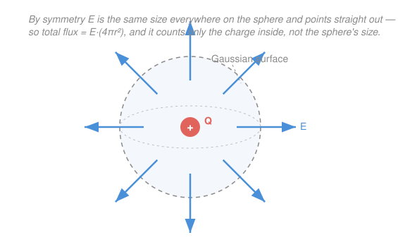

# Electromagnetism · Lesson 1.2: Gauss's law

> ⏱ ~15 min · Module 1: Electrostatics · Builds on: [1.1 Charge, Coulomb's law, and the electric field](01-01-coulomb-electric-field.md), [`calc-refresher` 5.3](../../calc-refresher/lessons/05-03-green-stokes-divergence.md) · Unlocks: 1.3 (electric potential)

## Why this matters

Coulomb's law ([1.1](01-01-coulomb-electric-field.md)) can find the field of *any* charge distribution — but only through a vector integral that is brutal for anything past a couple of point charges. Gauss's law is the shortcut: when a distribution has enough symmetry, it hands you the field in a single line of algebra, no integral at all. It is also the first of Maxwell's four equations, and — the punchline of this lesson — it is nothing but the **divergence theorem** you proved in `calc-refresher` 5.3, wearing a physics uniform.

## The idea

Picture the field lines streaming out of a positive charge (from [1.1](01-01-coulomb-electric-field.md)). Now wrap any closed bag around that charge and count how many lines poke out through the bag's skin. Here's the magic: **that count depends only on the charge inside the bag — not on the bag's shape, size, or where the charge sits inside it.** Move the charge around, dent the bag, blow it up to twice the size: the same lines that go in on one side come out the other, and the net count is fixed by the enclosed charge alone.

A charge *outside* the bag contributes exactly zero: every line it sends in through one wall leaves through another, netting nothing.

"How many lines cross the skin" is called **flux**. So Gauss's law is just: net flux out of a closed surface = (charge enclosed), up to a constant. That's a *conservation-of-lines* bookkeeping statement — and bookkeeping is cheap. The reason it saves labor is subtler: if you choose the bag to match the charge's symmetry, the field is constant and perpendicular everywhere on it, and "flux" collapses from an integral into $E \times (\text{area})$.

## The formal version

Throughout: $\mathbf E$ is the electric field (units N/C), $d\mathbf A$ is an outward-pointing patch of area on a closed surface (its magnitude is the patch's area in m², its direction is the outward normal), $Q_{\text{enc}}$ is the total charge enclosed (C), and $\varepsilon_0 = 8.85\times10^{-12}\ \mathrm{C^2/(N\,m^2)}$ is the permittivity of free space (recall $k = 1/4\pi\varepsilon_0 = 8.99\times10^9$).

**Electric flux** through a surface:

$$\Phi_E = \oint \mathbf E \cdot d\mathbf A \qquad [\,\mathrm{N\,m^2/C}\,].$$

In words: at each patch, take the part of $\mathbf E$ that pierces straight through ($\mathbf E \cdot d\mathbf A$ keeps only the perpendicular component), and add up over the whole closed surface. It literally counts field lines threading the surface, signed $+$ for outward, $-$ for inward.

**Gauss's law:**

$$\oint \mathbf E \cdot d\mathbf A = \frac{Q_{\text{enc}}}{\varepsilon_0}.$$

In words: the net flux out of *any* closed surface equals the charge trapped inside, divided by $\varepsilon_0$. The surface's geometry drops out entirely — only what's enclosed matters.

**This is the divergence theorem.** In `calc-refresher` 5.3 you proved $\oiint_S \mathbf F \cdot \mathbf n\, dS = \iiint_V (\nabla\cdot\mathbf F)\,dV$. Apply it to $\mathbf E$ and use the *differential* form of Gauss's law, $\nabla\cdot\mathbf E = \rho/\varepsilon_0$ (charge density $\rho$, in C/m³, **is** the divergence of $\mathbf E$):

$$\oint \mathbf E \cdot d\mathbf A = \iiint_V (\nabla\cdot\mathbf E)\,dV = \iiint_V \frac{\rho}{\varepsilon_0}\,dV = \frac{Q_{\text{enc}}}{\varepsilon_0}.$$

The integral form and the differential form are the same law read at two zoom levels — the divergence theorem is the translator between them.

**The method (three steps).**
1. Spot the symmetry (spherical / cylindrical / planar) and pick a **Gaussian surface** on which $\mathbf E$ is constant in magnitude and either parallel or perpendicular to $d\mathbf A$ everywhere.
2. Then $\oint \mathbf E\cdot d\mathbf A = E \times (\text{area of the part } \mathbf E \text{ pierces})$ — the integral is gone.
3. Set that equal to $Q_{\text{enc}}/\varepsilon_0$ and solve for $E$.

The three classic symmetries, each in one line:

| Symmetry | Gaussian surface | Result |
|---|---|---|
| Point / sphere, charge $Q$ | sphere, radius $r$ | $E \cdot 4\pi r^2 = \dfrac{Q}{\varepsilon_0} \Rightarrow E = \dfrac{Q}{4\pi\varepsilon_0 r^2} = \dfrac{kQ}{r^2}$ |
| Infinite line, density $\lambda$ (C/m) | cylinder, radius $r$, length $L$ | $E \cdot 2\pi r L = \dfrac{\lambda L}{\varepsilon_0} \Rightarrow E = \dfrac{\lambda}{2\pi\varepsilon_0 r}$ |
| Infinite plane, density $\sigma$ (C/m²) | pillbox, cap area $A$ (two caps) | $E \cdot 2A = \dfrac{\sigma A}{\varepsilon_0} \Rightarrow E = \dfrac{\sigma}{2\varepsilon_0}$ |

The sphere case **recovers Coulomb's law** — a reassuring consistency check, not a coincidence: Gauss and Coulomb are equivalent. Note the geometry in the falloff: point $\sim 1/r^2$, line $\sim 1/r$, plane $\sim$ constant (a plane's field doesn't weaken with distance — the far-away charge fans out just enough to compensate).

## Picture

## Worked examples

**Example 1 (flux is just enclosed charge).** A closed surface encloses a $+5.0$ nC charge and a $-2.0$ nC charge; a $+10$ nC charge sits *outside* it. Net flux out?

Only the enclosed charge counts: $Q_{\text{enc}} = +5.0 - 2.0 = +3.0$ nC. The outside charge contributes zero net flux (its lines enter and leave). So

$$\Phi_E = \frac{Q_{\text{enc}}}{\varepsilon_0} = \frac{3.0\times10^{-9}}{8.85\times10^{-12}} \approx 339\ \mathrm{N\,m^2/C}.$$

No shape information was needed or used — that's the whole point.

**Example 2 (field of an infinite line, the method in action).** A long wire carries linear charge density $\lambda = 4.0$ nC/m. Field at $r = 0.20$ m?

By symmetry $\mathbf E$ points radially out and depends only on $r$, so wrap the wire in a coaxial **cylinder** of radius $r$, length $L$. Flux through the two flat ends is zero ($\mathbf E$ is parallel to them — it grazes, doesn't pierce); through the curved side, $\mathbf E$ is perpendicular and constant, area $2\pi r L$. Enclosed charge is $\lambda L$:

$$E\cdot 2\pi r L = \frac{\lambda L}{\varepsilon_0} \;\Rightarrow\; E = \frac{\lambda}{2\pi\varepsilon_0 r} = \frac{2k\lambda}{r} = \frac{2(8.99\times10^9)(4.0\times10^{-9})}{0.20} \approx 360\ \mathrm{N/C}.$$

The length $L$ cancels — it had to, since an infinite wire has no special point. One line of algebra replaced the [1.1](01-01-coulomb-electric-field.md) integral over an infinite rod.

## Watch out

- **You might think flux depends on where the charge sits inside, or on the surface's shape.** It doesn't — only $Q_{\text{enc}}$ matters. That independence *is* the divergence theorem: the surface integral equals a volume integral that sees only enclosed charge.
- **You might think Gauss's law gives you $E$ for *any* distribution.** The law is always *true*, but only *useful* for extracting $E$ when symmetry lets you pull $E$ outside the integral. For a lopsided blob, $\oint\mathbf E\cdot d\mathbf A = Q_{\text{enc}}/\varepsilon_0$ still holds — but $E$ varies over the surface, so you can't solve for it. Back to Coulomb.
- **You might forget that zero net flux doesn't mean zero field.** An external charge (or a neutral enclosed pair) gives $\Phi_E = 0$, yet $\mathbf E \neq 0$ on the surface — the inward and outward pieces just cancel in the *sum*.
- **You might use both pillbox caps' area but forget the field exits *both* sides of a plane.** The $2A$ (not $A$) is why the plane's field is $\sigma/2\varepsilon_0$, not $\sigma/\varepsilon_0$.

## One-liner

> Gauss's law trades a hard vector integral for counting the charge inside — but only pays off when you pick a surface whose symmetry makes the flux integral collapse to $E \times \text{area}$.

## Problems

**P1 (🟢)** A cube encloses two point charges, $+8.0$ nC and $-3.0$ nC, while a $+12$ nC charge sits just outside one face. Find the net electric flux out of the cube. Does the cube's size or the outside charge change your answer?

**P2 (🟡)** An infinite flat sheet carries uniform surface charge density $\sigma = 2.0\times10^{-8}\ \mathrm{C/m^2}$. Using a cylindrical "pillbox" Gaussian surface straddling the sheet, derive the field and evaluate it. Which surfaces carry flux, and which carry none — and why?

**P3 (🔴, the boss)** A solid insulating sphere of radius $R = 0.10$ m carries total charge $Q = 6.0$ nC spread uniformly through its volume.
(a) Use a spherical Gaussian surface to find $E(r)$ *inside* ($r < R$) and *outside* ($r > R$).
(b) Evaluate $E$ at $r = 0.050$ m and at $r = 0.20$ m, and confirm the two formulas agree at the surface $r = R$.
(c) Name the `calc-refresher` 5.3 theorem that guarantees the outside field is identical to that of a point charge $Q$ at the center.

Solutions

**P1** Only enclosed charge counts: $Q_{\text{enc}} = +8.0 - 3.0 = +5.0$ nC. The $+12$ nC outside contributes zero net flux.

$$\Phi_E = \frac{Q_{\text{enc}}}{\varepsilon_0} = \frac{5.0\times10^{-9}}{8.85\times10^{-12}} \approx 565\ \mathrm{N\,m^2/C}.$$

Neither the cube's size nor the outside charge changes it — Gauss's law depends only on $Q_{\text{enc}}$. **Check:** units $\mathrm{C}/(\mathrm{C^2/N\,m^2}) = \mathrm{N\,m^2/C}$ ✓, and positive net charge gives positive (outward) flux ✓.

**P2** By symmetry $\mathbf E$ points straight away from the sheet, same magnitude on both sides. Use a pillbox with its axis perpendicular to the sheet and end-caps of area $A$ on either side. Flux breakdown: the **curved side wall** is parallel to $\mathbf E$ (grazes it) → zero flux; each **flat cap** is perpendicular to $\mathbf E$ and pierced → flux $EA$ each, so $2EA$ total. Enclosed charge is $\sigma A$:

$$E\cdot 2A = \frac{\sigma A}{\varepsilon_0} \;\Rightarrow\; E = \frac{\sigma}{2\varepsilon_0} = \frac{2.0\times10^{-8}}{2(8.85\times10^{-12})} \approx 1.1\times10^{3}\ \mathrm{N/C}.$$

The result is independent of distance from the sheet — a uniform field. **Check:** units $(\mathrm{C/m^2})/(\mathrm{C^2/N\,m^2}) = \mathrm{N/C}$ ✓; the factor $2A$ (field exits both caps) is what halves the answer to $\sigma/2\varepsilon_0$ ✓.

**P3** (a) **Outside** ($r > R$): a sphere of radius $r$ encloses all of $Q$. By symmetry $E$ is constant and radial over it, area $4\pi r^2$:

$$E\cdot 4\pi r^2 = \frac{Q}{\varepsilon_0} \;\Rightarrow\; E_{\text{out}}(r) = \frac{Q}{4\pi\varepsilon_0 r^2} = \frac{kQ}{r^2}.$$

**Inside** ($r < R$): the Gaussian sphere encloses only the fraction of charge within radius $r$. Uniform density means charge scales with volume, so $Q_{\text{enc}} = Q\,(r^3/R^3)$:

$$E\cdot 4\pi r^2 = \frac{Q\,r^3/R^3}{\varepsilon_0} \;\Rightarrow\; E_{\text{in}}(r) = \frac{Q}{4\pi\varepsilon_0 R^3}\,r = \frac{kQ}{R^3}\,r.$$

So $E$ grows *linearly* from $0$ at the center, peaks at the surface, then falls off as $1/r^2$ outside.

(b) At $r = 0.050$ m (inside): $E_{\text{in}} = \dfrac{kQ}{R^3}r = \dfrac{(8.99\times10^9)(6.0\times10^{-9})}{(0.10)^3}(0.050) \approx 2.7\times10^{3}\ \mathrm{N/C}.$

At $r = 0.20$ m (outside): $E_{\text{out}} = \dfrac{kQ}{r^2} = \dfrac{(8.99\times10^9)(6.0\times10^{-9})}{(0.20)^2} \approx 1.3\times10^{3}\ \mathrm{N/C}.$

At the surface $r = R = 0.10$ m, both formulas give $\dfrac{kQ}{R^2} = \dfrac{(8.99\times10^9)(6.0\times10^{-9})}{(0.10)^2} \approx 5.4\times10^{3}\ \mathrm{N/C}$ — inside's $kQr/R^3$ at $r=R$ is $kQ/R^2$, matching outside's $kQ/r^2$. The field is continuous. ✓

(c) The **divergence theorem** (`calc-refresher` 5.3). It guarantees $\oint\mathbf E\cdot d\mathbf A = \iiint(\nabla\cdot\mathbf E)\,dV = Q_{\text{enc}}/\varepsilon_0$, which depends only on the *enclosed* charge, not on how it's distributed inside. A uniform ball and a point charge of the same total $Q$ enclose the same amount, so their external fields are identical. **Check:** outside formula equals the [1.1](01-01-coulomb-electric-field.md) Coulomb field $kQ/r^2$ exactly ✓; units of $E_{\text{in}}$: $\dfrac{(\mathrm{N\,m^2/C})\cdot\mathrm C}{\mathrm{m^3}}\cdot\mathrm m = \mathrm{N/C}$ ✓.

## Flashback

**From Lesson 1.1 (Coulomb's law and superposition):** Two point charges lie on the $x$-axis: $+5.0$ nC at the origin and $-5.0$ nC at $x = 0.30$ m. Find the net electric field at the midpoint $x = 0.15$ m — magnitude and direction.

Solution

Each charge is $r = 0.15$ m from the midpoint. Magnitude of each field:

$$E = \frac{k|q|}{r^2} = \frac{(8.99\times10^9)(5.0\times10^{-9})}{(0.15)^2} \approx 2.0\times10^{3}\ \mathrm{N/C}.$$

Directions (superposition — add as vectors): the $+5.0$ nC at the origin pushes its field *away* from itself, i.e. in $+x$ at the midpoint. The $-5.0$ nC at $x=0.30$ pulls its field *toward* itself, also $+x$ at the midpoint. Both point the same way, so they add:

$$E_{\text{net}} = 2(2.0\times10^{3}) \approx 4.0\times10^{3}\ \mathrm{N/C}, \quad \text{directed } +x \text{ (from the } + \text{ charge toward the } - \text{ charge).}$$

**Check:** at the midpoint of a dipole the two contributions reinforce rather than cancel (a common trap — signs enter through *direction*, not by subtracting magnitudes) ✓; units $\mathrm{N/C}$ ✓.

## Connections

- **Backward:** the sphere case reproduces [1.1](01-01-coulomb-electric-field.md)'s $E = kQ/r^2$ — Gauss and Coulomb are equivalent, and superposition still underlies $Q_{\text{enc}}$ (you *add up* enclosed charge). The whole law is the divergence theorem of [`calc-refresher` 5.3](../../calc-refresher/lessons/05-03-green-stokes-divergence.md), whose boss problem was Gauss's law in miniature.
- **Forward:** [1.3](01-03-electric-potential.md) integrates these fields to get the potential $V$ (and the boss problem finishes by turning $E(r)$ from P3 into $V(r)$). Gauss's law returns as **Maxwell equation #1** in [4.1](../lessons/04-01-maxwells-equations.md); its magnetic twin $\oint\mathbf B\cdot d\mathbf A = 0$ says there are no magnetic charges.
- **Sideways (vector calculus / gravity):** the *same* $1/r^2$ inverse-square structure makes Newtonian gravity obey its own Gauss's law — a spherical mass pulls exactly as if all its mass were at the center, guaranteed by the identical divergence-theorem argument. One theorem, two forces.
