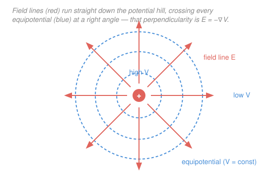

# Electromagnetism · Lesson 1.3: Electric potential and energy

> ⏱ ~15 min · Module 1: Electrostatics · Builds on: [1.2 Gauss's law](01-02-gauss-law.md), [`calc-refresher` 4.1](../../calc-refresher/lessons/04-01-partial-derivatives-and-gradient.md) · Unlocks: Module 2 (capacitance and circuits)

## Why this matters

The electric field is a vector at every point in space — powerful, but a nuisance to add up, since superposition means juggling arrows. Potential is the same physics repackaged as a single number at each point, and numbers add without any geometry. That trade — throw away direction, keep only "electrical height" — is why almost every real calculation (capacitors, circuits, the energy of a molecule, the volt on your battery) is done in potential, not field. And it hands you the field back whenever you want it, through one gradient.

## The idea

Picture the field as a landscape of hills and valleys. A positive charge is a hilltop; the ground slopes away from it in every direction. Set a test charge down anywhere and it rolls **downhill** — that's the electric force. The *height* of the ground at each point is the **electric potential** $V$: not a force, not a direction, just a number telling you how high up the electrical hill you're standing.

Two things follow immediately, and they're the whole lesson:

- **Height differences cost work.** Carrying a charge from a low spot to a high spot takes energy, exactly like carrying a bucket uphill — and the bill is $q\,\Delta V$, charge times height climbed.
- **The force points straight downhill.** The steepest-descent direction of the height map *is* the field. In the language of [`calc-refresher` 4.1](../../calc-refresher/lessons/04-01-partial-derivatives-and-gradient.md), the gradient $\nabla V$ points uphill, so the field, pointing downhill, is $\mathbf E = -\nabla V$.

Because $V$ is a plain number, the potential of many charges is just the *sum* of their potentials — no vector components, no angles. That is the convenience the whole subject is built to exploit.

## The formal version

**Potential difference.** Moving a charge through the field, the work per unit charge is minus the field's push along the path:

$$\Delta V = V_B - V_A = -\int_A^B \mathbf E\cdot d\mathbf l.$$

In words: to go from $A$ to $B$, add up the field component along each step and flip the sign — pushing *against* the field raises your potential. Here $V$ is the **electric potential**, measured in **volts**, and one volt is one joule per coulomb ($1\ \mathrm{V}=1\ \mathrm{J/C}$); $\mathbf E$ is the field (units V/m, equivalently N/C) and $d\mathbf l$ is a step along the path (meters).

**The field is the downhill gradient.** Inverting the integral gives the pointwise statement:

$$\mathbf E = -\nabla V.$$

In words: the field is minus the gradient of potential — it points in the direction $V$ falls fastest, with magnitude equal to that steepest slope. This is [`calc-refresher` 4.1](../../calc-refresher/lessons/04-01-partial-derivatives-and-gradient.md)'s "$-\nabla f$ is steepest descent" wearing a physics costume.

**Potential of a point charge.** Take $V=0$ infinitely far away; then a charge $q$ produces

$$V = \frac{1}{4\pi\varepsilon_0}\frac{q}{r} = \frac{kq}{r},\qquad k=\frac{1}{4\pi\varepsilon_0}=8.99\times10^{9}\ \mathrm{N\,m^2/C^2}.$$

In words: potential falls off like $1/r$ (gentler than the field's $1/r^2$), and it is a **scalar** — for several charges just add: $V=\sum_i kq_i/r_i$, signs and all, no components. Here $r$ is the distance (m) from the charge $q$ (C) to the point, and $\varepsilon_0$ is the permittivity of free space.

**Potential energy.** A charge $q$ sitting where the potential is $V$ has

$$U = qV\quad(\text{joules}),$$

and a *pair* of point charges a distance $r$ apart holds

$$U = \frac{kq_1q_2}{r}.$$

In words: $U=qV$ is the energy it took to bring $q$ in from infinity; the pair formula is the energy stored in that one interaction (positive = took work to assemble, negative = released energy).

**Equipotentials.** A surface of constant $V$ is an **equipotential**. Since moving along it changes $V$ by nothing, $\Delta V=0$ means *no work* to slide a charge along it — and by $\mathbf E=-\nabla V$, the field is everywhere **perpendicular** to it (the gradient is always normal to its level sets).

**The electron-volt.** One **eV** is the energy a charge of magnitude $e=1.6\times10^{-19}$ C gains crossing $\Delta V=1$ V: $1\ \mathrm{eV}=1.6\times10^{-19}\ \mathrm{J}$. A convenience unit — atomic-scale energies are ugly in joules but tidy in eV.

## Picture

## Worked examples

**Example 1 (mechanical — potential is just a number).** Find the potential $3.0$ cm from a $+5.0$ nC point charge.

$$V = \frac{kq}{r} = \frac{(8.99\times10^{9})(5.0\times10^{-9})}{0.030} = 1.5\times10^{3}\ \mathrm{V}.$$

No direction, no components — one division. Add a second charge and you'd simply add its $kq/r$, minding its sign. (Units: $\frac{(\mathrm{N\,m^2/C^2})(\mathrm C)}{\mathrm m}=\mathrm{N\,m/C}=\mathrm{J/C}=\mathrm V$. ✓)

**Example 2 (why you'd care — recover the field from the potential).** The scalar $V=kq/r$ secretly stores the full vector field. By symmetry $V$ depends only on $r$, so the gradient has just a radial part, and $\mathbf E=-\nabla V$ reads

$$E_r = -\frac{dV}{dr} = -\frac{d}{dr}\!\left(\frac{kq}{r}\right) = \frac{kq}{r^2}.$$

That is Coulomb's field from [1.1](01-01-coulomb-electric-field.md), regenerated by one derivative of a single number. This is the payoff loop: compute the *easy* scalar $V$ by summing $kq/r$ over a messy charge distribution, then differentiate once to get the field you actually wanted — cheaper than adding field vectors directly.

## Watch out

- You might think potential $V$ and potential energy $U$ are the same thing. They differ by the charge you put there: $U=qV$. $V$ is a property of *space* (volts, present whether or not a charge is sitting there); $U$ is the energy of a *specific charge* placed in it (joules).
- You might think a big potential means a big field. No — $\mathbf E=-\nabla V$ depends on how fast $V$ *changes*, not its value. $V$ can be huge and flat (zero field) or zero and steep (large field). It's the slope that pushes, not the height.
- You might drop the signs when summing potentials "because it's a scalar." Scalar means no *vector components* to resolve — but the charges' own signs stay: a nearby negative charge *lowers* $V$. Signed addition, always.
- You might forget the minus sign in $\mathbf E=-\nabla V$. The gradient points *uphill*; the field pushes positive charge *downhill*. Lose the sign and your field points backward.

## One-liner

> Potential is the electrical height in volts (J/C): moving a charge $q$ across $\Delta V$ costs energy $q\,\Delta V$, and the field runs straight downhill as $\mathbf E=-\nabla V$.

## Problems

**P1 (🟢)** An electron (charge $-e$, $e=1.6\times10^{-19}$ C) is accelerated from rest through a potential difference of $100$ V (moving toward higher potential, as it must). How much kinetic energy does it gain — in electron-volts, and in joules?

**P2 (🟡)** Two point charges are fixed in place: $q_1=+4.0$ nC and $q_2=-2.0$ nC, separated by $8.0$ cm. A point $P$ lies $4.0$ cm from $q_1$ and $6.0$ cm from $q_2$.
(a) Find the potential $V$ at $P$ (scalar superposition — mind the signs).
(b) Find the energy $U$ that was needed to assemble this pair from infinite separation, and say whether assembling them cost or released energy.

**P3 (🔴)** Two large parallel plates are $2.0$ cm apart with a $500$ V potential difference between them, giving a uniform field in the gap.
(a) Find the field magnitude $E$ from the voltage and gap.
(b) A proton (charge $+e$, mass $m_p=1.67\times10^{-27}$ kg) is released from rest at the positive plate. Using energy conservation, find its speed when it reaches the negative plate.

Solutions

**P1** Work done on a charge crossing a potential difference is $W=|q|\,\Delta V$, and here all of it becomes kinetic energy. Crossing $100$ V with charge magnitude $e$ is, by definition of the unit, $100$ eV. In joules:

$$W = e\,\Delta V = (1.6\times10^{-19}\ \mathrm C)(100\ \mathrm V) = 1.6\times10^{-17}\ \mathrm J.$$

So $\mathrm{KE}=100\ \mathrm{eV}=1.6\times10^{-17}\ \mathrm J$. (Sanity check on direction: the electron is negative, so it gains energy moving to *higher* $V$ — falling down its own hill, which is upside down relative to a positive charge's. The eV was built for exactly this: charge magnitude $\times$ volts. ✓)

**P2** (a) Potentials add as signed scalars, $V=k\!\left(\dfrac{q_1}{r_1}+\dfrac{q_2}{r_2}\right)$:

$$V = 8.99\times10^{9}\!\left(\frac{4.0\times10^{-9}}{0.040}+\frac{-2.0\times10^{-9}}{0.060}\right) = 8.99\times10^{9}\,(1.00\times10^{-7}-3.33\times10^{-8}).$$

$$V = 8.99\times10^{9}\times 6.67\times10^{-8} \approx 6.0\times10^{2}\ \mathrm V.$$

(b) Assembly energy of the pair, $U=\dfrac{kq_1q_2}{r}$ with $r=0.080$ m:

$$U = \frac{(8.99\times10^{9})(4.0\times10^{-9})(-2.0\times10^{-9})}{0.080} = \frac{-7.19\times10^{-8}}{0.080} \approx -9.0\times10^{-7}\ \mathrm J.$$

$U<0$: the charges have *opposite* sign and attract, so bringing them together **releases** energy (you'd have to do positive work to pull them back apart). (Check: $U=qV$ logic holds — the negative charge sits in the positive one's potential $kq_1/r>0$, giving $q_2\cdot(kq_1/r)<0$. ✓)

**P3** (a) A uniform field between plates satisfies $\Delta V = E\,d$ (the line integral $\int\mathbf E\cdot d\mathbf l$ over a constant field), so

$$E = \frac{\Delta V}{d} = \frac{500\ \mathrm V}{0.020\ \mathrm m} = 2.5\times10^{4}\ \mathrm{V/m}.$$

(b) All the potential energy the proton loses becomes kinetic energy: $\tfrac12 m_p v^2 = e\,\Delta V$. So

$$v = \sqrt{\frac{2e\,\Delta V}{m_p}} = \sqrt{\frac{2(1.6\times10^{-19})(500)}{1.67\times10^{-27}}} = \sqrt{9.58\times10^{10}} \approx 3.1\times10^{5}\ \mathrm{m/s}.$$

(Check: energy in is $e\Delta V=8.0\times10^{-17}$ J; then $\tfrac12(1.67\times10^{-27})(3.1\times10^5)^2 \approx 8.0\times10^{-17}$ J. ✓ Note the gap $d$ never entered part (b) — only the voltage crossed sets the energy, not how far apart the plates sit.)

## Flashback

**From Lesson 1.2 (Gauss's law):** An infinitely long straight wire carries a uniform linear charge density $\lambda$ (units C/m). Use a Gaussian surface to find the electric field a distance $r$ from the wire.

Solution

By symmetry the field points radially outward, with magnitude depending only on $r$. Wrap a coaxial cylinder of radius $r$ and length $L$ around the wire. The flat end-caps contribute no flux (field is parallel to them); on the curved side $\mathbf E$ is perpendicular and constant, so the flux is $E\cdot(2\pi r L)$. Gauss's law equates this to the enclosed charge over $\varepsilon_0$:

$$E\,(2\pi r L) = \frac{Q_{\text{enc}}}{\varepsilon_0} = \frac{\lambda L}{\varepsilon_0} \quad\Longrightarrow\quad E = \frac{\lambda}{2\pi\varepsilon_0 r} = \frac{2k\lambda}{r}.$$

The length $L$ cancels, as it must for an infinite wire. Note the field falls as $1/r$ here (a *line*), gentler than a point charge's $1/r^2$ — a foretaste of why extended sources behave differently. (Check units: $\dfrac{\mathrm{C/m}}{(\mathrm{C^2/N\,m^2})\,\mathrm m}=\dfrac{\mathrm{C/m}\cdot\mathrm{N\,m^2/C^2}}{\mathrm m}=\mathrm{N/C}$. ✓)

## Connections

- **Backward:** Example 2 regenerates [1.1](01-01-coulomb-electric-field.md)'s Coulomb field by differentiating $V$, and the parallel-plate field in P3 is the uniform field you'd get from [1.2](01-02-gauss-law.md)'s charged plane — potential is those two lessons re-expressed as a single number.
- **Forward:** [2.1 Capacitance](02-01-capacitance.md) is this lesson made quantitative — a capacitor is two conductors held at a potential difference $\Delta V$, storing energy $U$; the volt you compute here is the volt on every battery in Module 2.
- **Sideways (`calc-refresher` 4.1):** $\mathbf E=-\nabla V$ **is** steepest descent from [4.1](../../calc-refresher/lessons/04-01-partial-derivatives-and-gradient.md) — equipotentials are level sets, the field is the perpendicular gradient. The same "force = $-\nabla(\text{potential})$" structure returns as conservative forces in `analytical-mechanics` and as gravitational potential; recognizing it once pays off across all three.
