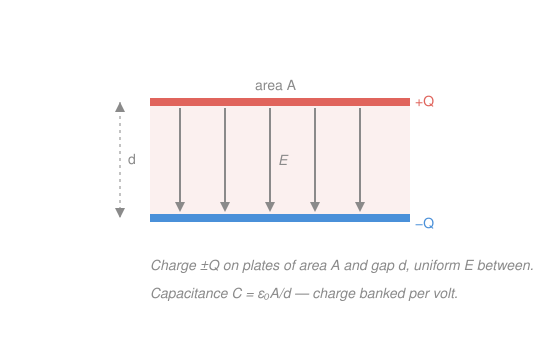

# Electromagnetism · Lesson 2.1: Conductors, capacitance, and dielectrics

> ⏱ ~15 min · Module 2: Capacitance and circuits · Builds on: [1.3 Electric potential and energy](01-03-electric-potential.md) · Unlocks: 2.2 (DC circuits)

## Why this matters

Every circuit that stores energy without a chemical reaction — the flash in a camera, the smoothing in a power supply, the timing in the RC circuits two lessons from now — runs on a capacitor. It is the simplest device in electronics: two conductors, some charge, a field between them. And it is the cleanest place to see two ideas from Module 1 pay off at once — that a conductor forces its own field to zero inside, and that potential is the field integrated over distance. Get capacitance and you get *energy stored in a field*, the same quantity that later shows up carried away by light.

## The idea

Put charge on a lump of metal and it can't rest until the field *inside* the metal is zero — because any leftover field would push the free electrons around, and they only stop once they've cancelled it. So the charge flees to the **surface**, the interior field dies, and the whole conductor sits at one voltage (a free charge inside feels no force, so no work is needed to walk it around — every point is at the same potential). A conductor is a self-flattening puddle of charge.

Now take *two* conductors, pile $+Q$ on one and $-Q$ on the other. A field spans the gap, and crossing that gap costs a voltage $V$. Here's the clean fact: double the charge and you exactly double the field, hence double the voltage. **The ratio $Q/V$ never changes** — it's fixed by the geometry alone. That ratio is the **capacitance**: how much charge the pair banks per volt you push across it. A big capacitance is a big reservoir — it swallows a lot of charge for a small voltage. Everything else in this lesson is computing that ratio and the energy it holds.

## The formal version

**Capacitance.**

$$C = \frac{Q}{V}.$$

In words: $C$ (units **farads**, $\mathrm{F} = \mathrm{C/V}$, coulombs of charge stored per volt across the plates) is the charge $Q$ on one conductor divided by the potential difference $V$ between them. It depends only on shape and spacing, not on how much charge you happen to have put on. A farad is enormous; real capacitors run in $\mu\mathrm{F}$ ($10^{-6}$), $\mathrm{nF}$ ($10^{-9}$), $\mathrm{pF}$ ($10^{-12}$).

**The parallel-plate capacitor.** Two flat plates of area $A$ (m²), separated by a gap $d$ (m) small enough that the field between them is uniform. Put surface charge density $\sigma = Q/A$ (C/m²) on them. From [1.2](01-02-gauss-law.md), the field of a charged plane gives, between the plates,

$$E = \frac{\sigma}{\varepsilon_0} = \frac{Q}{\varepsilon_0 A},$$

where $\varepsilon_0 = 8.85\times10^{-12}\ \mathrm{F/m}$ is the permittivity of free space and $E$ is the field magnitude (V/m). A uniform field over a gap $d$ makes a voltage $V = Ed$ (from [1.3](01-03-electric-potential.md), $V = \int E\,dl$). So

$$V = E d = \frac{Q d}{\varepsilon_0 A}, \qquad C = \frac{Q}{V} = \boxed{\frac{\varepsilon_0 A}{d}}.$$

In words: bigger plates bank more charge; a wider gap banks less. The $Q$ cancels, confirming $C$ is pure geometry. (Check units: $\varepsilon_0 A/d$ is $(\mathrm{F/m})(\mathrm{m^2})/\mathrm{m} = \mathrm{F}$. ✓)

**Energy stored.** Charging a capacitor means ferrying charge across against a voltage that grows as you go. Summing the work gives three equivalent forms:

$$U = \tfrac{1}{2}CV^2 = \tfrac{1}{2}QV = \frac{Q^2}{2C}.$$

In words: $U$ (units **joules**) is the energy banked. Use whichever pair of $Q, V, C$ you know. This energy isn't "on the plates" — it lives in the field filling the gap, at a density

$$u = \tfrac{1}{2}\varepsilon_0 E^2 \quad (\mathrm{J/m^3}).$$

**Dielectrics.** Slide an insulating material (glass, plastic) into the gap. Its molecules polarize and set up a small opposing field, so the *same* charge now makes a *weaker* net field — hence a smaller voltage, hence more charge banked per volt:

$$C \to \kappa C,$$

where $\kappa \geq 1$ (dimensionless) is the material's **dielectric constant**. In words: a dielectric multiplies capacitance by $\kappa$; every real capacitor uses one.

**Combinations.** Wire capacitors together and they merge into one effective $C$:

$$\text{parallel: } C_{\text{eq}} = \sum_i C_i, \qquad \text{series: } \frac{1}{C_{\text{eq}}} = \sum_i \frac{1}{C_i}.$$

In words: **parallel** plates share the same voltage and their areas add, so capacitance adds (bigger reservoir). **Series** capacitors carry the same charge but split the voltage, so it's the *reciprocals* that add — the equivalent is smaller than any one of them. (Note: this is the opposite of how resistors combine, coming in 2.2 — a classic trap.)

## Picture

## Worked examples

**Example 1 (mechanical — the three quantities).** Plates of area $A = 0.50\ \mathrm{m^2}$, gap $d = 1.0\ \mathrm{mm} = 1.0\times10^{-3}\ \mathrm{m}$, charged to $V = 12\ \mathrm{V}$.

$$C = \frac{\varepsilon_0 A}{d} = \frac{(8.85\times10^{-12})(0.50)}{1.0\times10^{-3}} = 4.4\times10^{-9}\ \mathrm{F} = 4.4\ \mathrm{nF}.$$

$$Q = CV = (4.4\times10^{-9})(12) = 5.3\times10^{-8}\ \mathrm{C} = 53\ \mathrm{nC}, \qquad U = \tfrac{1}{2}CV^2 = \tfrac{1}{2}(4.4\times10^{-9})(12)^2 = 3.2\times10^{-7}\ \mathrm{J}.$$

Tiny energy — capacitors store little compared to batteries, but release it *fast*, which is the whole point.

**Example 2 (why you'd care — field energy).** Where does that $3.2\times10^{-7}\ \mathrm{J}$ sit? The field is $E = V/d = 12/(10^{-3}) = 1.2\times10^{4}\ \mathrm{V/m}$, filling a volume $A d = (0.50)(10^{-3}) = 5.0\times10^{-4}\ \mathrm{m^3}$. Energy density times volume:

$$u \cdot (Ad) = \tfrac{1}{2}\varepsilon_0 E^2 \cdot Ad = \tfrac{1}{2}(8.85\times10^{-12})(1.2\times10^{4})^2 (5.0\times10^{-4}) = 3.2\times10^{-7}\ \mathrm{J}.$$

Same number, computed with no mention of the plates — the energy genuinely lives in the field. This is the idea that, in Module 4, lets light carry energy through empty space with no charges in sight.

## Watch out

- You might think adding a dielectric or squeezing the plates changes $C$ by changing $Q$. It doesn't — $C$ is geometry (and material) only. Changing $C$ then forces $Q$ *or* $V$ to change, depending on whether a battery is holding $V$ fixed or the plates are isolated holding $Q$ fixed. Always ask which is clamped (P3).
- You might think series capacitors add like series resistors. Reversed: capacitors add in **parallel** and reciprocal-add in **series**. Charge, not current, is the conserved thing that forces it.
- You might think the energy is $QV$. It's $\tfrac{1}{2}QV$ — the voltage climbs from $0$ to $V$ as you charge, so you pay the *average*. The missing half is exactly the energy a battery wastes as heat while charging (you'll meet it again in 2.3).

## One-liner

> Capacitance $C=\varepsilon_0 A/d$ is charge banked per volt, fixed by geometry alone, and the energy $\tfrac12 CV^2$ it stores lives in the field between the plates.

## Problems

**P1 (🟢)** A parallel-plate capacitor has plates of area $A = 0.20\ \mathrm{m^2}$ separated by $d = 0.50\ \mathrm{mm}$, connected to a $9.0\ \mathrm{V}$ battery. Find (a) its capacitance $C$, (b) the charge $Q$ stored, and (c) the energy $U$. Keep units explicit.

**P2 (🟡)** You have two capacitors, $C_1 = 2.0\ \mu\mathrm{F}$ and $C_2 = 6.0\ \mu\mathrm{F}$. Find the equivalent capacitance when they are wired (a) in parallel and (b) in series. Which arrangement stores more energy at the same applied voltage, and why?

**P3 (🔴)** A capacitor $C_0 = 4.0\ \mathrm{nF}$ is charged to $V_0 = 12\ \mathrm{V}$, then a dielectric with $\kappa = 3$ is slid all the way in. Track $Q$, $V$, $E$, and $U$ for two cases: **(a)** the battery stays connected; **(b)** the battery is first disconnected. Explain physically why the energy moves the way it does in each case.

Solutions

**P1** (a) $C = \dfrac{\varepsilon_0 A}{d} = \dfrac{(8.85\times10^{-12})(0.20)}{0.50\times10^{-3}} = 3.54\times10^{-9}\ \mathrm{F} \approx 3.5\ \mathrm{nF}.$

(b) $Q = CV = (3.54\times10^{-9})(9.0) = 3.19\times10^{-8}\ \mathrm{C} \approx 32\ \mathrm{nC}.$

(c) $U = \tfrac{1}{2}CV^2 = \tfrac{1}{2}(3.54\times10^{-9})(9.0)^2 = 1.43\times10^{-7}\ \mathrm{J} \approx 0.14\ \mu\mathrm{J}.$

Check: cross-check the energy with $U = \tfrac12 QV = \tfrac12(3.19\times10^{-8})(9.0) = 1.44\times10^{-7}\ \mathrm{J}$ — agrees. ✓ Units: $(\mathrm{F})(\mathrm{V}^2) = (\mathrm{C/V})(\mathrm{V}^2) = \mathrm{C\cdot V} = \mathrm{J}$. ✓

**P2** (a) Parallel: $C_{\text{eq}} = C_1 + C_2 = 2.0 + 6.0 = 8.0\ \mu\mathrm{F}.$

(b) Series: $\dfrac{1}{C_{\text{eq}}} = \dfrac{1}{2.0} + \dfrac{1}{6.0} = \dfrac{3}{6} + \dfrac{1}{6} = \dfrac{4}{6} = \dfrac{2}{3}\ (\mu\mathrm{F})^{-1}$, so $C_{\text{eq}} = 1.5\ \mu\mathrm{F}.$

At a fixed voltage $V$, energy is $\tfrac12 C_{\text{eq}}V^2$, so the **parallel** arrangement stores more — it has the larger $C_{\text{eq}}$ ($8.0$ vs $1.5\ \mu\mathrm{F}$). Physically, parallel plates share the full voltage and their charge-banking areas add, while series capacitors each see only part of the voltage and pass the same charge down a longer effective gap.

Check: series $C_{\text{eq}} = 1.5\ \mu\mathrm{F}$ is smaller than either capacitor, as it must be; parallel $8.0\ \mu\mathrm{F}$ is larger than either. ✓

**P3** Baseline: $Q_0 = C_0 V_0 = (4.0\times10^{-9})(12) = 4.8\times10^{-8}\ \mathrm{C} = 48\ \mathrm{nC}$; $U_0 = \tfrac12 C_0 V_0^2 = \tfrac12(4.0\times10^{-9})(12)^2 = 2.88\times10^{-7}\ \mathrm{J}$. The dielectric makes $C = \kappa C_0 = 12\ \mathrm{nF}$ in both cases; what's *clamped* differs.

**(a) Battery connected → $V$ fixed at $12\ \mathrm{V}$.**
- $V = 12\ \mathrm{V}$ (held by battery, unchanged).
- $E = V/d$: unchanged (both $V$ and $d$ fixed).
- $Q = CV = (12\times10^{-9})(12) = 144\ \mathrm{nC}$ — tripled ($\times\kappa$).
- $U = \tfrac12 CV^2 = \tfrac12(12\times10^{-9})(12)^2 = 8.64\times10^{-7}\ \mathrm{J}$ — tripled.
- Energy *rose* because the battery pumped extra charge onto the now-hungrier capacitor, doing work $= 3U_0$.

**(b) Battery disconnected → $Q$ fixed at $48\ \mathrm{nC}$.**
- $Q = 48\ \mathrm{nC}$ (isolated, nowhere to go).
- $V = Q/C = (48\times10^{-9})/(12\times10^{-9}) = 4.0\ \mathrm{V}$ — dropped to $V_0/\kappa$.
- $E = V/d$: dropped by $1/\kappa$ — the dielectric's polarization partly cancels the field.
- $U = \dfrac{Q^2}{2C} = \dfrac{(48\times10^{-9})^2}{2(12\times10^{-9})} = 9.6\times10^{-8}\ \mathrm{J} = U_0/\kappa$ — fell.
- Energy *dropped* because the field does positive work pulling the dielectric in; the capacitor gives energy up to the slab (which is why a dielectric is sucked into the gap).

Check: in (a) the ratios are $Q/Q_0 = U/U_0 = \kappa = 3$ with $V, E$ flat; in (b) the ratios are $V/V_0 = E/E_0 = U/U_0 = 1/\kappa = 1/3$ with $Q$ flat. Exactly the two clamped-variable stories, mirror images. ✓

## Flashback

**From Lesson 1.3 (Electric potential and energy):** A point charge $Q = 4.0\ \mathrm{nC}$ sits alone at the origin. (a) Find the electric potential at a distance $r = 0.20\ \mathrm{m}$, taking $V = 0$ at infinity. (b) How much work must an external agent do to bring a second charge $q = 1.0\ \mathrm{nC}$ slowly from infinity to that point? (Use $k = 1/(4\pi\varepsilon_0) = 8.99\times10^{9}\ \mathrm{N\,m^2/C^2}$.)

Solution

(a) The potential of a point charge is $V = \dfrac{kQ}{r} = \dfrac{(8.99\times10^{9})(4.0\times10^{-9})}{0.20} = \dfrac{35.96}{0.20} = 1.8\times10^{2}\ \mathrm{V} \approx 180\ \mathrm{V}.$

(b) Bringing $q$ in slowly, the external work equals the change in potential energy, and with $V=0$ at infinity that is just $W_{\text{ext}} = qV = (1.0\times10^{-9})(180) = 1.8\times10^{-7}\ \mathrm{J} \approx 0.18\ \mu\mathrm{J}.$

Check: $W_{\text{ext}} = qV$ carries units $(\mathrm{C})(\mathrm{V}) = \mathrm{J}$, and it's positive because pushing a positive charge toward a positive charge is uphill — as expected. ✓

## Connections

- **Backward:** this lesson is [1.2](01-02-gauss-law.md) and [1.3](01-03-electric-potential.md) cashed in — Gauss's law hands you the plate field $E = \sigma/\varepsilon_0$, and potential-as-field-integral turns it into $V = Ed$; divide and capacitance falls out.
- **Forward:** [2.2](02-02-dc-circuits.md) adds resistors and current, and [2.3](02-03-rc-circuits.md) wires a capacitor *through* a resistor — the charge $Q$ you banked here becomes $q(t)$ draining through an ODE with time constant $RC$. The "missing half" of the charging energy (Watch out #3) is exactly that circuit's resistive loss.
- **Sideways (Module 4):** the field-energy density $u = \tfrac12\varepsilon_0 E^2$ is half of the electromagnetic energy density; its magnetic twin $\tfrac{1}{2\mu_0}B^2$ appears in 3.x, and together they ride along with light in [4.3](04-03-energy-poynting.md).
