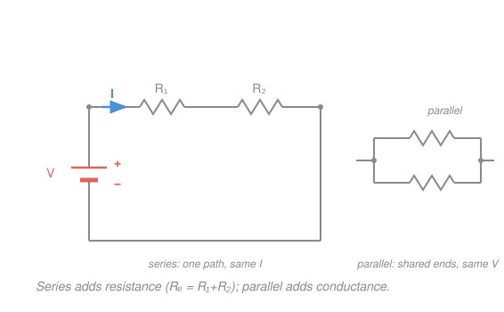

# Electromagnetism · Lesson 2.2: Current, resistance, and DC circuits

> ⏱ ~15 min · Module 2: Capacitance and circuits · Builds on: [2.1 Conductors, capacitance, and dielectrics](02-01-capacitance.md), [1.3 Electric potential and energy](01-03-electric-potential.md) · Unlocks: 2.3 (RC circuits)

## Why this matters

Every device you own is a resistor network with a battery somewhere behind it. The whole subject reduces to two conservation laws you already believe — charge doesn't pile up, and energy around a loop must balance — dressed as circuit rules. Master this and you can predict the current in anything made of batteries and resistors with pencil arithmetic, and you'll have the exact scaffolding you need for [2.3](02-03-rc-circuits.md), where a capacitor makes those currents change in time.

## The idea

Think of a pipe network carrying water. A **pump** raises the water's pressure; that pressure difference pushes water through **narrow pipes** that resist the flow; the flow rate is set by how hard you push versus how much the pipes resist. Swap the words and you have a circuit exactly:

- **Battery** = pump. It maintains a fixed potential difference — a "pressure" — between its terminals.
- **Potential difference** $V$ = pressure. It's what *drives* the flow; from [1.3](01-03-electric-potential.md), it's the work per unit charge available.
- **Current** $I$ = flow rate. Charge per second streaming past a point.
- **Resistance** $R$ = pipe narrowness. Big $R$ chokes the flow.

The whole of DC circuit analysis is: push (voltage) drives flow (current) against choke (resistance), plus two bookkeeping rules. Charge can't accumulate at a junction (what flows in flows out), and if you walk around any closed loop and add up every pressure rise and drop, you return to where you started, so they must cancel. Those are **Kirchhoff's two rules**, and they are nothing more than *charge conservation* and *energy conservation* wearing circuit clothes.

## The formal version

**Current.** The rate charge flows past a cross-section:
$$I = \frac{dQ}{dt}.$$
In words: amperes are coulombs per second ($1\ \text{A} = 1\ \text{C/s}$). Conventional current points the way *positive* charge would move — out of a battery's $+$ terminal.

**Ohm's law.** For a resistor,
$$V = I R.$$
In words: the voltage *across* a resistor equals the current *through* it times its resistance. $R$ is measured in **ohms** ($1\ \Omega = 1\ \text{V/A}$). This is a material property of the resistor, not a law of nature like Gauss's — it just happens to hold well for metals.

**Combining resistors.**
$$\text{Series:}\quad R_\text{eq} = \sum_i R_i \qquad\text{(same current through each).}$$
$$\text{Parallel:}\quad \frac{1}{R_\text{eq}} = \sum_i \frac{1}{R_i} \qquad\text{(same voltage across each).}$$
In words: chained one-after-another, resistances add — one path, so one current, and the voltage drops add up. Side-by-side, their *conductances* ($1/R$) add — both feel the full voltage, and the currents add up. Parallel resistance is always *smaller* than the smallest branch: extra paths make current easier.

**Kirchhoff's rules.**
- **Junction rule (charge conservation):** at any node, $\sum I_\text{in} = \sum I_\text{out}$.
- **Loop rule (energy conservation):** around any closed loop, $\sum V = 0$ — count EMFs as rises, resistor drops ($IR$) as falls.

In words: charge doesn't collect anywhere, and a charge carried once around a loop gains exactly the energy it loses.

**Power.** Rate at which a component converts electrical energy:
$$P = IV = I^2 R = \frac{V^2}{R}.$$
In words: power is in **watts** ($1\ \text{W} = 1\ \text{J/s}$). In a resistor it all becomes heat. The three forms are the same equation with Ohm's law substituted in — pick whichever two quantities you know.

**EMF and internal resistance.** A real battery has an EMF $\mathcal{E}$ (its ideal open-circuit voltage) plus a small internal resistance $r$. Under a load current $I$, its **terminal voltage** sags to $V_\text{term} = \mathcal{E} - I r$ — some of the push is spent inside the battery itself.

## Picture

## Worked examples

**Example 1 (series — voltages add, current is shared).** A $9\ \text{V}$ battery drives $R_1 = 2\ \Omega$ and $R_2 = 1\ \Omega$ in series. Series means one path, so *the same* $I$ flows through both, and they act as $R_\text{eq} = 2 + 1 = 3\ \Omega$:
$$I = \frac{V}{R_\text{eq}} = \frac{9}{3} = 3\ \text{A}.$$
The voltage splits in proportion to resistance: $V_1 = IR_1 = 6\ \text{V}$, $V_2 = IR_2 = 3\ \text{V}$, and $6 + 3 = 9\ \text{V}$ — the loop rule, confirmed. Total power: $P = VI = 9 \times 3 = 27\ \text{W}$ (check: $I^2 R_\text{eq} = 9 \times 3 = 27\ \text{W}$ ✓).

**Example 2 (parallel — why your house is wired this way).** Two $240\ \Omega$ bulbs hang across the $120\ \text{V}$ mains, in parallel. Each bulb feels the *full* $120\ \text{V}$, independent of the other:
$$I_\text{bulb} = \frac{120}{240} = 0.5\ \text{A}, \qquad P_\text{bulb} = \frac{V^2}{R} = \frac{120^2}{240} = 60\ \text{W}.$$
The mains delivers $I_\text{total} = 1\ \text{A}$; equivalently $\tfrac{1}{R_\text{eq}} = \tfrac{1}{240} + \tfrac{1}{240} = \tfrac{1}{120}$, so $R_\text{eq} = 120\ \Omega$ and $I = 120/120 = 1\ \text{A}$ ✓. This is *why* outlets are parallel: every device gets the same full voltage, and switching one off doesn't starve the rest. (Series holiday lights are the cautionary opposite — one bulb dies, the loop breaks, all go dark.)

## Watch out

- You might think current "gets used up" as it flows through resistors. It doesn't — the junction rule forbids it. What drops across a resistor is *voltage* (energy per charge), not current. In a single loop the same $I$ passes through everything.
- You might think adding a resistor in parallel raises the total resistance. It always *lowers* it — you've opened another lane for traffic. Series adds resistance; parallel adds conductance.
- You might reach for $R_\text{eq} = R_1 + R_2$ on a parallel pair. The reciprocal rule gives $R_1R_2/(R_1+R_2)$ for two in parallel — smaller than either. Sanity-check: two equal $R$ in parallel give $R/2$, never $2R$.

## One-liner

> Voltage pushes, resistance chokes, current flows ($V = IR$) — and Kirchhoff's two rules are just "charge in = charge out" and "energy around a loop = 0."

## Problems

**P1 (🟢)** A $12\ \text{V}$ battery is connected across a single $4\ \Omega$ resistor. Find the current through it and the power it dissipates.

**P2 (🟡)** A $12\ \text{V}$ battery drives $R_1 = 6\ \Omega$ in series with a parallel pair $R_2 = 4\ \Omega$ and $R_3 = 12\ \Omega$. Find the equivalent resistance, the total current from the battery, and the current through $R_2$. Verify the junction rule at the split.

**P3 (🔴, optional)** Two batteries feed a shared middle branch. From a top node, branch A (EMF $\mathcal{E}_1 = 7\ \text{V}$, resistor $R_1 = 1\ \Omega$) and branch B (EMF $\mathcal{E}_2 = 6\ \text{V}$, resistor $R_2 = 2\ \Omega$) both push current *toward* the node; the middle branch ($R_3 = 1\ \Omega$) carries the combined current back. Let $I_1, I_2$ be the branch currents into the node and $I_3$ the middle-branch current. Set up Kirchhoff's rules and solve for all three currents.

Solutions

**P1** Ohm's law directly: $I = V/R = 12/4 = 3\ \text{A}$. Power: $P = IV = 3 \times 12 = 36\ \text{W}$.
Check: $I^2 R = 9 \times 4 = 36\ \text{W}$ and $V^2/R = 144/4 = 36\ \text{W}$ — all three forms agree. ✓ (Units: $\text{V}/\Omega = \text{A}$, $\text{A}\cdot\text{V} = \text{W}$.)

**P2** The parallel pair first:
$$\frac{1}{R_p} = \frac{1}{4} + \frac{1}{12} = \frac{3}{12} + \frac{1}{12} = \frac{4}{12} = \frac{1}{3} \implies R_p = 3\ \Omega.$$
In series with $R_1$: $R_\text{eq} = 6 + 3 = 9\ \Omega$. Total current:
$$I = \frac{12}{9} = \frac{4}{3} \approx 1.33\ \text{A}.$$
That full current flows through $R_1$, dropping $V_1 = IR_1 = 8\ \text{V}$, leaving $V_p = 12 - 8 = 4\ \text{V}$ across the parallel pair. So:
$$I_2 = \frac{V_p}{R_2} = \frac{4}{4} = 1\ \text{A}, \qquad I_3 = \frac{V_p}{R_3} = \frac{4}{12} = \frac{1}{3}\ \text{A}.$$
Junction check: $I_2 + I_3 = 1 + \tfrac{1}{3} = \tfrac{4}{3}\ \text{A} = I$ ✓ — the split currents rejoin to the total. (The smaller resistor $R_2$ hogs the larger share of current, as it should.)

**P3** Both batteries drive current into the node, so the junction rule is
$$I_3 = I_1 + I_2. \tag{junction}$$
Walk each battery-to-middle loop; EMF is a rise, each $IR$ is a drop:
$$\mathcal{E}_1 = I_1 R_1 + I_3 R_3 \implies 7 = I_1 + I_3, \tag{loop A}$$
$$\mathcal{E}_2 = I_2 R_2 + I_3 R_3 \implies 6 = 2 I_2 + I_3. \tag{loop B}$$
Solve. From (A), $I_1 = 7 - I_3$; from (B), $I_2 = (6 - I_3)/2$. Substitute into the junction:
$$I_3 = (7 - I_3) + \frac{6 - I_3}{2} = 10 - \tfrac{3}{2} I_3 \implies \tfrac{5}{2} I_3 = 10 \implies I_3 = 4\ \text{A}.$$
Back-substitute: $I_1 = 7 - 4 = 3\ \text{A}$, $I_2 = (6 - 4)/2 = 1\ \text{A}$.
Junction check: $I_1 + I_2 = 3 + 1 = 4 = I_3$ ✓. Energy check (batteries supply = resistors dissipate): supplied $= \mathcal{E}_1 I_1 + \mathcal{E}_2 I_2 = 7(3) + 6(1) = 27\ \text{W}$; dissipated $= I_1^2 R_1 + I_2^2 R_2 + I_3^2 R_3 = 9(1) + 1(2) + 16(1) = 27\ \text{W}$ ✓. The loop rule was energy conservation all along.

## Flashback

**From Lesson 2.1 (Conductors, capacitance, and dielectrics):** A parallel-plate capacitor in vacuum has plate area $A = 0.020\ \text{m}^2$ and separation $d = 1.0\ \text{mm}$. (a) Find its capacitance. (b) Charged to $V = 100\ \text{V}$, what charge does it hold and how much energy does it store? Use $\varepsilon_0 = 8.85\times 10^{-12}\ \text{F/m}$.

Solution

(a) $\displaystyle C = \frac{\varepsilon_0 A}{d} = \frac{(8.85\times 10^{-12})(0.020)}{1.0\times 10^{-3}} = 1.77\times 10^{-10}\ \text{F} \approx 177\ \text{pF}.$

(b) Charge: $Q = CV = (1.77\times 10^{-10})(100) = 1.77\times 10^{-8}\ \text{C} \approx 17.7\ \text{nC}.$
Energy: $\displaystyle U = \tfrac{1}{2} C V^2 = \tfrac{1}{2}(1.77\times 10^{-10})(100)^2 = 8.85\times 10^{-7}\ \text{J} \approx 0.89\ \mu\text{J}.$
Check: $U = \tfrac{1}{2} Q V = \tfrac{1}{2}(1.77\times 10^{-8})(100) = 8.85\times 10^{-7}\ \text{J}$ ✓ — the two energy forms agree. (This is exactly the charge that a battery will shove onto the plates through a resistor in [2.3](02-03-rc-circuits.md).)

## Connections

- **Backward:** the driving voltage $V$ is the potential difference from [1.3](01-03-electric-potential.md) — work per unit charge — and the loop rule is just its path-independence (a conservative field) applied to a circuit. Ohm's law converts that potential into a steady current.
- **Forward:** [2.3](02-03-rc-circuits.md) replaces one resistor with a capacitor ([2.1](02-01-capacitance.md)). The current then charges the plates, $V$ across them rises, and the loop rule becomes a first-order **ODE** in $q(t)$ — DC analysis plus one time-derivative.
- **Sideways (math/ODE):** the junction rule is a discrete conservation law — the same "flux in = flux out" bookkeeping that becomes $\nabla\cdot\mathbf{J}=0$ in the continuous case, and the divergence theorem in [1.2](01-02-gauss-law.md). Kirchhoff on a graph is where continuous field laws go to become linear algebra.
