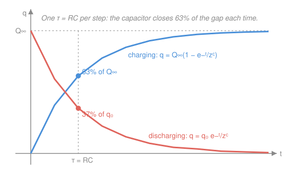

# Electromagnetism · Lesson 2.3: RC circuits and transients

> ⏱ ~15 min · Module 2: Capacitance and circuits · Builds on: [2.2 Current, resistance, and DC circuits](02-02-dc-circuits.md), [`ode-refresher` 1.2](../../ode-refresher/lessons/01-02-separable-and-linear-first-order.md) · Unlocks: Module 3 (magnetism and induction)

## Why this matters

Every circuit so far settled instantly — flip the switch, Ohm's law gives you the current, done. Add a capacitor and time enters the story: charge doesn't jump, it *fills*. This is the camera flash that takes a second to recharge, the debounce on a keyboard, the RC filter that smooths a signal, the pacemaker's timing. And the moment you write down the loop rule for a resistor and a capacitor, you get a **first-order linear ODE** — the exact equation you solved in [`ode-refresher` 1.2](../../ode-refresher/lessons/01-02-separable-and-linear-first-order.md). This lesson is where circuits and differential equations turn out to be the same subject.

## The idea

Picture charging a capacitor through a resistor from a battery. At the first instant the capacitor is empty, so it fights back with no voltage of its own — the full battery voltage lands across the resistor and current is at its maximum. As charge piles up, the capacitor develops its own voltage, which *opposes* the battery. The net push shrinks, so the current slows, so charge accumulates more slowly still. The capacitor eases up to its final charge, never quite arriving — the same **exponential approach to equilibrium** as coffee cooling to room temperature (`ode-refresher` 1.3's Newton cooling).

Discharging runs the movie backwards: a charged capacitor drives current through the resistor, and the more it drains the weaker its own voltage, so it empties ever more slowly. Both stories share one number — the **time constant** $\tau = RC$ — the natural timescale of the fill or the drain.

## The formal version

Let $q(t)$ be the charge on the capacitor (coulombs, C), $I = \dfrac{dq}{dt}$ the current (amperes, A), $R$ the resistance (ohms, $\Omega$), $C$ the capacitance (farads, F), and $\mathcal{E}$ the battery EMF (volts, V).

**Charging.** Kirchhoff's loop rule — battery voltage = resistor drop + capacitor drop — with $IR = R\,\dfrac{dq}{dt}$ and capacitor voltage $q/C$:

$$R\,\frac{dq}{dt} + \frac{q}{C} = \mathcal{E}.$$

In words: a first-order linear ODE, "leaky bucket with a source" — identical in form to the mixing tank of `ode-refresher` 1.2. Its solution (derived in P3) with $q(0)=0$ is

$$q(t) = C\mathcal{E}\left(1 - e^{-t/RC}\right), \qquad I(t) = \frac{dq}{dt} = \frac{\mathcal{E}}{R}\,e^{-t/RC}.$$

In words: charge climbs from $0$ toward the final value $Q_\infty = C\mathcal{E}$; the current starts at its maximum $\mathcal{E}/R$ (capacitor acts like a plain wire) and decays to $0$ (capacitor acts like an open gap).

**Discharging.** No battery — set $\mathcal{E}=0$:

$$R\,\frac{dq}{dt} + \frac{q}{C} = 0 \quad\Longrightarrow\quad q(t) = q_0\,e^{-t/RC},$$

pure exponential decay from the starting charge $q_0$. (This one is *separable*, the other method from `ode-refresher` 1.2.)

**The time constant** $\tau = RC$ has units of seconds: $\Omega \cdot \mathrm{F} = \frac{\mathrm{V}}{\mathrm{A}}\cdot\frac{\mathrm{C}}{\mathrm{V}} = \frac{\mathrm{C}}{\mathrm{A}} = \frac{\mathrm{C}}{\mathrm{C/s}} = \mathrm{s}$. In one $\tau$, charging reaches $1 - e^{-1} \approx 63\%$ of full; discharging falls to $e^{-1} \approx 37\%$ of start. After $5\tau$ the transient is under 1% — "settled" for practical purposes.

**Energy bookkeeping.** Charging fully, the battery does work $W_\text{bat} = \mathcal{E}\,Q_\infty = C\mathcal{E}^2$. The capacitor stores $U_C = \tfrac{1}{2}C\mathcal{E}^2$ (from [2.1](02-01-capacitance.md)). The missing half, $\tfrac{1}{2}C\mathcal{E}^2$, is dissipated as heat in $R$ — **exactly half, regardless of $R$**. You cannot charge a capacitor from a battery through a resistor at better than 50% efficiency.

## Picture

Each $\tau$-step closes 63% of the remaining gap: the curve is steep at first (large driving voltage) and flattens as the capacitor's own voltage catches up to the battery's.

## Worked examples

**Example 1 (mechanical — read the curve).** $R = 10\ \mathrm{k}\Omega$, $C = 100\ \mu\mathrm{F}$, $\mathcal{E} = 5\ \mathrm{V}$, charging from empty.

$$\tau = RC = (10{,}000)(100\times10^{-6}) = 1\ \mathrm{s}, \qquad Q_\infty = C\mathcal{E} = (100\times10^{-6})(5) = 500\ \mu\mathrm{C}.$$

After one second ($t = \tau$): $q = 500(1 - e^{-1}) = 500(0.632) = 316\ \mu\mathrm{C}$. Initial current: $I_0 = \mathcal{E}/R = 5/10{,}000 = 0.5\ \mathrm{mA}$. Everything falls out of the two boxed formulas.

**Example 2 (why you'd care — a flash timer).** A camera flash stores charge on a capacitor, then dumps it. Suppose $C = 1000\ \mu\mathrm{F}$ recharges through $R = 2\ \mathrm{k}\Omega$. The "ready" light waits for $q$ to reach 95% of full. Solve $1 - e^{-t/\tau} = 0.95$, i.e. $e^{-t/\tau} = 0.05$:

$$\frac{t}{\tau} = \ln 20 \approx 3.0, \qquad \tau = RC = (2000)(1000\times10^{-6}) = 2\ \mathrm{s} \;\Rightarrow\; t \approx 6\ \mathrm{s}.$$

That's the real-world lag between shots — set by $RC$, tunable by changing either component. Same math as a perpetuity's discount tail in [`calc-refresher` 2.3](../../calc-refresher/lessons/02-03-improper-integrals-and-models.md): exponential approach, one timescale.

## Watch out

- **You might think the current is continuous like the charge — it isn't.** At the instant of switching, $q$ is continuous (charge can't teleport) but $I$ *jumps*: from $0$ to $\mathcal{E}/R$ at charging's start. It's $q$, the integral, that must be smooth; its derivative may leap.
- **You might think a bigger battery charges faster — it doesn't.** The timescale $\tau = RC$ has no $\mathcal{E}$ in it. A larger $\mathcal{E}$ raises the *final* charge and the whole curve proportionally, but the *time to fill* is fixed by $R$ and $C$ alone.
- **You might reach for the loop rule with $IR$ and forget $I = dq/dt$.** The whole reason this becomes an ODE (not algebra) is that the resistor's drop is $R\,\dot q$ — a rate — while the capacitor's is $q/C$ — a level. Mixing a rate and a level in one equation *is* a differential equation.

## One-liner

> A resistor plus a capacitor is a first-order linear ODE in disguise; its charge fills or drains exponentially on the single timescale $\tau = RC$, closing 63% of the gap each step.

## Problems

**P1 (🟢)** A capacitor $C = 5\ \mu\mathrm{F}$ charges from empty through $R = 2\ \mathrm{k}\Omega$ driven by $\mathcal{E} = 12\ \mathrm{V}$. Find the time constant $\tau$, the final charge $Q_\infty$, and the charge at $t = \tau$ and $t = 2\tau$.

**P2 (🟡)** A capacitor is charged and then discharges through a resistor with $R = 1\ \mathrm{M}\Omega$, $C = 2\ \mu\mathrm{F}$. How long until the charge (equivalently the voltage, since $V = q/C$) falls to 10% of its initial value?

**P3 (🔴)** Derive the charging solution: solve $R\,\dot q + q/C = \mathcal{E}$ with $q(0)=0$ using the integrating factor from [`ode-refresher` 1.2](../../ode-refresher/lessons/01-02-separable-and-linear-first-order.md), then differentiate to get $I(t)$. Confirm the $t\to 0$ and $t\to\infty$ limits of both.

Solutions

**P1** Time constant and final charge:

$$\tau = RC = (2000)(5\times10^{-6}) = 0.01\ \mathrm{s} = 10\ \mathrm{ms}, \qquad Q_\infty = C\mathcal{E} = (5\times10^{-6})(12) = 60\ \mu\mathrm{C}.$$

Then $q(t) = Q_\infty(1 - e^{-t/\tau})$:

$$q(\tau) = 60(1 - e^{-1}) = 60(0.632) = 37.9\ \mu\mathrm{C}, \qquad q(2\tau) = 60(1 - e^{-2}) = 60(0.865) = 51.9\ \mu\mathrm{C}.$$

*Check:* $q(\tau)$ is 63% of $60\ \mu\mathrm{C}$ ✓; each further $\tau$ closes 63% of what's left, and $37.9 + 0.632(60 - 37.9) = 37.9 + 14.0 = 51.9\ \mu\mathrm{C}$ ✓.

**P2** Discharging: $q(t) = q_0\,e^{-t/RC}$. Set the ratio to 0.1:

$$e^{-t/RC} = 0.1 \;\Longrightarrow\; \frac{t}{RC} = \ln 10 = 2.303 \;\Longrightarrow\; t = 2.303\,RC.$$

With $\tau = RC = (10^6)(2\times10^{-6}) = 2\ \mathrm{s}$:

$$t = 2.303 \times 2 = 4.6\ \mathrm{s}.$$

*Check:* $2.3\tau$ is a bit more than $2\tau$ (which leaves $e^{-2}=13.5\%$) and less than $3\tau$ (leaves $5\%$) — 10% sits between, as it should ✓.

**P3** Put the ODE in standard form (divide by $R$): $\;\dot q + \dfrac{1}{RC}\,q = \dfrac{\mathcal{E}}{R}$. So $p = \dfrac{1}{RC}$, and the integrating factor is

$$\mu = e^{\int p\,dt} = e^{t/RC}.$$

Multiply through; the left side collapses to $(\mu q)'$ by construction:

$$\big(e^{t/RC}\,q\big)' = \frac{\mathcal{E}}{R}\,e^{t/RC} \;\Longrightarrow\; e^{t/RC}\,q = \frac{\mathcal{E}}{R}\cdot RC\,e^{t/RC} + K = C\mathcal{E}\,e^{t/RC} + K.$$

Divide by $\mu$: $\;q = C\mathcal{E} + K e^{-t/RC}$. Apply $q(0)=0$: $\;0 = C\mathcal{E} + K \Rightarrow K = -C\mathcal{E}$, giving

$$\boxed{q(t) = C\mathcal{E}\left(1 - e^{-t/RC}\right)}, \qquad I(t) = \frac{dq}{dt} = C\mathcal{E}\cdot\frac{1}{RC}\,e^{-t/RC} = \boxed{\frac{\mathcal{E}}{R}\,e^{-t/RC}}.$$

*Limits:* as $t\to 0$, $q\to 0$ (empty, as posed) and $I\to \mathcal{E}/R$ (max — capacitor is a bare wire); as $t\to\infty$, $q\to C\mathcal{E}$ (full) and $I\to 0$ (open gap, no current). *Check:* substitute back — $R\dot q + q/C = R\cdot\frac{\mathcal{E}}{R}e^{-t/RC} + \frac{C\mathcal{E}}{C}(1 - e^{-t/RC}) = \mathcal{E}e^{-t/RC} + \mathcal{E} - \mathcal{E}e^{-t/RC} = \mathcal{E}$ ✓.

## Flashback

**From Lesson 2.2 (Current, resistance, and DC circuits):** A $6\ \mathrm{V}$ battery drives two resistors in series, $R_1 = 4\ \Omega$ and $R_2 = 8\ \Omega$. Find the current, the voltage drop across each resistor, and the power dissipated in each. Verify the powers sum to the battery's output.

Solution

Series resistances add: $R = R_1 + R_2 = 12\ \Omega$. Ohm's law gives the (single, shared) current:

$$I = \frac{\mathcal{E}}{R} = \frac{6}{12} = 0.5\ \mathrm{A}.$$

Voltage drops (Ohm's law on each): $V_1 = IR_1 = 0.5(4) = 2\ \mathrm{V}$, $V_2 = IR_2 = 0.5(8) = 4\ \mathrm{V}$. They sum to $6\ \mathrm{V}$ — Kirchhoff's loop rule ✓. Powers ($P = I^2 R$):

$$P_1 = (0.5)^2(4) = 1\ \mathrm{W}, \qquad P_2 = (0.5)^2(8) = 2\ \mathrm{W}.$$

*Check:* total dissipated $= 3\ \mathrm{W}$, and the battery delivers $\mathcal{E}I = 6(0.5) = 3\ \mathrm{W}$ ✓ — energy conserved.

## Connections

- **Backward:** the loop rule is [2.2](02-02-dc-circuits.md)'s Kirchhoff rule with a capacitor term $q/C$ from [2.1](02-01-capacitance.md); the solution method is [`ode-refresher` 1.2](../../ode-refresher/lessons/01-02-separable-and-linear-first-order.md)'s integrating factor (charging) and separation (discharging), applied verbatim.
- **Forward:** in Module 3, adding an inductor gives $L\ddot q + R\dot q + q/C = \mathcal{E}$ — a *second*-order ODE (`ode-refresher` 2.2's damped oscillator), where the exponential transient can become a ringing one.
- **Sideways (ODEs/econ):** the "steady state + dying transient" split here — $q = C\mathcal{E}$ plus $-C\mathcal{E}\,e^{-t/RC}$ — is the same structure as the mixing tank in `ode-refresher` 1.2 and the discounted-capital path in econ; $e^{-t/RC}$ is the RC-circuit twin of the discount kernel $e^{-rt}$ from [`calc-refresher` 2.3](../../calc-refresher/lessons/02-03-improper-integrals-and-models.md).
