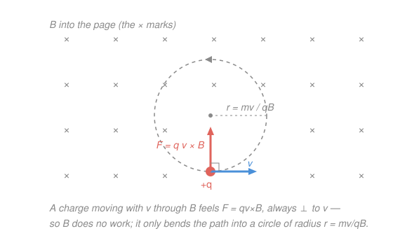

# Electromagnetism · Lesson 3.1: Magnetic force and the motion of charges

> ⏱ ~15 min · Module 3: Magnetism and induction · Builds on: [1.1 Charge, Coulomb's law, and the electric field](01-01-coulomb-electric-field.md), [`mechanics-refresher` 1.3](../../mechanics-refresher/lessons/01-03-applying-newtons-laws.md) · Unlocks: 3.2 (sources of magnetic field)

## Why this matters

The electric force pushes a charge straight along the field — it can speed it up, and it does work. The magnetic force does neither. It always shoves *sideways*, perpendicular to the motion, so it can only **steer**, never accelerate the speed. That one geometric fact is the whole story of magnetism's mechanics: it's why charged particles spiral around field lines instead of flying along them, why a mass spectrometer sorts ions by mass, why a cyclotron works, and why a wire carrying current jumps in a magnet — the principle behind every electric motor. This lesson is the bridge from [1.3's centripetal force](../../mechanics-refresher/lessons/01-03-applying-newtons-laws.md): magnetism is a machine that *supplies* $mv^2/r$.

## The idea

Drop a charge into a magnetic field and give it a push. The field grabs it — but pulls in a direction *at right angles to both* the velocity and the field itself. That perpendicularity is everything.

Because the force is perpendicular to the velocity, it can never have a component along the motion. A force along the motion is what changes speed (and does work); a force across the motion only bends the path. So a magnetic field is a pure **steering wheel**: the particle's speed is frozen, and all the force does is curve its direction. A constant sideways force of fixed size, forever turning the velocity — that's the exact recipe for uniform circular motion. The charge orbits.

If the velocity is purely across the field, you get a clean circle. If part of the velocity points *along* the field (which feels no force at all — parallel motion is invisible to the field), that part just coasts straight while the perpendicular part circles: the two combine into a **helix**, a corkscrew winding along the field line.

## The formal version

Let $q$ = charge (coulombs, C), $\mathbf v$ = velocity (m/s), $\mathbf B$ = **magnetic field** measured in **tesla** (T), $\mathbf E$ = electric field (V/m), $m$ = mass (kg), and force in newtons (N). Recall $e = 1.6\times10^{-19}$ C.

**The Lorentz force.** A charge in electric and magnetic fields feels

$$\mathbf F = q\big(\mathbf E + \mathbf v\times\mathbf B\big).$$

*In words: the electric part $q\mathbf E$ pushes along the field; the magnetic part $q\,\mathbf v\times\mathbf B$ pushes perpendicular to both $\mathbf v$ and $\mathbf B$.* With no electric field the magnetic piece stands alone:

$$\mathbf F = q\,\mathbf v\times\mathbf B, \qquad |\mathbf F| = qvB\sin\theta,$$

where $\theta$ is the angle between $\mathbf v$ and $\mathbf B$. The **direction** comes from the right-hand rule for $\mathbf v\times\mathbf B$: point your fingers along $\mathbf v$, curl them toward $\mathbf B$, and your thumb gives $\mathbf v\times\mathbf B$ — then flip it if $q$ is negative. One unit-check falls out: $\;1\ \mathrm{T} = 1\ \dfrac{\mathrm{N}}{\mathrm{C}\cdot(\mathrm{m/s})} = 1\ \dfrac{\mathrm{N}}{\mathrm{A}\cdot\mathrm{m}}.$

**It does no work.** Since $\mathbf F\perp\mathbf v$ always, $\mathbf F\cdot\mathbf v = 0$, so the magnetic force delivers **zero power**. *In words: it changes direction, never speed — kinetic energy is untouched.*

**Circular motion.** For $\mathbf v\perp\mathbf B$, the force $qvB$ points at the center, playing the role of $mv^2/r$ from [mechanics 1.3](../../mechanics-refresher/lessons/01-03-applying-newtons-laws.md):

$$qvB = \frac{mv^2}{r} \;\Rightarrow\; r = \frac{mv}{qB}, \qquad \omega = \frac{v}{r} = \frac{qB}{m}, \qquad T = \frac{2\pi m}{qB}.$$

*In words: faster particles orbit on bigger circles, but the **cyclotron frequency** $\omega$ and period $T$ depend only on $q$, $B$, $m$ — not on the speed.* Add a velocity component along $\mathbf B$ and the circle stretches into a helix.

**Force on a current.** A wire of length $\mathbf L$ (direction = current flow) carrying current $I$ (amperes) in a field feels

$$\mathbf F = I\,\mathbf L\times\mathbf B, \qquad |\mathbf F| = BIL\sin\theta.$$

*In words: it's the Lorentz force summed over all the moving charges in the wire — this is what turns a motor.*

**Velocity selector.** Cross an $\mathbf E$ and a $\mathbf B$ field so their forces on a charge oppose. A charge passes **undeflected** when they cancel:

$$qE = qvB \;\Rightarrow\; v = \frac{E}{B}.$$

*In words: only charges at exactly this speed sail straight through — independent of their charge or mass — so the crossed fields filter a beam by velocity.*

## Picture

The force is always perpendicular to $\mathbf v$ (note the right-angle marker) and always aimed at the center: a constant-size sideways shove that turns the velocity around a full circle of radius $r = mv/qB$.

## Worked examples

**Example 1 (mechanical — magnitude, direction, and the electron's sign flip).** An electron moves to the right at $v = 1.0\times10^{7}$ m/s through a field $B = 0.50$ T pointing **out of the page**. Find the magnetic force.

Magnitude ($\mathbf v\perp\mathbf B$, so $\sin\theta = 1$):

$$|\mathbf F| = qvB = (1.6\times10^{-19})(1.0\times10^{7})(0.50) = 8.0\times10^{-13}\ \mathrm{N}.$$

Direction: fingers point right (along $\mathbf v$), curl out of the page (toward $\mathbf B$); the thumb ($\mathbf v\times\mathbf B$) points **down**. But the electron's charge is *negative*, so the force flips to point **up**. *Check:* the force is perpendicular to the rightward velocity — it can't change the electron's speed, only bend it. Units are newtons. ✓

**Example 2 (application — the cyclotron's secret).** A proton ($m = 1.67\times10^{-27}$ kg) circles in $B = 0.30$ T. Its orbit radius grows with speed, $r = mv/qB$ — but how long does one loop take?

$$T = \frac{2\pi m}{qB} = \frac{2\pi(1.67\times10^{-27})}{(1.6\times10^{-19})(0.30)} = 2.19\times10^{-7}\ \mathrm{s}.$$

Notice $v$ never appeared: a slow proton on a tiny circle and a fast one on a huge circle complete a lap in **exactly the same time**. That's why a cyclotron can push a proton with an electric kick that alternates at one fixed frequency $\omega = qB/m$ — the timing stays locked as the particle speeds up and spirals outward. *Check:* $T$ has units $\frac{\mathrm{kg}}{\mathrm{C}\cdot\mathrm{T}} = \frac{\mathrm{kg}}{\mathrm{C}}\cdot\frac{\mathrm{C}\cdot\mathrm{s}}{\mathrm{kg}} = \mathrm{s}$. ✓

## Watch out

- You might think the magnetic force speeds a charge up. It never can — $\mathbf F\perp\mathbf v$ means zero work, so $|\mathbf v|$ is constant. To *add* energy you need an electric field (that's the electric kick in a cyclotron; the magnetic field only steers).
- You might think a charge moving *along* $\mathbf B$ still feels a force. It doesn't: $\mathbf v\times\mathbf B = \mathbf 0$ when $\mathbf v\parallel\mathbf B$ (the $\sin\theta$ vanishes). Only the perpendicular part of the velocity gets bent — which is why a tilted velocity gives a helix, not a circle.
- You might forget to flip the direction for a negative charge. The right-hand rule gives $\mathbf v\times\mathbf B$; the *force* is $q$ times that, so electrons curve opposite to protons in the same field. Same field, same speed — mirror-image orbits.

## One-liner

> The magnetic force $q\mathbf v\times\mathbf B$ is a pure steering wheel — perpendicular to the motion, it does no work and bends a charge into a circle of radius $r = mv/qB$ whose period $2\pi m/qB$ doesn't care how fast the charge is going.

## Problems

**P1 (🟢)** A proton moves to the right (east) at $v = 3.0\times10^{6}$ m/s through a uniform field $B = 0.40$ T pointing **into the page**. Find the magnitude and direction of the magnetic force on it.

**P2 (🟡)** A proton ($m = 1.67\times10^{-27}$ kg) travels at $v = 5.0\times10^{6}$ m/s perpendicular to a field $B = 0.30$ T. Find the radius of its circular orbit and its period. Then state what happens to each if the speed is doubled.

**P3 (🔴, optional)** A velocity selector uses an electric field $E = 1.2\times10^{4}$ V/m crossed with a magnetic field $B = 0.020$ T. Find the speed at which a charge passes straight through, undeflected. Does the answer depend on the charge or mass of the particle?

Solutions

**P1** The velocity is perpendicular to $\mathbf B$, so $\sin\theta = 1$:

$$|\mathbf F| = qvB = (1.6\times10^{-19})(3.0\times10^{6})(0.40) = 1.9\times10^{-13}\ \mathrm{N}.$$

Direction: fingers point right (along $\mathbf v$), curl into the page (toward $\mathbf B$); the thumb points **up** (toward the top of the page, north). The proton is positive, so the force is up — no flip.

*Check:* the force is perpendicular to the eastward velocity, so it does no work and only starts to curve the proton northward; magnitude is in newtons. ✓

**P2** Radius from $r = mv/qB$:

$$r = \frac{(1.67\times10^{-27})(5.0\times10^{6})}{(1.6\times10^{-19})(0.30)} = \frac{8.35\times10^{-21}}{4.8\times10^{-20}} = 0.17\ \mathrm{m}.$$

Period from $T = 2\pi m/qB$ (speed-free):

$$T = \frac{2\pi(1.67\times10^{-27})}{(1.6\times10^{-19})(0.30)} = 2.19\times10^{-7}\ \mathrm{s}.$$

Double the speed: $r \propto v$ **doubles** (to $0.35$ m), but $T$ has no $v$ in it, so the period is **unchanged**. The faster proton just runs a bigger loop in the same time.

*Check:* $r$ is in metres $\big(\tfrac{\mathrm{kg}\cdot\mathrm{m/s}}{\mathrm{C}\cdot\mathrm{T}} = \mathrm{m}\big)$ and the speed-independence of $T$ is exactly the cyclotron fact from Example 2. ✓

**P3** Undeflected means the electric and magnetic forces cancel: $qE = qvB$. The charge $q$ divides out:

$$v = \frac{E}{B} = \frac{1.2\times10^{4}}{0.020} = 6.0\times10^{5}\ \mathrm{m/s}.$$

It does **not** depend on $q$ or $m$ — both forces scale with $q$, so it cancels, and neither force involves mass. Every particle at this one speed passes straight through; slower or faster ones get deflected.

*Check:* units $\dfrac{\mathrm{V/m}}{\mathrm{T}} = \dfrac{\mathrm{N/C}}{\mathrm{N\cdot s/(C\cdot m)}} = \mathrm{m/s}$, a speed. ✓

## Flashback

**From Lesson 1.1 (Charge, Coulomb's law, and the electric field):** Two point charges, $q_1 = +2.0\ \mu\mathrm{C}$ and $q_2 = -3.0\ \mu\mathrm{C}$, sit $r = 0.10$ m apart. Find the magnitude and direction (attractive or repulsive) of the electric force between them. (Use $k = 8.99\times10^{9}\ \mathrm{N\cdot m^2/C^2}$.)

Solution

Coulomb's law, magnitudes only:

$$|\mathbf F| = k\frac{|q_1||q_2|}{r^2} = (8.99\times10^{9})\frac{(2.0\times10^{-6})(3.0\times10^{-6})}{(0.10)^2} = (8.99\times10^{9})\frac{6.0\times10^{-12}}{0.010} = 5.4\ \mathrm{N}.$$

The charges have opposite signs, so the force is **attractive** — each is pulled toward the other, along the line joining them.

*Check:* units $\mathrm{(N\cdot m^2/C^2)\cdot C^2/m^2 = N}$ ✓. Note the contrast with this lesson: the electric force acts *along* the line of separation and does work as the charges move, whereas the magnetic force acts *perpendicular* to the velocity and does none. ✓

## Connections

- **Backward:** the circular orbit is [mechanics 1.3](../../mechanics-refresher/lessons/01-03-applying-newtons-laws.md)'s uniform circular motion with the magnetic force cast as the centripetal supplier — $qvB = mv^2/r$ is that lesson's $\sum F_{\text{toward center}} = mv^2/r$ with a specific force filled in. The Lorentz force also completes [1.1](01-01-coulomb-electric-field.md): the full force on a charge is electric **plus** magnetic.
- **Forward:** [3.2 Sources of magnetic field](03-02-sources-of-magnetic-field.md) asks the reverse question — what *makes* $\mathbf B$ (Biot–Savart and Ampère) — and [3.3 Electromagnetic induction](03-03-electromagnetic-induction.md) uses the current-wire force to build the sliding-rod motional EMF of Boss problem 3.
- **Sideways:** "$\mathbf B$ does no work" reappears in `analytical-mechanics` — magnetic forces are the textbook example of velocity-dependent forces that need a vector potential in the Lagrangian rather than a plain potential energy, since no scalar $U$ can produce a force perpendicular to $\mathbf v$.
