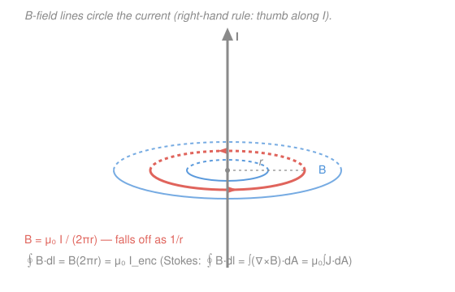

# Electromagnetism · Lesson 3.2: Sources of magnetic field

> ⏱ ~15 min · Module 3: Magnetism and induction · Builds on: [3.1 Magnetic force and the motion of charges](03-01-magnetic-force.md), [`calc-refresher` 5.3](../../calc-refresher/lessons/05-03-green-stokes-divergence.md) · Unlocks: 3.3 (electromagnetic induction)

## Why this matters

Lesson 3.1 told you what a magnetic field *does* to a moving charge. It never said where the field comes from. Here's the answer, and it's the whole secret of magnetism: **a magnetic field is made by moving charge** — a current. There are no magnetic "charges" to sit still and source a field the way electric charge does; every magnet, from a compass needle to an MRI, is ultimately circulating current. Getting the field of a current is the magnetic twin of getting the field of an electric charge, and it comes with the same labor-saving trick: when there's symmetry, one loop integral replaces a nasty sum.

## The idea

Electricity had two ways to find $\mathbf E$: brute-force superposition (Coulomb, add up every charge) and the symmetry shortcut (Gauss's law, count enclosed charge). Magnetism has the exact same pair.

The brute-force tool is the **Biot–Savart law**: chop the current into tiny pieces, each piece throws off a little field, add them all up. It's Coulomb's law wearing a magnetic uniform — and just as fiddly.

The shortcut is **Ampère's law**, and it's the star of this lesson. It says: walk a closed loop around some wires, add up the magnetic field along your path, and the total is just $\mu_0$ times the current punching through your loop. You don't care how the current is arranged inside — only *how much* threads the loop. That's precisely how Gauss's law ignored the shape of a charge and counted only the total enclosed. Symmetry does the rest: pick a loop where $\mathbf B$ is constant and parallel to your path, and the integral collapses to $B \times (\text{length})$, which you solve for $B$ in one line.

And there's a deep reason the two magnetic tools agree, the same reason Gauss's law worked: **Ampère's law is Stokes' theorem** ([calc 5.3](../../calc-refresher/lessons/05-03-green-stokes-divergence.md)) applied to the field. Hold that thought — it's the payoff below.

## The formal version

Throughout: $\mathbf B$ is the magnetic field (units: tesla, T); $I$ is current (amperes, A); $r$ is distance (meters, m); $\hat{\mathbf r}$ is the unit vector from the source to the field point; and the constant of magnetism is

$$\mu_0 = 4\pi \times 10^{-7}\ \mathrm{T\,m/A} \quad(\text{the permeability of free space}).$$

**Biot–Savart law (magnetism's Coulomb).** A current element — a short length $d\mathbf l$ of wire (pointing along the current) carrying current $I$ — contributes a field

$$d\mathbf B = \frac{\mu_0}{4\pi}\,\frac{I\,d\mathbf l \times \hat{\mathbf r}}{r^2}.$$

In words: each little chunk of current makes a field that dies as $1/r^2$ (just like Coulomb) but points *sideways* — the cross product $d\mathbf l \times \hat{\mathbf r}$ wraps the field around the current instead of pointing away from it. Add up (integrate) all the chunks to get the total $\mathbf B$.

**Field of a long straight wire.** Do that integral for an infinite straight wire and everything collapses to

$$B = \frac{\mu_0 I}{2\pi r}.$$

In words: the field circles the wire in closed loops, its strength falling off as $1/r$, and its direction is set by the **right-hand rule** — thumb along the current $I$, fingers curl the way $\mathbf B$ points. (Note $1/r$, not $1/r^2$: a whole infinite line of current, not a point.)

**Ampère's law (magnetism's Gauss's law).** For *any* closed loop,

$$\oint \mathbf B \cdot d\mathbf l = \mu_0\, I_{\text{enc}},$$

where $I_{\text{enc}}$ is the total current threading the loop. In words: the circulation of $\mathbf B$ around a closed path equals $\mu_0$ times the current passing through it — the arrangement inside doesn't matter, only the net current does.

**Why it's Stokes' theorem.** The differential law is $\nabla \times \mathbf B = \mu_0 \mathbf J$ ($\mathbf J$ = current density, A/m²). Feed that into Stokes ([calc 5.3](../../calc-refresher/lessons/05-03-green-stokes-divergence.md)), which turns a curl over a surface into a circulation around its rim:

$$\oint_C \mathbf B \cdot d\mathbf l = \iint_S (\nabla \times \mathbf B)\cdot d\mathbf A = \mu_0 \iint_S \mathbf J \cdot d\mathbf A = \mu_0\, I_{\text{enc}}.$$

The loop integral *is* the curl integral; "current through the surface" is just $\iint \mathbf J \cdot d\mathbf A$. Ampère's law and Stokes' theorem are the same equation.

**No magnetic monopoles.** The magnetic counterpart of Gauss's law reads

$$\oint \mathbf B \cdot d\mathbf A = 0.$$

In words: the net magnetic flux out of *any* closed surface is zero — there is no magnetic charge for field lines to start or stop on, so they always close into loops. (Contrast $\oint \mathbf E \cdot d\mathbf A = Q_{\text{enc}}/\varepsilon_0$: electric lines can end on charge; magnetic lines never end.)

## Picture

The field lines are closed circles (no monopoles — they have nowhere to begin or end). Take one as your **Amperian loop**: by symmetry $\mathbf B$ has the same magnitude everywhere on it and points along it, so $\oint \mathbf B \cdot d\mathbf l = B \,(2\pi r) = \mu_0 I$, giving $B = \mu_0 I / 2\pi r$ in a single line — the Biot–Savart integral, done for free by symmetry.

## Worked examples

**Example 1 (mechanical — the wire field).** A long straight wire carries $I = 10\ \text{A}$. Find $B$ at $r = 5\ \text{cm} = 0.05\ \text{m}$.

$$B = \frac{\mu_0 I}{2\pi r} = \frac{(4\pi \times 10^{-7})(10)}{2\pi (0.05)} = \frac{4\pi \times 10^{-6}}{0.1\pi} = 4 \times 10^{-5}\ \text{T} = 40\ \mu\text{T}.$$

For scale, Earth's field is about $50\ \mu\text{T}$ — a household current at 5 cm already rivals it. The $\pi$'s cancel, which is exactly why the $2\pi$ was built into the constant.

**Example 2 (why you'd care — the solenoid makes a uniform field).** Wind $n$ turns of wire per meter into a long coil (a *solenoid*) carrying current $I$. Outside, the fields of neighboring turns cancel; inside, they reinforce into a uniform field parallel to the axis. Ampère's law nails it instantly. Take a rectangular loop with one side of length $\ell$ *inside* the coil (along the axis) and the opposite side outside (where $B \approx 0$); the two short sides run perpendicular to $\mathbf B$ and contribute nothing. So $\oint \mathbf B \cdot d\mathbf l = B\ell$. The current threading the loop is $n\ell$ turns each carrying $I$, i.e. $I_{\text{enc}} = n\ell I$. Thus

$$B\ell = \mu_0 (n\ell)I \implies \boxed{B = \mu_0 n I}\quad(\text{uniform, inside}).$$

A straight wire gives a $1/r$ field that weakens with distance; a solenoid gives a *constant* field you can dial with $n$ and $I$ — which is why every electromagnet, from a doorbell to an MRI bore, is a solenoid.

## Watch out

- **You might think a current element's field points away from the wire, like Coulomb's.** It doesn't — the cross product $d\mathbf l \times \hat{\mathbf r}$ makes $\mathbf B$ point *perpendicular* to both, wrapping *around* the current. Magnetism is sideways.
- **You might think Ampère's law gives $B$ for any current.** The equation $\oint \mathbf B \cdot d\mathbf l = \mu_0 I_{\text{enc}}$ is *always* true, but it only *solves* for $B$ when symmetry lets you pull $B$ out of the integral (wire, solenoid, toroid). No symmetry → the law still holds but you're back to Biot–Savart. Same deal as Gauss's law needing a symmetric charge.
- **You might expect a magnetic "charge" at the center of the loops.** There isn't one — $\oint \mathbf B \cdot d\mathbf A = 0$ always. The wire is a *current*, not a magnetic charge; the field lines close on themselves rather than springing from a source point.

## One-liner

> Moving charge is the only source of magnetism; Ampère's law is Gauss's law for currents — Stokes' theorem in disguise — turning a symmetric loop integral into "count the enclosed current."

## Problems

**P1 (🟢)** A long straight wire carries $I = 20\ \text{A}$. What is the magnitude of $\mathbf B$ at a distance $r = 10\ \text{cm}$ from it, and which way does it point if the current flows north and you stand due east of the wire?

**P2 (🟡)** Two long parallel wires sit $d = 5\ \text{cm}$ apart, each carrying $I = 10\ \text{A}$ in the *same* direction. Find the force per unit length between them and say whether they attract or repel. (Combine the wire field $B = \mu_0 I/2\pi r$ with the force-on-a-current law $\mathbf F = I\mathbf L \times \mathbf B$ from [3.1](03-01-magnetic-force.md).)

**P3 (🔴)** A solenoid has $n = 1000$ turns per meter and carries $I = 2\ \text{A}$. Find $B$ inside, deriving it from Ampère's law rather than quoting the formula — and name the theorem from [calc 5.3](../../calc-refresher/lessons/05-03-green-stokes-divergence.md) that makes the loop-integral step legitimate.

Solutions

**P1** Straight-wire field:

$$B = \frac{\mu_0 I}{2\pi r} = \frac{(4\pi \times 10^{-7})(20)}{2\pi(0.10)} = \frac{8\pi \times 10^{-6}}{0.2\pi} = 4 \times 10^{-5}\ \text{T} = 40\ \mu\text{T}.$$

Direction: point your right thumb north (along $I$); your fingers curl *up* out of the ground on the east side. So standing east of the wire, $\mathbf B$ points straight up (out of the ground). **Check:** units $\frac{(\text{T m/A})(\text{A})}{\text{m}} = \text{T}$ ✓; the field circles the wire and falls as $1/r$, so doubling $r$ from Example 1's setup would halve $B$ — consistent. ✓

**P2** Wire 1 produces at wire 2 (distance $d$) a field $B_1 = \dfrac{\mu_0 I}{2\pi d}$. The force on a length $L$ of wire 2 (current $I$) is $F = I L B_1$ (the current is perpendicular to $B_1$, so $|\mathbf L \times \mathbf B| = LB_1$). Force per unit length:

$$\frac{F}{L} = \frac{\mu_0 I^2}{2\pi d} = \frac{(4\pi \times 10^{-7})(10)^2}{2\pi (0.05)} = \frac{4\pi \times 10^{-5}}{0.1\pi} = 4 \times 10^{-4}\ \text{N/m}.$$

Direction (right-hand rules, twice): wire 1's field at wire 2 points *into* the region between them on that side; $I\mathbf L \times \mathbf B$ then points *toward* wire 1. So parallel currents in the **same direction attract**. **Check:** units $\frac{(\text{T m/A})(\text{A}^2)}{\text{m}} = \text{T A} = \text{N/m}$ ✓ (since $1\,\text{T} = 1\,\text{N/(A m)}$). This mutual force is literally how the ampere was historically defined. ✓

**P3** Draw a rectangular Amperian loop: one long side of length $\ell$ runs *along the axis inside* the coil, the parallel side lies outside where $B \approx 0$, and the two ends run perpendicular to $\mathbf B$ (zero contribution). Then $\oint \mathbf B \cdot d\mathbf l = B\ell$. The loop is threaded by $n\ell$ turns, each carrying $I$, so $I_{\text{enc}} = n\ell I$. Ampère's law:

$$B\ell = \mu_0\, n\ell I \implies B = \mu_0 n I = (4\pi \times 10^{-7})(1000)(2) = 2.5 \times 10^{-3}\ \text{T} \approx 2.5\ \text{mT}.$$

The step that replaces $\oint \mathbf B \cdot d\mathbf l$ by "$\mu_0 \times$ current through the loop" is **Stokes' theorem** ([calc 5.3](../../calc-refresher/lessons/05-03-green-stokes-divergence.md)): $\oint_C \mathbf B \cdot d\mathbf l = \iint_S (\nabla \times \mathbf B)\cdot d\mathbf A = \mu_0 \iint_S \mathbf J \cdot d\mathbf A = \mu_0 I_{\text{enc}}$. **Check:** units $\text{(T m/A)}\,(\text{m}^{-1})\,(\text{A}) = \text{T}$ ✓; unlike the wire's $1/r$ field, this answer has no $r$ in it — the field is uniform inside, exactly as claimed. ✓

## Flashback

**From Lesson 3.1 (Magnetic force and the motion of charges):** A proton ($q = 1.6 \times 10^{-19}\ \text{C}$, $m = 1.67 \times 10^{-27}\ \text{kg}$) enters a uniform field $B = 0.5\ \text{T}$ moving at $v = 1.0 \times 10^{6}\ \text{m/s}$ *perpendicular* to $\mathbf B$. Find the radius of its circular path.

Solution

The magnetic force supplies the centripetal force: $qvB = \dfrac{mv^2}{r}$, so

$$r = \frac{mv}{qB} = \frac{(1.67 \times 10^{-27})(1.0 \times 10^{6})}{(1.6 \times 10^{-19})(0.5)} = \frac{1.67 \times 10^{-21}}{8.0 \times 10^{-20}} \approx 2.1 \times 10^{-2}\ \text{m} \approx 2.1\ \text{cm}.$$

**Check:** units $\frac{(\text{kg})(\text{m/s})}{(\text{C})(\text{T})} = \frac{\text{kg m/s}}{\text{C}\cdot\text{kg/(C s)}} = \text{m}$ ✓ (using $1\,\text{T} = 1\,\text{kg/(C\,s)}$). And note the period $T = 2\pi m/(qB)$ drops $v$ entirely — faster protons trace bigger circles in the same time, the cyclotron fact from 3.1. ✓

## Connections

- **Backward:** this is the source side of [3.1](03-01-magnetic-force.md) — 3.1 gave the force $\mathbf F = q\mathbf v \times \mathbf B$ on a charge in a field; here we finally learn where $\mathbf B$ comes from. P2 uses *both* halves at once (one wire sources the field, the other feels the force).
- **Forward:** [3.3](03-03-electromagnetic-induction.md) flips the causation — a *changing* magnetic flux drives a current (Faraday's law), the Stokes-theorem partner of the Ampère's law you just met. Together they close the loop between electricity and magnetism.
- **Sideways (vector calculus):** Ampère's law *is* Stokes' theorem from [calc 5.3](../../calc-refresher/lessons/05-03-green-stokes-divergence.md), exactly as Gauss's law *is* the divergence theorem. The four Maxwell equations of Module 4 are nothing but these two calc-5.3 theorems applied to $\mathbf E$ and $\mathbf B$ — you already own the mathematics; E&M is just choosing the fields.
