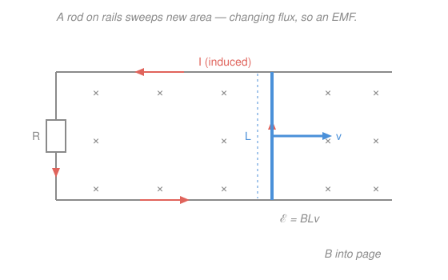

# Electromagnetism · Lesson 3.3: Electromagnetic induction

> ⏱ ~15 min · Module 3: Magnetism and induction · Builds on: [3.2 Sources of magnetic field](03-02-sources-of-magnetic-field.md), [3.1 Magnetic force and the motion of charges](03-01-magnetic-force.md) · Unlocks: Module 4 (Maxwell's equations and light)

## Why this matters

Every wall socket in your home is fed by this one lesson. So far magnetism has been a one-way street — currents *make* fields (3.2), fields *push* charges (3.1). Faraday's discovery closes the loop: a *changing* magnetic field makes an electric field that drives a current, with no battery in sight. That's the generator, the transformer, the induction cooktop, the credit-card reader. It's also the first crack of daylight showing that electricity and magnetism aren't two subjects but one — the seam that Maxwell will weld shut in Module 4.

## The idea

Picture the magnetic field as a bundle of arrows piercing a loop of wire. **Magnetic flux** is just a count of how many arrows thread the loop — more field, or more area, or a more face-on angle, means more flux. Faraday's law says something almost too simple: **the loop only cares about *change*.** Hold the flux steady and nothing happens. Make the flux change — ramp the field, grow the loop, twist it — and the loop fights back by driving a current around itself. The faster you change the flux, the harder it pushes.

Which way does the current go? Here's the part worth tattooing on your arm: **the induced current always opposes the change that created it.** Increase the flux through the loop and the loop makes a current whose *own* field points the other way, trying to cancel your increase; decrease it and the current tries to prop the flux back up. This is Lenz's law, and it's not a rule of thumb — it's energy conservation in disguise. If the induced current *helped* the change, you'd get a runaway feedback loop spitting out free energy. Nature says no: you only get electrical energy out if you do mechanical work in.

## The formal version

**Magnetic flux.** For a field $\mathbf B$ through a surface,

$$\Phi_B = \int \mathbf B \cdot d\mathbf A,$$

where $d\mathbf A$ is an area element pointing along the surface normal. Units: tesla·meter² = **webers** (Wb), so $1\ \mathrm{Wb} = 1\ \mathrm{T\,m^2}$. *In words:* the field's strength times the area it passes through, weighted by angle — for a flat loop of area $A$ in a uniform field, $\Phi_B = BA\cos\theta$, with $\theta$ the tilt between $\mathbf B$ and the loop's normal.

**Faraday's law.** The induced EMF around the loop is

$$\mathcal{E} = -\frac{d\Phi_B}{dt}.$$

Units: Wb/s = **volts** (V), since $1\ \mathrm{Wb/s} = 1\ \mathrm{V}$. *In words:* the "push" driving current around the loop equals how fast the flux is changing. $\mathcal{E}$ (EMF, "electromotive force") is measured in volts but is not a force — it's the work per unit charge the loop does on the current, exactly the role a battery plays. For a coil of $N$ identical turns each threaded by $\Phi_B$, the pushes add: $\mathcal{E} = -N\,\dfrac{d\Phi_B}{dt}$.

**Lenz's law** is the minus sign. *In words:* the induced current flows in the direction whose own magnetic field opposes the change in $\Phi_B$. It guarantees the induced effect drains energy from whatever is forcing the change — never the reverse.

**Three ways to change the flux**, from $\Phi_B = BA\cos\theta$: change $B$ (transformers), change the area $A$ (the sliding rod below), or change the orientation $\theta$ (generators). A **motional EMF** is the area case: a rod of length $L$ moving at speed $v$ perpendicular to $\mathbf B$ sweeps area at rate $Lv$, giving $\Phi_B = BLx$ and

$$\mathcal{E} = BLv.$$

**Self-inductance.** A coil's own current makes its own flux; changing that current changes that flux, so the coil pushes back on itself with a **back-EMF**

$$\mathcal{E} = -L\,\frac{dI}{dt},$$

where the inductance $L$ (units: **henry**, $1\ \mathrm H = 1\ \mathrm{Wb/A} = 1\ \mathrm{V\,s/A}$) measures flux-per-amp. This is why current in an inductor can't jump instantly — the coil resists sudden change, the magnetic analog of a capacitor resisting sudden voltage.

> **Looking ahead:** Faraday's law in the form $\mathcal{E} = -\frac{d\Phi_B}{dt}$ is the *integral* version of Maxwell's third equation, $\nabla\times\mathbf E = -\dfrac{\partial\mathbf B}{\partial t}$ — a changing magnetic field is literally a source of (curly) electric field. Lesson [4.1](04-01-maxwells-equations.md) makes the translation via Stokes' theorem, exactly as [3.2](03-02-sources-of-magnetic-field.md) did for Ampère's law.

## Picture

The rod slides right at speed $v$ through $\mathbf B$ (into the page), enlarging the loop and increasing the into-page flux. By Lenz, the induced current runs **counter-clockwise** — its own field points *out* of the page inside the loop, fighting the increase. You can also get the direction straight from the force on the rod's charges: a positive charge moving right in a field into the page feels $q\mathbf v\times\mathbf B$ pointing *up* the rod (revisit [3.1](03-01-magnetic-force.md)), so current flows up through the rod and around.

## Worked examples

**Example 1 (mechanical — flux change to EMF).** A single square loop of side $0.10$ m sits face-on in a uniform field that is ramped steadily from $0.20$ T to $0.80$ T over $0.30$ s. Find the induced EMF.

Area $A = (0.10)^2 = 0.010\ \mathrm{m^2}$, held fixed, so only $B$ changes:

$$\left|\mathcal{E}\right| = \left|\frac{d\Phi_B}{dt}\right| = A\,\frac{dB}{dt} = 0.010 \times \frac{0.80 - 0.20}{0.30} = 0.010 \times 2.0 = 0.020\ \mathrm V = 20\ \mathrm{mV}.$$

Units check: $\mathrm{m^2}\cdot(\mathrm{T/s}) = \mathrm{T\,m^2/s} = \mathrm{Wb/s} = \mathrm V$. ✓ The into-page flux is rising, so the induced current runs counter-clockwise to oppose it.

**Example 2 (why you'd care — the motional EMF derivation).** Where does $\mathcal{E}=BLv$ come from? Let the sliding rod sit at position $x$ on the rails, enclosing area $A = Lx$. In a uniform field into the page,

$$\Phi_B = BA = BLx \quad\Longrightarrow\quad \mathcal{E} = -\frac{d\Phi_B}{dt} = -BL\frac{dx}{dt} = -BLv.$$

The magnitude is $BLv$; the sign just encodes Lenz's opposition. This is the heart of every generator — and P2 turns it into a full energy-conservation ledger.

## Watch out

- You might think a big flux makes a big EMF. It doesn't — only the **rate of change** does. A loop sitting in the strongest steady field on Earth generates exactly zero EMF; a loop in a weak but rapidly *changing* field lights up.
- You might think Lenz's minus sign is a bookkeeping nuisance you can drop. It's the physics: without it you'd have current spontaneously reinforcing itself, i.e. free energy. Always ask "which way opposes the change?" and let that fix the direction; use the formula only for the magnitude.
- You might confuse the self-inductance $L$ (henries) with the rod length $L$ (meters) — same letter, different worlds. Context and units disambiguate; here the sliding-rod $L$ is always a length.
- EMF is measured in volts but is *not* a force and *not* a potential drop across a component — it's energy supplied per unit charge as the current is driven around the loop, the loop acting like a battery.

## One-liner

> A changing magnetic flux drives a current whose own field fights the change — Faraday says *how much* ($\mathcal{E}=-d\Phi_B/dt$), Lenz says *which way*, and together they forbid free energy.

## Problems

**P1 (🟢)** A coil of $N = 200$ turns is threaded by a flux that decreases steadily from $0.060$ Wb to $0.010$ Wb over $0.20$ s. Find the magnitude of the induced EMF.

**P2 (🟡, Boss problem 3)** A conducting rod of length $L = 0.20$ m slides at constant speed $v = 3.0$ m/s along frictionless rails in a uniform field $B = 0.50$ T perpendicular to the plane of the loop. The rails are closed by a resistor $R = 6.0\ \Omega$ (the rest of the circuit is resistanceless). Find (a) the motional EMF, (b) the induced current, (c) the magnetic retarding force on the rod, and (d) show the mechanical power you supply to keep it moving equals the electrical power dissipated in $R$.

**P3 (🔴, optional — an AC generator)** A flat coil of $N = 100$ turns, area $A = 0.010\ \mathrm{m^2}$, spins at angular speed $\omega = 100\pi\ \mathrm{rad/s}$ about an axis perpendicular to a uniform field $B = 0.20$ T, so the flux per turn is $\Phi_B = BA\cos\omega t$. (a) Find $\mathcal{E}(t)$. (b) Find the peak EMF. (c) What ordinary AC frequency (in Hz) is this?

Solutions

**P1** Uniform rate of change, $N$ turns:

$$|\mathcal{E}| = N\left|\frac{d\Phi_B}{dt}\right| = 200 \times \frac{|0.010 - 0.060|}{0.20} = 200 \times \frac{0.050}{0.20} = 200 \times 0.25 = 50\ \mathrm V.$$

Units: turns × (Wb/s) = V. ✓ **50 V.**

**P2** (a) Motional EMF:
$$\mathcal{E} = BLv = 0.50 \times 0.20 \times 3.0 = 0.30\ \mathrm V.$$
(b) The loop is a source $\mathcal{E}$ across resistance $R$:
$$I = \frac{\mathcal{E}}{R} = \frac{0.30}{6.0} = 0.050\ \mathrm A.$$
(c) A current-carrying rod in the field feels $F = BIL$ (from [3.1](03-01-magnetic-force.md)), directed to *oppose* the motion (Lenz):
$$F = BIL = 0.50 \times 0.050 \times 0.20 = 5.0\times10^{-3}\ \mathrm N.$$
(d) Mechanical power you supply against that retarding force:
$$P_\text{mech} = Fv = 5.0\times10^{-3} \times 3.0 = 0.015\ \mathrm W.$$
Electrical power dissipated in $R$:
$$P_\text{elec} = I^2 R = (0.050)^2 \times 6.0 = 0.0025 \times 6.0 = 0.015\ \mathrm W.$$
Check: $P_\text{mech} = P_\text{elec} = 0.015$ W — every joule of mechanical work becomes a joule of heat in $R$. That equality *is* Lenz's law with numbers on it: the minus sign is exactly what makes the force retarding, which is exactly what makes you pay for the electricity. ✓

**P3** (a) With $\Phi_B = BA\cos\omega t$ per turn and $N$ turns,
$$\mathcal{E} = -N\frac{d\Phi_B}{dt} = -NBA\frac{d}{dt}(\cos\omega t) = NBA\,\omega\sin\omega t.$$
(b) Peak when $\sin\omega t = 1$:
$$\mathcal{E}_\text{peak} = NBA\omega = 100 \times 0.20 \times 0.010 \times 100\pi = 20\pi \approx 63\ \mathrm V.$$
Units: (turns)(T)(m²)(rad/s) = Wb/s = V. ✓
(c) $f = \dfrac{\omega}{2\pi} = \dfrac{100\pi}{2\pi} = 50\ \mathrm{Hz}$ — standard mains frequency in much of the world. A spinning coil is a sinusoidal EMF: this is how a generator manufactures AC. ✓

## Flashback

**From Lesson 3.2 (Sources of magnetic field):** A long straight wire carries a steady current $I = 10$ A. Find the magnitude of the magnetic field at a perpendicular distance $r = 5.0$ cm from the wire, and state its direction. (Take $\mu_0 = 4\pi\times10^{-7}\ \mathrm{T\,m/A}$.)

Solution

Ampère's law for an infinite straight wire gives $B = \dfrac{\mu_0 I}{2\pi r}$:

$$B = \frac{(4\pi\times10^{-7})(10)}{2\pi(0.050)} = \frac{4\pi\times10^{-6}}{0.10\pi} = \frac{4\times10^{-6}}{0.10} = 4.0\times10^{-5}\ \mathrm T = 40\ \mu\mathrm T.$$

Direction: the field circles the wire — point your right thumb along $I$ and your fingers curl the way $\mathbf B$ points. Check: at twice the distance the field halves (the $1/r$ falloff), as expected for a line source. ✓

## Connections

- **Backward:** the retarding force in P2 is the $F = BIL$ force on a current-carrying conductor from [3.1](03-01-magnetic-force.md), and the flux $\Phi_B$ is built from the very fields [3.2](03-02-sources-of-magnetic-field.md) taught you to compute. Induction is those two lessons run in reverse and coupled.
- **Forward:** $\mathcal{E} = -d\Phi_B/dt$ is Maxwell's third equation ($\nabla\times\mathbf E = -\partial\mathbf B/\partial t$) in integral clothing — [4.1](04-01-maxwells-equations.md) completes the set and [4.2](04-02-electromagnetic-waves.md) shows this term is half of what lets light propagate: a changing $\mathbf B$ makes $\mathbf E$, a changing $\mathbf E$ makes $\mathbf B$, and the two chase each other through empty space.
- **Sideways (mechanics/ODEs):** the back-EMF $\mathcal{E} = -L\,dI/dt$ makes an inductor the circuit twin of a mass's inertia — an $LC$ loop obeys $L\ddot q + q/C = 0$, the *same* simple-harmonic ODE as a spring, so the electrical oscillator and the mechanical one are one equation wearing two costumes (`ode-refresher`).
