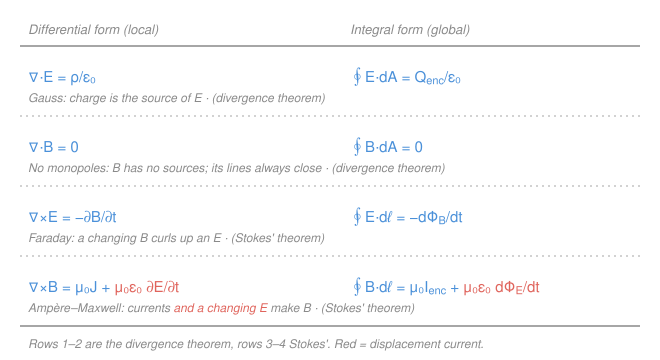

# Electromagnetism · Lesson 4.1: Maxwell's equations complete

> ⏱ ~15 min · Module 4: Maxwell's equations and light · Builds on: [1.2 Gauss's law](01-02-gauss-law.md), [3.3 Electromagnetic induction](03-03-electromagnetic-induction.md) · Unlocks: 4.2 (electromagnetic waves)

## Why this matters

Everything in this course — the field of a charge, the pull between wires, the EMF in a spinning loop — collapses into **four short lines**. That compression is one of the great events in physics: Maxwell wrote them down, spotted that one was *incomplete*, patched it with a single new term, and out fell the prediction that light is an electromagnetic wave travelling at $1/\sqrt{\mu_0\varepsilon_0}$. This lesson assembles the four, adds Maxwell's missing term (the **displacement current**), and shows that the whole set is just the divergence and Stokes' theorems from [`calc-refresher` 5.3](../../calc-refresher/lessons/05-03-green-stokes-divergence.md) wearing physics uniforms.

## The idea

You already have three of the four. Gauss's law ([1.2](01-02-gauss-law.md)): charges make $\mathbf E$. Its magnetic twin: there are no magnetic charges, so $\mathbf B$ lines never start or stop — they close into loops. Faraday's law ([3.3](03-03-electromagnetic-induction.md)): a *changing* $\mathbf B$ stirs up a curling $\mathbf E$. The fourth, Ampère's law ([3.2](03-02-sources-of-magnetic-field.md)): currents make a curling $\mathbf B$.

Look at the near-symmetry: a changing $\mathbf B$ makes $\mathbf E$ (Faraday), but nothing yet says a changing $\mathbf E$ makes $\mathbf B$. Maxwell noticed the gap — and that Ampère's law, as written, is actually *self-contradictory* when charge is piling up somewhere (like on a charging capacitor plate). His fix: **a changing electric field acts like a current**. Add the term $\mu_0\varepsilon_0\,\partial\mathbf E/\partial t$ to Ampère's law and two things happen at once — the contradiction dissolves, and the symmetry closes. Now $\mathbf E$ and $\mathbf B$ can each *regenerate the other*: that feedback loop, unglued from any charges, walks off through empty space as a wave. That wave is light ([4.2](04-02-electromagnetic-waves.md)).

## The formal version

Symbols: $\mathbf E$ electric field (N/C), $\mathbf B$ magnetic field (T), $\rho$ charge density (C/m³), $\mathbf J$ current density (A/m²), $\varepsilon_0 = 8.85\times10^{-12}$ C²/(N·m²), $\mu_0 = 4\pi\times10^{-7}$ T·m/A. $\nabla\cdot$ is divergence (net outflow per volume), $\nabla\times$ is curl (local circulation), $\partial_t$ is the time derivative. $\Phi_E=\int\mathbf E\cdot d\mathbf A$ and $\Phi_B=\int\mathbf B\cdot d\mathbf A$ are the fluxes through a surface.

**The four equations**, each in differential (local) and integral (global) form:

| # | Name | Differential | Integral |
|---|---|---|---|
| 1 | Gauss (E) | $\nabla\cdot\mathbf E = \dfrac{\rho}{\varepsilon_0}$ | $\displaystyle\oint \mathbf E\cdot d\mathbf A = \frac{Q_{\text{enc}}}{\varepsilon_0}$ |
| 2 | No monopoles | $\nabla\cdot\mathbf B = 0$ | $\displaystyle\oint \mathbf B\cdot d\mathbf A = 0$ |
| 3 | Faraday | $\nabla\times\mathbf E = -\dfrac{\partial\mathbf B}{\partial t}$ | $\displaystyle\oint \mathbf E\cdot d\boldsymbol\ell = -\frac{d\Phi_B}{dt}$ |
| 4 | Ampère–Maxwell | $\nabla\times\mathbf B = \mu_0\mathbf J + \mu_0\varepsilon_0\dfrac{\partial\mathbf E}{\partial t}$ | $\displaystyle\oint \mathbf B\cdot d\boldsymbol\ell = \mu_0 I_{\text{enc}} + \mu_0\varepsilon_0\frac{d\Phi_E}{dt}$ |

In words, one line each: **(1)** charge is the source of $\mathbf E$; **(2)** $\mathbf B$ has no sources, its lines close; **(3)** a changing magnetic flux drives a circulating $\mathbf E$ (an EMF); **(4)** electric current *and a changing electric flux* drive a circulating $\mathbf B$.

**The two forms are the same law, via the big-three theorems.** Equations 1–2 pass between local and global through the **divergence theorem** ($\oint\mathbf F\cdot d\mathbf A=\iiint\nabla\cdot\mathbf F\,dV$); equations 3–4 through **Stokes' theorem** ($\oint\mathbf F\cdot d\boldsymbol\ell=\iint(\nabla\times\mathbf F)\cdot d\mathbf A$) — the exact machinery of [`calc-refresher` 5.3](../../calc-refresher/lessons/05-03-green-stokes-divergence.md). Maxwell's equations *are* those theorems applied to $\mathbf E$ and $\mathbf B$.

**The displacement current.** The new term defines a current-like quantity flowing wherever $\mathbf E$ changes:

$$I_d = \varepsilon_0\,\frac{d\Phi_E}{dt}.$$

In words: a changing electric flux sources $\mathbf B$ exactly as a real current $I$ would. *Why it's forced:* take the divergence of equation 4. Since $\nabla\cdot(\nabla\times\mathbf B)=0$ always, we need $\nabla\cdot\mathbf J + \varepsilon_0\,\partial_t(\nabla\cdot\mathbf E)=0$. Using Gauss ($\varepsilon_0\nabla\cdot\mathbf E=\rho$), that is $\nabla\cdot\mathbf J + \partial_t\rho = 0$ — **conservation of charge**. Without the displacement term Ampère's law would demand $\nabla\cdot\mathbf J=0$, i.e. charge can never accumulate — false. The term isn't optional; it's what makes the four equations consistent with charge conservation (and, as a bonus, with light).

## Picture

## Worked examples

**Example 1 (the symmetry, read off the panel).** Cover the $\rho$ and $\mathbf J$ columns — set all charges and currents to zero (vacuum). The four equations become $\nabla\cdot\mathbf E=0$, $\nabla\cdot\mathbf B=0$, $\nabla\times\mathbf E=-\partial_t\mathbf B$, $\nabla\times\mathbf B=\mu_0\varepsilon_0\,\partial_t\mathbf E$. Now equations 3 and 4 are near-mirror images: each field's curl is fed by the *other* field's rate of change. A wiggle in $\mathbf B$ makes a curling $\mathbf E$ (eq 3); that $\mathbf E$ is now changing, so it makes a curling $\mathbf B$ (eq 4); which is changing, so... The pattern feeds itself and propagates. Without Maxwell's term, eq 4 would read $\nabla\times\mathbf B=0$ in vacuum — the loop breaks and there is no wave. **The displacement current is the reason light exists.** (You'll turn this hand-wave into the wave equation in [4.2](04-02-electromagnetic-waves.md).)

**Example 2 (displacement current in a charging capacitor).** A parallel-plate capacitor with plate area $A$ is being charged; at some instant the wire carries current $I=3.0$ A. Between the plates there's no moving charge — so what sources the $\mathbf B$ field that circles the gap?

The field between the plates is $E=\sigma/\varepsilon_0 = Q/(\varepsilon_0 A)$ (from [1.2](01-02-gauss-law.md)), so the flux is $\Phi_E = EA = Q/\varepsilon_0$. The displacement current is

$$I_d = \varepsilon_0\frac{d\Phi_E}{dt} = \varepsilon_0\cdot\frac{1}{\varepsilon_0}\frac{dQ}{dt} = \frac{dQ}{dt} = I = 3.0\ \text{A}.$$

The displacement current between the plates **exactly equals** the conduction current in the wire. The current is "continued" across the gap by the changing $\mathbf E$, so $\mathbf B$ circles the gap just as it circles the wire — seamless. That equality is Problem 2; the reason it's *required* is Problem 3.

## Watch out

- **You might think the displacement current is a flow of charge.** Nothing moves between the plates — it's a *changing electric field* that sources $\mathbf B$ the way a current would. "Current" is by analogy (same units, same role in Ampère's law), not by transport of charge.
- **You might think eq 2 forbids magnetic fields.** $\nabla\cdot\mathbf B=0$ forbids magnetic *charges* (sources), not fields. $\mathbf B$ is everywhere; its field lines just have no ends — they close on themselves.
- **You might drop $\mu_0\varepsilon_0\,\partial_t\mathbf E$ because it's tiny in a wire.** In a good conductor it *is* negligible next to $\mu_0\mathbf J$. But in a vacuum, or the capacitor gap, it's the *only* term — set it to zero and you've deleted electromagnetic waves and broken charge conservation.
- **You might mismatch a form to its theorem.** Divergence (·, flux out of a closed surface) ↔ equations 1–2; curl (×, circulation round a loop) ↔ equations 3–4. The symbol tells you which of the big three converts it.

## One-liner

> Four lines — two divergences, two curls — hold all of E&M; Maxwell's displacement current $\mu_0\varepsilon_0\,\partial_t\mathbf E$ is the term that closes the symmetry, conserves charge, and lets the fields regenerate each other as light.

## Problems

**P1 (🟢)** Match each of the four equations to (i) its one-sentence physical statement and (ii) whether its integral↔differential bridge is the **divergence theorem** or **Stokes' theorem**. The statements: (a) *no magnetic charges exist*; (b) *a changing magnetic flux induces a circulating electric field*; (c) *charge is the source of the electric field*; (d) *currents and a changing electric flux source a circulating magnetic field*.

**P2 (🟡)** For the charging parallel-plate capacitor (plate area $A$, plate charge $Q(t)$, ideal uniform field between the plates), start from the field $E=Q/(\varepsilon_0 A)$ and show directly that the displacement current $I_d=\varepsilon_0\,d\Phi_E/dt$ between the plates equals the conduction current $I=dQ/dt$ in the wire. Confirm the units of $I_d$ are amperes.

**P3 (🔴)** Show that Ampère's law *without* the displacement term, $\oint\mathbf B\cdot d\boldsymbol\ell=\mu_0 I_{\text{enc}}$, is **inconsistent** for the charging capacitor. Take one Amperian loop encircling the wire, and compute $I_{\text{enc}}$ for two surfaces bounded by that same loop: (S1) a flat disk pierced by the wire, and (S2) a bag-shaped surface that bulges out to pass *between* the capacitor plates. Then show the Ampère–Maxwell law gives the *same* answer for both surfaces.

Solutions

**P1**
- **Eq 1, Gauss** $\nabla\cdot\mathbf E=\rho/\varepsilon_0$ → statement **(c)**, charge sources $\mathbf E$ → **divergence theorem** (it's a flux out of a closed surface).
- **Eq 2, no monopoles** $\nabla\cdot\mathbf B=0$ → statement **(a)**, no magnetic charge → **divergence theorem**.
- **Eq 3, Faraday** $\nabla\times\mathbf E=-\partial_t\mathbf B$ → statement **(b)**, changing $\mathbf B$ curls $\mathbf E$ → **Stokes' theorem** (circulation round a loop).
- **Eq 4, Ampère–Maxwell** $\nabla\times\mathbf B=\mu_0\mathbf J+\mu_0\varepsilon_0\partial_t\mathbf E$ → statement **(d)** → **Stokes' theorem**.

**Check:** the two divergence ($\nabla\cdot$, closed-surface flux) laws are the "no-curl" pair; the two curl ($\nabla\times$, closed-loop circulation) laws are the induction pair — matching the [5.3](../../calc-refresher/lessons/05-03-green-stokes-divergence.md) template exactly. ✓

**P2** The electric flux through a surface between the plates catches the whole uniform field: $\Phi_E = E\,A = \dfrac{Q}{\varepsilon_0 A}\cdot A = \dfrac{Q}{\varepsilon_0}.$ Then

$$I_d = \varepsilon_0\frac{d\Phi_E}{dt} = \varepsilon_0\,\frac{d}{dt}\!\left(\frac{Q}{\varepsilon_0}\right) = \frac{dQ}{dt} = I.$$

The area $A$ and the constant $\varepsilon_0$ both cancel, leaving $I_d=dQ/dt$, which is exactly the conduction current charging the plate.

**Check (units):** $[\varepsilon_0]\,[d\Phi_E/dt] = \dfrac{\text{C}^2}{\text{N·m}^2}\cdot\dfrac{\text{N·m}^2/\text{C}\;\text{(that is }\Phi_E)}{\text{s}} = \dfrac{\text{C}}{\text{s}} = \text{A}.$ ✓ Displacement current is genuinely in amperes, and equals the wire current.

**P3** The left side $\oint\mathbf B\cdot d\boldsymbol\ell$ is fixed by the loop alone — it cannot depend on which surface we drape across it. So the right side must not either.

*Ampère alone,* $\oint\mathbf B\cdot d\boldsymbol\ell=\mu_0 I_{\text{enc}}$:
- **S1 (flat disk):** the wire punches through it, so $I_{\text{enc}}=I$, giving $\mu_0 I$.
- **S2 (bag between the plates):** no charge crosses the gap, so $I_{\text{enc}}=0$, giving $0$.

Same loop, two different answers ($\mu_0 I \ne 0$) — a flat contradiction. Ampère's law as originally written is inconsistent whenever charge accumulates.

*Ampère–Maxwell,* $\oint\mathbf B\cdot d\boldsymbol\ell=\mu_0 I_{\text{enc}}+\mu_0\varepsilon_0\,d\Phi_E/dt$:
- **S1:** conduction current $I$, and essentially no electric flux threads the disk around the wire, so total $=\mu_0 I$.
- **S2:** no conduction current, but the changing field between the plates gives $\mu_0\varepsilon_0\,d\Phi_E/dt = \mu_0 I_d = \mu_0 I$ (by P2). Total $=\mu_0 I$.

Both surfaces now give $\mu_0 I$ — consistent.

**Check:** the displacement current is precisely the amount ($I_d=I$) needed to make the two surfaces agree; consistency of Ampère's law across *any* capping surface is the self-consistency argument that forced Maxwell's term — the same "$\nabla\cdot(\nabla\times\mathbf B)=0$ demands charge conservation" statement from the formal section, read through Stokes' theorem. ✓

## Flashback

**From Lesson 3.3 (Electromagnetic induction):** A circular wire loop of radius $a=0.050$ m sits in a uniform magnetic field pointing straight out of the loop's plane. The field grows steadily at $dB/dt=0.20$ T/s. Find the induced EMF, and the induced current if the loop has resistance $R=2.0\ \Omega$. Which way does the current flow?

Solution

Flux through the loop: $\Phi_B = B\,A = B\,\pi a^2$. Only $B$ changes, so Faraday's law gives

$$|\mathcal E| = \left|\frac{d\Phi_B}{dt}\right| = \pi a^2\frac{dB}{dt} = \pi(0.050)^2(0.20) = \pi(2.5\times10^{-3})(0.20) \approx 1.6\times10^{-3}\ \text{V}.$$

Induced current: $I = \dfrac{|\mathcal E|}{R} = \dfrac{1.57\times10^{-3}}{2.0} \approx 7.9\times10^{-4}\ \text{A}$ (about 0.79 mA).

**Direction (Lenz's law):** the outward flux is increasing, so the induced current opposes the growth by making its *own* field point *into* the plane inside the loop. By the right-hand rule that means the current runs **clockwise** as viewed from the side the field points toward.

**Check:** units $\text{T·m}^2/\text{s} = \text{V}$ ✓; Faraday's law here is Maxwell equation 3 ($\oint\mathbf E\cdot d\boldsymbol\ell=-d\Phi_B/dt$) in its integral form — the very equation this lesson slots into the panel. ✓

## Connections

- **Backward:** equation 1 *is* [1.2](01-02-gauss-law.md)'s Gauss's law, equation 3 *is* [3.3](03-03-electromagnetic-induction.md)'s Faraday's law, equation 4 extends [3.2](03-02-sources-of-magnetic-field.md)'s Ampère's law — and every integral↔differential bridge is a divergence or Stokes' theorem from [`calc-refresher` 5.3](../../calc-refresher/lessons/05-03-green-stokes-divergence.md). The consistency argument reuses that lesson's continuity equation $\partial_t\rho+\nabla\cdot\mathbf J=0$.
- **Forward:** [4.2](04-02-electromagnetic-waves.md) sets $\rho=0$, $\mathbf J=0$ and combines equations 3 and 4 into a wave equation, reading off $c=1/\sqrt{\mu_0\varepsilon_0}$ — the payoff of Maxwell's term. [4.3](04-03-energy-poynting.md) then tracks the energy those waves carry.
- **Sideways (vector calculus):** the whole set is four instances of one idea — the integral of a derivative of a field over a region equals a plain integral over its boundary. In differential-forms language ([5.3](../../calc-refresher/lessons/05-03-green-stokes-divergence.md)'s final note) all four collapse to $dF=0$ and $d\!\star\!F=J$, two lines — the same compression, one level higher.
