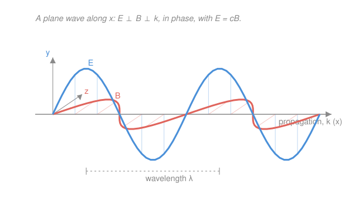

# Electromagnetism · Lesson 4.2: Electromagnetic waves

> ⏱ ~15 min · Module 4: Maxwell's equations and light · Builds on: [4.1 Maxwell's equations complete](04-01-maxwells-equations.md), [`ode-refresher` 4.2](../../ode-refresher/lessons/04-02-intro-pdes-separation.md) · Unlocks: 4.3 (energy and the Poynting vector)

## Why this matters

In 1865 Maxwell wrote down four equations and did one more line of algebra with them. Out fell a wave — a self-sustaining ripple of electric and magnetic field, travelling through *empty space* at a speed built entirely from two lab constants, $\mu_0$ and $\varepsilon_0$. When he computed that speed it came out to the measured speed of light. No light was assumed anywhere in the equations; it simply *appeared*. This lesson is that derivation. It is the moment electricity, magnetism, and optics became one subject — and the reason your phone, your eyes, and a distant quasar all run on the same physics.

## The idea

You already have the two halves of the mechanism, from Module 3 and Lesson 4.1:

- **Faraday:** a *changing magnetic field* creates a circulating *electric field* ([3.3](03-03-electromagnetic-induction.md)).
- **Ampère–Maxwell:** a *changing electric field* creates a circulating *magnetic field* — that is Maxwell's displacement-current term ([4.1](04-01-maxwells-equations.md)).

Put them nose to tail. Wiggle a field somewhere. The changing $\mathbf B$ induces an $\mathbf E$ next to it; that $\mathbf E$ is itself changing, so it induces a $\mathbf B$ a little farther on; that new $\mathbf B$ is changing, so it induces an $\mathbf E$ farther still. Each field hands the baton to the other, and the disturbance walks itself forward through vacuum with nothing to carry it — no charges, no wires, no medium. That self-regenerating hand-off *is* an electromagnetic wave, and the algebra below shows it must travel at one particular speed.

## The formal version

**Setup: Maxwell's equations in empty space.** Take a region with no charge and no current, $\rho=0$, $\mathbf J=0$. The four equations ([4.1](04-01-maxwells-equations.md)) reduce to

$$\nabla\cdot\mathbf E=0,\qquad \nabla\cdot\mathbf B=0,\qquad \nabla\times\mathbf E=-\frac{\partial\mathbf B}{\partial t},\qquad \nabla\times\mathbf B=\mu_0\varepsilon_0\frac{\partial\mathbf E}{\partial t}.$$

Here $\mathbf E$ is the electric field, $\mathbf B$ the magnetic field, $\mu_0=4\pi\times10^{-7}$ (the permeability of free space) and $\varepsilon_0=8.85\times10^{-12}$ (the permittivity of free space); $\nabla\cdot$ is divergence and $\nabla\times$ is curl. In words: no sources, but each field's curl is fed by the *other* field's rate of change.

**The one trick: take the curl of Faraday's law.** Apply $\nabla\times$ to both sides of $\nabla\times\mathbf E=-\partial\mathbf B/\partial t$:

$$\nabla\times(\nabla\times\mathbf E)=-\frac{\partial}{\partial t}\left(\nabla\times\mathbf B\right).$$

Now use two facts. On the left, the vector identity $\nabla\times(\nabla\times\mathbf E)=\nabla(\nabla\cdot\mathbf E)-\nabla^2\mathbf E$, and since $\nabla\cdot\mathbf E=0$ the first term dies, leaving $-\nabla^2\mathbf E$. On the right, substitute Ampère–Maxwell $\nabla\times\mathbf B=\mu_0\varepsilon_0\,\partial\mathbf E/\partial t$:

$$-\nabla^2\mathbf E=-\frac{\partial}{\partial t}\left(\mu_0\varepsilon_0\frac{\partial\mathbf E}{\partial t}\right)=-\mu_0\varepsilon_0\frac{\partial^2\mathbf E}{\partial t^2}.$$

Cancel the minus signs:

$$\boxed{\;\nabla^2\mathbf E=\mu_0\varepsilon_0\frac{\partial^2\mathbf E}{\partial t^2}\;}$$

and the identical manipulation starting from Ampère–Maxwell gives the same equation for $\mathbf B$. In words: each field obeys **the wave equation** — the exact PDE form $\nabla^2 u=\frac{1}{v^2}\,\partial^2 u/\partial t^2$ you met in [`ode-refresher` 4.2](../../ode-refresher/lessons/04-02-intro-pdes-separation.md).

**Read off the speed.** Matching $\mu_0\varepsilon_0=1/v^2$ against that standard form, the wave travels at

$$c=\frac{1}{\sqrt{\mu_0\varepsilon_0}}\approx 3\times10^8\ \text{m/s}.$$

In words: the speed is fixed by two electrostatics/magnetostatics constants alone — and it equals the measured speed of light. **Light is an electromagnetic wave.**

**What one solution looks like — the plane wave.** A field travelling along $x$, uniform across each plane $x=\text{const}$:

$$\mathbf E=E_0\cos(kx-\omega t)\,\hat y,\qquad \mathbf B=B_0\cos(kx-\omega t)\,\hat z,$$

where $k$ is the wavenumber (radians per metre, $k=2\pi/\lambda$), $\omega$ the angular frequency (radians per second, $\omega=2\pi f$), $\lambda$ the wavelength and $f$ the frequency. Feeding this into the wave equation forces $\omega/k=c$; feeding it into the two *curl* equations forces three more things:

- $\mathbf E\perp\mathbf B\perp$ direction of travel — the wave is **transverse** ($\mathbf E$ along $\hat y$, $\mathbf B$ along $\hat z$, motion along $\hat x$).
- $\mathbf E$ and $\mathbf B$ are **in phase** — they peak together and vanish together (same $\cos(kx-\omega t)$).
- their amplitudes are locked: $E_0=cB_0$.

Because $\omega/k=c$ and $\omega=2\pi f$, $k=2\pi/\lambda$, that relation is also the familiar

$$c=\lambda f.$$

**Same wave, all frequencies — the EM spectrum.** Nothing in the derivation picked out a frequency, so *every* $f$ is allowed and all travel at $c$. Ordered by wavelength: radio (metres) → microwave → infrared → **visible** (about 400–700 nm) → ultraviolet → X-ray → gamma (picometres). Radio waves and gamma rays differ *only* in $\lambda$; they are the identical physical object at different scales.

## Picture

## Worked examples

**Example 1 (the number falls out).** Compute $c$ from the constants:

$$\mu_0\varepsilon_0=(4\pi\times10^{-7})(8.85\times10^{-12})=1.112\times10^{-17}\ \text{s}^2/\text{m}^2,$$
$$c=\frac{1}{\sqrt{1.112\times10^{-17}}}=\frac{1}{3.335\times10^{-9}}=2.998\times10^{8}\ \text{m/s}.$$

Two constants measured with capacitors and coils — no optics — reproduce the speed of light to four figures. That agreement *is* Maxwell's argument that light is electromagnetic.

**Example 2 (why you'd care — sizing a wave).** A green laser has $\lambda=500\ \text{nm}=5\times10^{-7}$ m. Its frequency is

$$f=\frac{c}{\lambda}=\frac{3\times10^8}{5\times10^{-7}}=6\times10^{14}\ \text{Hz},$$

so $\omega=2\pi f=3.77\times10^{15}$ rad/s and $k=2\pi/\lambda=1.26\times10^{7}$ rad/m (check: $\omega/k=3.0\times10^8=c$ ✓). If its electric amplitude is $E_0=60$ V/m, the magnetic amplitude is tiny by the factor $c$: $B_0=E_0/c=60/(3\times10^8)=2\times10^{-7}$ T. That $B$ looks negligible, but it carries exactly half the wave's energy — the subject of [4.3](04-03-energy-poynting.md).

## Watch out

- You might think $B_0=E_0/c$ means the magnetic part is "weaker." It isn't — the factor $c$ is just the unit mismatch between measuring in V/m and T. In [4.3](04-03-energy-poynting.md) the electric and magnetic energy densities come out **equal**.
- You might think $\mathbf E$ and $\mathbf B$ are 90° out of phase (like current and voltage in an LC circuit, or a mass on a spring where position and velocity are). For a *travelling* wave they are exactly **in phase**: both are $\cos(kx-\omega t)$, peaking at the same place and instant. (Standing waves are the out-of-phase case.)
- You might think a medium is needed to carry it, as sound needs air. The whole point of the vacuum derivation is that $\rho=0,\ \mathbf J=0$ still supports the wave: the fields are each other's medium. This is what broke 19th-century "luminiferous ether" thinking and set up relativity.

## One-liner

> Curl Faraday's law, feed in Ampère–Maxwell, and each field satisfies a wave equation whose speed $1/\sqrt{\mu_0\varepsilon_0}$ is the speed of light — so light is just $\mathbf E$ and $\mathbf B$ taking turns regenerating each other.

## Problems

**P1 (🟢)** (a) Using $\mu_0=4\pi\times10^{-7}$ and $\varepsilon_0=8.85\times10^{-12}$, evaluate $c=1/\sqrt{\mu_0\varepsilon_0}$ and confirm it is about $3\times10^8$ m/s; state its units. (b) An FM station broadcasts at $f=100$ MHz. Find the wavelength.

**P2 (🟡)** A plane wave in vacuum has electric amplitude $E_0=90$ V/m and wavelength $\lambda=3\ \mu\text{m}$ (infrared). Find (a) the magnetic amplitude $B_0$, (b) the wavenumber $k$, and (c) the angular frequency $\omega$. Verify that $\omega/k=c$.

**P3 (🔴)** Reproduce the derivation of the wave equation from scratch: starting from the four vacuum Maxwell equations, take the curl of Faraday's law and show that $\nabla^2\mathbf E=\mu_0\varepsilon_0\,\partial^2\mathbf E/\partial t^2$. Name the vector identity you use and the *two* Maxwell equations that make its extra term vanish and close the loop, and explain in one sentence how $c=1/\sqrt{\mu_0\varepsilon_0}$ drops out.

Solutions

**P1** (a) $\mu_0\varepsilon_0=(4\pi\times10^{-7})(8.85\times10^{-12})=1.112\times10^{-17}$. Then $c=1/\sqrt{1.112\times10^{-17}}=1/(3.335\times10^{-9})=2.998\times10^{8}\ \text{m/s}\approx3\times10^8$ m/s. ✓
Units check: $[\mu_0\varepsilon_0]=\text{s}^2/\text{m}^2$ (it must, since $\mu_0\varepsilon_0=1/c^2$), so $1/\sqrt{\mu_0\varepsilon_0}$ has units $\sqrt{\text{m}^2/\text{s}^2}=$ **m/s**. ✓
(b) $\lambda=c/f=(3\times10^8)/(100\times10^{6})=(3\times10^8)/(1\times10^8)=3$ m. ✓ (A few metres — why FM antennas are the size they are.)

**P2** (a) $B_0=E_0/c=90/(3\times10^8)=3\times10^{-7}$ T $=300$ nT.
(b) $k=2\pi/\lambda=2\pi/(3\times10^{-6})=2.09\times10^{6}$ rad/m.
(c) $f=c/\lambda=(3\times10^8)/(3\times10^{-6})=1\times10^{14}$ Hz, so $\omega=2\pi f=6.28\times10^{14}$ rad/s.
Check: $\omega/k=(6.28\times10^{14})/(2.09\times10^{6})=3.0\times10^{8}=c$. ✓ Units m/s. ✓

**P3** Start from the vacuum equations $\nabla\cdot\mathbf E=0$, $\nabla\cdot\mathbf B=0$, $\nabla\times\mathbf E=-\partial\mathbf B/\partial t$, $\nabla\times\mathbf B=\mu_0\varepsilon_0\,\partial\mathbf E/\partial t$. Take the curl of Faraday's law:

$$\nabla\times(\nabla\times\mathbf E)=-\frac{\partial}{\partial t}(\nabla\times\mathbf B).$$

Use the vector identity $\nabla\times(\nabla\times\mathbf E)=\nabla(\nabla\cdot\mathbf E)-\nabla^2\mathbf E$. The first term vanishes because **Gauss's law in vacuum** gives $\nabla\cdot\mathbf E=0$, leaving $-\nabla^2\mathbf E$ on the left. On the right, substitute **Ampère–Maxwell** $\nabla\times\mathbf B=\mu_0\varepsilon_0\,\partial\mathbf E/\partial t$:

$$-\nabla^2\mathbf E=-\mu_0\varepsilon_0\frac{\partial^2\mathbf E}{\partial t^2}\ \Longrightarrow\ \nabla^2\mathbf E=\mu_0\varepsilon_0\frac{\partial^2\mathbf E}{\partial t^2}.$$

The two equations that close the loop are Gauss (kills the gradient term) and Ampère–Maxwell (replaces $\nabla\times\mathbf B$). Comparing with the standard wave equation $\nabla^2\mathbf E=\frac{1}{v^2}\partial^2\mathbf E/\partial t^2$, the coefficient match $1/v^2=\mu_0\varepsilon_0$ gives $v=c=1/\sqrt{\mu_0\varepsilon_0}$.
Check: the derivation used no property of light, only the four field equations, yet delivers the wave equation with $v=2.998\times10^8$ m/s — the speed of light. ✓

## Flashback

**From Lesson 4.1 (Maxwell's equations complete):** A parallel-plate capacitor with plate area $A=0.01\ \text{m}^2$ is charging; between the plates there is *no* conduction current, yet a magnetic field circles the gap. (a) Which Maxwell equation accounts for that $\mathbf B$, and what is the name of the term responsible? (b) Write that equation in integral form. (c) If the field between the plates rises at $dE/dt=1\times10^{12}$ V/(m·s), find the displacement current $I_d$.

Solution

(a) The **Ampère–Maxwell law**; the responsible term is Maxwell's **displacement current**, $I_d=\varepsilon_0\,d\Phi_E/dt$, which sources $\mathbf B$ even where no charges flow.
(b) $\displaystyle\oint\mathbf B\cdot d\boldsymbol\ell=\mu_0\!\left(I_{\text{enc}}+\varepsilon_0\frac{d\Phi_E}{dt}\right)$, with $\Phi_E=\int\mathbf E\cdot d\mathbf A$ the electric flux through the loop's surface. In the gap $I_{\text{enc}}=0$, so it is the flux term alone that produces the circulating field.
(c) With uniform field, $\Phi_E=EA$, so $I_d=\varepsilon_0 A\,dE/dt=(8.85\times10^{-12})(0.01)(1\times10^{12})=8.85\times10^{-2}$ A $\approx88.5$ mA.
Check units: $\varepsilon_0\,[\text{F/m}]\times A\,[\text{m}^2]\times dE/dt\,[\text{V/(m·s)}]=\text{F·V/s}=\text{C/s}=\text{A}$. ✓ (This same $\varepsilon_0\,\partial\mathbf E/\partial t$ term is exactly what closed the loop in today's wave-equation derivation — no displacement current, no light.)

## Connections

- **Backward:** the derivation is Module 3 plus [4.1](04-01-maxwells-equations.md) fused — Faraday's induction ([3.3](03-03-electromagnetic-induction.md)) and Ampère's law with Maxwell's displacement term ([4.1](04-01-maxwells-equations.md)) are the two halves that hand the wave forward. The vector-identity step reuses the curl machinery from [3.2](03-02-sources-of-magnetic-field.md).
- **Forward:** [4.3](04-03-energy-poynting.md) attaches energy and momentum to this wave via the Poynting vector $\mathbf S=\frac{1}{\mu_0}\mathbf E\times\mathbf B$, cashing out $E_0=cB_0$ as *equal* electric and magnetic energy densities and giving radiation pressure.
- **Sideways (differential equations):** $\nabla^2\mathbf E=\mu_0\varepsilon_0\,\partial^2\mathbf E/\partial t^2$ is precisely the wave PDE of [`ode-refresher` 4.2](../../ode-refresher/lessons/04-02-intro-pdes-separation.md) — separation of variables there turns it into oscillating spatial modes, the standing-wave cousins of the travelling plane wave here, and the $\omega/k=c$ dispersion relation is the continuum echo of that lesson's mode frequencies.
