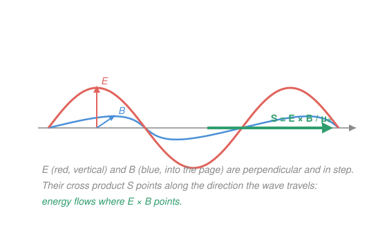

# Electromagnetism · Lesson 4.3: Energy, momentum, and the Poynting vector

> ⏱ ~15 min · Module 4: Maxwell's equations and light · Builds on: [4.2 Electromagnetic waves](04-02-electromagnetic-waves.md) · Unlocks: quantum mechanics, relativity, optics (course complete)

## Why this matters

You've built the fields, assembled Maxwell's four equations, and watched them predict a wave that travels at $c$. But a wave is only interesting because it *delivers* something: the sun warms your skin, a radio antenna lights up a receiver a mile away, a green laser burns a dot on a wall. All of that is energy — and momentum — riding the field across empty space, no wire required. This final lesson answers *where the energy is* (in the field, at a density you can compute) and *where it's going* (along a single vector, $\mathbf S$). Sunlight's warmth and a solar sail's push turn out to be the same quantity seen twice.

## The idea

Back in [2.1](02-01-capacitance.md) you found that a capacitor's energy doesn't sit "on the plates" — it lives in the field between them, at density $u = \tfrac12\varepsilon_0 E^2$. A magnetic field stores energy the same way, at $u = B^2/2\mu_0$. An electromagnetic wave carries *both*, and here's the clean surprise: in a wave the electric and magnetic halves are **exactly equal** at every point and every instant. The field is a fifty-fifty energy tank rolling through space.

Now, if energy sits in the field and the field moves, energy *flows*. Which way, and how fast? The answer is a vector built from the two fields themselves: point your fingers along $\mathbf E$, curl them toward $\mathbf B$, and your thumb — the direction of $\mathbf E\times\mathbf B$ — points exactly the way the wave travels. That thumb is the **Poynting vector**, and its length tells you the power crossing each square meter. One arrow, and it *is* the direction of energy flow. Aptly named for John Poynting, and it points.

And because the field carries energy, relativity forces it to carry momentum too ($p = U/c$ for anything massless). So light doesn't just warm a surface — it *pushes* on it. Faint, but real: it's what a solar sail runs on.

## The formal version

**Energy density.** The energy per unit volume stored in the combined field is

$$u = \tfrac12\varepsilon_0 E^2 + \frac{B^2}{2\mu_0} \qquad (\mathrm{J/m^3}),$$

where $E$ is the electric field magnitude (V/m), $B$ the magnetic field magnitude (T), $\varepsilon_0 = 8.85\times10^{-12}\ \mathrm{F/m}$, and $\mu_0 = 4\pi\times10^{-7}\ \mathrm{T\,m/A}$. In words: add the electric tank and the magnetic tank. For a wave, $B = E/c$ and $c^2 = 1/\mu_0\varepsilon_0$, so the magnetic term becomes $\dfrac{E^2}{2\mu_0 c^2} = \dfrac{\varepsilon_0 E^2}{2}$ — *identical* to the electric term. The two halves are equal, and $u = \varepsilon_0 E^2$.

**The Poynting vector.** The energy flux — power per unit area, and its direction — is

$$\mathbf S = \frac{1}{\mu_0}\,\mathbf E\times\mathbf B \qquad (\mathrm{W/m^2}).$$

In words: $\mathbf S$ points along $\mathbf E\times\mathbf B$ (the propagation direction, since $\mathbf E\perp\mathbf B$ in a wave), and its magnitude $S = EB/\mu_0$ is the watts of field energy streaming through each square meter facing the wave. Using $B = E/c$, $S = E^2/\mu_0 c$.

**Intensity.** The fields oscillate, so $S$ pulses; what a detector feels is the time average. For a plane wave $E = E_0\cos(\dots)$, the average of $\cos^2$ is $\tfrac12$, giving the **intensity**

$$I = \langle S\rangle = \tfrac12\varepsilon_0 c\,E_0^2 = \frac{E_0^2}{2\mu_0 c} \qquad (\mathrm{W/m^2}),$$

where $E_0$ is the peak (amplitude) field. In words: intensity is the steady power per area, set by the *square* of the field amplitude — double the field, quadruple the brightness. (The two forms are equal because $\mu_0\varepsilon_0 c^2 = 1$.)

**Radiation pressure.** Light of intensity $I$ carries momentum, so it presses on whatever stops or bounces it:

$$P_{\text{rad}} = \frac{I}{c}\ \text{(absorbing surface)}, \qquad P_{\text{rad}} = \frac{2I}{c}\ \text{(perfect reflector)} \qquad (\mathrm{Pa}).$$

In words: absorb the light and you catch its momentum once; reflect it and you also throw it back, so you get *twice* the kick (like a ball bouncing off a wall vs. sticking to it). Units are pascals, $\mathrm{N/m^2}$.

**One phenomenon, all frequencies.** Nothing above singled out a frequency. Radio, microwave, infrared, visible, UV, X-ray, gamma — same $\mathbf E$, $\mathbf B$, same $c$, same $\mathbf S$, differing only in wavelength. The **electromagnetic spectrum** is one wave wearing every color.

## Picture

## Worked examples

**Example 1 (mechanical — the fifty-fifty tank).** A plane wave in vacuum has peak field $E_0 = 200\ \mathrm{V/m}$. What is the peak energy density, and how does it split?

Electric part at the crest: $u_E = \tfrac12\varepsilon_0 E_0^2 = \tfrac12(8.85\times10^{-12})(200)^2 = 1.77\times10^{-7}\ \mathrm{J/m^3}$. The magnetic part is *equal*, so the total peak density is $u = \varepsilon_0 E_0^2 = 3.54\times10^{-7}\ \mathrm{J/m^3}$, split exactly in half. No separate $B$ computation needed — that's the payoff of the equality.

**Example 2 (why you'd care — the flux follows).** How much power does that wave push through a $1\ \mathrm{m^2}$ window? The energy flows at speed $c$, so intensity is average density times speed: $I = \langle u\rangle\, c$. With $\langle u\rangle = \tfrac12\varepsilon_0 E_0^2$ (the average of $\cos^2$ halves the peak),

$$I = \tfrac12\varepsilon_0 E_0^2\, c = \tfrac12(8.85\times10^{-12})(200)^2(3\times10^8) = 53\ \mathrm{W/m^2}.$$

Same answer as $I = \tfrac12\varepsilon_0 c E_0^2$ — because "intensity" *is* "energy density carried forward at $c$." The Poynting vector is just this statement made directional.

## Watch out

- You might think you need $E$ *and* $B$ to get the energy density of a wave. You don't — since $u_E = u_B$, just double the electric part. But that shortcut is *only* for a free wave where $B = E/c$; a static capacitor (pure $E$) or solenoid (pure $B$) is all one kind.
- You might think reflecting and absorbing give the same push. Reflecting gives **twice** the pressure ($2I/c$ vs $I/c$) — the light's momentum reverses, so the surface absorbs *two* momentum-loads. This is why solar sails are made shiny, not black.
- You might think intensity scales with the field. It scales with the field **squared** ($I\propto E_0^2$). Halving the amplitude quarters the brightness — the same square law that makes $\tfrac12\varepsilon_0E^2$ an energy.

## One-liner

> The field holds energy at density $u=\varepsilon_0 E^2$ (half electric, half magnetic) and streams it along $\mathbf S=\tfrac{1}{\mu_0}\mathbf E\times\mathbf B$ — light's warmth and its push are the same Poynting flux.

## Problems

**P1 (🟢)** A plane electromagnetic wave in vacuum has peak electric field $E_0 = 100\ \mathrm{V/m}$. (a) Find the peak electric and magnetic energy densities and show they are equal. (b) Give the total peak energy density. (c) Find the intensity $I = \tfrac12\varepsilon_0 c E_0^2$, and cross-check it against $\langle u\rangle\,c$.

**P2 (🟡)** Sunlight at Earth's orbit delivers intensity $I \approx 1360\ \mathrm{W/m^2}$. (a) Find the peak field $E_0$ and peak magnetic field $B_0$. (b) Find the radiation pressure on a black (fully absorbing) surface and on a mirror (perfect reflector). Keep units explicit.

**P3 (🔴)** A $5.0\ \mathrm{W}$ laser is focused to a beam of cross-sectional area $A = 1.0\ \mathrm{mm^2} = 1.0\times10^{-6}\ \mathrm{m^2}$ and aimed straight at a small mirror. Find (a) the intensity $S$ in the beam, (b) the peak field $E_0$, and (c) the force the beam exerts on the mirror. Comment on what this implies for a solar sail.

Solutions

**P1** (a) Electric: $u_E = \tfrac12\varepsilon_0 E_0^2 = \tfrac12(8.85\times10^{-12})(100)^2 = 4.43\times10^{-8}\ \mathrm{J/m^3}$. Magnetic uses $B_0 = E_0/c$, and $u_B = B_0^2/2\mu_0 = E_0^2/(2\mu_0 c^2) = \tfrac12\varepsilon_0 E_0^2$ (since $c^2=1/\mu_0\varepsilon_0$) $= 4.43\times10^{-8}\ \mathrm{J/m^3}$ — **equal**, as claimed.

(b) Total peak: $u = u_E + u_B = \varepsilon_0 E_0^2 = 8.85\times10^{-8}\ \mathrm{J/m^3}$.

(c) $I = \tfrac12\varepsilon_0 c E_0^2 = \tfrac12(8.85\times10^{-12})(3\times10^8)(100)^2 = 13.3\ \mathrm{W/m^2}$.

Check: $\langle u\rangle = \tfrac12 u_{\text{peak}} = 4.43\times10^{-8}\ \mathrm{J/m^3}$, and $\langle u\rangle\,c = (4.43\times10^{-8})(3\times10^8) = 13.3\ \mathrm{W/m^2}$ — matches. Units: $(\mathrm{J/m^3})(\mathrm{m/s}) = \mathrm{W/m^2}$. ✓

**P2** (a) Invert $I = \tfrac12\varepsilon_0 c E_0^2$:
$$E_0 = \sqrt{\frac{2I}{\varepsilon_0 c}} = \sqrt{\frac{2(1360)}{(8.85\times10^{-12})(3\times10^8)}} = \sqrt{1.02\times10^6} = 1.01\times10^3\ \mathrm{V/m}.$$
Then $B_0 = E_0/c = (1.01\times10^3)/(3\times10^8) = 3.4\times10^{-6}\ \mathrm{T} = 3.4\ \mu\mathrm{T}.$

(b) Absorbing: $P_{\text{rad}} = I/c = 1360/(3\times10^8) = 4.5\times10^{-6}\ \mathrm{Pa}.$ Reflecting: $2I/c = 9.1\times10^{-6}\ \mathrm{Pa}.$

Check: $E_0\approx1000\ \mathrm{V/m}$ is a substantial field, yet the pressure is micro-pascals — a hundred-billionth of atmospheric. Sunlight is bright but barely pushes. Units: $(\mathrm{W/m^2})/(\mathrm{m/s}) = \mathrm{(J/s\,m^2)(s/m)} = \mathrm{N/m^2} = \mathrm{Pa}$. ✓

**P3** (a) All the power crosses the beam area, so $S = I = P/A = 5.0/(1.0\times10^{-6}) = 5.0\times10^{6}\ \mathrm{W/m^2}.$

(b) $E_0 = \sqrt{\dfrac{2S}{\varepsilon_0 c}} = \sqrt{\dfrac{2(5.0\times10^6)}{(8.85\times10^{-12})(3\times10^8)}} = \sqrt{3.77\times10^{9}} = 6.1\times10^{4}\ \mathrm{V/m}.$

(c) Mirror → reflecting, pressure $2I/c$, force = pressure × area $= \dfrac{2I A}{c} = \dfrac{2P}{c} = \dfrac{2(5.0)}{3\times10^8} = 3.3\times10^{-8}\ \mathrm{N}.$

Check: 30 nanonewtons from a 5 W laser — the weight of a speck of dust. Units: $\mathrm{W}/(\mathrm{m/s}) = \mathrm{N}$. ✓ Implication: radiation force is minuscule, so a solar sail needs enormous area and near-zero mass, and works because in space that feather-touch acts *continuously* with nothing to oppose it — tiny thrust, integrated for months, adds up.

## Flashback

**From Lesson 4.2 (Electromagnetic waves):** A plane wave in vacuum has electric field of amplitude $E_0 = 300\ \mathrm{V/m}$ oscillating along $\hat{\mathbf y}$, and it propagates in the $+\hat{\mathbf x}$ direction with frequency $f = 5.0\times10^{14}\ \mathrm{Hz}$. Find (a) the wavelength, (b) the amplitude $B_0$ of the magnetic field, and (c) the direction along which $\mathbf B$ oscillates.

Solution

(a) $\lambda = c/f = (3\times10^8)/(5.0\times10^{14}) = 6.0\times10^{-7}\ \mathrm{m} = 600\ \mathrm{nm}$ — visible (orange) light.

(b) In a wave $B_0 = E_0/c = 300/(3\times10^8) = 1.0\times10^{-6}\ \mathrm{T} = 1.0\ \mu\mathrm{T}.$

(c) $\mathbf S \propto \mathbf E\times\mathbf B$ must point along propagation, $+\hat{\mathbf x}$. With $\mathbf E$ along $\hat{\mathbf y}$, we need $\hat{\mathbf y}\times(\,?\,) = \hat{\mathbf x}$; since $\hat{\mathbf y}\times\hat{\mathbf z} = \hat{\mathbf x}$, $\mathbf B$ oscillates along $+\hat{\mathbf z}$.

Check: $\mathbf E$, $\mathbf B$, and the propagation direction form a right-handed triple $(\hat{\mathbf y}, \hat{\mathbf z}, \hat{\mathbf x})$, and $B_0 = E_0/c$ — exactly the plane-wave structure from 4.2. ✓

## Connections

- **Backward:** the electric energy density $u = \tfrac12\varepsilon_0 E^2$ is straight from [2.1](02-01-capacitance.md); its magnetic twin $B^2/2\mu_0$ is the field-energy idea applied to the currents of Module 3. This lesson finally makes them *travel*, using the $B = E/c$ and $\mathbf E\perp\mathbf B$ structure derived in [4.2](04-02-electromagnetic-waves.md) from [4.1](04-01-maxwells-equations.md)'s equations.
- **Forward (course complete):** you now have the full classical field. **Quantum mechanics** quantizes this energy flux into photons, each carrying $E = hf$ and momentum $p = hf/c = E/c$ — the same $p = U/c$ you used for radiation pressure, one photon at a time. **Relativity** takes the fact that $\mathbf S$ carries momentum and $c$ is frame-independent as its starting point; $\mathbf E$ and $\mathbf B$ turn out to be one object seen from different frames. **Optics** is the study of $\mathbf S$ bending, focusing, and interfering.
- **Sideways (mechanics/relativity):** radiation pressure is momentum conservation applied to the field — the light loses momentum, the surface gains it, exactly as in a collision from `analytical-mechanics`. Energy flux $\mathbf S$ and momentum density $\mathbf S/c^2$ are two components of one relativistic object (the stress-energy tensor), the bridge into `relativity`.
