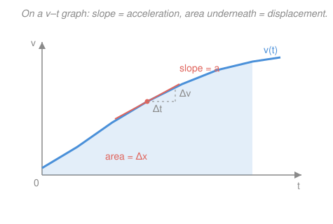

# Engineering Dynamics · Lesson 1.1: Rectilinear Motion

> ⏱ ~15 min · Module 1: Particle Kinematics · Builds on: [`calc-refresher`](../../calc-refresher/syllabus.md), [`ode-refresher`](../../ode-refresher/syllabus.md) · Unlocks: [1.2 Curvilinear Motion & Projectiles](01-02-curvilinear-motion-projectiles.md)

## Why this matters

Every trajectory this course computes — a projectile, a braking car, a piston, a mass bouncing on a spring — starts as a particle moving along a line, and the whole game is turning *acceleration* into *velocity* into *position*. Sometimes you know acceleration as a function of time (a thruster on a schedule), sometimes as a function of speed (air drag), sometimes as a function of position (a spring). Those three flavors need three different integration tricks, and getting the right one is the difference between one clean integral and a wall. This lesson is that fork in the road, and you'll walk it in every kinetics problem for the rest of the course.

## The idea

Position, velocity, and acceleration are just a chain of derivatives. Velocity is how fast position changes; acceleration is how fast velocity changes. So if you know the top of the chain and want the bottom, you *integrate*; if you know the bottom and want the top, you *differentiate*. That direction — integrate acceleration up to position — is the one dynamics lives in, because forces give you acceleration (that's $F=ma$, coming in Module 2) and what you actually want to know is *where the thing goes*.

The one subtlety: to integrate acceleration you need it as a function of the variable you're integrating over. If $a$ is a function of **time**, integrate straight over time. But if $a$ depends on **velocity** or **position**, you can't integrate "over time" directly — you don't yet know $v(t)$ or $x(t)$. The escape hatch is a single algebraic identity, $v\,dv = a\,dx$, that lets you swap the clock for the ruler and integrate over *distance* instead. Pick the tool that matches what $a$ depends on, and the problem falls open.

## The formal version

Let $x(t)$ be position along a line (meters, m). Velocity and acceleration are its first two time derivatives:

$$v = \dot x = \frac{dx}{dt}, \qquad a = \dot v = \frac{dv}{dt} = \ddot x.$$

*In words: velocity is the slope of position-versus-time; acceleration is the slope of velocity-versus-time.* Both are **signed** — a negative velocity means moving in the $-x$ direction, and $a$ opposite to $v$ means *slowing down*, not necessarily "moving backward."

**The chain-rule identity.** Divide and multiply $a=dv/dt$ by $dx$:

$$a = \frac{dv}{dt} = \frac{dv}{dx}\frac{dx}{dt} = v\frac{dv}{dx} \qquad\Longrightarrow\qquad \boxed{\,v\,dv = a\,dx\,}.$$

*In words: this trades the time variable for position, so you can integrate acceleration over distance when time isn't handy.* It's the workhorse whenever $a$ depends on where you are.

**The three cases.** Match the tool to what $a$ depends on:

| $a$ is given as | Relation to separate | You get |
|---|---|---|
| $a = a(t)$ | $dv = a(t)\,dt$, then $dx = v(t)\,dt$ | $v(t)$, then $x(t)$ |
| $a = a(v)$ | $\dfrac{dv}{a(v)} = dt$ **or** $\dfrac{v\,dv}{a(v)} = dx$ | $v(t)$ **or** $v(x)$ |
| $a = a(x)$ | $v\,dv = a(x)\,dx$ | $v(x)$ |

*In words: time-dependent acceleration integrates over time; position-dependent acceleration uses $v\,dv=a\,dx$; velocity-dependent acceleration can go either way — separate for time, or use $v\,dv/a$ for position.*

**Constant acceleration** is just the $a(t)$ case with $a$ a constant. Integrating $a$ once, twice, and applying $v\,dv=a\,dx$ gives the three formulas you already know:

$$v = v_0 + a t, \qquad x = x_0 + v_0 t + \tfrac12 a t^2, \qquad v^2 = v_0^2 + 2a\,(x - x_0).$$

*In words: these are not new physics — they are the general integrals with $a$ pulled out as a constant.* Use them **only** when $a$ is truly constant (free fall near the ground, uniform braking); reach for the integrals otherwise.

**Graphical reading.** Because $v=dx/dt$ and $a=dv/dt$, integration is *area*:

$$\Delta v = \int a\,dt = \text{area under the } a\text{–}t \text{ curve}, \qquad \Delta x = \int v\,dt = \text{area under the } v\text{–}t \text{ curve}.$$

*In words: on a $v$–$t$ graph the slope is acceleration and the area underneath is displacement — you can read a whole motion off the plot without a formula.*

## Picture

The slope at any instant is $a$; the shaded area out to a time is the displacement $\Delta x$ accumulated by then. Signed area matters: where $v<0$, the curve dips below the axis and that area *subtracts* from displacement.

## Worked examples

**Example 1 — acceleration given as $a(t)$ (integrate over time).** A cart starts at $x_0 = 0$ with velocity $v_0 = 2\,\text{m/s}$ and undergoes $a(t) = 6t\ \ (\text{m/s}^2)$. Find $v(t)$ and $x(t)$, and evaluate at $t = 2\,\text{s}$.

Integrate acceleration once, applying $v(0)=2$:

$$v(t) = v_0 + \int_0^t 6\tau\,d\tau = 2 + 3t^2 \ \ (\text{m/s}).$$

Integrate velocity, applying $x(0)=0$:

$$x(t) = x_0 + \int_0^t (2 + 3\tau^2)\,d\tau = 2t + t^3 \ \ (\text{m}).$$

At $t=2\,\text{s}$: $\ v = 2 + 3(4) = 14\,\text{m/s}$ and $x = 2(2) + 2^3 = 12\,\text{m}$.

*Check.* $dx/dt = 2 + 3t^2 = v$ ✓ and $dv/dt = 6t = a$ ✓ — differentiating back recovers the givens. Note the constant-acceleration formulas would give the **wrong** answer here (they'd need a single fixed $a$); the acceleration is changing, so we integrated.

**Example 2 — acceleration given as $a(x)$ (use $v\,dv = a\,dx$).** A block on a horizontal spring passes the equilibrium point ($x=0$) at $v_0 = 6\,\text{m/s}$. The spring produces $a = -4x\ \ (\text{m/s}^2)$, with $x$ in meters (the number $4$ is $k/m$ in $\text{s}^{-2}$). Find $v(x)$ and how far the block travels before it momentarily stops.

Time is awkward here — $a$ depends on position — so use the identity and integrate over distance:

$$v\,dv = a\,dx = -4x\,dx \quad\Longrightarrow\quad \int_{v_0}^{v} v'\,dv' = \int_{0}^{x} -4x'\,dx'.$$

$$\frac{v^2 - v_0^2}{2} = -2x^2 \quad\Longrightarrow\quad v^2 = v_0^2 - 4x^2 = 36 - 4x^2.$$

The block stops where $v = 0$: $\ 4x^2 = 36 \Rightarrow x = 3\,\text{m}$ (the maximum compression). At, say, $x = 1\,\text{m}$: $v = \sqrt{36 - 4} = \sqrt{32} \approx 5.66\,\text{m/s}$.

*Check.* Differentiate $v^2 = 36 - 4x^2$: $\ 2v\,\frac{dv}{dx} = -8x$, so $v\frac{dv}{dx} = -4x = a$ ✓. Physically this is simple harmonic motion in disguise ($\ddot x + 4x = 0$, so $\omega = \sqrt{4} = 2\,\text{rad/s}$) — the same spring you'll meet again in Module 4, here solved purely as kinematics, with no time in sight.

## Watch out

- **You might reach for $v = v_0 + at$ everywhere.** Those three formulas are *only* valid for constant $a$. The instant acceleration depends on $t$, $v$, or $x$, they're wrong — go back to the integrals. When in doubt, ask "is $a$ literally a number?"
- **You might try to integrate $a(v)$ or $a(x)$ straight over $dt$.** You can't: $\int a(x)\,dt$ has the wrong variable, since you don't yet know $x(t)$. That's exactly what $v\,dv = a\,dx$ fixes — it converts the integral to one over a variable you *do* have.
- **You might drop the sign of $v$.** Speed is $|v|$, but velocity is signed. A ball tossed up has $v>0$ rising, $v<0$ falling, and $v=0$ at the top — the area under $v$–$t$ correctly subtracts the descent only if you keep the sign.

## One-liner

> Integrate acceleration to get motion — over time when $a=a(t)$, and over distance via $v\,dv=a\,dx$ when $a$ depends on speed or position.

## Problems

**P1 (🟢)** A car brakes with constant deceleration $a = -5\,\text{m/s}^2$ from an initial speed $v_0 = 30\,\text{m/s}$. How long does it take to stop, and how far does it travel while stopping?

**P2 (🟡)** A boat cuts its engine at $v_0 = 20\,\text{m/s}$ and coasts under a drag deceleration $a = -0.4\,v\ \ (\text{m/s}^2)$, with $v$ in m/s. Find $v(t)$, and find the total distance it drifts before (asymptotically) stopping. *(This velocity-dependent drag model is exactly the kind of plant a control system must tame — it reappears in vehicle dynamics.)*

**P3 (🔴, optional)** A projectile moves horizontally through a fluid with quadratic drag $a = -0.1\,v^2\ \ (\text{m/s}^2)$, starting at $v_0 = 20\,\text{m/s}$. Using the $v\,dv/a = dx$ form, show that velocity decays with *distance* as $v(x) = v_0 e^{-0.1x}$, and find the speed after 10 m. Why does this model predict it never truly stops?

Solutions

**P1** Constant acceleration, so the formulas apply. Time to stop from $v = v_0 + at$ with $v=0$:

$$0 = 30 + (-5)\,t \quad\Longrightarrow\quad t = 6\,\text{s}.$$

Distance from $v^2 = v_0^2 + 2a\,(x - x_0)$ with $v=0$, $x_0=0$:

$$0 = 30^2 + 2(-5)\,x \quad\Longrightarrow\quad x = \frac{900}{10} = 90\,\text{m}.$$

*Check.* Cross-check with $x = v_0 t + \tfrac12 a t^2 = 30(6) - \tfrac12(5)(36) = 180 - 90 = 90\,\text{m}$ ✓.

**P2** Acceleration depends on velocity, and we want $v(t)$, so separate over time:

$$\frac{dv}{a(v)} = dt \quad\Longrightarrow\quad \frac{dv}{-0.4\,v} = dt \quad\Longrightarrow\quad \int_{v_0}^{v}\frac{dv'}{v'} = -0.4\int_0^t dt'.$$

$$\ln\frac{v}{v_0} = -0.4\,t \quad\Longrightarrow\quad v(t) = 20\,e^{-0.4t}\ \ (\text{m/s}).$$

For total drift distance, integrate $v$ over all time (or use the $v\,dv/a=dx$ form):

$$x_\infty = \int_0^{\infty} 20\,e^{-0.4t}\,dt = \frac{20}{0.4} = 50\,\text{m}.$$

*Check.* Via the position form: $\dfrac{v\,dv}{-0.4v} = dx \Rightarrow \dfrac{dv}{-0.4} = dx \Rightarrow x = \dfrac{v_0 - v}{0.4}$; as $v\to 0$, $x \to 20/0.4 = 50\,\text{m}$ ✓. The velocity never reaches exactly zero, but the distance converges — an exponential decay in time, finite total travel.

**P3** Acceleration depends on velocity and we want $v(x)$, so use the position form of the identity:

$$\frac{v\,dv}{a(v)} = dx \quad\Longrightarrow\quad \frac{v\,dv}{-0.1\,v^2} = dx \quad\Longrightarrow\quad \frac{dv}{-0.1\,v} = dx.$$

$$\int_{v_0}^{v}\frac{dv'}{v'} = -0.1\int_0^x dx' \quad\Longrightarrow\quad \ln\frac{v}{v_0} = -0.1\,x \quad\Longrightarrow\quad v(x) = 20\,e^{-0.1x}.$$

After $x = 10\,\text{m}$: $\ v = 20\,e^{-1} \approx 20(0.368) = 7.36\,\text{m/s}$.

*Check.* Differentiate: $\dfrac{dv}{dx} = -0.1\,v$, so $v\dfrac{dv}{dx} = -0.1\,v^2 = a$ ✓. It never "stops" because $e^{-0.1x} > 0$ for all finite $x$ — the model gives vanishing but nonzero speed forever, an idealization (real drag has other terms that halt it). Notice the contrast with P2: *linear* drag decays exponentially in **time**, this *quadratic* drag decays exponentially in **distance**.

## Connections

- **Backward:** this is [`calc-refresher`](../../calc-refresher/syllabus.md) put to work — differentiation builds the $x \to v \to a$ chain, and definite integration (plus separation of variables from [`ode-refresher`](../../ode-refresher/syllabus.md)) inverts it. The $v\,dv=a\,dx$ identity is just the chain rule wearing a hard hat.
- **Forward:** [1.2 Curvilinear Motion & Projectiles](01-02-curvilinear-motion-projectiles.md) runs this same integration independently on $x$ and $y$; once forces arrive in [2.1 Newton's Second Law for Particles](02-01-newtons-second-law-particles.md), $F=ma$ hands you the acceleration and these three cases turn it into a trajectory.
- **Sideways:** Example 2's $a=-kx$ is simple harmonic motion — the identical spring analyzed with time in [`mechanics-refresher`](../../mechanics-refresher/syllabus.md) and revisited in Module 4. The velocity-dependent drag of P2 is the kind of first-order plant that vehicle and control-systems models must stabilize.
