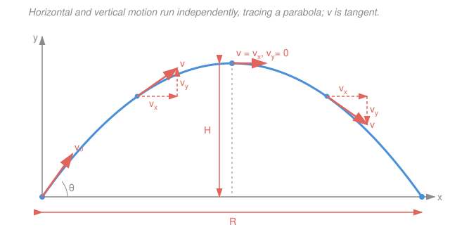

# Engineering Dynamics · Lesson 1.2: Curvilinear Motion & Projectiles

> ⏱ ~15 min · Module 1: Particle Kinematics · Builds on: [1.1 Rectilinear Motion](01-01-rectilinear-motion.md), [`calc-refresher` syllabus](../../calc-refresher/syllabus.md) · Unlocks: [1.3 Normal–Tangential & Polar Coordinates](01-03-normal-tangential-polar-coordinates.md)

## Why this matters

A thrown ball, a jet banking, a robot arm sweeping to a target — nothing interesting moves in a straight line. The moment a particle turns, its velocity and acceleration point in *different* directions, and one-dimensional bookkeeping breaks. The fix is disarmingly simple: glue two straight-line problems together at right angles. Every curved path in a plane is just $x$-motion and $y$-motion happening at the same time, and once you see that, projectiles, orbits, and targeting all fall out of the same machine.

## The idea

Watch a struck golf ball. Your eye insists it does one graceful thing. But split its motion into a *horizontal* shadow and a *vertical* shadow and something magical appears: the horizontal shadow slides at a **constant** speed, while the vertical shadow rises, stalls, and falls exactly like a ball thrown straight up. The two shadows never talk to each other — gravity pulls only downward, so it touches the vertical story and leaves the horizontal one alone.

That is the whole trick of curvilinear motion: **treat each axis as its own private 1D problem** (the kind you solved in [1.1](01-01-rectilinear-motion.md)), then staple the answers back together into vectors. The particle's position at any time is an arrow $\vec r$ from the origin to where it is; how fast that arrow's tip moves is the velocity $\vec v$; how fast $\vec v$ itself changes is the acceleration $\vec a$. The one fact worth tattooing: **velocity always points along the path** (tangent to it), while acceleration is free to point wherever the path is bending toward. Their splitting into $x$ and $y$ is what makes the curve computable.

## The formal version

Let a particle move in the $xy$-plane. Its **position vector** is the arrow from the origin to the particle:

$$\vec r(t) = x(t)\,\hat i + y(t)\,\hat j,$$

where $x(t), y(t)$ are the coordinates (meters), and $\hat i, \hat j$ are fixed unit vectors along the $x$- and $y$-axes. *In words: $\vec r$ is just the particle's two coordinates bundled into one arrow.*

Differentiate with respect to time $t$ (seconds). Because $\hat i, \hat j$ are constant, only the coordinates change:

$$\vec v = \frac{d\vec r}{dt} = \dot x\,\hat i + \dot y\,\hat j, \qquad \vec a = \frac{d\vec v}{dt} = \ddot x\,\hat i + \ddot y\,\hat j,$$

where $\dot x = dx/dt$, $\ddot x = d^2x/dt^2$, and units are m/s and m/s². *In words: differentiate each coordinate on its own — the $x$-machinery never mixes with the $y$-machinery.* This is the **independence of components**: $a_x$ depends only on the $x$-story, $a_y$ only on the $y$-story.

The **speed** is the length of the velocity vector, and $\vec v$ is **tangent to the path**:

$$v = |\vec v| = \sqrt{\dot x^2 + \dot y^2}, \qquad \text{direction of } \vec v = \text{tangent to the trajectory}.$$

*In words: speed is how fast, tangent is which way — and "which way" is always straight along the curve.* (Acceleration, by contrast, generally is **not** tangent; splitting it into along-path and across-path pieces is exactly the job of [1.3](01-03-normal-tangential-polar-coordinates.md).)

**Projectile motion** is the headline special case: after release, the only force is gravity, so

$$a_x = 0, \qquad a_y = -g, \qquad g = 9.81\ \text{m/s}^2.$$

*In words: nothing pushes horizontally, and gravity pulls down at a constant $g$.* Integrate each axis separately (this is [1.1](01-01-rectilinear-motion.md)'s constant-acceleration case, done twice). With launch speed $v_0$ at angle $\theta$ above horizontal, so $v_{0x} = v_0\cos\theta$ and $v_{0y} = v_0\sin\theta$:

$$\begin{aligned}
x &= v_{0x}\,t, & v_x &= v_{0x} = \text{const}, \\
y &= v_{0y}\,t - \tfrac12 g t^2, & v_y &= v_{0y} - g t.
\end{aligned}$$

Eliminating $t$ (from $t = x/v_{0x}$) gives the **path equation** — a downward parabola:

$$\boxed{\,y = x\tan\theta - \frac{g\,x^2}{2\,v_0^2\cos^2\theta}\,}$$

*In words: plot $y$ against $x$ and the trajectory is a parabola, set entirely by launch speed and angle.* From the axis equations, three landmark results for launch and landing at the **same height** follow directly:

$$t_{\text{flight}} = \frac{2 v_{0y}}{g}, \qquad H = \frac{v_{0y}^2}{2g}, \qquad R = \frac{v_0^2 \sin 2\theta}{g},$$

the time of flight (set $y=0$), the max height (where $v_y=0$), and the range (horizontal distance $= v_{0x}\,t_{\text{flight}}$). *In words: how long it's up, how high it gets, how far it lands.*

## Picture

Notice the two velocity arrows are **mirror images**: the horizontal component $v_x$ is identical everywhere (gravity never touches it), while $v_y$ shrinks to zero at the apex and reverses on the way down. The full vector $\vec v$ always lies *along* the curve.

## Worked examples

**Example 1 (a full projectile).** A ball is launched from ground level at $v_0 = 20\ \text{m/s}$ and $\theta = 30^\circ$. Find the time of flight, the maximum height, and the range. Use $g = 9.81\ \text{m/s}^2$.

*Split into components first:*

$$v_{0x} = 20\cos 30^\circ = 20(0.8660) = 17.32\ \text{m/s}, \qquad v_{0y} = 20\sin 30^\circ = 20(0.5) = 10\ \text{m/s}.$$

*Vertical story sets the timing.* It lands when $y$ returns to $0$:

$$t_{\text{flight}} = \frac{2 v_{0y}}{g} = \frac{2(10)}{9.81} = 2.04\ \text{s}.$$

Max height is where $v_y = 0$ (halfway up, at $t = v_{0y}/g = 1.02\ \text{s}$):

$$H = \frac{v_{0y}^2}{2g} = \frac{10^2}{2(9.81)} = 5.10\ \text{m}.$$

*Horizontal story sets the distance* — constant speed for the whole flight time:

$$R = v_{0x}\,t_{\text{flight}} = 17.32 \times 2.04 = 35.3\ \text{m}.$$

*Check.* The range formula agrees: $R = v_0^2\sin 2\theta / g = 400\sin 60^\circ / 9.81 = 400(0.8660)/9.81 = 35.3\ \text{m}$ ✓. The horizontal number never once used $g$; the vertical numbers never used $v_{0x}$ — the axes stayed independent throughout.

**Example 2 (a parametric curve).** A particle moves so that $x(t) = 2t^2$ and $y(t) = t^3$ (meters, $t$ in seconds). Find its velocity, speed, and acceleration at $t = 1\ \text{s}$.

*Differentiate each coordinate separately.*

$$\vec v = \dot x\,\hat i + \dot y\,\hat j = 4t\,\hat i + 3t^2\,\hat j, \qquad \vec a = \ddot x\,\hat i + \ddot y\,\hat j = 4\,\hat i + 6t\,\hat j.$$

At $t = 1$:

$$\vec v = 4\,\hat i + 3\,\hat j\ \text{m/s}, \qquad v = \sqrt{4^2 + 3^2} = 5\ \text{m/s}, \qquad \vec a = 4\,\hat i + 6\,\hat j\ \text{m/s}^2, \quad |\vec a| = \sqrt{52} = 7.21\ \text{m/s}^2.$$

The velocity points at $\tan^{-1}(3/4) = 36.9^\circ$ above the $x$-axis — and that is the tangent direction of the path at this instant. The acceleration points at $\tan^{-1}(6/4) = 56.3^\circ$, a *different* direction: $\vec a$ is **not** aligned with $\vec v$, because the path is curving. Resolving that mismatch into "speeding-up" and "turning" pieces is precisely what [1.3](01-03-normal-tangential-polar-coordinates.md) does next.

## Watch out

- **You might think a projectile's horizontal speed decays as it slows near the top.** It doesn't — the particle *looks* slow at the apex only because $v_y \to 0$; the horizontal $v_x = v_0\cos\theta$ is dead constant the entire flight. What vanishes at the apex is the vertical component, not the horizontal.
- **You might think acceleration points along the path like velocity does.** Only $\vec v$ is guaranteed tangent. $\vec a = \ddot x\,\hat i + \ddot y\,\hat j$ points wherever the motion is changing — for a projectile it's straight *down* even while the ball moves up-and-forward. Never assume $\vec a \parallel \vec v$ on a curve.
- **You might reuse the tidy $t_{\text{flight}} = 2v_{0y}/g$, $H$, $R$ formulas when the launch and landing heights differ.** They assume landing at the launch height. If a ball is thrown off a cliff, go back to $y = v_{0y}t - \tfrac12 g t^2$ and solve the quadratic for the actual landing time — don't shortcut.

## One-liner

> A plane curve is two 1D motions at right angles: differentiate $x$ and $y$ separately, keep $\vec v$ tangent, and a projectile is just $a_x=0$, $a_y=-g$ tracing a parabola.

## Problems

**P1 (🟢)** A ball is thrown from ground level at $v_0 = 15\ \text{m/s}$, $\theta = 50^\circ$ above horizontal. Find the maximum height, the time of flight, and the horizontal range. ($g = 9.81\ \text{m/s}^2$.)

**P2 (🟡)** A particle follows $x(t) = t^3 - 3t$, $y(t) = t^2$ (SI units). (a) Find $\vec v$ and the speed at $t = 2\ \text{s}$. (b) At what instant $t > 0$ is the velocity purely vertical?

**P3 (🔴)** A launcher at the origin must send a projectile through the point $(x, y) = (8\ \text{m},\ 3\ \text{m})$, firing at $\theta = 45^\circ$. Using the path equation, find the required launch speed $v_0$. *(This is the ballistic-targeting inversion a robot's aiming controller solves — see [Connections](#connections).)*

Solutions

**P1** Components: $v_{0x} = 15\cos 50^\circ = 15(0.6428) = 9.64\ \text{m/s}$, $v_{0y} = 15\sin 50^\circ = 15(0.7660) = 11.49\ \text{m/s}$.

$$H = \frac{v_{0y}^2}{2g} = \frac{11.49^2}{2(9.81)} = \frac{132.0}{19.62} = 6.73\ \text{m}.$$

$$t_{\text{flight}} = \frac{2 v_{0y}}{g} = \frac{2(11.49)}{9.81} = 2.34\ \text{s}.$$

$$R = v_{0x}\,t_{\text{flight}} = 9.64 \times 2.34 = 22.6\ \text{m}.$$

*Check.* Range formula: $R = v_0^2\sin 2\theta/g = 225\sin 100^\circ/9.81 = 225(0.9848)/9.81 = 22.6\ \text{m}$ ✓.

**P2** Differentiate each coordinate: $\vec v = (3t^2 - 3)\,\hat i + 2t\,\hat j$.

(a) At $t = 2$: $\vec v = (12 - 3)\,\hat i + 4\,\hat j = 9\,\hat i + 4\,\hat j\ \text{m/s}$, so

$$v = \sqrt{9^2 + 4^2} = \sqrt{97} = 9.85\ \text{m/s}.$$

(b) Velocity is purely vertical when $v_x = 0$: $3t^2 - 3 = 0 \Rightarrow t^2 = 1 \Rightarrow t = 1\ \text{s}$ (taking $t > 0$). At that instant $v_y = 2(1) = 2\ \text{m/s}$, so $\vec v = 2\,\hat j\ \text{m/s}$ — straight up.

*Check.* Just after $t=1$, $v_x = 3t^2 - 3 > 0$; just before, $v_x < 0$ — the $x$-motion reverses there, which is exactly why the velocity is momentarily vertical. ✓

**P3** The path equation with $\theta = 45^\circ$ ($\tan 45^\circ = 1$, $\cos^2 45^\circ = \tfrac12$):

$$y = x\tan\theta - \frac{g x^2}{2 v_0^2 \cos^2\theta} = x - \frac{g x^2}{v_0^2}.$$

Plug in $x = 8$, $y = 3$, $g = 9.81$:

$$3 = 8 - \frac{9.81(8)^2}{v_0^2} \;\Longrightarrow\; \frac{9.81(64)}{v_0^2} = 5 \;\Longrightarrow\; v_0^2 = \frac{627.8}{5} = 125.6 \;\Longrightarrow\; v_0 = 11.2\ \text{m/s}.$$

*Check.* At $v_0 = 11.2\ \text{m/s}$: horizontal $v_{0x} = 11.2\cos45^\circ = 7.92\ \text{m/s}$, so reaching $x=8$ takes $t = 8/7.92 = 1.01\ \text{s}$; then $y = v_{0y}t - \tfrac12 g t^2 = 7.92(1.01) - \tfrac12(9.81)(1.01)^2 = 8.0 - 5.0 = 3.0\ \text{m}$ ✓.

## Connections

- **Backward:** each axis here is a [1.1 Rectilinear Motion](01-01-rectilinear-motion.md) problem in disguise — projectile $y$-motion is that lesson's constant-acceleration integration, and $x$-motion is the trivial $a=0$ case. Curvilinear motion is 1.1 run twice and vectorized.
- **Forward:** [1.3 Normal–Tangential & Polar Coordinates](01-03-normal-tangential-polar-coordinates.md) confronts the loose end flagged in Example 2 — that $\vec a$ isn't tangent — by splitting acceleration into an along-path part $a_t$ (speeding up) and an across-path part $a_n = v^2/\rho$ (turning). These same components then drive the equations of motion in [2.1](02-01-newtons-second-law-particles.md).
- **Sideways (robotics):** the path equation you inverted in P3 is exactly the ballistic model a targeting controller solves in reverse — given a target, find the launch angle or speed. Trajectory planning for a thrown or launched payload in robotics is this parabola plus a search over $\theta$; see the [`robotics` syllabus](../../robotics/syllabus.md).
