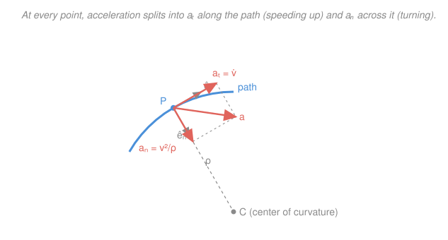

# Engineering Dynamics · Lesson 1.3: Normal–tangential & polar coordinates

> ⏱ ~15 min · Module 1: Particle Kinematics · Builds on: [1.2 Curvilinear motion & projectiles](01-02-curvilinear-motion-projectiles.md) · Unlocks: [2.1 Newton's second law for particles](02-01-newtons-second-law-particles.md)

## Why this matters

When you take a highway on-ramp, you feel two separate things: the push into your seat when you hit the gas, and the pull toward the door as the curve tightens. Those are the *two* pieces of acceleration — one along your path, one across it — and $x$–$y$ coordinates smear them together into components that don't mean anything physical. Normal–tangential coordinates ride along *with* the car and keep the two feelings separate, so "how hard am I speeding up" and "how sharply am I turning" become two clean numbers. Polar coordinates do the same trick for anything swinging around a center — a radar dish tracking a plane, a robot arm, a planet — where "how fast is it reaching out" and "how fast is it sweeping around" are the natural questions.

## The idea

Forget fixed axes for a moment. Stand at the moving particle and look where it's going. There are only two interesting directions from here: **forward along the path** (the tangent) and **sideways toward the inside of the curve** (the normal). Acceleration only ever does two things, and they line up exactly with these two directions:

- **Speeding up or slowing down** changes the length of the velocity — that's the *tangential* part, $a_t$. Hit the gas: $a_t > 0$. Brake: $a_t < 0$.
- **Turning** changes the *direction* of velocity even at constant speed — that's the *normal* part, $a_n$, and it always points toward the center of the curve. Drive around a roundabout at a steady 30 km/h and your speedometer never moves, yet you're accelerating the whole time, sideways.

The sharper the turn (smaller radius) or the faster you go, the harder that sideways pull — and it grows with the *square* of speed. Double your speed through the same bend and the sideways acceleration quadruples. That $v^2$ is why highway curves are gently banked and racetracks aren't taken flat-out.

Polar coordinates tell the same story but organized around a fixed point $O$ instead of the path itself: how far out you are ($r$) and what angle you're at ($\theta$). The surprise is that even simple radial-plus-angular motion produces two "extra" acceleration terms nobody put there by hand — the centripetal term and the **Coriolis** term — that fall out purely because the $r$ and $\theta$ directions themselves rotate as the particle moves.

## The formal version

**Normal–tangential.** Let $\hat{e}_t$ be the unit vector pointing along the path in the direction of motion, and $\hat{e}_n$ the unit vector pointing *toward the center of curvature* (perpendicular to $\hat{e}_t$, on the concave side). If $v = |\vec{v}|$ is the speed and $\rho$ (Greek rho, in meters) is the **radius of curvature** — the radius of the circle that best hugs the path right here — then

$$\vec{v} = v\,\hat{e}_t, \qquad \vec{a} = \underbrace{\dot v}_{a_t}\,\hat{e}_t + \underbrace{\frac{v^2}{\rho}}_{a_n}\,\hat{e}_n.$$

*In words: velocity is always purely tangent; acceleration has a tangential piece $a_t = \dot v$ that changes your speed, and a normal piece $a_n = v^2/\rho$ that changes your direction and points inward.* The total magnitude is the Pythagorean combination of two perpendicular pieces:

$$a = \sqrt{a_t^2 + a_n^2}.$$

Two facts worth burning in: $a_n$ is **never negative** and **never points outward** — it always aims at the center of curvature (there is no "centrifugal" term here; that feeling is inertia, not an acceleration). And on a straight line $\rho \to \infty$, so $a_n = 0$ and all acceleration is tangential — which recovers the rectilinear motion of [1.1](01-01-rectilinear-motion.md).

For a path given as $y(x)$, the radius of curvature is

$$\rho = \frac{\left[1 + (dy/dx)^2\right]^{3/2}}{\left|d^2y/dx^2\right|}.$$

*In words: the straighter the path (small second derivative), the bigger $\rho$; a straight line has infinite $\rho$.*

**Polar coordinates.** Locate the particle by radius $r$ (distance from a fixed origin $O$) and angle $\theta$. The unit vectors are $\hat{e}_r$ (pointing outward, away from $O$) and $\hat{e}_\theta$ (perpendicular, in the direction of increasing $\theta$). Because these directions *turn* as the particle moves ($\dot{\hat{e}}_r = \dot\theta\,\hat{e}_\theta$ and $\dot{\hat{e}}_\theta = -\dot\theta\,\hat{e}_r$), differentiating position twice gives

$$\vec{v} = \dot r\,\hat{e}_r + r\dot\theta\,\hat{e}_\theta,$$

$$\vec{a} = \left(\ddot r - r\dot\theta^2\right)\hat{e}_r + \left(r\ddot\theta + 2\dot r\dot\theta\right)\hat{e}_\theta.$$

*In words: velocity is "how fast you reach outward" ($\dot r$) plus "how fast you sweep around" ($r\dot\theta$); acceleration has a radial and a transverse part, each carrying an unexpected extra term.* Name the four pieces:

- $\ddot r$ — plain radial acceleration (reaching out faster).
- $-r\dot\theta^2$ — the **centripetal** term: even at constant $r$, spinning around $O$ demands an inward acceleration $r\dot\theta^2$ (the minus sign says *inward*). This is the polar face of $a_n = v^2/\rho$: for a circle $r=\rho$ and $v = r\dot\theta$, so $r\dot\theta^2 = v^2/r$.
- $r\ddot\theta$ — plain transverse acceleration (angular speeding-up).
- $2\dot r\dot\theta$ — the **Coriolis** term: it appears only when you're moving radially *and* rotating at the same time. Slide outward on a spinning merry-go-round and something has to shove you sideways to keep you turning with the faster-moving outer edge — that shove is $2\dot r\dot\theta$.

## Picture

The tangential acceleration $a_t$ rides along $\hat{e}_t$; the normal acceleration $a_n$ points straight at the center of curvature $C$, a distance $\rho$ away. Their vector sum is the true acceleration $\vec a$ — never longer than the diagonal of that little box.

## Worked examples

**Example 1 (n–t — back out the two pieces).** A car rounds a circular track of radius $\rho = 200\,\text{m}$, speeding up at a *constant* rate. At the instant its speed is $v = 20\,\text{m/s}$, the magnitude of its total acceleration is $a = 2.5\,\text{m/s}^2$. It has been speeding up from an earlier speed $v_0 = 8\,\text{m/s}$. Find $a_t$ and $a_n$, then the distance and time since $v_0$.

*Set-up.* Total acceleration is the perpendicular sum of turning and speeding-up, so peel them apart. The normal piece is fixed by the geometry and current speed:

$$a_n = \frac{v^2}{\rho} = \frac{20^2}{200} = \frac{400}{200} = 2.0\,\text{m/s}^2.$$

The tangential piece is whatever is left over, since $a^2 = a_t^2 + a_n^2$:

$$a_t = \sqrt{a^2 - a_n^2} = \sqrt{2.5^2 - 2.0^2} = \sqrt{6.25 - 4.00} = \sqrt{2.25} = 1.5\,\text{m/s}^2.$$

Because $a_t$ is constant, the speed obeys the same $v\,dv = a\,dx$ kinematics as straight-line motion (arc length $s$ plays the role of position). Using $v^2 = v_0^2 + 2a_t s$:

$$s = \frac{v^2 - v_0^2}{2a_t} = \frac{20^2 - 8^2}{2(1.5)} = \frac{400 - 64}{3} = \frac{336}{3} = 112\,\text{m},$$

and from $v = v_0 + a_t t$,

$$t = \frac{v - v_0}{a_t} = \frac{20 - 8}{1.5} = 8\,\text{s}.$$

*Check.* $s = v_0 t + \tfrac12 a_t t^2 = 8(8) + \tfrac12(1.5)(64) = 64 + 48 = 112\,\text{m}$ ✓. The turning acceleration ($2.0$) actually exceeds the speeding-up acceleration ($1.5$) — most of what the tires are doing is bending the path, not adding speed.

**Example 2 (polar — the Coriolis term shows up).** A collar slides along a straight arm that pivots about a fixed point $O$. At one instant the collar is at $r = 0.5\,\text{m}$, sliding outward at $\dot r = 2\,\text{m/s}$ and accelerating outward at $\ddot r = 3\,\text{m/s}^2$; the arm is rotating at $\dot\theta = 4\,\text{rad/s}$ and angularly accelerating at $\ddot\theta = 1\,\text{rad/s}^2$. Find $\vec v$ and $\vec a$.

*Velocity.* Plug straight into the polar formula:

$$v_r = \dot r = 2\,\text{m/s}, \qquad v_\theta = r\dot\theta = (0.5)(4) = 2\,\text{m/s},$$

$$|\vec v| = \sqrt{2^2 + 2^2} = 2\sqrt{2} \approx 2.83\,\text{m/s}.$$

*Acceleration.* Radial part carries the centripetal term $-r\dot\theta^2$:

$$a_r = \ddot r - r\dot\theta^2 = 3 - (0.5)(4^2) = 3 - 8 = -5\,\text{m/s}^2.$$

It's *negative* — even though the collar is accelerating outward ($\ddot r = 3$), the inward centripetal demand ($8$) wins, so the net radial acceleration points toward $O$. Transverse part carries the Coriolis term $2\dot r\dot\theta$:

$$a_\theta = r\ddot\theta + 2\dot r\dot\theta = (0.5)(1) + 2(2)(4) = 0.5 + 16 = 16.5\,\text{m/s}^2.$$

$$|\vec a| = \sqrt{(-5)^2 + 16.5^2} = \sqrt{25 + 272.25} = \sqrt{297.25} \approx 17.2\,\text{m/s}^2.$$

*Check.* The Coriolis term ($16$) dwarfs the honest angular acceleration ($0.5$): almost all the sideways acceleration exists purely because the collar is sliding out through a rotating frame. Miss that term and you'd underestimate $a_\theta$ by a factor of 33.

## Watch out

- **You might think $a_n$ can point outward or go negative — it can't.** $a_n = v^2/\rho$ is a speed-squared over a positive radius; it always points *toward* the center of curvature. The outward "centrifugal" pull you feel is your body's inertia resisting that inward acceleration, not a term in $\vec a$. Draw $\hat{e}_n$ inward, always.
- **You might drop the Coriolis term $2\dot r\dot\theta$.** It vanishes only if $\dot r = 0$ (fixed radius) or $\dot\theta = 0$ (no rotation). The moment something slides *while* rotating, it's there — and as Example 2 shows, it's often the biggest term. It is *not* $\dot r\dot\theta$; the factor of 2 is real.
- **You might use $a_t = \dot v$ but forget it means rate of change of *speed*, not of velocity.** On a curve the velocity vector is changing even when speed is constant. $a_t = \dot v$ tracks only the speedometer; the direction-change lives entirely in $a_n$.

## One-liner

> Acceleration only ever speeds you up along the path ($a_t = \dot v$) or bends the path toward its center ($a_n = v^2/\rho$) — and in polar form those same two jobs disguise themselves as the centripetal and Coriolis terms.

## Problems

**P1 (🟢)** A motorcycle enters a curve of radius $\rho = 150\,\text{m}$. At the instant its speed is $15\,\text{m/s}$ it is accelerating tangentially at $a_t = 1.2\,\text{m/s}^2$. Find the normal acceleration and the magnitude of the total acceleration at that instant.

**P2 (🟡)** A robot arm's collar is being retracted along a link that rotates about the base joint $O$. At one instant $r = 0.4\,\text{m}$, $\dot r = -1\,\text{m/s}$ (pulling in), $\ddot r = 0$, $\dot\theta = 3\,\text{rad/s}$, and $\ddot\theta = 2\,\text{rad/s}^2$. Find the radial and transverse components of velocity and acceleration, and identify the Coriolis term. (This is exactly the kinematics a [robotics](../../robotics/syllabus.md) controller must cancel to move the gripper in a straight line.)

**P3 (🔴)** At an instant a particle has speed $v = 10\,\text{m/s}$ and total acceleration of magnitude $a = 6\,\text{m/s}^2$, with the angle between the velocity and acceleration vectors equal to $30^\circ$. Find $a_t$, $a_n$, and the radius of curvature $\rho$ of the path at that point.

Solutions

**P1** The normal (turning) acceleration comes straight from speed and radius:

$$a_n = \frac{v^2}{\rho} = \frac{15^2}{150} = \frac{225}{150} = 1.5\,\text{m/s}^2.$$

The two components are perpendicular, so the total is their Pythagorean sum:

$$a = \sqrt{a_t^2 + a_n^2} = \sqrt{1.2^2 + 1.5^2} = \sqrt{1.44 + 2.25} = \sqrt{3.69} \approx 1.92\,\text{m/s}^2.$$

*Check.* Units: $(\text{m/s})^2/\text{m} = \text{m/s}^2$ ✓. The total ($1.92$) exceeds either piece alone but is less than their sum ($2.7$), as a hypotenuse must be. ✓

**P2** Velocity components:

$$v_r = \dot r = -1\,\text{m/s} \quad(\text{inward}), \qquad v_\theta = r\dot\theta = (0.4)(3) = 1.2\,\text{m/s}.$$

Acceleration — radial part with its centripetal term $-r\dot\theta^2$:

$$a_r = \ddot r - r\dot\theta^2 = 0 - (0.4)(3^2) = -3.6\,\text{m/s}^2.$$

Transverse part with the Coriolis term $2\dot r\dot\theta$:

$$a_\theta = r\ddot\theta + 2\dot r\dot\theta = (0.4)(2) + 2(-1)(3) = 0.8 - 6 = -5.2\,\text{m/s}^2.$$

The **Coriolis term is $2\dot r\dot\theta = -6\,\text{m/s}^2$** — negative because the collar moves inward ($\dot r < 0$) while rotating, so it must decelerate in the transverse direction to stay with the slower-moving inner radius. It is the dominant contribution to $a_\theta$ (the honest angular term $r\ddot\theta = 0.8$ is small).

*Check.* $|\vec a| = \sqrt{(-3.6)^2 + (-5.2)^2} = \sqrt{12.96 + 27.04} = \sqrt{40.0} \approx 6.3\,\text{m/s}^2$. Both components negative: the collar is accelerating inward and against the rotation, consistent with a retract-while-spinning motion. ✓

**P3** Split the acceleration relative to the velocity direction. The tangential piece is the component *along* $\vec v$, the normal piece the component *perpendicular* to it:

$$a_t = a\cos 30^\circ = 6\,(0.866) = 5.20\,\text{m/s}^2, \qquad a_n = a\sin 30^\circ = 6\,(0.5) = 3.0\,\text{m/s}^2.$$

The radius of curvature then comes from inverting $a_n = v^2/\rho$:

$$\rho = \frac{v^2}{a_n} = \frac{10^2}{3.0} = \frac{100}{3} \approx 33.3\,\text{m}.$$

*Check.* $a_t^2 + a_n^2 = 5.20^2 + 3.0^2 = 27.04 + 9.0 = 36.04 \approx 6^2$ ✓. If the acceleration had been purely along $\vec v$ (angle $0^\circ$), $a_n$ would be zero and $\rho$ infinite — a straight path — matching intuition. ✓

## Flashback

**From Lesson 1.2 (Curvilinear motion & projectiles):** A ball is kicked from level ground at $20\,\text{m/s}$, $30^\circ$ above the horizontal. Using $g = 9.81\,\text{m/s}^2$ and neglecting air resistance, find its maximum height and its horizontal range. *(Fresh variant — new launch data.)*

Solution

Split the launch velocity into components:

$$v_{0x} = 20\cos 30^\circ = 17.32\,\text{m/s}, \qquad v_{0y} = 20\sin 30^\circ = 10.0\,\text{m/s}.$$

Vertical motion is free-fall; at the top $v_y = 0$, so from $v_y^2 = v_{0y}^2 - 2gH$:

$$H = \frac{v_{0y}^2}{2g} = \frac{10.0^2}{2(9.81)} = \frac{100}{19.62} \approx 5.10\,\text{m}.$$

Time of flight is twice the time to the top, $t = 2v_{0y}/g = 20/9.81 = 2.04\,\text{s}$, and horizontal speed is constant:

$$R = v_{0x}\,t = 17.32 \times 2.04 \approx 35.3\,\text{m}.$$

*Check.* The range formula $R = v_0^2\sin(2\theta)/g = 400\sin 60^\circ/9.81 = 400(0.866)/9.81 \approx 35.3\,\text{m}$ agrees ✓. This is the same decoupling of horizontal and vertical that n–t coordinates generalize: here the "natural" axes are horizontal/vertical because gravity is; on a curved track they're tangent/normal because the path is.

## Connections

- **Backward:** on a straight path $\rho \to \infty$ makes $a_n = 0$ and $\vec a = \dot v\,\hat{e}_t$ — this lesson collapses exactly onto the rectilinear kinematics of [1.1](01-01-rectilinear-motion.md), and $a_t = \dot v$ still obeys the $v\,dv = a\,ds$ integration used there (with arc length $s$ for position). The rectangular-component view of [1.2](01-02-curvilinear-motion-projectiles.md) describes the *same* motion in fixed axes.
- **Forward:** [2.1 Newton's second law](02-01-newtons-second-law-particles.md) attaches forces to these accelerations — $\sum F_t = m a_t$ and $\sum F_n = m v^2/\rho$ become the equations of motion for anything on a curved path (a car needing friction to corner, a bead on a wire), and the polar form drives central-force and orbit problems.
- **Sideways (robotics & rotating frames):** the Coriolis term $2\dot r\dot\theta$ is the particle-level seed of the Coriolis force that shows up whenever you work in a rotating frame — the reason weather systems swirl, and the term a [robotics](../../robotics/syllabus.md) or [control-systems](../../control-systems/syllabus.md) engineer must model to steer a joint that both extends and rotates. The full frame-transport machinery gets its proper treatment in [analytical-mechanics](../../analytical-mechanics/syllabus.md).
