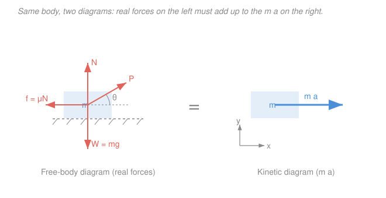

# Engineering Dynamics · Lesson 2.1: Newton's second law for particles

> ⏱ ~15 min · Module 2: Particle Kinetics · Builds on: [1.3 Normal–tangential & polar coordinates](01-03-normal-tangential-polar-coordinates.md), [`statics`](../../statics/syllabus.md) · Unlocks: [2.2 Work, energy & power](02-02-work-energy-power.md)

## Why this matters

In [statics](../../statics/syllabus.md) every free-body diagram ended the same way: forces sum to zero, nothing moves. That was the special case. The real world accelerates — a car leans into a curve, an elevator tugs your stomach, a block slides down a ramp — and the instant a body accelerates, its forces **stop** summing to zero. What they sum to instead is $m\vec a$. This lesson is the hinge of the whole course: it's where forces meet motion, and it's the tool you reach for whenever the question is "given these forces, how does it move?" (or the reverse).

## The idea

Newton's second law is a bookkeeping promise: **the leftover force is the acceleration.** Add up every real push and pull on a body; whatever vector remains, divide by the mass, and that's how fast the velocity is changing. Statics is just the case where nothing is left over.

The discipline that keeps this honest is drawing **two diagrams side by side**:

- The **free-body diagram (FBD)** — the body isolated, with every *real* force acting on it: gravity, normal contact, friction, tension, applied pushes. Nothing else.
- The **kinetic diagram** — the same body with a *single* vector, $m\vec a$, pointing in the direction it accelerates.

Then you assert the two are equal. The FBD is "what's being done to it"; the kinetic diagram is "what that adds up to." Keeping $m\vec a$ on its own diagram — not sneaking it into the FBD as a fake "$ma$ force" — is the habit that saves you from sign errors for the rest of the course.

## The formal version

**Newton's second law for a particle.** For a body of mass $m$ (kg) with acceleration $\vec a$ (m/s²) acted on by forces $\vec F_i$,

$$\sum \vec F = m\vec a.$$

*In words: the vector sum of all real forces equals mass times acceleration — same direction, scaled by mass.* This is one vector equation, so in a plane it's **two scalar equations**, one per axis. You get to pick the axes; pick the ones that make the geometry cheap.

**Rectangular components** — when forces and motion line up with fixed $x$–$y$ axes:

$$\sum F_x = m a_x, \qquad \sum F_y = m a_y.$$

*In words: bookkeep each direction separately.* Best for blocks on flat surfaces, projectiles, elevators.

**Normal–tangential ($n$–$t$) components** — when the body follows a known curved path (from [1.3](01-03-normal-tangential-polar-coordinates.md)):

$$\sum F_t = m a_t = m\dot v, \qquad \sum F_n = m a_n = m\frac{v^2}{\rho}.$$

*In words: forces along the path change the speed; forces across the path (toward the center of curvature) bend it.* Here $v$ is speed (m/s), $\rho$ the radius of curvature (m), and $a_n = v^2/\rho$ always points **toward** the center. Best for cars on curves, loops, anything circling.

**Polar components** — when position is naturally an angle and a radius $r$ (m):

$$\sum F_r = m a_r = m(\ddot r - r\dot\theta^2), \qquad \sum F_\theta = m a_\theta = m(r\ddot\theta + 2\dot r\dot\theta).$$

*In words: the radial and transverse force balances, using the polar accelerations from 1.3* (the $-r\dot\theta^2$ centripetal term and the $2\dot r\dot\theta$ Coriolis term). Best for orbits, robot arms, whirling links.

**Statics is the case $\vec a = \vec 0$.** Set the right-hand side to zero and $\sum\vec F = 0$ — every statics problem you ever solved is Newton's second law with an empty kinetic diagram.

## Picture

The equals sign is the physics: the four real forces on the left must resolve to exactly the $m\vec a$ on the right. If the applied pull $P$ beats friction, there's leftover force in the $+x$ direction — and that leftover *is* $ma_x$.

## Worked examples

**Example 1 (rectangular — a block pulled on a rough floor).** A $20\,\text{kg}$ crate rests on a floor with kinetic friction coefficient $\mu_k = 0.25$. A rope pulls it with $P = 100\,\text{N}$ at $\theta = 30^\circ$ above horizontal. Find the crate's acceleration. Use $g = 9.81\,\text{m/s}^2$.

*Draw the FBD:* weight $W = mg$ down, normal $N$ up, friction $f$ backward (opposing motion), pull $P$ up-and-forward. *Kinetic diagram:* the crate slides horizontally, so $\vec a$ is purely $+x$; $a_y = 0$.

Vertical ($a_y = 0$) pins down the normal force:

$$\sum F_y = 0:\quad N + P\sin\theta - mg = 0 \;\Rightarrow\; N = mg - P\sin\theta = 20(9.81) - 100(0.5) = 146.2\,\text{N}.$$

Then $f = \mu_k N = 0.25(146.2) = 36.55\,\text{N}$, and the horizontal equation gives the acceleration:

$$\sum F_x = ma_x:\quad P\cos\theta - f = ma_x \;\Rightarrow\; a_x = \frac{100(0.866) - 36.55}{20} = \frac{50.05}{20} = 2.50\,\text{m/s}^2.$$

Notice the pull's *vertical* component quietly lightened the crate ($N < mg$), which cut the friction — the two axes talk to each other only through $N$.

**Example 2 ($n$–$t$ — a car at the limit of friction on a flat curve).** A car rounds a flat (unbanked) circular curve of radius $\rho = 60\,\text{m}$ at constant speed. The tires' static friction coefficient is $\mu_s = 0.80$. What is the fastest speed the car can hold without sliding out?

*FBD (looking from behind the car):* weight $mg$ down, normal $N$ up, and friction $f$ pointing **horizontally toward the center of the curve** — that sideways friction is the *only* thing bending the path. *Kinetic diagram:* constant speed means $a_t = 0$, so the sole acceleration is $a_n = v^2/\rho$ pointing at the center.

Vertical balance ($a_y = 0$): $\;N = mg$. The normal ($n$) equation supplies the centripetal force:

$$\sum F_n = m\frac{v^2}{\rho}:\quad f = m\frac{v^2}{\rho}.$$

The car is on the edge of sliding when friction is maxed out, $f = \mu_s N = \mu_s mg$:

$$\mu_s mg = m\frac{v_{\max}^2}{\rho} \;\Rightarrow\; v_{\max} = \sqrt{\mu_s g\rho} = \sqrt{0.80(9.81)(60)} = \sqrt{470.9} = 21.7\,\text{m/s}.$$

That's about $78\,\text{km/h}$. The mass cancels — a loaded truck and an empty one skid at the same speed, because both the grip ($\mu_s mg$) and the demand ($mv^2/\rho$) scale with $m$.

## Watch out

- **You might think $m\vec a$ is a force to draw on the FBD.** It isn't — it's the *result*, and it lives on the **kinetic** diagram. Putting a fake "$ma$ force" on the free-body diagram (the "inertial force" shortcut) double-counts and flips signs. Keep the two diagrams separate and set them equal.
- **You might drop the sign or direction of $a_n$.** The normal acceleration $a_n = v^2/\rho$ is *never* negative and *always* points toward the center of curvature — so the net force across the path must point inward too. If your $\sum F_n$ comes out pointing away from the center, re-check: something is holding the body on its path (friction, tension, normal force), and it points inward.
- **You might assume $N = mg$ always.** It only equals $mg$ when nothing else acts vertically and $a_y = 0$. An angled pull, a vertical acceleration (elevator), or a bank changes $N$ — and friction $f = \mu N$ changes with it. Always get $N$ from its own axis equation.

## One-liner

> Draw the real forces, draw $m\vec a$ beside them, set the two diagrams equal — everything else is choosing the axes that make the geometry cheap.

## Problems

**P1 (🟢 · rectangular / elevator).** A $70\,\text{kg}$ person stands on a bathroom scale inside an elevator that accelerates *upward* at $2.0\,\text{m/s}^2$. The scale reads the normal force it pushes up with. What does it read (in newtons)? Use $g = 9.81\,\text{m/s}^2$.

**P2 (🟡 · block on an incline).** A $5\,\text{kg}$ block is released from rest on a ramp inclined at $\theta = 20^\circ$, with kinetic friction coefficient $\mu_k = 0.30$ between block and ramp. Does it slide, and if so, what is its acceleration down the incline?

**P3 (🔴 · $n$–$t$, vertical circle — bridges to mechanics-refresher).** A $0.5\,\text{kg}$ ball on a string of length $r = 1.2\,\text{m}$ is swung in a *vertical* circle. (a) Find the minimum speed at the **top** of the loop for the string to stay taut. (b) If the ball actually passes the top at $v = 5.0\,\text{m/s}$, what is the string tension there?

Solutions

**P1.** FBD of the person: weight $mg$ down, scale normal $N$ up. Kinetic diagram: acceleration $a = 2.0\,\text{m/s}^2$ upward. Take $+y$ up:

$$\sum F_y = ma:\quad N - mg = ma \;\Rightarrow\; N = m(g + a) = 70(9.81 + 2.0) = 70(11.81) = 826.7\,\text{N}.$$

*Check.* At rest ($a=0$) this would give $686.7\,\text{N} = mg$; accelerating up adds weight (you feel heavier), so $N > mg$ ✓. Units: $\text{kg}\cdot\text{m/s}^2 = \text{N}$ ✓.

**P2.** First test whether it slides. It will if gravity's pull along the ramp exceeds the maximum friction — equivalently if $\tan\theta > \mu_k$: here $\tan 20^\circ = 0.364 > 0.30$, so it slides. FBD: weight $mg$ down, normal $N$ perpendicular to the ramp, friction $f$ up the ramp (opposing the downhill slide). Use axes along ($t$) and across ($n$) the incline; $a_n = 0$ (it stays on the ramp).

Across the ramp: $\;N = mg\cos\theta = 5(9.81)\cos 20^\circ = 5(9.81)(0.9397) = 46.10\,\text{N}$, so $f = \mu_k N = 0.30(46.10) = 13.83\,\text{N}$.

Along the ramp (taking downhill as $+$):

$$mg\sin\theta - f = ma \;\Rightarrow\; a = g(\sin\theta - \mu_k\cos\theta) = 9.81(0.3420 - 0.30\cdot 0.9397) = 9.81(0.0601) = 0.590\,\text{m/s}^2.$$

*Check.* The mass canceled — $a$ depends only on $\theta$ and $\mu_k$. A frictionless ramp would give $g\sin\theta = 3.36\,\text{m/s}^2$; friction knocks it down to $0.59$, and it's positive, confirming it does slide ✓.

**P3.** At the top of the loop, both gravity and the string tension point **downward** — toward the center of the circle — and together they supply the centripetal force $ma_n = mv^2/r$. FBD at the top: weight $mg$ down, tension $T$ down. Take $+n$ pointing down (toward center):

$$\sum F_n = m\frac{v^2}{r}:\quad T + mg = m\frac{v^2}{r}.$$

**(a)** The string can only *pull* (tension $\ge 0$). The slowest it can go with the string still taut is $T = 0$, where gravity alone bends the path:

$$mg = m\frac{v_{\min}^2}{r} \;\Rightarrow\; v_{\min} = \sqrt{gr} = \sqrt{9.81(1.2)} = \sqrt{11.77} = 3.43\,\text{m/s}.$$

**(b)** With $v = 5.0\,\text{m/s}$, solve the same equation for $T$:

$$T = m\frac{v^2}{r} - mg = 0.5\frac{(5.0)^2}{1.2} - 0.5(9.81) = 10.42 - 4.905 = 5.51\,\text{N}.$$

*Check.* $5.0 > v_{\min}=3.43$, so the string should be taut, and indeed $T = 5.51\,\text{N} > 0$ ✓. The mass canceled in (a) — minimum loop speed is set by geometry and gravity alone, the same fact that lets a bucket of water swing overhead without spilling.

## Flashback

**From [1.3](01-03-normal-tangential-polar-coordinates.md) (normal–tangential kinematics — fresh numbers, no forces).** A car speeds up as it rounds a circular track of radius $\rho = 250\,\text{m}$. At the instant its speed is $v = 18\,\text{m/s}$, its tangential acceleration is $a_t = 1.2\,\text{m/s}^2$. Find (a) the normal acceleration $a_n$, (b) the magnitude of the total acceleration, and (c) the angle the total acceleration makes with the direction of travel.

Solution

**(a)** Normal (centripetal) acceleration from the speed and radius:

$$a_n = \frac{v^2}{\rho} = \frac{(18)^2}{250} = \frac{324}{250} = 1.296\,\text{m/s}^2.$$

**(b)** The tangential and normal components are perpendicular, so combine by Pythagoras:

$$a = \sqrt{a_t^2 + a_n^2} = \sqrt{(1.2)^2 + (1.296)^2} = \sqrt{1.44 + 1.680} = \sqrt{3.120} = 1.77\,\text{m/s}^2.$$

**(c)** The angle from the tangent (direction of motion) toward the center:

$$\phi = \tan^{-1}\!\frac{a_n}{a_t} = \tan^{-1}\!\frac{1.296}{1.2} = \tan^{-1}(1.080) = 47.2^\circ.$$

*Check.* Since $a_n$ slightly exceeds $a_t$, the total acceleration should tilt just past $45^\circ$ off the path toward the center — and $47.2^\circ$ fits ✓. This is pure kinematics; the moment you ask *what force* produces this $\vec a$, you multiply by $m$ and you're back in Lesson 2.1.

## Connections

- **Backward:** the $a_t$ and $a_n = v^2/\rho$ pieces come straight from [1.3](01-03-normal-tangential-polar-coordinates.md), and the free-body-diagram discipline is imported wholesale from [statics](../../statics/syllabus.md) — this lesson just adds the $m\vec a$ side of the equals sign, turning $\sum\vec F = 0$ into $\sum\vec F = m\vec a$.
- **Forward:** integrating $\sum\vec F = m\vec a$ over a path gives work–energy ([2.2](02-02-work-energy-power.md)) and over time gives impulse–momentum ([2.3](02-03-linear-impulse-momentum.md)) — both are Newton's second law with the acceleration already integrated away, chosen precisely when you'd rather not solve for $\vec a$ directly.
- **Sideways (physics ↔ controls):** $\sum\vec F = m\vec a$ is Newton's second law from [mechanics-refresher](../../mechanics-refresher/syllabus.md); written as $m\ddot x = \sum F$ it is the differential equation that Module 4's vibrations and all of [control-systems](../../control-systems/syllabus.md) are built on — every plant model a controller stabilizes starts life as a free-body diagram.
