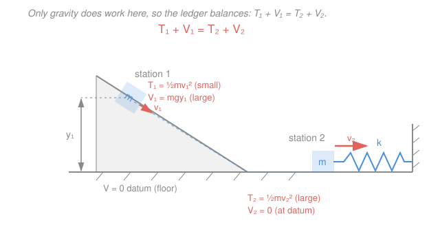

# Engineering Dynamics · Lesson 2.2: Work, Energy & Power

> ⏱ ~15 min · Module 2: Particle Kinetics · Builds on: [2.1 Newton's second law for particles](02-01-newtons-second-law-particles.md), [`calc-refresher` integration](../../calc-refresher/syllabus.md) · Unlocks: [2.3 Linear impulse & momentum](02-03-linear-impulse-momentum.md)

## Why this matters

You want the speed of a roller-coaster car at the bottom of a drop, or how far a spring bumper compresses when a mass slams into it. In [2.1](02-01-newtons-second-law-particles.md) you'd write $\sum\vec F = m\vec a$, solve a differential equation for $a$, then integrate twice — painful when the force changes with position (a spring) or the path curves. **Work–energy** skips all of that. It integrates $\sum\vec F = m\vec a$ over *distance* once and forever, leaving a scalar bookkeeping equation that connects **speed to position directly** — no acceleration, no time, no vectors to chase.

## The idea

Push a cart across a room and it speeds up; the "push × distance" you spent becomes speed. That trade has a name: **work in = change in kinetic energy**. If you know how much work every force does between point 1 and point 2, you know exactly how the speed changed — you never had to know the acceleration at any instant in between.

Even better: some forces are *bankers*. Gravity and springs give back exactly what you put in — lift a mass and gravity "owes" you that energy; let it fall and you collect. We track those debts as **potential energy** $V$. When only banker forces act, the sum $T + V$ (kinetic + potential) never changes: energy just sloshes between motion and stored form. That single conserved number, $T_1+V_1 = T_2+V_2$, solves a huge class of problems in one line.

Use work–energy exactly when you want **speed as a function of position** and **don't care about time**. (Need time, or a collision? That's [impulse–momentum, 2.3](02-03-linear-impulse-momentum.md).)

## The formal version

**Work of a force.** As a particle moves along its path from position 1 to 2, the force $\vec F$ does work

$$U_{1\to2} = \int_{1}^{2} \vec F \cdot d\vec r .$$

*In words: work is force dotted with displacement, added up along the path.* Only the component of $\vec F$ **along** the motion counts; a force perpendicular to the path (like a normal force, or the tension on a mass in circular motion) does **zero** work. Three cases carry almost every problem:

- **Constant force** through a straight displacement $\vec d$: $\;U = \vec F\cdot\vec d = F d\cos\theta$, with $\theta$ the angle between them.
- **Gravity**, dropping a height $\Delta y = y_2 - y_1$ (with $y$ measured *up*): $\;U_{\text{grav}} = -mg\,\Delta y$. Falling ($\Delta y<0$) gives positive work; $g = 9.81\,\text{m/s}^2$.
- **Linear spring** of stiffness $k$ (N/m), deformed from $x_1$ to $x_2$ from its natural length: since $\vec F_{\text{spring}} = -kx$,
$$U_{\text{spring}} = \int_{x_1}^{x_2}(-kx)\,dx = -\tfrac12 k\left(x_2^2 - x_1^2\right).$$
*In words: a spring always fights the motion, so stretching or compressing it costs you $\tfrac12 kx^2$.*

**The principle of work and energy.** Define the **kinetic energy** $T = \tfrac12 m v^2$ ($m$ in kg, $v$ the speed in m/s; $T$ in joules, J). Integrating $\sum\vec F = m\vec a$ along the path gives

$$\boxed{\;U_{1\to2} = \Delta T = \tfrac12 m v_2^2 - \tfrac12 m v_1^2\;}$$

*In words: the total work done by all forces equals the change in kinetic energy.* One scalar equation; if $U$ depends only on positions, you get $v_2$ without ever touching $a$ or $t$.

**Conservative forces and potential energy.** A force is **conservative** if the work it does depends only on the endpoints, not the path taken (gravity and springs qualify; friction and drag do not). For such a force we can define a **potential energy** $V$ with $U_{\text{cons}} = -(V_2 - V_1) = -\Delta V$:

$$V_{\text{grav}} = mgy \quad(\text{datum where you like}), \qquad V_{\text{elastic}} = \tfrac12 k x^2 .$$

*In words: potential energy is stored work — the minus sign says the force pushes "downhill," toward lower $V$.*

**Conservation of energy.** Split the work into conservative + everything else: $U_{1\to2} = -\Delta V + U_{\text{other}}$. Combined with $U_{1\to2}=\Delta T$,

$$T_1 + V_1 + U_{\text{other}} = T_2 + V_2 .$$

When **only conservative forces do work** ($U_{\text{other}}=0$, e.g. no friction), this collapses to

$$\boxed{\;T_1 + V_1 = T_2 + V_2\;}$$

*In words: with no friction, kinetic + potential energy is the same at every point of the motion.*

**Power and efficiency.** **Power** is the rate of doing work:

$$P = \frac{dU}{dt} = \vec F\cdot\vec v \quad(\text{watts, W}).$$

*In words: power is force times the velocity along it — how fast energy is delivered, not how much.* A machine's **mechanical efficiency** is useful output over required input,

$$\varepsilon = \frac{P_{\text{out}}}{P_{\text{in}}} = \frac{U_{\text{out}}}{U_{\text{in}}} \le 1,$$

the shortfall lost to friction and heat.

## Picture

At station 1 the block is high and slow — big $V$, small $T$. At station 2 it's low and fast — the height has been *spent* into speed. If the ramp were frictionless, the two ledgers would be equal to the joule; friction just skims $U_{\text{other}} = -f\cdot(\text{distance})$ off the total on the way down.

## Worked examples

**Example 1 — speed from work on a rough incline.** A $4\,\text{kg}$ block is released from rest and slides $s = 5\,\text{m}$ down a $30^\circ$ incline with kinetic friction $\mu_k = 0.20$. Find its speed at the bottom.

*Forces and their work (draw the FBD: weight down, normal $N$ out of the ramp, friction $f$ up the ramp).* Resolve normal to the incline: $N = mg\cos\theta$, so friction $f = \mu_k mg\cos\theta$ opposes motion. Over the slide of length $s$:

- Gravity: $U_{\text{grav}} = +mg\sin\theta\cdot s$ (component along the descent).
- Friction: $U_{\text{fric}} = -\mu_k mg\cos\theta\cdot s$.
- Normal force: $\perp$ to motion, $U_N = 0$.

Apply $U_{1\to2} = \Delta T$ with $v_1 = 0$:

$$mg s\left(\sin\theta - \mu_k\cos\theta\right) = \tfrac12 m v_2^2 .$$

The mass **cancels** — a heavy and a light block reach the bottom equally fast:

$$v_2 = \sqrt{2gs\left(\sin\theta - \mu_k\cos\theta\right)} = \sqrt{2(9.81)(5)\left(0.5 - 0.20\cdot0.866\right)} = \sqrt{98.1\cdot0.3268} = \sqrt{32.06}.$$

$$v_2 \approx 5.66\,\text{m/s}.$$

One equation, no acceleration — that's the whole point. (Frictionless would give $\sqrt{2gs\sin\theta}=7.00\,\text{m/s}$; friction cost $\approx 1.3\,\text{m/s}$.)

**Example 2 — max spring compression (energy conservation).** A $2\,\text{kg}$ block is released from rest a height $h = 0.5\,\text{m}$ above the top of a vertical spring, $k = 800\,\text{N/m}$. How far does it compress the spring at most? (No friction.)

*At maximum compression the block is momentarily at rest*, so $v_1 = v_2 = 0$ and $\Delta T = 0$. Let $x$ be the compression. From release to lowest point the block descends a total of $h + x$. Only gravity and the spring act, so use $T_1+V_1=T_2+V_2$ — put the datum at the lowest point:

$$\underbrace{0}_{T_1} + \underbrace{mg(h+x)}_{V_{\text{grav},1}} = \underbrace{0}_{T_2} + \underbrace{\tfrac12 k x^2}_{V_{\text{elastic},2}} .$$

Rearranged, $\tfrac12 k x^2 - mgx - mgh = 0$. With $mg = 2(9.81) = 19.62\,\text{N}$:

$$400x^2 - 19.62x - 9.81 = 0 \;\Longrightarrow\; x = \frac{19.62 + \sqrt{19.62^2 + 4(400)(9.81)}}{2(400)} = \frac{19.62 + 126.81}{800}.$$

$$x \approx 0.183\,\text{m}\;\;(18.3\,\text{cm}).$$

*Check:* stored spring energy $\tfrac12(800)(0.183)^2 = 13.4\,\text{J}$ equals the gravitational drop $mg(h+x) = 19.62(0.683) = 13.4\,\text{J}$. ✓ (Dropping the small $mgx$ "extra descent" term would give $0.157\,\text{m}$ — a 14% error, so keep it.)

## Watch out

- **You might think work–energy gives you the time.** It doesn't. $U=\Delta T$ relates speed to *position*; time never appears. For time (or impulsive collisions) you need [impulse–momentum, 2.3](02-03-linear-impulse-momentum.md). And $v_2^2$ gives only the *magnitude* of velocity — direction comes from the geometry, not the energy equation.
- **You might fold friction into a potential energy.** You can't — friction is **non-conservative** (its work depends on path length, and it always drains energy). Keep it as $U_{\text{other}} = -f\cdot d$ on the work side; never write it as a $V$. Springs and gravity are the only $V$'s here.
- **Sign of spring terms.** The spring's *work* is $-\tfrac12 kx^2$ (it resists you), but its stored *potential energy* is $+\tfrac12 kx^2$. Same magnitude, opposite sign — pick one framework ($U=\Delta T$ **or** $T+V$) and don't double-count the spring on both sides.

## One-liner

> Integrate force over distance once and you never solve for acceleration again: $U_{1\to2}=\Delta T$, and when only gravity and springs act, $T+V$ is conserved.

## Problems

**P1 (🟢)** A spring launcher with $k = 500\,\text{N/m}$ is compressed $0.20\,\text{m}$ and fires a $0.5\,\text{kg}$ block horizontally across a frictionless table. Find the block's launch speed.

**P2 (🟡)** A hoist motor lifts a $200\,\text{kg}$ load straight up at a constant $0.5\,\text{m/s}$. Its mechanical efficiency is $\varepsilon = 0.80$. Find the power the motor must draw. *(This is the actuator-sizing calculation a robotics or control-systems designer does to spec a motor.)*

**P3 (🔴)** A small block slides from rest down a frictionless track and must complete a vertical circular loop of radius $R$ on the inside. Find the minimum release height $h$ (measured above the bottom of the loop) needed to keep the block on the track all the way around, and evaluate it for $R = 2\,\text{m}$. *(Bridges energy conservation with the normal-direction $\sum F = ma_n$ from [1.3](01-03-normal-tangential-polar-coordinates.md)/[2.1](02-01-newtons-second-law-particles.md).)*

Solutions

**P1** Only the spring does work; all its stored energy becomes kinetic. With $v_1 = 0$:

$$U_{\text{spring}} = \tfrac12 k x^2 = \tfrac12 m v_2^2 \;\Longrightarrow\; \tfrac12(500)(0.20)^2 = \tfrac12(0.5)v_2^2.$$

Left side $= \tfrac12(500)(0.04) = 10\,\text{J}$, so $v_2^2 = \dfrac{2(10)}{0.5} = 40$ and

$$v_2 = \sqrt{40} \approx 6.32\,\text{m/s}.$$

*Check:* units $\sqrt{\text{J/kg}} = \sqrt{\text{m}^2/\text{s}^2} = \text{m/s}$ ✓.

**P2** At constant speed the net force is zero, so the motor's cable tension equals the weight, $F = mg = 200(9.81) = 1962\,\text{N}$. The useful **output** power is

$$P_{\text{out}} = F v = 1962(0.5) = 981\,\text{W}.$$

Efficiency relates output to the required input: $\varepsilon = P_{\text{out}}/P_{\text{in}}$, so

$$P_{\text{in}} = \frac{P_{\text{out}}}{\varepsilon} = \frac{981}{0.80} \approx 1226\,\text{W} \approx 1.23\,\text{kW}.$$

*Check:* $\varepsilon<1$ means input exceeds output — friction and heat eat the other $245\,\text{W}$. ✓

**P3** Two ingredients. **(a) The critical condition at the top of the loop.** The tightest spot is the very top: gravity points toward the center, and the track can only *push* (normal force $N\ge 0$). The block barely stays on when $N=0$, so gravity alone supplies the centripetal force. With $\sum F_n = m a_n = m v_{\text{top}}^2/R$:

$$mg = \frac{m v_{\text{top}}^2}{R} \;\Longrightarrow\; v_{\text{top}}^2 = gR.$$

**(b) Energy from release to the top** (frictionless, so $T+V$ is conserved). The top of the loop sits a height $2R$ above the bottom; release is from rest at height $h$:

$$mgh = mg(2R) + \tfrac12 m v_{\text{top}}^2 = mg(2R) + \tfrac12 m(gR).$$

Cancel $m$ and $g$: $\,h = 2R + \tfrac12 R = \tfrac52 R.$

$$\boxed{h_{\min} = 2.5\,R} \;\Longrightarrow\; h_{\min} = 2.5(2) = 5\,\text{m}.$$

*Check:* the block needs *extra* height beyond the $2R$ just to reach the top, because it must still be moving fast enough there not to fall away — exactly the $\tfrac12 R$ surplus. ✓ This is the same "energy sets the speed, $a_n$ sets the force" split used throughout Module 2.

## Flashback

**From Lesson 2.1 (Newton's second law — n–t form):** A $0.5\,\text{kg}$ ball is whirled in a vertical circle on a cord of length $1.2\,\text{m}$. At the instant it passes the **bottom** of the circle its speed is $4\,\text{m/s}$. Find the tension in the cord at that instant. *(Fresh variant — new numbers, bottom instead of a general point.)*

Solution

Draw the FBD at the bottom: tension $T$ points **up** (toward the center), weight $mg$ points **down**. At the bottom the center is directly above, so the normal (centripetal) direction is up. Apply $\sum F_n = m a_n = m v^2/r$:

$$T - mg = \frac{m v^2}{r} \;\Longrightarrow\; T = m\left(g + \frac{v^2}{r}\right) = 0.5\left(9.81 + \frac{4^2}{1.2}\right) = 0.5(9.81 + 13.33).$$

$$T \approx 11.6\,\text{N}.$$

*Check:* $T > mg = 4.9\,\text{N}$, as it must be — at the bottom the cord both supports the weight *and* supplies the centripetal pull, so it's tautest there. Note this force question needs $\sum F=ma$; work–energy couldn't find $T$ (the cord tension does no work — it's perpendicular to the motion). ✓

## Connections

- **Backward:** work–energy is $\sum\vec F = m\vec a$ from [2.1](02-01-newtons-second-law-particles.md) integrated once over distance — same physics, traded for a scalar that hides the acceleration. The integrals of $\vec F\cdot d\vec r$ are ordinary definite integrals from [`calc-refresher`](../../calc-refresher/syllabus.md).
- **Forward:** [2.3 Linear impulse & momentum](02-03-linear-impulse-momentum.md) integrates the *same* law over **time** instead of distance, giving you what work–energy can't — time and collisions. The rigid-body energy method in [3.4](03-04-rigid-body-kinetics-2d.md) adds a rotational term $\tfrac12 I_G\omega^2$ to $T$.
- **Sideways:** the elastic potential $\tfrac12 kx^2$ and the conserved $T+V$ are the exact scaffolding of vibration analysis in [4.1](04-01-free-vibration-undamped-damped.md) and of Newtonian oscillations in [`mechanics-refresher`](../../mechanics-refresher/syllabus.md); the energy bookkeeping generalizes to the Lagrangian $T-V$ of analytical mechanics, and the actuator-power calculation in P2 is how control-systems and robotics designers size motors.
