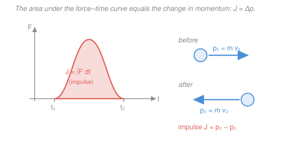

# Engineering Dynamics · Lesson 2.3: Linear Impulse & Momentum

> ⏱ ~15 min · Module 2: Particle Kinetics · Builds on: [2.1 Newton's second law for particles](02-01-newtons-second-law-particles.md), [2.2 Work, energy & power](02-02-work-energy-power.md) · Unlocks: [2.4 Impact](02-04-impact.md)

## Why this matters

A bat hits a ball for less than a thousandth of a second, and during that blink the contact force spikes to thousands of newtons and back to zero — you will never measure that force as a function of time, and you don't need to. What you *can* measure is how fast the ball came in and how fast it left. Impulse–momentum is the accounting system that connects those two facts directly, skipping the force history entirely. It's the right tool for collisions, kicks, recoils, thrust, and airbags — anything where a force acts over a *time* you care about rather than a *distance*.

## The idea

Newton's second law says force causes acceleration *right now*. But often you don't care about the instant-by-instant story — you care about the net effect of a force over a stretch of time. So integrate both sides of $\vec F = m\vec a$ over time. On the right, $m\vec a$ integrated over time is just the change in $m\vec v$ (velocity is the integral of acceleration). On the left, the time-integral of force gets a name: **impulse**.

The result is a bargain. The whole complicated force history — its peak, its shape, its duration — collapses into a single number, the **area under the force–time curve**, and that number equals the change in momentum. A gentle push held for a long time and a violent spike over an instant can deliver the *same* impulse and the *same* velocity change. That's why a follow-through matters (more time = more impulse) and why a crumple zone saves you (same momentum change, spread over more time, means a smaller force).

And there's a bonus: if you draw a box around two objects that push on each other — a gun and its bullet, a person and a cart — the forces they exert on each other are equal and opposite (Newton's third law), so their impulses cancel *inside the box*. With no impulse from *outside*, the total momentum of the pair can't change. That single fact, **conservation of momentum**, cracks recoil and collision problems in one line.

## The formal version

**Linear momentum.** For a particle of mass $m$ (kg) moving with velocity $\vec v$ (m/s), the linear momentum is

$$\vec p = m\vec v \qquad (\text{units: } \text{kg}\cdot\text{m/s}).$$

*In words: momentum is mass times velocity — a vector, pointing where the object is going, measuring how hard it is to stop.*

**Impulse of a force.** The impulse of $\vec F$ over the interval $t_1$ to $t_2$ is

$$\vec J = \int_{t_1}^{t_2}\vec F\,dt \qquad (\text{units: } \text{N}\cdot\text{s} = \text{kg}\cdot\text{m/s}).$$

*In words: impulse is force accumulated over time — the area under the force–time curve.* (Same units as momentum — no accident.)

**The impulse–momentum principle.** Start from $\vec F = m\dfrac{d\vec v}{dt} = \dfrac{d\vec p}{dt}$ and integrate over time:

$$\boxed{\;\int_{t_1}^{t_2}\vec F\,dt = m\vec v_2 - m\vec v_1 = \Delta\vec p\;}$$

*In words: the total impulse on a particle equals its change in momentum.* This is just Newton's second law with the time integral already done — same physics as [2.1](02-01-newtons-second-law-particles.md), repackaged for problems where time (not position) is the natural variable. Because it's a vector equation, it holds component by component: $\int F_x\,dt = m v_{2x}-m v_{1x}$, and likewise for $y$.

**Average force.** If a force acts over a short interval $\Delta t = t_2 - t_1$, its **average** value is the constant force delivering the same impulse:

$$\vec F_{\text{avg}} = \frac{1}{\Delta t}\int_{t_1}^{t_2}\vec F\,dt = \frac{\Delta\vec p}{\Delta t}.$$

*In words: flatten the spiky force curve into a rectangle of equal area; its height is the average force.* This is how you extract a force from a collision you can only see the before and after of.

**Impulsive forces & conservation.** A force is **impulsive** when it's enormous but acts over a tiny time (bat on ball, foot on football). Over that instant, ordinary forces like gravity or friction contribute negligible impulse ($\int F\,dt \approx 0$ because $\Delta t \approx 0$) and can be ignored. Now take a *system* of particles. Internal forces come in equal-and-opposite pairs, so their impulses cancel. Therefore, summing the principle over the system:

$$\sum \vec J_{\text{external}} = \Delta\Big(\textstyle\sum m_i\vec v_i\Big).$$

If the total external impulse is zero (or negligible over the interval), then

$$\sum m_i\vec v_i \Big|_{\text{before}} = \sum m_i\vec v_i \Big|_{\text{after}}.$$

*In words: with no push from outside, the total momentum of a system is conserved — whatever one part gains, the other loses.*

## Picture

## Worked examples

**Example 1 (single particle — the integral, then the average force).**

*(a)* A $2\,\text{kg}$ puck rests on frictionless ice. A time-varying push $F(t) = 6t\ \text{N}$ (with $t$ in seconds) acts along one line for $3\,\text{s}$. Find its final speed.

The impulse is the area under $F(t)$:

$$J = \int_0^3 6t\,dt = 3t^2\Big|_0^3 = 27\ \text{N}\cdot\text{s}.$$

By impulse–momentum, $J = m v_2 - m v_1$ with $v_1 = 0$:

$$27 = 2\,v_2 - 0 \quad\Longrightarrow\quad v_2 = 13.5\ \text{m/s}.$$

The force ramped from $0$ to a peak of $F(3) = 18\,\text{N}$, but the *average* force was only $F_{\text{avg}} = 27/3 = 9\,\text{N}$ — the flat rectangle with the same area.

*(b)* Now the impulsive case. A $0.145\,\text{kg}$ baseball arrives at $40\,\text{m/s}$, is struck, and leaves at $50\,\text{m/s}$ straight back the way it came; contact lasts $0.7\,\text{ms} = 7\times10^{-4}\,\text{s}$. Find the average force of the bat.

Momentum is a vector — take the *outgoing* direction as positive, so $v_1 = -40\,\text{m/s}$ (incoming) and $v_2 = +50\,\text{m/s}$:

$$J = m v_2 - m v_1 = 0.145\big(50 - (-40)\big) = 0.145(90) = 13.05\ \text{N}\cdot\text{s}.$$

$$F_{\text{avg}} = \frac{J}{\Delta t} = \frac{13.05}{7\times10^{-4}} \approx 18{,}600\ \text{N} \approx 18.6\ \text{kN}.$$

That's about $13{,}000$ times the ball's weight ($0.145 \times 9.81 = 1.42\,\text{N}$) — which is exactly why we ignore gravity *during* the hit, and why you'd never model this force instant by instant. The before/after speeds gave it up for free.

**Example 2 (conservation of momentum — jumping off a cart).** A $60\,\text{kg}$ person stands at rest on a $40\,\text{kg}$ cart, itself at rest on frictionless rails. The person jumps off horizontally, leaving at $3\,\text{m/s}$ (measured relative to the ground). Find the cart's velocity afterward.

Draw the box around **person + cart**. The only horizontal forces are the internal push between them (external forces — gravity, normal — are vertical, so they contribute *no horizontal impulse*). Horizontal momentum is conserved. Before, everything is at rest, so the total is zero:

$$0 = m_p v_p + m_c v_c = (60)(+3) + (40)\,v_c.$$

$$v_c = -\frac{180}{40} = -4.5\ \text{m/s}.$$

The minus sign means the cart recoils *opposite* to the jump, at $4.5\,\text{m/s}$. Sanity check with impulse: the person gained $60 \times 3 = 180\,\text{N}\cdot\text{s}$ of momentum, the cart gained $40 \times 4.5 = 180\,\text{N}\cdot\text{s}$ the other way — equal and opposite, as Newton's third law demands. The lighter cart moves faster, because the *same* impulse divided by less mass is more velocity.

## Watch out

- **You might think $\Delta p$ is just the change in speed times mass.** It's a *vector* change. When a ball reverses, $\Delta v = v_2 - v_1 = 50-(-40) = 90\,\text{m/s}$, not $10$. Forgetting the sign flip is the single most common impulse error — a bounce changes momentum far more than a splat.
- **You might confuse impulse with force.** They have different units ($\text{N}\cdot\text{s}$ vs $\text{N}$) and different jobs. A soft force over a long time can carry the *same* impulse as a huge force over an instant. When a problem gives you a *time*, reach for impulse; when it gives you a *distance*, reach for work–energy ([2.2](02-02-work-energy-power.md)).
- **You might apply conservation of momentum when it doesn't hold.** It holds only when the *external* impulse is zero (or negligibly small over the interval). During a brief collision that's usually safe — gravity and friction have no time to act. But over a *long* interval, or if there's a big external force (a wall, a strong friction), momentum is *not* conserved; go back to $\sum\vec J = \Delta\vec p$.

## One-liner

> Impulse–momentum is Newton's second law integrated over time: the area under the force–time curve *is* the change in momentum — and if nothing pushes from outside, the total momentum can't change.

## Problems

**P1 (🟢)** A $1200\,\text{kg}$ car accelerates in a straight line from $10\,\text{m/s}$ to $25\,\text{m/s}$ in $5\,\text{s}$. Find the impulse of the net force on it and the average net force.

**P2 (🟡)** A $70\,\text{kg}$ astronaut floats at rest beside her spacecraft and throws a $2\,\text{kg}$ wrench at $8\,\text{m/s}$. Find her recoil speed. What single impulse did she and the wrench each experience? (This reaction-recoil idea is exactly how a spacecraft's reaction wheels and thrusters point it — a bridge to control-systems and robotics.)

**P3 (🔴)** A $3\,\text{kg}$ block rests on frictionless ground. A horizontal force acts along one line: $+10\,\text{N}$ for the first $2\,\text{s}$, then it reverses to $-4\,\text{N}$ for the next $3\,\text{s}$. Find the block's velocity at $t = 5\,\text{s}$ and say which way it's moving.

Solutions

**P1.** Impulse equals the change in momentum:

$$J = m v_2 - m v_1 = 1200(25 - 10) = 1200(15) = 18{,}000\ \text{N}\cdot\text{s}.$$

The average net force is the impulse spread over the time:

$$F_{\text{avg}} = \frac{J}{\Delta t} = \frac{18{,}000}{5} = 3{,}600\ \text{N}.$$

*Check.* Units: $(\text{kg}\cdot\text{m/s})/\text{s} = \text{kg}\cdot\text{m/s}^2 = \text{N}$ ✓. Equivalently $\bar a = 15/5 = 3\,\text{m/s}^2$ and $F = ma = 1200(3) = 3600\,\text{N}$ ✓.

**P2.** Box the astronaut and wrench together; in deep space no external impulse acts, so momentum is conserved. Everything starts at rest (total momentum zero). Take the throw direction positive:

$$0 = m_a v_a + m_w v_w = (70)\,v_a + (2)(+8) \;\Longrightarrow\; v_a = -\frac{16}{70} \approx -0.229\ \text{m/s}.$$

She drifts backward at about $0.23\,\text{m/s}$. The shared impulse is the momentum each gained:

$$|J| = m_w |v_w| = 2 \times 8 = 16\ \text{N}\cdot\text{s} \quad(\text{and } 70 \times 0.229 \approx 16\ \text{N}\cdot\text{s}\text{ for her}).$$

*Check.* Equal-and-opposite impulses (Newton's third law), and the lighter object (wrench) ends up far faster — $8\,\text{m/s}$ vs $0.23\,\text{m/s}$ — as $1/m$ scaling demands ✓.

**P3.** With frictionless ground, the net impulse is the *signed* area under the force–time graph:

$$J = (+10)(2) + (-4)(3) = 20 - 12 = +8\ \text{N}\cdot\text{s}.$$

Starting from rest, $J = m v_2 - 0$:

$$v_2 = \frac{J}{m} = \frac{8}{3} \approx 2.67\ \text{m/s}.$$

It's positive, so the block ends up moving in the *original* ($+$) direction at about $2.67\,\text{m/s}$ — the forward impulse outweighed the reverse one.

*Check.* Track it in stages: after $2\,\text{s}$, $v = (10)(2)/3 = 6.67\,\text{m/s}$; then the $-4\,\text{N}$ over $3\,\text{s}$ removes $12/3 = 4\,\text{m/s}$, leaving $6.67 - 4 = 2.67\,\text{m/s}$ ✓. Note the block never stopped — it just slowed.

## Flashback

**From Lesson 2.2 (Work, energy & power):** A $4\,\text{kg}$ block slides along a frictionless surface at $2\,\text{m/s}$ when a constant horizontal force of $15\,\text{N}$ begins to push it in its direction of travel, acting over $6\,\text{m}$. Using the work–energy principle, find its speed at the end of that stretch.

Solution

The work–energy principle says the work done equals the change in kinetic energy, $U = \tfrac12 m v_2^2 - \tfrac12 m v_1^2$. The force is constant and along the motion, so $U = F\,d = 15 \times 6 = 90\,\text{J}$:

$$90 = \tfrac12(4)v_2^2 - \tfrac12(4)(2)^2 = 2v_2^2 - 8 \;\Longrightarrow\; 2v_2^2 = 98 \;\Longrightarrow\; v_2^2 = 49 \;\Longrightarrow\; v_2 = 7\ \text{m/s}.$$

*Check.* Initial KE $= \tfrac12(4)(2)^2 = 8\,\text{J}$; add $90\,\text{J}$ of work to get $98\,\text{J}$; then $\tfrac12(4)(7)^2 = 98\,\text{J}$ ✓. Notice this used *distance* — the natural partner to work–energy — whereas today's lesson would need the *time* the force acted to get the same answer.

## Connections

- **Backward:** this is [2.1](02-01-newtons-second-law-particles.md)'s $\sum\vec F = m\vec a$ integrated once over time — the third member of the trio alongside [2.2](02-02-work-energy-power.md)'s work–energy (which integrates over *distance*). Pick impulse–momentum when the problem hands you a time interval or a collision; pick work–energy when it hands you a distance and asks for speed.
- **Forward:** [2.4 Impact](02-04-impact.md) leans entirely on conservation of momentum, then adds the coefficient of restitution $e$ to supply the second equation a collision needs — turning "total momentum is fixed" into the full before/after solution for two colliding bodies.
- **Sideways (control-systems & robotics):** reaction recoil (Problem 2) is how a reaction wheel or thruster reorients a satellite with nothing to push against, and momentum bookkeeping underlies rocket thrust and robot-arm reaction torques — the point where dynamics feeds [control-systems](../../control-systems/syllabus.md) and [robotics](../../robotics/syllabus.md).
