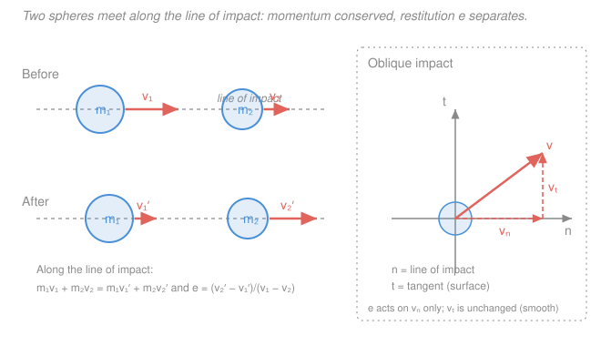

# Engineering Dynamics · Lesson 2.4: Impact

> ⏱ ~15 min · Module 2: Particle Kinetics · Builds on: [2.3 Linear impulse & momentum](02-03-linear-impulse-momentum.md), [2.2 Work, energy & power](02-02-work-energy-power.md) · Unlocks: Module 3 — Rigid-body kinematics ([3.1](03-01-rotation-instantaneous-center.md))

## Why this matters

A collision is over in milliseconds — a bat on a ball, two cars, a railcar coupling, a bullet in a block. The forces during contact are enormous and impossible to measure directly, so writing $\sum\mathbf F = m\mathbf a$ through the crunch is hopeless. But two bookkeeping facts survive the chaos: **momentum is conserved** (the contact forces are internal, equal and opposite), and a single measured number — the **coefficient of restitution** — captures how bouncy the pair is. Those two facts are enough to predict the aftermath of almost any collision. This lesson closes the particle-kinetics module by turning "what happens when things hit" into two equations.

## The idea

Picture two spheres sliding toward each other on a line. During contact each squashes the other; the push on sphere 1 from sphere 2 is exactly minus the push on sphere 2 from sphere 1 (Newton's third law). Those forces are **internal** to the pair, so they can shuffle momentum *between* the bodies but can't change the **total** — whatever the impact does, $m_1 v_1 + m_2 v_2$ comes out the same as it went in. That's your first equation, and it's ironclad.

But conservation of momentum alone can't tell the two final velocities apart — one equation, two unknowns. The missing ingredient is *how much bounce* is in the material. A superball rebounds almost perfectly; a lump of clay just sticks. We package that into one dimensionless number $e$, the **coefficient of restitution**: the ratio of how fast the bodies *separate* after to how fast they *approached* before. Real energy analysis of the deformation is a nightmare; $e$ is the one experimental number that lets us skip it. Two limits bracket everything: $e = 1$ is a perfect bounce (kinetic energy conserved), $e = 0$ is total stick (maximum energy lost). Everything real lives in between.

For a glancing (**oblique**) hit, one more idea: set up axes along and across the line joining the centers. The squash happens *along* that line, so restitution and momentum-exchange act only on that **normal** component; the sideways (**tangential**) slide is untouched for smooth bodies. An oblique impact is just a direct impact hiding inside one component.

## The formal version

Set up a coordinate line and call velocities positive in one chosen direction. Two smooth spheres of masses $m_1, m_2$ (kg) with velocities $v_1, v_2$ (m/s) before and $v_1', v_2'$ after, all measured along the **line of impact** (the line through both centers).

**Conservation of linear momentum.**

$$m_1 v_1 + m_2 v_2 = m_1 v_1' + m_2 v_2'.$$

*In words: the total momentum the pair carries in equals the total it carries out — the contact forces are internal and cancel.*

**Coefficient of restitution.**

$$e = \frac{v_2' - v_1'}{v_1 - v_2}, \qquad 0 \le e \le 1.$$

*In words: $e$ is the relative speed of separation afterward divided by the relative speed of approach before.* Numerator and denominator use the **same** ordering of the two bodies, so both are positive for a genuine collision; $e$ is a property of the two materials, not of the speeds.

These two linear equations solve for $v_1'$ and $v_2'$. It helps to rearrange restitution as $v_2' - v_1' = e\,(v_1 - v_2)$: the separation speed is $e$ times the approach speed.

**The two limits.**

- $e = 1$ — **perfectly elastic.** Separation speed equals approach speed. Kinetic energy is conserved: no energy is lost to permanent deformation. *A superball, billiard balls, gas molecules.*
- $e = 0$ — **perfectly plastic.** Separation speed is zero, so $v_1' = v_2'$: the bodies **stick and move together**. This loses the *most* kinetic energy any collision can while still conserving momentum. *Clay, a bullet embedding, railcars coupling.*

**Energy lost.** Kinetic energy is generally **not** conserved (only momentum is). Compute it directly, $\Delta T = T_{\text{before}} - T_{\text{after}}$ with $T = \tfrac12 m v^2$, or use the closed form

$$\Delta T = \tfrac12\,\frac{m_1 m_2}{m_1 + m_2}\,(1 - e^2)\,(v_1 - v_2)^2.$$

*In words: the loss grows with the approach speed squared and vanishes when $e = 1$.* The factor $\frac{m_1 m_2}{m_1+m_2}$ is the **reduced mass** — the effective mass of the relative motion.

**Oblique impact.** Resolve every velocity into a **normal** component $n$ (along the line of impact) and a **tangential** component $t$ (perpendicular to it). For smooth (frictionless) bodies:

$$\underbrace{v_{1t}' = v_{1t}, \quad v_{2t}' = v_{2t}}_{\text{tangential: unchanged}}, \qquad \underbrace{m_1 v_{1n} + m_2 v_{2n} = m_1 v_{1n}' + m_2 v_{2n}', \quad e = \frac{v_{2n}' - v_{1n}'}{v_{1n} - v_{2n}}}_{\text{normal: direct-impact equations}}.$$

*In words: nothing pushes sideways, so each body keeps its tangential speed; along the line of impact you solve the ordinary direct-impact pair.*

## Picture

## Worked examples

**Example 1 (direct central impact — solve the system, find the energy lost).** A $2\,\text{kg}$ block moving at $v_1 = 5\,\text{m/s}$ strikes a $3\,\text{kg}$ block at rest ($v_2 = 0$) head-on along a smooth track. The coefficient of restitution is $e = 0.6$. Find both final velocities and the fraction of kinetic energy lost.

*Two equations, two unknowns.* Take rightward (the direction of $v_1$) as positive.

Momentum:

$$m_1 v_1 + m_2 v_2 = m_1 v_1' + m_2 v_2' \;\Longrightarrow\; 2(5) + 0 = 2 v_1' + 3 v_2' \;\Longrightarrow\; 2 v_1' + 3 v_2' = 10. \tag{1}$$

Restitution (separation $=e\times$ approach):

$$v_2' - v_1' = e\,(v_1 - v_2) = 0.6(5 - 0) = 3. \tag{2}$$

From (2), $v_2' = v_1' + 3$. Substitute into (1): $2 v_1' + 3(v_1' + 3) = 10 \Rightarrow 5 v_1' = 1$, so

$$v_1' = 0.2\,\text{m/s}, \qquad v_2' = 3.2\,\text{m/s}.$$

Both move forward, with the struck block pulling ahead ($v_2' > v_1'$) — they separate, as they must. Now the energy:

$$T_{\text{before}} = \tfrac12(2)(5^2) = 25\,\text{J}, \qquad T_{\text{after}} = \tfrac12(2)(0.2^2) + \tfrac12(3)(3.2^2) = 0.04 + 15.36 = 15.4\,\text{J}.$$

$$\text{Fraction lost} = \frac{25 - 15.4}{25} = \frac{9.6}{25} = 0.384 = 38.4\%.$$

*Check.* The closed form: $\Delta T = \tfrac12\frac{(2)(3)}{5}(1 - 0.6^2)(5)^2 = \tfrac12(1.2)(0.64)(25) = 9.6\,\text{J}$ ✓, matching $25 - 15.4$.

**Example 2 (oblique impact — decompose along the line of impact).** A smooth sphere $A$, $m_A = 2\,\text{kg}$, moving at $10\,\text{m/s}$ strikes a stationary smooth sphere $B$, $m_B = 3\,\text{kg}$. At contact, $A$'s velocity makes an angle $\theta = 36.9^\circ$ with the line of impact (so $\cos\theta = 0.8$, $\sin\theta = 0.6$), and $e = 0.5$. Find each sphere's velocity after impact.

*Set $n$ along the line of impact, $t$ across it.* Resolve $A$'s incoming velocity:

$$v_{An} = 10\cos\theta = 10(0.8) = 8\,\text{m/s}, \qquad v_{At} = 10\sin\theta = 10(0.6) = 6\,\text{m/s}.$$

Sphere $B$ starts at rest: $v_{Bn} = v_{Bt} = 0$.

**Tangential (smooth — unchanged):** $\;v_{At}' = 6\,\text{m/s}, \quad v_{Bt}' = 0.$

**Normal (direct-impact pair):**

$$m_A v_{An} + m_B v_{Bn} = m_A v_{An}' + m_B v_{Bn}' \;\Longrightarrow\; 2(8) = 2 v_{An}' + 3 v_{Bn}' \;\Longrightarrow\; 2 v_{An}' + 3 v_{Bn}' = 16. \tag{1}$$

$$v_{Bn}' - v_{An}' = e\,(v_{An} - v_{Bn}) = 0.5(8) = 4. \tag{2}$$

From (2), $v_{Bn}' = v_{An}' + 4$; into (1): $2 v_{An}' + 3(v_{An}' + 4) = 16 \Rightarrow 5 v_{An}' = 4$, so

$$v_{An}' = 0.8\,\text{m/s}, \qquad v_{Bn}' = 4.8\,\text{m/s}.$$

Reassemble each velocity from its components:

$$v_A' = \sqrt{0.8^2 + 6^2} = \sqrt{36.64} = 6.05\,\text{m/s}, \quad \text{at } \arctan\!\frac{6}{0.8} = 82.4^\circ \text{ from the line of impact.}$$

$$v_B' = \sqrt{4.8^2 + 0^2} = 4.8\,\text{m/s}, \quad \text{straight along the line of impact.}$$

*Check.* Normal momentum after: $2(0.8) + 3(4.8) = 1.6 + 14.4 = 16$ ✓. Sphere $B$, hit by a smooth contact, can only be pushed along the line of impact — and indeed it comes off purely normal, while $A$ is deflected sideways by the tangential motion it kept.

## Watch out

- **You might think momentum conservation gives you both final velocities.** It's one equation with two unknowns — you *always* need restitution (or the stick condition $v_1' = v_2'$ for $e=0$) as the second equation.
- **Don't put kinetic energy where momentum belongs.** Momentum is conserved in *every* impact; kinetic energy is conserved *only* when $e = 1$. Reaching for "energy is conserved" in a general collision is the classic blunder — for $e < 1$ some KE is permanently lost to deformation and heat.
- **Mind the signs and the ordering in $e$.** Use one positive direction for the whole line, keep the *same* body order ($2$ minus $1$) in numerator and denominator, and let the algebra deliver negative velocities (a body that rebounds). Restitution acts on the **normal** component only — never apply it to the tangential slide.

## One-liner

> Every impact conserves momentum; the coefficient of restitution $e = \dfrac{\text{separation speed}}{\text{approach speed}}$ supplies the second equation, running from perfect bounce ($e=1$, KE conserved) to dead stick ($e=0$, most KE lost).

## Problems

**P1 (🟢)** Two pucks of equal mass $m = 0.5\,\text{kg}$ slide toward each other on frictionless ice: $v_1 = 4\,\text{m/s}$ (rightward) and $v_2 = -2\,\text{m/s}$ (leftward). They collide perfectly elastically ($e = 1$). Find both final velocities and confirm kinetic energy is conserved.

**P2 (🟡)** A $4000\,\text{kg}$ railcar rolls at $3\,\text{m/s}$ into a stationary $6000\,\text{kg}$ railcar; they couple automatically ($e = 0$). Find the common speed just after coupling and the fraction of kinetic energy lost. (This is exactly the impact model a robotics or vehicle-dynamics collision estimator uses.)

**P3 (🔴)** A $0.2\,\text{kg}$ ball strikes a smooth horizontal floor with velocity components $6\,\text{m/s}$ horizontal and $8\,\text{m/s}$ downward (speed $10\,\text{m/s}$). The floor is fixed, and $e = 0.75$ for the bounce. Find the ball's rebound velocity (magnitude and angle above the floor) and the fraction of kinetic energy lost. *Hint: the line of impact is vertical.*

Solutions

**P1.** Rightward positive. Momentum: $0.5(4) + 0.5(-2) = 0.5 v_1' + 0.5 v_2'$, so $v_1' + v_2' = 2$. Restitution ($e=1$): $v_2' - v_1' = v_1 - v_2 = 4 - (-2) = 6$. Add the two: $2 v_2' = 8 \Rightarrow v_2' = 4\,\text{m/s}$, and $v_1' = 2 - 4 = -2\,\text{m/s}$.

The pucks **swap velocities** — a signature of equal-mass elastic collisions. Energy:

$$T_{\text{before}} = \tfrac12(0.5)(4^2) + \tfrac12(0.5)(2^2) = 4 + 1 = 5\,\text{J}, \quad T_{\text{after}} = \tfrac12(0.5)(2^2) + \tfrac12(0.5)(4^2) = 1 + 4 = 5\,\text{J}.$$

Kinetic energy is conserved ✓ — exactly what $e = 1$ guarantees.

**P2.** Perfectly plastic, so the cars move together at a common speed $v'$. Momentum:

$$m_1 v_1 + m_2 v_2 = (m_1 + m_2)v' \;\Longrightarrow\; 4000(3) = 10000\,v' \;\Longrightarrow\; v' = 1.2\,\text{m/s}.$$

Energy: $T_{\text{before}} = \tfrac12(4000)(3^2) = 18000\,\text{J}$, $\;T_{\text{after}} = \tfrac12(10000)(1.2^2) = 7200\,\text{J}$.

$$\text{Fraction lost} = \frac{18000 - 7200}{18000} = \frac{10800}{18000} = 0.60 = 60\%.$$

*Check.* For a plastic hit on a stationary target, the fraction lost is $\dfrac{m_2}{m_1+m_2} = \dfrac{6000}{10000} = 0.60$ ✓. Coupling onto a heavier car dumps more energy — real couplers must absorb it.

**P3.** The floor is smooth and fixed, so the line of impact is **vertical** (normal), the floor surface is tangential.

- **Tangential (horizontal), unchanged:** $\;v_x' = 6\,\text{m/s}.$
- **Normal (vertical):** the floor is immovable, so restitution simplifies to $v_{\text{out}} = e\,v_{\text{in}}$ on the normal component: the ball arrives at $8\,\text{m/s}$ downward and leaves at $0.75(8) = 6\,\text{m/s}$ upward.

Rebound speed and angle:

$$v' = \sqrt{6^2 + 6^2} = \sqrt{72} = 8.49\,\text{m/s}, \qquad \text{angle above floor} = \arctan\!\frac{6}{6} = 45^\circ.$$

Energy: $T_{\text{before}} = \tfrac12(0.2)(10^2) = 10\,\text{J}$, $\;T_{\text{after}} = \tfrac12(0.2)(72) = 7.2\,\text{J}$.

$$\text{Fraction lost} = \frac{10 - 7.2}{10} = 0.28 = 28\%.$$

*Check.* Only the vertical component loses energy: $1 - e^2 = 1 - 0.5625 = 0.4375$ of the vertical KE ($\tfrac12(0.2)(8^2) = 6.4\,\text{J}$) is lost, i.e. $0.4375(6.4) = 2.8\,\text{J}$ ✓ — the horizontal KE rides through untouched.

## Flashback

**From Lesson 2.3 (Linear impulse & momentum — recoil):** An $800\,\text{kg}$ cannon, free to roll, fires a $5\,\text{kg}$ shell horizontally at $400\,\text{m/s}$. Find the cannon's recoil speed. (Fresh numbers; same conservation-of-momentum idea, no restitution needed.)

Solution

Before firing everything is at rest, so total momentum is zero — and no external horizontal force acts during the firing, so it stays zero. Let the shell go in the $+$ direction and the cannon recoil at $v_c$:

$$0 = m_{\text{shell}} v_{\text{shell}} + m_{\text{cannon}} v_c \;\Longrightarrow\; 0 = 5(400) + 800\,v_c \;\Longrightarrow\; v_c = -\frac{2000}{800} = -2.5\,\text{m/s}.$$

The cannon recoils at $2.5\,\text{m/s}$, opposite the shell.

*Check.* Momenta are equal and opposite: shell $5(400) = 2000\,\text{kg·m/s}$ forward, cannon $800(2.5) = 2000\,\text{kg·m/s}$ back — net zero ✓. This is the $e$-free skeleton of impact: momentum bookkeeping with nothing hitting anything.

## Connections

- **Backward:** the momentum equation *is* conservation of linear momentum from [2.3](02-03-linear-impulse-momentum.md) applied across the collision, and the energy-loss step reuses kinetic energy $T = \tfrac12 mv^2$ from [2.2](02-02-work-energy-power.md). Impact is where the whole particle-kinetics toolkit ([2.1](02-01-newtons-second-law-particles.md)–2.3) converges on one violent event.
- **Forward:** Module 3 promotes the particle to a **rigid body** — [3.1 Rotation & the instantaneous center](03-01-rotation-instantaneous-center.md) — where collisions can also spin things; the same conserved-momentum logic reappears there as conserved *angular* momentum, and the module boss problem (the ballistic pendulum) chains a plastic impact straight into the work–energy swing.
- **Sideways (mechanics-refresher, and beyond):** the $e=1$ elastic case is the collision physics behind kinetic theory of gases and Newtonian dynamics in [mechanics-refresher](../../mechanics-refresher/syllabus.md); the same restitution model governs contact events in robotics and control-systems simulators — see [robotics](../../robotics/syllabus.md) and [control-systems](../../control-systems/syllabus.md) — where a walking robot's foot-strike or a manipulator's grasp is exactly a restitution-governed impact.
