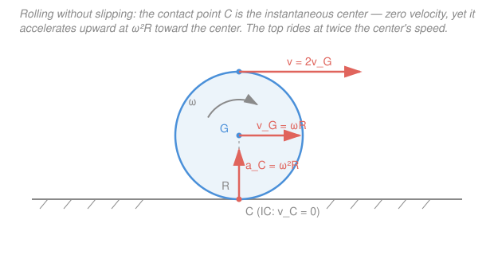

# Engineering Dynamics · Lesson 3.2: Relative acceleration & rolling

> ⏱ ~15 min · Module 3: Rigid-Body Kinematics & Kinetics (2D) · Builds on: [3.1 Rotation & the instantaneous center](03-01-rotation-instantaneous-center.md), [1.3 Normal–tangential & polar coordinates](01-03-normal-tangential-polar-coordinates.md) · Unlocks: [3.3 Mass moment of inertia](03-03-mass-moment-of-inertia.md), [3.4 Rigid-body kinetics in 2D](03-04-rigid-body-kinetics-2d.md)

## Why this matters

A car's wheel touches the road at a point that is, at that instant, standing perfectly still — that's why tires grip instead of skid. But "still" only means *zero velocity*: the same contact point is being flung upward toward the axle at a ferocious rate. Confuse those two facts and every rolling problem — a wheel, a gear, a cylinder rolling down a ramp — comes out wrong. This lesson gives you the one equation that relates the accelerations of any two points on a rigid body, and the rolling constraint that turns "no slipping" into clean algebra you'll use for the rest of the course.

## The idea

In [3.1](03-01-rotation-instantaneous-center.md) you learned that two points on a rigid body can't drift apart, so their *velocities* differ only by a rotation: $\vec v_B = \vec v_A + \boldsymbol\omega\times\vec r_{B/A}$. Acceleration is just the time-derivative of that, and it splits into two physically distinct pieces.

Picture point $B$ pinned a fixed distance from point $A$, sweeping around it. Even if $A$ were frozen, $B$'s acceleration has **two** parts, exactly the normal–tangential split from [1.3](01-03-normal-tangential-polar-coordinates.md):

- a **tangential** piece — the body is spinning *faster or slower* ($\alpha \ne 0$), so $B$ speeds up along its little circular arc. It points perpendicular to $\vec r_{B/A}$, magnitude $\alpha\,r$.
- a **centripetal** piece — even at constant spin, going in a circle requires an inward pull. It points straight from $B$ *back toward* $A$, magnitude $\omega^2 r$.

Add whatever $A$ itself is doing and you have $B$'s acceleration. That's the whole equation. The trap — and the beautiful part — is **rolling**: the contact point has zero *velocity*, but its *acceleration* is pure centripetal, pointing up into the wheel. Zero speed does not mean zero acceleration.

## The formal version

**Relative-acceleration equation.** For any two points $A$ and $B$ on the same rigid body, with angular velocity $\boldsymbol\omega$ and angular acceleration $\boldsymbol\alpha$, and $\vec r_{B/A}$ the position of $B$ measured from $A$:

$$\vec a_B = \vec a_A + \underbrace{\boldsymbol\alpha\times\vec r_{B/A}}_{\text{tangential}} + \underbrace{\boldsymbol\omega\times(\boldsymbol\omega\times\vec r_{B/A})}_{\text{centripetal}}.$$

*In words: B's acceleration equals A's, plus a term for how fast the body is spinning up, plus a term for the body already spinning.* In 2D the last term simplifies — with $\boldsymbol\omega = \omega\hat k$ out of the page, $\boldsymbol\omega\times(\boldsymbol\omega\times\vec r_{B/A}) = -\omega^2\,\vec r_{B/A}$, so

$$\boxed{\;\vec a_B = \vec a_A + \boldsymbol\alpha\times\vec r_{B/A} - \omega^2\,\vec r_{B/A}\;}$$

- **Tangential** $\boldsymbol\alpha\times\vec r_{B/A}$: magnitude $\alpha\,r$, direction perpendicular to $\vec r_{B/A}$ (the way $B$ would swing as the body angularly accelerates). Here $r = |\vec r_{B/A}|$.
- **Centripetal** $-\omega^2\,\vec r_{B/A}$: magnitude $\omega^2 r$, direction **from $B$ toward $A$** (the minus sign points it back along $\vec r_{B/A}$). This term never vanishes while the body spins, even at constant $\omega$.

*In words: to get from one point's acceleration to another's, add a sideways kick for angular speed-up and an inward kick for going in circles.*

**Rolling without slipping.** A wheel of radius $R$ rolls on a fixed surface. "No slipping" means the material point $C$ momentarily in contact has the *same velocity as the ground* — zero. So $C$ is the instantaneous center from [3.1](03-01-rotation-instantaneous-center.md), and the center $G$ (a distance $R$ from $C$) has

$$v_G = \omega R.$$

*In words: the center's speed is spin rate times radius — the wheel lays down exactly one circumference per revolution.* Because $G$ travels in a straight line, differentiating in time gives the acceleration of the center directly (only $\omega$ changes, not $R$):

$$a_G = \alpha R.$$

*In words: the center's acceleration along the ground is angular acceleration times radius — no centripetal term, because $G$ goes straight.* But the **contact point is not zero-acceleration**. Apply the relative-acceleration equation from $G$ to $C$ (with $\vec r_{C/G}$ pointing down, magnitude $R$): the tangential part $\alpha R$ exactly cancels $a_G$, and the centripetal part survives:

$$\vec a_C = \omega^2 R\ \text{(directed straight up, from }C\text{ toward }G\text{)}.$$

*In words: the point kissing the road has zero velocity but a real upward acceleration $\omega^2 R$ — it's about to be whipped up and over.*

## Picture

## Worked examples

**Example 1 (rolling wheel — the rim, point by point).** A wheel of radius $R = 0.4\,\text{m}$ rolls to the right without slipping. At this instant $\omega = 5\,\text{rad/s}$ and $\alpha = 3\,\text{rad/s}^2$. Find the acceleration of the center $G$, the contact point $C$, and the top point $T$.

Set $\hat i$ to the right, $\hat j$ up, $\hat k$ out of the page. Rolling right means the wheel spins **clockwise**, so $\boldsymbol\omega = -5\hat k$ and $\boldsymbol\alpha = -3\hat k$.

*Center.* Straight-line motion, so $a_G = \alpha R = 3(0.4) = 1.2\,\text{m/s}^2$, i.e. $\vec a_G = 1.2\,\hat i\ \text{m/s}^2$ (forward, since it's speeding up).

*Contact point $C$*, with $\vec r_{C/G} = -R\hat j = -0.4\hat j$:

$$\vec a_C = \vec a_G + \boldsymbol\alpha\times\vec r_{C/G} - \omega^2\vec r_{C/G} = 1.2\hat i + (-3\hat k)\times(-0.4\hat j) - 25(-0.4\hat j).$$

The cross product: $(-3\hat k)\times(-0.4\hat j) = 1.2(\hat k\times\hat j) = 1.2(-\hat i) = -1.2\hat i$ — it cancels $\vec a_G$. Left with $\vec a_C = 0 + 10\hat j = 10\,\hat j\,\text{m/s}^2$: **straight up, $\omega^2 R = 25(0.4) = 10\,\text{m/s}^2$**, even though $\vec v_C = 0$.

*Top point $T$*, with $\vec r_{T/G} = +R\hat j = 0.4\hat j$:

$$\vec a_T = 1.2\hat i + (-3\hat k)\times(0.4\hat j) - 25(0.4\hat j).$$

Cross product: $(-3\hat k)\times(0.4\hat j) = -1.2(\hat k\times\hat j) = -1.2(-\hat i) = +1.2\hat i$. So

$$\vec a_T = (1.2 + 1.2)\hat i - 10\hat j = 2.4\,\hat i - 10\,\hat j\ \text{m/s}^2.$$

The horizontal part is $2\alpha R = 2.4\,\text{m/s}^2$ (forward) and the vertical part is $\omega^2 R = 10\,\text{m/s}^2$ (down, toward $G$), giving $|\vec a_T| = \sqrt{2.4^2 + 10^2} = \sqrt{105.76} \approx 10.3\,\text{m/s}^2$.

*The trap:* the top point's *velocity* is $2v_G$ (it's at distance $2R$ from the instantaneous center), so you might guess its centripetal acceleration is $\omega^2(2R) = 20\,\text{m/s}^2$. **Wrong** — it's $\omega^2 R = 10$. The instantaneous center gives correct *velocities* but you cannot spin points about it for *accelerations*; the IC is itself accelerating. Always work accelerations from a real material point (here, $G$).

**Example 2 (a linkage — solving for an unknown $\alpha$).** A rigid rod $AB$ of length $5\,\text{m}$ leans in a corner: end $A$ slides along the floor, end $B$ along the wall. At the instant shown $A = (3, 0)$ and $B = (0, 4)$ (meters). The base $A$ is sliding **outward at a constant $v_A = 4\,\text{m/s}$** ($\vec a_A = 0$). Find the rod's $\omega$ and $\alpha$, and the acceleration of $B$.

*Geometry.* $\vec r_{B/A} = B - A = (-3, 4)\,\text{m}$. $A$ rides the floor so $\vec v_A = 4\hat i$, $\vec a_A = 0$; $B$ rides the wall so its velocity and acceleration are **purely vertical** ($\hat j$ only) — that constraint is what we solve for.

*Velocity first* (need $\omega$ before we can use it in acceleration). With $\boldsymbol\omega = \omega\hat k$:

$$\vec v_B = \vec v_A + \omega\hat k\times(-3\hat i + 4\hat j) = 4\hat i + \omega(-3\hat j - 4\hat i) = (4 - 4\omega)\hat i - 3\omega\,\hat j.$$

$B$ moves vertically, so the $\hat i$-component is zero: $4 - 4\omega = 0 \Rightarrow \omega = 1\,\text{rad/s}$. (Then $v_B = -3\,\text{m/s}$: $B$ slides *down* at $3\,\text{m/s}$.)

*Now acceleration.* With $\boldsymbol\alpha = \alpha\hat k$ and $\vec a_A = 0$:

$$\vec a_B = \underbrace{\alpha\hat k\times(-3\hat i + 4\hat j)}_{\text{tangential}} \underbrace{- (1)^2(-3\hat i + 4\hat j)}_{\text{centripetal}} = \alpha(-3\hat j - 4\hat i) + (3\hat i - 4\hat j).$$

$$\vec a_B = (-4\alpha + 3)\hat i + (-3\alpha - 4)\hat j.$$

$B$'s acceleration is purely vertical, so the $\hat i$-component vanishes: $-4\alpha + 3 = 0 \Rightarrow \alpha = 0.75\,\text{rad/s}^2$. Substituting back, $\vec a_B = (-3(0.75) - 4)\hat j = -6.25\,\hat j\,\text{m/s}^2$ — point $B$ accelerates **downward at $6.25\,\text{m/s}^2$**. The centripetal term ($\omega^2 r$, pointing from $B$ back toward $A$) is what forced $\alpha$ to be nonzero even though $A$ moves at constant speed.

## Watch out

- **You might think the contact point has zero acceleration because it has zero velocity.** It doesn't. $\vec v_C = 0$ (it's the instantaneous center), but $\vec a_C = \omega^2 R$ points straight up toward the axle. Velocity and acceleration are independent — a point can be momentarily at rest and still accelerating hard.
- **You might reuse the instantaneous center for accelerations.** The IC nails *velocities* ($v = \omega d$ from the IC), but it is a *different* geometric point each instant and is itself accelerating, so "spin everything about the IC" gives wrong accelerations. Always base the relative-acceleration equation on a genuine material point whose $\vec a$ you know (like the center $G$).
- **You might forget the centripetal term, or mis-aim it.** $-\omega^2\vec r_{B/A}$ always points from $B$ *toward* $A$ (inward), magnitude $\omega^2 r$ — not perpendicular. The perpendicular one is the tangential $\alpha r$ term. Dropping the centripetal term is the single most common rigid-body-acceleration mistake.

## One-liner

> Two points on a rigid body differ in acceleration by a tangential kick $\alpha r$ (perpendicular) plus a centripetal pull $\omega^2 r$ (inward) — and in rolling, the contact point's velocity is zero but its acceleration is $\omega^2 R$ straight up.

## Problems

**P1 (🟢)** A disk of radius $R = 0.3\,\text{m}$ rolls without slipping. At an instant $\omega = 4\,\text{rad/s}$ and $\alpha = 2\,\text{rad/s}^2$. Find (a) the speed $v_G$ of the center, (b) the acceleration $a_G$ of the center, and (c) the acceleration of the point momentarily in contact with the ground. Is that last one zero?

**P2 (🟡)** A rigid bar $AB$ of length $0.5\,\text{m}$ lies along the $+\hat i$ direction, so $\vec r_{B/A} = 0.5\hat i$. At this instant the bar has $\omega = 4\,\text{rad/s}$ and $\alpha = 6\,\text{rad/s}^2$ (both about $+\hat k$), and end $A$ has acceleration $\vec a_A = 2\hat i\,\text{m/s}^2$. Find $\vec a_B$ and its magnitude. Identify which piece is tangential and which is centripetal.

**P3 (🔴)** Same corner rod as Example 2 — $A = (3,0)$ on the floor, $B = (0,4)$ on the wall, length $5\,\text{m}$ — but now the base is yanked out **twice as fast**, $v_A = 8\,\text{m/s}$ (still constant, $\vec a_A = 0$). Find $\omega$, $\alpha$, and $\vec a_B$. Compared with Example 2, by what factor did each change, and why? (This "two-slider" rod is exactly a 2-link mechanism from robotics — see Connections.)

Solutions

**P1** Rolling constraints, directly:

$$v_G = \omega R = 4(0.3) = 1.2\,\text{m/s}, \qquad a_G = \alpha R = 2(0.3) = 0.6\,\text{m/s}^2.$$

The contact point is the instantaneous center, so its *velocity* is zero — but its *acceleration* is the surviving centripetal term:

$$a_C = \omega^2 R = 4^2(0.3) = 16(0.3) = 4.8\,\text{m/s}^2,\ \text{directed straight up toward the center.}$$

So **no, it is not zero.** *Check:* the tangential contribution at $C$ is $\alpha R = 0.6\,\text{m/s}^2$, which exactly cancels $a_G = 0.6$ (they're equal and opposite along the ground), leaving only the upward $4.8\,\text{m/s}^2$. ✓

**P2** Plug straight into $\vec a_B = \vec a_A + \boldsymbol\alpha\times\vec r_{B/A} - \omega^2\vec r_{B/A}$:

$$\vec a_B = 2\hat i + \underbrace{6\hat k\times 0.5\hat i}_{\text{tangential}} - \underbrace{4^2(0.5\hat i)}_{\text{centripetal}} = 2\hat i + 3\hat j - 8\hat i = -6\hat i + 3\hat j\ \text{m/s}^2.$$

- Tangential: $6\hat k\times 0.5\hat i = 3\hat j\,\text{m/s}^2$ (magnitude $\alpha r = 6(0.5) = 3$, perpendicular to the rod, as it should be).
- Centripetal: $-16(0.5)\hat i = -8\hat i\,\text{m/s}^2$ (magnitude $\omega^2 r = 16(0.5) = 8$, pointing from $B$ back toward $A$ along $-\hat i$).

Magnitude: $|\vec a_B| = \sqrt{(-6)^2 + 3^2} = \sqrt{45} \approx 6.7\,\text{m/s}^2$. *Check:* the centripetal $8\,\text{m/s}^2$ dominates the along-rod direction, dragging $B$'s net acceleration back toward $A$ — exactly what "going in a circle" demands. ✓

**P3** Same geometry: $\vec r_{B/A} = (-3, 4)$, $A$ horizontal, $B$ vertical.

*Velocity:* $\vec v_B = 8\hat i + \omega(-3\hat j - 4\hat i) = (8 - 4\omega)\hat i - 3\omega\hat j$. Vertical constraint $\Rightarrow 8 - 4\omega = 0 \Rightarrow \omega = 2\,\text{rad/s}$.

*Acceleration:* $\vec a_B = \alpha(-3\hat j - 4\hat i) - (2)^2(-3\hat i + 4\hat j) = (-4\alpha + 12)\hat i + (-3\alpha - 16)\hat j$. Vertical constraint $\Rightarrow -4\alpha + 12 = 0 \Rightarrow \alpha = 3\,\text{rad/s}^2$. Then

$$\vec a_B = (-3(3) - 16)\hat j = -25\,\hat j\ \text{m/s}^2\quad(\text{down at } 25\,\text{m/s}^2).$$

*Factors:* $\omega$ **doubled** ($1 \to 2$), because $\omega \propto v_A$. But $\alpha$ went $0.75 \to 3$ (**×4**) and $|a_B|$ went $6.25 \to 25$ (**×4**). Reason: with $\vec a_A = 0$, the only thing driving the acceleration is the centripetal term $\omega^2 r$, and $\omega^2 \propto v_A^2$ — so doubling the base speed quadruples every acceleration. *Check:* $\omega = 2$ back in the velocity gives $v_B = -3\omega = -6\,\text{m/s}$, twice Example 2's $-3\,\text{m/s}$ — velocities scale linearly, accelerations quadratically. ✓

## Flashback

**From [3.1](03-01-rotation-instantaneous-center.md) (instantaneous center):** A wheel of radius $R = 0.5\,\text{m}$ rolls without slipping to the right with its center moving at $v_G = 4\,\text{m/s}$. Using the instantaneous center, find the wheel's angular speed $\omega$ and the *velocity* (magnitude and direction) of the point $P$ at the front of the rim — the 3-o'clock position, level with the center.

Solution

The contact point is the instantaneous center (IC), so $\omega = v_G / R = 4 / 0.5 = 8\,\text{rad/s}$.

Point $P$ sits at the 3-o'clock rim position: horizontally $R$ from the center and $R$ above the IC, so its distance from the IC is $d = \sqrt{R^2 + R^2} = R\sqrt2 = 0.5\sqrt2 \approx 0.707\,\text{m}$. Every point moves at $v = \omega d$ about the IC:

$$v_P = \omega\, d = 8(0.5\sqrt2) = 4\sqrt2 \approx 5.66\,\text{m/s}.$$

Direction: velocity is perpendicular to the line from the IC to $P$. That line runs up-and-forward at $45^\circ$, so $v_P$ points **up and forward at $45^\circ$ above the horizontal** (the wheel is carrying $P$ up over the top). *Check:* the top point ($d = 2R$) would give $v = \omega(2R) = 8\,\text{m/s} = 2v_G$, matching the "top runs at twice the center" fact — and $P$, being closer to the IC, sensibly moves slower. ✓ (This is the velocity picture; the *acceleration* of $P$ would need this lesson's relative-acceleration equation, not the IC.)

## Connections

- **Backward:** this is the acceleration companion to [3.1](03-01-rotation-instantaneous-center.md)'s velocity equation — differentiate $\vec v_B = \vec v_A + \boldsymbol\omega\times\vec r_{B/A}$ and the tangential/centripetal split appears. The two terms are literally the $a_t$ (speeding up) and $a_n = v^2/\rho = \omega^2 r$ (turning) decomposition from [1.3](01-03-normal-tangential-polar-coordinates.md), now applied point-to-point on a body.
- **Forward:** [3.3](03-03-mass-moment-of-inertia.md) supplies $I_G$ and [3.4](03-04-rigid-body-kinetics-2d.md) uses today's $a_G = \alpha R$ together with $\sum\mathbf F = m\mathbf a_G$ and $\sum M_G = I_G\alpha$ to solve the module's boss problem — a cylinder rolling down an incline, where the rolling constraint is the extra equation that makes the system solvable.
- **Sideways (robotics):** the corner rod in Examples 2 and P3 is a two-link kinematic chain — end $A$ and end $B$ constrained to lines, the rod's $\omega$ and $\alpha$ set by the constraints. Solving for joint accelerations from end-effector constraints is exactly inverse-kinematics-at-the-acceleration-level, the core computation in the robotics track (which the [statics](../../statics/syllabus.md) prequel and this course both feed).
