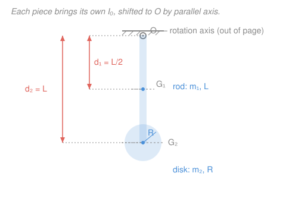

# Engineering Dynamics · Lesson 3.3: Mass moment of inertia

> ⏱ ~15 min · Module 3: Rigid-Body Kinematics & Kinetics (2D) · Builds on: [3.2 Relative acceleration & rolling](03-02-relative-acceleration-rolling.md), integration ([`calc-refresher` syllabus](../../calc-refresher/syllabus.md)) · Unlocks: [3.4 Rigid-body kinetics in 2D](03-04-rigid-body-kinetics-2d.md)

## Why this matters

Roll a solid disk and a hollow ring of the *same mass and radius* down a ramp — the ring loses. Same weight, same size, but the ring keeps its mass out at the rim where it's harder to get spinning, so more of the ramp's energy goes into rotation and less into speed. That "how hard is this to spin up" number is the **mass moment of inertia** $I$, and it's the last piece you need before Newton's law for rotation ([3.4](03-04-rigid-body-kinetics-2d.md)): torque equals $I$ times angular acceleration, exactly like force equals mass times acceleration. Flywheels, turbine rotors, a figure skater pulling her arms in to spin faster — all of it is bookkeeping on $I$.

## The idea

For straight-line motion, mass $m$ measures how hard it is to speed something up: push with force $F$, get acceleration $a = F/m$. Big mass, sluggish response. Spinning is the same story with one twist: **where the mass sits matters, not just how much there is.**

Picture swinging a hammer. Grip it by the handle and it's a chore to whip around — the heavy head is far from your wrist. Choke up near the head and it flicks easily, even though it's the identical hammer. Nothing changed but the *distance from the axis*. Mass far from the spin axis fights angular acceleration much harder than mass hugging the axis, and the penalty grows with the **square** of the distance: move a chunk of mass twice as far out and it resists four times as much. That $r^2$ weighting is the entire concept. Add it up over the whole body and you have $I$.

## The formal version

**Definition.** For a body spinning about a fixed axis, the mass moment of inertia is

$$I = \int r^2\,dm,$$

where $dm$ is a tiny mass element (kg) and $r$ is its **perpendicular distance to the rotation axis** (m). Units: $\text{kg}\cdot\text{m}^2$. *In words: chop the body into specks, weight each speck's mass by the square of its distance from the axis, and sum.* Because of the square, $I$ can never be negative, and mass near the axis barely counts.

**Standard results** (memorize these four — everything else is built from them). Each is about the axis shown, through the mass center $G$:

| Body | Axis | $I_G$ |
|---|---|---|
| Slender rod, length $L$ | $\perp$ rod, through center | $\tfrac{1}{12}mL^2$ |
| Solid disk / cylinder, radius $R$ | along symmetry axis | $\tfrac12 mR^2$ |
| Thin ring / hoop, radius $R$ | along symmetry axis | $mR^2$ |
| Solid sphere, radius $R$ | any diameter | $\tfrac25 mR^2$ |

Notice the ring ($mR^2$) beats the disk ($\tfrac12 mR^2$): same mass and radius, but all the ring's mass rides at the maximum $r$, so it has *twice* the inertia. That's the ramp race.

**Radius of gyration.** Define

$$k = \sqrt{\frac{I}{m}} \qquad\Longleftrightarrow\qquad I = mk^2.$$

*In words: $k$ is the single distance at which you could park the entire mass — as one point — to get the same $I$.* It's a compact way to report inertia (handbooks list $k$, not $I$) and a quick sanity check: $k$ must land somewhere inside the body's extent.

**Parallel-axis theorem.** Once you know $I_G$ about an axis through the mass center, the inertia about any *parallel* axis a distance $d$ away is

$$\boxed{\,I = I_G + m d^2\,}$$

*In words: shifting the spin axis away from the mass center always adds $md^2$ — never less.* The mass center is the cheapest place to spin about; every other parallel axis costs you $md^2$ more. This is the workhorse: it turns the four table entries into inertia about *any* axis.

**Composite bodies.** Inertia is additive. Break a machine part into standard pieces, carry each to the common axis with parallel-axis, and sum:

$$I = \sum_i \left( I_{G,i} + m_i d_i^2 \right),$$

and **subtract** the term for any hole (a hole is negative mass). *In words: add up the pieces about the shared axis; drilled-out regions get subtracted.*

**Cousin from statics — don't confuse them.** In [`statics` 4.3](../../statics/syllabus.md) you met the **area** moment of inertia $\int y^2\,dA$ (units $\text{m}^4$), which measures a cross-section's resistance to *bending*. Same parallel-axis machinery ($I = \bar I + A d^2$), same $r^2$-weighting instinct — but the integrand is $y^2\,dA$ (geometry of an area), not $r^2\,dm$ (distribution of mass). One resists bending a beam; this one resists spinning a body. Same name, different physics, different units.

## Picture

## Worked examples

**Example 1 (the move: rod about its end).** A slender rod of mass $m$, length $L$, spins about an axis through **one end** (perpendicular to the rod). We know $I_G = \tfrac{1}{12}mL^2$ about the center. The end is a distance $d = L/2$ from the center, so parallel-axis gives

$$I_{\text{end}} = I_G + m d^2 = \tfrac{1}{12}mL^2 + m\left(\tfrac{L}{2}\right)^2 = \tfrac{1}{12}mL^2 + \tfrac14 mL^2 = \tfrac{1}{12}mL^2 + \tfrac{3}{12}mL^2 = \tfrac13 mL^2.$$

*Verify by integration.* Put the origin at the end, coordinate $x$ running $0 \to L$. The rod has linear density $m/L$, so $dm = \tfrac{m}{L}\,dx$ and each speck sits $r = x$ from the axis:

$$I_{\text{end}} = \int_0^L x^2\,\frac{m}{L}\,dx = \frac{m}{L}\cdot\frac{x^3}{3}\Big|_0^L = \frac{m}{L}\cdot\frac{L^3}{3} = \tfrac13 mL^2. \checkmark$$

The theorem and the integral agree — and the theorem was three lines instead of a setup.

**Example 2 (composite: the compound pendulum in the figure).** A slender rod, $m_1 = 3\,\text{kg}$, $L = 1.2\,\text{m}$, is pinned at $O$. A solid disk, $m_2 = 5\,\text{kg}$, $R = 0.2\,\text{m}$, is fixed to the rod's lower tip with its center there. Find $I_O$ about the pivot (axis out of the page).

*Rod, about $O$ (its end).* Straight from Example 1:

$$I_{1,O} = \tfrac13 m_1 L^2 = \tfrac13 (3)(1.2)^2 = \tfrac13(3)(1.44) = 1.44\,\text{kg}\cdot\text{m}^2.$$

*Disk, about $O$.* Its centroidal inertia is $I_{G} = \tfrac12 m_2 R^2$, and its center sits $d_2 = L = 1.2\,\text{m}$ from $O$. Parallel-axis:

$$I_{2,O} = \tfrac12 m_2 R^2 + m_2 d_2^2 = \tfrac12(5)(0.2)^2 + (5)(1.2)^2 = 0.10 + 7.20 = 7.30\,\text{kg}\cdot\text{m}^2.$$

*Sum.*

$$I_O = I_{1,O} + I_{2,O} = 1.44 + 7.30 = 8.74\,\text{kg}\cdot\text{m}^2.$$

Radius of gyration about $O$, with total mass $m = 8\,\text{kg}$: $k_O = \sqrt{I_O/m} = \sqrt{8.74/8} = \sqrt{1.093} \approx 1.05\,\text{m}$ — just past the disk, which passes the sanity check (most of the inertia lives in that far disk). Notice the disk's *own* spin term ($0.10$) is dwarfed by its transport term ($7.20$): distance dominates.

## Watch out

- **You might use distance to a *point* — but $r$ is the perpendicular distance to the *axis*.** For a 2D body spun about an out-of-page axis at $O$, that's the straight-line distance from $O$ in the plane; but for a 3D axis, drop a perpendicular *onto the axis line*, not to a chosen origin.
- **You might chain parallel-axis between two off-center axes by just adding $md^2$ — you can't.** The theorem only runs *from the centroidal axis*. To go from axis A to axis B (neither through $G$), first come back to $G$ ($I_G = I_A - m d_A^2$), then push out ($I_B = I_G + m d_B^2$). Adding $md^2$ blindly double-counts.
- **You might report $I_G$ for a piece and forget to transport it.** In a composite, every piece needs its $m_i d_i^2$ term measured to the *common* axis — even a piece whose center is far off. Dropping the transport term (as with the disk above) throws the answer off by an order of magnitude.

## One-liner

> Mass resists a push as $m$; a body resists a spin as $I=\int r^2\,dm$ — same idea, but distance-from-the-axis-squared means where the mass sits beats how much there is, and parallel-axis $I=I_G+md^2$ carries any piece to any axis.

## Problems

**P1 (🟢)** A uniform solid disk has mass $m = 4\,\text{kg}$ and radius $R = 0.3\,\text{m}$. Find its moment of inertia (a) about the axis through its center, perpendicular to the disk, and (b) about a parallel axis tangent to its rim. What is the radius of gyration about the tangent axis?

**P2 (🟡)** A "barbell": a slender rod of mass $2\,\text{kg}$ and length $L = 1.0\,\text{m}$ carries a solid sphere of mass $3\,\text{kg}$ and radius $0.1\,\text{m}$ fixed at *each* end (each sphere's center at a rod tip). Find $I$ about the axis through the barbell's center, perpendicular to the rod. How much would you have missed by treating the spheres as point masses?

**P3 (🔴, optional — bridge to vibration)** The compound pendulum of Example 2 ($I_O = 8.74\,\text{kg}\cdot\text{m}^2$, total mass $m = 8\,\text{kg}$) swings under gravity. A physical pendulum's small-oscillation period is $T = 2\pi\sqrt{I_O/(mg\,d_G)}$, where $d_G$ is the distance from the pivot $O$ to the mass center $G$ (this is the rigid-body cousin of the simple-pendulum formula from mechanics-refresher). Locate $G$, then find $T$. Use $g = 9.81\,\text{m/s}^2$.

Solutions

**P1** (a) Standard disk about its center: $I_G = \tfrac12 mR^2 = \tfrac12(4)(0.3)^2 = \tfrac12(4)(0.09) = 0.18\,\text{kg}\cdot\text{m}^2.$

(b) A tangent axis is parallel to the central axis, a distance $d = R = 0.3\,\text{m}$ away. Parallel-axis:

$$I_{\text{tan}} = I_G + m d^2 = 0.18 + (4)(0.3)^2 = 0.18 + 0.36 = 0.54\,\text{kg}\cdot\text{m}^2.$$

Radius of gyration: $k_{\text{tan}} = \sqrt{I_{\text{tan}}/m} = \sqrt{0.54/4} = \sqrt{0.135} \approx 0.367\,\text{m}.$

*Check.* $k_{\text{tan}} > R$, as it must be for an axis outside the mass center. The transport term ($0.36$) is double the centroidal term ($0.18$), so spinning about the rim costs three times the central inertia — sensible. ✓

**P2** By symmetry the axis through the center is centroidal for the rod, and each sphere's center sits $d = L/2 = 0.5\,\text{m}$ from it.

Rod about its center: $I_{\text{rod}} = \tfrac{1}{12}mL^2 = \tfrac{1}{12}(2)(1.0)^2 = 0.1667\,\text{kg}\cdot\text{m}^2.$

Each sphere, transported to the center: $I_{\text{sph}} = \tfrac25 m R^2 + m d^2 = \tfrac25(3)(0.1)^2 + (3)(0.5)^2 = \tfrac25(3)(0.01) + (3)(0.25) = 0.012 + 0.75 = 0.762\,\text{kg}\cdot\text{m}^2.$

Two spheres plus the rod:

$$I = 0.1667 + 2(0.762) = 0.1667 + 1.524 = 1.691\,\text{kg}\cdot\text{m}^2 \approx 1.69\,\text{kg}\cdot\text{m}^2.$$

Point-mass treatment drops each sphere's own $\tfrac25 mR^2 = 0.012$ term, giving $0.1667 + 2(0.75) = 1.667\,\text{kg}\cdot\text{m}^2$. The error is $2(0.012) = 0.024\,\text{kg}\cdot\text{m}^2$, about **1.4 %** — negligible here because the spheres are small and far out ($d \gg R$). That's *why* the point-mass shortcut is often fine: the $md^2$ transport term swamps the compact $\tfrac25 mR^2$ term.

*Check.* Inertia grew from the bare rod's $0.167$ to $1.69$ once the end masses were added — a tenfold jump, all from the $md^2$ terms. Distance dominates. ✓

**P3** Locate $G$ by the weighted average of the pieces' centers, measured from $O$. Rod center at $L/2 = 0.6\,\text{m}$ (mass $3\,\text{kg}$); disk center at $L = 1.2\,\text{m}$ (mass $5\,\text{kg}$):

$$d_G = \frac{m_1(0.6) + m_2(1.2)}{m_1 + m_2} = \frac{3(0.6) + 5(1.2)}{8} = \frac{1.8 + 6.0}{8} = \frac{7.8}{8} = 0.975\,\text{m}.$$

Now the period:

$$T = 2\pi\sqrt{\frac{I_O}{mg\,d_G}} = 2\pi\sqrt{\frac{8.74}{(8)(9.81)(0.975)}} = 2\pi\sqrt{\frac{8.74}{76.52}} = 2\pi\sqrt{0.1142} = 2\pi(0.3380) \approx 2.12\,\text{s}.$$

*Check.* An idealized *simple* pendulum of length $d_G = 0.975\,\text{m}$ would give $T = 2\pi\sqrt{d_G/g} = 2\pi\sqrt{0.0994} \approx 1.98\,\text{s}$. The real body swings a touch slower (2.12 s) because its mass is spread out, raising $I_O$ above the point-mass value $m d_G^2 = 8(0.975)^2 = 7.61$ — the extra spin inertia lengthens the period, exactly as intuition says. ✓

## Flashback

**From Lesson 3.2 (Relative acceleration & rolling):** A wheel of radius $R = 0.4\,\text{m}$ rolls without slipping. At an instant its center $G$ moves at $v_G = 6\,\text{m/s}$ and is accelerating at $a_G = 2\,\text{m/s}^2$. Find (a) the angular velocity $\omega$ and angular acceleration $\alpha$, (b) the speed of the point at the top of the wheel, and (c) the acceleration of the contact point touching the ground.

Solution

(a) Rolling without slipping ties center motion to spin: $v_G = \omega R$ and $a_G = \alpha R$, so

$$\omega = \frac{v_G}{R} = \frac{6}{0.4} = 15\,\text{rad/s}, \qquad \alpha = \frac{a_G}{R} = \frac{2}{0.4} = 5\,\text{rad/s}^2.$$

(b) The contact point is the instantaneous center of zero velocity, so every point's speed is $\omega \times$ (its distance from contact). The top point is $2R$ above the ground:

$$v_{\text{top}} = \omega(2R) = 15(0.8) = 12\,\text{m/s} = 2 v_G. \checkmark$$

(c) The trap: the contact point has zero *velocity* but **not** zero *acceleration*. Using $\vec a_C = \vec a_G + \vec\alpha \times \vec r_{C/G} + \vec\omega\times(\vec\omega\times\vec r_{C/G})$, the tangential piece $\alpha R = 2\,\text{m/s}^2$ (backward) exactly cancels $a_G$ (forward), leaving only the centripetal term pointing from the contact up toward the center:

$$a_C = \omega^2 R = (15)^2(0.4) = 90\,\text{m/s}^2 \ \text{(directed upward, toward } G).$$

*Check.* The contact point momentarily has no velocity, yet it's being flung upward at $90\,\text{m/s}^2$ — it's instantaneously at rest but changing direction violently, which is why a rolling wheel doesn't skid. ✓

## Connections

- **Backward:** the $r^2$-weighted sum is just the [3.2](03-02-relative-acceleration-rolling.md) geometry of "distance from the axis" turned into an integral; and the definition $I=\int r^2\,dm$ is the same distributed-quantity bookkeeping you used for centroids in statics, now with $r^2$ instead of $r$.
- **Forward:** [3.4 Rigid-body kinetics in 2D](03-04-rigid-body-kinetics-2d.md) plugs this straight into $\sum M_G = I_G\alpha$ — the rotational $F=ma$ — and the vibration lessons ([4.1](04-01-free-vibration-undamped-damped.md)) use $I_O$ for physical-pendulum and torsional oscillators, as previewed in P3.
- **Sideways (statics ↔ robotics):** the parallel-axis theorem is shared verbatim with the *area* moment of inertia in [`statics` 4.3](../../statics/syllabus.md) (bending resistance, $\int y^2\,dA$) — same shift, different integrand. And in robotics, $I$ about a joint is the "reflected inertia" a motor must overcome to accelerate a link, the rotational twin of the mass a linear actuator pushes.
