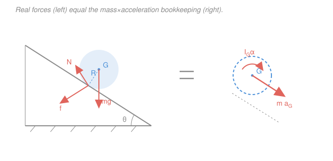

# Engineering Dynamics · Lesson 3.4: Rigid-Body Kinetics in 2D

> ⏱ ~15 min · Module 3: Rigid-Body Kinematics & Kinetics (2D) · Builds on: [3.3 Mass moment of inertia](03-03-mass-moment-of-inertia.md), [3.2 Relative acceleration & rolling](03-02-relative-acceleration-rolling.md) · Unlocks: [4.1 Free vibration](04-01-free-vibration-undamped-damped.md)

## Why this matters

A wheel rolling downhill, a robot arm swinging under gravity, a car spinning out — none of these are particles. They *translate* and *spin* at the same time, and a point-mass $\sum\vec F = m\vec a$ can't capture the spin. This lesson hands you the second half of the machine: an equation for rotation that runs in parallel with the one for translation. Together they are the workhorse of every powertrain, gearbox, and vibrating structure you'll ever analyze — and they close Module 3, so you can finally solve the cylinder-on-a-ramp problem completely.

## The idea

A rigid body has two ways to accelerate, and they are *independent*.

Its **mass center** $G$ moves as if every external force were slid onto a single point-mass sitting there — that's the translation half, and it's just Newton's law from [2.1](02-01-newtons-second-law-particles.md) with $\vec a$ renamed $\vec a_G$. Separately, the body can **spin faster or slower**, and what resists that is not the mass but the mass *moment of inertia* $I_G$ from [3.3](03-03-mass-moment-of-inertia.md) — inertia's rotational cousin. The thing that changes the spin is **torque** (moment). More torque, more angular acceleration; more $I_G$, less.

So you get two bookkeeping ledgers running side by side: forces drive the *linear* acceleration of $G$, moments drive the *angular* acceleration $\alpha$. The whole art of 2D rigid-body kinetics is writing both ledgers and — when the body both rolls and moves — using a **kinematic constraint** like $a_G = R\alpha$ to lock them together.

The cleanest way to picture it: draw the real forces on the left (the **free-body diagram**), and on the right draw the *effects* they must produce — a vector $m\vec a_G$ through the center and a couple $I_G\alpha$ (the **kinetic diagram**). The two sides are equal. That's the whole lesson.

## The formal version

For a rigid body of mass $m$ moving in a plane, with mass center $G$, the **three scalar equations of plane motion** are

$$\sum F_x = m\,a_{Gx}, \qquad \sum F_y = m\,a_{Gy}, \qquad \sum M_G = I_G\,\alpha.$$

*In words: the net force pushes the mass center exactly as if all the mass were concentrated there; the net moment about the mass center spins the body, opposed by its rotational inertia $I_G$.*

Here $\vec a_G = (a_{Gx}, a_{Gy})$ is the acceleration of the mass center (m/s²), $I_G$ is the mass moment of inertia about the axis through $G$ perpendicular to the plane (kg·m²), and $\alpha = \ddot\theta$ is the angular acceleration (rad/s²), positive in the same rotational sense you choose for moments. Three equations, so you can solve for at most three unknowns.

Every plane-motion problem is one of three cases:

- **Pure translation** ($\alpha = 0$): the body moves without rotating, so $\sum M_G = 0$. Every point has the same $\vec a_G$. (A crate sliding, a car braking straight.)
- **Fixed-axis rotation** about a pivot $O$: the body spins about a fixed point. You *may* still use the $G$-equations, but it's almost always cleaner to take moments about the pivot itself:
$$\sum M_O = I_O\,\alpha, \qquad I_O = I_G + m d^2,$$
where $d$ is the distance from $G$ to $O$ (that's the parallel-axis theorem from [3.3](03-03-mass-moment-of-inertia.md)). *In words: sum moments about the pin and the unknown pin reaction drops out, because it has no moment arm about itself.*
- **General plane motion**: translation *and* rotation together. Use all three equations, and supply a **kinematic constraint** relating $a_G$ and $\alpha$ — for rolling without slipping that constraint is $a_G = R\alpha$ (from [3.2](03-02-relative-acceleration-rolling.md)).

**The rolling-without-slipping subtlety.** When a wheel rolls without slipping, the friction force $f$ at the contact point is *not* $\mu_s N$. It is whatever value the equations demand — an unknown you solve for — and it is only *bounded* by the static limit:

$$f \le \mu_s N.$$

*In words: static friction is a "do-whatever-it-takes" force; you find it from the motion, then check afterward that the ground could actually supply it.* If the required $f$ exceeds $\mu_s N$, the wheel slips and $a_G = R\alpha$ no longer holds.

## Picture

The equals sign is literal: $\sum(\text{forces}) = m\vec a_G$ and $\sum(\text{moments about }G) = I_G\alpha$. Notice $N$ and the weight both pass through the geometric center, so about $G$ only friction $f$ has a moment arm — that single fact is what makes the cylinder problem solvable.

## Worked examples

**Example 1 — the capstone: cylinder rolling without slipping down an incline.** A uniform solid cylinder of mass $m$, radius $R$, released on an incline of angle $\theta$. Find the acceleration of its center $a_G$, the friction force $f$, and the minimum $\mu_s$ that keeps it rolling. Use $I_G = \tfrac12 mR^2$.

*Set up.* Take axes along and normal to the incline, down-slope positive. From the FBD above: gravity component $mg\sin\theta$ down the slope, normal $N$, friction $f$ up the slope (it opposes the tendency to slip). Rolling without slipping gives the constraint $a_G = R\alpha$.

*Translation, along the slope:*
$$mg\sin\theta - f = m\,a_G. \tag{1}$$

*Rotation about $G$.* Only $f$ has a moment arm about $G$ (weight and $N$ pass through the center). Its moment $fR$ spins the cylinder, so
$$\sum M_G = fR = I_G\,\alpha = \tfrac12 mR^2\cdot\frac{a_G}{R} = \tfrac12 mR\,a_G \;\;\Longrightarrow\;\; f = \tfrac12 m\,a_G. \tag{2}$$

*Combine.* Put (2) into (1):
$$mg\sin\theta - \tfrac12 m a_G = m a_G \;\Longrightarrow\; g\sin\theta = \tfrac32 a_G \;\Longrightarrow\; \boxed{a_G = \tfrac23 g\sin\theta.}$$

Then from (2), $f = \tfrac12 m a_G = \boxed{\tfrac13 mg\sin\theta}$.

*The friction check.* With $N = mg\cos\theta$ (normal direction has no acceleration), no-slip needs $f \le \mu_s N$:
$$\tfrac13 mg\sin\theta \le \mu_s\, mg\cos\theta \;\Longrightarrow\; \boxed{\mu_s \ge \tfrac13\tan\theta.}$$

*Sanity checks.* A frictionless block would slide at $g\sin\theta$; the rolling cylinder does only $\tfrac23 g\sin\theta$, slower — correct, because some gravitational energy goes into *spin*, not just translation. And the elegant cross-check: take moments about the **contact point** $C$ instead, where friction and normal both vanish and only gravity acts, with $I_C = I_G + mR^2 = \tfrac32 mR^2$:
$$mg\sin\theta\cdot R = I_C\alpha = \tfrac32 mR^2\frac{a_G}{R} \;\Longrightarrow\; a_G = \tfrac23 g\sin\theta.\;\checkmark$$
Same answer, no friction unknown — that's the payoff of picking a smart moment center. Numerically, at $\theta = 30^\circ$: $a_G = \tfrac23(9.81)(0.5) = 3.27\,\text{m/s}^2$ and $\mu_s \ge \tfrac13\tan 30^\circ = 0.19$.

**Example 2 — fixed-axis rotation: a rod released from horizontal.** A uniform slender rod of mass $m = 2\,\text{kg}$, length $L = 0.9\,\text{m}$, is pinned at one end $O$ and released from rest in the horizontal position. Find the angular acceleration $\alpha$ at the instant of release and the pin reaction there.

*Moment about the pin.* Only gravity has a moment about $O$; the pin reaction acts *at* $O$, so it has zero arm — the whole reason to sum moments there. The weight $mg$ acts at $G$, a distance $L/2$ away, and for a rod pinned at its end $I_O = \tfrac13 mL^2$:
$$\sum M_O = mg\cdot\frac{L}{2} = I_O\,\alpha = \tfrac13 mL^2\,\alpha \;\Longrightarrow\; \alpha = \frac{3g}{2L} = \frac{3(9.81)}{2(0.9)} = 16.4\,\text{rad/s}^2.$$
The mass cancels — every uniform rod of the same length falls at the same $\alpha$.

*Pin reaction.* At release $\omega = 0$, so the center's acceleration is purely tangential (downward): $a_G = \frac{L}{2}\alpha = \frac{3g}{4} = 7.36\,\text{m/s}^2$. Now use the translation equations at $G$. Horizontal: $\omega = 0$ means $a_{Gx} = 0$, so $O_x = 0$. Vertical (down positive):
$$mg - O_y = m\,a_G = m\cdot\tfrac34 g \;\Longrightarrow\; O_y = \tfrac14 mg = \tfrac14(2)(9.81) = 4.9\,\text{N (up).}$$
The pin carries only a quarter of the weight at the instant of release — the other three-quarters is "spent" accelerating the rod. That surprising fraction is exactly why you can't treat a swinging body as if it hangs in static equilibrium.

## Watch out

- **You might forget the $m\vec a_G$ side entirely and write $\sum F = 0$.** That's *statics*. The instant the body accelerates, the right-hand side is nonzero — draw the kinetic diagram so you never leave it out.
- **You might set $f = \mu_s N$ for a rolling wheel.** Only when it's *on the verge* of slipping. For rolling-without-slipping, $f$ is an unknown you solve for; $\mu_s N$ is just the ceiling you check against afterward. Plugging $\mu_s N$ in from the start will give a wrong $a_G$.
- **You might sum moments about $G$ but use $I_O$ (or vice versa).** The inertia must match the point you took moments about. $\sum M_G$ pairs with $I_G$; $\sum M_O$ pairs with $I_O = I_G + md^2$. Mixing them silently corrupts the answer.

## One-liner

> Forces move the mass center ($\sum\vec F = m\vec a_G$) and moments spin the body ($\sum M_G = I_G\alpha$), and when it rolls, $a_G = R\alpha$ ties the two together with friction as the unknown go-between.

## Problems

**P1 (🟢)** A solid disk flywheel of mass $4\,\text{kg}$ and radius $0.2\,\text{m}$ spins freely about a fixed central axle. A cord wrapped around its rim is pulled with a steady force of $10\,\text{N}$. Find the angular acceleration. (Use $I_O = \tfrac12 mR^2$.)

**P2 (🟡)** A uniform *solid sphere* ($I_G = \tfrac25 mR^2$) rolls without slipping down an incline of angle $\theta$. Rederive $a_G$ and the minimum $\mu_s$. Which reaches the bottom first — this sphere or the cylinder of Example 1 — and why? (This "which shape wins the race" question is a staple of introductory robotics and locomotion design.)

**P3 (🔴)** A falling yo-yo: a uniform disk of mass $m$, radius $R$, has a cord wrapped around it and fixed to the ceiling so the disk falls vertically as the cord unwinds. This is *general plane motion* (it drops and spins). Find the downward acceleration of the center $a_G$ and the cord tension $T$. (Use $I_G = \tfrac12 mR^2$ and the unwinding constraint $a_G = R\alpha$.)

Solutions

**P1** Fixed-axis rotation. The only torque about the axle is the cord force times the radius:
$$I_O = \tfrac12 mR^2 = \tfrac12(4)(0.2)^2 = 0.08\,\text{kg}\cdot\text{m}^2, \qquad \sum M_O = FR = (10)(0.2) = 2\,\text{N}\cdot\text{m}.$$
$$\alpha = \frac{\sum M_O}{I_O} = \frac{2}{0.08} = 25\,\text{rad/s}^2.$$
*Check.* Units: $(\text{N}\cdot\text{m})/(\text{kg}\cdot\text{m}^2) = \text{s}^{-2} = \text{rad/s}^2$. ✓

**P2** Same two equations as Example 1, with $I_G = \tfrac25 mR^2$:
$$mg\sin\theta - f = m a_G \quad(1), \qquad fR = \tfrac25 mR^2\frac{a_G}{R} \;\Rightarrow\; f = \tfrac25 m a_G \quad(2).$$
Combine: $mg\sin\theta = m a_G + \tfrac25 m a_G = \tfrac75 m a_G$, so
$$a_G = \tfrac57 g\sin\theta, \qquad f = \tfrac25 m a_G = \tfrac27 mg\sin\theta, \qquad \mu_s \ge \frac{f}{mg\cos\theta} = \tfrac27\tan\theta.$$
The sphere wins: $\tfrac57 g\sin\theta \approx 0.71\,g\sin\theta$ beats the cylinder's $\tfrac23 g\sin\theta \approx 0.67\,g\sin\theta$. The reason is inertia distribution, not mass — the sphere packs its mass closer to the axis (smaller $I_G/mR^2 = \tfrac25$ vs the cylinder's $\tfrac12$), so less of gravity's work is diverted into spin and more accelerates the center. (Mass and radius cancel entirely — a marble and a boulder tie.)
*Check.* General result $a_G = g\sin\theta/(1+\beta)$ with $I_G = \beta mR^2$: for $\beta = \tfrac25$, $a_G = g\sin\theta/1.4 = \tfrac57 g\sin\theta$. ✓

**P3** Take down as positive. Translation and rotation about $G$:
$$mg - T = m a_G \quad(1), \qquad \sum M_G = TR = I_G\alpha = \tfrac12 mR^2\frac{a_G}{R} \;\Rightarrow\; T = \tfrac12 m a_G \quad(2).$$
Substitute (2) into (1): $mg - \tfrac12 m a_G = m a_G \Rightarrow g = \tfrac32 a_G$, so
$$a_G = \tfrac23 g, \qquad T = \tfrac12 m a_G = \tfrac13 mg.$$
*Check.* Structurally identical to the incline of Example 1 with $\sin\theta \to 1$ and friction relabeled as tension — the cord replaces the ground contact. The disk falls at only $\tfrac23 g$ because a third of gravity goes into unwinding it, and the string carries $\tfrac13 mg$. ✓

## Flashback

**From Lesson 3.3 (Mass moment of inertia):** A uniform slender rod has mass $3\,\text{kg}$ and length $1.2\,\text{m}$. Find its moment of inertia about its mass center, then use the parallel-axis theorem to find it (a) about one end, and (b) about a point $0.3\,\text{m}$ from the center.

Solution

Central value: $I_G = \tfrac{1}{12}mL^2 = \tfrac{1}{12}(3)(1.2)^2 = \tfrac{1}{12}(3)(1.44) = 0.36\,\text{kg}\cdot\text{m}^2$.

Parallel-axis theorem $I = I_G + md^2$:

(a) End, $d = L/2 = 0.6\,\text{m}$: $I = 0.36 + 3(0.6)^2 = 0.36 + 1.08 = 1.44\,\text{kg}\cdot\text{m}^2$. (Cross-check: this should equal $\tfrac13 mL^2 = \tfrac13(3)(1.44) = 1.44$. ✓)

(b) $d = 0.3\,\text{m}$: $I = 0.36 + 3(0.3)^2 = 0.36 + 0.27 = 0.63\,\text{kg}\cdot\text{m}^2$.

*Check.* The moment of inertia is smallest about $G$ (0.36) and grows as you move the axis away — exactly what parallel-axis promises, since $md^2 \ge 0$ always. That end-axis $I_O = 1.44$ is what you'd feed into $\sum M_O = I_O\alpha$ for a rod pendulum, precisely as in Example 2. ✓

## Connections

- **Backward:** this fuses the three strands of Module 3 — $I_G$ and parallel-axis from [3.3](03-03-mass-moment-of-inertia.md), the rolling constraint $a_G = R\alpha$ from [3.2](03-02-relative-acceleration-rolling.md), and the FBD/kinetic-diagram discipline first drilled for particles in [2.1](02-01-newtons-second-law-particles.md). The moment-about-the-contact-point trick reuses the instantaneous center from [3.1](03-01-rotation-instantaneous-center.md).
- **Forward:** [4.1 Free vibration](04-01-free-vibration-undamped-damped.md) applies $\sum M_O = I_O\alpha$ to a pinned body on a spring, producing $I_O\ddot\theta + k\theta = 0$ — the rotational twin of the mass-spring oscillator, and the gateway to natural frequency and resonance.
- **Sideways:** $\sum M_G = I_G\alpha$ is the plant equation control-systems ([control-systems](../../control-systems/syllabus.md)) linearizes and feedback-controls in every motor and robot joint, and robotics stacks it link-by-link into the manipulator equations of motion. Derive these same laws from energy instead of forces and you get the Lagrangian route of [analytical-mechanics](../../analytical-mechanics/syllabus.md).
