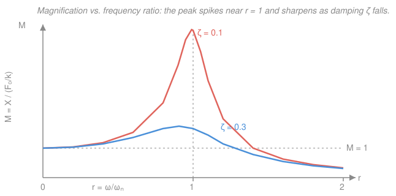

# Engineering Dynamics · Lesson 4.2: Forced Vibration & Resonance

> ⏱ ~15 min · Module 4: Mechanical Vibrations · Builds on: [4.1 Free vibration: undamped & damped](04-01-free-vibration-undamped-damped.md) · Unlocks: [`control-systems`](../../control-systems/syllabus.md), [`robotics`](../../robotics/syllabus.md)

## Why this matters

A free vibration is a system left alone — pluck it and it rings down. But real machines get *pushed*, over and over: an unbalanced motor at 1,800 rpm, waves slapping a hull, a soldier's cadence on a footbridge. Drive a spring-mass system at just the wrong frequency and a tiny repeated nudge builds into a catastrophic swing — **resonance**, the reason engines get mounted on rubber, bridges get tuned dampers, and buildings get shear walls. This is also the last lesson of the course, and the exact reason the next one exists: [control-systems](../../control-systems/syllabus.md) is, at heart, the art of reshaping this response curve so the resonant peak can't kill you.

## The idea

Push a child on a swing. If you shove at random moments, nothing much happens — you fight the swing as often as you help it. But time your pushes to the swing's own rhythm and each little push *adds* to the last: the arc grows and grows. That matching-of-rhythms is the whole story of resonance. The system has a preferred tempo — its natural frequency $\omega_n$ from [4.1](04-01-free-vibration-undamped-damped.md) — and when the forcing frequency $\omega$ closes in on it, the response balloons.

Two things happen at once as you sweep the forcing frequency up. First, the **amplitude** grows, peaks sharply near $\omega=\omega_n$, then falls off (past resonance the mass can't keep up and barely moves). Second, the motion falls **out of step** with the force: well below resonance the mass moves *with* the push; right at resonance it lags a quarter-cycle behind; well above, it moves nearly *opposite* the push. Damping is the referee — it caps how tall the peak gets. With no damping at all, the peak is infinite: the swing grows without bound.

## The formal version

Add a harmonic driving force $F_0\cos\omega t$ to the damped spring-mass equation from [4.1](04-01-free-vibration-undamped-damped.md):

$$m\ddot x + c\dot x + kx = F_0\cos\omega t,$$

where $m$ is mass (kg), $c$ the damping coefficient (N·s/m), $k$ the stiffness (N/m), $F_0$ the force amplitude (N), and $\omega$ the **forcing** angular frequency (rad/s) — set by whatever is pushing, *not* by the system. *In words: the same mass–damper–spring, now with an external oscillating shove on the right-hand side.*

The full solution is a transient (the free-vibration part, which decays away) plus a **steady state** that persists. Once the transient dies, the mass oscillates at the *driving* frequency:

$$\boxed{\,x_p(t) = X\cos(\omega t - \phi)\,}$$

*In words: the system eventually forgets its own rhythm and marches to the beat of the force — same frequency $\omega$, but lagging by a phase angle $\phi$ and scaled to amplitude $X$.* Plugging $x_p$ in and matching sine/cosine terms gives the two things we want. Using the [4.1](04-01-free-vibration-undamped-damped.md) parameters $\omega_n=\sqrt{k/m}$ and $\zeta=\dfrac{c}{2\sqrt{km}}$, define the **frequency ratio**

$$r \equiv \frac{\omega}{\omega_n}.$$

Then the amplitude, written as a **magnification factor** $M$ relative to the static deflection $F_0/k$ (how far that force would push the spring if applied slowly), is

$$M \equiv \frac{X}{F_0/k} = \frac{1}{\sqrt{(1-r^2)^2 + (2\zeta r)^2}}, \qquad \tan\phi = \frac{2\zeta r}{1-r^2}.$$

*In words: $M$ tells you how many times bigger the shaking is than a slow push of the same strength; $\phi$ is how far the motion lags the force.* Three facts fall out of $M$:

- **Resonance.** $M$ peaks where the denominator is smallest. Minimizing gives the peak at $r_{\text{peak}}=\sqrt{1-2\zeta^2}$ (just shy of $r=1$), with height $M_{\max}=\dfrac{1}{2\zeta\sqrt{1-\zeta^2}}$. For light damping the peak sits essentially *at* $r=1$, where the clean value $M=\dfrac{1}{2\zeta}$ holds. *In words: you resonate a hair below the natural frequency, but for small $\zeta$ "resonance is at $\omega_n$" is close enough.*
- **The undamped blow-up.** Set $\zeta=0$: then $M=\dfrac{1}{|1-r^2|}\to\infty$ as $r\to1$. *In words: with nothing to bleed off energy, every cycle adds amplitude forever — the response is unbounded.* (The true undamped solution grows linearly in time, $x\propto t\sin\omega_n t$.)
- **The phase flip.** At $r=1$, $\tan\phi=\dfrac{2\zeta}{0}\to\infty$, so $\phi=90^\circ$ regardless of damping. Below resonance $\phi<90^\circ$ (moves with the force); above, $\phi\to180^\circ$ (moves against it). *In words: the quarter-cycle lag at resonance is the universal signature that you've hit it.*

## Picture

Both curves start at $M=1$ (a slow push just gives the static deflection), rise to a peak near $r=1$, and decay past it. The lightly damped $\zeta=0.1$ curve (coral) spikes to $M\approx5$; the $\zeta=0.3$ curve (blue) barely reaches $M\approx1.7$. Kill the damping entirely and the coral peak would shoot to infinity.

## Worked examples

**Example 1 (steady-state amplitude, then at resonance).** A machine: $m=10\,\text{kg}$, $k=1000\,\text{N/m}$, damper $c=60\,\text{N·s/m}$, driven by $F_0=100\,\text{N}$. First find the amplitude at $\omega=6\,\text{rad/s}$; then at resonance.

*Set-up.* The natural frequency and damping ratio come straight from [4.1](04-01-free-vibration-undamped-damped.md):

$$\omega_n=\sqrt{\tfrac{k}{m}}=\sqrt{\tfrac{1000}{10}}=10\,\text{rad/s}, \qquad c_c=2\sqrt{km}=2\sqrt{10000}=200, \qquad \zeta=\tfrac{c}{c_c}=\tfrac{60}{200}=0.3.$$

Static deflection: $F_0/k = 100/1000 = 0.1\,\text{m}$.

*Part (a), $\omega=6\,\text{rad/s}$.* Frequency ratio $r=\omega/\omega_n=6/10=0.6$. Then

$$M=\frac{1}{\sqrt{(1-0.36)^2+(2\cdot0.3\cdot0.6)^2}}=\frac{1}{\sqrt{0.4096+0.1296}}=\frac{1}{\sqrt{0.5392}}=\frac{1}{0.734}=1.362,$$

so $X = M\cdot(F_0/k) = 1.362 \times 0.1 = 0.136\,\text{m}$. The phase lag is $\tan\phi = \dfrac{2\cdot0.3\cdot0.6}{1-0.36}=\dfrac{0.36}{0.64}=0.5625 \Rightarrow \phi = 29.4^\circ$ — the mass moves roughly with the force.

*Part (b), at resonance $\omega=\omega_n$ ($r=1$).* Now $(1-r^2)=0$, so only the damping term survives:

$$M=\frac{1}{\sqrt{0+(2\cdot0.3\cdot1)^2}}=\frac{1}{2\zeta}=\frac{1}{0.6}=1.667, \qquad X=\frac{F_0/k}{2\zeta}=\frac{0.1}{0.6}=0.167\,\text{m}.$$

The shaking is $1.67\times$ the static push, and $\phi=90^\circ$. Notice damping is the *only* thing keeping $X$ finite here.

**Example 2 (peak amplitude of a lightly damped system).** A sensor mount: $m=2\,\text{kg}$, $k=800\,\text{N/m}$, $F_0=20\,\text{N}$, damping ratio $\zeta=0.1$. Find the worst-case amplitude and the frequency at which it occurs.

$$\omega_n=\sqrt{\tfrac{800}{2}}=\sqrt{400}=20\,\text{rad/s}, \qquad F_0/k=\tfrac{20}{800}=0.025\,\text{m}.$$

The peak is *not* exactly at $\omega_n$ — it sits at $r_{\text{peak}}=\sqrt{1-2\zeta^2}$:

$$r_{\text{peak}}=\sqrt{1-2(0.1)^2}=\sqrt{0.98}=0.990, \qquad \omega_{\text{peak}}=r_{\text{peak}}\,\omega_n = 0.990\times20 = 19.8\,\text{rad/s}.$$

The peak magnification and amplitude:

$$M_{\max}=\frac{1}{2\zeta\sqrt{1-\zeta^2}}=\frac{1}{2(0.1)\sqrt{0.99}}=\frac{1}{0.199}=5.03, \qquad X_{\max}=5.03\times0.025=0.126\,\text{m}.$$

Compare the value *at* $r=1$: $M=1/(2\zeta)=5.0$, giving $X=0.125\,\text{m}$. The true peak is a whisper higher and a hair lower in frequency — which is exactly why, for light damping, engineers just say "resonance is at $\omega_n$ and $M=1/2\zeta$." The lesson: a mere $10\%$ of critical damping still lets this mount shake five times harder than a static load.

## Watch out

- **You might think resonance is exactly at $\omega=\omega_n$.** With damping it's slightly *below*, at $\omega_{\text{peak}}=\omega_n\sqrt{1-2\zeta^2}$. It's a small shift for light damping, but it's not zero — and if $\zeta>1/\sqrt2\approx0.707$ there's *no* peak at all; $M$ just decays from 1.
- **You might report the transient as the answer.** The homogeneous (free) part decays like $e^{-\zeta\omega_n t}$ and vanishes. Steady-state amplitude $X$ is what survives — don't add the transient into a long-run amplitude.
- **You might use the undamped formula near resonance.** $M=1/|1-r^2|$ blows up at $r=1$ and is meaningless there. Real systems always have some $\zeta$; the $(2\zeta r)^2$ term is precisely what keeps the peak finite, so never drop it near resonance.

## One-liner

> Drive a spring-mass system near its natural frequency and the response magnifies by $\tfrac{1}{2\zeta}$ — damping is the only thing standing between resonance and infinity.

## Problems

**P1 (🟢)** A system has $\omega_n=20\,\text{rad/s}$ and $\zeta=0.25$, with static deflection $F_0/k=0.05\,\text{m}$. It is driven at $\omega=10\,\text{rad/s}$. Find the frequency ratio $r$, the magnification factor $M$, and the steady-state amplitude $X$.

**P2 (🟡)** The same system is now driven exactly at resonance ($\omega=\omega_n$). Find $M$, the amplitude $X$, and the phase lag $\phi$. By what factor did the amplitude grow versus P1?

**P3 (🔴, bridge to control-systems)** A lightly damped structure has $\zeta=0.05$. (a) At $r=1$, how many times larger is the vibration than a static load of the same size? (b) A [control-systems](../../control-systems/syllabus.md) engineer adds active damping to raise $\zeta$ to $0.4$. Recompute the $r=1$ magnification. (c) In one sentence, why is *reshaping this curve* the whole point of feedback control?

Solutions

**P1** Frequency ratio: $r=\omega/\omega_n=10/20=0.5$. Then

$$M=\frac{1}{\sqrt{(1-0.25)^2+(2\cdot0.25\cdot0.5)^2}}=\frac{1}{\sqrt{(0.75)^2+(0.25)^2}}=\frac{1}{\sqrt{0.5625+0.0625}}=\frac{1}{\sqrt{0.625}}=\frac{1}{0.7906}=1.265.$$

Amplitude: $X=M\cdot(F_0/k)=1.265\times0.05=0.0632\,\text{m}$.

*Check.* Well below resonance ($r=0.5$), so $M$ should be modestly above 1 — and $1.265$ is. ✓

**P2** At $r=1$ the $(1-r^2)$ term vanishes, leaving

$$M=\frac{1}{2\zeta}=\frac{1}{2\cdot0.25}=\frac{1}{0.5}=2.0, \qquad X=2.0\times0.05=0.10\,\text{m}, \qquad \phi=90^\circ.$$

Growth factor versus P1: $X_{\text{res}}/X_{\text{P1}}=0.10/0.0632=1.58$, i.e. the amplitude grew about $58\%$ just by moving the drive from $r=0.5$ up to resonance.

*Check.* $M$ jumped from $1.265$ to $2.0$; ratio $2.0/1.265=1.58$, matching the amplitude ratio since $F_0/k$ is unchanged. ✓

**P3** (a) $M=\dfrac{1}{2\zeta}=\dfrac{1}{2(0.05)}=\dfrac{1}{0.1}=10$ — the vibration is $10\times$ a static load. (Dangerous: $5\%$ damping is typical for a bare steel structure.)

(b) With $\zeta=0.4$: $M=\dfrac{1}{2(0.4)}=\dfrac{1}{0.8}=1.25$. The peak collapsed from 10 to 1.25 — an eightfold reduction.

(c) Because feedback control is precisely the business of synthesizing that extra damping (and shifting $\omega_n$) so the resonant peak is pulled down to something the structure can survive — controlling the *dynamic* response, not just the static load, is why control cares about dynamics at all.

*Check.* $M$ at $r=1$ is exactly $1/(2\zeta)$, so ratio $= \zeta_{\text{new}}/\zeta_{\text{old}}=0.4/0.05=8$. ✓

## Flashback

**From Lesson 4.1 (Free vibration):** A machine part of mass $m=4\,\text{kg}$ rests on a spring $k=900\,\text{N/m}$ with a viscous damper $c=48\,\text{N·s/m}$. Find the natural frequency $\omega_n$, the damping ratio $\zeta$, classify the response (under-, critically, or over-damped), and find the damped natural frequency $\omega_d$.

Solution

Natural frequency:

$$\omega_n=\sqrt{\frac{k}{m}}=\sqrt{\frac{900}{4}}=\sqrt{225}=15\,\text{rad/s}.$$

Critical damping and ratio:

$$c_c=2\sqrt{km}=2\sqrt{900\cdot4}=2\sqrt{3600}=2(60)=120\,\text{N·s/m}, \qquad \zeta=\frac{c}{c_c}=\frac{48}{120}=0.4.$$

Since $0<\zeta<1$, the system is **underdamped** — it oscillates while decaying. The damped natural frequency:

$$\omega_d=\omega_n\sqrt{1-\zeta^2}=15\sqrt{1-0.16}=15\sqrt{0.84}=15(0.9165)=13.7\,\text{rad/s}.$$

*Check.* $\omega_d<\omega_n$ as it must be (damping slows the ring), and $\zeta=0.4$ is comfortably under 1, so oscillation survives. ✓ This same $\zeta=0.4$ is exactly what governs the forced peak in this lesson: driven at resonance, this part would magnify by $1/(2\zeta)=1.25$.

## Connections

- **Backward:** the parameters $\omega_n=\sqrt{k/m}$ and $\zeta=c/2\sqrt{km}$ are lifted straight from [4.1](04-01-free-vibration-undamped-damped.md); the transient that decays before steady state *is* 4.1's free-vibration response. Undamped resonance is the driven version of 4.1's undamped SHM ([mechanics-refresher 3.1](../../mechanics-refresher/syllabus.md)).
- **Forward:** [control-systems](../../control-systems/syllabus.md) takes this magnification curve as the enemy — the frequency response of a plant — and designs feedback to reshape it (add damping, move poles) so the peak can't run away; [robotics](../../robotics/syllabus.md) fights structural resonance in arms and drivetrains the same way.
- **Sideways (electrical engineering):** this is *identically* a driven RLC circuit — $L\ddot q + R\dot q + q/C = V_0\cos\omega t$ maps term-for-term onto $m\ddot x + c\dot x + kx = F_0\cos\omega t$, with charge $q$ playing displacement and the resonance peak becoming the tuning curve of every radio. One equation, two universes.
