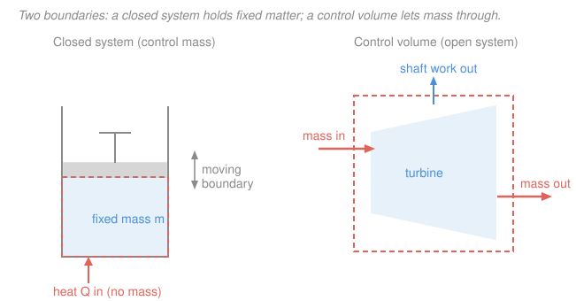

# Engineering Thermodynamics · Lesson 1.1: System vs. control volume; state & properties

> ⏱ ~15 min · Module 1: Properties, Work & Heat · Builds on: [`calc-refresher`](../../calc-refresher/syllabus.md) (functions and derivatives, used in prose) · Unlocks: [1.2 Phase behavior of a pure substance](01-02-phase-behavior-pure-substance.md)

## Why this matters

Every thermodynamics problem you will ever solve — a car engine, a power-plant turbine, a refrigerator, a rocket nozzle — starts with the same move: **draw a boundary and decide what's inside it.** Get the boundary right and the bookkeeping (mass in, mass out, energy in, energy out) writes itself. Get it wrong and no amount of algebra saves you. This lesson is about that first move, plus the vocabulary — *state*, *property*, *equilibrium* — that lets you say precisely "what is going on inside the box right now." It's the least glamorous lesson in the course and the one every later lesson silently depends on.

## The idea

Point at a region of the universe and put an imaginary bag around it. Everything inside is your **system**; everything outside is the **surroundings**; the bag itself is the **boundary**. You get to choose the bag — and there are exactly two useful choices.

**Choice 1: trap a fixed chunk of matter.** The bag holds the *same molecules* the whole time. Energy can still leak through the wall (you can heat it, it can push on things), but no mass crosses. This is a **closed system**, also called a **control mass**. Picture gas sealed in a piston–cylinder: the piston can slide, compressing or expanding the gas, but the same gas is always in there.

**Choice 2: nail the bag to a fixed region of space and let matter stream through it.** Now you're not tracking specific molecules — you're watching a *place*, and fluid flows in one side and out the other. This is a **control volume**, also called an **open system**. Picture a turbine: steam rushes in, spins the blades, rushes out. You care about the region "the turbine," not any particular steam molecule.

Almost every real device is one or the other, and the whole art is picking the bag that makes the accounting easiest. A sealed pot? Closed system — track the fixed water. A garden hose? Control volume — water flows through. The boundary can be **real** (the cylinder wall) or **imaginary** (a plane drawn across the pipe inlet), **fixed** (the turbine casing) or **moving** (the piston face). You draw whichever is convenient.

Once the bag is drawn, you need to describe *what's inside*. That's what **properties** are for — the measurable characteristics (temperature, pressure, volume…) that pin down the condition of the stuff in the bag.

## The formal version

**System, boundary, surroundings.** A **system** is a quantity of matter or a region of space chosen for study. Everything external is the **surroundings**, and the surface separating them is the **boundary**. *In words: you pick a box; inside is the system, outside is everything else, the wall between is the boundary.*

- **Closed system (control mass):** fixed mass; the boundary lets *energy* cross but not *mass*. Example: gas in a piston–cylinder.
- **Control volume (open system):** a region of space, usually fixed, that *mass* flows through (energy too). The boundary is the **control surface**. Example: turbine, nozzle, compressor, pump — anything with an inlet and an outlet.
- An **isolated system** is a closed system that also blocks energy: nothing crosses at all.

**Property.** A **property** is any characteristic of a system whose value depends only on the current condition, not on how the system got there. Temperature $T$, pressure $p$, volume $V$, internal energy $U$, and mass $m$ are all properties. Properties split into two kinds:

- **Extensive** — scales with the amount of matter. Double the mass (keeping conditions identical) and it doubles. Examples: total volume $V\ (\mathrm{m^3})$, total internal energy $U\ (\mathrm{kJ})$, mass $m\ (\mathrm{kg})$.
- **Intensive** — independent of the amount of matter. Examples: temperature $T\ (\mathrm{K}\text{ or }^\circ\mathrm{C})$, pressure $p\ (\mathrm{kPa})$, density $\rho\ (\mathrm{kg/m^3})$.

*In words: cut the system in half — whatever halves is extensive, whatever stays the same is intensive.*

Any extensive property divided by mass becomes an intensive **specific property**, written lower-case:

$$v = \frac{V}{m}\ \left(\mathrm{m^3/kg}\right), \qquad u = \frac{U}{m}\ \left(\mathrm{kJ/kg}\right).$$

Here $v$ is **specific volume** (volume per kilogram — the reciprocal of density, $v = 1/\rho$) and $u$ is **specific internal energy**. Dividing out the mass strips away "how much," leaving a per-kilogram intensive number. Engineers work in specific properties constantly, because they describe the *substance* regardless of how big the tank is.

**State.** The **state** is the complete condition of a system, given by the values of its properties. If two systems have identical values for every property, they are in the same state — history is irrelevant.

**State postulate.** For a **simple compressible substance** (one where the only significant work mode is compression/expansion — no magnetic, electric, or surface-tension effects), the intensive state is fixed by **two independent intensive properties**.

*In words: name any two independent intensive properties — say $T$ and $v$ — and every other intensive property is thereby determined.* "Independent" is the catch: $T$ and $p$ are independent for a superheated vapor, but *not* while a liquid is boiling (there, fixing $T$ fixes $p$ automatically — the vapor-dome subtlety we unpack in [1.2](01-02-phase-behavior-pure-substance.md)). Pick two that genuinely move independently and the state is locked.

**Equilibrium.** A system is in **thermodynamic equilibrium** when it has no unbalanced driving potentials — nothing left to change on its own. It requires:

- **thermal equilibrium** — uniform temperature (no internal $\Delta T$ driving heat flow);
- **mechanical equilibrium** — no unbalanced pressure (no $\Delta p$ driving motion);
- **phase / chemical equilibrium** — no net evaporation, condensation, or reaction.

A state is only well-defined *at* equilibrium, because only then does a single $T$, a single $p$ describe the whole system.

**Process, path, cycle.** A **process** is a change from one equilibrium state to another. The series of states passed through is the **path**. A **quasi-equilibrium (quasi-static) process** is an idealized process slow enough that the system stays infinitesimally close to equilibrium the entire way — so every intermediate state is well-defined and plottable. A **cycle** is a process (or sequence of processes) that returns the system to its initial state, so all properties come back to their starting values.

## Picture

## Worked examples

**Example 1 (classify the boundary).** For each device, decide closed system or control volume, and name the boundary.

| Device | Type | Boundary |
|---|---|---|
| Pressure cooker, sealed (valve shut) | **Closed** — no mass leaves | The pot + lid walls (fixed, real). Heat crosses; the trapped water/steam is a fixed mass. |
| Pressure cooker, venting steam | **Control volume** — mass exits through the valve | The pot walls *plus* an imaginary surface across the valve opening (mass crosses there). |
| Garden-hose nozzle | **Control volume** — water flows through | The nozzle's inner surface + imaginary planes at inlet and outlet. |
| Inflating balloon | **Control volume** — air flows in across the neck | The rubber skin (a *moving, real* boundary) + an imaginary plane at the neck opening. |

The tell is simple: **does matter cross the boundary during the process?** No → closed. Yes → control volume. Note the same physical object (the pressure cooker) is a closed system or a control volume *depending on whether the valve is open* — the classification is about the process, not the hardware.

**Example 2 (extensive vs. intensive, and $v$ is intensive).** A rigid tank holds $m = 4\ \mathrm{kg}$ of air at $T = 300\ \mathrm{K}$, $p = 200\ \mathrm{kPa}$, occupying $V = 1.72\ \mathrm{m^3}$. Sort its properties, then show the specific volume doesn't depend on tank size.

Sorting by the "cut it in half" test:

| Property | Value | Extensive or intensive? |
|---|---|---|
| mass $m$ | $4\ \mathrm{kg}$ | extensive (half the air → $2\ \mathrm{kg}$) |
| volume $V$ | $1.72\ \mathrm{m^3}$ | extensive (half the air → $0.86\ \mathrm{m^3}$) |
| temperature $T$ | $300\ \mathrm{K}$ | intensive (each half still at $300\ \mathrm{K}$) |
| pressure $p$ | $200\ \mathrm{kPa}$ | intensive (each half still at $200\ \mathrm{kPa}$) |

Now the specific volume:

$$v = \frac{V}{m} = \frac{1.72\ \mathrm{m^3}}{4\ \mathrm{kg}} = 0.43\ \mathrm{m^3/kg}.$$

Imagine slicing the tank in two. Each half has $V' = 0.86\ \mathrm{m^3}$ and $m' = 2\ \mathrm{kg}$, so

$$v' = \frac{0.86}{2} = 0.43\ \mathrm{m^3/kg} = v.$$

Two extensive quantities ($V$ and $m$) both halved, but their **ratio held fixed** — that's exactly why $v = V/m$ is intensive. It describes the air itself, not how much of it you scooped. (Check via density: $\rho = 1/v = 1/0.43 \approx 2.33\ \mathrm{kg/m^3}$, and indeed $m/V = 4/1.72 \approx 2.33\ \mathrm{kg/m^3}$ ✓.)

## Watch out

- **You might think a system is always a physical object with walls.** But the boundary is a *choice you make*, and it's often imaginary. The inlet plane of a turbine is a boundary you draw across empty pipe — no wall there at all. Pick whatever surface makes the accounting cleanest.
- **You might think a device is "a closed system" or "an open system" as a fixed label.** It's the *process* that decides. A capped bottle is closed; uncap it and pour, and the same bottle becomes a control volume. Always ask "does mass cross *during this process*?"
- **You might think any two properties fix the state.** They must be **independent** and **intensive**. Two extensive properties won't do it (they only tell you "how much," not "what condition"), and two properties that secretly move together — like $T$ and $p$ inside the boiling region — count as only *one* piece of information. More on that trap in [1.2](01-02-phase-behavior-pure-substance.md).

## One-liner

> Draw the box first: a **closed system** traps fixed mass (energy crosses, matter doesn't), a **control volume** lets matter flow through — and inside either, two independent intensive properties fix the state of a simple compressible substance.

## Problems

**P1 (🟢)** Classify each as a closed system or a control volume, and state whether mass crosses the boundary: (a) a sealed, rigid can of soda sitting in the sun; (b) a household window air-conditioner running; (c) the water inside a capped water bottle you squeeze; (d) a jet engine in flight.

**P2 (🟡)** A tank contains $m = 5\ \mathrm{kg}$ of water with total volume $V = 0.5\ \mathrm{m^3}$ and internal energy $U = 10{,}450\ \mathrm{kJ}$, at $T = 200\ ^\circ\mathrm{C}$. (a) Which of $m, V, U, T$ are extensive and which intensive? (b) Compute the specific volume $v$ and specific internal energy $u$. (c) If you drew a boundary around just *half* the tank's contents, which of your four original numbers change, and which of $v, u, T$ change?

**P3 (🔴)** A rigid sealed tank of gas is heated. Someone claims: "During heating, the gas is a closed system, its boundary is fixed and real, and I can fix its state at any instant with $T$ and $p$." Then they add: "Because it's rigid and sealed, this is also an *isolated* system." Evaluate each clause — which are right, which is wrong, and why? (Assume the gas is a simple compressible substance and heating is slow / quasi-equilibrium.)

Solutions

**P1**
- (a) **Closed system** — sealed and rigid, no mass crosses (only heat enters from the sun). 
- (b) **Control volume** — refrigerant circulates and, more visibly, room air and outside air flow through it; mass crosses. 
- (c) **Closed system** — capped, so no mass crosses; squeezing just does boundary work on a fixed mass of water (nearly incompressible, but still no mass transfer). 
- (d) **Control volume** — air enters the intake, combustion gases leave the exhaust; mass crosses continuously.

*Check.* The single discriminating question — "does matter cross the boundary?" — gives no for (a),(c) and yes for (b),(d). ✓

**P2**
(a) **Extensive:** $m$ (kg), $V$ (m³), $U$ (kJ) — each scales with amount. **Intensive:** $T$ ($^\circ$C) — independent of amount.

(b) Divide the extensive quantities by mass:

$$v = \frac{V}{m} = \frac{0.5\ \mathrm{m^3}}{5\ \mathrm{kg}} = 0.1\ \mathrm{m^3/kg}, \qquad u = \frac{U}{m} = \frac{10{,}450\ \mathrm{kJ}}{5\ \mathrm{kg}} = 2090\ \mathrm{kJ/kg}.$$

(c) Boxing off half the contents ($2.5\ \mathrm{kg}$) **halves the extensive** numbers: $m \to 2.5\ \mathrm{kg}$, $V \to 0.25\ \mathrm{m^3}$, $U \to 5225\ \mathrm{kJ}$. The **intensive** quantities are unchanged: $T = 200\ ^\circ\mathrm{C}$ stays, and

$$v = \frac{0.25}{2.5} = 0.1\ \mathrm{m^3/kg}, \qquad u = \frac{5225}{2.5} = 2090\ \mathrm{kJ/kg}$$

— identical to before. So $v, u, T$ all stay put; only $m, V, U$ change.

*Check.* Units: $\mathrm{m^3/kg}$ and $\mathrm{kJ/kg}$ are per-mass, hence intensive by construction; halving numerator and denominator together leaves the ratio fixed. ✓

**P3** Taking the clauses one at a time:
- "**Closed system**" — **correct.** Sealed, so no mass crosses; only energy (heat) enters.
- "**Boundary is fixed and real**" — **correct.** The tank is rigid (fixed — it doesn't move or deform) and the wall is a physical surface (real).
- "**Fix the state with $T$ and $p$**" — **correct** for a simple compressible substance *provided the two are independent*. For a single-phase gas being heated, $T$ and $p$ do vary independently, so the state postulate is satisfied. (Caveat worth flagging: if the substance were sitting in a two-phase liquid–vapor region, $T$ and $p$ would *not* be independent — but a heated gas is single-phase, so we're fine.)
- "**Isolated system**" — **wrong.** An isolated system allows *no* energy crossing either. Here heat is deliberately being added, so energy crosses the boundary: it's closed, but decidedly *not* isolated.

*Check.* Three right, one wrong; the error is conflating "no mass crosses" (closed) with "nothing crosses" (isolated) — the added heat breaks isolation. ✓

## Connections

- **Backward:** the specific-property idea $v = V/m$ is just a ratio of measurables; the state postulate's "one property determines another" is a **function** in the [`calc-refresher`](../../calc-refresher/syllabus.md) sense — later lessons will write things like $u = u(T,v)$ and differentiate them.
- **Forward:** [1.2 Phase behavior of a pure substance](01-02-phase-behavior-pure-substance.md) cashes in the state postulate on real substances — showing exactly when $T$ and $p$ *fail* to be independent (inside the vapor dome) and why you then need $v$ or quality $x$ as your second property. The closed-system vs. control-volume split reappears as the two great energy balances: the closed-system first law ([2.1](02-01-first-law-closed-systems.md)) and the control-volume steady-flow energy equation ([2.3](02-03-mass-energy-balance-control-volumes.md)).
- **Sideways (physics):** this "system + surroundings + boundary" framing is the same one used in [`thermodynamics-physics`](../../thermodynamics-physics/syllabus.md), but with a different emphasis — that course chases the *microscopic* origin of internal energy and entropy (why molecules carry $u$), while this engineering course treats those quantities as bookkeeping entries you look up in a table and balance across a boundary.
