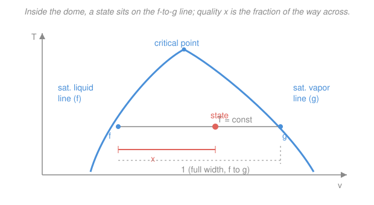

# Engineering Thermodynamics · Lesson 1.3: Property tables & quality

> ⏱ ~15 min · Module 1: Properties, Work & Heat · Builds on: [1.2 Phase behavior of a pure substance](01-02-phase-behavior-pure-substance.md) · Unlocks: every numerical lesson ahead — 2.x (energy balances), 3.x (entropy), 4.x (cycles)

## Why this matters

Last lesson you learned *where* a state lives — compressed liquid, inside the vapor dome, or superheated. This lesson is how you turn that location into **numbers**: the specific volume $v$, internal energy $u$, enthalpy $h$, and entropy $s$ that every first- and second-law calculation from here on will demand. Water and steam don't obey a tidy equation like $pv=RT$ near their phase change, so engineers read their properties off **tables** built from careful experiments. Being fluent with those tables — especially the trick for states *inside* the dome, where two properties can't fix the state alone — is the single most-used skill in the course. Every boss problem starts here.

## The idea

A pure substance has two knobs. Fix any two independent properties (say $T$ and $p$) and everything else is locked in — that's the state postulate from [1.1](01-01-system-vs-control-volume-state.md). The tables are just that lookup, printed.

There are two kinds. **Saturated tables** describe the boundary of the dome — the pure saturated liquid (subscript $f$) and pure saturated vapor (subscript $g$) at each temperature or pressure. **Superheated tables** describe the gas region to the right of the dome, where $T$ and $p$ *are* independent again, so you look up by both.

The subtle case is **inside the dome**, where liquid and vapor coexist. There $T$ and $p$ are *not* independent — pick the pressure and the temperature is fixed at $T_\text{sat}$ (that's why the dome's interior is flat in a $p$–$T$ view). So knowing $p$ and $T$ tells you nothing about *how much* has boiled. You need a second number that measures the mix: the **quality** $x$, the vapor fraction by mass. Once you have $p$ (or $T$) and $x$, the state is fixed, and every property follows from a single "how far across the dome" formula.

Think of a pot of boiling water. As you add heat at constant pressure the temperature *doesn't budge* — it sits at $T_\text{sat}$ — but the liquid steadily turns to steam. Quality is the progress bar: 0 when it's all liquid, 1 when it's all steam.

## The formal version

**Quality.** Inside the dome, with $m_\text{vapor}$ the mass of vapor (kg) and $m_\text{total}$ the total mass (kg),

$$x = \frac{m_\text{vapor}}{m_\text{total}}, \qquad 0 \le x \le 1.$$

*In words: $x$ is the fraction of the mixture, by mass, that is vapor.* $x=0$ is saturated liquid (all $f$), $x=1$ is saturated vapor (all $g$). $x$ is dimensionless. Quality is defined **only** inside the dome — a compressed liquid or a superheated vapor has no quality.

**Any property inside the dome.** Let $y$ stand for any of $v, u, h, s$. Because the mixture is a mass-weighted blend of saturated liquid and saturated vapor,

$$\boxed{\,y = y_f + x\,y_{fg}\,}, \qquad y_{fg} \equiv y_g - y_f.$$

*In words: start at the saturated-liquid value and add the quality-weighted jump across the dome.* Here $y_f$ and $y_g$ are the saturated-liquid and saturated-vapor values (read from the saturated table at your $T$ or $p$), and $y_{fg}$ is their difference — the "latent" gap. Tables often list $h_{fg}$ and $s_{fg}$ directly (the latent heat of vaporization is exactly $h_{fg}$). Units follow $y$: $v$ in $\mathrm{m^3/kg}$, $u$ and $h$ in $\mathrm{kJ/kg}$, $s$ in $\mathrm{kJ/(kg\cdot K)}$.

Geometrically this is the **lever rule**: on a $T$–$v$ (or $p$–$v$) diagram the state sits a fraction $x$ of the way from the $f$ point to the $g$ point along the horizontal tie line. Run it backward to *find* quality from a measured property:

$$x = \frac{y - y_f}{y_{fg}}.$$

**Superheated tables.** To the right of the dome, look up by $p$ **and** $T$ together (two independent knobs, two arguments). No quality — the state is a single-phase gas.

**Compressed liquid.** Compressed-liquid tables are sparse, so use the standard approximation

$$y(T,p) \approx y_f(T) \quad \text{for } y = v, u,$$

*In words: a compressed liquid behaves almost exactly like saturated liquid at the same temperature* — pressure barely moves a nearly incompressible liquid. (For $h$ a small pressure correction $h \approx h_f(T) + v_f\,[p - p_\text{sat}(T)]$ improves it, but $h \approx h_f(T)$ is fine unless the pressure is very high.) Note it keys on **temperature**, not pressure.

**Linear interpolation.** When your value falls *between* two table rows, draw a straight line between them. For a target $t$ between rows $t_1$ and $t_2$ with tabulated $y_1$ and $y_2$,

$$y = y_1 + \frac{t - t_1}{t_2 - t_1}\,(y_2 - y_1).$$

*In words: the fraction of the way you are between the two row inputs is the fraction of the way you go between their outputs.* It works because table rows are close enough that properties are nearly straight-line over one gap.

## Picture

A small excerpt of a **saturated (by pressure)** table for water — the kind you read $y_f, y_g, y_{fg}$ from:

| $p$ (kPa) | $T_\text{sat}$ (°C) | $v_f$ (m³/kg) | $v_g$ (m³/kg) | $h_f$ (kJ/kg) | $h_{fg}$ (kJ/kg) | $h_g$ (kJ/kg) |
|---:|---:|---:|---:|---:|---:|---:|
| 50 | 81.32 | 0.001030 | 3.2403 | 340.5 | 2304.7 | 2645.2 |
| 200 | 120.21 | 0.001061 | 0.8858 | 504.7 | 2201.6 | 2706.3 |

Two things to notice: $v_f$ is about a thousand times smaller than $v_g$ (liquid is dense, vapor is fluffy), and $h_g = h_f + h_{fg}$ exactly, as the boxed formula requires at $x=1$.

## Worked examples

**Example 1 (wet steam — property from quality).** Find $h$ and $v$ of water at $p = 50\ \mathrm{kPa}$ with quality $x = 0.90$.

From the 50 kPa row: $h_f = 340.5$, $h_{fg} = 2304.7\ \mathrm{kJ/kg}$; $v_f = 0.001030$, $v_g = 3.2403\ \mathrm{m^3/kg}$, so $v_{fg} = v_g - v_f = 3.2393\ \mathrm{m^3/kg}$. Apply $y = y_f + x\,y_{fg}$:

$$h = h_f + x\,h_{fg} = 340.5 + 0.90(2304.7) = 340.5 + 2074.2 = 2414.7\ \mathrm{kJ/kg}.$$

$$v = v_f + x\,v_{fg} = 0.001030 + 0.90(3.2393) = 0.001030 + 2.9154 = 2.9164\ \mathrm{m^3/kg}.$$

Notice $v_f$ (0.00103) is utterly swamped by the vapor term — dropping it gives $v \approx x\,v_g = 0.90(3.2403) = 2.9163\ \mathrm{m^3/kg}$, wrong only in the fourth decimal. That shortcut is safe for $v$ (and often $u,h$ at low pressure), but **never** for the enthalpy of vaporization term itself — $h_{fg}$ is the whole story.

*Check.* $x=0.90$ should land the mixture close to pure vapor: $h_g = 2645.2$ at this pressure, and $2414.7$ is 90% of the way up from $h_f = 340.5$ to $h_g$ ✓. Units: $h$ in kJ/kg, $v$ in m³/kg ✓.

**Example 2 (superheated — linear interpolation).** Find $h$ of superheated water at $p = 200\ \mathrm{kPa}$ and $T = 250\,^\circ\mathrm{C}$, given the neighboring superheated rows at this pressure:

| $T$ (°C) | $h$ (kJ/kg) |
|---:|---:|
| 200 | 2870.7 |
| 300 | 3072.1 |

The target $250\,^\circ$C sits between the rows. With $t = 250$, $t_1 = 200$, $t_2 = 300$:

$$h = h_1 + \frac{t - t_1}{t_2 - t_1}(h_2 - h_1) = 2870.7 + \frac{250 - 200}{300 - 200}(3072.1 - 2870.7).$$

$$h = 2870.7 + (0.5)(201.4) = 2870.7 + 100.7 = 2971.4\ \mathrm{kJ/kg}.$$

*Check.* $250\,^\circ$C is exactly halfway between the rows, and $2971.4$ is exactly halfway between $2870.7$ and $3072.1$ ✓ — that's the whole meaning of linear interpolation. (The true tabulated value at $250\,^\circ$C is $2971.2\ \mathrm{kJ/kg}$; the interpolation is off by $0.2$, about $0.007\%$ — proof the straight-line assumption is trustworthy over one table gap.) Units: kJ/kg ✓.

## Watch out

- **You might think $p$ and $T$ always fix the state.** Inside the dome they don't — they're locked together at $T_\text{sat}$, so specifying both is redundant and leaves the vapor fraction unknown. You need a property that varies across the dome ($v, u, h, s$, or $x$ itself) as the second piece of information.
- **You might reach for the compressed-liquid table by pressure.** The approximation $y \approx y_f$ keys on **temperature**: a compressed liquid at $5\ \mathrm{MPa}$ and $80\,^\circ$C uses $v_f$ and $u_f$ read at $80\,^\circ$C, not at $5\ \mathrm{MPa}$. Pressure squeezes a liquid almost not at all.
- **You might interpolate a property that isn't linear enough.** Straight-line interpolation is fine across one narrow table gap, but never across a phase boundary (dome edge) — properties jump or kink there. If your two rows straddle saturation, you've picked the wrong table.

## One-liner

> Outside the dome, read the table directly (saturated by $T$/$p$, superheated by both, compressed liquid $\approx$ saturated liquid at the same $T$); inside it, everything is $y = y_f + x\,y_{fg}$ — the quality-weighted trip from $f$ to $g$.

## Problems

**P1 (🟢)** Water at $p = 200\ \mathrm{kPa}$ has quality $x = 0.60$. Using the saturated excerpt in the Picture ($v_f = 0.001061$, $v_g = 0.8858\ \mathrm{m^3/kg}$; $h_f = 504.7$, $h_{fg} = 2201.6\ \mathrm{kJ/kg}$), find its specific volume $v$ and specific enthalpy $h$.

**P2 (🟡)** A tank holds water at $50\ \mathrm{kPa}$ with a measured specific volume $v = 1.60\ \mathrm{m^3/kg}$. Is it inside the dome? If so, find its quality $x$ and its enthalpy $h$. (Use the 50 kPa row: $v_f = 0.00103$, $v_g = 3.2403\ \mathrm{m^3/kg}$; $h_f = 340.5$, $h_{fg} = 2304.7\ \mathrm{kJ/kg}$.)

**P3 (🔴)** *Flash evaporation — a preview of throttling ([2.5](02-05-steady-flow-devices-no-work.md)).* Saturated liquid water at $200\ \mathrm{kPa}$ ($h_f = 504.7\ \mathrm{kJ/kg}$) is throttled through a valve to $50\ \mathrm{kPa}$. A throttle leaves enthalpy unchanged (you'll prove $h_2 = h_1$ in Module 2 — take it as given here). What is the state after the valve, and what fraction of the water has flashed to vapor? (Use the 50 kPa row: $h_f = 340.5$, $h_g = 2645.2$, $h_{fg} = 2304.7\ \mathrm{kJ/kg}$.)

Solutions

**P1** Apply $y = y_f + x\,y_{fg}$ with $x = 0.60$.

$$v = v_f + x(v_g - v_f) = 0.001061 + 0.60(0.8858 - 0.001061) = 0.001061 + 0.60(0.884739) = 0.5319\ \mathrm{m^3/kg}.$$

$$h = h_f + x\,h_{fg} = 504.7 + 0.60(2201.6) = 504.7 + 1320.96 = 1825.7\ \mathrm{kJ/kg}.$$

*Check.* Both land 60% of the way from $f$ to $g$: $h_g = h_f + h_{fg} = 2706.3$, and $1825.7$ is indeed $60\%$ up from $504.7$ ✓. Units m³/kg and kJ/kg ✓.

**P2** Test against the saturation limits at 50 kPa: $v_f = 0.00103 < 1.60 < v_g = 3.2403$, so yes — the state is inside the dome (a liquid–vapor mixture). Invert the lever rule:

$$x = \frac{v - v_f}{v_g - v_f} = \frac{1.60 - 0.00103}{3.2403 - 0.00103} = \frac{1.59897}{3.23927} = 0.4936 \approx 0.494.$$

Then

$$h = h_f + x\,h_{fg} = 340.5 + 0.4936(2304.7) = 340.5 + 1137.6 = 1478.1\ \mathrm{kJ/kg}.$$

*Check.* $x$ is a dimensionless fraction in $[0,1]$ ✓; roughly half-vapor by mass, and $h$ sits below the midpoint of $h_f$ and $h_g = 2645.2$, consistent with $x$ just under $0.5$ ✓.

**P3** Throttling holds $h$ constant, so after the valve $h_2 = h_1 = 504.7\ \mathrm{kJ/kg}$ at $50\ \mathrm{kPa}$. Compare to the saturation limits there: $h_f = 340.5 < 504.7 < h_g = 2645.2$, so the exit is a **wet mixture inside the dome**. Its quality:

$$x_2 = \frac{h_2 - h_f}{h_{fg}} = \frac{504.7 - 340.5}{2304.7} = \frac{164.2}{2304.7} = 0.0713.$$

So about **7.1% of the water flashes to vapor** as it drops from 200 kPa to 50 kPa — even though no heat was added. The energy to boil that fraction comes from cooling the rest of the liquid to the lower saturation temperature.

*Check.* $x_2 \in [0,1]$ ✓, and it's small — a subcooled-ish liquid throttled to a modestly lower pressure should only partly flash, not fully vaporize ✓. This is exactly how flash tanks and the expansion valve in your fridge ([4.4](04-04-refrigeration-heat-pump-cycles.md)) make cold vapor.

## Flashback

**From Lesson 1.2 (Phase behavior of a pure substance):** Water sits at $p = 500\ \mathrm{kPa}$ and $T = 200\,^\circ\mathrm{C}$. At 500 kPa water saturates at $T_\text{sat} = 151.8\,^\circ\mathrm{C}$. Classify the state: compressed liquid, saturated mixture, or superheated vapor? Which table would you open?

Solution

Compare the actual temperature to the saturation temperature *at that pressure*: $T = 200\,^\circ\mathrm{C} > T_\text{sat} = 151.8\,^\circ\mathrm{C}$. The fluid is hotter than its boiling point at 500 kPa, so it is fully vaporized — **superheated vapor**. Open the **superheated table** and read by $p = 500\ \mathrm{kPa}$ and $T = 200\,^\circ$C together.

*Check (the other way round).* Equivalently, compare pressures at the given temperature: at $200\,^\circ$C water saturates near $1554\ \mathrm{kPa}$, and $500\ \mathrm{kPa} < 1554\ \mathrm{kPa}$ — below saturation pressure means vapor, the same verdict ✓. (Had $T$ been *below* $T_\text{sat}$ it would be compressed liquid; equal to it, a saturated mixture needing $x$.)

## Connections

- **Backward:** the dome, its $f$ and $g$ saturation lines, and the flat interior all come from [1.2](01-02-phase-behavior-pure-substance.md); this lesson just puts numbers on that map and adds the lever rule for reading inside it.
- **Forward:** these tables feed *everything numerical*. The closed-system first law ([2.1](02-01-first-law-closed-systems.md)) needs $u$; steady-flow devices like turbines ([2.4](02-04-steady-flow-devices-work.md)) need $h$; the isentropic ideal state ([3.4](03-04-isentropic-processes-efficiency.md)) is found by holding $s$ constant and inverting $s = s_f + x\,s_{fg}$ to get the exit quality. The [ideal-gas model](01-04-ideal-gas-model-limits.md) next lesson is the shortcut you use *instead* of tables when the gas is far from its dome.
- **Sideways (entropy as bookkeeping vs. its origin):** the tables list $s_f, s_g$ as plain entries, and this course treats $s$ as an accounting number that rides along in the same $y = y_f + x\,y_{fg}$ formula. *Why* a substance has that particular entropy — the microscopic count of accessible states — is the subject of [thermodynamics-physics](../../thermodynamics-physics/syllabus.md) and [stat-mech](../../stat-mech/syllabus.md). Here we only ever *use* the number; there you *derive* it.
