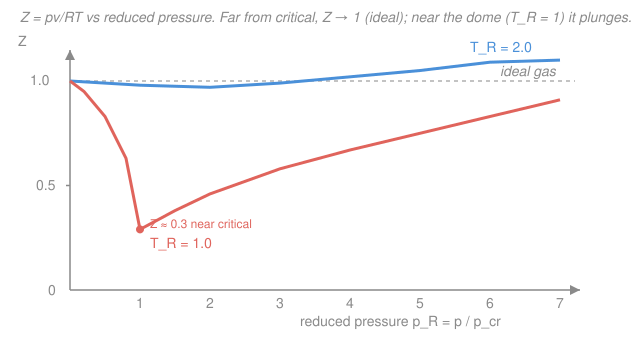

# Engineering Thermodynamics · Lesson 1.4: The ideal-gas model and its limits

> ⏱ ~15 min · Module 1: Properties, Work & Heat · Builds on: [1.2 Phase behavior of a pure substance](01-02-phase-behavior-pure-substance.md), [1.3 Property tables & quality](01-03-property-tables-quality.md) · Unlocks: [2.1 First law for closed systems](02-01-first-law-closed-systems.md), [2.2 Closed-system processes](02-02-closed-system-processes.md)

## Why this matters

Reading properties off a steam table (Lesson 1.3) is exact but slow — and for gases like air, nitrogen, or combustion products, no one keeps a table because a single equation does the job. That equation is $pv=RT$, the most-used formula in all of engineering thermodynamics. But it is a *model*, not a law, and it quietly fails exactly where a lot of real hardware lives: steam in a condenser, refrigerant near its boiling point, any fluid crowding its critical point. This lesson gives you both halves of the skill — how to use the ideal-gas law, and how to smell when it's lying so you reach for the tables instead.

## The idea

Picture gas molecules as tiny hard dots zipping around a mostly-empty box. Pressure is just their drumming on the walls. If the dots are *far apart* — low density — two simplifications become true: each dot takes up negligible volume, and dots almost never feel each other's attraction between collisions. Strip those two effects out and the algebra collapses to one clean relation between pressure, volume, and temperature. That's the ideal gas.

The model earns its keep when molecules are sparse: **high temperature and low pressure**, measured *relative to the substance's own critical point*. It breaks when you squeeze the dots close together — high pressure, or temperatures near where the gas wants to condense — because now their finite size and mutual attraction matter, and those are precisely the effects the model threw away.

So the whole game is one judgment call: *is my fluid dilute, or is it crowded?* Get that right and you know whether to trust one line of algebra or open a table.

## The formal version

**Ideal-gas equation of state.** On a per-unit-mass basis,

$$pv = RT.$$

- $p$ — absolute pressure ($\mathrm{kPa}$), $v$ — specific volume ($\mathrm{m^3/kg}$), $T$ — **absolute** temperature ($\mathrm{K}$, never $^\circ\mathrm{C}$).
- $R$ — the *specific* gas constant of this particular gas, $\mathrm{kJ/(kg\cdot K)}$.

*In words: pressure times the space each kilogram occupies is fixed by temperature alone.*

The specific constant comes from a universal one divided by how heavy the molecules are:

$$R = \frac{R_u}{M}, \qquad R_u = 8.314\ \mathrm{kJ/(kmol\cdot K)},$$

where $M$ is the molar mass ($\mathrm{kg/kmol}$) and $R_u$ is the same for every gas. For air ($M=28.97$), $R = 8.314/28.97 = 0.287\ \mathrm{kJ/(kg\cdot K)}$ — memorize this one.

The same law wears three equivalent outfits; pick whichever matches your givens:

$$pV = mRT = nR_uT,$$

with $V$ total volume ($\mathrm{m^3}$), $m$ mass ($\mathrm{kg}$), $n$ amount ($\mathrm{kmol}$). *In words: the extensive form just multiplies through by mass.* This $pV = nR_uT$ is the chemist's $pV=nRT$ — its microscopic derivation from molecules bouncing in a box is the kinetic-theory story told in the [thermodynamics-physics](../../thermodynamics-physics/syllabus.md) course; here we take it as given and ask *when it holds*.

**The honesty meter: compressibility factor.** Define

$$Z = \frac{pv}{RT}.$$

*In words: $Z$ is how far the real gas deviates from ideal — it's the fudge factor you'd multiply $RT$ by to get the truth, $pv = ZRT$.* An ideal gas has $Z=1$ exactly. Real gases have $Z<1$ when attraction dominates (they pull inward, so $v$ is smaller than ideal) and $Z>1$ when finite molecular size dominates at very high pressure.

The remarkable empirical fact — the **principle of corresponding states** — is that $Z$ is *nearly the same function* for all gases once you measure temperature and pressure against each substance's own critical point. Define the **reduced properties**

$$T_R = \frac{T}{T_{cr}}, \qquad p_R = \frac{p}{p_{cr}},$$

and a single **generalized compressibility chart** of $Z$ versus $p_R$ (curves labeled by $T_R$) works for water, nitrogen, methane, and the rest alike. The takeaways from that chart are all you really need to carry:

- $Z \to 1$ (ideal is safe) when $p_R \ll 1$, **or** when $T_R \gtrsim 2$ at moderate pressure.
- $Z$ departs hard from 1 near the vapor dome and the **critical point** ($T_R \approx 1$, $p_R \approx 1$), dipping as low as $\sim 0.3$. That is exactly where the model lies.

## Picture

The hot isotherm ($T_R = 2$, blue) hugs $Z=1$ across the whole chart — ideal gas is fine. The critical isotherm ($T_R = 1$, coral) starts at $Z=1$ but plunges toward $Z\approx0.3$ as $p_R\to1$: a real gas there occupies *a third* the volume the ideal law predicts. Read the chart as a map of trust — the closer you sit to the bottom-left corner (low $p_R$), the safer $pv=RT$; the closer to the critical dip, the more you need tables.

## Worked examples

**Example 1 — mass of air in a tank (the everyday use).**
A rigid $0.5\ \mathrm{m^3}$ tank holds air at $300\ \mathrm{kPa}$ and $300\ \mathrm{K}$. How much air is inside?

Air at these conditions is bone-dry ideal territory: room temperature is far above air's critical point ($T_{cr}=132.5\ \mathrm{K}$, so $T_R\approx2.3$) and $300\ \mathrm{kPa}$ is low. Use $pV=mRT$:

$$m = \frac{pV}{RT} = \frac{(300\ \mathrm{kPa})(0.5\ \mathrm{m^3})}{(0.287\ \mathrm{kJ/(kg\cdot K)})(300\ \mathrm{K})} = \frac{150}{86.1} = 1.74\ \mathrm{kg}.$$

*Units check:* $\dfrac{\mathrm{kPa}\cdot\mathrm{m^3}}{\mathrm{kJ/(kg\cdot K)}\cdot\mathrm{K}} = \dfrac{\mathrm{kJ}}{\mathrm{kJ/kg}} = \mathrm{kg}$ — since $1\ \mathrm{kPa\cdot m^3} = 1\ \mathrm{kJ}$. About $1.7\ \mathrm{kg}$ in half a cubic meter is sensible (air is roughly $1.2\ \mathrm{kg/m^3}$ at atmospheric, and we're at $3\times$ atmospheric).

**Example 2 — where the model lies: steam at high pressure.**
Superheated steam at $10\ \mathrm{MPa}$ and $400\ ^\circ\mathrm{C}$. Compare the ideal-gas specific volume to the table value ($v_{table}\approx 0.02641\ \mathrm{m^3/kg}$). Water's constant is $R = R_u/M = 8.314/18.02 = 0.4615\ \mathrm{kJ/(kg\cdot K)}$.

First convert: $T = 400 + 273.15 = 673.15\ \mathrm{K}$, $p = 10\,000\ \mathrm{kPa}$. Then

$$v_{ideal} = \frac{RT}{p} = \frac{(0.4615)(673.15)}{10\,000} = \frac{310.7}{10\,000} = 0.03107\ \mathrm{m^3/kg}.$$

The error against the table:

$$\text{error} = \frac{v_{ideal} - v_{table}}{v_{table}} = \frac{0.03107 - 0.02641}{0.02641} = 0.176 = 17.6\%.$$

The ideal law overpredicts the volume by nearly a fifth. Why? Check the reduced properties against water's critical point ($T_{cr}=647.1\ \mathrm{K}$, $p_{cr}=22.06\ \mathrm{MPa}$): $T_R = 673.15/647.1 = 1.04$ and $p_R = 10/22.06 = 0.45$. We're sitting just above the critical temperature at appreciable pressure — right in the danger zone. Indeed $Z = v_{table}/v_{ideal} = 0.02641/0.03107 = 0.85$, matching the chart. **Conclusion:** for steam in power-cycle conditions you use the tables, full stop.

## Watch out

- **You might think** a big number for $p$ or $T$ tells you whether ideal gas applies. **Actually** only the *reduced* values $T_R,p_R$ matter. $200\ \mathrm{kPa}$ is "low" for water ($p_R\approx0.009$) but the *same* $200\ \mathrm{kPa}$ is comfortably ideal for air too — always compare to the critical point, not to an absolute scale.
- **You might think** you can plug $^\circ\mathrm{C}$ or gauge pressure into $pv=RT$. **Actually** $T$ must be in kelvin and $p$ absolute — the law is built on absolute zero and true (not relative-to-atmosphere) pressure. Forgetting the $+273.15$ is the single most common wrong answer here.
- **You might think** $R$ is universal. **Actually** only $R_u = 8.314\ \mathrm{kJ/(kmol\cdot K)}$ is; the *specific* $R = R_u/M$ changes with the gas. Heavier molecules $\Rightarrow$ smaller $R$ (air $0.287$, nitrogen $0.297$, CO$_2$ $0.189$).

## One-liner

> $pv=RT$ is one clean line of algebra that tells the truth only when molecules are sparse — high $T_R$, low $p_R$ — and lies near the critical point, where you open the tables.

## Problems

**P1 (🟢)** A rigid $0.5\ \mathrm{m^3}$ tank holds $2\ \mathrm{kg}$ of nitrogen ($M = 28.01\ \mathrm{kg/kmol}$) at $350\ \mathrm{K}$. Find the pressure. Is the ideal-gas model justified here? (Nitrogen: $T_{cr}=126.2\ \mathrm{K}$, $p_{cr}=3.39\ \mathrm{MPa}$.)

**P2 (🟡)** Nitrogen is stored at $8\ \mathrm{MPa}$ and $150\ \mathrm{K}$. (a) Compute $T_R$ and $p_R$. (b) The generalized chart gives $Z\approx 0.80$ there. Compute the specific volume both ways ($v_{ideal}$ and the true $v = Z\,v_{ideal}$) and state the percent by which the ideal law is wrong. $R_{N_2}=0.2968\ \mathrm{kJ/(kg\cdot K)}$.

**P3 (🔴, optional)** A $0.1\ \mathrm{m^3}$ rigid vessel contains steam at $15\ \mathrm{MPa}$ and $600\ ^\circ\mathrm{C}$. (a) Estimate the mass using the ideal-gas law. (b) The superheated table gives $v = 0.02491\ \mathrm{m^3/kg}$ at this state — find the true mass and the percent error of the ideal estimate. (c) Does the ideal law over- or under-count the mass, and why does that sign make physical sense given $Z<1$?

Solutions

**P1** Ideal-gas law, extensive form solved for $p$:
$$p = \frac{mRT}{V}, \qquad R = \frac{R_u}{M} = \frac{8.314}{28.01} = 0.2968\ \mathrm{kJ/(kg\cdot K)}.$$
$$p = \frac{(2)(0.2968)(350)}{0.5} = \frac{207.8}{0.5} = 415.5\ \mathrm{kPa}.$$
*Units:* $\mathrm{kg\cdot kJ/(kg\cdot K)\cdot K / m^3} = \mathrm{kJ/m^3} = \mathrm{kPa}$. ✓
Justified? $T_R = 350/126.2 = 2.77$, $p_R = 0.4155/3.39 = 0.12$. Both deep in the ideal corner (high $T_R$, low $p_R$) — the model is excellent here, error well under 1%.

**P2** (a) $T_R = 150/126.2 = 1.19$, $p_R = 8/3.39 = 2.36$. Moderate temperature, high reduced pressure — expect trouble, and the chart confirms it.
(b) $v_{ideal} = \dfrac{RT}{p} = \dfrac{(0.2968)(150)}{8000} = \dfrac{44.52}{8000} = 5.565\times10^{-3}\ \mathrm{m^3/kg}.$
True volume: $v = Z\,v_{ideal} = 0.80 \times 5.565\times10^{-3} = 4.452\times10^{-3}\ \mathrm{m^3/kg}.$
Error of the ideal law: $\dfrac{v_{ideal}-v}{v} = \dfrac{1}{Z}-1 = \dfrac{1}{0.80}-1 = 0.25 = 25\%$ too high. Not safe — you'd size the tank 25% wrong. Use the chart (or tables) here.

**P3** (a) $T = 600+273.15 = 873.15\ \mathrm{K}$, $p = 15\,000\ \mathrm{kPa}$, $R_{water}=0.4615$.
$$v_{ideal} = \frac{RT}{p} = \frac{(0.4615)(873.15)}{15\,000} = \frac{402.96}{15\,000} = 0.02686\ \mathrm{m^3/kg}, \quad m_{ideal} = \frac{V}{v_{ideal}} = \frac{0.1}{0.02686} = 3.72\ \mathrm{kg}.$$
(b) True mass: $m = \dfrac{V}{v_{table}} = \dfrac{0.1}{0.02491} = 4.01\ \mathrm{kg}.$
Error: $\dfrac{m_{ideal}-m}{m} = \dfrac{3.72-4.01}{4.01} = -0.073 = -7.3\%$ (ideal undercounts the mass).
(c) Here $Z = v_{table}/v_{ideal} = 0.02491/0.02686 = 0.93 < 1$: the real gas is *denser* than ideal (attraction pulls molecules closer), so a fixed tank actually holds *more* mass than the ideal law predicts. The ideal estimate is low — consistent with $Z<1$. (Sanity: $T_R = 873.15/647.1 = 1.35$, $p_R = 15/22.06 = 0.68$; a $\sim7\%$ deviation is right for that spot on the chart.)

## Flashback

**From Lesson 1.3 (Property tables & quality):** A $0.05\ \mathrm{m^3}$ rigid tank contains a liquid–vapor mixture of water at $200\ \mathrm{kPa}$ with quality $x = 0.60$. Using the saturation data $v_f = 0.001061\ \mathrm{m^3/kg}$ and $v_g = 0.8858\ \mathrm{m^3/kg}$, find (a) the specific volume of the mixture and (b) the mass of water in the tank. Why can't you use $pv=RT$ for this state?

Solution

(a) Inside the dome, specific volume interpolates on quality:
$$v = v_f + x\,(v_g - v_f) = 0.001061 + 0.60\,(0.8858 - 0.001061) = 0.001061 + 0.60(0.884739) = 0.5319\ \mathrm{m^3/kg}.$$
(b) Mass: $m = \dfrac{V}{v} = \dfrac{0.05}{0.5319} = 0.0940\ \mathrm{kg}.$
Why no ideal gas: a saturated liquid–vapor mixture sits *on* the vapor dome ($T_R,p_R$ right at the two-phase boundary), where $Z$ deviates wildly and, worse, liquid is present — the ideal-gas model assumes a single dilute gas phase and knows nothing about condensation. You must read the tables and weight by quality.

## Connections

- **Backward:** this closes Module 1's property toolkit — [1.2](01-02-phase-behavior-pure-substance.md) placed states on the $p$–$v$ diagram and [1.3](01-03-property-tables-quality.md) read them off tables; now you have the third route, one equation, plus the judgment ($Z$, reduced properties) for choosing between them.
- **Forward:** [2.1–2.2](02-01-first-law-closed-systems.md) apply the first law to ideal gases, where $pv=RT$ lets specific heats $c_p,c_v$ and internal energy become simple functions of temperature alone — a shortcut the tables don't give. The rule of thumb you'll carry through the whole course: **tables for water in power cycles (Rankine), ideal gas for air and combustion products (Otto, Diesel, Brayton).**
- **Sideways:** the microscopic reason $pV=nR_uT$ holds — molecules as non-interacting point masses — is derived from kinetic theory in the [thermodynamics-physics](../../thermodynamics-physics/syllabus.md) course. There $R_u$ appears as Avogadro's number times Boltzmann's constant, $R_u = N_A k_B$; here it's just a bookkeeping constant. Same equation, two altitudes.
