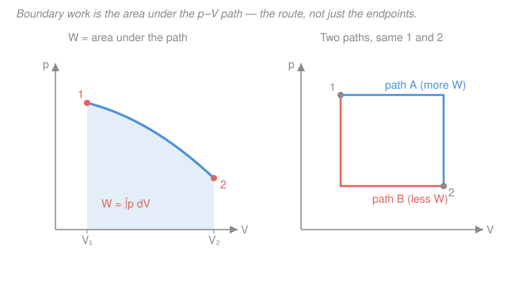

# Engineering Thermodynamics · Lesson 1.5: Work and heat

> ⏱ ~15 min · Module 1: Properties, Work & Heat · Builds on: [1.1 System vs. control volume; state & properties](01-01-system-vs-control-volume-state.md), [1.2 Phase behavior of a pure substance](01-02-phase-behavior-pure-substance.md), [1.3 Property tables & quality](01-03-property-tables-quality.md) · Unlocks: [2.1 First law for closed systems](02-01-first-law-closed-systems.md)

## Why this matters

Every engine, boiler, turbine, and refrigerator does exactly one thing at its core: it pushes energy across a boundary as **heat** or **work**. Before you can write the first law — the engineer's energy ledger — you have to know what those two entries *are*, how to compute them, and how to get their signs right. Get this lesson wrong and every first-law problem after it inherits the error. The single most important idea here is subtle and easy to miss: heat and work are **not** things a system *has*, like temperature or volume. They are things that *happen* — energy caught in the act of crossing a boundary. That distinction is what makes them **path-dependent**, and it's the reason a p–V *diagram*, not just a table of endpoints, tells you the work.

## The idea

Picture the piston–cylinder from [1.1](01-01-system-vs-control-volume-state.md). The gas inside has a definite state: a pressure, a temperature, a volume, an internal energy $U$. Those are **properties** — freeze the gas at any instant and you can measure them. Now let the gas push the piston out. Energy leaves the gas and shows up as motion of the piston: that transiting energy is **work**. Put a flame under the cylinder and energy flows in because of a temperature difference: that's **heat**. 

Here's the punchline. Ask "how much internal energy does the gas have?" — a fine question; $U$ is a property of the state. But ask "how much *heat* does the gas have?" and the question is nonsense. Heat isn't stored; it's a *flow*. The gas has energy; it does not "have heat" any more than a bank account "has deposits" — it has a balance, and deposits are the transactions that change it. Work and heat are the transactions. Energy is the balance.

Because they're transactions, *how you get from state 1 to state 2 matters*. Two different processes with the same start and end can move different amounts of work and heat — as long as their books balance to the same change in $U$. That's path dependence, and it's the whole reason we draw processes as *curves*, not just dots.

## The formal version

**Boundary work.** Take a gas at pressure $p$ (in $\mathrm{kPa} = \mathrm{kN/m^2}$) pushing a piston of area $A$ ($\mathrm{m^2}$) outward by a tiny distance $dx$ ($\mathrm{m}$). The force on the piston is $F = pA$, so the small bit of work is $\delta W = F\,dx = pA\,dx = p\,dV$, since $A\,dx = dV$ is the swept volume ($\mathrm{m^3}$). Summed over the process:

$$\boxed{\,W = \int_1^2 p\,dV\,}$$

*In words: the work a system does at its moving boundary is the pressure times the volume it sweeps out, added up along the way — the **area under the process path on a p–V diagram**.* This is a **moving-boundary** (or *quasi-equilibrium*) work: it requires that $p$ be well-defined all through the process, which holds when the process is slow enough to stay near equilibrium at every step.

**Sign convention (state it once, use it forever).** This course follows Çengel & Boles:

- $W > 0$ means work done **by** the system (the gas expands, pushes out — energy leaves).
- $Q > 0$ means heat added **to** the system (energy enters).

With that choice, the first law you'll meet in [2.1](02-01-first-law-closed-systems.md) reads

$$Q - W = \Delta U.$$

*In words: heat in minus work out equals the rise in the system's internal energy.* (Warning up front, expanded in **Watch out**: physics and chemistry texts often flip the work sign and write $Q + W = \Delta U$. Same physics, different bookkeeping. Pick one — we use $Q - W = \Delta U$ — and never mix.)

**Inexact differentials.** Because $W$ and $Q$ depend on the path, their infinitesimals get a special slash: $\delta W$ and $\delta Q$, not $dW$ and $dQ$. The slash means "this is a little *bit* of a path quantity, not the change of a property." Contrast:

$$\int_1^2 dU = U_2 - U_1 = \Delta U \quad(\text{depends only on endpoints}), \qquad \int_1^2 \delta W = W_{12} \quad(\text{depends on the path}).$$

*In words: you can talk about the **change** in a property $U$ between two states, but there is no "$\Delta W$" — work isn't a property, so there's nothing to take the difference of. It's just $W$, the total that flowed for that particular process.*

**Work for special paths.** Three cases you'll use constantly:

| Process | Path on p–V | Work $W = \int p\,dV$ |
|---|---|---|
| Constant volume (isochoric) | vertical line | $W = 0$ (no swept volume, $dV = 0$) |
| Constant pressure (isobaric) | horizontal line | $W = p\,(V_2 - V_1) = p\,\Delta V$ |
| Polytropic $pV^n = \text{const}$ | general curve | $W = \dfrac{p_2 V_2 - p_1 V_1}{1 - n}$ (preview, [2.2](02-02-closed-system-processes.md)) |

*In words: a rigid container does zero boundary work (nothing moves); a constant-pressure expansion does work equal to the pressure times the volume change; and the general power-law curve gets its own formula, which you'll derive next module.*

## Picture

## Worked examples

**Example 1 (Boss Problem 1 — constant-pressure work across the vapor dome).** A piston–cylinder holds $m = 2\ \mathrm{kg}$ of water at a constant $p = 200\ \mathrm{kPa}$, initially **saturated liquid** with $v_1 = v_f = 0.001061\ \mathrm{m^3/kg}$ (from the [1.3](01-03-property-tables-quality.md) saturation table at 200 kPa). Heat is added until the water reaches $300\,^\circ\mathrm{C}$, now **superheated** with $v_2 = 1.3162\ \mathrm{m^3/kg}$. Find the boundary work done by the water.

The pressure is held constant, so this is the isobaric case — pull $p$ out of the integral:

$$W = \int_1^2 p\,dV = p\,(V_2 - V_1) = p\,m\,(v_2 - v_1),$$

using $V = mv$ (extensive volume = mass × specific volume). Plug in:

$$W = (200\ \mathrm{kPa})(2\ \mathrm{kg})\bigl(1.3162 - 0.001061\bigr)\ \tfrac{\mathrm{m^3}}{\mathrm{kg}} = 200 \cdot 2 \cdot 1.315139 \approx 526\ \mathrm{kJ}.$$

The work is **positive** — the water expands and pushes the piston out, so energy leaves as work (our $W>0$ convention). 

*Units check.* $\mathrm{kPa}\cdot\mathrm{kg}\cdot\tfrac{\mathrm{m^3}}{\mathrm{kg}} = \mathrm{kPa}\cdot\mathrm{m^3} = \tfrac{\mathrm{kN}}{\mathrm{m^2}}\cdot\mathrm{m^3} = \mathrm{kN\cdot m} = \mathrm{kJ}$ ✓. *Sanity:* the fluid started as a droplet-dense liquid ($v_1 \approx 0.001$) and ballooned to a gas over a thousand times larger ($v_2 \approx 1.32$), so a big expansion doing hundreds of kJ of work is exactly what you'd expect. Note we found $W$ *without any first law* — boundary work needs only the path ($p$ constant) and the endpoints' volumes.

**Example 2 (why work is not a property — two paths, two answers).** A gas goes from state 1 ($p_1 = 300\ \mathrm{kPa}$, $V_1 = 0.10\ \mathrm{m^3}$) to state 2 ($p_2 = 100\ \mathrm{kPa}$, $V_2 = 0.30\ \mathrm{m^3}$) by two different routes (the right panel above).

*Path A — expand first at high pressure, then drop the pressure at fixed volume.* Segment 1→a is isobaric at $300$ kPa from $0.10$ to $0.30\ \mathrm{m^3}$; segment a→2 is isochoric (vertical), so it contributes nothing:

$$W_A = \underbrace{p_1(V_2 - V_1)}_{\text{expand at }300\text{ kPa}} + \underbrace{0}_{\text{const }V} = 300(0.30 - 0.10) = 60\ \mathrm{kJ}.$$

*Path B — drop the pressure first at fixed volume, then expand at low pressure.* Segment 1→b is isochoric ($W=0$); segment b→2 is isobaric at $100$ kPa:

$$W_B = 0 + p_2(V_2 - V_1) = 100(0.30 - 0.10) = 20\ \mathrm{kJ}.$$

Same two endpoints, **different work**: $60\ \mathrm{kJ}$ versus $20\ \mathrm{kJ}$. If work were a property it would have a single value fixed by states 1 and 2 — it doesn't, so it isn't. (The difference, $40\ \mathrm{kJ}$, is exactly the area *enclosed* between the two paths.) By contrast $\Delta U = U_2 - U_1$ is identical for both routes because $U$ *is* a property; the first law then forces the heat to differ too — $Q_A - Q_B = W_A - W_B = 40\ \mathrm{kJ}$ — so both books balance to the same $\Delta U$.

*Units check.* $\mathrm{kPa}\cdot\mathrm{m^3} = \mathrm{kJ}$ ✓. *Sanity:* path A holds the higher pressure while sweeping the volume, so it does more work — pushing hard while you move covers more area under the curve. ✓

## Watch out

- **You might think a system "contains" heat or work.** It doesn't. A state has internal energy $U$ (a property); "the heat in the gas" is a category error. Heat and work exist *only while crossing a boundary* — that's why we write $Q$ and $W$, never "$\Delta Q$" or "$\Delta W$," and why their differentials are inexact ($\delta Q$, $\delta W$). Energy is the noun; heat and work are the verbs.
- **You might think $W = \int p\,dV$ always uses the gas's own pressure, for any process.** Only for a **quasi-equilibrium** (slow, near-reversible) process, where $p$ is uniform and defined throughout. In a violent free expansion into a vacuum the gas pressure isn't even well-defined at the boundary, and the actual boundary work is *not* $\int p_{\text{gas}}\,dV$ (it's zero — nothing pushes back). Reach for the area-under-the-curve only when the path is a proper quasi-equilibrium curve.
- **You might mix sign conventions and flip a result.** We use $Q - W = \Delta U$ with $W>0$ for work done *by* the system. Many physics/chem books define work done *on* the system, giving $Q + W = \Delta U$ with the opposite sign on every $W$. Both are correct; they are *not* interchangeable mid-problem. Commit to $Q - W = \Delta U$ for this whole course.

## One-liner

> Heat and work are energy *in transit* across a boundary, not properties of a state — so boundary work is the path-dependent area $\int_1^2 p\,dV$ under the process curve, and $W>0$ means the system pushed out.

## Problems

**P1 (🟢)** A gas in a piston–cylinder expands at a constant pressure of $150\ \mathrm{kPa}$ from $V_1 = 0.05\ \mathrm{m^3}$ to $V_2 = 0.20\ \mathrm{m^3}$. Find the boundary work, state its sign, and say who does work on whom.

**P2 (🟡)** $0.5\ \mathrm{kg}$ of a gas is heated in a **rigid** sealed tank until its pressure doubles from $200$ to $400\ \mathrm{kPa}$. How much boundary work does the gas do? Explain in one sentence why, without any numbers about the gas.

**P3 (🔴)** A gas is compressed from state 1 ($p_1 = 100\ \mathrm{kPa}$, $V_1 = 0.40\ \mathrm{m^3}$) to state 2 ($p_2 = 400\ \mathrm{kPa}$, $V_2 = 0.10\ \mathrm{m^3}$) along a straight line on the p–V diagram. Find the work and its sign. (Hint: the area under a straight-line path is a trapezoid.)

Solutions

**P1** Constant pressure, so $W = p\,(V_2 - V_1) = 150\,(0.20 - 0.05) = 150 \cdot 0.15 = 22.5\ \mathrm{kJ}$. It is **positive**: the gas expands and does work *on* the piston (energy leaves the system).

*Check.* $\mathrm{kPa}\cdot\mathrm{m^3} = \mathrm{kJ}$ ✓. Expansion ⇒ $W>0$ in our convention ✓.

**P2** $W = 0$. The tank is rigid, so $dV = 0$ throughout and $W = \int p\,dV = 0$ — no boundary moves, so no boundary work is done, regardless of how high the pressure climbs. (The added energy all goes into raising $U$; heat in, no work out.)

*Check.* Isochoric row of the table: vertical line on p–V, zero area beneath the *change*. ✓

**P3** Straight-line path: $W = \int_1^2 p\,dV = $ area under the line $=$ average pressure × volume change (trapezoid rule):

$$W = \frac{p_1 + p_2}{2}\,(V_2 - V_1) = \frac{100 + 400}{2}\,(0.10 - 0.40) = 250 \cdot (-0.30) = -75\ \mathrm{kJ}.$$

The work is **negative**: the gas is compressed ($V_2 < V_1$), so the surroundings do work *on* the gas — energy enters as work.

*Check.* $\mathrm{kPa}\cdot\mathrm{m^3} = \mathrm{kJ}$ ✓. Compression ⇒ $\Delta V < 0$ ⇒ $W < 0$, consistent with the sign convention ($W>0$ only for expansion). ✓

## Flashback

**From Lesson 1.4 (The ideal-gas model and its limits):** A rigid $0.5\ \mathrm{m^3}$ tank holds air at $300\ \mathrm{kPa}$ and $300\ \mathrm{K}$. Treat air as an ideal gas with $R = 0.287\ \mathrm{kJ/(kg\cdot K)}$. (a) Find the mass of air. (b) The tank is now heated until the temperature reaches $450\ \mathrm{K}$; find the new pressure. (c) How much boundary work did the air do during the heating?

Solution

(a) Ideal-gas law $pV = mRT$, solve for mass:

$$m = \frac{pV}{RT} = \frac{(300\ \mathrm{kPa})(0.5\ \mathrm{m^3})}{(0.287\ \tfrac{\mathrm{kJ}}{\mathrm{kg\cdot K}})(300\ \mathrm{K})} = \frac{150}{86.1} \approx 1.74\ \mathrm{kg}.$$

*Units:* $\dfrac{\mathrm{kPa}\cdot\mathrm{m^3}}{\tfrac{\mathrm{kJ}}{\mathrm{kg\cdot K}}\cdot\mathrm{K}} = \dfrac{\mathrm{kJ}}{\mathrm{kJ/kg}} = \mathrm{kg}$ ✓ (using $\mathrm{kPa\cdot m^3 = kJ}$).

(b) The tank is rigid, so $V$ and $m$ are fixed; from $pV = mRT$, pressure is proportional to temperature at constant volume:

$$p_2 = p_1\,\frac{T_2}{T_1} = 300\,\frac{450}{300} = 450\ \mathrm{kPa}.$$

(c) $W = 0$. The tank is rigid — $dV = 0$ — so no boundary work is done no matter how much the temperature or pressure rises. This is exactly the constant-volume case that ties 1.4's ideal gas to this lesson's boundary work.

*Sanity:* heating a sealed can raises its pressure but moves no wall, so it does no work — matching everyday intuition (and why sealed cans burst rather than push). ✓

## Connections

- **Backward:** the boundary that $Q$ and $W$ cross is the one you learned to draw in [1.1](01-01-system-vs-control-volume-state.md); the volumes $V_1, V_2$ that set the work come from the states you learned to fix on p–V diagrams in [1.2](01-02-phase-behavior-pure-substance.md) and read off tables in [1.3](01-03-property-tables-quality.md). Example 1's $v_2$ is a superheated-table lookup from 1.3.
- **Forward:** [2.1 First law for closed systems](02-01-first-law-closed-systems.md) puts $Q$, $W$, and $\Delta U$ into one ledger, $Q - W = \Delta U$ — this lesson supplies the $W$ term and its sign. [2.2 Closed-system processes](02-02-closed-system-processes.md) derives the polytropic work formula previewed above and runs constant-$V$, constant-$p$, and polytropic paths end to end.
- **Sideways:** boundary work $\int p\,dV$ is the *same* "area under a curve" integral from [`calc-refresher`](../../calc-refresher/syllabus.md), and the *same* work concept as mechanical work $\int F\,dx$ in [`mechanics-refresher`](../../mechanics-refresher/syllabus.md) — here $p\,dV$ replaces $F\,dx$ because $F = pA$ and $dV = A\,dx$. Heat's *direction* (why it flows spontaneously only hot→cold) is the second law's job, coming in Module 3; this course treats entropy as bookkeeping, while its microscopic origin lives in [`thermodynamics-physics`](../../thermodynamics-physics/syllabus.md) and [`stat-mech`](../../stat-mech/syllabus.md).
