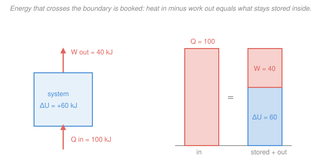

# Engineering Thermodynamics · Lesson 2.1: First law for closed systems

> ⏱ ~15 min · Module 2: The First Law — Closed & Open Systems · Builds on: [1.5 Work and heat](01-05-work-and-heat.md), [1.4 Ideal-gas model and its limits](01-04-ideal-gas-model-limits.md) · Unlocks: [2.2 Closed-system processes](02-02-closed-system-processes.md)

## Why this matters

In [1.5](01-05-work-and-heat.md) you learned to compute the two ways energy sneaks across a boundary — heat $Q$ and work $W$. But so what? The payoff is the **first law of thermodynamics**: energy is conserved, so whatever crosses the boundary has to *show up* as a change in the stuff inside. That single accounting identity is the engine of this whole course. Heat a tank, compress a gas, run a piston — the first law tells you exactly how much the fluid's stored energy changed, or, run backwards, how much heat a process demanded. Every device in Module 4 (turbines, boilers, condensers) is just this balance with different terms zeroed out.

## The idea

Think of the system as a bank account whose balance is its **internal energy** $U$ — the microscopic jiggling and bonding of its molecules. Energy can only enter or leave in two currencies: **heat** (driven by a temperature difference) and **work** (an organized push, like a piston). Conservation of energy says the account can't gain or lose a joule that didn't cross the boundary. So:

*change in the balance = deposits − withdrawals.*

With Çengel's sign convention from [1.5](01-05-work-and-heat.md) — **heat added to the system is positive, work done *by* the system is positive** — heat is the deposit and work is the withdrawal. Add 100 kJ of heat, let the gas do 40 kJ of work pushing a piston, and the balance rises by exactly 60 kJ. Nothing leaks. That's the entire law; everything else is learning to read the balance $U$ off a table.

## The formal version

**First law, closed system.** For a fixed mass with no flow across the boundary, over any process from state 1 to state 2,

$$\boxed{\,Q - W = \Delta U = U_2 - U_1\,}$$

where $Q$ is net heat transfer *into* the system (kJ), $W$ is net work done *by* the system (kJ), and $U$ is internal energy (kJ). *In words: heat in minus work out equals the rise in stored energy — you can't create or destroy a joule, only move it.* Per unit mass, divide by $m$ (kg): $q - w = \Delta u$, with lower-case $u$ in kJ/kg.

Strictly, the stored energy is $E = U + \mathrm{KE} + \mathrm{PE}$, so the full law is $Q - W = \Delta U + \Delta\mathrm{KE} + \Delta\mathrm{PE}$. **Add the kinetic and potential terms only when they actually change** — for a gas heated in a fixed tank they're both zero, and $Q - W = \Delta U$ is all you need.

**Cyclic form.** If the system returns to its starting state (a cycle), $U$ is a *property* and comes back to its initial value, so $\Delta U = 0$ and

$$\oint \delta Q = \oint \delta W.$$

*In words: over a complete cycle, the net heat you put in equals the net work you get out* — the basis of every heat engine. (The $\delta$, not $d$, is [1.5](01-05-work-and-heat.md)'s reminder that $Q$ and $W$ are path-dependent, not properties.)

**Internal energy is a property.** $u$ depends only on the *state*, not the path taken to reach it — so for water you simply read $u$ from the same tables as [1.3](01-03-property-tables-quality.md), and $\Delta u = u_2 - u_1$ regardless of how you got there. To turn temperature changes into energy changes, define the **specific heats**:

$$c_v = \left(\frac{\partial u}{\partial T}\right)_v, \qquad c_p = \left(\frac{\partial h}{\partial T}\right)_p,$$

in kJ/(kg·K). *In words: $c_v$ is how many kJ per kg it takes to raise the temperature 1 K at constant volume; $c_p$ is the same at constant pressure.* They differ because at constant pressure the substance also expands and spends some energy doing boundary work — so $c_p > c_v$ always.

**Enthalpy.** The combination

$$h = u + pv \quad (\text{kJ/kg})$$

gets its own name, **enthalpy**, where $p$ is pressure (kPa) and $v$ is specific volume (m³/kg). Right now it's just a convenient bundle — its real payoff arrives with flow devices in [2.3](02-03-mass-energy-balance-control-volumes.md), where the $pv$ term is exactly the work needed to push fluid across a boundary.

**Ideal gases (the Module-1 simplification).** For an ideal gas, $u$ and $h$ depend on **temperature only** — not pressure or volume. So the specific heats collapse to ordinary derivatives and integrate to

$$\Delta u = c_v\,\Delta T, \qquad \Delta h = c_p\,\Delta T$$

(taking $c_v, c_p$ constant over the range). Because $h = u + pv = u + RT$ for an ideal gas, differentiating in $T$ gives $c_p = c_v + \dfrac{d(RT)}{dT}$, i.e.

$$\boxed{\,c_p = c_v + R\,}, \qquad k \equiv \frac{c_p}{c_v}.$$

*In words: the constant-pressure specific heat exceeds the constant-volume one by exactly the gas constant $R$* — the expansion tax. The ratio $k$ (the **specific-heat ratio**) governs the isentropic relations in Module 3. For air: $c_v = 0.718$, $c_p = 1.005\ \mathrm{kJ/(kg\cdot K)}$, $R = 0.287\ \mathrm{kJ/(kg\cdot K)}$, and indeed $0.718 + 0.287 = 1.005$, with $k = 1.005/0.718 = 1.4$.

## Picture

The heat you pour in (coral, 100 kJ) splits into work that leaves (coral, 40 kJ) and internal energy that stays (blue, 60 kJ). The two bars must balance — that *is* the first law.

## Worked examples

**Example 1 (rigid tank — constant volume, so $W = 0$).** A rigid tank holds $m = 3$ kg of air, initially at some temperature. Heat is added until the air's temperature rises by $\Delta T = 100$ K. How much heat?

The tank is rigid, so its volume never changes and the boundary never moves — **no boundary work**, $W = 0$. Kinetic and potential energy don't change either. The first law reduces to

$$Q = \Delta U = m\,c_v\,\Delta T.$$

Treating air as an ideal gas with $c_v = 0.718\ \mathrm{kJ/(kg\cdot K)}$,

$$Q = (3\ \mathrm{kg})(0.718\ \mathrm{kJ/(kg\cdot K)})(100\ \mathrm{K}) = 215.4\ \mathrm{kJ}.$$

*Check.* Units: $\mathrm{kg}\cdot\tfrac{\mathrm{kJ}}{\mathrm{kg\cdot K}}\cdot\mathrm{K} = \mathrm{kJ}$ ✓. Sign: $Q > 0$, heat *in*, as it must be to warm the gas ✓. Note we used $c_v$ (not $c_p$) because the volume is fixed — the defining condition of $c_v$.

**Example 2 (piston — work and heat both nonzero).** A gas in a piston–cylinder does $W = 40$ kJ of work on the piston while $Q = 100$ kJ of heat is added. Find $\Delta U$ and say what its sign means.

Both terms are positive in Çengel's convention (heat in, work by the gas). Directly,

$$\Delta U = Q - W = 100 - 40 = +60\ \mathrm{kJ}.$$

*Interpretation.* The gas received 100 kJ, spent 40 kJ pushing the piston, and **banked the remaining 60 kJ** as internal energy — its temperature rose. The positive sign says the account grew. Had the gas done more work than the heat supplied (say $W = 120$ kJ), $\Delta U = 100 - 120 = -20$ kJ would be negative: the gas would have dipped into its own stored energy to do the extra work, and *cooled*. This is the balance drawn in the figure.

*Check.* $Q = W + \Delta U = 40 + 60 = 100$ kJ ✓ — every joule accounted for.

## Watch out

- **You might think $c_v$ only applies to constant-volume processes.** But $\Delta u = c_v\,\Delta T$ holds for an ideal gas in *any* process — constant pressure, expanding, whatever — because $u$ depends on $T$ alone, so it can't care how the volume changed. The constant-volume label is just where the definition was *born*, not a restriction on its use. (Same for $\Delta h = c_p\,\Delta T$.)
- **You might drop the minus sign and write $Q + W = \Delta U$.** That's the *physicist's* convention (work done *on* the system counts positive). This course uses Çengel's engineering convention $Q - W = \Delta U$, work *by* the system positive. Both are correct bookkeeping; mixing them flips signs and wrecks answers. Pick one — here, always $Q - W$.
- **You might think adding heat always raises the temperature.** Not if the gas is simultaneously doing enough work: in Example 2's variant the gas *cooled* despite heat coming in, because $W > Q$. And during a phase change (boiling water), heat raises $u$ with *no* temperature change at all — that's [1.3](01-03-property-tables-quality.md)'s latent heat.

## One-liner

> Heat in minus work out equals the change in stored energy, $Q - W = \Delta U$ — and for an ideal gas $\Delta u = c_v\,\Delta T$, with $c_p = c_v + R$ paying the expansion tax.

## Problems

**P1 (🟢)** A rigid, insulated tank contains 2 kg of air. A paddle wheel does 30 kJ of work *on* the gas (stirring it). Since the tank is rigid and insulated, find $\Delta U$ and the temperature rise $\Delta T$. (Use $c_v = 0.718\ \mathrm{kJ/(kg\cdot K)}$.)

**P2 (🟡)** During a process, a closed system rejects 25 kJ of heat while 60 kJ of work is done *on* it (compression). Find $\Delta U$, and state whether the system's temperature rose or fell.

**P3 (🔴)** 0.5 kg of air is heated at *constant pressure* from 300 K to 500 K. (a) Find $\Delta U$ and $\Delta H$. (b) Using the first law, find the heat added $Q$ and the boundary work $W$. (Use $c_v = 0.718$, $c_p = 1.005\ \mathrm{kJ/(kg\cdot K)}$.)

Solutions

**P1** Rigid ⇒ no boundary work; but the paddle wheel *does* do work. Paddle work is done **on** the gas, so in Çengel's convention (work *by* the system positive) it is **negative**: $W = -30$ kJ. Insulated ⇒ $Q = 0$. First law:

$$\Delta U = Q - W = 0 - (-30) = +30\ \mathrm{kJ}.$$

Then $\Delta T = \dfrac{\Delta U}{m\,c_v} = \dfrac{30}{(2)(0.718)} = \dfrac{30}{1.436} = 20.9\ \mathrm{K}.$

*Check.* Units: $\mathrm{kJ}/(\mathrm{kg}\cdot\mathrm{kJ/(kg\cdot K)}) = \mathrm{K}$ ✓. Sanity: stirring an insulated fluid warms it (all the shaft work becomes internal energy) — this is the classic Joule paddle-wheel experiment. The sign trap is the whole point: work *on* the system is negative $W$. ✓

**P2** Heat *rejected* means $Q = -25$ kJ. Work done *on* the system means $W = -60$ kJ (work by the system is negative). First law:

$$\Delta U = Q - W = (-25) - (-60) = -25 + 60 = +35\ \mathrm{kJ}.$$

$\Delta U > 0$, so for an ideal gas the temperature **rose**: the 60 kJ of compression work poured in exceeded the 25 kJ of heat leaking out, and the surplus 35 kJ became internal energy.

*Check.* Balance: energy in (60 kJ compression) − energy out (25 kJ heat) = 35 kJ stored ✓. A pump/compressor heating up despite losing some heat to the room is exactly this scenario.

**P3** Ideal gas, so $\Delta u,\Delta h$ depend on $T$ only — the "constant pressure" label affects $Q$ and $W$, not $\Delta U$ and $\Delta H$.

(a) With $\Delta T = 500 - 300 = 200$ K:
$$\Delta U = m\,c_v\,\Delta T = (0.5)(0.718)(200) = 71.8\ \mathrm{kJ},$$
$$\Delta H = m\,c_p\,\Delta T = (0.5)(1.005)(200) = 100.5\ \mathrm{kJ}.$$

(b) At constant pressure, boundary work is $W = p\,\Delta V = m\,R\,\Delta T$ (using $pV = mRT$ so $p\,\Delta V = mR\,\Delta T$ at fixed $p$):
$$W = m\,R\,\Delta T = (0.5)(0.287)(200) = 28.7\ \mathrm{kJ}.$$
First law gives the heat:
$$Q = \Delta U + W = 71.8 + 28.7 = 100.5\ \mathrm{kJ}.$$

*Check.* Notice $Q = 100.5$ kJ $= \Delta H$ exactly. That's no accident: **at constant pressure, $Q = \Delta H$** — the enthalpy's first payoff, because $Q = \Delta U + p\,\Delta V = \Delta(U + pV) = \Delta H$. Also $c_p = c_v + R$ shows up as $\Delta H - \Delta U = 100.5 - 71.8 = 28.7\ \mathrm{kJ} = W$ ✓, the expansion tax made concrete. Units all kJ ✓.

## Flashback

**From Lesson 1.5 (Work and heat):** A gas in a piston–cylinder expands at a constant pressure of 200 kPa from a volume of 0.02 m³ to 0.05 m³. Compute the boundary work done by the gas.

Solution

For a constant-pressure process the boundary work $\int p\,dV$ has constant $p$, so it comes straight out of the integral:

$$W = \int_{V_1}^{V_2} p\,dV = p\,(V_2 - V_1) = (200\ \mathrm{kPa})(0.05 - 0.02\ \mathrm{m^3}) = (200)(0.03) = 6\ \mathrm{kJ}.$$

*Check.* Units: $\mathrm{kPa}\cdot\mathrm{m^3} = \mathrm{kN/m^2}\cdot\mathrm{m^3} = \mathrm{kN\cdot m} = \mathrm{kJ}$ ✓. Sign: the gas *expands* ($V_2 > V_1$), so it does work *on* the surroundings — $W > 0$ in the engineering convention ✓. On a $p$–$V$ diagram this is the rectangular area under the horizontal process line.

## Connections

- **Backward:** this is [1.5](01-05-work-and-heat.md)'s $Q$ and $W$ finally *balanced* against a stored quantity, and it leans on [1.4](01-04-ideal-gas-model-limits.md)'s ideal-gas model to write $\Delta u = c_v\,\Delta T$ and $h = u + RT$. The property $u$ is read from the same tables as [1.3](01-03-property-tables-quality.md).
- **Forward:** [2.2 Closed-system processes](02-02-closed-system-processes.md) applies this law to constant-$V$, constant-$p$, and polytropic paths, computing $W$ and $Q$ for each. Enthalpy graduates from "convenient bundle" to the star of the show in the control-volume energy balance of [2.3](02-03-mass-energy-balance-control-volumes.md). The cyclic form $\oint\delta Q = \oint\delta W$ becomes the net work of every cycle in Module 4.
- **Sideways (physics):** the first law is just **conservation of energy** from mechanics — the same $mgh \leftrightarrow \tfrac12 mv^2$ bookkeeping — with one new channel, heat, added to the ledger. Where mechanics stops (it has no $Q$), thermodynamics begins. The [`thermodynamics-physics`](../../thermodynamics-physics/syllabus.md) course reaches the *same* first law from the microscopic side; and while this course treats internal energy as a number you read from a table, that course and `stat-mech` explain *why* $u$ depends only on $T$ for an ideal gas — it's the average molecular kinetic energy.
