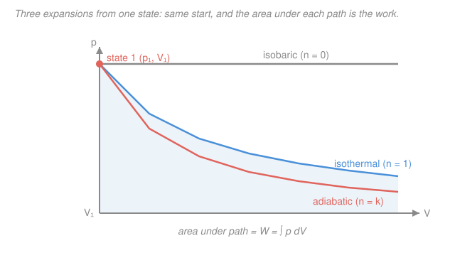

# Engineering Thermodynamics · Lesson 2.2: Closed-system processes

> ⏱ ~15 min · Module 2: The First Law — Closed & Open Systems · Builds on: [2.1 First law for closed systems](02-01-first-law-closed-systems.md), [1.5 Work and heat](01-05-work-and-heat.md) · Unlocks: [3.3 Entropy balance & the $Tds$ relations](03-03-entropy-balance-tds-relations.md), [4.2 Gas power cycles](04-02-gas-power-cycles-otto-diesel.md)

## Why this matters

The first law, $Q - W = \Delta U$, is one equation with three unknowns — useless until you pin down the *path* the fluid takes. In real hardware the path is almost never arbitrary: a rigid tank holds volume fixed, a weighted piston holds pressure fixed, a slow compression in a well-oiled cylinder follows $pV^n = \text{const}$. Each constraint collapses the first law to something you can solve on the back of an envelope. Learn these four processes and you can hand-analyze any stroke of any engine — which is exactly what Module 4's cycles are built from.

## The idea

A **process** is a specified way of getting a closed system from state 1 to state 2. Fixing one thing along the way — volume, pressure, temperature, or the combination $pV^n$ — turns the open-ended first law into a one-liner, because it tells you immediately what the *work* is (the area under the path on a $p$–$V$ diagram) and often what $\Delta U$ is too.

Here's the whole lesson in one breath. Hold **volume** fixed and the boundary can't move, so no work is done — every joule of heat lands in internal energy. Hold **pressure** fixed and the gas must shove the piston out as it warms, so some heat pays for that push; the natural bookkeeping quantity becomes **enthalpy**, $H = U + pV$. Hold **temperature** fixed (ideal gas) and internal energy doesn't budge, so heat in equals work out, joule for joule. And the general **polytropic** path $pV^n = \text{const}$ is the master curve: dial the exponent $n$ and it *becomes* each of the others in turn. Four processes, one family.

## The formal version

Throughout, sign convention from [2.1](02-01-first-law-closed-systems.md): $Q$ is heat *into* the system, $W = \int_1^2 p\,dV$ is boundary work done *by* the system (positive on expansion), and the closed-system first law is

$$Q - W = \Delta U = m(u_2 - u_1),$$

with $m$ the mass (kg), $u$ the specific internal energy (kJ/kg). For an ideal gas, $\Delta u = c_v\,\Delta T$ and $\Delta h = c_p\,\Delta T$, where $c_v, c_p$ are the specific heats (kJ/(kg·K)), $\Delta T = T_2 - T_1$ (K), and $c_p = c_v + R$. For air we use $R = 0.287$, $c_v = 0.718$, $c_p = 1.005\ \mathrm{kJ/(kg\cdot K)}$, and $k \equiv c_p/c_v = 1.4$.

**Isochoric (constant volume).** The boundary never moves, so $dV = 0$:

$$W = 0, \qquad Q = \Delta U = m c_v\,\Delta T.$$

*In words: with no work done, all the heat becomes internal energy.* This is why $c_v$ — the "constant-volume" specific heat — is literally *heat per degree when no work escapes*.

**Isobaric (constant pressure).** Pressure is held at $p$ while volume changes, so the work is just pressure times the volume swept:

$$W = \int_1^2 p\,dV = p\,(V_2 - V_1) = p\,\Delta V.$$

Feed that into the first law:

$$Q = \Delta U + W = \Delta U + p\,\Delta V = \Delta(U + pV) = \Delta H = m c_p\,\Delta T.$$

*In words: at constant pressure the heat equals the change in **enthalpy**, not internal energy, because part of the heat goes into pushing the boundary out.* That $p\,\Delta V$ is the enthalpy payoff — it is exactly the gap between $c_p$ and $c_v$. For an ideal gas $c_p - c_v = R$, and the "$R$" is precisely the boundary-work-per-degree the gas must do to stay at constant pressure.

**Isothermal (constant temperature, ideal gas).** For an ideal gas $u$ depends only on $T$, so $\Delta T = 0 \Rightarrow \Delta U = 0$. The first law then forces $Q = W$. Using $p = mRT/V$ with $T$ constant:

$$W = \int_1^2 p\,dV = mRT\int_1^2 \frac{dV}{V} = mRT\,\ln\!\frac{V_2}{V_1}, \qquad Q = W, \quad \Delta U = 0.$$

*In words: at fixed temperature the gas is a perfect pass-through — every joule of heat you add comes straight back out as work.* (Since $pV$ is constant here, $V_2/V_1 = p_1/p_2$, so you can write it in pressures too.)

**Polytropic ($pV^n = \text{const}$).** The master process. Along it, $p = C V^{-n}$ with constant $C = p_1V_1^n = p_2V_2^n$, so for any $n \ne 1$:

$$W = \int_1^2 C V^{-n}\,dV = \frac{C\,(V_2^{1-n} - V_1^{1-n})}{1-n} = \frac{p_2 V_2 - p_1 V_1}{1 - n}.$$

*In words: work is just the change in the product $pV$, divided by $1 - n$.* (For $n = 1$ the integral gives the isothermal log instead.) The exponent $n$ selects the process:

| $n$ | Process | What's held fixed |
|---|---|---|
| $0$ | isobaric | $p$ (curve $pV^0 = p$) |
| $1$ | isothermal (ideal gas) | $T$ (curve $pV = mRT$) |
| $k = 1.4$ | adiabatic / isentropic (ideal gas) | $Q = 0$, reversible |
| $\infty$ | isochoric | $V$ (a vertical line on $p$–$V$) |

The $n = k$ case is the reversible **adiabatic**: no heat crosses the boundary, and for an ideal gas it is also **isentropic** (constant entropy — that word is Module 3's job; [3.3](03-03-entropy-balance-tds-relations.md) earns it). The specific enthalpy that showed up in the isobaric case, $h = u + pv$ (with $v = V/m$ the specific volume, m³/kg), is a property of the *state*, not the path — you'll reuse it constantly once mass starts flowing in [2.3](02-03-mass-energy-balance-control-volumes.md).

## Picture

From one starting state, the steeper the path drops, the smaller the area beneath it — so for the *same* volume change the isobaric expansion does the most work, the adiabatic the least, and the isothermal sits between. That ordering is the whole intuition for why cycles route different strokes through different processes.

## Worked examples

**Example 1 (polytropic compression — the full first-law chain).** Air is compressed polytropically with $n = 1.3$ from $p_1 = 100$ kPa, $V_1 = 0.02\ \mathrm{m^3}$ to $p_2 = 600$ kPa. Find $V_2$, $W$, $\Delta U$, and $Q$.

*Final volume* from $p_1 V_1^n = p_2 V_2^n$:

$$V_2 = V_1\left(\frac{p_1}{p_2}\right)^{1/n} = 0.02\left(\frac{100}{600}\right)^{1/1.3} = 0.02\,(0.1667)^{0.769} = 0.02 \times 0.2520 = 0.00504\ \mathrm{m^3}.$$

*Work* (using $p\,V$ in kPa·m³ = kJ):

$$W = \frac{p_2 V_2 - p_1 V_1}{1 - n} = \frac{(600)(0.00504) - (100)(0.02)}{1 - 1.3} = \frac{3.024 - 2.000}{-0.3} = \frac{1.024}{-0.3} = -3.41\ \mathrm{kJ}.$$

Negative — as it must be, since we *compressed* the gas: the surroundings did 3.41 kJ of work *on* it.

*Internal energy.* We don't know $m$ or $T$ separately, but we don't need them: $\Delta U = m c_v \Delta T$ and $m R\,\Delta T = \Delta(pV) = p_2V_2 - p_1V_1 = 1.024$ kJ, so

$$\Delta U = \frac{c_v}{R}\,(p_2 V_2 - p_1 V_1) = \frac{0.718}{0.287}\,(1.024) = 2.50 \times 1.024 = 2.56\ \mathrm{kJ}.$$

*Heat*, from the first law:

$$Q = \Delta U + W = 2.56 + (-3.41) = -0.85\ \mathrm{kJ}.$$

Negative — heat *leaves* the gas. Sensible: compression heats the air, and since $n = 1.3$ sits between isothermal ($n=1$) and adiabatic ($n=1.4$), the gas sheds a little heat while warming. **Sanity check:** units are consistent (kPa·m³ = kJ throughout); $|W| > |\Delta U|$ because part of the input work is carried off as rejected heat. ✓

**Example 2 (isothermal expansion — heat straight to work).** 1 kg of air held at $T = 300$ K expands isothermally until its volume doubles, $V_2 = 2V_1$. Find $W$, $Q$, and $\Delta U$.

$$W = mRT\,\ln\frac{V_2}{V_1} = (1)(0.287)(300)\ln 2 = 86.1 \times 0.693 = 59.7\ \mathrm{kJ}.$$

Because temperature is fixed, $\Delta U = 0$, so

$$Q = W = 59.7\ \mathrm{kJ}, \qquad \Delta U = 0.$$

Every one of those 59.7 kJ of heat added to the gas came right back out as expansion work — the gas is a perfect middleman. **Sanity check:** $W > 0$ for an expansion ✓; units $\mathrm{kg}\cdot\frac{\mathrm{kJ}}{\mathrm{kg\cdot K}}\cdot\mathrm{K} = \mathrm{kJ}$ ✓; doubling volume gives the modest $\ln 2$ factor, not a factor of 2 — the log is the signature of the isothermal path. ✓

## Watch out

- **You might think $c_p$ only shows up in flow problems.** It shows up in any *constant-pressure* process, flowing or not: a piston under constant load is a closed system, yet $Q = m c_p \Delta T$ there. The reason is universal — at constant $p$, the heat equals $\Delta H$, and $\Delta H = m c_p \Delta T$. The extra $R$ over $c_v$ is the boundary work the gas does staying at pressure.
- **You might read $n = k$ as "isothermal."** No — $n = 1$ is isothermal ($Q = W$, $\Delta U = 0$); $n = k = 1.4$ is adiabatic ($Q = 0$, and all the work comes out of $\Delta U$). They are different curves: the adiabatic falls *steeper* on $p$–$V$ because the gas also cools as it expands.
- **You might drop the sign on $W$.** $W = \int p\,dV$ is work done *by* the gas: positive when volume grows (expansion), negative when it shrinks (compression). Plug the signed $W$ into $Q - W = \Delta U$. In Example 1, $W = -3.41$ kJ made $Q$ come out negative; using $+3.41$ would flip the physics.

## One-liner

> Fix one thing about the path and the first law collapses to a line: constant $V$ sends all heat to $\Delta U$, constant $p$ sends it to $\Delta H = mc_p\Delta T$, constant $T$ sends it straight to work, and $pV^n=$const interpolates across all of them.

## Problems

**P1 (🟢)** A rigid, sealed 0.5 m³ tank holds air. 40 kJ of heat is added. How much boundary work is done, and what is the change in internal energy? Name the process.

**P2 (🟡)** 2 kg of air is heated at a constant 150 kPa from 300 K to 400 K. Find the boundary work $W$ and the heat added $Q$. (Use $c_p = 1.005$, $R = 0.287\ \mathrm{kJ/(kg\cdot K)}$.)

**P3 (🔴)** Air expands adiabatically ($n = k = 1.4$) from $p_1 = 500$ kPa, $V_1 = 0.01\ \mathrm{m^3}$ to $V_2 = 0.03\ \mathrm{m^3}$. Find $p_2$, the work $W$, and $\Delta U$ — without knowing the mass. What is $Q$, and why?

Solutions

**P1** A rigid tank fixes volume: this is **isochoric**, so $W = 0$. The first law $Q - W = \Delta U$ then gives $\Delta U = Q - 0 = 40\ \mathrm{kJ}$. All the heat went into internal energy (the air's temperature rose). *Check:* no moving boundary ⇒ no $\int p\,dV$ ⇒ $W=0$; energy in = energy stored. ✓

**P2** Constant pressure, so $W = p\,\Delta V$. Get $\Delta V$ from the ideal-gas law, $V = mRT/p$:

$$\Delta V = \frac{mR\,\Delta T}{p} = \frac{(2)(0.287)(400-300)}{150} = \frac{57.4}{150} = 0.383\ \mathrm{m^3}, \quad W = p\,\Delta V = 150 \times 0.383 = 57.4\ \mathrm{kJ}.$$

(Equivalently $W = mR\,\Delta T = 57.4$ kJ — at constant $p$ the boundary work per degree *is* $mR$.) The heat is $Q = \Delta H = m c_p \Delta T = (2)(1.005)(100) = 201\ \mathrm{kJ}$. *Check:* $\Delta U = m c_v \Delta T = (2)(0.718)(100) = 143.6$ kJ, and $\Delta U + W = 143.6 + 57.4 = 201$ kJ $= Q$ ✓ — the first law closes.

**P3** For $n = k = 1.4$, $p_1 V_1^k = p_2 V_2^k$:

$$p_2 = p_1\left(\frac{V_1}{V_2}\right)^k = 500\left(\frac{0.01}{0.03}\right)^{1.4} = 500\,(0.3333)^{1.4} = 500 \times 0.2148 = 107.4\ \mathrm{kPa}.$$

Work, from the polytropic formula:

$$W = \frac{p_2 V_2 - p_1 V_1}{1 - n} = \frac{(107.4)(0.03) - (500)(0.01)}{1 - 1.4} = \frac{3.222 - 5.000}{-0.4} = \frac{-1.778}{-0.4} = 4.45\ \mathrm{kJ}.$$

Adiabatic means $Q = 0$, so the first law gives $\Delta U = Q - W = 0 - 4.45 = -4.45\ \mathrm{kJ}$. The gas did 4.45 kJ of expansion work entirely at the expense of its own internal energy — so it cooled. *Check:* expansion ⇒ $W > 0$ ✓; $Q = 0$ ⇒ $\Delta U = -W < 0$, the gas cools as it expands with no heat resupply ✓. No mass needed — everything came from $p$ and $V$ at the two states. ✓

## Flashback

**From Lesson 2.1 (First law for closed systems):** A closed system does 40 kJ of boundary work on its surroundings while its internal energy *drops* by 25 kJ. How much heat crossed the boundary, and in which direction?

Solution

First law, $Q - W = \Delta U$, with $W = +40$ kJ (work done by the system) and $\Delta U = -25$ kJ:

$$Q = \Delta U + W = -25 + 40 = +15\ \mathrm{kJ}.$$

$Q$ is positive, so 15 kJ of heat was added *to* the system. *Check:* the system released 40 kJ as work but its energy fell by only 25 kJ, so it must have been topped up by 15 kJ of heat — the balance is exactly the first law's bookkeeping. ✓

## Connections

- **Backward:** every process here is the first law of [2.1](02-01-first-law-closed-systems.md) plus one constraint, and the work in each is the boundary work $\int p\,dV$ built in [1.5](01-05-work-and-heat.md) — the isobaric and polytropic formulas are just that integral evaluated for a fixed pressure or a fixed $pV^n$.
- **Forward:** the enthalpy $H = U + pV$ that surfaced in the isobaric case becomes the star of [2.3](02-03-mass-energy-balance-control-volumes.md), where flow work makes it the natural energy of a moving stream. The adiabatic $n = k$ curve is the raw material for the compression and expansion strokes of the Otto, Diesel, and Brayton cycles in [4.2](04-02-gas-power-cycles-otto-diesel.md) and [4.3](04-03-brayton-gas-turbine-cycle.md).
- **Sideways (entropy):** calling the reversible adiabatic "isentropic" is a promissory note — this course treats entropy as pure bookkeeping ([3.3](03-03-entropy-balance-tds-relations.md) shows $pV^k=$const is exactly the $s = $ const path). Its microscopic *meaning* — why that particular exponent, why entropy exists at all — lives in [`thermodynamics-physics`](../../thermodynamics-physics/syllabus.md) and [`stat-mech`](../../stat-mech/syllabus.md).
