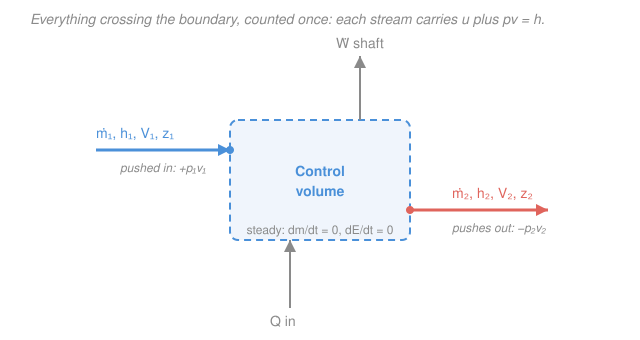

# Engineering Thermodynamics · Lesson 2.3: Mass & energy balance for control volumes

> ⏱ ~15 min · Module 2: The First Law — Closed & Open Systems · Builds on: [2.1 First law for closed systems](02-01-first-law-closed-systems.md), [1.1 System vs. control volume](01-01-system-vs-control-volume-state.md) · Unlocks: [2.4 Steady-flow work devices](02-04-steady-flow-devices-work.md), [2.5 No-work devices](02-05-steady-flow-devices-no-work.md)

## Why this matters

Almost every machine that matters — turbines, compressors, pumps, boilers, nozzles, jet engines, your home furnace — is a box that fluid *flows through*. Mass doesn't sit still inside a piston; it streams in one port and out another while the box does its job. The closed-system first law from [2.1](02-01-first-law-closed-systems.md) can't handle that: it assumed a fixed lump of matter. This lesson upgrades it to a **control volume** — a fixed region in space that mass crosses — and lands on the single equation you'll use to size real hardware for the rest of Module 2. Along the way you'll meet the reason enthalpy $h$ keeps showing up: it's the natural energy currency of anything that flows.

## The idea

Two bookkeeping questions, one for stuff and one for energy.

**Stuff first.** Draw a boundary around the device. Whatever mass rate flows in must either flow back out or pile up inside. That's it — that's conservation of mass. If nothing is piling up (the machine is running in a steady hum, the same at 3 p.m. as at 3:01), then *mass in equals mass out*, port for port.

**Now energy.** Here's the twist that makes open systems different. To shove a parcel of fluid *into* the control volume, the fluid behind it has to push it across the boundary against the local pressure — like squeezing toothpaste through the neck of the tube. That push does work, called **flow work**, and it costs exactly $pv$ per kilogram. So every kilogram entering doesn't just bring its internal energy $u$; it also arrives with a "delivery fee" of flow work $pv$ already paid in. Add them: $u + pv$. But $u + pv$ is precisely **enthalpy** $h$, the combination you first met in [2.2](02-02-closed-system-processes.md). That's the aha: *enthalpy isn't a math convenience here — it's the physical energy a flowing stream carries.* Track $h$ at the ports and the flow work bookkeeps itself.

## The formal version

**Conservation of mass.** The **mass flow rate** $\dot m$ (kg/s) through a port of cross-sectional area $A$ (m$^2$), where the fluid has density $\rho$ (kg/m$^3$), specific volume $v = 1/\rho$ (m$^3$/kg), and average normal velocity $V$ (m/s), is

$$\dot m = \rho A V = \frac{A V}{v}.$$

*In words: mass rate = how packed the fluid is, times how big the hole is, times how fast it moves.* A mass balance on the control volume (CV) reads

$$\sum_{\text{in}} \dot m - \sum_{\text{out}} \dot m = \frac{dm_{CV}}{dt},$$

the rate mass accumulates inside. **Steady state** means nothing inside changes with time, so $dm_{CV}/dt = 0$ and

$$\boxed{\sum_{\text{in}} \dot m = \sum_{\text{out}} \dot m.}$$

*In words: at steady state, total mass in per second equals total mass out per second.* For a single inlet and single outlet this is just $\dot m_1 = \dot m_2$, i.e. $\dfrac{A_1 V_1}{v_1} = \dfrac{A_2 V_2}{v_2}$.

**Flow work.** To push a small mass $\delta m$, occupying volume $\delta \mathcal{V} = v\,\delta m$, across a boundary where the pressure is $p$ (kPa), the fluid behind it exerts force $pA$ over distance $\delta \mathcal{V}/A$, doing work $p\,\delta \mathcal{V} = p v\,\delta m$. Per unit mass, the **flow work** is $w_{\text{flow}} = pv$ (kJ/kg). Adding it to the internal energy each stream carries:

$$\underbrace{u}_{\text{internal energy}} + \underbrace{pv}_{\text{flow work}} = h, \qquad h = u + pv \;\; (\text{kJ/kg}).$$

**Steady-flow energy equation (SFEE).** Energy accumulating in the CV = energy in − energy out. At steady state accumulation is zero, and each stream ferries enthalpy $h$, kinetic energy $\tfrac{V^2}{2}$, and potential energy $gz$ (with $g = 9.81\ \mathrm{m/s^2}$ and $z$ the height, m). Using the same sign convention as [2.1](02-01-first-law-closed-systems.md) — heat $\dot Q$ (kW) positive *in*, shaft work $\dot W_{\text{shaft}}$ (kW) positive *out*:

$$\boxed{\;\dot Q - \dot W_{\text{shaft}} = \sum_{\text{out}} \dot m\!\left(h + \tfrac{V^2}{2} + gz\right) - \sum_{\text{in}} \dot m\!\left(h + \tfrac{V^2}{2} + gz\right).\;}$$

*In words: net heat in minus shaft work out equals the total energy the outgoing streams carry away minus what the incoming streams brought.* Flow work is **not** a separate term — it's already baked into every $h$. For a single inlet/outlet with $\dot m_1 = \dot m_2 = \dot m$, divide by $\dot m$ to get the per-unit-mass form:

$$q - w_{\text{shaft}} = (h_2 - h_1) + \frac{V_2^2 - V_1^2}{2} + g(z_2 - z_1),$$

where $q = \dot Q/\dot m$ and $w_{\text{shaft}} = \dot W_{\text{shaft}}/\dot m$ are per-kilogram (kJ/kg).

**When to keep or drop KE and PE.** Enthalpy differences in real devices run hundreds of kJ/kg. A velocity of 50 m/s contributes only $V^2/2 = 1250\ \mathrm{J/kg} = 1.25$ kJ/kg, and a 10 m height change gives $gz \approx 0.1$ kJ/kg. So:

- **Drop KE** unless the device is *built* to change speed a lot — nozzles and diffusers (2.4). Below ~50 m/s it's under a percent.
- **Drop PE** almost always, except tall liquid columns (hydro, pumps lifting water many meters).

## Picture

## Worked examples

**Example 1 (why $h$, not $u$, rides along).** Track one kilogram from just outside the inlet to just inside the CV. It arrives carrying its internal energy $u_1$. But to get it across the boundary, the fluid behind pushed it through against pressure $p_1$, spending flow work $p_1 v_1$ on it. So the energy that actually *crossed the boundary* with that kilogram is

$$u_1 + p_1 v_1 = h_1.$$

At the outlet the CV must spend flow work $p_2 v_2$ to eject its kilogram, so the energy leaving is $u_2 + p_2 v_2 = h_2$. If we had (wrongly) written the balance with $u$ and then added flow-work terms $p_1v_1$ and $p_2v_2$ by hand, we'd get the identical answer — enthalpy just does that arithmetic for us, once, and cleanly. **This is the whole reason property tables list $h$:** for flowing systems it's the quantity you actually need. (For a *closed* system, where nothing crosses the boundary, there's no flow work and $u$ is enough — that's [2.1](02-01-first-law-closed-systems.md).)

**Example 2 (steady mass balance sets up the nozzle).** Air flows steadily through a converging nozzle. At the inlet: $\dot m = 2\ \mathrm{kg/s}$, specific volume $v_1 = 0.50\ \mathrm{m^3/kg}$, area $A_1 = 0.010\ \mathrm{m^2}$. Find the inlet velocity, then the outlet velocity if the exit area is $A_2 = 0.0020\ \mathrm{m^2}$ and the air has accelerated and expanded to $v_2 = 0.80\ \mathrm{m^3/kg}$.

Inlet velocity from $\dot m = A_1 V_1 / v_1$:

$$V_1 = \frac{\dot m\, v_1}{A_1} = \frac{(2)(0.50)}{0.010} = 100\ \mathrm{m/s}.$$

Steady state forces $\dot m_2 = \dot m_1 = 2\ \mathrm{kg/s}$ — the *same* mass rate must leave. So

$$V_2 = \frac{\dot m\, v_2}{A_2} = \frac{(2)(0.80)}{0.0020} = 800\ \mathrm{m/s}.$$

Squeezing the area by $5\times$ (and the fluid expanding) rams the speed up eightfold. That giant velocity change is exactly why a nozzle is the one device where you **cannot** drop the KE term — the jump $\tfrac{V_2^2 - V_1^2}{2} = \tfrac{800^2 - 100^2}{2} = 315{,}000\ \mathrm{J/kg} = 315$ kJ/kg is enormous. We'll finish this energy balance in [2.4](02-04-steady-flow-devices-work.md); mass conservation alone already told us the flow accelerates.

*Check.* Units of $\dot m v / A$: $(\mathrm{kg/s})(\mathrm{m^3/kg})/\mathrm{m^2} = \mathrm{m/s}$ ✓. Sanity: area down and $v$ up both push $V$ up, consistent with $V = \dot m v / A$. ✓

## Watch out

- **You might think a flowing stream carries internal energy $u$.** It carries **enthalpy** $h = u + pv$ — the extra $pv$ is the flow work spent shoving it across the boundary. Use $u$ for closed systems (2.1), $h$ for anything that flows through a port.
- **You might add a separate flow-work term alongside $h$.** Don't — that double-counts. Flow work is already *inside* $h$. In the SFEE the only work term is **shaft** work (a turbine blade, a pump impeller); flow work never appears explicitly.
- **You might keep KE and PE everywhere "to be safe."** For turbines, compressors, boilers, and throttles they're a fraction of a percent of $\Delta h$ and just clutter the algebra — drop them. Keep KE only for nozzles/diffusers (Example 2), and PE only for tall liquid columns. Knowing what to ignore is half of engineering.

## One-liner

> Mass in = mass out; and heat-in minus shaft-work-out equals the enthalpy (plus KE, plus PE) the streams carry out minus what they carried in — because every kilogram pays a flow-work toll $pv$ at the door, making $h = u + pv$ the currency of flow.

## Problems

**P1 (🟢)** Water ($v = 0.001\ \mathrm{m^3/kg}$) flows steadily through a pipe at $\dot m = 4\ \mathrm{kg/s}$ into a section of area $A_1 = 0.0040\ \mathrm{m^2}$. (a) Find the velocity $V_1$. (b) The pipe then narrows to $A_2 = 0.0010\ \mathrm{m^2}$ with the water essentially incompressible ($v_2 \approx v_1$). Find $V_2$.

**P2 (🟡)** Steam enters an adiabatic turbine at $\dot m = 3\ \mathrm{kg/s}$ with $h_1 = 3213.6\ \mathrm{kJ/kg}$ (from the 4 MPa, 400 °C superheated table) and leaves at $h_2 = 2414.7\ \mathrm{kJ/kg}$. Inlet and outlet velocities are both modest (~40 m/s) and the machine is horizontal. Find the power output $\dot W_{\text{shaft}}$ in kW. Justify dropping KE and PE.

**P3 (🔴)** Below roughly what velocity is the kinetic-energy term worth less than 1 kJ/kg (a common "negligible" threshold)? Use your answer to explain in one sentence why KE is dropped for a turbine but kept for a nozzle.

Solutions

**P1** (a) From $\dot m = A_1 V_1 / v$:

$$V_1 = \frac{\dot m\, v}{A_1} = \frac{(4)(0.001)}{0.0040} = 1.0\ \mathrm{m/s}.$$

(b) Steady state gives $\dot m_2 = \dot m_1 = 4\ \mathrm{kg/s}$. With $v_2 \approx v_1$ (incompressible), $\dfrac{A_1 V_1}{v} = \dfrac{A_2 V_2}{v}$, so $A_1 V_1 = A_2 V_2$ and

$$V_2 = V_1 \frac{A_1}{A_2} = 1.0 \times \frac{0.0040}{0.0010} = 4.0\ \mathrm{m/s}.$$

*Check.* Units $(\mathrm{kg/s})(\mathrm{m^3/kg})/\mathrm{m^2} = \mathrm{m/s}$ ✓. For incompressible flow, quartering the area quadruples the speed — the volumetric flow $A V = \dot m v = 0.004\ \mathrm{m^3/s}$ is the same at both sections. ✓

**P2** Adiabatic means $\dot Q = 0$. Dropping KE and PE, the single-stream SFEE $\dot Q - \dot W_{\text{shaft}} = \dot m(h_2 - h_1)$ becomes

$$\dot W_{\text{shaft}} = \dot m (h_1 - h_2) = 3 \times (3213.6 - 2414.7) = 3 \times 798.9 = 2396.7\ \mathrm{kW} \approx 2.4\ \mathrm{MW}.$$

Justification: at 40 m/s the KE term is $\tfrac{V^2}{2} = \tfrac{40^2}{2} = 800\ \mathrm{J/kg} = 0.8$ kJ/kg per port, and even the *difference* between inlet and outlet KE is a fraction of that — negligible beside $\Delta h \approx 799$ kJ/kg. A horizontal turbine has $\Delta z \approx 0$, so PE drops out too.

*Check.* $\dot W = (\mathrm{kg/s})(\mathrm{kJ/kg}) = \mathrm{kJ/s} = \mathrm{kW}$ ✓. Sign: $h_1 > h_2$, so $\dot W_{\text{shaft}} > 0$ — work *out* — exactly what a turbine should do. ✓

**P3** Set $\tfrac{V^2}{2} = 1000\ \mathrm{J/kg}$:

$$V = \sqrt{2 \times 1000} = \sqrt{2000} \approx 44.7\ \mathrm{m/s}.$$

So below ~45 m/s the KE term is under 1 kJ/kg. A turbine's ports run at a few tens of m/s where KE ($\lesssim 1$ kJ/kg) is trivial next to a ~800 kJ/kg enthalpy drop, so we drop it; a nozzle deliberately drives the flow to hundreds of m/s, where $V^2/2$ reaches hundreds of kJ/kg and *is* the point of the device, so we must keep it.

*Check.* Units $\sqrt{\mathrm{J/kg}} = \sqrt{\mathrm{m^2/s^2}} = \mathrm{m/s}$ ✓. The threshold is a rule of thumb, not a law — always compare the KE term to the actual $\Delta h$ of the problem. ✓

## Flashback

**From Lesson 2.1 (First law for closed systems):** A piston–cylinder holds $m = 0.5\ \mathrm{kg}$ of air, heated at **constant pressure** from 300 K to 500 K. Using $c_p = 1.005$, $c_v = 0.718\ \mathrm{kJ/(kg\cdot K)}$, and $R = 0.287\ \mathrm{kJ/(kg\cdot K)}$, find the heat added $Q$, the boundary work $W$, and $\Delta U$. Verify the closed-system first law $Q - W = \Delta U$.

Solution

At constant pressure the boundary work is $W = p\,\Delta \mathcal{V} = mR\,\Delta T$ (using $p\mathcal{V} = mRT$):

$$W = mR\,\Delta T = (0.5)(0.287)(200) = 28.7\ \mathrm{kJ}.$$

Internal energy change (ideal gas, $\Delta u = c_v \Delta T$):

$$\Delta U = m c_v \,\Delta T = (0.5)(0.718)(200) = 71.8\ \mathrm{kJ}.$$

Heat added, at constant pressure, equals the enthalpy change $\Delta H = m c_p \Delta T$:

$$Q = m c_p\,\Delta T = (0.5)(1.005)(200) = 100.5\ \mathrm{kJ}.$$

*Check.* First law: $Q - W = 100.5 - 28.7 = 71.8\ \mathrm{kJ} = \Delta U$ ✓. Notice $Q = \Delta H$ here because $\Delta H = \Delta U + p\Delta \mathcal{V} = \Delta U + W$ — the same $h = u + pv$ combination, now doing bookkeeping for a *closed* constant-pressure process. In this lesson that same enthalpy re-emerges for an entirely different reason: flow work at a port. One quantity, two jobs. ✓

## Connections

- **Backward:** this generalizes the closed-system first law of [2.1](02-01-first-law-closed-systems.md) from a fixed lump to a region mass flows through, and it reuses the boundary-drawing discipline of [1.1](01-01-system-vs-control-volume-state.md). The enthalpy $h = u + pv$ you defined in [2.2](02-02-closed-system-processes.md) reappears — there it packaged constant-pressure heat, here it packages flow work.
- **Forward:** the SFEE *is* the master equation for [2.4](02-04-steady-flow-devices-work.md) (turbines, compressors, pumps, nozzles) and [2.5](02-05-steady-flow-devices-no-work.md) (throttles, heat exchangers, mixing chambers). Each device is just this balance with certain terms zeroed: $\dot W = 0$ for a boiler, $\dot Q = 0$ for a turbine, both zero for a throttle. Module 4's power and refrigeration cycles ([Rankine](04-01-rankine-vapor-power-cycle.md), Brayton) chain these devices together.
- **Sideways (fluid mechanics):** the steady mass balance $\rho A V = \text{const}$ is the **continuity equation** you'll meet again in [`fluid-dynamics`](../../fluid-dynamics/syllabus.md); the SFEE with heat and shaft work removed collapses to the energy form of **Bernoulli's equation**. Same conservation laws, drawn around a flow instead of a machine.

