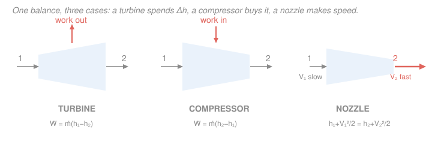

# Engineering Thermodynamics · Lesson 2.4: Steady-flow devices I — work producers & movers

> ⏱ ~15 min · Module 2: The First Law — Closed & Open Systems · Builds on: [2.3 Mass & energy balance for control volumes](02-03-mass-energy-balance-control-volumes.md) · Unlocks: Module 4 power & refrigeration cycles ([4.1 Rankine](04-01-rankine-vapor-power-cycle.md), [4.3 Brayton](04-03-brayton-gas-turbine-cycle.md)) — every cycle is these devices wired in a loop

## Why this matters

Open a power plant, a jet engine, or a refrigerator and you find the same short list of parts: something that *takes* work out of a flowing fluid (a turbine), something that *pushes* work in (a compressor or pump), and something that trades pressure for raw speed (a nozzle). Master these four devices and you can size any of them — and once you can, Module 4's cycles are just these boxes drawn in a loop. The whole trick is that the general steady-flow energy equation from [2.3](02-03-mass-energy-balance-control-volumes.md) collapses to a one-line formula for each device, because in each one most of its terms are negligible. This lesson is about *which* terms die, and why.

## The idea

You already have the full steady-flow energy equation (SFEE). It's a long expression: heat in, work out, enthalpy in and out, kinetic energy in and out, potential energy in and out. That length is intimidating — but no real device uses all of it. Each machine is *designed* to do one thing, and its geometry throws away the rest:

- A **turbine** is built to extract shaft work, and fluid rips through it too fast to lose meaningful heat to the casing — so it's adiabatic, and the energy for the work comes almost entirely out of the fluid's **enthalpy**. Speed and height changes are rounding errors.
- A **compressor** or **pump** is the same box run backwards: you *pay* shaft work to raise the fluid's enthalpy (a gas) or its pressure (a liquid).
- A **nozzle** has no shaft, no moving part, and no time to trade heat — its only job is to convert enthalpy into **kinetic energy**, making the stream faster. A **diffuser** is a nozzle pointed the other way: it slows the stream down to build pressure.

So the same equation, read three ways, gives you three machines. The engineering judgment is knowing which terms to cross out — and this lesson trains exactly that reflex.

## The formal version

Start from the single-inlet, single-outlet steady-flow energy equation of [2.3](02-03-mass-energy-balance-control-volumes.md), per unit time. With $\dot m$ the mass flow rate (kg/s), $\dot Q$ the heat transfer rate into the fluid (kW), $\dot W$ the shaft power (kW, taken **positive when done by the fluid**, i.e. work *out*), $h$ the specific enthalpy (kJ/kg), $V$ the flow speed (m/s), $g = 9.81\ \mathrm{m/s^2}$, and $z$ the elevation (m):

$$\dot Q - \dot W = \dot m\left[(h_2 - h_1) + \frac{V_2^2 - V_1^2}{2} + g(z_2 - z_1)\right].$$

*In words: net energy added by heat and work equals the change in the fluid's enthalpy, kinetic energy, and potential energy as it passes through.* Recall from [2.3](02-03-mass-energy-balance-control-volumes.md) that **enthalpy** $h = u + pv$ already bundles internal energy $u$ with the flow work $pv$ needed to push fluid across the boundary — that's *why* $h$, not $u$, is the natural currency for open systems. For all four devices below, $\Delta z \approx 0$ (they're compact), so the potential-energy term drops immediately.

**Turbine (work out).** High-pressure fluid expands and spins a shaft. It is **adiabatic** ($\dot Q \approx 0$ — fast flow, insulated or simply too little time for heat to matter) and $\Delta \text{KE} \approx 0$ (inlet and outlet velocities are comparable and small next to $\Delta h$). The SFEE collapses to

$$\boxed{\ \dot W_{\text{out}} = \dot m\,(h_1 - h_2)\ }$$

*In words: the power a turbine delivers is the mass flow times the drop in enthalpy across it.* Since $h_1 > h_2$, $\dot W_{\text{out}} > 0$ — work comes out.

**Compressor / pump (work in).** The same box, driven. Now work is done *on* the fluid, so $\dot W$ is negative in the sign convention above; it's cleaner to define $\dot W_{\text{in}} = -\dot W > 0$. Adiabatic and $\Delta\text{KE}\approx 0$ again:

$$\boxed{\ \dot W_{\text{in}} = \dot m\,(h_2 - h_1)\ }$$

*In words: the power you must supply equals the mass flow times the rise in enthalpy.* Here $h_2 > h_1$, so $\dot W_{\text{in}} > 0$ — you pay. A **compressor** raises the pressure of a *gas* (enthalpy rises a lot); a **fan** does the same job for a tiny pressure rise; a **pump** handles a *liquid*.

For a **pump** there is a shortcut. A liquid is nearly **incompressible** — its specific volume $v$ (m³/kg) barely changes — so from the property relation $dh = v\,dp$ at constant entropy (you'll meet the $Tds$ relations formally in [3.3](03-03-entropy-balance-tds-relations.md)), the enthalpy rise is almost pure pressure work:

$$w_{\text{pump}} \approx v\,(p_2 - p_1), \qquad \dot W_{\text{in}} = \dot m\,v\,(p_2 - p_1).$$

*In words: pumping a liquid costs about its volume times the pressure you raise it through* — cheap, because $v$ is tiny. This is why a Rankine plant ([4.1](04-01-rankine-vapor-power-cycle.md)) pumps the water as a *liquid* rather than compressing steam.

**Nozzle / diffuser (no work).** No shaft ($\dot W = 0$), adiabatic ($\dot Q \approx 0$), and now the kinetic-energy term is the **whole point**, not a rounding error. The SFEE becomes

$$\boxed{\ h_1 + \frac{V_1^2}{2} = h_2 + \frac{V_2^2}{2}\ }$$

*In words: enthalpy plus kinetic energy per kg is conserved through the duct — one goes down exactly as the other goes up.* A **nozzle** is shaped to *accelerate* the flow ($V_2 > V_1$, so $h_2 < h_1$); a **diffuser** is shaped to *decelerate* it ($V_2 < V_1$, so $h_2 > h_1$, raising pressure). Solving for the exit speed:

$$V_2 = \sqrt{\,2(h_1 - h_2) + V_1^2\,}.$$

**Units warning — the single most common slip here:** enthalpies are in kJ/kg but velocities squared are in $\mathrm{m^2/s^2} = \mathrm{J/kg}$. You **must** convert $\Delta h$ to J/kg (multiply by 1000) before it can share an equation with $V^2$.

## Picture

## Worked examples

**Example 1 (Boss Problem 2 — the adiabatic steam turbine).** Steam enters an adiabatic turbine at $p_1 = 4$ MPa, $T_1 = 400\,^\circ\mathrm{C}$ and leaves at $p_2 = 50$ kPa with quality $x_2 = 0.90$; the mass flow is $\dot m = 5$ kg/s. Neglect KE and PE. Find the power output.

*Fix the two states from the steam tables.* Inlet is superheated: $h_1 = 3213.6$ kJ/kg. Outlet is inside the vapor dome, so we rebuild its enthalpy from quality (the [1.3](01-03-property-tables-quality.md) move, $h = h_f + x\,h_{fg}$), using saturation values at 50 kPa, $h_f = 340.5$ and $h_{fg} = 2304.7$ kJ/kg:

$$h_2 = h_f + x_2\,h_{fg} = 340.5 + 0.90\,(2304.7) = 340.5 + 2074.2 = 2414.7\ \mathrm{kJ/kg}.$$

*Apply the turbine formula.*

$$\dot W_{\text{out}} = \dot m\,(h_1 - h_2) = 5\,(3213.6 - 2414.7) = 5\,(798.9) = 3994\ \mathrm{kW} \approx 3.99\ \mathrm{MW}.$$

*Check.* Units: $(\mathrm{kg/s})(\mathrm{kJ/kg}) = \mathrm{kJ/s} = \mathrm{kW}$ ✓. Sign: $h_1 > h_2$, so power is positive — work out, as a turbine must. Physically ~4 MW from 5 kg/s of steam is a believable small-turbine figure.

**Example 2 (a nozzle — mind the units).** Air enters an adiabatic nozzle at $T_1 = 300\,^\circ\mathrm{C}$ with velocity $V_1 = 30$ m/s and leaves at $T_2 = 100\,^\circ\mathrm{C}$. Find the exit velocity. (Air is close enough to an ideal gas here that $\Delta h = c_p\,\Delta T$ with $c_p = 1.005\ \mathrm{kJ/(kg\cdot K)}$ — the [1.4](01-04-ideal-gas-model-limits.md)/[2.1](02-01-first-law-closed-systems.md) result.)

*Enthalpy drop* (a temperature *difference*, so °C and K are interchangeable):

$$h_1 - h_2 = c_p\,(T_1 - T_2) = 1.005\,(300 - 100) = 201\ \mathrm{kJ/kg}.$$

*Convert to J/kg before touching $V^2$:* $201\ \mathrm{kJ/kg} = 201{,}000\ \mathrm{J/kg}$. Then

$$V_2 = \sqrt{2(h_1 - h_2) + V_1^2} = \sqrt{2(201{,}000) + 30^2} = \sqrt{402{,}000 + 900} = \sqrt{402{,}900} \approx 634.7\ \mathrm{m/s}.$$

*Check.* Units: $\sqrt{\mathrm{J/kg}} = \sqrt{\mathrm{m^2/s^2}} = \mathrm{m/s}$ ✓. Notice $V_1^2 = 900$ is a $0.2\%$ nudge next to $402{,}000$ — the inlet KE really was negligible, which is exactly why the *turbine* got to drop its KE term but the *nozzle* cannot drop $V_2$. Had we forgotten the ×1000 and written $\sqrt{402 + 900} \approx 36$ m/s, we'd be off by a factor of ~18 — the classic units trap.

## Watch out

- **You might think a turbine's power comes from a big pressure drop.** It comes from the **enthalpy** drop, $\dot m(h_1 - h_2)$. Pressure only matters through how much it lets $h$ fall — and inside the vapor dome you must get $h_2$ from quality, not from pressure alone. Two turbines with the same pressure drop but different exit qualities deliver different power.
- **You might use $u$ instead of $h$ for these flow devices.** For anything with fluid *crossing a boundary* the currency is enthalpy $h = u + pv$: the $pv$ piece is the flow work of shoving fluid in and out, and dropping it silently discards real energy. Internal energy $u$ is for *closed* systems ([2.1](02-01-first-law-closed-systems.md)); $h$ is for open ones.
- **You might carry $\Delta h$ in kJ/kg straight into the nozzle equation.** Velocities squared are in $\mathrm{J/kg}$. Convert $\Delta h$ to J/kg first (×1000), or your exit speed comes out ~30× too small. This is the number-one arithmetic error in this whole course.
- **You might expect a diffuser to "do nothing" because it has no work.** No *shaft* work — but by slowing the flow it converts kinetic energy into enthalpy and pressure. That's how a jet engine's inlet pre-compresses air before the compressor even touches it.

## One-liner

> The long SFEE collapses device by device: a turbine gives $\dot W = \dot m(h_1 - h_2)$, a compressor costs $\dot m(h_2 - h_1)$ (a pump only $\dot m v\,\Delta p$), and a nozzle trades $h$ for $V^2$ at constant $h + V^2/2$ — the art is knowing which terms to cross out.

## Problems

**P1 (🟢)** Air enters an adiabatic compressor at $20\,^\circ\mathrm{C}$ and leaves at $180\,^\circ\mathrm{C}$; the mass flow is $\dot m = 0.5$ kg/s. Neglecting KE and PE, find the power input. Use $c_p = 1.005\ \mathrm{kJ/(kg\cdot K)}$.

**P2 (🟡)** A feedwater pump raises liquid water from a condenser at $p_1 = 10$ kPa to a boiler at $p_2 = 8$ MPa. At the inlet the water is a saturated liquid with $v_f = 0.00101\ \mathrm{m^3/kg}$. Estimate the pump work per kg. Then, if the same pressure rise were done to *steam* with $v \approx 0.13\ \mathrm{m^3/kg}$, roughly how much more work would it take — and what does that tell you about how to design a power cycle? (This is the pump of Boss Problem 4, [4.1](04-01-rankine-vapor-power-cycle.md).)

**P3 (🔴)** Air enters a diffuser at $V_1 = 250$ m/s and $T_1 = 10\,^\circ\mathrm{C}$ and leaves at $V_2 = 50$ m/s. Treating it as adiabatic with no shaft work, find the exit temperature. Use $c_p = 1.005\ \mathrm{kJ/(kg\cdot K)}$.

Solutions

**P1** Compressor with $\dot Q = 0$, $\Delta\text{KE} = \Delta\text{PE} = 0$, and $\Delta h = c_p\,\Delta T$ for air:

$$\dot W_{\text{in}} = \dot m\,(h_2 - h_1) = \dot m\,c_p\,(T_2 - T_1) = 0.5\,(1.005)(180 - 20) = 0.5\,(1.005)(160) = 80.4\ \mathrm{kW}.$$

*Check.* Units $(\mathrm{kg/s})(\mathrm{kJ/(kg\cdot K)})(\mathrm{K}) = \mathrm{kW}$ ✓. Positive because $T_2 > T_1$ — you pay to compress, as expected. Only the temperature *difference* enters, so working in °C is fine.

**P2** Liquid pump shortcut, $w_{\text{pump}} \approx v\,(p_2 - p_1)$, with pressures in kPa so the answer lands in kJ/kg ($\mathrm{m^3/kg}\cdot\mathrm{kPa} = \mathrm{m^3/kg}\cdot\mathrm{kN/m^2} = \mathrm{kJ/kg}$):

$$w_{\text{pump}} = 0.00101\,(8000 - 10) = 0.00101\,(7990) \approx 8.07\ \mathrm{kJ/kg}.$$

For steam at $v \approx 0.13\ \mathrm{m^3/kg}$ the same $v\,\Delta p$ estimate gives $0.13\,(7990) \approx 1040\ \mathrm{kJ/kg}$ — about **130× more**. (The real gas figure differs because $v$ isn't constant during compression, but the order of magnitude is the lesson.) That's the entire reason a Rankine cycle **condenses steam to liquid first, then pumps**: raising a liquid's pressure is almost free, while compressing a vapor through the same pressure ratio would eat most of the turbine's output. Compress liquids, expand vapors.

*Check.* Units confirmed above ($\mathrm{kJ/kg}$) ✓. And $8.07$ kJ/kg matches the Rankine pump work behind $h_2 - h_1 = 199.9 - 191.8 = 8.1$ kJ/kg at 10 kPa — consistent. ✓

**P3** Diffuser: $\dot W = 0$, $\dot Q = 0$, and KE is *not* negligible (that's the point of a diffuser). From $h_1 + \tfrac{V_1^2}{2} = h_2 + \tfrac{V_2^2}{2}$,

$$h_2 - h_1 = \frac{V_1^2 - V_2^2}{2} = \frac{250^2 - 50^2}{2} = \frac{62{,}500 - 2500}{2} = 30{,}000\ \mathrm{J/kg} = 30\ \mathrm{kJ/kg}.$$

Then $\Delta T = \dfrac{\Delta h}{c_p} = \dfrac{30}{1.005} \approx 29.9\ \mathrm{K}$, so

$$T_2 = T_1 + 29.9 = 10 + 29.9 \approx 39.9\,^\circ\mathrm{C}.$$

*Check.* Units: $V^2$ came out in J/kg, divided by $c_p$ in kJ/(kg·K) — I converted the 30,000 J/kg to 30 kJ/kg *before* dividing ✓. Sign: slowing the flow ($V_2 < V_1$) *raised* enthalpy and temperature — a diffuser heats and pressurizes the stream, exactly the reverse of the nozzle in Example 2. ✓

## Flashback

**From Lesson 2.3 (Mass & energy balance for control volumes):** Liquid water with specific volume $v = 0.001\ \mathrm{m^3/kg}$ flows steadily at $\dot m = 3$ kg/s through a round pipe of diameter $D = 5$ cm. Find the flow velocity. (Fresh variant — pure mass continuity, no energy balance.)

Solution

Steady mass conservation gives $\dot m = \rho A V = AV/v$ (since $\rho = 1/v$), where $A$ is the cross-sectional area. Solve for $V$:

$$A = \frac{\pi D^2}{4} = \frac{\pi (0.05)^2}{4} = \frac{\pi (0.0025)}{4} \approx 1.963\times 10^{-3}\ \mathrm{m^2},$$

$$V = \frac{\dot m\,v}{A} = \frac{(3)(0.001)}{1.963\times 10^{-3}} = \frac{0.003}{1.963\times 10^{-3}} \approx 1.53\ \mathrm{m/s}.$$

*Check.* Units: $\dfrac{(\mathrm{kg/s})(\mathrm{m^3/kg})}{\mathrm{m^2}} = \dfrac{\mathrm{m^3/s}}{\mathrm{m^2}} = \mathrm{m/s}$ ✓. A metre-per-second-ish water velocity in a 5 cm pipe is physically ordinary — the mass-conservation relation $\dot m = AV/v$ is the same one that lets you neglect (or not) the KE terms in this lesson's devices. ✓

## Connections

- **Backward:** this is the general SFEE of [2.3](02-03-mass-energy-balance-control-volumes.md) with terms crossed out — and it leans on enthalpy $h = u + pv$ from there, quality $h = h_f + x\,h_{fg}$ from [1.3](01-03-property-tables-quality.md), and $\Delta h = c_p\,\Delta T$ for ideal gases from [1.4](01-04-ideal-gas-model-limits.md)/[2.1](02-01-first-law-closed-systems.md).
- **Forward:** [2.5](02-05-steady-flow-devices-no-work.md) finishes the device catalog with the *no-work* machines (throttles, heat exchangers, mixing chambers). Then Module 4 wires these devices into loops — a turbine + pump + boiler + condenser is the Rankine cycle ([4.1](04-01-rankine-vapor-power-cycle.md)); a compressor + combustor + turbine is Brayton ([4.3](04-03-brayton-gas-turbine-cycle.md)). And [3.4](03-04-isentropic-processes-efficiency.md) will score how far a *real* turbine or compressor falls short of the ideal $h_2$ you'd compute here — its isentropic efficiency.
- **Sideways (fluids):** the nozzle/diffuser energy trade $h + V^2/2 = \text{const}$ is the compressible-flow cousin of Bernoulli's equation you'll meet in [`fluid-dynamics`](../../fluid-dynamics/syllabus.md); there the "enthalpy" is carried by the pressure term $p/\rho$. And treating $\Delta h = c_p\Delta T$ quietly assumes the ideal-gas story whose microscopic *why* lives in [`thermodynamics-physics`](../../thermodynamics-physics/syllabus.md) — here enthalpy is just bookkeeping.
