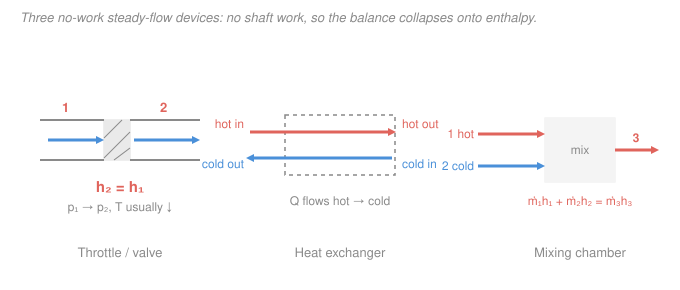

# Engineering Thermodynamics · Lesson 2.5: Steady-flow devices II — no-work devices

> ⏱ ~15 min · Module 2: The First Law — Closed & Open Systems · Builds on: [2.3 Mass & energy balance for control volumes](02-03-mass-energy-balance-control-volumes.md), [2.4 Steady-flow devices I: work producers & movers](02-04-steady-flow-devices-work.md) · Unlocks: Module 4 — condensers, evaporators, and throttles inside real cycles ([4.1 Rankine](04-01-rankine-vapor-power-cycle.md), [4.4 Refrigeration](04-04-refrigeration-heat-pump-cycles.md))

## Why this matters

Half the boxes in a power plant or a refrigerator don't produce or absorb any shaft work at all. A valve, a condenser, a boiler, the chamber where two streams merge — none of them has a spinning shaft. Yet you can't analyze a single cycle without them: the throttle is what makes your fridge cold, the condenser is where a steam plant dumps its waste heat, and a mixing chamber is how a deaerator or an open feedwater heater works. The good news is that killing the work term makes the [steady-flow energy equation](02-03-mass-energy-balance-control-volumes.md) *simpler*, not harder — for these devices the whole analysis usually collapses onto one variable: enthalpy.

## The idea

Recall the single-stream steady-flow energy balance from [2.3](02-03-mass-energy-balance-control-volumes.md), written per kilogram of fluid that flows through:

$$q - w = (h_2 - h_1) + \frac{V_2^2 - V_1^2}{2} + g(z_2 - z_1).$$

In [2.4](02-04-steady-flow-devices-work.md) we kept the work term $w$ — that was the whole point of a turbine or pump. **This lesson sets $w = 0$** and asks what's left. Three devices, three ways the balance simplifies:

- **Throttle** — squeeze fluid through a valve or a porous plug. So little happens so fast that there's no time for heat to leak in and no shaft to do work; the pipe barely changes size, so speeds barely change. Almost every term vanishes, leaving $h_2 = h_1$. The fluid drops in pressure and (usually) gets *colder* — for free. That's refrigeration in one line.
- **Heat exchanger / condenser / boiler** — two streams sharing a wall, or one stream and an external heat source. No work, and the *pair together* is adiabatic (heat only crosses between the streams, not out to the room). Energy handed off by the hot side equals energy picked up by the cold side.
- **Mixing chamber** — two streams flow into one box and leave as a single stream. No work, no external heat. Mass in equals mass out, and enthalpy in equals enthalpy out.

The pattern: with no work, enthalpy becomes the currency. Track it in and out and you're done.

## The formal version

**Throttling device (valve, capillary tube, porous plug).** Adiabatic ($q=0$), no work ($w=0$), and the inlet/outlet pipes are similar so $\Delta \text{KE}\approx 0$ and $\Delta \text{PE}\approx 0$. The balance reduces to

$$\boxed{\,h_2 = h_1\,}\qquad(\text{isenthalpic}).$$

*In words: a throttle conserves enthalpy — the fluid leaves with the same specific enthalpy it came in with, just at a lower pressure.* Here $h$ is specific enthalpy (kJ/kg). Note enthalpy is conserved, not temperature: for a **real** fluid the temperature usually **falls** as pressure drops (the **Joule–Thomson effect**), which is exactly why forcing refrigerant through an expansion valve chills it. For an **ideal gas** $h = h(T)$ depends on temperature alone, so $h_2=h_1$ forces $T_2 = T_1$ — no cooling. (A throttle is strongly irreversible; it generates entropy. We'll put a number on that in [3.3](03-03-entropy-balance-tds-relations.md).)

**Heat exchanger / condenser / boiler.** Take the whole device as one control volume: no work, and adiabatic to the surroundings (all heat stays between the streams). With two streams — hot $h$ and cold $c$ — steady mass and energy balances give

$$\dot m_h\,(h_{h,\text{in}} - h_{h,\text{out}}) = \dot m_c\,(h_{c,\text{out}} - h_{c,\text{in}}),$$

where $\dot m$ is mass flow rate (kg/s). *In words: the rate of enthalpy the hot stream loses equals the rate the cold stream gains.* If instead you draw the boundary around **one stream only**, the heat it exchanges reappears as an explicit term, $\dot Q = \dot m\,(h_\text{out} - h_\text{in})$ — that's how you get the boiler's heat input or the condenser's heat rejection. For a liquid or a gas that stays single-phase, $h_\text{out}-h_\text{in} \approx c_p (T_\text{out}-T_\text{in})$ with $c_p$ the specific heat (kJ/(kg·K)); across a phase change (condenser, boiler) you read $h$ straight from the tables. One design number worth naming: **effectiveness** $\varepsilon = \dot Q_\text{actual} / \dot Q_\text{max}$, where $\dot Q_\text{max} = (\dot m c_p)_\text{min}(T_{h,\text{in}} - T_{c,\text{in}})$ is the most heat an infinitely long exchanger could transfer.

**Adiabatic mixing chamber.** Two streams in, one out; no work, no external heat. Conservation of mass and of energy:

$$\dot m_1 + \dot m_2 = \dot m_3, \qquad \dot m_1 h_1 + \dot m_2 h_2 = \dot m_3 h_3.$$

*In words: the streams pool their mass and their enthalpy; the exit enthalpy is the mass-weighted average of the inlets.* Divide through and you literally get $h_3 = (\dot m_1 h_1 + \dot m_2 h_2)/(\dot m_1 + \dot m_2)$.

## Picture

## Worked examples

**Example 1 — throttling a refrigerant (this is your fridge).** R-134a leaves the condenser as **saturated liquid at 0.8 MPa** and is throttled to the evaporator pressure of **0.12 MPa**. Find the quality and temperature at the valve exit. From the R-134a saturation tables (Çengel & Boles): at 0.8 MPa, $h_f = 95.47$ kJ/kg and $T_\text{sat}=31.31\,^\circ\mathrm{C}$; at 0.12 MPa, $h_f = 22.49$, $h_{fg} = 214.48$ kJ/kg and $T_\text{sat}=-22.32\,^\circ\mathrm{C}$.

The inlet is saturated liquid, so $h_1 = h_f\big|_{0.8\,\text{MPa}} = 95.47$ kJ/kg. Throttling is isenthalpic:

$$h_2 = h_1 = 95.47\ \mathrm{kJ/kg}.$$

At 0.12 MPa this enthalpy sits inside the vapor dome, so the exit is a liquid–vapor mixture. Solve for quality using $h_2 = h_f + x_2 h_{fg}$ (the dome interpolation from [1.3](01-03-property-tables-quality.md)):

$$x_2 = \frac{h_2 - h_f}{h_{fg}} = \frac{95.47 - 22.49}{214.48} = \frac{72.98}{214.48} = 0.340.$$

The exit is 34% vapor at $T_\text{sat} = -22.32\,^\circ\mathrm{C}$. So a pressure drop across a dumb valve, with **no work and no heat**, dropped the refrigerant from $31.31\,^\circ\mathrm{C}$ to $-22.32\,^\circ\mathrm{C}$ — a $53.6\,^\circ\mathrm{C}$ plunge that does the actual cooling in [4.4](04-04-refrigeration-heat-pump-cycles.md). *Sanity:* $x_2$ is a dimensionless fraction between 0 and 1 ✓; enthalpy stayed put while temperature fell, the signature of Joule–Thomson cooling in a real fluid ✓.

**Example 2 — adiabatic mixing of water streams.** A stream of hot water, $\dot m_1 = 2$ kg/s at $80\,^\circ\mathrm{C}$, mixes in an insulated chamber with cold water, $\dot m_2 = 1$ kg/s at $20\,^\circ\mathrm{C}$. Find the exit temperature. Treat liquid water as incompressible with $c_p = 4.18\ \mathrm{kJ/(kg\cdot K)}$, so $h \approx c_p T$.

Mass balance: $\dot m_3 = \dot m_1 + \dot m_2 = 3$ kg/s. Energy balance with $h = c_p T$ (the $c_p$ cancels cleanly since all three streams are water):

$$\dot m_1 c_p T_1 + \dot m_2 c_p T_2 = \dot m_3 c_p T_3 \;\Longrightarrow\; T_3 = \frac{\dot m_1 T_1 + \dot m_2 T_2}{\dot m_1 + \dot m_2} = \frac{2(80) + 1(20)}{3} = \frac{180}{3} = 60\,^\circ\mathrm{C}.$$

*Sanity:* $60\,^\circ\mathrm{C}$ lies between the two inlets and leans toward the hotter, heavier stream (twice the flow), exactly as a weighted average should ✓. Cross-check with steam-table saturated-liquid enthalpies: $h_3 = [2(335.02) + 1(83.92)]/3 = 251.3$ kJ/kg, which is $h_f$ at $\approx 60\,^\circ\mathrm{C}$ ✓ — the $c_p$ shortcut and the tables agree.

## Watch out

- **You might think a throttle keeps temperature constant because $h$ is constant.** Only for an ideal gas, where $h=h(T)$. For steam, refrigerants, and any real fluid, $h$ depends on both $T$ and $p$, so an isenthalpic pressure drop generally *changes* $T$ — usually downward. The whole refrigeration industry runs on that "usually."
- **You might drop the kinetic-energy term everywhere.** For a throttle, yes: the pipes are similar size, so $\Delta\text{KE}\approx0$. But that reflex is exactly backwards for a **nozzle** ([2.4](02-04-steady-flow-devices-work.md)), whose *job* is to convert enthalpy into speed. Decide $\Delta\text{KE}$ per device; don't make it a habit.
- **You might mix up the two ways to draw a heat-exchanger boundary.** Around *both* streams, there's no $\dot Q$ term (heat never leaves the box) and you equate the two streams' enthalpy changes. Around *one* stream, the heat it trades with the other shows up explicitly as $\dot Q = \dot m\,\Delta h$. Same device, two valid control volumes — just be consistent about which one you drew.

## One-liner

> Kill the shaft work and enthalpy runs the show: a throttle holds $h$ constant (and cools real fluids for free), a heat exchanger passes enthalpy from hot to cold, and a mixing chamber averages it.

## Problems

**P1 (🟢)** In a counterflow heat exchanger, hot water enters at $80\,^\circ\mathrm{C}$ and leaves at $40\,^\circ\mathrm{C}$ at a rate $\dot m_h = 2$ kg/s. It warms a cold-water stream that enters at $20\,^\circ\mathrm{C}$ at $\dot m_c = 4$ kg/s. Taking $c_p = 4.18\ \mathrm{kJ/(kg\cdot K)}$ for both and the device adiabatic to the room, find the cold stream's exit temperature.

**P2 (🟡)** R-134a leaves a condenser as **saturated liquid at 1.0 MPa** ($h_f = 107.32$ kJ/kg, $T_\text{sat} = 39.37\,^\circ\mathrm{C}$) and is throttled to **0.20 MPa** ($h_f = 38.43$, $h_{fg} = 206.03$ kJ/kg, $T_\text{sat} = -10.09\,^\circ\mathrm{C}$). Find (a) the quality entering the evaporator and (b) the temperature drop across the valve.

**P3 (🔴)** Air (treat as an ideal gas) is throttled from 500 kPa to 100 kPa, entering at 300 K. (a) What is its exit temperature, and why? (b) In one sentence, say why a real refrigerant like R-134a does *not* behave this way across an identical valve.

Solutions

**P1** Both streams stay liquid, so use $\Delta h = c_p\,\Delta T$. With the whole exchanger adiabatic to the room, hot-side enthalpy lost = cold-side enthalpy gained:

$$\dot m_h c_p (T_{h,\text{in}} - T_{h,\text{out}}) = \dot m_c c_p (T_{c,\text{out}} - T_{c,\text{in}}).$$

The common $c_p$ cancels:

$$2(80 - 40) = 4(T_{c,\text{out}} - 20) \;\Longrightarrow\; 80 = 4(T_{c,\text{out}} - 20) \;\Longrightarrow\; T_{c,\text{out}} - 20 = 20 \;\Longrightarrow\; T_{c,\text{out}} = 40\,^\circ\mathrm{C}.$$

*Check.* The cold stream carries twice the mass but gains only $20\,^\circ\mathrm{C}$ while the hot stream loses $40\,^\circ\mathrm{C}$ — the $2{:}1$ mass ratio buys a $1{:}2$ temperature-change ratio, so the two $\dot m\,\Delta T$ products match ✓. And $40\,^\circ\mathrm{C}$ never exceeds the hot inlet, as the second law will later insist.

**P2** Throttling is isenthalpic, so $h_2 = h_1 = h_f\big|_{1.0\,\text{MPa}} = 107.32$ kJ/kg. At 0.20 MPa this is inside the dome:

$$x_2 = \frac{h_2 - h_f}{h_{fg}} = \frac{107.32 - 38.43}{206.03} = \frac{68.89}{206.03} = 0.334.$$

(a) Quality $\approx 0.334$ (about one-third vapor). (b) Temperature drop $= 39.37 - (-10.09) = 49.5\,^\circ\mathrm{C}$.

*Check.* $x_2 \in (0,1)$ ✓; enthalpy held constant while temperature fell nearly $50\,^\circ\mathrm{C}$ — classic Joule–Thomson refrigeration ✓.

**P3** (a) For an ideal gas, enthalpy is a function of temperature only, $h = h(T)$. Throttling gives $h_2 = h_1$, hence $h(T_2) = h(T_1)$, so $T_2 = T_1 = 300$ K — **no change**, despite the fivefold pressure drop. (b) R-134a is a real fluid whose enthalpy depends on pressure as well as temperature, so holding $h$ constant while $p$ falls forces $T$ to change (the Joule–Thomson effect) — which is precisely why it cools and an ideal gas wouldn't.

*Check.* Units are trivially consistent (K in, K out); the ideal-gas result is the limiting case a real fluid approaches only far from its saturation dome ✓.

## Flashback

**From Lesson 2.4 (Steady-flow devices I — nozzles):** Steam enters an adiabatic nozzle at $h_1 = 3072$ kJ/kg with negligible inlet velocity and leaves at $h_2 = 2760$ kJ/kg. Find the exit velocity. (Fresh variant — and note this is a device where you must *keep* the kinetic-energy term you just dropped for the throttle.)

Solution

Adiabatic ($q=0$), no work ($w=0$), and with $V_1 \approx 0$ the steady-flow balance keeps only enthalpy and the exit kinetic energy:

$$0 = (h_2 - h_1) + \frac{V_2^2 - 0}{2} \;\Longrightarrow\; V_2 = \sqrt{2(h_1 - h_2)}.$$

Convert the enthalpy drop to SI base units: $h_1 - h_2 = 312\ \mathrm{kJ/kg} = 312{,}000\ \mathrm{J/kg}$. Then

$$V_2 = \sqrt{2 \times 312{,}000} = \sqrt{624{,}000} \approx 790\ \mathrm{m/s}.$$

*Check.* Units: $\sqrt{\mathrm{J/kg}} = \sqrt{\mathrm{m^2/s^2}} = \mathrm{m/s}$ ✓. The nozzle converts a $312$ kJ/kg enthalpy drop into high-speed flow — the exact opposite bookkeeping from a throttle, where the same class of pressure drop produces *no* useful KE and just wastes availability.

## Connections

- **Backward:** every device here is the same [2.3](02-03-mass-energy-balance-control-volumes.md) steady-flow energy equation with $w=0$ — the sibling of the work devices in [2.4](02-04-steady-flow-devices-work.md). Reading enthalpy and quality off the dome is the [1.3](01-03-property-tables-quality.md) machinery, and the single-phase shortcut $\Delta h = c_p\,\Delta T$ is the enthalpy of [2.2](02-02-closed-system-processes.md).
- **Forward:** these three are the connective tissue of Module 4. The condenser and boiler of the [Rankine cycle](04-01-rankine-vapor-power-cycle.md) are heat exchangers; the expansion valve of the [refrigeration cycle](04-04-refrigeration-heat-pump-cycles.md) is Example 1 verbatim; open feedwater heaters are mixing chambers. The throttle also reappears in [3.3](03-03-entropy-balance-tds-relations.md) as the textbook generator of entropy — enthalpy conserved, availability destroyed.
- **Sideways (entropy):** this course treats entropy as pure bookkeeping — a throttle "generates" it and we tally the loss. *Why* an irreversible squeeze through a valve must increase entropy is the microscopic story told in [thermodynamics-physics](../../thermodynamics-physics/syllabus.md) and [stat-mech](../../stat-mech/syllabus.md).
- **Sideways (fluids):** the pressure drop across a throttle's restriction is the same head-loss-through-a-constriction that shows up in pipe-flow analysis in [fluid-dynamics](../../fluid-dynamics/syllabus.md); thermodynamics tracks its energy cost, fluid mechanics its detailed velocity field.
