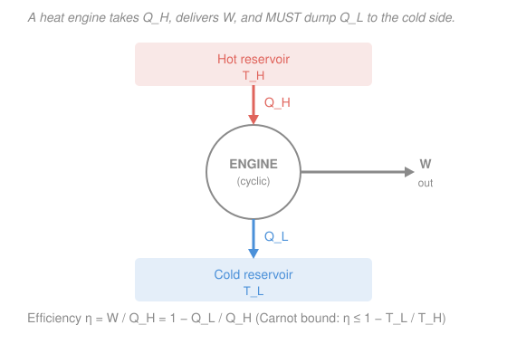

# Engineering Thermodynamics · Lesson 3.1: The second law and the Carnot limit

> ⏱ ~15 min · Module 3: Entropy and the second law · Builds on: [2.1 First law for closed systems](02-01-first-law-closed-systems.md), [2.4 Steady-flow devices that produce work](02-04-steady-flow-devices-work.md) · Unlocks: [3.2 Entropy and the Clausius inequality](03-02-entropy-clausius-inequality.md)

## Why this matters

The first law is an accountant: it insists energy is conserved, but it never says *which way* a process runs. It is perfectly happy to let a cold cup of coffee pull heat out of the cool room and get hotter, or to let a cruise ship power itself by sucking warmth out of the ocean — both conserve energy exactly. Yet neither ever happens. Something beyond energy bookkeeping picks the arrow of time and caps how much of your fuel's heat can become useful work. That something is the **second law**, and its sharpest engineering consequence is a hard ceiling — the **Carnot efficiency** — that no power plant, engine, or scheme, however clever, can beat.

## The idea

Energy has not just an *amount* but a **quality**. A kilojoule of work (turning a shaft) is premium-grade — you can convert it entirely into heat any time you like, just by rubbing. But a kilojoule of heat is second-rate: you can *never* convert all of it back into work. Heat is disorganized jostling; work is organized push. You can always scramble order into disorder for free, but you can't fully unscramble it. The second law is the rule that says: **the world's disorder only ever goes up**, and every real process pays a quality tax.

Two everyday facts capture the whole thing:

1. You cannot build an engine that just sits over a hot reservoir and turns *all* its heat into work. Some heat must be thrown away to a colder place — that is the "exhaust" every engine has.
2. Heat never flows uphill in temperature on its own. Your fridge moves heat from cold food to the warm kitchen, sure — but only because you *pay* for it with electricity. Unplug it and the flow reverses.

These sound like two different observations. The remarkable thing is that **they are the same law wearing two hats** — deny one and you can build a machine that denies the other. And from that single law falls a clean formula for the best any engine can possibly do.

## The formal version

An **engine** is a device that runs in a **cycle** (it returns to its starting state, so over a cycle $\Delta U = 0$), drawing heat $Q_H$ (kJ) from a **hot reservoir** at temperature $T_H$, producing net work $W$ (kJ), and rejecting heat $Q_L$ (kJ) to a **cold reservoir** at $T_L$. A *reservoir* is a body so large its temperature does not change when heat is added or removed. Because $\Delta U = 0$ over the cycle, the first law ([2.1](02-01-first-law-closed-systems.md)) gives

$$W = Q_H - Q_L.$$

Its **thermal efficiency** — what you get out over what you pay for — is

$$\eta = \frac{W}{Q_H} = 1 - \frac{Q_L}{Q_H}.$$

*In words: efficiency is the fraction of the heat you paid for that came out as work; the rest, $Q_L$, is dumped.*

**Kelvin–Planck statement of the second law.** No cyclic device can produce net work while exchanging heat with only a **single** reservoir. *In words: there is no 100%-efficient engine — you always need a cold sink to dump $Q_L$ into, so $\eta < 1$ always.* Setting $Q_L = 0$ (a single-reservoir engine, $\eta = 1$) is exactly what Kelvin–Planck forbids.

**Clausius statement of the second law.** No cyclic device can transfer heat from a colder to a hotter body as its *sole* effect. *In words: heat won't flow cold → hot for free; a refrigerator can do it, but only by consuming work input.*

**These two statements are equivalent** — each forbids what the other does. Here is the quick argument that violating Clausius lets you violate Kelvin–Planck. Suppose a magic device pumped heat $Q_L$ from cold to hot with *no work* (a Clausius violator). Now place an ordinary engine between the same two reservoirs, sized so it draws that same $Q_L$ back down from hot to cold and produces work. Tally the cold reservoir: it loses $Q_L$ to the magic pump and receives $Q_L$ from the engine — **net zero**. So the cold reservoir is untouched, and the *combined* machine draws heat only from the hot reservoir and turns it entirely into work: a single-reservoir engine, which Kelvin–Planck forbids. (The reverse implication runs symmetrically.) So the two "different" laws are one law.

**Reversible vs irreversible.** A process is **reversible** if it can be run backward retracing every state, leaving no trace on the surroundings — an idealization requiring no friction, no finite-temperature-difference heat flow, no turbulence. Real processes are **irreversible**; reversibility is the frictionless limit you compute *against*.

**The Carnot engine.** A **Carnot engine** is a reversible engine operating between just two reservoirs $T_H$ and $T_L$. Two theorems (provable from Kelvin–Planck) pin it down:

1. No engine between two reservoirs beats a reversible one between the same two.
2. *All* reversible engines between the same two reservoirs have the *same* efficiency — set only by the temperatures, not the working fluid or the hardware.

That common efficiency defines the absolute (Kelvin) temperature scale through $Q_L/Q_H = T_L/T_H$ for a reversible engine, giving the **Carnot efficiency**

$$\boxed{\;\eta_{\text{Carnot}} = 1 - \frac{T_L}{T_H}\;}\qquad (T \text{ in kelvin}).$$

*In words: the best possible engine between a hot and cold source converts a fraction $1 - T_L/T_H$ of its heat to work — and every real engine does worse.* It is a ceiling nobody can raise. Notice it reaches 100% only as $T_L \to 0$ or $T_H \to \infty$, neither reachable — a second confirmation that $\eta < 1$.

Run a Carnot engine backward and it becomes a **refrigerator / heat pump**, spending work to move heat cold → hot. Its figure of merit is a **coefficient of performance** (COP), and the same reversible limit gives $\text{COP}_{\text{ref}} = T_L/(T_H - T_L)$ and $\text{COP}_{\text{HP}} = T_H/(T_H - T_L)$ — often well above 1. We build the refrigeration cycle out properly in [4.4](04-04-refrigeration-heat-pump-cycles.md); for now just note the same temperatures set the same ceiling.

## Picture

## Worked examples

**Example 1 (the Carnot ceiling, and a bogus claim).** A power plant runs between a boiler at $T_H = 800\ \mathrm{K}$ and a cooling-water sink at $T_L = 300\ \mathrm{K}$. What is the most efficient engine physically possible here, and can a vendor's claimed 70% engine be real?

$$\eta_{\text{Carnot}} = 1 - \frac{T_L}{T_H} = 1 - \frac{300}{800} = 1 - 0.375 = 0.625.$$

The absolute best is **62.5%**. A claimed 70% engine between these same reservoirs would beat the reversible limit — it violates the second law and is **impossible**, no matter what the brochure says. (A real steam plant lands nearer 40%, giving up the rest to irreversibilities.)

*Check.* Dimensionless ratio $T_L/T_H = 300/800$ is a pure number ✓, and $0 < 0.625 < 1$ as any efficiency must be ✓. The claimed $0.70 > 0.625$ is the tell.

**Example 2 (why the temperature must be absolute — a $^\circ$C trap).** The same reservoirs are $800\ \mathrm{K} = 527\,^\circ\mathrm{C}$ and $300\ \mathrm{K} = 27\,^\circ\mathrm{C}$. Suppose you carelessly plug Celsius into the formula:

$$\eta_{\text{wrong}} = 1 - \frac{27}{527} = 1 - 0.0512 = 0.949.$$

That says 94.9% — wildly higher than the true 62.5%, and it would keep climbing as your cold sink approached $0\,^\circ\mathrm{C}$, exploding to nonsense (a negative "efficiency" for a sub-zero Celsius sink). The Carnot formula is a **ratio of absolute temperatures**; $T_L/T_H$ only measures "how much colder" correctly when zero really means zero energy of motion, i.e. $0\ \mathrm{K}$. Celsius has an arbitrary zero (the freezing point of water), so ratios of Celsius numbers are meaningless.

*Check.* Convert first, always: $T(\mathrm{K}) = T(^\circ\mathrm{C}) + 273.15$. With kelvin you recover $\eta = 0.625$ ✓. Rule of thumb: if a temperature ever sits in a numerator or denominator (not just a difference $\Delta T$), it must be in kelvin.

## Watch out

- **You might think a very hot furnace lets you approach 100% efficiency.** Only slowly — $\eta = 1 - T_L/T_H$ rises with $T_H$ but is capped by how *cold* your sink is. With a room-temperature sink at $300\ \mathrm{K}$, even a $1500\ \mathrm{K}$ furnace gives only $\eta = 0.80$. You need $T_H \to \infty$ *or* $T_L \to 0$ for 100%, and neither is reachable.
- **You might think $Q_L$ is an engineering flaw to be designed away.** It is not — the second law *requires* a rejected $Q_L > 0$ for any cyclic engine. The exhaust heat, the cooling tower, the radiator: those are physics, not sloppiness.
- **You might plug $^\circ$C or $^\circ$F into $\eta = 1 - T_L/T_H$.** Never. Any temperature that appears as a *ratio* (Carnot efficiency, COP) must be absolute (kelvin or rankine). Only differences like $T_H - T_L$ are unit-scale-invariant.

## One-liner

> Energy is conserved but not freely convertible: every cyclic engine must dump heat to a cold sink, and the very best possible converts only $1 - T_L/T_H$ (absolute) of its heat to work.

## Problems

**P1 (🟢)** A geothermal engine draws heat from a $450\ \mathrm{K}$ source and rejects to a $300\ \mathrm{K}$ river. (a) What is the maximum possible thermal efficiency? (b) If it draws $Q_H = 500\ \mathrm{kJ}$ and hits that maximum, how much work does it produce and how much heat does it reject?

**P2 (🟡)** An inventor claims an engine that takes in $1000\ \mathrm{kJ}$ of heat from a $600\ \mathrm{K}$ reservoir, rejects $300\ \mathrm{kJ}$ to a $300\ \mathrm{K}$ reservoir, and produces $700\ \mathrm{kJ}$ of work. Does it violate the first law? The second law? Show your reasoning.

**P3 (🔴)** A single reversible engine sits between $T_H = 600\ \mathrm{K}$ and $T_L = 300\ \mathrm{K}$. Someone proposes instead **two** reversible engines in series: the first between $600\ \mathrm{K}$ and an intermediate $T_m = 450\ \mathrm{K}$, the second between $450\ \mathrm{K}$ and $300\ \mathrm{K}$, where the heat rejected by the first is the heat supplied to the second. Does staging beat the single engine? Compute the overall efficiency of the two-stage chain and compare.

Solutions

**P1** (a) The maximum is the Carnot efficiency between the reservoirs:

$$\eta_{\text{Carnot}} = 1 - \frac{T_L}{T_H} = 1 - \frac{300}{450} = 1 - 0.667 = 0.333 \;\;(33.3\%).$$

(b) Work: $W = \eta\,Q_H = 0.333 \times 500 = 167\ \mathrm{kJ}$. Rejected heat: $Q_L = Q_H - W = 500 - 167 = 333\ \mathrm{kJ}$.

*Check.* Cross-check with $Q_L/Q_H = T_L/T_H$ for a reversible engine: $Q_L = 500 \times (300/450) = 333\ \mathrm{kJ}$ ✓. Units consistent (kJ throughout), $W + Q_L = Q_H$ ✓.

**P2** First law over the cycle needs $W = Q_H - Q_L = 1000 - 300 = 700\ \mathrm{kJ}$. The claim says $700\ \mathrm{kJ}$ — energy balances, so the **first law is satisfied**. Now the second law: the actual efficiency is

$$\eta_{\text{claim}} = \frac{W}{Q_H} = \frac{700}{1000} = 0.70,$$

while the Carnot ceiling between $600\ \mathrm{K}$ and $300\ \mathrm{K}$ is

$$\eta_{\text{Carnot}} = 1 - \frac{300}{600} = 0.50.$$

Since $0.70 > 0.50$, the claim **beats the reversible limit and violates the second law** — impossible. (Equivalently, a true reversible engine drawing $1000\ \mathrm{kJ}$ would reject $Q_L = 1000\times 300/600 = 500\ \mathrm{kJ}$, not $300\ \mathrm{kJ}$; the inventor throws away too little heat.)

*Check.* The first law is necessary but not sufficient — this is the whole point of Module 3: energy balance alone lets impossible engines through; the second law is the extra gate. ✓

**P3** Each reversible stage runs at its own Carnot efficiency. Let the first stage take $Q_H$ from $600\ \mathrm{K}$.

Stage 1: $\eta_1 = 1 - 450/600 = 0.25$. It produces $W_1 = 0.25\,Q_H$ and rejects $Q_m = Q_H - W_1 = 0.75\,Q_H$ to the $450\ \mathrm{K}$ level.

Stage 2: takes $Q_m = 0.75\,Q_H$ and runs at $\eta_2 = 1 - 300/450 = 0.3333$. It produces $W_2 = 0.3333 \times 0.75\,Q_H = 0.25\,Q_H$.

Total work $W = W_1 + W_2 = 0.25\,Q_H + 0.25\,Q_H = 0.50\,Q_H$, so the chain's overall efficiency is

$$\eta_{\text{chain}} = \frac{W}{Q_H} = 0.50.$$

The single reversible engine gives $\eta = 1 - 300/600 = 0.50$ — **identical**. Staging does not beat it. This is Carnot's theorem in action: *all* reversible engines between the same two end reservoirs share the same efficiency, and the intermediate temperature cancels out. (Staging buys other things — smaller per-stage temperature drops, real-hardware practicality — but never a higher ideal ceiling.)

*Check.* Algebraically, $\eta_{\text{chain}} = 1 - \frac{T_m}{T_H}\cdot\frac{T_L}{T_m} = 1 - \frac{T_L}{T_H}$ — the $T_m$ telescopes away ✓, matching the single-engine result exactly.

## Flashback

**From Lesson 2.4 (Steady-flow devices that produce work):** Steam enters an adiabatic turbine at $h_1 = 3213.6\ \mathrm{kJ/kg}$ (4 MPa, 400 $^\circ$C) and leaves at $h_2 = 2500\ \mathrm{kJ/kg}$. The mass flow rate is $\dot m = 3\ \mathrm{kg/s}$. Neglecting changes in kinetic and potential energy, find the power output of the turbine.

Solution

For an adiabatic ($\dot Q = 0$) steady-flow turbine with negligible KE/PE changes, the energy balance reduces to $\dot W_{\text{out}} = \dot m\,(h_1 - h_2)$:

$$\dot W_{\text{out}} = \dot m\,(h_1 - h_2) = 3\ \tfrac{\mathrm{kg}}{\mathrm{s}} \times (3213.6 - 2500)\ \tfrac{\mathrm{kJ}}{\mathrm{kg}} = 3 \times 713.6 = 2140.8\ \mathrm{kW}.$$

*Check.* Units: $(\mathrm{kg/s})(\mathrm{kJ/kg}) = \mathrm{kJ/s} = \mathrm{kW}$ ✓. Sign: enthalpy drops as the steam gives up energy, so $h_1 > h_2$ and $\dot W_{\text{out}} > 0$ — the turbine delivers about $2.14\ \mathrm{MW}$, physically sensible for a small turbine. ✓ This is the *first-law* result — the actual work extracted; the second law (this lesson) would additionally cap how close $h_2$ can get to its ideal value, which is exactly the isentropic-efficiency story of [3.4](03-04-isentropic-processes-efficiency.md).

## Connections

- **Backward:** the cycle energy balance $W = Q_H - Q_L$ is the first law of [2.1](02-01-first-law-closed-systems.md) applied over a closed loop ($\Delta U = 0$), and the turbine flashback is the steady-flow balance of [2.4](02-04-steady-flow-devices-work.md). Module 2 told you *how much* energy moves; this lesson tells you *which direction* it may move and *how much* can become work.
- **Forward:** [3.2 Entropy and the Clausius inequality](03-02-entropy-clausius-inequality.md) turns "disorder only goes up" into a bookkeeping property, entropy $S$, with $Q_L/Q_H = T_L/T_H$ generalizing to $\oint \delta Q/T \le 0$. The Carnot COP previewed here is built into a real vapor-compression cycle in [4.4](04-04-refrigeration-heat-pump-cycles.md).
- **Sideways (the microscopic origin):** this course treats entropy as *engineering bookkeeping* — a number you track to bound engines. *Why* disorder increases, and what entropy *is* at the level of molecules ($S = k_B \ln \Omega$, counting microstates), lives in the [`thermodynamics-physics`](../../thermodynamics-physics/syllabus.md) and [`stat-mech`](../../stat-mech/syllabus.md) courses. Kelvin–Planck and Clausius are the macroscopic shadow of that microscopic counting.
