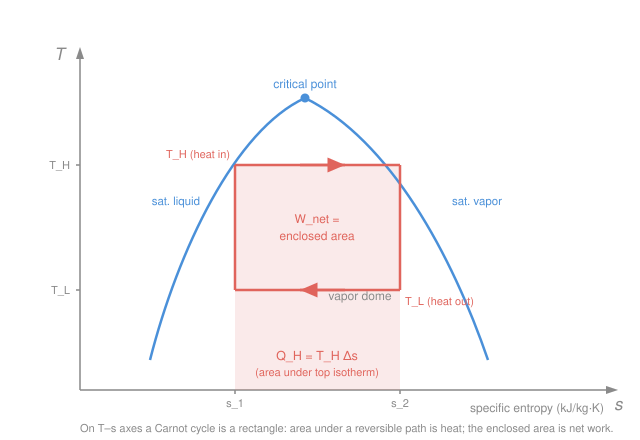

# Engineering Thermodynamics · Lesson 3.2: Entropy and the Clausius inequality

> ⏱ ~15 min · Module 3: The Second Law · Builds on: [3.1 Second law & the Carnot limit](03-01-second-law-carnot-limit.md), [1.3 Property tables & quality](01-03-property-tables-quality.md) · Unlocks: [3.3 Entropy balance & the Tds relations](03-03-entropy-balance-tds-relations.md)

## Why this matters

The first law ([Module 2](02-01-first-law-closed-systems.md)) tells you energy is conserved, but it happily allows nonsense — a cup of coffee spontaneously reheating itself, an engine turning waste heat back into 100% work. The second law forbids those, and in [3.1](03-01-second-law-carnot-limit.md) you met it as a *ceiling on efficiency*. That's the law as a bouncer. This lesson turns it into an *accountant*: a single bookkeeping property, **entropy**, that you can read off a table like temperature or enthalpy, add up around a cycle, and use to catch any process that cheats. Every engine, turbine, and refrigerator you analyze from here on is scored on its entropy ledger.

## The idea

Start with a question Carnot's result quietly answers. Run *any* reversible cycle and, at each step, tally the little bit of heat you exchange divided by the temperature you exchange it at, $\delta Q / T$. Add those up all the way around. For a **reversible** cycle the sum comes out to exactly **zero** — no matter which reversible cycle you pick. For a **real (irreversible)** cycle it comes out **negative**. That's the **Clausius inequality**, and it's the whole second law compressed into one line.

Now here's the leap. Any quantity whose sum around *every* closed loop is zero must be a **property** — something with a definite value at each state, independent of how you got there (like altitude: hike any loop and your net elevation change is zero). So the reversible version of $\delta Q / T$ isn't just a number that happens to vanish; it's the *change in a state property*. We name that property **entropy**, $S$. You don't compute it from scratch every time any more than you recompute enthalpy — you look it up in the steam tables. Entropy is what the second law is counting.

## The formal version

**Clausius inequality.** For any thermodynamic cycle,

$$\oint \frac{\delta Q}{T} \le 0,$$

where $\delta Q$ is the differential heat crossing the boundary (kJ, **positive into the system**) and $T$ is the **absolute** temperature (K) of the boundary where that heat crosses. Equality holds for a reversible cycle; strict inequality ($<0$) for an irreversible one. *In words: sum "heat over temperature" around any loop and you never get a positive number — reversible cycles hit zero exactly, real ones fall short.*

**Entropy, defined.** Because $\oint (\delta Q / T)_{\text{rev}} = 0$ for every reversible loop, the integrand is an exact differential — the change of a property. Define **entropy** $S$ (kJ/K) by

$$dS \equiv \left(\frac{\delta Q}{T}\right)_{\text{rev}}, \qquad S_2 - S_1 = \int_1^2 \left(\frac{\delta Q}{T}\right)_{\text{rev}}.$$

*In words: the entropy change between two states is the reversible heat transfer divided by temperature, integrated along any reversible path connecting them.* Two things to hold onto:

- **It's a property, so the path doesn't matter.** $S_2 - S_1$ depends only on states 1 and 2. You may *evaluate* it along a convenient reversible path even if the real process was violently irreversible — the endpoints are all that count.
- **You read it from tables.** Specific entropy $s$ (kJ/(kg·K), lower-case = per unit mass) is tabulated alongside $v$, $u$, $h$. Inside the vapor dome, use the same quality mixing rule as every other property ([1.3](01-03-property-tables-quality.md)):

$$s = s_f + x\,s_{fg},$$

with $x$ the quality (mass fraction vapor, dimensionless), $s_f$ the saturated-liquid entropy, and $s_{fg} = s_g - s_f$ the evaporation entropy.

**Heat is the area under a reversible path on a T–s diagram.** Rearranging the definition, $\delta Q_{\text{rev}} = T\,dS$, so

$$Q_{\text{rev}} = \int_1^2 T\,dS.$$

*In words: plot temperature against entropy, and the area beneath a reversible process line is the heat it exchanges* — the exact dual of "area under a $p$–$v$ path is work" from [1.5](01-05-work-and-heat.md). This makes the Carnot cycle beautiful: its two reversible isothermal steps are **horizontal lines** ($T$ constant) and its two reversible adiabatic steps are **vertical lines** ($\delta Q = 0 \Rightarrow dS = 0$, "isentropic"). Four straight sides, all right angles — **the Carnot cycle is a rectangle on T–s axes.** Its area is the net heat = net work.

**Increase-of-entropy principle (preview).** Combine the Clausius inequality with the definition and you get, for any process of an isolated system, $\Delta S \ge 0$: entropy can be *generated* but never destroyed. We write

$$\Delta S_{\text{system}} + \Delta S_{\text{surroundings}} = S_{\text{gen}} \ge 0,$$

with $S_{\text{gen}}$ (kJ/K) the **entropy generated** by irreversibility — zero for a reversible process, positive otherwise, never negative. That's the accountant's verdict, and [3.3](03-03-entropy-balance-tds-relations.md) turns it into a full balance equation. Here, just hold the headline: **real processes make entropy.**

## Picture

The rectangle's top edge (heat in at $T_H$) sweeps out $Q_H = T_H\,\Delta s$; its bottom edge (heat out at $T_L$) sweeps $Q_L = T_L\,\Delta s$; the enclosed area $ (T_H - T_L)\,\Delta s$ is the net work. Divide the two and Carnot's $\eta = 1 - T_L/T_H$ falls straight out of the geometry.

## Worked examples

**Example 1 (heat as area — the T–s payoff).** A working fluid absorbs heat *reversibly and isothermally* at $T = 500$ K while its specific entropy rises by $\Delta s = 1.2$ kJ/(kg·K). How much heat per kilogram?

Isothermal means $T$ is constant, so it pulls straight out of the integral:

$$q = \int T\,ds = T\,\Delta s = (500\ \mathrm{K})(1.2\ \mathrm{kJ/(kg\cdot K)}) = 600\ \mathrm{kJ/kg}.$$

Geometrically this is just the area of a rectangle of height $500$ and width $1.2$ on the T–s plane — the shaded strip in the figure. *Units check:* $\mathrm{K} \times \mathrm{kJ/(kg\cdot K)} = \mathrm{kJ/kg}$ ✓. Because entropy went *up* while heat came *in*, the sign is right: heat addition raises entropy.

**Example 2 (read entropy inside the dome).** Find the specific entropy of wet steam at $50$ kPa with quality $x = 0.90$.

At $50$ kPa the saturation table gives $s_f = 1.0912$ and $s_{fg} = 6.5019$ kJ/(kg·K). Mix by quality exactly as for $h$ or $v$:

$$s = s_f + x\,s_{fg} = 1.0912 + (0.90)(6.5019) = 1.0912 + 5.8517 = 6.943\ \mathrm{kJ/(kg\cdot K)}.$$

*Sanity check:* $s$ must land between $s_f = 1.0912$ (all liquid, $x=0$) and $s_g = s_f + s_{fg} = 7.5931$ (all vapor, $x=1$). At $x = 0.90$ we're nine-tenths of the way up, and $6.943$ is indeed close to $s_g$ ✓. Reading entropy is no different from reading any other property — that's the whole point of calling it one.

## Watch out

- **You might think "reversible = adiabatic" and "adiabatic = constant entropy."** Only the second is true, and only when reversible. A reversible adiabatic process ($\delta Q = 0$) is isentropic, $dS = 0$. But a *real* adiabatic process still generates entropy from friction and mixing, so $\Delta S > 0$ even with zero heat. No heat crossing the boundary does **not** mean no entropy change.
- **You might use $\delta Q / T$ for the actual (irreversible) heat to get $\Delta S$.** The definition demands the *reversible* heat along *some* reversible path between the same endpoints. For a real process, $\int \delta Q / T_{\text{boundary}}$ is generally **less** than $\Delta S$; the shortfall is exactly $S_{\text{gen}}$ ([3.3](03-03-entropy-balance-tds-relations.md)). Compute $\Delta S$ from endpoint properties (tables), not from the messy real heat.
- **You might plug Celsius into $\delta Q / T$.** $T$ here is **absolute** (K), always. The Clausius inequality and entropy live on the Kelvin scale — a boundary at $27\,^\circ$C means $T = 300$ K, and using $27$ would make the arithmetic (and the sign of your verdict) nonsense.

## One-liner

> $\oint \delta Q/T \le 0$ forces a new property $dS = (\delta Q/T)_{\text{rev}}$ — entropy, which you read from tables, whose T–s area is heat, and which real processes can only create.

## Problems

**P1 (🟢)** Wet steam sits at $10$ kPa with quality $x = 0.80$. Using $s_f = 0.6493$ and $s_{fg} = 7.5009$ kJ/(kg·K), find its specific entropy $s$.

**P2 (🟡)** A Carnot cycle takes in heat at $T_H = 600$ K and rejects heat at $T_L = 300$ K. During the heat-addition step the working fluid's entropy rises by $\Delta s = 0.8$ kJ/(kg·K). Treating the cycle as a rectangle on T–s axes, find the heat added $q_H$, the heat rejected $q_L$, the net work $w_{\text{net}}$, and the thermal efficiency. Confirm your efficiency matches $1 - T_L/T_H$.

**P3 (🔴)** An inventor claims a cycle that, each pass, absorbs $1000$ kJ from a reservoir at $800$ K and rejects $400$ kJ to a reservoir at $300$ K (both transfers effectively isothermal at the reservoir temperatures). (a) Does the cycle violate the Clausius inequality? (b) How much heat *would* it reject if it were reversible, and what does the difference tell you?

Solutions

**P1** Quality mixing, same rule as any property:

$$s = s_f + x\,s_{fg} = 0.6493 + (0.80)(7.5009) = 0.6493 + 6.0007 = 6.650\ \mathrm{kJ/(kg\cdot K)}.$$

*Check:* bounded by $s_f = 0.6493$ and $s_g = 0.6493 + 7.5009 = 8.1502$; at $x=0.8$ the value $6.650$ sits four-fifths of the way up ✓.

**P2** Heat exchanged reversibly and isothermally is $q = T\,\Delta s$, and on the rectangle the same $\Delta s$ spans both isotherms:

$$q_H = T_H\,\Delta s = (600)(0.8) = 480\ \mathrm{kJ/kg}, \qquad q_L = T_L\,\Delta s = (300)(0.8) = 240\ \mathrm{kJ/kg}.$$

Net work is the enclosed area, $q_H - q_L$:

$$w_{\text{net}} = q_H - q_L = 480 - 240 = 240\ \mathrm{kJ/kg} \;=\; (T_H - T_L)\,\Delta s = (300)(0.8) = 240 \ \checkmark.$$

Efficiency:

$$\eta = \frac{w_{\text{net}}}{q_H} = \frac{240}{480} = 0.500, \qquad 1 - \frac{T_L}{T_H} = 1 - \frac{300}{600} = 0.500 \ \checkmark.$$

*Check:* the $\Delta s$ cancels in the ratio, leaving pure temperatures — which is why Carnot efficiency depends on the reservoirs alone, exactly as [3.1](03-01-second-law-carnot-limit.md) claimed. The T–s rectangle *is* that argument, drawn.

**P3 (a)** With heat-in positive and heat-out negative, evaluate $\oint \delta Q / T$ at the two boundary temperatures (absolute K):

$$\oint \frac{\delta Q}{T} = \frac{1000}{800} - \frac{400}{300} = 1.250 - 1.333 = -0.083\ \mathrm{kJ/K}.$$

This is $\le 0$, so the cycle **satisfies** the Clausius inequality — it's permissible. Because the sum is strictly negative, the cycle is **irreversible** (a reversible one would give exactly $0$).

**(b)** For a reversible cycle between the same reservoirs, set $\oint \delta Q/T = 0$:

$$\frac{1000}{800} - \frac{Q_L}{300} = 0 \;\Longrightarrow\; Q_L = 300 \times 1.250 = 375\ \mathrm{kJ}.$$

A reversible cycle would reject only $375$ kJ (and deliver $625$ kJ of work). The real cycle dumps $400$ kJ — $25$ kJ *extra* wasted heat, doing $25$ kJ *less* work. That surplus rejection is exactly the fingerprint of the entropy generated by irreversibility ($S_{\text{gen}} = 0.083$ kJ/K per cycle). *Check:* more heat rejected than the reversible minimum ⇒ inequality strict ⇒ irreversible — the three statements agree ✓.

## Flashback

**From Lesson 3.1 (Second law & the Carnot limit):** A power plant runs a reversible (Carnot) cycle between a boiler at $T_H = 800$ K and a river used for cooling at $T_L = 320$ K. What is the highest thermal efficiency it could achieve, and what does that ceiling depend on?

Solution

The Carnot efficiency depends only on the two absolute reservoir temperatures:

$$\eta_{\max} = 1 - \frac{T_L}{T_H} = 1 - \frac{320}{800} = 1 - 0.40 = 0.60 = 60\%.$$

*Check:* dimensionless, and $0 < \eta < 1$ ✓. It depends on **nothing but the reservoir temperatures** — not the working fluid, not the plant size. To beat it you'd have to raise $T_H$ (hotter boiler) or lower $T_L$ (colder sink); no cleverness in the machinery helps. On T–s axes, $\eta = 1 - T_L/T_H$ is just the ratio of the two rectangle areas from this lesson's Problem 2.

## Connections

- **Backward:** the Clausius inequality is the [3.1](03-01-second-law-carnot-limit.md) second law re-expressed as an integral, and reading $s = s_f + x\,s_{fg}$ from tables reuses the exact quality machinery of [1.3](01-03-property-tables-quality.md). "Area under a reversible path = heat" is the T–s twin of "area under a $p$–$v$ path = work" from [1.5](01-05-work-and-heat.md).
- **Forward:** [3.3](03-03-entropy-balance-tds-relations.md) turns $S_{\text{gen}} \ge 0$ into a full entropy balance (with the $Tds$ relations to compute $\Delta s$ from $T$, $p$, $v$ when no table exists); [3.4](03-04-isentropic-processes-efficiency.md) uses the isentropic ($dS = 0$) vertical lines to define the efficiency of turbines, compressors, and nozzles; and every cycle in [Module 4](04-01-rankine-vapor-power-cycle.md) is analyzed by plotting it on T–s axes and reading areas.
- **Sideways (where entropy comes from):** this course treats entropy as pure bookkeeping — a number in a table. Its *microscopic* meaning, $S = k_B \ln \Omega$ (entropy counts the number of molecular arrangements consistent with the macrostate), is developed in [`thermodynamics-physics`](../../thermodynamics-physics/syllabus.md) and [`stat-mech`](../../stat-mech/syllabus.md). "Real processes make entropy" there becomes "systems drift toward the overwhelmingly most probable arrangement."
