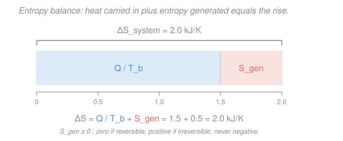

# Engineering Thermodynamics · Lesson 3.3: Entropy balance & the Tds relations

> ⏱ ~15 min · Module 3: The Second Law & Entropy · Builds on: [3.2 Entropy & the Clausius inequality](03-02-entropy-clausius-inequality.md), [2.1 First law for closed systems](02-01-first-law-closed-systems.md) · Unlocks: [3.4 Isentropic processes & efficiency](03-04-isentropic-processes-efficiency.md)

## Why this matters

[Lesson 3.2](03-02-entropy-clausius-inequality.md) told you entropy $s$ exists and never spontaneously decreases in an isolated system — but it didn't give you a way to *compute* $\Delta s$ for a real fluid, or a ledger that says exactly how much a process wastes. This lesson delivers both. The **Tds relations** turn entropy into something you calculate from ordinary properties ($u, h, p, v, T$), and for an ideal gas they collapse to two clean logarithm formulas you'll use in every compressor, turbine, and cycle from here on. The **entropy balance** then makes the second law an accounting equation: entropy in $+$ entropy *generated* $=$ entropy out $+$ storage — and the generated term $S_{gen}$ is a direct, numeric measure of how irreversible your device is. That number is the whole game in [3.4](03-04-isentropic-processes-efficiency.md), where isentropic efficiency is just "how close to $S_{gen}=0$ did you get?"

## The idea

Two moves.

**First: a bridge between entropy and the properties you already track.** The first law for a reversible closed process says the heat in equals the internal-energy rise plus the work out: $\delta q = du + p\,dv$. But [3.2](03-02-entropy-clausius-inequality.md) defined entropy so that reversible heat is $\delta q = T\,ds$. Set those equal and you get $T\,ds = du + p\,dv$. Here's the beautiful part: every symbol in that equation is a *property* — a state has one value of each, no matter how it got there. So the relation holds between *any* two equilibrium states, reversible path or not. We derived it on a reversible path, but it's a statement about the state points themselves. That's why it's called a "master" relation.

**Second: an honest ledger for entropy.** Energy is conserved — the first law's books always balance. Entropy is *not* conserved: irreversibility (friction, unrestrained heat flow across a temperature gap, mixing) manufactures it out of nothing. So the entropy balance has an extra term the energy balance never had — a **source**, $S_{gen}$, that is zero for a perfect (reversible) process, positive for every real one, and *impossible* to make negative. Entropy generated is the fingerprint of waste: measure it and you've measured how far from ideal you are.

## The formal version

### The two Tds relations

For a simple compressible substance (per unit mass, $u,h,s,v$ in their usual units — $u,h$ in kJ/kg, $s$ in kJ/(kg·K), $v$ in m³/kg):

$$\boxed{\,T\,ds = du + p\,dv\,} \qquad\qquad \boxed{\,T\,ds = dh - v\,dp\,}$$

*In words: a small entropy change, scaled by temperature, equals the internal-energy change plus the work of expansion — or equivalently the enthalpy change minus the flow-work term.* The second follows from the first using $h = u + pv$, so $dh = du + p\,dv + v\,dp$; substitute $du + p\,dv = T\,ds$ to get $T\,ds = dh - v\,dp$. Use the first when you know $T$ and $v$ (closed systems); the second when you know $T$ and $p$ (flow devices, where pressure is the natural variable).

Both are **property relations** — they connect state variables only, so they are valid for reversible *and* irreversible processes between the same end states. Divide by $T$ and integrate to get $\Delta s$ along any convenient reversible path; the answer is the real $\Delta s$.

### Ideal-gas entropy change (constant specific heats)

For an ideal gas, $du = c_v\,dT$, $dh = c_p\,dT$, and $pv = RT$. Feed these into the two Tds relations and integrate (taking $c_v, c_p$ constant — the "cold-air-standard" approximation):

$$\Delta s = c_v \ln\frac{T_2}{T_1} + R\,\ln\frac{v_2}{v_1} \qquad=\qquad c_p \ln\frac{T_2}{T_1} - R\,\ln\frac{p_2}{p_1}.$$

*In words: entropy rises with temperature, and rises when the gas expands (bigger $v$) or drops in pressure.* Here $c_v = 0.718$, $c_p = 1.005$, $R = 0.287\ \mathrm{kJ/(kg\cdot K)}$ for air (note $c_p - c_v = R$). The two forms are identical — pick whichever pair of properties you're handed. Temperature ratios are *always* in kelvin.

### The entropy balance

**Closed system.** Between states 1 and 2, with heat $\delta Q$ crossing a boundary at local temperature $T_b$:

$$\boxed{\,\Delta S = S_2 - S_1 = \int_1^2 \frac{\delta Q}{T_b} + S_{gen}\,}, \qquad S_{gen} \ge 0.$$

*In words: the system's entropy rises by whatever entropy the heat carried in ($\int \delta Q/T_b$), plus whatever the process generated internally ($S_{gen}$).* The three cases are the entire second law in one line:

| $S_{gen}$ | meaning |
|-----------|---------|
| $= 0$ | reversible (idealized limit) |
| $> 0$ | irreversible (every real process) |
| $< 0$ | **impossible** — violates the second law |

**Steady-flow control volume.** Nothing accumulates, so $dS_{cv}/dt = 0$. Entropy enters/leaves with mass ($\dot m\, s$) and with heat ($\dot Q_k / T_k$ across boundary patch $k$ at temperature $T_k$), and $\dot S_{gen}$ is made inside:

$$\boxed{\,\dot S_{gen} = \sum_{out} \dot m\, s - \sum_{in} \dot m\, s - \sum_k \frac{\dot Q_k}{T_k} \ \ge 0\,}$$

*In words: the entropy generation rate is the entropy the streams carry out, minus what they carry in, minus what the heat contributed.* For one inlet, one outlet, adiabatic ($\dot Q = 0$): $\dot S_{gen} = \dot m (s_{out} - s_{in}) \ge 0$, so **an adiabatic device can only raise the fluid's entropy** — the seed of isentropic efficiency in [3.4](03-04-isentropic-processes-efficiency.md).

## Picture

The bar is the closed-system balance made visual: the blue block is entropy the heat *delivered* ($Q/T_b$), the coral block is entropy the process *manufactured* ($S_{gen}$), and together they reach $\Delta S$. Shrinking the coral block toward zero — same heat, less waste — is the engineer's job. It can never go negative.

## Worked examples

**Example 1 (ideal-gas $\Delta s$ — the workhorse formula).** Air is compressed from state 1 ($T_1 = 300\ \mathrm{K}$, $p_1 = 100\ \mathrm{kPa}$) to state 2 ($T_2 = 500\ \mathrm{K}$, $p_2 = 600\ \mathrm{kPa}$). Find $\Delta s$ and interpret its sign.

We know $T$ and $p$ at both states, so use the $c_p$ form:

$$\Delta s = c_p \ln\frac{T_2}{T_1} - R\,\ln\frac{p_2}{p_1} = 1.005\,\ln\frac{500}{300} - 0.287\,\ln\frac{600}{100}.$$

Term by term: $1.005 \times \ln(1.667) = 1.005 \times 0.5108 = 0.513$; and $0.287 \times \ln(6) = 0.287 \times 1.792 = 0.514$. So

$$\Delta s = 0.513 - 0.514 \approx -0.001\ \mathrm{kJ/(kg\cdot K)}.$$

The two effects nearly cancel: heating (the $+c_p\ln$ term) pushes entropy *up*, compressing (the $-R\ln$ term) pushes it *down*, and here they almost exactly offset — this compression is **essentially isentropic**. The tiny negative sign says the air's entropy fell by a hair, which for a *system* is perfectly legal: it just means a sliver of heat was rejected during compression. (Nothing is violated — $S_{gen} \ge 0$ constrains the system-plus-surroundings total, not the gas alone, which can shed entropy by shedding heat.)

*Check.* Units: $c_p$ and $R$ are both kJ/(kg·K); logs are dimensionless, so $\Delta s$ lands in kJ/(kg·K) ✓. Sanity: a reversible adiabatic compression from 300 K to $6\times$ pressure would reach $T_2 = 300\cdot 6^{(k-1)/k} = 300\cdot 6^{0.286} \approx 501\ \mathrm{K}$ — almost exactly our 500 K, confirming this process sits right on the isentropic line. ✓

**Example 2 (entropy generation — the irreversibility meter).** A hot reservoir at $T_H = 800\ \mathrm{K}$ passes $Q = 500\ \mathrm{kJ}$ of heat to a cold reservoir at $T_L = 300\ \mathrm{K}$ (say, through a bar conducting between them). Reservoirs are so large their temperatures don't budge. How much entropy is generated?

Each reservoir's entropy change is $Q/T$ (isothermal heat transfer, from [3.2](03-02-entropy-clausius-inequality.md)). The hot one *loses* $Q$; the cold one *gains* $Q$. Take the two reservoirs together as an isolated system, so no heat crosses the outer boundary and $\int \delta Q/T_b = 0$; then $S_{gen} = \Delta S_{total}$:

$$S_{gen} = \Delta S_H + \Delta S_L = \frac{-Q}{T_H} + \frac{+Q}{T_L} = Q\left(\frac{1}{T_L} - \frac{1}{T_H}\right) = 500\left(\frac{1}{300} - \frac{1}{800}\right).$$

$$S_{gen} = 500\,(0.003333 - 0.001250) = 500 \times 0.002083 = +1.04\ \mathrm{kJ/K} \ > 0.$$

Positive — so this really happens, and the number *quantifies* the waste in letting 500 kJ tumble across a 500 K gap. Now **reverse** it: imagine heat flowing on its own from cold to hot. Then

$$S_{gen} = Q\left(\frac{1}{T_H} - \frac{1}{T_L}\right) = -1.04\ \mathrm{kJ/K} \ < 0 \quad\Rightarrow\quad \textbf{impossible.}$$

The sign of $S_{gen}$ alone decides which direction nature allows — no other law needed.

*Check.* Units: kJ divided by K gives kJ/K ✓. Limiting sense: if $T_H \to T_L$ (heat crossing a vanishing gap, i.e. reversible), $S_{gen} = Q(1/T - 1/T) = 0$ ✓ — the smaller the temperature gap, the less waste, exactly as intuition demands.

## Watch out

- **You might think $\Delta s < 0$ means the second law is broken.** It isn't — a *system* can shed entropy by rejecting heat (Example 1). The second law forbids $S_{gen} < 0$, and $S_{gen}$ lives in the *balance*, not in $\Delta s$ itself. Always ask "generated," not just "changed."
- **You might reach for the Tds relations only on reversible paths.** No — they relate properties, so they hold between any two equilibrium states. It's the *entropy-transfer* term $\int \delta Q/T_b$ that cares about the path (and equals $\Delta s$ only when reversible). Compute $\Delta s$ from the endpoints; let $S_{gen}$ absorb the irreversibility.
- **You might plug Celsius into the log formulas.** The ratios $T_2/T_1$ demand absolute temperature — kelvin, always. $\ln(500/300)$ and $\ln(227/27)$ are wildly different; only the first is right.

## One-liner

> $T\,ds = du + p\,dv = dh - v\,dp$ lets you *compute* entropy from ordinary properties; the balance $\Delta S = \int \delta Q/T_b + S_{gen}$ then *audits* a process, with $S_{gen}\ge 0$ the exact, unforgeable measure of its irreversibility.

## Problems

**P1 (🟢)** Air expands in a turbine from $T_1 = 700\ \mathrm{K}$, $p_1 = 500\ \mathrm{kPa}$ to $T_2 = 500\ \mathrm{K}$, $p_2 = 100\ \mathrm{kPa}$. Using constant specific heats, find $\Delta s$. Is the flow through this (adiabatic) turbine reversible, irreversible, or impossible?

**P2 (🟡)** A 2 kW electric heater warms a well-insulated room whose air stays steady at $T = 295\ \mathrm{K}$ (heat leaks out through the walls to outdoor surroundings at the same 295 K in steady state). Treat the room air as a control volume at 295 K receiving 2 kW of electrical work and rejecting 2 kW of heat at its 295 K boundary. What is the entropy generation rate $\dot S_{gen}$? Interpret what's being wasted.

**P3 (🔴)** Two identical 1 kg copper blocks (specific heat $c = 0.386\ \mathrm{kJ/(kg\cdot K)}$), one at 400 K and one at 200 K, are placed in contact inside an insulated box and reach a common final temperature. Find that temperature and the total entropy generated. (Hint: solids are incompressible, so $\Delta s = c\ln(T_f/T_i)$.)

Solutions

**P1** Use the $c_p$ form:

$$\Delta s = c_p\ln\frac{T_2}{T_1} - R\ln\frac{p_2}{p_1} = 1.005\ln\frac{500}{700} - 0.287\ln\frac{100}{500}.$$

$1.005 \times \ln(0.714) = 1.005 \times (-0.3365) = -0.338$; and $0.287 \times \ln(0.2) = 0.287 \times (-1.609) = -0.462$. So

$$\Delta s = -0.338 - (-0.462) = +0.124\ \mathrm{kJ/(kg\cdot K)}.$$

The turbine is adiabatic, so $\dot S_{gen} = \dot m(s_2 - s_1) = \dot m\,\Delta s$. Since $\Delta s = +0.124 > 0$, $S_{gen} > 0$: the flow is **irreversible** (a real turbine with losses). A reversible adiabatic turbine would give $\Delta s = 0$; a negative $\Delta s$ in an adiabatic device would be impossible.

*Check.* Units kJ/(kg·K) ✓. The pressure drop alone ($-R\ln(1/5) = +0.462$) would raise $s$ a lot; the temperature drop ($-0.338$) pulls it back down, but not all the way — net positive, so entropy was generated. ✓

**P2** Steady state, so $\Delta S_{cv}=0$ and $\dot S_{gen} = -\sum \dot Q_k/T_k$ (no mass flow). The only heat crossing the boundary is $\dot Q = -2\ \mathrm{kW}$ (rejected) at $T_b = 295\ \mathrm{K}$; the 2 kW of *electrical work* carries **no** entropy. So

$$\dot S_{gen} = -\frac{\dot Q}{T_b} = -\frac{-2}{295} = +0.00678\ \mathrm{kW/K} = 6.78\ \mathrm{W/K} \ > 0.$$

Interpretation: converting 2 kW of pure, organized work entirely into heat at 295 K is maximally wasteful — every joule of high-quality work is degraded to low-quality thermal energy, and $\dot S_{gen} = \dot W/T$ measures the loss of that work potential (its "exergy," coming in [4.5](04-05-psychrometrics-exergy.md)).

*Check.* Units: kW/K ✓. Sign positive, as required for a real device ✓. Makes sense that a resistance heater — the textbook irreversible device — generates entropy at exactly $\dot W/T$.

**P3** Equal masses and equal $c$, insulated box, so the final temperature is the average:

$$T_f = \frac{T_1 + T_2}{2} = \frac{400 + 200}{2} = 300\ \mathrm{K}.$$

(Energy balance: $mc(T_f - 400) + mc(T_f - 200) = 0 \Rightarrow T_f = 300$.) The box is insulated, so $\int \delta Q/T_b = 0$ and $S_{gen} = \Delta S_{total} = \Delta S_{hot} + \Delta S_{cold}$:

$$S_{gen} = mc\ln\frac{T_f}{T_1} + mc\ln\frac{T_f}{T_2} = (1)(0.386)\left[\ln\frac{300}{400} + \ln\frac{300}{200}\right].$$

$\ln(0.75) = -0.2877$, $\ln(1.5) = +0.4055$, sum $= +0.1178$. So

$$S_{gen} = 0.386 \times 0.1178 = +0.0455\ \mathrm{kJ/K} \ > 0.$$

*Check.* Units kJ/K ✓. Positive despite one block *losing* entropy — the cold block's gain outweighs the hot block's loss, because entropy transferred at a low temperature counts for more than the same energy at a high temperature. That imbalance *is* the generated entropy. ✓

## Flashback

**From Lesson 3.2 (Entropy & the Clausius inequality):** A working fluid absorbs 300 kJ/kg of heat reversibly while its temperature is held constant at 500 K. Find its entropy change, and sketch how this shows up as an area on a $T$–$s$ diagram. (Fresh variant — different numbers, and now connect it to area.)

Solution

For a reversible process, entropy is defined by $ds = \delta q_{rev}/T$. At constant temperature this integrates directly:

$$\Delta s = \frac{q_{rev}}{T} = \frac{300}{500} = 0.6\ \mathrm{kJ/(kg\cdot K)}.$$

On a $T$–$s$ diagram the process is a horizontal line at $T = 500\ \mathrm{K}$ running from the initial $s$ to $s + 0.6$. The heat added is the **area under that line**: $q = \int T\,ds = T\,\Delta s = 500 \times 0.6 = 300\ \mathrm{kJ/kg}$ — a rectangle of height 500 K and width 0.6 kJ/(kg·K), recovering the given heat. That "$q$ = area under the $T$–$s$ curve" is the $T$–$s$ diagram's whole reason for existing, and it's the reversible-path reading of the same $T\,ds = \delta q$ that opened this lesson.

*Check.* Units: K × kJ/(kg·K) = kJ/kg ✓. Positive $\Delta s$ because heat was *added* ✓.

## Connections

- **Backward:** the Tds relations fuse [2.1](02-01-first-law-closed-systems.md)'s first law ($\delta q = du + p\,dv$) with [3.2](03-02-entropy-clausius-inequality.md)'s entropy definition ($\delta q_{rev} = T\,ds$) — this lesson is literally those two ideas set equal. The ideal-gas $c_v\,dT$, $c_p\,dT$, and $pv = RT$ all come from [1.4](01-04-ideal-gas-model-limits.md).
- **Forward:** [3.4 Isentropic processes & efficiency](03-04-isentropic-processes-efficiency.md) sets $S_{gen} = 0$ (adiabatic + reversible $\Rightarrow \Delta s = 0$) as the *ideal* a turbine or compressor is graded against; the log formulas here give the isentropic exit state. Every cycle in Module 4 ([Rankine](04-01-rankine-vapor-power-cycle.md), [Brayton](04-03-brayton-gas-turbine-cycle.md), [Otto/Diesel](04-02-gas-power-cycles-otto-diesel.md)) is a loop of these balances, and [4.5](04-05-psychrometrics-exergy.md) turns $S_{gen}$ into lost *exergy* (destroyed work potential).
- **Sideways (microscopic entropy):** here entropy is pure bookkeeping — a property you tabulate and balance. *Why* it exists and never decreases is a counting statement about molecular configurations, developed in [`thermodynamics-physics`](../../thermodynamics-physics/syllabus.md) and [`stat-mech`](../../stat-mech/syllabus.md), where $S = k_B\ln\Omega$ gives $S_{gen}>0$ its meaning: irreversible processes march toward overwhelmingly more probable arrangements. Same $S$, two altitudes.
