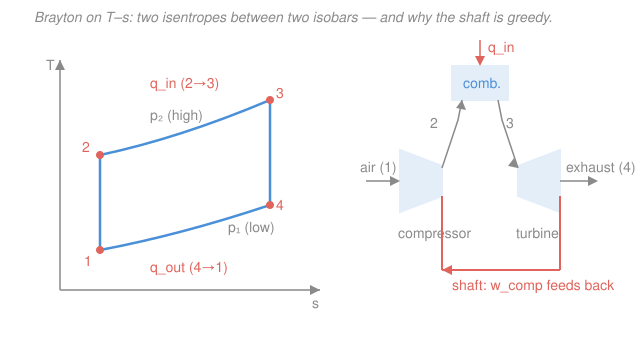

# Engineering Thermodynamics · Lesson 4.3: The Brayton gas-turbine cycle

> ⏱ ~15 min · Module 4: Power & Refrigeration Cycles · Builds on: [2.4 Steady-flow devices with work](02-04-steady-flow-devices-work.md), [3.4 Isentropic processes & efficiency](03-04-isentropic-processes-efficiency.md), [4.2 Gas power cycles: Otto & Diesel](04-02-gas-power-cycles-otto-diesel.md) · Unlocks: jet propulsion, combined gas–steam cycles

## Why this matters

Every jet that crosses the sky and a huge share of the world's electricity run on one cycle: **Brayton**. Unlike the piston engines of [4.2](04-02-gas-power-cycles-otto-diesel.md), a gas turbine has no reciprocating pistons — air flows *continuously* through a compressor, a burner, and a turbine, all spinning on a common shaft. This is the first cycle where the machine that *makes* power (the turbine) and the machine that *costs* power (the compressor) sit on the same shaft, fighting each other. Understanding that tug-of-war — the **back-work ratio** — is the whole reason gas turbines behave so differently from steam plants, and why component quality matters so much more here.

## The idea

Picture three boxes in a row, all on one shaft. Air enters the first box, the **compressor**, and gets squeezed to high pressure — that takes work. The high-pressure air then flows into the **combustor**, where fuel burns and dumps in heat at (almost) constant pressure, making the gas hot. That hot, high-pressure gas blasts through the **turbine**, expanding back to atmospheric pressure and spinning the shaft hard. The turbine produces more work than the compressor consumes; the surplus is your output — thrust for a jet, or a generator for a power plant.

Here's the twist that sets gas turbines apart. Squeezing a *gas* is expensive. In a steam plant ([4.1](04-01-rankine-vapor-power-cycle.md)) you pump a *liquid*, which is nearly incompressible, so the pump sips a fraction of a percent of the turbine's output. In Brayton, the compressor can eat **40–60%** of everything the turbine makes. The turbine works hard just to keep its own compressor fed, and only what's left over is useful. That fragile margin is why a few points of lost efficiency in either machine can wreck the whole cycle.

## The formal version

We analyze the **air-standard** cycle: the working fluid is air treated as an ideal gas ([1.4](01-04-ideal-gas-model-limits.md)), combustion is modeled as external heat addition, and exhaust-to-intake is modeled as heat rejection — closing the loop into an idealized cycle. In the **cold-air-standard** version we further take constant specific heats, using $c_p = 1.005\ \mathrm{kJ/(kg\cdot K)}$ and $k = c_p/c_v = 1.4$ for air. All quantities are *specific* (per kg of air), so $w$ and $q$ are in kJ/kg.

The four processes (states numbered as in the figure):

1. **1→2 — isentropic compression** in the compressor. Pressure rises from $p_1$ to $p_2$; work goes *in*.
2. **2→3 — constant-pressure heat addition** in the combustor. $q_{in} = c_p(T_3 - T_2)$.
3. **3→4 — isentropic expansion** in the turbine. Pressure falls back to $p_1$; work comes *out*.
4. **4→1 — constant-pressure heat rejection**. $q_{out} = c_p(T_4 - T_1)$.

The key knob is the **pressure ratio**

$$r_p \equiv \frac{p_2}{p_1} \quad(\text{dimensionless}).$$

*In words: how many times atmospheric pressure the compressor delivers.* For the two isentropic legs, the ideal-gas isentropic relation from [3.4](03-04-isentropic-processes-efficiency.md) ties temperature to pressure:

$$\frac{T_2}{T_1} = \left(\frac{p_2}{p_1}\right)^{\!(k-1)/k} = r_p^{(k-1)/k}, \qquad \frac{T_3}{T_4} = \left(\frac{p_3}{p_4}\right)^{\!(k-1)/k} = r_p^{(k-1)/k}.$$

*In words: both the compression and the expansion multiply/divide temperature by the same factor $r_p^{(k-1)/k}$, because both span the same pressure ratio.* Call that factor $r_p^{(k-1)/k}$ for short.

**Thermal efficiency.** With the steady-flow devices carrying no significant heat loss ([2.4](02-04-steady-flow-devices-work.md)), the compressor and turbine works are $w_{comp} = c_p(T_2 - T_1)$ and $w_{turb} = c_p(T_3 - T_4)$. Efficiency is net work over heat in, $\eta = w_{net}/q_{in} = 1 - q_{out}/q_{in}$. Substituting and using both isentropic relations, everything collapses to

$$\boxed{\;\eta_{\text{Brayton}} = 1 - \frac{1}{r_p^{(k-1)/k}}\;}$$

*In words: the ideal cold-air-standard efficiency depends on the pressure ratio alone — not on how hot you run the combustor.* Higher $r_p$ always means higher ideal efficiency.

**Back-work ratio.** Define

$$bwr \equiv \frac{w_{comp}}{w_{turb}} = \frac{c_p(T_2 - T_1)}{c_p(T_3 - T_4)} = \frac{T_2 - T_1}{T_3 - T_4}.$$

*In words: the fraction of the turbine's gross output that must be handed straight back to run the compressor.* For gas turbines $bwr$ is typically $0.4$–$0.6$; the net output is only the sliver that survives. The net specific work is what's left,

$$w_{net} = w_{turb} - w_{comp} = c_p\big[(T_3 - T_4) - (T_2 - T_1)\big].$$

**The optimum-$r_p$ trade-off.** Efficiency keeps rising with $r_p$, but $w_{net}$ does *not*. Push $r_p$ too high and $T_2$ climbs toward $T_3$: the compressor swallows almost as much as the turbine makes, and $w_{net}$ (work per kg of air) collapses toward zero — meaning you need enormous airflow and machinery for little power. For fixed $T_1$ and turbine-inlet $T_3$, $w_{net}$ is maximized when $r_p^{(k-1)/k} = \sqrt{T_3/T_1}$ (equivalently $T_2 = T_4 = \sqrt{T_1 T_3}$). Real designs sit near that peak, not at maximum efficiency.

## Picture

On the T–s diagram the two isentropes (compression 1→2, expansion 3→4) are **vertical** — constant entropy — while the two constant-pressure legs are the **rising curves** connecting them. The cycle area is $w_{net}$; the vertical rise 1→2 is what the compressor costs you. In the schematic, the coral shaft is the back-work path: the turbine spins the compressor before anything reaches the load.

## Worked examples

**Example 1 (ideal efficiency — the pressure-ratio knob).** An ideal Brayton cycle runs at $r_p = 10$ with $k = 1.4$. Find the thermal efficiency.

The exponent is $(k-1)/k = 0.4/1.4 = 0.2857$, so

$$r_p^{(k-1)/k} = 10^{0.2857} = 1.931, \qquad \eta = 1 - \frac{1}{1.931} = 1 - 0.518 = 0.482.$$

So **48.2%** — set entirely by $r_p$ and $k$. Doubling to $r_p = 20$ would give $\eta = 1 - 20^{-0.2857} = 1 - 0.426 = 0.574$; the efficiency climbs, but as Example 2's logic warns, the net work per kg tells a subtler story.

**Example 2 (temperatures, works, and the greedy shaft).** Now fix $T_1 = 300\ \mathrm{K}$ (compressor inlet) and $T_3 = 1300\ \mathrm{K}$ (turbine inlet, the metallurgical limit), still at $r_p = 10$. Find $T_2$, $T_4$, the two works, the back-work ratio, and $w_{net}$.

Both isentropic legs use the same factor $r_p^{(k-1)/k} = 1.931$:

$$T_2 = T_1 \cdot 1.931 = 300 \times 1.931 = 579\ \mathrm{K}, \qquad T_4 = \frac{T_3}{1.931} = \frac{1300}{1.931} = 673\ \mathrm{K}.$$

Turbine and compressor works (with $c_p = 1.005\ \mathrm{kJ/(kg\cdot K)}$):

$$w_{turb} = c_p(T_3 - T_4) = 1.005(1300 - 673) = 630\ \mathrm{kJ/kg},$$
$$w_{comp} = c_p(T_2 - T_1) = 1.005(579 - 300) = 280\ \mathrm{kJ/kg}.$$

Back-work ratio and net work:

$$bwr = \frac{w_{comp}}{w_{turb}} = \frac{280}{630} = 0.445, \qquad w_{net} = 630 - 280 = 350\ \mathrm{kJ/kg}.$$

The compressor consumes **44.5%** of the turbine's gross output — a piston engine would never hand back so much. Sanity-check against Example 1: $q_{in} = c_p(T_3 - T_2) = 1.005(1300 - 579) = 724\ \mathrm{kJ/kg}$, so $\eta = w_{net}/q_{in} = 350/724 = 0.483$ — matching the 48.2% the formula gave, as it must. Units: $c_p\,[\mathrm{kJ/(kg\cdot K)}]\times \Delta T\,[\mathrm{K}] = \mathrm{kJ/kg}$ throughout. ✓

## Watch out

- **You might think higher pressure ratio always makes a better engine.** For *ideal* efficiency, yes — but the *net work per kg of air* peaks at a moderate $r_p$ (near $r_p^{(k-1)/k} = \sqrt{T_3/T_1}$) and then falls, because a bigger compression pushes $T_2$ toward $T_3$ and the compressor eats the turbine alive. Designers balance efficiency against power density, not chase $r_p$ to infinity.
- **You might treat a gas turbine like a steam plant and ignore the compressor.** In Rankine ([4.1](04-01-rankine-vapor-power-cycle.md)) the pump work is negligible because you compress a liquid; here you compress a gas, and $bwr \approx 0.4$–$0.6$. Never drop $w_{comp}$ in a Brayton balance.
- **You might assume real component inefficiencies just nudge the numbers.** Because the net output is a small difference of two large works, a compressor or turbine isentropic efficiency ([3.4](03-04-isentropic-processes-efficiency.md)) of, say, 85% doesn't cost 15% — it inflates $w_{comp}$ *and* shrinks $w_{turb}$, and the two errors both bite the thin $w_{net}$ margin. A cycle with $bwr = 0.5$ can lose a third of its net output to component losses that would barely dent a steam plant.

## One-liner

> A gas turbine is a turbine spinning its own compressor: ideal efficiency $\eta = 1 - r_p^{-(k-1)/k}$ rises with pressure ratio, but the back-work ratio ($\sim$half the turbine's output) makes net work peak at a moderate $r_p$ and makes real component efficiency decisive.

## Problems

**P1 (🟢)** An ideal air-standard Brayton cycle operates with a pressure ratio $r_p = 8$ and $k = 1.4$. Find the thermal efficiency.

**P2 (🟡)** A Brayton cycle has $T_1 = 290\ \mathrm{K}$, $T_3 = 1400\ \mathrm{K}$, $r_p = 12$, $k = 1.4$, $c_p = 1.005\ \mathrm{kJ/(kg\cdot K)}$. Find $T_2$ and $T_4$, then the back-work ratio and the net specific work $w_{net}$.

**P3 (🔴)** For the conditions of P2 ($T_1 = 290\ \mathrm{K}$, $T_3 = 1400\ \mathrm{K}$), what pressure ratio maximizes the net work per unit mass, and what is $bwr$ at that optimum? (Use $r_p^{(k-1)/k} = \sqrt{T_3/T_1}$ at the optimum.)

Solutions

**P1** Exponent $(k-1)/k = 0.2857$, so $r_p^{(k-1)/k} = 8^{0.2857} = 1.811$.

$$\eta = 1 - \frac{1}{1.811} = 1 - 0.552 = 0.448 \quad (44.8\%).$$

*Check.* Lower than the $r_p=10$ case's 48.2% — efficiency should drop as $r_p$ falls. ✓ Dimensionless, as an efficiency must be. ✓

**P2** Same factor for both isentropic legs: $r_p^{(k-1)/k} = 12^{0.2857}$. Compute $12^{0.2857} = e^{0.2857\ln 12} = e^{0.2857 \times 2.485} = e^{0.710} = 2.034$.

$$T_2 = 290 \times 2.034 = 590\ \mathrm{K}, \qquad T_4 = \frac{1400}{2.034} = 688\ \mathrm{K}.$$

Works:
$$w_{turb} = c_p(T_3 - T_4) = 1.005(1400 - 688) = 716\ \mathrm{kJ/kg},$$
$$w_{comp} = c_p(T_2 - T_1) = 1.005(590 - 290) = 302\ \mathrm{kJ/kg}.$$

$$bwr = \frac{302}{716} = 0.421, \qquad w_{net} = 716 - 302 = 414\ \mathrm{kJ/kg}.$$

*Check.* $\eta$ from the formula is $1 - 1/2.034 = 0.508$; cross-check $q_{in} = 1.005(1400 - 590) = 814\ \mathrm{kJ/kg}$, so $w_{net}/q_{in} = 414/814 = 0.509$. ✓ Units in kJ/kg throughout. ✓

**P3** Max $w_{net}$ needs $r_p^{(k-1)/k} = \sqrt{T_3/T_1} = \sqrt{1400/290} = \sqrt{4.828} = 2.197$. Solve for $r_p$:

$$r_p = 2.197^{1/0.2857} = 2.197^{3.5} = e^{3.5 \ln 2.197} = e^{3.5 \times 0.787} = e^{2.755} = 15.7.$$

At the optimum $T_2 = T_4 = \sqrt{T_1 T_3} = \sqrt{290 \times 1400} = \sqrt{406000} = 637\ \mathrm{K}$. Then

$$bwr = \frac{T_2 - T_1}{T_3 - T_4} = \frac{637 - 290}{1400 - 637} = \frac{347}{763} = 0.455.$$

*Check.* Optimum $r_p \approx 15.7$ exceeds P2's 12, so P2 sat just below peak power — consistent with real designs clustering here. At the max-work point the compressor takes ~46% of turbine output, squarely in the 0.4–0.6 gas-turbine band. ✓

## Flashback

**From Lesson 4.2 (Otto & Diesel cycles):** An ideal Otto cycle (the air-standard spark-ignition engine) has a compression ratio $r = 8$ and $k = 1.4$. Find its thermal efficiency, and note how the *kind* of ratio differs from Brayton's.

Solution

The Otto efficiency depends on the **volume** compression ratio $r = V_1/V_2$ (not a pressure ratio):

$$\eta_{\text{Otto}} = 1 - \frac{1}{r^{\,k-1}} = 1 - \frac{1}{8^{0.4}} = 1 - \frac{1}{2.297} = 1 - 0.435 = 0.565 \quad (56.5\%).$$

*Check.* The exponent here is $k-1 = 0.4$ (a *volume* ratio raised to $k-1$), whereas Brayton uses a *pressure* ratio raised to $(k-1)/k$. Same isentropic physics from [3.4](03-04-isentropic-processes-efficiency.md), different ratio because Otto is a closed-piston cycle keyed to volume and Brayton is an open flow cycle keyed to pressure. Both are dimensionless and both rise with their ratio. ✓

## Connections

- **Backward:** the two isentropic legs are the ideal compressor and turbine of [2.4](02-04-steady-flow-devices-work.md), priced by the isentropic relation and efficiency of [3.4](03-04-isentropic-processes-efficiency.md); the whole cycle is the flow-machine cousin of the closed-piston Otto/Diesel cycles of [4.2](04-02-gas-power-cycles-otto-diesel.md), and shares Rankine's ([4.1](04-01-rankine-vapor-power-cycle.md)) heat-in / work-out bookkeeping — but with a compressor, not a pump, and the entropy accounting rests on the second law of [3.2](03-02-entropy-clausius-inequality.md), whose microscopic origin lives in [`thermodynamics-physics`](../../thermodynamics-physics/syllabus.md) and [`stat-mech`](../../stat-mech/syllabus.md).
- **Forward:** [4.4 Refrigeration & heat-pump cycles](04-04-refrigeration-heat-pump-cycles.md) runs a very similar compression-heat-expansion loop *backwards* to move heat uphill.
- **Sideways:** a jet engine is a Brayton cycle whose "net work" is spent accelerating exhaust into thrust rather than turning a generator — the propulsion story (not yet a course here). Stacking a Brayton on top of a Rankine, using the gas turbine's hot exhaust ($T_4 \approx 673\ \mathrm{K}$ in Example 2) to boil steam, is the **combined cycle** that reaches the highest efficiencies in modern power generation.
