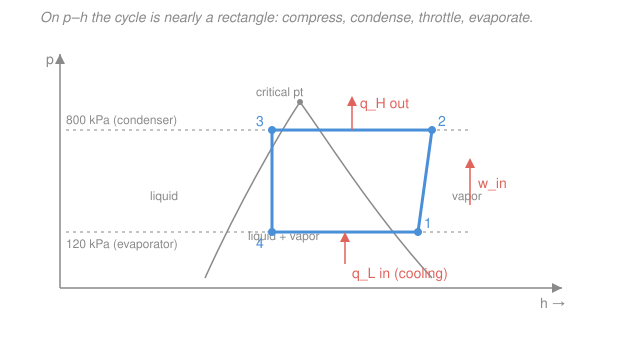

# Engineering Thermodynamics · Lesson 4.4: Refrigeration & heat-pump cycles

> ⏱ ~15 min · Module 4: Cycles · Builds on: [2.5 Steady-flow devices — no work](02-05-steady-flow-devices-no-work.md), [3.1 The second law & the Carnot limit](03-01-second-law-carnot-limit.md), [3.4 Isentropic processes & efficiency](03-04-isentropic-processes-efficiency.md) · Unlocks: [4.5 Psychrometrics & exergy](04-05-psychrometrics-exergy.md)

## Why this matters

Every fridge, freezer, air conditioner, and heat pump on Earth runs one cycle: **vapor-compression refrigeration**. It is the Rankine power cycle ([4.1](04-01-rankine-vapor-power-cycle.md)) run *backwards* — instead of using heat to make work, it spends work to pump heat *uphill*, from cold to hot, against the direction heat wants to flow. The second law ([3.1](03-01-second-law-carnot-limit.md)) says that never happens for free, so you pay with compressor work. The payoff number, the **coefficient of performance**, is routinely bigger than 1 — a good heat pump delivers 3–5 units of heat per unit of electricity — and this lesson shows why that is bookkeeping, not magic.

## The idea

Heat rolls downhill on its own, hot to cold. To move it the *wrong* way — pull heat out of a cold freezer and dump it into a warm kitchen — you need a pump, and the working fluid (a **refrigerant**, e.g. R-134a) is the bucket that carries the heat.

The trick is to make the refrigerant *cold* where you want cooling and *hot* where you want to reject heat, using nothing but pressure. A boiling liquid sits at a fixed temperature set by its pressure. So:

1. **Low pressure → low boiling point.** In the freezer's coil the refrigerant boils at, say, $-22\,^\circ\mathrm{C}$. Anything warmer than that — the food — dumps heat into it, and that heat *evaporates* the liquid. That absorbed heat is the useful cooling.
2. **Compress it.** A compressor squeezes the vapor to high pressure, which raises its boiling/condensing temperature to, say, $+31\,^\circ\mathrm{C}$ — now hotter than the room.
3. **High pressure → high condensing point.** In the condenser (the warm coils on the back of your fridge) the hot vapor gives up heat to the room and condenses back to liquid.
4. **Drop the pressure again** with a simple valve, and the liquid flashes cold, ready to boil once more.

Four devices, a closed loop, and the only energy you *buy* is the compressor work. Everything else is heat riding the pressure swings.

## The formal version

Number the four states around the loop. Each device is a steady-flow control volume, so per unit mass the steady-flow energy balance ([2.4](02-04-steady-flow-devices-work.md)–[2.5](02-05-steady-flow-devices-no-work.md)) — neglecting kinetic/potential terms — reduces to a difference of specific enthalpies $h$ (kJ/kg).

**1 → 2, Compressor** (adiabatic, work in). Saturated vapor at low pressure enters; superheated vapor at high pressure leaves.
$$w_{in} = h_2 - h_1 \quad (\mathrm{kJ/kg}).$$
*In words: the work you pay equals the enthalpy the compressor adds to the refrigerant.* Ideal case: isentropic, $s_2 = s_1$ ([3.4](03-04-isentropic-processes-efficiency.md)).

**2 → 3, Condenser** (heat out, no work). High-pressure vapor cools and condenses to saturated liquid.
$$q_H = h_2 - h_3 \quad (\mathrm{kJ/kg}),$$
the heat *rejected* to the warm reservoir. ($q_H > 0$ as written; it leaves the fluid.)

**3 → 4, Throttle valve** (no work, no heat). Here we reuse [2.5](02-05-steady-flow-devices-no-work.md) directly: a throttle is **isenthalpic**,
$$h_4 = h_3.$$
*In words: an expansion valve drops the pressure at constant enthalpy* — the liquid partially flashes to a cold, low-pressure liquid–vapor mixture. No enthalpy is lost; it is just redistributed, and the temperature plummets.

**4 → 1, Evaporator** (heat in, no work). The cold mixture boils, absorbing heat from the space being cooled.
$$q_L = h_1 - h_4 \quad (\mathrm{kJ/kg}),$$
the **useful cooling load** — the whole point of the machine.

**Coefficient of performance (COP).** Efficiency is "what you want ÷ what you pay." A refrigerator wants $q_L$; a heat pump wants $q_H$; both pay $w_{in}$:
$$\mathrm{COP}_R = \frac{q_L}{w_{in}} = \frac{h_1 - h_4}{h_2 - h_1}, \qquad \mathrm{COP}_{HP} = \frac{q_H}{w_{in}} = \frac{h_2 - h_3}{h_2 - h_1}.$$
*In words: COP is heat moved per unit of work spent.* Because you're **moving** heat rather than **creating** it, COP is normally **greater than 1** — that is not a violation of anything (Example 2). The first law around the closed loop forces $q_H = q_L + w_{in}$, which gives a clean identity:
$$\boxed{\;\mathrm{COP}_{HP} = \mathrm{COP}_R + 1.\;}$$
*In words: the same machine, judged as a heater, always scores exactly one point higher than as a cooler* — because the heat it dumps upstairs is the cooling load *plus* the work that got recycled into heat.

**The Carnot ceiling.** No device beats a reversible one running between the same two temperatures ([3.1](03-01-second-law-carnot-limit.md)). With $T_L, T_H$ the absolute (kelvin) reservoir temperatures,
$$\mathrm{COP}_{R,\,Carnot} = \frac{T_L}{T_H - T_L}, \qquad \mathrm{COP}_{HP,\,Carnot} = \frac{T_H}{T_H - T_L}.$$
*In words: the closer the cold and hot sides, the easier the pumping and the higher the ceiling.* Real cycles fall short mainly because the throttle is irreversible (it destroys the pressure energy a turbine could have recovered).

## Picture

The refrigerant **$p$–$h$ diagram** is the engineer's favorite here because three of the four processes become straight lines: the two heat exchangers are horizontal (constant pressure), the throttle is vertical (constant enthalpy), and only the compressor slants. The cycle is nearly a rectangle, and its *width along the bottom* is $q_L$ while its *width along the top* is $q_H$ — you can almost read the COP off the picture.

## Worked examples

**Example 1 — an R-134a cycle, end to end.** An ideal vapor-compression refrigerator uses R-134a. The evaporator runs at $120\ \mathrm{kPa}$ and the condenser at $800\ \mathrm{kPa}$. Representative R-134a table values (Çengel; editions vary slightly):

| State | Description | $h$ (kJ/kg) |
|---|---|---|
| 1 | sat. vapor @ 120 kPa | $237.0$ |
| 2 | superheated @ 800 kPa, $s_2=s_1$ | $272.0$ |
| 3 | sat. liquid @ 800 kPa | $95.5$ |
| 4 | after throttle, $h_4=h_3$ | $95.5$ |

Work through the loop:
$$q_L = h_1 - h_4 = 237.0 - 95.5 = 141.5\ \mathrm{kJ/kg},$$
$$w_{in} = h_2 - h_1 = 272.0 - 237.0 = 35.0\ \mathrm{kJ/kg},$$
$$q_H = h_2 - h_3 = 272.0 - 95.5 = 176.5\ \mathrm{kJ/kg}.$$
$$\mathrm{COP}_R = \frac{q_L}{w_{in}} = \frac{141.5}{35.0} = 4.04.$$

*Check.* First law on the loop: $q_L + w_{in} = 141.5 + 35.0 = 176.5 = q_H$ ✓ — the numbers close. As a heat pump the very same hardware scores $\mathrm{COP}_{HP} = q_H/w_{in} = 176.5/35.0 = 5.04 = \mathrm{COP}_R + 1$ ✓. Units: every term is kJ/kg, so COP is dimensionless ✓. A COP of 4 means each joule of compressor work shovels four joules of heat out of the cold box — that's why refrigeration is cheap to run.

**Example 2 — why COP > 1 doesn't break the first law.** A student objects: "COP $= 4.04 > 1$ — you got more energy out than you put in!" Untangle it. The first law is about *conservation*, and nothing here is created:
$$\underbrace{q_H}_{176.5\ \text{dumped to room}} = \underbrace{q_L}_{141.5\ \text{stolen from cold box}} + \underbrace{w_{in}}_{35.0\ \text{electricity}}.$$
Energy in ($q_L + w_{in}$) equals energy out ($q_H$), exactly. COP is **not** an energy ratio in–vs–out; it is *heat moved per unit of work purchased*. You didn't manufacture 141.5 kJ of cooling — you **relocated** it, and the modest 35.0 kJ of work is just the toll for pushing heat uphill. The second law caps how good the toll can get. Here the reservoirs sit at the saturation temperatures $T_L \approx -22.3\,^\circ\mathrm{C} = 250.9\ \mathrm{K}$ and $T_H \approx 31.3\,^\circ\mathrm{C} = 304.5\ \mathrm{K}$, so
$$\mathrm{COP}_{R,\,Carnot} = \frac{T_L}{T_H - T_L} = \frac{250.9}{304.5 - 250.9} = \frac{250.9}{53.6} \approx 4.68.$$
Our real cycle's $4.04$ sits *below* the Carnot ceiling of $4.68$ — as the second law demands. The gap is mostly the throttle, which irreversibly wastes the liquid's pressure energy instead of recovering work from it.

## Watch out

- **You might think you should replace the throttle with a turbine** to recover that lost work — after all, that's why power cycles use turbines. In principle yes; in practice no. The 3→4 stream is nearly-incompressible *liquid*, so the recoverable work is tiny (enthalpy barely changes), while a turbine on a two-phase flashing flow is expensive, fragile, and maintenance-heavy. A throttle is a cheap, robust brass valve with no moving parts. The small COP hit buys enormous simplicity — an engineering trade, not an oversight.
- **You might think a higher COP means a colder freezer.** It's the opposite pull: COP *rises* as $T_H - T_L$ shrinks (Carnot formula). Demanding a colder $T_L$ or dumping into a hotter $T_H$ widens the gap and *lowers* COP. That's why an AC struggles (low COP) on the hottest days — exactly when you need it most.
- **You might mix up $q_H$ and $q_L$ in the COP.** Refrigerator's prize is the *cold*-side heat $q_L$ (what you remove from the box); heat pump's prize is the *hot*-side heat $q_H$ (what you deliver to the room). Same cycle, same $w_{in}$, different numerator — and $\mathrm{COP}_{HP}$ is always the larger by exactly 1.

## One-liner

> Run Rankine backwards: spend $w_{in}$ to boil a refrigerant cold and condense it hot, moving $q_L$ uphill so $\mathrm{COP}=q_L/w_{in}>1$ — bounded above by Carnot's $T_L/(T_H-T_L)$.

## Problems

**P1 (🟢)** A vapor-compression cycle has $h_1 = 240$, $h_2 = 280$, $h_3 = h_4 = 100$ kJ/kg. Find $q_L$, $w_{in}$, $q_H$, $\mathrm{COP}_R$, and $\mathrm{COP}_{HP}$. Verify $q_H = q_L + w_{in}$.

**P2 (🟡)** A heat pump keeps a house at $21\,^\circ\mathrm{C}$ by pumping heat from outdoor air at $-4\,^\circ\mathrm{C}$. (a) What is the maximum (Carnot) $\mathrm{COP}_{HP}$? (b) If the real unit achieves 55% of that, and the house loses heat at $8\ \mathrm{kW}$, what electrical power does the compressor draw?

**P3 (🔴)** Show algebraically that $\mathrm{COP}_{HP} = \mathrm{COP}_R + 1$ follows purely from the closed-loop first law $q_H = q_L + w_{in}$, for *any* refrigeration cycle (not just the ideal one). Then argue why the Carnot versions obey the same identity.

Solutions

**P1**
$$q_L = h_1 - h_4 = 240 - 100 = 140\ \mathrm{kJ/kg}, \quad w_{in} = h_2 - h_1 = 280 - 240 = 40\ \mathrm{kJ/kg},$$
$$q_H = h_2 - h_3 = 280 - 100 = 180\ \mathrm{kJ/kg}.$$
$$\mathrm{COP}_R = \frac{140}{40} = 3.5, \qquad \mathrm{COP}_{HP} = \frac{180}{40} = 4.5.$$
*Check.* $q_L + w_{in} = 140 + 40 = 180 = q_H$ ✓, and $\mathrm{COP}_{HP} = 3.5 + 1 = 4.5$ ✓. Units all kJ/kg, COP dimensionless ✓.

**P2** Convert to kelvin: $T_H = 21 + 273 = 294\ \mathrm{K}$, $T_L = -4 + 273 = 269\ \mathrm{K}$.

(a) $$\mathrm{COP}_{HP,\,Carnot} = \frac{T_H}{T_H - T_L} = \frac{294}{294 - 269} = \frac{294}{25} = 11.76.$$

(b) Real $\mathrm{COP}_{HP} = 0.55 \times 11.76 = 6.47$. To hold temperature the pump must deliver $\dot Q_H = 8\ \mathrm{kW}$, so the compressor power is
$$\dot W_{in} = \frac{\dot Q_H}{\mathrm{COP}_{HP}} = \frac{8}{6.47} = 1.24\ \mathrm{kW}.$$
*Check.* Delivering 8 kW of heat for 1.24 kW of electricity beats a resistance heater (which would need the full 8 kW) by about $6.5\times$ — the signature advantage of a heat pump. Units: $\mathrm{kW}/(\text{dimensionless}) = \mathrm{kW}$ ✓. The small $25\ \mathrm{K}$ gap is why the Carnot ceiling is so high here.

**P3** By definition $\mathrm{COP}_{HP} = q_H/w_{in}$ and $\mathrm{COP}_R = q_L/w_{in}$. Substitute the closed-loop first law $q_H = q_L + w_{in}$:
$$\mathrm{COP}_{HP} = \frac{q_H}{w_{in}} = \frac{q_L + w_{in}}{w_{in}} = \frac{q_L}{w_{in}} + \frac{w_{in}}{w_{in}} = \mathrm{COP}_R + 1.$$
Only energy conservation was used — no assumption of reversibility, ideal gas, or isentropic compression — so it holds for real cycles too. For the Carnot versions, note the same $q_H = q_L + w_{in}$ balance still applies, and one can check directly:
$$\mathrm{COP}_{HP,\,Carnot} = \frac{T_H}{T_H - T_L} = \frac{T_L}{T_H - T_L} + \frac{T_H - T_L}{T_H - T_L} = \mathrm{COP}_{R,\,Carnot} + 1.$$
*Check.* The "$+1$" is the recycled work reappearing as heat on the hot side — a first-law statement, indifferent to how (ir)reversibly the cycle runs. ✓

## Flashback

**From Lesson 3.1 (The second law & the Carnot limit):** A Carnot *heat engine* operates between a hot reservoir at $800\ \mathrm{K}$ and a cold reservoir at $300\ \mathrm{K}$. What is its thermal efficiency, and how much work does it produce per $1000\ \mathrm{kJ}$ of heat drawn from the hot side? (Fresh variant — an engine, not a fridge.)

Solution

Carnot efficiency depends only on the absolute temperatures:
$$\eta_{th,\,Carnot} = 1 - \frac{T_L}{T_H} = 1 - \frac{300}{800} = 1 - 0.375 = 0.625 = 62.5\%.$$
Work per $1000\ \mathrm{kJ}$ of heat in:
$$W = \eta_{th}\, Q_H = 0.625 \times 1000 = 625\ \mathrm{kJ}, \qquad Q_L = Q_H - W = 375\ \mathrm{kJ}\ \text{rejected}.$$
*Check.* $W + Q_L = 625 + 375 = 1000 = Q_H$ ✓ (first law). Note the *engine* uses $1 - T_L/T_H$, while the refrigerator/heat pump in this lesson uses $T_L/(T_H - T_L)$ — same two temperatures, reciprocal-flavored formulas, because the fridge is the engine run backwards. ✓

## Connections

- **Backward:** the throttle's $h_4 = h_3$ is lifted straight from [2.5](02-05-steady-flow-devices-no-work.md), the compressor's $w_{in} = h_2 - h_1$ from [2.4](02-04-steady-flow-devices-work.md), the isentropic ideal from [3.4](03-04-isentropic-processes-efficiency.md), and the Carnot ceiling from [3.1](03-01-second-law-carnot-limit.md). This cycle is the mirror image of the Rankine power cycle in [4.1](04-01-rankine-vapor-power-cycle.md): same four devices, energy flowing the other way, turbine swapped for a throttle.
- **Forward:** [4.5](04-05-psychrometrics-exergy.md) takes these ideas into real air-conditioning (where cooling *and* dehumidifying moist air is the job) and uses **exergy** to quantify exactly how much the throttle's irreversibility costs — the gap between the real 4.04 and the Carnot 4.68 we found in Example 2.
- **Sideways (entropy's origin):** this course treats entropy as bookkeeping — the ledger that forbids heat from flowing uphill for free and sets the Carnot COP. *Why* nature keeps that ledger, in terms of microscopic disorder and counting states, is the story told in `thermodynamics-physics` and `stat-mech`. The refrigerator is the machine that pays entropy's toll on purpose.
