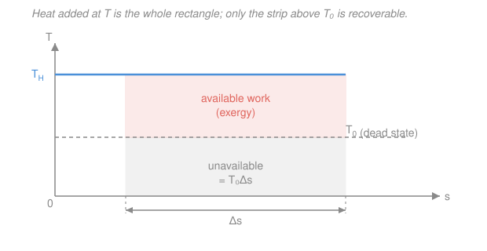

# Engineering Thermodynamics · Lesson 4.5: A taste — psychrometrics & exergy

> ⏱ ~15 min · Module 4: Power & Refrigeration Cycles · Builds on: [3.1 The second law and the Carnot limit](03-01-second-law-carnot-limit.md), [3.3 Entropy balance & the Tds relations](03-03-entropy-balance-tds-relations.md) · Unlocks: HVAC and air-conditioning; heat transfer and reactor thermal-hydraulics as future courses

## Why this matters

Two questions this course has quietly left on the table. First: the "air" in every device you've analyzed was really *moist* air — dry air carrying a little water vapor — and that water is the whole story of weather, comfort, cooling towers, and why your bathroom mirror fogs. **Psychrometrics** is the bookkeeping of moist air. Second, and deeper: the first law counts joules, but a joule of steam at 800 K and a joule of lukewarm water are worth wildly different amounts of *work*. The second law ([3.1](03-01-second-law-carnot-limit.md)) told you a bound exists; **exergy** turns that bound into a number — the maximum work a stream can still deliver — and puts a dollar value on every bit of irreversibility you generated in [3.3](03-03-entropy-balance-tds-relations.md). This closing lesson is a taste of both: two tools that professional engineers reach for daily, built entirely from what you already know.

## The idea

**Moist air.** Picture the atmosphere as two gases sharing the same space: a lot of dry air, and a little water vapor. They act nearly independently, so the total pressure splits into a dry-air part and a vapor part (Dalton's rule). Two numbers describe the moisture. The **humidity ratio** $\omega$ asks *how many kilograms of water ride along per kilogram of dry air* — the absolute amount. **Relative humidity** $\phi$ asks a different question: *how close is that vapor to condensing?* Air at a given temperature can only hold so much vapor before droplets form; $\phi$ is the fraction of that ceiling you've used. Cool the air and the ceiling drops — hold the moisture fixed and eventually you hit it. The temperature where you do is the **dew point**, and that is exactly why fog, dew, and a fogged mirror appear: warm moist air touches something cold, cools below its dew point, and sheds water.

**Exergy.** Energy is conserved, but *usefulness* is not. A tank of compressed hot gas can run a turbine; the same gas once it has cooled and depressurized to match the room can run nothing — yet by the first law it may still hold plenty of internal energy. The difference is that work requires a *disequilibrium* with the surroundings, and once a system reaches the surroundings' temperature and pressure — the **dead state** $(T_0, p_0)$ — there is nothing left to extract. **Exergy** is the maximum useful work obtainable as a system relaxes to the dead state. It is energy weighted by quality. And here is the punchline that ties the whole course together: every irreversibility you tallied as entropy generation $S_\text{gen}$ ([3.3](03-03-entropy-balance-tds-relations.md)) *destroys* exergy, in the amount $T_0 S_\text{gen}$. Friction, unrestrained heat flow, throttling — each quietly incinerates a definite number of kilojoules of work potential.

## The formal version

**Humidity ratio.** With $m_v$ the mass of water vapor (kg) and $m_a$ the mass of dry air (kg) in the same volume, and treating both as ideal gases at total pressure $p$ with vapor partial pressure $p_v$ (kPa):

$$\omega \equiv \frac{m_v}{m_a} = 0.622\,\frac{p_v}{p - p_v} \quad \left(\tfrac{\mathrm{kg\ water}}{\mathrm{kg\ dry\ air}}\right).$$

*In words: the water-to-dry-air mass ratio, set by the vapor's share of the pressure.* The $0.622$ is the ratio of molar masses, $M_v/M_a = 18.02/28.97$ — water molecules are lighter, so a given *pressure* share buys less *mass*.

**Relative humidity.** With $p_g(T)$ the saturation pressure of water at the air's temperature $T$ (the vapor dome pressure from [1.2](01-02-phase-behavior-pure-substance.md), read off the steam table):

$$\phi \equiv \frac{p_v}{p_g(T)} \qquad (0 \le \phi \le 1).$$

*In words: the vapor pressure as a fraction of the most the air could hold at this temperature.* At $\phi = 1$ the air is saturated — any further cooling condenses water.

**Dew point.** The **dew-point temperature** $T_{dp}$ is the temperature at which the *existing* vapor becomes saturated on cooling at constant pressure:

$$p_g(T_{dp}) = p_v.$$

*In words: cool moist air, holding its water fixed, and $T_{dp}$ is where the first droplet forms.* Note $T_{dp}$ depends only on how much vapor is present ($p_v$), not on the current temperature.

**Flow exergy.** For a stream at state $(h, s, V, z)$ relative to a dead state $(T_0, p_0)$ where the same fluid has $h_0, s_0$, the **flow (stream) exergy** per unit mass (kJ/kg) is

$$\psi = (h - h_0) - T_0(s - s_0) + \frac{V^2}{2} + gz.$$

*In words: the most work each kilogram can still deliver — its enthalpy edge over the dead state, docked by the unavailable part $T_0(s-s_0)$, plus whatever kinetic and potential energy it carries.* Here $h$ is specific enthalpy (kJ/kg), $s$ specific entropy (kJ/(kg·K)), $T_0$ the dead-state temperature (K), $V$ velocity (m/s), $g = 9.81\ \mathrm{m/s^2}$, $z$ height (m). The mechanical terms $V^2/2$ and $gz$ come out in J/kg — divide by 1000 for kJ/kg. The term $T_0(s - s_0)$ is the energy that *must* be rejected to the surroundings and can never become work: it is the price the second law charges.

**Exergy destroyed (Gouy–Stodola).** For any real process,

$$X_\text{dest} = T_0\, S_\text{gen} \ge 0,$$

with $S_\text{gen}$ the entropy generated (kJ/K) from the entropy balance of [3.3](03-03-entropy-balance-tds-relations.md). *In words: irreversibility has a cash value — every unit of entropy you generate destroys $T_0$ units of work potential, and the destruction is never negative (that's the second law again).* This is the single most useful equation in second-law engineering: it locates *where* in a plant work is being lost and *how much*.

**Two efficiencies, one line.** The **first-law (thermal) efficiency** $\eta_\text{th}$ asks what fraction of *energy input* you converted; the **second-law (exergetic) efficiency** $\eta_{II} = \dfrac{\text{exergy recovered}}{\text{exergy supplied}}$ asks what fraction of the *work potential* you actually captured — so a device can hit $\eta_\text{th} = 40\%$ yet $\eta_{II} = 80\%$ if $40\%$ was near the thermodynamic ceiling all along.

## Picture

On a $T$–$s$ diagram the heat added to a stream is the area under its path ([3.2](03-02-entropy-clausius-inequality.md)). Draw the dead-state temperature $T_0$ as a horizontal line: it slices that heat into two strips. The strip **above** $T_0$ (coral) is the part a reversible engine could turn into work — the exergy. The strip **below** $T_0$ (grey), of area $T_0\,\Delta s$, is *unavailable*; it must be dumped to the surroundings no matter how clever your machine. Exergy is literally the recoverable area above the dead state — and the higher above $T_0$ you supply heat, the taller the coral strip, which is why high-temperature heat is worth more.

## Worked examples

**Example 1 (psychrometrics — read a moist-air state).** Room air is at $T = 30\,^\circ\mathrm{C}$, total pressure $p = 101.325\ \mathrm{kPa}$, relative humidity $\phi = 0.60$. At $30\,^\circ\mathrm{C}$ the steam table gives $p_g = 4.246\ \mathrm{kPa}$. Find the vapor pressure, the humidity ratio, and the dew point.

Vapor pressure from the definition of $\phi$:

$$p_v = \phi\, p_g(T) = 0.60 \times 4.246 = 2.55\ \mathrm{kPa}.$$

Humidity ratio:

$$\omega = 0.622\,\frac{p_v}{p - p_v} = 0.622 \times \frac{2.55}{101.325 - 2.55} = 0.622 \times \frac{2.55}{98.78} \approx 0.0160\ \tfrac{\mathrm{kg\ water}}{\mathrm{kg\ dry\ air}}.$$

So every kilogram of dry air carries about 16 grams of water. Dew point: cool the air (holding $p_v = 2.55\ \mathrm{kPa}$ fixed) until $p_g(T_{dp}) = 2.55\ \mathrm{kPa}$. Scanning the saturation table, $p_g = 2.55\ \mathrm{kPa}$ at about $T_{dp} \approx 21\,^\circ\mathrm{C}$.

*Sanity check.* $\omega \approx 0.016$ is a typical comfortable indoor value (a few tens of grams per kg). The dew point ($21\,^\circ\mathrm{C}$) sits below the actual temperature ($30\,^\circ\mathrm{C}$), as it must whenever $\phi < 1$ — chill this air to $21\,^\circ\mathrm{C}$ and it fogs, which is why a glass of ice water in this room sweats. ✓

**Example 2 (exergy destroyed by heat transfer — the irreversibility of [3.3](03-03-entropy-balance-tds-relations.md) costs real work).** In [3.3](03-03-entropy-balance-tds-relations.md) you found that when $Q$ flows across a finite temperature gap from a hot reservoir at $T_H$ to a cold one at $T_L$, entropy is generated at $S_\text{gen} = Q\left(\tfrac{1}{T_L} - \tfrac{1}{T_H}\right)$. Let $Q = 500\ \mathrm{kJ}$ leak from $T_H = 800\ \mathrm{K}$ into surroundings at $T_L = T_0 = 300\ \mathrm{K}$. How much work potential did that leak destroy?

$$S_\text{gen} = 500\left(\frac{1}{300} - \frac{1}{800}\right) = 500\,(0.003333 - 0.001250) = 500 \times 0.002083 = 1.042\ \tfrac{\mathrm{kJ}}{\mathrm{K}}.$$

Apply Gouy–Stodola:

$$X_\text{dest} = T_0\, S_\text{gen} = 300 \times 1.042 = 312.5\ \mathrm{kJ}.$$

Interpret it: that $500\ \mathrm{kJ}$, delivered at $800\ \mathrm{K}$, could have driven a reversible (Carnot) engine rejecting to $300\ \mathrm{K}$ and produced $W = Q\left(1 - \tfrac{T_0}{T_H}\right) = 500(1 - 300/800) = 312.5\ \mathrm{kJ}$ of work — that is its exergy. Once it has simply *leaked* to $300\ \mathrm{K}$, it sits at the dead state with **zero** exergy. The leak vaporized all $312.5\ \mathrm{kJ}$ of work potential while conserving every joule of energy.

*Sanity check.* $X_\text{dest} > 0$ (irreversible, as required), and it equals the incoming exergy exactly because the heat ended up *at* the dead-state temperature, where no exergy remains. Units: $\mathrm{K} \times \mathrm{kJ/K} = \mathrm{kJ}$ ✓. This is the whole reason engineers hate unrestrained heat transfer: energy survives, but usefulness burns. ✓

## Watch out

- **You might think $\phi = 100\%$ means the air is "mostly water."** It isn't — even saturated $30\,^\circ\mathrm{C}$ air is over $95\%$ dry air by mass ($\omega$ there is only about $0.027$). Relative humidity measures *how close the vapor is to condensing*, not how much water is present. The absolute amount is $\omega$, and the two can move oppositely: warm the air without adding water and $\phi$ drops (higher ceiling) while $\omega$ is unchanged.
- **You might think dew point depends on the current temperature.** It doesn't. Dew point is fixed entirely by the vapor already in the air ($p_v$). Heating the air raises $T$ and lowers $\phi$ but leaves $T_{dp}$ untouched — which is exactly why the dew point is the honest, portable measure of "how much moisture is really here."
- **You might think energy and exergy are the same accounting.** They are not. Energy obeys a *conservation* law (first law) — it can't be destroyed. Exergy obeys a *destruction* inequality (second law) — real processes always destroy some. A large reservoir of energy at the ambient temperature $T_0$ (the ocean, say) has essentially **zero** exergy: enormous energy, no work potential, because there is no disequilibrium to exploit.

## One-liner

> Psychrometrics splits air into dry air plus vapor and asks how close the vapor is to raining out; exergy splits energy into a usable part and a dead part, and charges you $T_0 S_\text{gen}$ for every irreversibility.

## Problems

**P1 (🟢)** Air at $T = 25\,^\circ\mathrm{C}$, total pressure $p = 100\ \mathrm{kPa}$, relative humidity $\phi = 0.50$. At $25\,^\circ\mathrm{C}$, $p_g = 3.169\ \mathrm{kPa}$. Find the vapor pressure $p_v$, the humidity ratio $\omega$, and (to the nearest degree) the dew point $T_{dp}$, given $p_g = 1.6\ \mathrm{kPa}$ near $14\,^\circ\mathrm{C}$.

**P2 (🟡)** Heat $Q = 800\ \mathrm{kJ}$ flows from a furnace wall at $T_H = 500\ \mathrm{K}$ to a coolant at $T_L = 320\ \mathrm{K}$; the environment (dead state) is at $T_0 = 300\ \mathrm{K}$. Using $S_\text{gen} = Q\left(\tfrac{1}{T_L} - \tfrac{1}{T_H}\right)$, find the entropy generated and the exergy destroyed. Then confirm your answer equals (exergy in at $T_H$) $-$ (exergy out at $T_L$).

**P3 (🔴)** Steam flows at $8\ \mathrm{MPa}$, $480\,^\circ\mathrm{C}$, where $h = 3347.5\ \mathrm{kJ/kg}$ and $s = 6.6586\ \mathrm{kJ/(kg\cdot K)}$. Take the dead state as liquid water at $T_0 = 25\,^\circ\mathrm{C} = 298\ \mathrm{K}$, $p_0 = 100\ \mathrm{kPa}$, with $h_0 = 104.8\ \mathrm{kJ/kg}$ and $s_0 = 0.3672\ \mathrm{kJ/(kg\cdot K)}$. Neglecting kinetic and potential energy, compute the flow exergy $\psi$. What fraction of the enthalpy excess $(h - h_0)$ is actually available as work?

Solutions

**P1** Vapor pressure: $p_v = \phi\, p_g = 0.50 \times 3.169 = 1.585\ \mathrm{kPa}$.

Humidity ratio:

$$\omega = 0.622\,\frac{p_v}{p - p_v} = 0.622 \times \frac{1.585}{100 - 1.585} = 0.622 \times \frac{1.585}{98.415} \approx 0.0100\ \tfrac{\mathrm{kg}}{\mathrm{kg\ dry\ air}}.$$

Dew point: find $T$ with $p_g(T) = 1.585\ \mathrm{kPa}$. Since $p_g \approx 1.6\ \mathrm{kPa}$ near $14\,^\circ\mathrm{C}$, $T_{dp} \approx 14\,^\circ\mathrm{C}$.

*Check.* $\omega \approx 0.010$ (about 10 g/kg) is a reasonable indoor value, and $T_{dp} = 14\,^\circ\mathrm{C} < 25\,^\circ\mathrm{C}$ as required for $\phi < 1$. ✓

**P2** Entropy generated:

$$S_\text{gen} = 800\left(\frac{1}{320} - \frac{1}{500}\right) = 800\,(0.003125 - 0.002000) = 800 \times 0.001125 = 0.900\ \tfrac{\mathrm{kJ}}{\mathrm{K}}.$$

Exergy destroyed:

$$X_\text{dest} = T_0\, S_\text{gen} = 300 \times 0.900 = 270\ \mathrm{kJ}.$$

Confirm by tracking the exergy of the heat itself, $X_Q = Q\left(1 - \tfrac{T_0}{T}\right)$:

$$X_\text{in} = 800\left(1 - \frac{300}{500}\right) = 800(0.40) = 320\ \mathrm{kJ}, \qquad X_\text{out} = 800\left(1 - \frac{300}{320}\right) = 800(0.0625) = 50\ \mathrm{kJ}.$$

$$X_\text{in} - X_\text{out} = 320 - 50 = 270\ \mathrm{kJ} = X_\text{dest}.\ \checkmark$$

*Check.* Both routes agree, $X_\text{dest} > 0$, and unlike Example 2 some exergy survives ($50\ \mathrm{kJ}$) because the heat lands at $320\ \mathrm{K}$, still above the dead state. Units: $\mathrm{kJ}$ throughout. ✓

**P3** With kinetic and potential terms dropped,

$$\psi = (h - h_0) - T_0(s - s_0) = (3347.5 - 104.8) - 298\,(6.6586 - 0.3672).$$

Compute each piece: $h - h_0 = 3242.7\ \mathrm{kJ/kg}$; $s - s_0 = 6.2914\ \mathrm{kJ/(kg\cdot K)}$; so

$$T_0(s - s_0) = 298 \times 6.2914 = 1874.8\ \mathrm{kJ/kg}, \qquad \psi = 3242.7 - 1874.8 \approx 1367.9\ \mathrm{kJ/kg}.$$

Available fraction: $\dfrac{\psi}{h - h_0} = \dfrac{1367.9}{3242.7} \approx 0.42$, i.e. about $42\%$.

*Check.* $\psi > 0$ and $\psi < (h - h_0)$, as it must be — the second law's toll $T_0(s - s_0) \approx 1875\ \mathrm{kJ/kg}$ is the unavailable grey strip in the Picture, and only $\sim\!42\%$ of the enthalpy excess is convertible to work. That ceiling of roughly $40\%$ is precisely why a real Rankine plant ([4.1](04-01-rankine-vapor-power-cycle.md)) tops out near there rather than at $100\%$. ✓

## Flashback

**From Lesson 3.1 (The second law and the Carnot limit):** A power plant draws $1200\ \mathrm{kJ}$ of heat from a furnace at $900\ \mathrm{K}$ and rejects heat to a river at $300\ \mathrm{K}$. What is the Carnot efficiency, and the maximum work this heat could produce?

Solution

Carnot efficiency depends only on the two reservoir temperatures:

$$\eta_\text{Carnot} = 1 - \frac{T_L}{T_H} = 1 - \frac{300}{900} = 0.667\ (66.7\%).$$

Maximum (reversible) work:

$$W_\text{max} = \eta_\text{Carnot}\, Q_H = 0.667 \times 1200 = 800\ \mathrm{kJ}.$$

*Check.* $W_\text{max} < Q_H$ (you can't beat the heat supplied), and this $800\ \mathrm{kJ}$ is exactly the *exergy* of the $1200\ \mathrm{kJ}$ relative to a $300\ \mathrm{K}$ dead state — the Carnot bound of [3.1](03-01-second-law-carnot-limit.md) and the exergy of this lesson are the same statement wearing two uniforms. ✓

## Connections

- **Backward:** exergy is the whole course cashed out in one number. It rests on the Carnot bound of [3.1](03-01-second-law-carnot-limit.md), the entropy generation of [3.3](03-03-entropy-balance-tds-relations.md) (via $X_\text{dest} = T_0 S_\text{gen}$), the $T$–$s$ areas of [3.2](03-02-entropy-clausius-inequality.md), and the enthalpy/steam-table machinery of [1.3](01-03-property-tables-quality.md). Psychrometrics reuses the saturation-pressure curve $p_g(T)$ straight from the vapor dome of [1.2](01-02-phase-behavior-pure-substance.md).
- **Forward:** these tools open the applied thermal-engineering courses. Psychrometrics is the foundation of **HVAC and air-conditioning** design (cooling coils, cooling towers, humidification). Exergy (second-law) analysis is how power plants and refrigeration systems are actually optimized — pinpointing which component destroys the most work. Both feed the future **heat-transfer** and **reactor thermal-hydraulics** courses, where the rate of heat flow and its irreversibility set real hardware limits.
- **Sideways (statistical origin):** this course has treated entropy as pure bookkeeping — a number you compute and generate. *Why* $T_0 S_\text{gen}$ measures lost work, and *why* entropy always rises, is the microscopic story told in [`thermodynamics-physics`](../../thermodynamics-physics/syllabus.md) and [`stat-mech`](../../stat-mech/syllabus.md), where entropy counts molecular arrangements and irreversibility is the overwhelming likelihood of disorder. Here, exergy destroyed is an accountant's loss; there, it is the universe spreading energy toward its most probable state.
