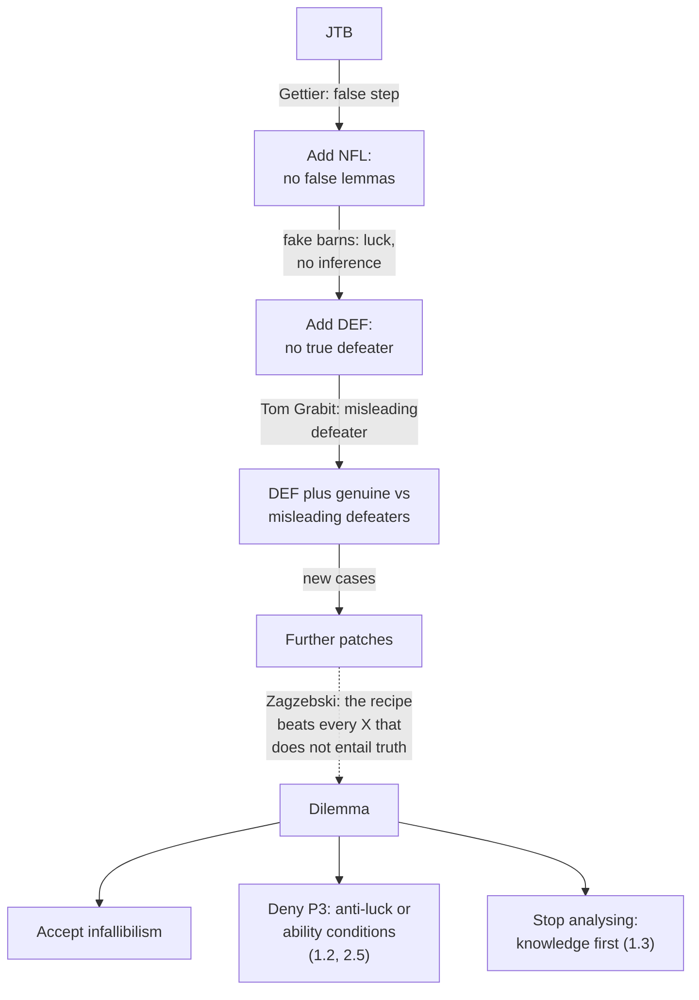

# Epistemology · Lesson 1.1: Repairing JTB

> ⏱ ~15 min · Module 1: What knowledge is · Builds on: [philosophical-method 3.1 Conceptual analysis](../../philosophical-method/lessons/03-01-conceptual-analysis.md) · Unlocks: [1.2 Sensitivity and safety](01-02-sensitivity-and-safety.md)

## Why this matters

This course asks five questions in order: what knowledge is (Module 1), how justification is structured (2), whether the skeptic can be answered (3), what reason, induction and other people can teach us (4), and how degrees of belief should behave (5, which is formal). It takes no side between the rival theories; it tests them, and the tests are cases. Every theory gets stated as explicit conditions, then run on a case with a verdict per condition. This lesson is the first round: two natural repairs to the justified-true-belief analysis, why each breaks, and an argument that *every* repair of a certain shape must break.

## The idea

You already have the setup from [philosophical-method 3.1](../../philosophical-method/lessons/03-01-conceptual-analysis.md): the [JTB analysis](../reference.md#jtb-analysis) says S knows $p$ iff $p$ is true, S believes $p$, and S is justified in believing $p$; and Gettier's 1963 cases show the three conditions are not sufficient. We won't re-run his cases. What they share is the diagnosis: in a [Gettier case](../reference.md#gettier-case) the belief is true **by luck**, because whatever makes it true is disconnected from whatever justifies it.

A repair adds a fourth condition meant to screen out the luck. Think of it as a filter bolted onto JTB. Two filters were tried first:

- **Check the route.** The Gettier victims reasoned through a false step. Ban false steps.
- **Check what you're missing.** Each victim lacks some fact which, had he known it, would have destroyed his justification. Ban that.

Both fail on cases. Then Linda Zagzebski argues the failures were never an accident.

## The argument

**Repair 1: no false lemmas.** Michael Clark ("Knowledge and Grounds: A Comment on Mr. Gettier's Paper", *Analysis*, 1963) proposed that a known belief must be *fully grounded*: no falsehood anywhere in what it rests on. Stated as conditions:

> **[No false lemmas](../reference.md#no-false-lemmas) (NFL).** S knows $p$ iff (1) $p$ is true, (2) S believes $p$, (3) S is justified in believing $p$, and (4) S's belief that $p$ is not inferred from, or based on, any falsehood.

In words: knowledge is JTB reached without passing through a false step.

It handles Gettier's own cases. It breaks in two directions.

*Not sufficient: luck with no lemma.* The [fake barn case](../reference.md#fake-barn-case), published by Alvin Goldman ("Discrimination and Perceptual Knowledge", *Journal of Philosophy*, 1976), who credits it to Carl Ginet. Henry drives through a county whose roadside is dotted with barn facades, convincing from the road. He looks at the one real barn and believes *that's a barn*. His belief is true and perceptually justified, and it is not inferred from anything, let alone a falsehood. Conditions 1–4 hold. Yet most people judge he doesn't know: had he glanced at any of the facades he'd have believed the same thing falsely. The luck is in the environment, not in the reasoning, and a condition that inspects reasoning cannot see it.

*Also not sufficient: the lemma can be skipped.* Richard Feldman ("An Alleged Defect in Gettier Counterexamples", 1974) noted that a Gettier subject can reason from what his evidence *says* (true) straight to the lucky conclusion, never asserting the false intermediate step. So NFL needs to ban something vaguer than an explicit false premise: a falsehood the belief "essentially depends on."

*Not necessary: harmless falsehoods.* Widen "depends on" too far and you rule out ordinary knowledge. NFL has to say which falsehoods are *essential*, and the natural gloss ("the belief would not be justified without it") is where the next repair starts.

**Repair 2: defeasibility.** Keith Lehrer and Thomas Paxson ("Knowledge: Undefeated Justified True Belief", *Journal of Philosophy*, 1969), developed further by Peter Klein, look not at the route but at the truths the believer is missing.

> **[Defeasibility analysis](../reference.md#defeasibility-analysis) (DEF).** S knows $p$ iff (1)–(3) of JTB hold and (4) there is no true proposition $d$ such that, if $d$ were added to S's evidence, S would no longer be justified in believing $p$.

In words: knowledge is justification that the whole truth would not overturn. Such a $d$ is a **defeater**.

DEF handles fake barns, which NFL could not: *most barn-looking things here are facades* is true, and added to Henry's evidence it removes his justification. It handles Gettier's cases too.

*Its trouble: misleading defeaters.* Lehrer and Paxson's own case, Tom Grabit. You watch Tom, whom you know well, take a book from the library and walk out with it. You believe *Tom took the book*. Unknown to you, his mother has told people that Tom was miles away that day and that his identical twin John was in the library. But Mrs Grabit is deluded; there is no John. Most people say you know. Yet *Mrs Grabit said Tom's twin was in the library* is true, and added to your evidence it would undercut your justification. So DEF says you don't know.

The fix is to distinguish **genuine** from **[misleading defeaters](../reference.md#misleading-defeater)**: a misleading defeater defeats only *by* supporting a falsehood (here, that John exists), and adding a further truth (Mrs Grabit is deluded) restores the justification. Revised DEF counts only genuine defeaters. The worry is whether "defeats only by supporting a falsehood" can be stated without already using the notion of knowledge, or of the right kind of connection to truth, that the analysis was supposed to explain. Each proposed formulation has met new cases: the cycle again.

**The inescapability argument.** Zagzebski ("The Inescapability of Gettier Problems", *Philosophical Quarterly*, 1994) steps back from particular repairs. Let **X** be whatever an analysis adds to true belief (justification plus any fourth condition). Her recipe:

1. Take a case where S's belief satisfies X but is false, through ordinary bad luck.
2. Amend it with a stroke of good luck that makes the belief true, without changing anything X looks at.

The [inescapability argument](../reference.md#inescapability-argument), as a dilemma:

- **P1.** For any analysis "knowledge = true belief + X", either X entails truth or it doesn't.
- **P2.** If X does not entail truth, a belief can satisfy X and be false (step 1 is available).
- **P3.** If step 1 is available, step 2 is available: some lucky fact can make the belief true without altering what X inspects.
- **P4.** The resulting belief satisfies X and truth, and is not knowledge, since its truth is luck.
- **P5.** If X does entail truth, the truth condition is redundant and nothing satisfying X can be false: X is an infallibility condition.
- **∴ C.** Every analysis of knowledge as true belief plus X is either refuted by a recipe case or infallibilist.

In words: as long as there is a gap between your conditions and the truth, luck can slip into the gap; close the gap and you have demanded infallibility.

**Where the argument is weakest.** P3. The recipe assumes the luck can always be placed outside what X inspects. An analysis whose X is *about the connection between belief and truth* (a modal condition in [1.2](01-02-sensitivity-and-safety.md), or a condition on success *from ability* in [2.5](02-05-virtue-epistemology.md)) is designed so that a merely lucky truth cannot satisfy X, even though X does not entail truth in every case. The critic says step 2 then changes something X looks at, so the recipe stalls. Zagzebski's rejoinder is that any such condition either still leaves room for luck or quietly entails truth. Which side is right depends on the details of each condition, which is why the next lessons state those conditions precisely.

## The argument map

Each solid arrow is a counterexample forcing a patch. The dashed arrow is the claim that the loop has no exit except the three at the bottom.

## Worked examples

**Example 1 (defeasibility on a clean case).** Ines checks a hospital's online roster, which lists Dr Okafor as on call tonight; the roster is accurate and Dr Okafor is on call. Ines believes *Dr Okafor is on call*. Unknown to her, a nurse has written "Dr Okafor: off sick" on the ward whiteboard, about a *different* night; the note sits next to tonight's date by accident.

- *JTB:* true, believed, justified by a reliable roster. Holds.
- *NFL:* Ines inferred from "the roster says so" and "the roster is reliable", both true. Holds.
- *Simple DEF:* $d$ = *the ward whiteboard says Dr Okafor is off sick tonight*. True, and adding it to her evidence leaves her with conflicting sources, so not justified. Condition 4 fails: no knowledge.
- *Revised DEF:* $d$ defeats only by supporting the falsehood *Dr Okafor is off sick tonight*; add the truth *the note is about another night* and her justification returns. Misleading defeater, so condition 4 holds: knowledge.

The intuitive verdict (she knows) sides with revised DEF.

**Example 2 (Zagzebski's recipe against NFL, and where it strains).** Run the recipe on NFL.

*Step 1.* Omar walks past the open-plan office and sees, at Dana's desk, someone who looks exactly like Dana. He believes, perceptually and without inference, *Dana is in the office*. It is her visiting sister; Dana is out. Justified, false, no inference.

*Step 2.* Amend: Dana is in fact in the office, in the back storage room, out of sight. Now Omar's belief is true, justified, and still not inferred from anything. NFL's condition 4 appears satisfied, and he doesn't know: the person he saw wasn't Dana.

*The strain.* An NFL defender replies that Omar's belief *is* based on a falsehood: *the person at the desk is Dana*. Perceptual beliefs rest on identifications, and his was false. Fair, but notice the price. To catch this case NFL must count implicit perceptual identifications as lemmas. And that move does nothing for fake barns, where Henry's identification *that is a barn* is true. So the defender wins this round only by widening "lemma", and the recipe can still be run on a case with no false identification anywhere. The strain tells you where NFL's X stops looking: it inspects the believer's grounds, and the recipe hides the luck in the world.

## Watch out

- **You might think a Gettier case needs an inference, but actually** fake barns show the luck can sit entirely in the environment. "Gettier case" names the lucky-truth structure, not Gettier's particular construction.
- **You might think defeasibility asks what S could have found out, but actually** the defeater need not be discoverable or available to S at all. Mrs Grabit's remark was made where you could never have heard it. DEF quantifies over every truth.
- **You might think the inescapability argument shows knowledge is unanalysable, but actually** its conclusion is a dilemma: refutable or infallibilist. Rejecting P3, accepting infallibilism, or giving up analysis are all live responses, and the next three lessons take them up.

## One-liner

> Patch JTB by inspecting the route (no false lemmas) or the missing truths (defeasibility), and a case will break the patch; Zagzebski argues any patch leaving a gap between its conditions and the truth will break, because luck fits in the gap.

## Problems

**P1 (🟢) *(Exegetical.)*** Lena checks a rail operator's app, which says her train departs at 8:15. The app is accurate; the train departs at 8:15, and she believes it does. Unknown to Lena, the station's printed timetable poster lists the train at 8:45, because of a typo nobody has noticed. Give the verdict, with a one-line reason each, of (a) NFL, (b) simple DEF, (c) revised DEF with the genuine/misleading distinction. Name the defeater in (b) and (c).

**P2 (🟡) *(Evaluative.)*** NFL says a known belief rests on no falsehood. Build a case in which someone infers $p$ from a premise that is false and still, intuitively, knows $p$. Then say in two sentences whether an NFL defender can absorb the case by saying the belief "really" rests on something true, and what that reply costs. 150 words or fewer.

**P3 (🔴, optional) *(Exegetical (a) · Evaluative (b).)*** (a) In one sentence each, say what an analysis must claim to take the infallibilist horn of Zagzebski's dilemma, and what the truth condition becomes. (b) Is infallibilism too high a price for escaping Gettier cases? Any verdict. 150 words or fewer.

Solutions

**P1** *(Exegetical, strict.)*

**Must hit, strict (a):**

- NFL is satisfied: Lena inferred from "the app says 8:15" and "the app is reliable", both true. Knowledge, by NFL.

**Must hit, strict (b):**

- Defeater: *the station timetable lists the train at 8:45*. True, and added to her evidence it gives her conflicting sources, so she is no longer justified. No knowledge, by simple DEF.

**Must hit, strict (c):**

- The same $d$ is misleading: it defeats only by supporting the falsehood *the train leaves at 8:45*, and adding the truth *the poster has a typo* restores her justification. With no genuine defeater, condition 4 holds. Knowledge, by revised DEF.

**Wrong turns:** treating the poster as a false lemma for NFL (Lena never believed or used it; NFL looks only at what her belief rests on); saying simple DEF exempts the poster because Lena couldn't have seen it (simple DEF quantifies over all truths, available or not).

**Model answer:** (a) Knowledge: no falsehood in her grounds. (b) No knowledge: the true fact about the poster would undercut her justification. (c) Knowledge: that fact is a misleading defeater, neutralized by the truth that the poster is a typo.

---

**P2** *(Evaluative.)*

**Accept:** any case where the false premise is used in the inference, the conclusion is true and justified, and the falsehood makes no difference to the conclusion's truth (the conclusion follows with a wide margin), so that most readers would grant knowledge.

**Must hit, any verdict:**

- A case meeting the Accept criterion, with the false premise and the inference made explicit.
- The NFL defender's reply stated: the belief is really based on a nearby truth (a range, "roughly n") that also supports the conclusion.
- A cost named: e.g. the reply makes "what the belief rests on" a matter of which truths *could* have served, which is no longer a condition on the actual route, and if applied to Gettier cases it threatens to let them through too (they also have nearby true bases, as Feldman's variant shows).

**Wrong turns:** a case where the falsehood is irrelevant because it was never used (that is not inference from a falsehood); a case where the margin is so thin that knowledge is doubtful, which turns a counterexample into a clash of intuitions.

**Model answer, one of several:** Mira counts the jars on a shelf, gets 47 (there are 46), and infers that they will fit in a crate holding 60. Her premise is false; her conclusion is true and she plainly knows it, since the count could be off by twelve upward and the conclusion would still hold. The NFL defender says her belief really rests on the true "about 47, well under 60". That saves the verdict but changes the theory: NFL no longer inspects the premises she used but some truth she could have used, and Gettier victims also have truths nearby (what their evidence says), so the reply must explain why those don't count.

---

**P3** *(Exegetical (a) · Evaluative (b).)*

**Must hit, strict (a):**

- The analysis must make its non-truth condition X entail truth: nothing can satisfy X and be false (e.g. evidence that guarantees $p$, or a factive state like *seeing that p*).
- The truth condition becomes redundant: it follows from X.

**Must hit, any verdict (b):**

- State the cost precisely: either knowledge requires conclusive evidence, which threatens to leave little ordinary knowledge (a skeptical cost), or X is a factive state, which seems to rebuild the thing being analysed into the analysis (a circularity or uninformativeness cost).
- Say whether the cost generalizes: does it hit every infallibilist view, or only the conclusive-evidence version?
- A verdict, separate from the reasoning.

**Wrong turns:** treating infallibilism as the claim that the knower must *feel* certain (it is about the relation between X and truth, not psychology); assuming the factive version must be skeptical (that is the version that avoids skepticism, at a different price).

**Model answer (b), one of several:** Not necessarily. If infallibility means evidence that logically guarantees $p$, the price is skepticism: almost nothing about the external world is guaranteed by my evidence. But X can entail truth without being a Cartesian guarantee if X is a factive state, such as *seeing that the barn is there*, which cannot obtain unless it is. The cost then shifts: we can no longer analyse knowledge from independently specifiable parts, since the factive state is itself a way of knowing. That is a cost only for someone who wanted a reductive analysis; a knowledge-first theorist ([1.3](01-03-why-knowledge.md)) accepts it willingly. So the price is high for one project and low for another.

## Connections

- **Backward:** [philosophical-method 3.1](../../philosophical-method/lessons/03-01-conceptual-analysis.md) gave you JTB, Gettier's two cases and the analyse-break-repair loop; this lesson runs that loop twice more and then asks whether it can terminate.
- **Forward:** [1.2](01-02-sensitivity-and-safety.md) tries the anti-luck conditions designed to deny P3 (sensitivity and safety), and runs them on fake barns. [1.3](01-03-why-knowledge.md) takes the third exit: stop analysing knowledge and treat it as basic. [1.4](01-04-internalism-and-externalism.md) asks what justification itself is, which every condition here took for granted. [2.5](02-05-virtue-epistemology.md) builds knowledge from ability.
- **Sideways:** the infallibilist horn is Descartes's standard of certainty, read historically in [`modern-philosophy`](../../modern-philosophy/syllabus.md) and as a live skeptical argument in [3.1](03-01-the-closure-argument.md).
