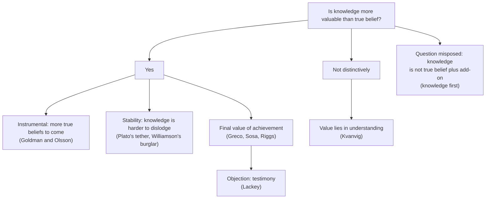

# Epistemology · Lesson 1.3: Why knowledge?

> ⏱ ~15 min · Module 1: What knowledge is · Builds on: [1.1 Repairing JTB](01-01-repairing-jtb.md), [1.2 Sensitivity and safety](01-02-sensitivity-and-safety.md) · Unlocks: [1.4 Internalism and externalism](01-04-internalism-and-externalism.md), [2.5 Virtue epistemology](02-05-virtue-epistemology.md)

## Why this matters

Two lessons of patching the analysis of knowledge invite an awkward question: why care? If a true belief gets you to the right answer, what does the extra ingredient (justification, safety, a non-defective route) add? An answer constrains the analysis, because whatever knowledge is, it must be the kind of thing worth having. And one prominent answer turns the whole project upside down: stop analysing knowledge and use it to explain everything else, including evidence.

## The idea

**The old question.** In Plato's *Meno* (97a–98a), a man with a true opinion about the road to Larisa guides you as well as one who knows the way; Socrates' answer is that true opinions "run away" like the statues of Daedalus unless tied down by working out the reason. That passage is read as history in [ancient-medieval-philosophy 2.2](../../ancient-medieval-philosophy/lessons/02-02-recollection-the-line-and-the-cave.md); here it is a live problem, the [value problem](../reference.md#value-problem).

Duncan Pritchard splits it in three:

- **Primary:** why is knowledge more valuable than mere true belief?
- **Secondary:** why is it more valuable than *any* proper part of it, such as justified true belief that falls short (a Gettier case)?
- **Tertiary:** why is it valuable in *kind*, not just in degree, so that the line between knowing and nearly knowing marks a jump in value?

**The swamping problem.** Linda Zagzebski (2003) put the sharpest version with a coffee machine. A good cup of coffee from a reliable machine is no better than an equally good cup from an unreliable one. The machine's reliability matters only because it tends to yield good coffee; once you have the good cup in hand, the reliability is "swamped." Now swap in belief. Reliable belief-forming processes matter because they tend to yield *true* beliefs. Once the belief is true, what does reliability add? Similar worries appear in Ward Jones (1997) and Richard Swinburne (1999); Jonathan Kvanvig (2003) made it central under the name [swamping problem](../reference.md#swamping-problem).

Notice the target. Swamping hits any account on which the extra ingredient is valuable only as a means to truth. That includes process reliabilism ([2.4](02-04-reliabilism.md)) and arguably any view on which justification's whole point is truth-conduciveness.

**The reversal: knowledge first.** Timothy Williamson (*Knowledge and Its Limits*, 2000) proposes that the failure of the post-Gettier repairs in [1.1](01-01-repairing-jtb.md) is a symptom: knowledge is not a compound of belief plus conditions at all. On his [knowledge-first](../reference.md#knowledge-first) view:

- **Knowledge is a mental state**, the most general *factive* one. (A state is *factive* if being in it entails that its content is true: seeing that, remembering that, and knowing that are factive; believing that is not.)
- **Knowledge has necessary conditions but no analysis.** Knowledge entails truth and belief, and safety may characterize it, but no list of conditions builds it up. Compare "red" and "coloured": being red entails being coloured, yet "coloured and X" is no illuminating definition of red.
- **Other notions get explained by knowledge.** The flagship is [E = K](../reference.md#e-equals-k): your evidence is exactly what you know. Another is the [knowledge norm of assertion](../reference.md#knowledge-norm-of-assertion): assert only what you know. That norm explains why "It's raining, but I don't know that it is" sounds absurd even though it could be true.

Williamson also gives knowledge an explanatory edge over true belief: a burglar who ransacks a house all night is better explained by "he knew there was a diamond there" than by "he truly believed it," because knowledge is less easily dislodged by misleading finds along the way. That is a modern descendant of Plato's tether.

## The argument

**A. The swamping argument.**

1. **P1 (truth monism):** the only thing of fundamental epistemic value is true belief. *In words:* epistemically, getting it right is the point.
2. **P2:** the reliability (or justification) of a belief-forming process is epistemically valuable only as a means to true belief.
3. **P3 (swamping principle):** if X is valuable only as a means to Y, then a thing that already has Y gains no value from also having X.
4. **∴ C:** a reliably formed true belief is no more valuable than an equally true belief formed unreliably; so if knowledge is reliably formed true belief, knowledge is no more valuable than true belief.

The replies sort by premise.

- **Deny P1: credit and achievement.** John Greco, Ernest Sosa and Wayne Riggs hold that a true belief that is *creditable* to your cognitive ability is an achievement, and achievements have final value, not just the value of their products. An archer's hit through skill beats a lucky hit even if both pierce the same spot. Full treatment in [2.5](02-05-virtue-epistemology.md). Jennifer Lackey's objection: testimonial knowledge seems to owe little to the hearer's own ability.
- **Deny P2's "only": the conditional-probability solution.** Alvin Goldman and Erik Olsson (2009) grant P3 for a single belief but note that reliability is a standing property of the *process*. Given that a true belief came from a reliable process you still have, the probability that your *future* beliefs of that kind will be true is higher than given a lucky one. So reliably produced true belief carries value a mere true belief lacks: it signals more true beliefs to come.
- **Accept C, relocate value.** Kvanvig concludes that the distinctive value belongs to *understanding*, not knowledge. On a knowledge-first view, by contrast, the question "what does the add-on add?" presupposes a decomposition into true belief plus add-on that the view denies.

**B. Knowledge first and the KK principle.** The [KK principle](../reference.md#kk-principle) says: if you know $p$, you know that you know $p$ (written $Kp \to KKp$, with $K$ for "the subject knows that"). Jaakko Hintikka defended it in *Knowledge and Belief* (1962). Williamson argues it fails for any creature with limited powers of discrimination, from a [margin-for-error principle](../reference.md#margin-for-error-principle):

1. **M:** if you know $p$ in case $\alpha$, then $p$ is true in every case close to $\alpha$ (within your margin for error). *In words:* knowledge cannot be a near miss. This is safety ([1.2](01-02-sensitivity-and-safety.md)) applied to discrimination.
2. If you know that you know $p$ in $\alpha$, then by M (applied to the proposition "I know $p$") you know $p$ in every case close to $\alpha$.
3. So $KKp$ needs $p$ to hold across a margin of *two* steps from $\alpha$, while $Kp$ needs only one.
4. **∴** where $p$ holds one step out but fails two steps out, you know $p$ without knowing that you know it.

A sibling argument, the anti-luminosity argument, runs on a woman who wakes at dawn feeling freezing and warms so slowly that she feels hot by noon: a margin principle applied moment by moment shows that even "I feel cold" is not always knowable when it holds.

**Where the argument is weakest.** For A, P3: critics say means-value is not always swamped. A reliable machine is worth more than an unreliable one *now*, even with today's cup poured, because of tomorrow's; Goldman and Olsson exploit exactly this. Their critics reply that the extra value then attaches to the process, not to the belief, and vanishes if the process will never be used again. For B, premise 2: a KK defender says the margin for "I know $p$" need not be the margin for $p$, since the second-order belief need not be formed by the same discriminating capacity.

## Map of positions

## Worked examples

**Example 1 (clean case: the conditional-probability reply).** Two hikers, Odile and Pim, each believe truly that the left fork leads to the hut. Odile read it off a well-maintained trail sign; Pim flipped a coin.

*Swamping:* right now, both beliefs get them to the hut. By P1–P3, Odile's belief is worth no more.

*Goldman and Olsson:* Odile's true belief came from a method (reading the park's signs) she will use again at the next fork. Conditional on her true belief having come that way, the probability that her next trail belief is true is high. Conditional on Pim's true belief having come from a coin, the probability that his next one is true is one half. Odile's state is worth more, and the surplus is not swamped because it concerns beliefs she does not yet have.

*What the reply costs:* the value is instrumental and contingent. If Odile will never hike again, the surplus disappears, yet intuitively her knowledge still beats Pim's luck. That is the gap the credit theorist fills with final value, and it is why the tertiary problem (value in kind) remains open even if this reply succeeds.

**Example 2 (hard case: a margin-for-error toy).** A sailor judges by eye how far a buoy is. Her estimates are reliable to within $m = 50$ metres; the buoy is in fact $x = 400$ metres away. Let $L$ be the true distance and consider $p$: "the buoy is more than 340 metres away."

Model M: she knows "$L > y$" in a case with true distance $x$ only if $L > y$ in every case whose true distance lies within $m$ of $x$, that is, iff $x - m > y$.

- **Does she know $p$?** $x - m = 400 - 50 = 350 > 340$. Yes.
- **Does she know that she knows $p$?** She must know $p$ in every close case, including the case with true distance $350$. There, $350 - 50 = 300$, and $300 > 340$ is false. So she does not know $p$ at that case, and she does not know that she knows $p$ at the actual one. In general, $KKp$ requires $x - 2m > y$; here $400 - 100 = 300$.

So she knows without knowing that she knows. Where the case strains: the model assumes the same margin governs both levels and that she cannot read her own estimate more finely than the world. A KK defender attacks exactly those assumptions, and the toy cannot settle whether they hold for real self-knowledge.

## Watch out

- **You might think the swamping problem shows that knowledge has no extra value, but actually** it shows that a *specific* account of the extra ingredient (valuable only as a means to truth) cannot explain the extra value. It is an argument against reliabilism-shaped theories as much as about knowledge.
- **You might think E = K makes evidence infallible, but actually** it makes evidence *true*: you can still be wrong about what your evidence is. Someone fooled by an illusion lacks evidence she thinks she has.
- **You might think rejecting KK means you never know that you know, but actually** it means only that knowing does not *guarantee* knowing that you know. Near the margin they come apart; far from it both hold.

## One-liner

> Knowledge must be worth more than true belief, but if its extra ingredient is just a route to truth, truth swamps it, so either the ingredient has value of its own or knowledge was never true belief plus an ingredient.

## Problems

**P1 (🟢) *(Exegetical (a) · Evaluative (b).)*** Two night-shift operators at a water plant each look at the same kind of status lamp. For Ana the lamp is lit, and she believes "the pump is running," which is true. Bea's lamp is unlit, but a reflection from a passing truck makes it look lit for a few seconds; she believes "the pump is running," which is false. Their experiences are indistinguishable. (a) On E = K, does each one's evidence include "the pump is running"? Does Bea's evidence include "the lamp looks lit"? Say what each answer depends on. (b) An objector says E = K makes evidence something you cannot always tell you have. State the objection precisely and the knowledge-first reply, and say what the reply costs. 120 words or fewer for (b).

**P2 (🟡) *(Exegetical (a) · Evaluative (b).)*** (a) Name the premise of the swamping argument that Goldman and Olsson's conditional-probability solution rejects or limits, and the one the credit theorist denies. One sentence each. (b) Steelman and reply: give the strongest objection to the conditional-probability solution, then the best reply on its behalf. 150 words or fewer.

**P3 (🔴) *(Formal (a) · Evaluative (b).)*** A surveyor estimates a field's length by pacing it. Her estimates are reliable to within 3 metres, and the field is in fact 120 metres long. Use the margin-for-error model from Example 2: she knows "the field is longer than $y$ metres" iff $120 - 3 > y$, given the actual length. (a) Find the range of $y$ for which she knows the claim, the range for which she knows that she knows it, and say whether $y = 115$ is a counterexample to KK. (b) Build a counterexample to KK of your own that does *not* rely on perceptual estimation of a quantity, and say in one sentence which assumption a KK defender would attack in it. 120 words or fewer for (b).

Solutions

**P1** *(Exegetical (a) · Evaluative (b))*

(a) Ana knows the pump is running (true, believed on a lamp that is in fact lit and working), so on E = K her evidence includes "the pump is running." Bea's belief is false, so she does not know it and it is not part of her evidence: E = K makes evidence factive. Whether Bea's evidence includes "the lamp looks lit" depends on whether she *knows* that it looks lit; if she does (it does look lit, and she believes it in the normal way), then yes. So the two have different evidence despite identical experiences.

**Must hit, strict (a):**

- Ana's evidence includes "the pump is running"; Bea's does not, because evidence is restricted to what is known and only truths are known.
- "The lamp looks lit" is in Bea's evidence only if she knows it; it is true, so it is a candidate.
- Identical experiences do not guarantee identical evidence on E = K.

**Must hit, any verdict (b):**

- The objection stated precisely: since Bea cannot tell her case from Ana's, she cannot tell that "the pump is running" is not among her evidence, so evidence is not always accessible to its owner.
- The reply: Williamson accepts this; nothing non-trivial is always accessible (anti-luminosity), so accessibility is no requirement any theory of evidence meets.
- The cost: a rule like "proportion belief to your evidence" can then be one you cannot always tell you are following.

**Wrong turns:** saying Bea's evidence includes "the pump is running" because she is justified in believing it (that conflates evidence with justified belief, which is exactly what E = K denies); saying E = K implies Bea has no evidence at all.

**Model answer (b), one of several:** Bea's situation is indistinguishable from Ana's, so she cannot tell that "the pump is running" is not among her evidence; if evidence is what guides belief, a guide you cannot tell you have seems useless. The knowledge-first reply is that no interesting condition is luminous: by the anti-luminosity argument, even "I feel cold" can hold unknowably, so demanding accessible evidence demands the impossible. The cost is that "believe what your evidence supports" becomes a norm you can violate blamelessly, and the theory needs a separate notion of excusable belief for Bea.

---

**P2** *(Exegetical (a) · Evaluative (b))*

**Must hit, strict (a):**

- Goldman and Olsson limit P2 (or, equivalently, the scope of P3): the process's reliability is valuable not only as a means to *this* true belief but as a sign of future true beliefs, and that value is not swamped by the present belief's truth.
- The credit theorist denies P1: true belief is not the only fundamental epistemic value, since cognitive achievement has final value.

**Must hit, any verdict (b):**

- An objection stated at strength, e.g.: the surplus value attaches to the reliable *process* or to the agent's future, not to the belief itself, and it vanishes when the process will not recur; yet knowledge still seems better than lucky true belief in such cases. (Or: the solution explains only a difference of degree, so it misses the tertiary problem.)
- A reply that addresses it, e.g.: in normal human life processes do recur, and our valuing of knowledge may be a generalization that persists in atypical cases; or bite the bullet in the one-off case.
- A judgment on whether the reply works.

**Wrong turns:** answering (a) with "they deny the conclusion" (every reply denies the conclusion; the task is the premise); treating the coffee machine as the argument rather than an analogy for P3.

**Model answer (b), one of several:** Objection: suppose a dying man forms one last true belief by an excellent process he will never use again. Goldman and Olsson's surplus is zero, yet his knowing still seems better than a lucky guess, so the solution has located the wrong value. Reply: our practice of valuing knowledge was shaped by typical cases, where reliable processes do recur, and the value attaches to the kind of state rather than being recomputed case by case. That reply has force as psychology, but it concedes that the deathbed knowledge is not itself more valuable, only valued. So it answers the primary problem in the typical case and leaves the tertiary problem open.

---

**P3** *(Formal (a) · Evaluative (b))*

(a) Knowing "longer than $y$" requires $120 - 3 > y$, so $y < 117$. Knowing that she knows requires that she know the claim in every case within 3 metres of 120, the worst being length 117, where knowing needs $117 - 3 > y$:

$$KK \iff 120 - 2\cdot 3 > y \iff y < 114.$$

At $y = 115$: $115 < 117$, so she knows; $115 \not< 114$, so she does not know that she knows. It is a counterexample to KK (given the model). Checked numerically in `verify-ep/01-03.py`.

**Accept (b):** any case where (i) the subject knows $p$, (ii) her capacity to discriminate cases is limited, so that a case close to the actual one is one where she does not know $p$, and (iii) the case is not a perceptual estimate of a magnitude (memory, recognition, arithmetic under time pressure, judging a friend's mood all qualify), plus a correctly named target assumption.

**Must hit, any verdict (b):**

- A case meeting (i)–(iii).
- The assumption a KK defender would attack: that the margin for the second-order belief "I know $p$" is the same as (or no finer than) the margin for $p$; or that close cases are ones she cannot discriminate from the actual one.

**Wrong turns:** in (a), giving the KK range as $y < 117$ (forgetting that the second level needs knowledge in every close case); in (b), a case where she simply does not know $p$ (that is no counterexample to $Kp \to KKp$).

**Model answer (b), one of several:** Rosa recognizes her cousin across a station concourse; she knows it is him. Had he been a little farther away, her recognition would have been a guess, and she cannot tell how near that boundary she is. So she knows it is her cousin but is not in a position to know that she knows. A KK defender would attack the assumption that her second-order judgment is as coarse as her recognition: if she can tell how good her view is, the margins come apart.

## Flashback

**From Lesson [1.1](01-01-repairing-jtb.md) (Repairing JTB):** *(Evaluative (a) · Exegetical (b).)* Counterexample. A student writes: "Every Gettier victim reasons through a false step, so no false lemmas is all the repair JTB needs." (a) Build a new case (not the fake barns themselves, and not one where the subject misidentifies what she sees) in which a belief meets all four NFL conditions but is intuitively not knowledge. Say in one sentence where the luck sits. 80 words or fewer. (b) Run simple DEF on your case: name the defeater and give the verdict. Two sentences.

Solution

**Accept (a):** any case where the belief is true, believed, justified and based on no falsehood, yet true by luck because of a feature of the surroundings the subject cannot detect, so that in an easily possible variant she would have formed the same belief in the same way and been wrong.

**Must hit, any verdict (a):**

- All four NFL conditions checked on the case: true, believed, justified, nothing false in what the belief rests on.
- The luck located in the environment, not in the reasoning, which is why condition 4, a condition on the believer's grounds, cannot see it.

**Must hit, strict (b):**

- The defeater is the true fact about the surroundings (in the model answer, *nearly all the orchids in this lobby are silk*). Added to her evidence, it removes her justification, so condition 4 of simple DEF fails: not knowledge.
- So DEF gets the intuitive verdict on this case, where NFL does not.

**Wrong turns:** a case in which the subject believes or uses something false along the way (NFL already rules that out, so it is no counterexample to the student). Dismissing the defeater because the subject could never have discovered it: simple DEF quantifies over every truth, available or not.

**Model answer, one of several:** (a) A hotel florist has set thirty silk orchids, indistinguishable from the doorway, around one live orchid. Wen, at the doorway, looks at the live one and believes *that orchid is alive*. The belief is true, perceptually justified and inferred from nothing false, so NFL says she knows; yet a glance one pot to the left would have produced the same belief falsely. The luck sits in the room, not in her reasoning. (b) Defeater: *nearly all the orchids in this lobby are silk*. It is true, and added to her evidence it leaves her unjustified, so simple DEF says she does not know.

## Connections

- **Backward:** the *Meno* tether is read historically in [ancient-medieval-philosophy 2.2](../../ancient-medieval-philosophy/lessons/02-02-recollection-the-line-and-the-cave.md); knowledge first is one response to Zagzebski's inescapability argument in [1.1](01-01-repairing-jtb.md); the margin-for-error principle is safety from [1.2](01-02-sensitivity-and-safety.md) applied to discrimination.
- **Forward:** whether evidence must be accessible (E = K says no) is the internalism dispute in [1.4](01-04-internalism-and-externalism.md); the swamping problem is pressed against process reliabilism in [2.4](02-04-reliabilism.md); the credit theory, and whether virtue answers the value problem, is [2.5](02-05-virtue-epistemology.md); the knowledge norm returns as knowledge-action principles in [3.4](03-04-contextualism-and-its-rivals.md); if E = K, conditionalization in [5.3](05-03-conditionalization.md) updates on what you come to know.
- **Sideways:** the method that produced the repair cycle, and its limits, is [philosophical-method 3.1](../../philosophical-method/lessons/03-01-conceptual-analysis.md). Whether knowledge is itself on the objective list of what is good for a person is [ethics 1.2](../../ethics/lessons/01-02-what-is-good-for-a-person.md): a final-value answer to the value problem from the side of well-being.
