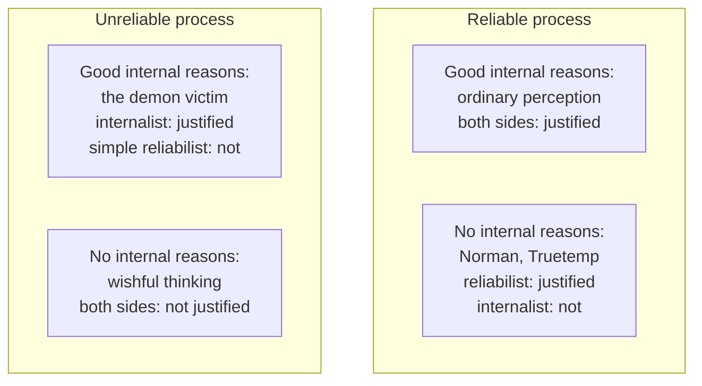

# Epistemology · Lesson 1.4: Internalism and externalism

> ⏱ ~15 min · Module 1: What knowledge is · Builds on: [1.1 Repairing JTB](01-01-repairing-jtb.md), [1.2 Sensitivity and safety](01-02-sensitivity-and-safety.md), [1.3 Why knowledge?](01-03-why-knowledge.md) · Unlocks: [2.1 The regress problem](02-01-the-regress-problem.md), [2.4 Reliabilism](02-04-reliabilism.md)

## Why this matters

Sensitivity and safety ([1.2](01-02-sensitivity-and-safety.md)) made knowledge depend on facts about nearby worlds that the knower may have no inkling of. That is a choice, and half the field thinks it is the wrong choice for *justification*. When your belief is justified, is that settled by something you could find by reflecting on your own mind, or by facts outside it, such as whether the process producing the belief tends to get things right? This is the dispute that runs under every theory in Module 2, and under every answer to the skeptic in Module 3. It is decided, as usual in this course, by cases. The trouble is that each side has cases the other cannot comfortably handle.

## The idea

First, what the dispute is *not* about. Nearly everyone grants that **knowledge** has external conditions: truth is one, and fake barn country ([1.1](01-01-repairing-jtb.md)) shows the environment can matter too. The fight is over **justification**, the condition a Gettier victim satisfies and a lucky guesser does not.

**[Propositional and doxastic justification](../reference.md#propositional-and-doxastic-justification).** Two notions, kept apart for the rest of the course.

- **Propositional:** $S$ has justification for $p$ iff $S$ has adequate reasons for $p$, whether or not $S$ believes $p$.
- **Doxastic:** $S$'s *belief* that $p$ is justified iff $S$ believes $p$ *on the basis of* adequate reasons.

*In words:* having a good reason is one thing; believing because of it is another. A detective whose clues point to the butler, but who believes the butler did it because she dislikes him, has propositional justification and lacks doxastic justification. The internalism dispute is mainly about propositional justification: what *makes* a reason good for you.

**Internalism** comes in two versions, and they are not equivalent. See [access internalism](../reference.md#access-internalism) and [mentalism](../reference.md#mentalism).

- **Access internalism.** Every factor that contributes to the justification of $S$'s belief is accessible to $S$ by reflection alone. *In words:* you could, by thinking, tell what your justifiers are.
- **Mentalism** (Earl Conee and Richard Feldman, "Internalism Defended", 2001). Justification supervenes on the subject's mental states: any two subjects alike in their mental states are alike in what they are justified in believing. *In words:* fix the mind, and you fix the justification.

The two come apart. A mental state you cannot pick out on reflection (a faint cue in your visual experience, a memory you are not currently recalling) can count for mentalism and cannot for access internalism.

**Externalism** is the denial: some justifier can lie outside the mind, or outside reflective reach. The paradigm is **process reliabilism** (Alvin Goldman): a belief is justified iff it is produced by a belief-forming process that tends to produce true beliefs. Its machinery and objections are [2.4](02-04-reliabilism.md)'s; here it serves as the externalist's standard-bearer.

The test of each view is the pair of conditionals it rules on. Is reliability *necessary* for justification? Is it *sufficient*? The internalist has a case against each.

**Against necessity: the [new evil demon problem](../reference.md#new-evil-demon-problem)** (Keith Lehrer and Stewart Cohen 1983; Cohen 1984). Take a counterpart of you whose experiences, memories and reasoning match yours exactly, but who is fed them by a deceiving demon. Her perception is wholly unreliable. Yet she believes exactly what the evidence of her senses supports, as carefully as you do. Internalists say she is as justified as you.

**Against sufficiency: [Norman the clairvoyant](../reference.md#norman-the-clairvoyant)** (Laurence BonJour 1980). Norman is a completely reliable clairvoyant about some subject matter, but has no evidence for or against the existence of such a power, or his having it. One day he finds himself believing the President is in New York City, from nowhere. The belief is true and reliably produced. **[Truetemp](../reference.md#truetemp-case)** (Lehrer, *Theory of Knowledge*, 1990) is the technological version: a surgeon secretly implants a device that makes Mr. Truetemp think accurate thoughts about the temperature, which he accepts without reflecting on where they come from. Internalists say both believe irresponsibly, and so without justification, however reliable the source.

The externalist's counterattack targets what internalism requires. **The problem of stored beliefs:** at this moment you are not thinking about most of what you justifiably believe, so what does reflection access? **The [problem of forgotten evidence](../reference.md#problem-of-forgotten-evidence)** (Goldman, "Internalism Exposed", 1999): you learned years ago, from an excellent source, that some food is good for the heart, and you have forgotten the source. Someone else learned the same thing from a notoriously unreliable source and has also forgotten. Now the two of you are internally alike, so mentalism must rate you equally. Intuitively, you are justified and the other person is not.

## The argument

The new evil demon, as an argument against reliabilism.

1. **$V$, the demon's victim, forms perceptual beliefs by unreliable processes.** *In words:* in her world, perception mostly misleads.
2. **$V$'s experiences, memories and reasoning are the same as yours, and she forms beliefs from them in the same way.** By stipulation.
3. **Parity: if two subjects share experiences, memories and reasoning, and form beliefs from them in the same way, their beliefs are equally justified.**
4. **Your perceptual beliefs are justified.**
5. **So $V$'s perceptual beliefs are justified.** From 2–4.
6. **So reliability is not necessary for justification.** From 1 and 5.

The argument is valid. Premise 4 is common ground (the skeptic aside). The externalist has two places to push.

**Relocate the reliability.** *Normal-worlds reliabilism* (Goldman, *Epistemology and Cognition*, 1986) evaluates a process by its reliability in "normal" worlds, those fitting our general beliefs about how the actual world works. Perception is reliable there, so $V$'s perceptual beliefs come out justified. The view accepts 5, and accepts 6 for reliability in the believer's own world, while keeping a reliability condition of a different kind.

**Split the concept.** Goldman's "Strong and Weak Justification" (1988) distinguishes being *strongly* justified (reliably formed) from being *weakly* justified (blameless, given one's situation). $V$ is weakly justified; premise 3 is true of weak justification and false of strong. The cost: the externalist now concedes an internalist notion exists, and the dispute may shrink to which notion deserves the word, a candidate verbal dispute in the sense of [philosophical-method 3.2](../../philosophical-method/lessons/03-02-distinctions-and-verbal-disputes.md).

**Where the argument is weakest.** Premise 3. Read strictly, it *is* mentalism restricted to these states, so a critic says the argument assumes what it was meant to show: the reliabilist simply denies parity. The internalist's reply is that premise 3 is supported by the verdict on the case, not by a theory, and that the verdict is widely shared, including by many externalists, which is why they built the repairs above. Whether a widely shared verdict about one exotic case can bear that weight is the live question.

## The case grid

*Alt text: a two by two grid crossing reliable or unreliable process with good or no internal reasons. Ordinary perception and wishful thinking get the same verdict from both sides; the disputed cells are Norman and Truetemp, reliable without reasons, and the demon victim, with reasons but unreliable.*

The two agreed cells show why the dispute is hard to settle: in ordinary life, good reasons and reliable processes travel together. Only the off-diagonal cases pull them apart.

## Worked examples

**Ex 1: Truetemp, condition by condition.** Run each view.

- *Process reliabilism.* Condition: produced by a reliable process. The tempucomp process is reliable by stipulation. Verdict: justified.
- *Access internalism.* Condition: every justifier accessible on reflection. What can Truetemp reach by reflecting? Only that a temperature thought occurred to him. He has no access to the device or its track record, and the case stipulates he does not reflect on the thoughts' source. Verdict: not justified, unless "it just seems so to me" is itself an accessible reason.
- *Mentalism.* Same verdict, for the same reason: nothing in his mental life favours the belief beyond its occurring.

That "unless" is where the debate actually lives. An internalist who counts any spontaneous seeming as a reason (a view [2.2](02-02-foundationalism.md) will meet as phenomenal conservatism) may end up calling Truetemp justified after all, and then Truetemp stops being a case *for* internalism.

**Ex 2: forgotten evidence, where mentalism strains.** Two subjects, Ama and Bo, each now believe "olive oil lowers cholesterol" with the same felt confidence. Ama learned it from a medical review, Bo from a supplement advert. Both have forgotten the source.

- *Mentalism.* Mental states now: identical. Verdict: equally justified, so Ama and Bo get the same verdict, whatever it is.
- *Reliabilism.* Ama's belief traces to a reliable chain (review, then memory); Bo's to an unreliable one. Verdict: Ama justified, Bo not.

The mentalist has two replies. Bite the bullet: both are justified now, since a confident memory is itself evidence, and Bo's earlier mistake does not reach forward. Or deny the stipulation: some trace of the source survives in Bo's mental life (a vague air of advertising). The first reply costs the intuition that origins matter; the second turns a stipulated case into an empirical guess.

## Watch out

- You might think externalists deny that reasons matter. But actually reliabilism counts reasoning as one process among many; it denies only that *having accessible reasons* is necessary.
- You might think the dispute is about knowledge. But actually nearly everyone is an externalist about knowledge, since truth is external. The question is whether *justification* is.
- You might think Norman is irrational because he has evidence against clairvoyance. But actually BonJour stipulates no evidence either way; that is what makes the case hard. With counterevidence, even many reliabilists would say a defeater is present.

## One-liner

Internalists fix justification by what is in or available to the mind, externalists by how the belief connects to the world; the demon case pulls reliability apart from reasons in one direction, Norman and Truetemp in the other, and each side's repairs cost it something.

## Problems

**P1 (🟢) *(Exegetical (a) · Exegetical (b))*** (a) An engineer, Odile, has in front of her the load-test report showing a footbridge's cable is fatigued, but she believes the cable is fatigued because a fortune-teller said so; she has not read the report. Does she have propositional justification? Doxastic justification? One sentence each. (b) A night nurse, Fenna, believes a patient is deteriorating. Stipulate: the belief is caused by a slight greying of the patient's skin that is registered in Fenna's visual experience, but which she cannot identify even when she reflects carefully. Can that cue justify her belief according to access internalism? According to mentalism? One sentence each.

**P2 (🟡) *(Evaluative (a) · Evaluative (b))*** (a) **Counterexample.** Build a new case (not Norman, not Truetemp, no clairvoyance, no implanted device) in which a belief satisfies process reliabilism's condition but, intuitively, is not justified. Name the feature of Norman your case preserves. 80 words or fewer. (b) A reliabilist replies: "The intuition that your subject is unjustified is really an intuition that she is blameworthy. She is strongly justified and weakly unjustified." State what this reply concedes, and whether it is a substantive answer or a relabelling. 100 words or fewer; any verdict.

**P3 (🔴) *(Exegetical (a) · Exegetical (b) · Evaluative (c))*** Take *normal-worlds reliabilism*: a belief is justified iff the process producing it is reliable in normal worlds, the worlds consistent with our general beliefs about how the actual world works. (a) Tomas has lived for a year, without knowing it, inside a research simulation that feeds his eyes false scenes; his visual beliefs there are mostly false. What does normal-worlds reliabilism say about his belief "there is a cup on the table", and what does simple process reliabilism (reliability in the world where the belief is formed) say? One sentence each. (b) Halvard reliably forms true hunches about the suit of face-down playing cards by a power no one, including him, believes exists. What does normal-worlds reliabilism say, and why? Two sentences. (c) Suppose the power is later demonstrated and everyone comes to believe such powers are common. What happens to the verdict in (b), and is that a cost? 80 words or fewer; any verdict.

Solutions

**P1** *(Exegetical (a) · Exegetical (b))*

**Must hit, strict (a):**

- Propositional: yes. Adequate reasons for the proposition are available to her (the report is before her), and propositional justification does not require believing on them. Accept a "yes, arguably" that flags that she has not read it: what counts as *having* a reason is itself contested, but the case is built so that the report is in her possession.
- Doxastic: no. Her belief is based on the fortune-teller, not on the report, so the basing condition fails.

**Must hit, strict (b):**

- Access internalism: no. The cue is not accessible by reflection, by stipulation, so it cannot be a justifier on this view.
- Mentalism: yes, it can. The cue is registered in her visual experience, a mental state, and mentalism lets any mental state contribute, accessible or not.

**Wrong turns:** treating doxastic justification as just "propositional plus belief", which would give Odile both; saying mentalism and access internalism must agree because "mental means accessible".

**Model answer:** (a) Yes, she has propositional justification, since the report supports the proposition and is in her possession. No doxastic justification, since she believes on the fortune-teller's word, not the report. (b) Access internalism: the cue cannot justify, because she cannot reach it on reflection. Mentalism: it can, because it is part of her visual experience, and justification supervenes on mental states whether or not they are accessible.

---

**P2** *(Evaluative (a) · Evaluative (b))*

**Accept (a):** any case where (i) the process is stipulated reliable, (ii) the subject has no reasons for thinking it is, and no evidence against it, and (iii) the belief arrives unbidden or is accepted unreflectively. The named feature should be (ii): no evidence for or against the reliability of the source.

**Must hit, any verdict (a):**

- The reliability is stipulated, not inferred by the reader from a track record the subject knows.
- The subject lacks reasons for the belief and for the source's reliability.

**Must hit, any verdict (b):**

- The concession: there is a genuine epistemic evaluation (weak justification) that the case gets right and that tracks the subject's perspective, so the internalist's intuition is accommodated, not refuted.
- A verdict on substance vs relabelling, with a reason: e.g. substantive if the two notions do different theoretical work (strong justification feeds knowledge, weak feeds blame); relabelling if nothing but the word is at stake.

**Wrong turns:** a case where the subject has misleading evidence against the source (that adds a defeater and lets the reliabilist off the hook); in (b), treating the reply as an outright victory without saying what it concedes.

**Model answer (a), one of several:** Lise, a sommelier's daughter, finds that whenever she looks at a sealed bottle a vintage year pops into her mind. Unknown to anyone, these years are always right, through some unconscious cue-reading. She has never checked them and has no view on whether they are reliable. Feature kept from Norman: no evidence for or against the source's reliability.

**Model answer (b), one of several:** It concedes that a perspective-bound evaluation of belief exists and that Lise fails it, so the internalist's verdict is correct about something. Whether this is relabelling depends on whether the two notions earn separate roles. If strong justification is the one knowledge needs and weak justification is the one responsibility needs, the split is substantive and the dispute was partly verbal. If the internalist insists the epistemic notion just is the weak one, the disagreement survives as a dispute about which notion is epistemically central.

---

**P3** *(Exegetical (a) · Exegetical (b) · Evaluative (c))*

**Must hit, strict (a):**

- Normal-worlds: justified, because vision is reliable in normal worlds, wherever Tomas happens to be using it.
- Simple reliabilism: not justified, because in his actual environment the process mostly yields falsehoods.

**Must hit, strict (b):**

- Not justified.
- Reason: in normal worlds, which fit our general beliefs and so contain no such power, card-suit hunches succeed only by chance (about one time in four, with four suits), so the process is unreliable there, whatever its actual record.

**Must hit, any verdict (c):**

- The verdict flips to justified, because the normal worlds now include the power.
- So justification depends on what the community believes about how the world works, not on Halvard's own reasons or the process's actual reliability. A verdict on whether that is a cost (e.g. an odd relativity to communal opinion), or an acceptable feature (justification tracks the best available picture of the world).

**Wrong turns:** in (b), saying "justified because the power is actually reliable", which is simple reliabilism's verdict, not this view's; in (a), treating the simulation as changing which worlds are normal.

**Model answer (c), one of several:** The verdict becomes "justified", although nothing about Halvard or his power has changed, only everyone else's beliefs. That is a cost: justification was meant to be a property of the believer's epistemic situation, and here it moves with public opinion. A defender can reply that "normal" should be fixed by the true general facts rather than by beliefs, but then Halvard is justified even in (b), and the view loses the internalist-friendly verdict on clairvoyance it was good at.

## Flashback

**From Lesson [1.2](01-02-sensitivity-and-safety.md) (Sensitivity and safety):** *(Exegetical.)* Ruth opens her son's school report herself and reads that he passed maths ($p$); he did. Stipulate: had he failed, he would have intercepted the report before she saw it and told her, convincingly, that he had passed. (a) Is Ruth's belief sensitive on plain sensitivity, with no reference to method? (b) Is it sensitive on Nozick's method-relative version, with the method "reading the report herself"? (c) Give a coarser description of her method under which the verdict in (b) flips, and name the problem this illustrates. One sentence each.

Solution

**Accept (c):** any description broad enough to include being told by her son (e.g. "finding out her son's results", "learning from her family").

**Must hit, strict:**

- (a) Insensitive: in the nearest world where he failed, he intercepts the report and she believes he passed, so plain sensitivity denies her knowledge, the wrong verdict.
- (b) Sensitive: hold the method fixed, and in the nearest world where he failed *and she reads the report*, it says he failed and she does not believe $p$.
- (c) Under the coarser description the nearest not-$p$ world again has her believing $p$ by that method (her son's say-so), so the belief is insensitive; verdicts depend on how finely the method is described, which is the generality problem developed in [2.4](02-04-reliabilism.md).

**Wrong turns:** in (b), evaluating the interception world, where she never reads the report (method-relativity sets aside worlds with a different method); in (a), calling the belief sensitive because the report she actually read is accurate (sensitivity looks at the nearest not-$p$ world, not the actual one).

**Model answer:** (a) No: had he failed, she would still believe he passed, on his word. (b) Yes: had he failed and she read the report, she would see the failure and not believe $p$. (c) "Finding out her son's results" includes his lie, so the belief is insensitive again: the generality problem.

## Connections

- **Backward:** the modal conditions of [1.2](01-02-sensitivity-and-safety.md) are externalist conditions on knowledge, which is why accepting them leaves the question about justification open. Augustine's answer to "what if you are deceived?" sought beliefs immune to the demon's gap ([ancient-medieval-philosophy 5.1](../../ancient-medieval-philosophy/lessons/05-01-augustine-certainty-and-illumination.md)); the new evil demon asks what justification survives when that gap is wide open.
- **Forward:** the regress ([2.1](02-01-the-regress-problem.md)) is an internalist's problem first: if justifiers must be reasons one has, what justifies those? Foundationalism ([2.2](02-02-foundationalism.md)) and coherentism ([2.3](02-03-coherentism.md)) are internalist answers; reliabilism ([2.4](02-04-reliabilism.md)) and virtue epistemology ([2.5](02-05-virtue-epistemology.md)) are externalist ones, and Module 2's boss puts Norman and the demon victim in front of all four. The demon returns as a skeptical hypothesis in [3.1](03-01-the-closure-argument.md).
- **Sideways:** the demon victim and Norman are thought experiments in the sense of [philosophical-method 3.3](../../philosophical-method/lessons/03-03-thought-experiments.md): their force depends on the stipulations holding. Whether the weak/strong split makes this a verbal dispute is a test of [philosophical-method 3.2](../../philosophical-method/lessons/03-02-distinctions-and-verbal-disputes.md).
